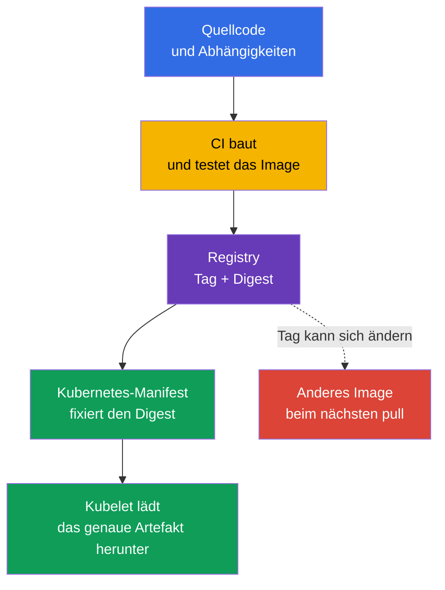
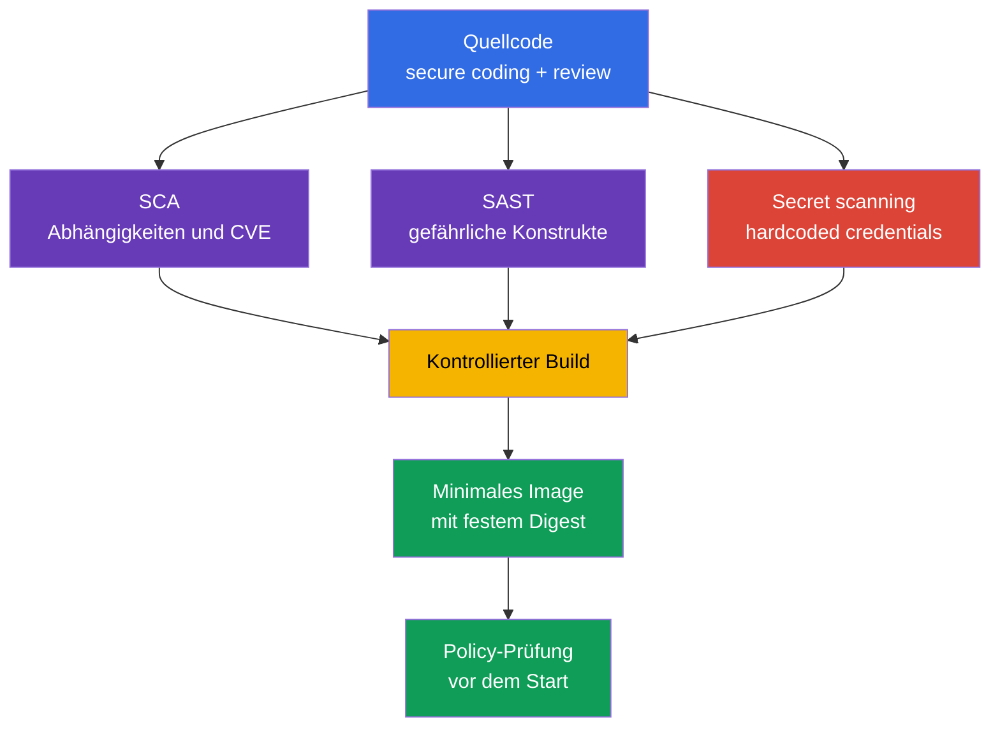

[Русская версия](ru.md) · [Eng version](README.md) · [Versión en español](es.md) · [Version française](fr.md) · [ქართული ვერსია](ge.md) · [繁體中文版](tw.md) · [日本語版](jp.md)

# Kapitel 06. Sicherheit von Artefakten, Images und Code

> **Wie geht es weiter?** In [Kapitel 05](../05/de.md) haben wir controls, Frameworks und die Isolierung von Workloads behandelt. Nun verfolgen wir den Weg einer Anwendung bis zum `Pod`: vom Quellcode und den Abhängigkeiten bis zum container image in der registry. Dies ist Teil der Domäne **Overview of Cloud Native Security** mit einer Gewichtung von 14 %. Ein sicherer Cluster kann ein bösartiges, anfälliges oder unvorhersehbar verändertes Image nicht ausgleichen.

Ein Container-Image ist ein ausführbares Bereitstellungsartefakt. Es enthält die Anwendung, ihre Runtime, Bibliotheken und Konfigurationsdateien. Daher beginnt Image-Sicherheit vor Kubernetes: mit Vertrauen in die registry, reproduzierbaren Builds, der Zusammensetzung der Abhängigkeiten und der Abwesenheit von secrets im Quellcode.

## 06.1 Registries, Tags, Digests und vertrauenswürdige Images

Eine **Container registry** speichert und verteilt container images. Kubernetes unterscheidet public und private registries hinsichtlich des Image-Formats nicht, wohl aber hinsichtlich Vertrauen und Zugriff.

- Eine **Public registry** ist über das Internet verfügbar. Sie ist praktisch für veröffentlichte Basis-Images, doch der Name des Autors oder die Popularität eines Repository beweisen nicht die Sicherheit des Inhalts.
- Eine **Private registry** beschränkt push und pull durch Benutzerkonten, Rollen oder Netzwerkzugriff. Sie hilft zu kontrollieren, wer interne Artefakte veröffentlicht und abruft, macht ein Image jedoch nicht automatisch sicher.
- Eine **Proxy- oder Mirror-registry** cached erlaubte externe Images. Ein solcher Endpunkt ermöglicht das Protokollieren von Downloads, das Beschränken der Quellenliste und verringert die Abhängigkeit von Builds vom externen Netzwerk.

Der Image-Pfad besteht aus registry, repository und einer Referenz auf eine konkrete Version. Beispielsweise ist bei `registry.example.internal/payments/api:v2.4.1` das Tag `v2.4.1` ein menschenlesbarer Name. Der Eintrag `registry.example.internal/payments/api@sha256:...` enthält einen digest, also einen kryptografischen Identifikator des konkreten Inhalts des Image-Manifests.

| Referenzmethode | Was wird festgelegt? | Hauptrisiko | Typische Verwendung |
|---|---|---|---|
| Tag, beispielsweise `v2.4.1` | Logischer Versionsname | Das Tag kann auf ein anderes Image verschoben werden | Praktische Navigation und Build-Phase |
| Mutable tag, beispielsweise `latest` oder `stable` | Nur der Kanalname | Dasselbe Manifest kann andere Bytes starten | Nicht als unveränderliches Production-Release verwenden |
| Digest, beispielsweise `@sha256:...` | Konkreter Image-Inhalt | Sagt allein nicht aus, wer und warum ihn gebaut hat | Deployment und überprüfbare Bereitstellung |

Ein Tag ist praktisch, aber veränderbar. Der Eigentümer des Repository kann `v2.4.1` löschen und dieses Tag einem neuen Image zuweisen. Beim nächsten pull erhält Kubernetes ein anderes Artefakt, obwohl sich YAML nicht geändert hat. Ein Digest löst genau das Identitätsproblem: Ein konkreter Digest verweist auf konkrete Bytes. Er bestätigt nicht, dass die Bytes sicher, geprüft oder von Ihrer Organisation gebaut wurden.



`imagePullPolicy: Always` macht ein Image nicht vertrauenswürdiger. Sie veranlasst kubelet lediglich, die registry bei jedem Start zu prüfen. Wenn die Referenz einen mutable tag verwendet, kann kubelet eine neue Version erhalten. Das Fixieren eines Digest macht das Ergebnis eindeutig; die Pull-Policy bestimmt, wann dessen Verfügbarkeit geprüft wird.

### Vertrauen in die Quelle

Ein **Trusted image** ist nicht bloß ein Image ohne gefundene CVEs. Es ist ein Artefakt, für das eine Organisation folgende Fragen beantworten kann: Woher stammt es, wer darf es veröffentlichen, wie wurde es gebaut, wurde es geprüft und ist es für diese Umgebung zugelassen?

Ein übliches Vertrauensmodell umfasst mehrere unabhängige controls:

1. Registries und Repositories über eine allowlist zulassen, nicht jede beliebige Internetadresse.
2. Push in das Production-repository auf separate service accounts und minimale Rechte beschränken.
3. Images mit einem Scanner auf bekannte Schwachstellen prüfen und Schweregrad, Ausnutzbarkeit sowie das Vorhandensein eines Fix berücksichtigen.
4. Artefakte signieren und die Signatur vor dem Start prüfen. Eine Signatur erzeugt eine kryptografische Aussage, die mit einem konkreten artifact/digest und einem signing key oder einer signing identity verknüpft ist. Bei der verification wendet das System separat eine trust policy an: Gilt dieser key/identity/issuer für dieses Artefakt als vertrauenswürdig? Eine Signatur beweist nicht das Fehlen von Schwachstellen und ersetzt weder provenance noch vulnerability scanning.
5. Den Digest im Deployment-Artefakt fixieren und Build-Informationen wie SBOM und provenance speichern.
6. Eine admission policy anwenden, die Images aus nicht zugelassenen Registries oder ohne erforderliche Signatur ablehnt.

Bei public registries bestehen zusätzliche Bedrohungen: typosquatting mit ähnlich klingenden Namen, ein übernommenes Herausgeberkonto, eine unerwartete Änderung eines Tags und die unklare Herkunft des base image. Bei private registries bleiben die Bedrohungen übermäßiger Push-Rechte, kompromittierter CI credential und fehlender Prüfung dessen, was tatsächlich in das repository gelangt ist.

> **Wichtig.** Der Eintrag `image: company/app:latest` bedeutet nicht „die sicherste Version“. `latest` ist ein gewöhnliches Tag ohne besondere Kubernetes-Semantik. Es ist häufig mutable, gibt keine Version an und erschwert die Untersuchung: Nach einem Vorfall lässt sich schwer feststellen, welches Image tatsächlich lief.

## 06.2 Minimale Images: distroless, scratch und Multi-stage build

Jedes Paket im final image vergrößert die Angriffsfläche: Es kann CVEs, ausführbare Dienstprogramme, Konfiguration und abhängige Bibliotheken enthalten. Die Minimierung eines Images reduziert die Anzahl der Komponenten, behebt jedoch keine Schwachstelle der Anwendung und ersetzt weder `SecurityContext`, Netzwerkisolierung noch runtime detection.

### Basisvarianten

| Grundlage des final image | Inhalt | Wann nützlich | Einschränkung |
|---|---|---|---|
| `scratch` | Leeres Dateisystem | Statisch kompiliertes binary mit bekannten Anforderungen | Kein shell, CA bundle, timezone data und dynamic loader |
| distroless | Erforderliche language runtime und Bibliotheken ohne shell/package manager | Runtime einer Anwendung, die keine interaktiven Dienstprogramme benötigt | Debugging über `kubectl exec -- sh` ist normalerweise nicht möglich |
| Vollständiges Linux image | Shell, package manager und breites Paketangebot | Begründete Diagnose oder spezifische Runtime-Abhängigkeiten | Mehr Komponenten und Möglichkeiten nach einer Kompromittierung |

`distroless` bedeutet, dass im Image ein minimaler Satz zum Starten der Anwendung verbleibt, jedoch normalerweise kein shell und kein Paketmanager vorhanden sind. Dies erschwert einem Angreifer die Post-Exploitation nach RCE: Er erhält kein sofort verfügbares `sh`, `curl`, `wget` und keinen package manager. Das ist keine Garantie: Der Anwendungsprozess kann weiterhin verfügbare Dateien lesen, auf das Netzwerk zugreifen und seine Privilegien nutzen.

`scratch` ist eine leere Basis. Sie eignet sich nicht „für jedes kleine Image“, sondern für eine Anwendung, die ohne dynamische Bibliotheken und fehlende Runtime-Dateien läuft. Beispielsweise kann ein statisches Go binary für TLS ein CA bundle benötigen und manche Anwendungen brauchen timezone data oder andere Dateien, die in `scratch` fehlen; diese müssen explizit hinzugefügt oder eingehängt werden. Die DNS-Konfiguration eines Pod stellt in Kubernetes normalerweise kubelet über `/etc/resolv.conf` bereit, weshalb sie nicht als Datei angeführt werden sollte, die automatisch in das final image aufgenommen werden muss. Sicherheit darf nicht durch das zufällige Entfernen erforderlicher Komponenten erreicht werden.

### Multi-stage build

Builder, Compiler, Testwerkzeuge und Quellcode werden in der Build-Phase benötigt, beim Start jedoch normalerweise nicht. Ein **Multi-stage build** trennt diese Aufgaben: Der erste stage erzeugt das artifact, der zweite enthält nur die Runtime und erforderliche Dateien.

```dockerfile
# Die Build-Phase enthält Compiler und Quellcode.
FROM golang:1.27.1 AS build
WORKDIR /src
COPY . .
RUN CGO_ENABLED=0 go build -o /out/api ./cmd/api

# Das Final image erhält nur das fertige binary.
FROM scratch
COPY --from=build /out/api /api
USER 65532:65532
ENTRYPOINT ["/api"]
```

Das Beispiel zeigt ein Prinzip, kein universelles Rezept. Versionen des base image, Abhängigkeiten und die Build-Methode werden gemäß der Organisationsrichtlinie ausgewählt. Für eine Anwendung mit dynamischen Bibliotheken kann statt `scratch` eine distroless runtime nötig sein. Separat werden Start, TLS-Verbindung, DNS, Schreibrechte und die Ausführung als nicht privilegierter Benutzer geprüft.

| Was nicht unnötig in den final stage gelangen sollte | Warum ist das wichtig? |
|---|---|
| Compiler, package manager, Test-Frameworks | Neue CVEs und Werkzeuge für Post-Exploitation |
| Quellcode und `.git` | Risiko der Offenlegung von Logik, Schlüsseln und Änderungshistorie |
| Temporäre Build-Dateien und Caches | Vergrößern das Image und können credentials enthalten |
| Shell und administrative Dienstprogramme | Erleichtern interaktive Aktionen nach RCE |

Ein minimales Image erfordert eine andere betriebliche Disziplin. Man kann sich nicht darauf verlassen, dass ein Engineer stets in den Container geht und ein Dienstprogramm installiert. Observability wird über Logs, Metriken und Traces aufgebaut sowie bei Bedarf über einen temporären debug container mit kontrollierten Rechten. Dieser Ansatz ist sowohl für den Betrieb als auch für die Sicherheit nützlich.

## 06.3 Sicherheit von Code, Abhängigkeiten und Secrets

Ein Image übernimmt die Risiken des Quellcodes. Selbst eine perfekt konfigurierte private registry verhindert weder SQL injection, SSRF, unsichere Deserialisierung noch eine Abhängigkeit mit einer bekannten kritischen Schwachstelle. Daher umfasst die Sicherheit eines Workloads secure coding und die Kontrolle des Lebenszyklus von Abhängigkeiten.

### Secure coding als Kontrolle vor dem Container

**Secure coding** ist eine Gruppe von Engineering-Praktiken, die die Wahrscheinlichkeit von Schwachstellen vor Build und Start verringern. Für KCSA ist es wichtig, den Zweck dieser Praktiken zu verstehen:

- Eingabedaten validieren und sichere APIs statt manueller Zeichenkettenverarbeitung verwenden;
- Authentifizierung und Autorisierung in der Anwendung prüfen, statt das Netzwerk als vertrauenswürdig anzusehen;
- Fehler behandeln, ohne dem Benutzer token, stack trace oder interne Konfiguration offenzulegen;
- Den Zugriff der Anwendung auf Netzwerk, Dateisystem und cloud credentials nach dem Prinzip least privilege beschränken;
- Code reviews durchführen und Fixes der verwendeten Bibliotheken pflegen.

Static application security testing oder **SAST** analysiert Quellcode oder compiled code ohne dessen Ausführung. Eine solche Analyse kann auf einen gefährlichen API-Aufruf, Injection, hardcoded secret oder unsichere Konfiguration hinweisen. Sie verringert die Fehlerwahrscheinlichkeit, doch ihre Ergebnisse erfordern Kontext: Nicht jede Warnung ist ausnutzbar, und nicht jeder logische Fehler ist für einen statischen Analyzer sichtbar.

### Abhängigkeiten und SCA

Eine moderne Anwendung umfasst direkte und transitive Abhängigkeiten: language packages, OS-Pakete, base image und Plugins. **Software Composition Analysis** oder SCA erstellt ein Inventar der Abhängigkeiten und gleicht Versionen mit bekannten Schwachstellen, Lizenzen und Organisationsrichtlinien ab.

SCA beantwortet folgende Fragen:

- Welche Bibliothek und welche Version ist im artifact enthalten?
- Gibt es eine bekannte CVE für diese Version?
- Gibt es eine korrigierte Version?
- Ist die Abhängigkeit transitiv?
- Entspricht die Lizenz den Regeln der Organisation?

SCA ist nicht dasselbe wie das Scannen eines container image, auch wenn sich die Bereiche überschneiden. SCA betrachtet in erster Linie die composition der Anwendung. Ein Image scanner analysiert gewöhnlich OS-Pakete und Bibliotheken im gebauten image. Ein zuverlässiger Prozess nutzt beide Perspektiven und betrachtet einen Bericht ohne gefundene CVEs nicht als Beweis vollständiger Sicherheit.

Ein Lock file legt aufgelöste Versionen von Abhängigkeiten fest und hilft, den Build reproduzierbar zu machen. Sein Vorhandensein macht Updates nicht überflüssig: Eine Abhängigkeit kann erst nach der Erstellung des Lock file verwundbar werden. Deshalb sind regelmäßige Prüfungen in CI und ein klarer Prozess zur Bewertung und Behebung von Findings sinnvoll.

### Secrets dürfen nicht im Code und Image leben

Ein hardcoded password, API key, private key oder cloud token landet häufig in Git history, CI log, Docker layer oder einem veröffentlichten image. Das Entfernen einer Zeile im nächsten Commit reicht nicht aus: Das secret kann in der history des repository, im CI-Cache oder in einem bereits hochgeladenen Image-Layer verbleiben.

Die richtige Reaktion auf ein gefundenes secret:

1. Credential unverzüglich widerrufen oder ersetzen. Das secret muss als kompromittiert gelten.
2. Es aus Code, Build-Konfiguration und Logs entfernen.
3. Die History, Artefakte und Zugriffe prüfen, in denen es gespeichert worden sein könnte.
4. Secrets dem Workload über einen vorgesehenen Mechanismus bereitstellen: Kubernetes `Secret` mit eingeschränktem RBAC oder einen externen secret manager.
5. Secret scanning und Review-Regeln hinzufügen, um den Fehler nicht zu wiederholen.

Kubernetes `Secret` macht das Speichern eines Schlüssels in einem Dockerfile nicht zulässig. Wenn ein secret über `ARG`, `ENV` übergeben oder in ein Image kopiert wird, kann es in Metadaten oder Layern verfügbar sein. Secrets benötigt die Anwendung während der Laufzeit und nicht als dauerhaften Bestandteil des Images.



## 06.4 Die Rolle von Images und Code im 4C-Modell und in Platform Security

Im 4C-Modell aus [Kapitel 03](../03/de.md) gehört das Image vor allem zur Schicht **Container**, Quellcode und Abhängigkeiten gehören zur Schicht **Code**. Äußere Schichten ersetzen innere nicht:

- Cloud IAM behebt kein hardcoded secret im Repository.
- RBAC im Cluster macht ein mutable tag nicht unveränderlich.
- `NetworkPolicy` entfernt keine CVE aus dem base image.
- Ein minimales image beschränkt keine übermäßigen Rechte eines service account.

Daher wird Schutz schichtweise aufgebaut. Code wird vor dem Build geprüft, CI erzeugt ein bekanntes artifact, die registry kontrolliert Speicherung und Verteilung, und Kubernetes prüft, was genau zum Start zugelassen wird. Bei der Kompromittierung eines controls verringern die übrigen die Folgen.

Kapitel 06 erklärt eingehende Artefakte auf der Ebene Overview of Cloud Native Security. In [Kapitel 17](../17/de.md) wird das Thema aus Sicht von Platform Security fortgesetzt: supply chain, SBOM, Signaturen, image repository und admission control. Dort entscheidet die Organisation, wie sie Vertrauen in Digest und Herausgeber in eine Regel umwandelt, die Kubernetes vor der Erstellung eines `Pod` anwendet.

| 4C-Schicht | Sicherheitsfrage | Beispiel für ein Control |
|---|---|---|
| Code | Enthält die Anwendung Fehler, anfällige Abhängigkeiten oder secrets? | Review, SAST, SCA, secret scanning |
| Container | Was wird tatsächlich gestartet und wie viele überflüssige Komponenten enthält es? | Minimal base, multi-stage build, scanner, digest |
| Cluster | Lässt der Cluster ein ungeeignetes artifact zu? | Admission policy, allowlist registry, RBAC |
| Cloud | Wer kann registry und CI credentials lesen? | IAM, private endpoint, audit logging |

## 06.5 Praktische Anwendung

Das Platform-Team formuliert üblicherweise einen grundlegenden Bereitstellungsprozess und die Produktteams folgen ihm in CI/CD:

1. Sie verwenden genehmigte base images aus einer controlled registry und aktualisieren sie regelmäßig.
2. Sie bauen das Image in CI und führen Tests, SAST, SCA, secret scanning und image scanning aus.
3. Sie veröffentlichen das Ergebnis in einer private registry mit minimalen Rechten für den service account.
4. Sie speichern Digest, SBOM und Build-Informationen zusammen mit dem Release.
5. Im Deployment für Production fixieren sie den Digest statt `:latest`.
6. Admission control erlaubt nur genehmigte Registries und verlangt, wo vorgesehen, eine Signatur oder andere attestations.
7. Bei einer gefundenen CVE bewerten sie die tatsächliche Exposition, die Verfügbarkeit eines Fix und die Kritikalität des Workloads und aktualisieren anschließend die Abhängigkeit oder das base image.

Auf Associate-Ebene ist es nützlich, Mittel und Garantie zu unterscheiden. Ein Scanner findet bekannte Probleme, aber nicht alle Schwachstellen. Eine erfolgreiche verification bestätigt, dass die kryptografische Aussage über das geprüfte artifact unter dem erwarteten signing key/identity validiert wird; das Vertrauen in den signer wird durch eine separate verification policy bestimmt. Sie beweist nicht das Fehlen eines Defekts. Eine private registry beschränkt den Zugriff, ersetzt aber kein Review. Die Kombination der controls bildet defense in depth.

## 06.6 Exam vocabulary / Mini-Glossar

| Begriff | Bedeutung |
|---|---|
| Artifact | Bereitstellungsergebnis, beispielsweise ein container image, SBOM oder signiertes Manifest. |
| Container registry | Dienst zum Speichern und Verteilen von container images. |
| Digest | Unveränderlicher kryptografischer Identifikator des konkreten Inhalts eines image. |
| Distroless | Minimales Runtime-Image ohne übliches shell und package manager. |
| Image tag | Menschenlesbare Image-Markierung, die geändert werden kann. |
| Multi-stage build | Build mit getrenntem builder stage und minimalem final stage. |
| SAST | Statische Codeanalyse ohne Ausführung der Anwendung. |
| SCA | Analyse der Softwarezusammensetzung und ihrer Abhängigkeiten. |
| Secret scanning | Suche nach credentials und anderen secrets in Code, History und Artefakten. |
| Trusted image | Image mit überprüfbarer Herkunft und einer Reihe von Vertrauens-controls. |

## 06.7 Exam Essentials / Zusammenfassung des Kapitels

- Eine Registry speichert Images, stellt aber selbst kein Vertrauen in sie her. Public und private registries benötigen Kontrolle von Quelle, Zugriff und Veröffentlichung.
- Ein Tag ist für Menschen praktisch, kann aber mutable sein. Ein Digest fixiert ein konkretes artifact und ist für Production-Deployments vorzuziehen.
- `:latest` ist ein gewöhnliches veränderbares Tag, kein Zeichen für Sicherheit oder Aktualität.
- Multi-stage build und minimal image reduzieren die Angriffsfläche, ersetzen jedoch weder Anwendungssicherheit noch runtime controls.
- Secure coding, SAST, SCA und secret scanning schützen die Schicht Code vor dem Containerstart.
- Ein secret kann nicht als sicher gelten, wenn es in Git, Dockerfile, CI log oder image layer gelangt ist. Ein gefundenes credential wird widerrufen und ersetzt.
- Der Schutz von Container und Code ist mit Platform Security verbunden: Ein vertrauenswürdiges artifact muss zusätzlich geprüft und zum Start zugelassen werden.

## 06.8 Nicht verwechseln und typische Prüfungsfragen

In KCSA-Fragen werden häufig mehrere nützliche Maßnahmen vorgeschlagen und nach der genauesten für die vorgegebene Bedrohung gefragt.

- Für einen reproduzierbaren Start wählt man einen **digest**, nicht ein tag. Ein Digest gewährleistet die Inhaltsidentität, ersetzt jedoch weder Signatur noch Scanning.
- `latest` bedeutet nicht „das letzte geprüfte release“. Es ist ein mutable tag, das Vorhersagbarkeit und Untersuchung verschlechtert.
- `scratch` und distroless reduzieren die Zusammensetzung des Images, sind aber keine sandbox und verhindern nicht alle Folgen von RCE.
- SCA bezieht sich auf die Zusammensetzung der Abhängigkeiten; SAST analysiert Code; secret scanning sucht credentials. Die Werkzeuge ergänzen sich.
- Eine private registry beschränkt den Zugriff auf Images, doch Vertrauen hängt auch von publisher, CI, Scanning, Signatur und policy ab.

## 06.9 Fragen zur Selbstkontrolle

### 1. Welche Methode zur Referenzierung eines Image fixiert am besten einen konkreten Satz von Bytes für ein Production-Deployment?

   - a. `registry.example/app:stable`

   - b. `registry.example/app:latest`

   - c. Jedes tag bei `imagePullPolicy: Always`

   - d. `registry.example/app@sha256:...`

<details>
<summary>Antwort und Erläuterung</summary>

**Richtige Antwort: d.** Ein Digest identifiziert den konkreten Inhalt eines image. `latest` und `stable` sind Tags und können neu zugewiesen werden. `imagePullPolicy: Always` prüft die registry, macht ein mutable tag jedoch nicht unveränderlich.

</details>

### 2. Was beschreibt `:latest` am genauesten?

   - a. Ein unveränderlicher Digest des letzten Builds.

   - b. Ein gewöhnliches Tag, das zu unterschiedlichen Zeiten auf verschiedene Images zeigen kann.

   - c. Ein spezieller Kubernetes-Modus, der das neueste sichere Image garantiert.

   - d. Eine Policy, die den Start ohne Signatur untersagt.

<details>
<summary>Antwort und Erläuterung</summary>

**Richtige Antwort: b.** Kubernetes verleiht `latest` keine besonderen Vertrauenseigenschaften. Es ist ein Tag, normalerweise mutable. Es teilt nicht mit, welche konkreten Bytes gestartet wurden, und ersetzt keine verification.

</details>

### 3. Welche Aussage über Multi-stage build ist richtig?

   - a. Er bewahrt compiler, Quellcode und build cache im final image auf, damit der Production-Container den Build wiederholen kann.

   - b. Er signiert das final image automatisch und ersetzt damit eine separate artifact signature verification.

   - c. Er macht SCA und image scanning unnötig, weil Abhängigkeiten automatisch zwischen den build stages geprüft werden.

   - d. Er baut das artifact im builder stage und kopiert in den final stage nur die notwendigen Runtime-Dateien und Abhängigkeiten.

<details>
<summary>Antwort und Erläuterung</summary>

**Richtige Antwort: d.** Ein Multi-stage build ermöglicht, build-only tooling, Quellcode und Zwischendaten im builder stage zu lassen und in das final image nur erforderliche runtime artifacts und dependencies zu übertragen. Signatur, SCA und image scanning bleiben separate controls.

</details>

### 4. Wofür wird SCA in erster Linie eingesetzt?

   - a. Zur Analyse von Runtime-Netzwerkflüssen zwischen `Pod` und zur Feststellung tatsächlich aufgebauter Verbindungen.
   - b. Zur Inventarisierung von software dependencies und zum Abgleich ihrer Versionen mit bekannten vulnerabilities und policy.
   - c. Zur Bereitstellung eines interaktiven shell in Containern, in denen die üblichen debugging tools fehlen.
   - d. Zur Verschlüsselung von Kubernetes-`Secret`-Daten vor der Speicherung von API-Objekten in `etcd`.

<details>
<summary>Antwort und Erläuterung</summary>

**Richtige Antwort: b.** SCA analysiert die Softwarezusammensetzung: direkte und transitive Abhängigkeiten, ihre Versionen, bekannte Schwachstellen sowie oft Lizenzen/policy. Runtime network visibility, debugging und encryption at rest lösen andere Aufgaben.

</details>

### 5. In einem Git-Repository wurde ein aktiver cloud API key gefunden. Was sollte die vorrangige Maßnahme sein?

   - a. Die Zeile im nächsten Commit löschen und den Schlüssel weiterverwenden.

   - b. Den Schlüssel in base64 kodieren und im repository speichern.

   - c. Den Schlüssel widerrufen oder ersetzen, ihn dann aus dem Code entfernen und History sowie Artefakte prüfen.

   - d. Den Schlüssel zum `Dockerfile` hinzufügen, damit CI ihn nicht verliert.

<details>
<summary>Antwort und Erläuterung</summary>

**Richtige Antwort: c.** Das secret muss als kompromittiert gelten: Es kann in Git-History, Caches, Logs oder einem Image gelandet sein. Das Löschen der Zeile hebt bereits gewährten Zugriff nicht auf. Base64 ist kein Schutz.

</details>

> **Wie geht es weiter?** Zur praktischen Image-Minimierung gehen Sie zu Kapitel 24 CKS. Die supply chain, SBOM und registry behandelt Kapitel 25 CKS, Signaturen Kapitel 26 CKS, statische Analyse Kapitel 27 CKS und image scanning Kapitel 28 CKS. Konzepte zu supply chain und admission control auf KCSA-Ebene werden in [Kapitel 17](../17/de.md) fortgesetzt.

[Inhaltsverzeichnis](../README_DE.md) · [Kapitel 05](../05/de.md) · [Kapitel 07](../07/de.md)