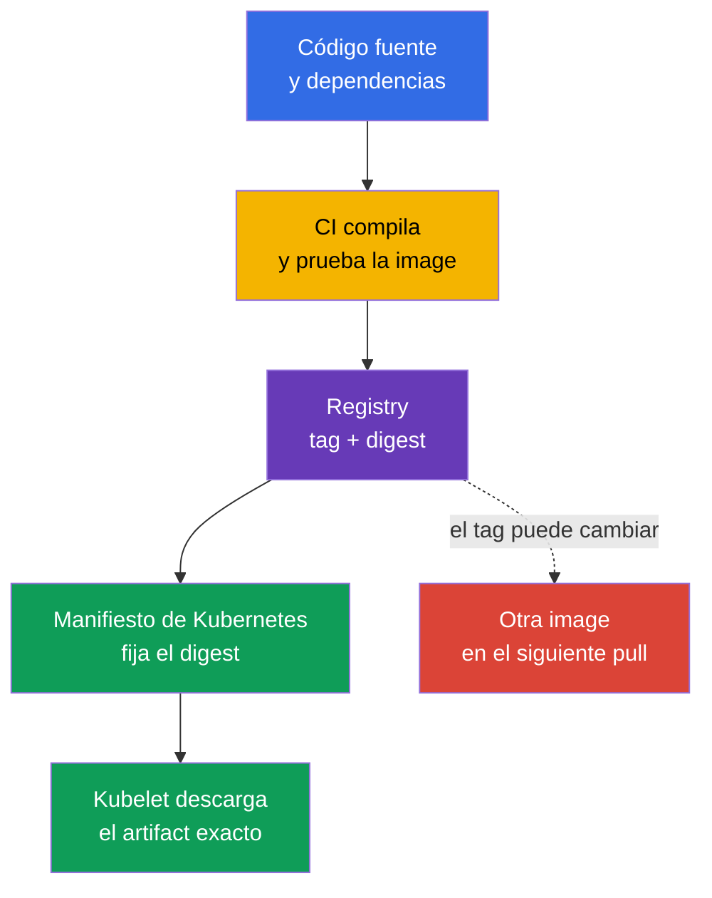
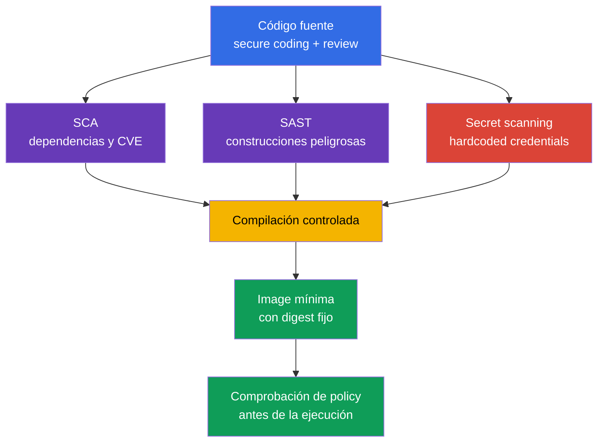

[Русская версия](ru.md) · [Eng version](README.md) · [Version française](fr.md) · [Deutsche Version](de.md) · [ქართული ვერსია](ge.md) · [繁體中文版](tw.md) · [日本語版](jp.md)

# Capítulo 06. Seguridad de artefactos, imágenes y código

> **Qué sigue.** En el [capítulo 05](../05/es.md) examinamos controles, marcos y aislamiento de cargas de trabajo. Ahora seguiremos el recorrido de una aplicación hasta el `Pod`: desde el código fuente y las dependencias hasta la container image en el registry. Esta es una parte del dominio **Overview of Cloud Native Security** con un peso del 14%. Un clúster seguro no compensa una imagen maliciosa, vulnerable o modificada de forma impredecible.

La imagen de contenedor es un artefacto de entrega ejecutable. Contiene la aplicación, su runtime, bibliotecas y archivos de configuración. Por ello, la seguridad de la imagen comienza antes de Kubernetes: con la confianza en el registry, una compilación reproducible, la composición de las dependencias y la ausencia de secretos en el código fuente.

## 06.1 Registros, tags, digests e imágenes confiables

Un **Container registry** almacena y distribuye container images. Kubernetes no distingue entre un registry público y uno privado desde el punto de vista del formato de imagen, pero sí desde el punto de vista de la confianza y el acceso.

- Un **Public registry** está disponible desde Internet. Es útil para publicar imágenes base, pero el nombre del autor o la popularidad del repository no demuestran la seguridad de su contenido.
- Un **Private registry** restringe el push y el pull mediante cuentas, roles o acceso de red. Ayuda a controlar quién publica y quién obtiene artefactos internos, pero no hace que una imagen sea segura automáticamente.
- Un **Proxy o mirror registry** almacena en caché imágenes externas permitidas. Este punto permite registrar las descargas, limitar la lista de fuentes y reducir la dependencia de las compilaciones respecto de la red externa.

La ruta de una imagen consta de registry, repository y una referencia a una versión concreta. Por ejemplo, en `registry.example.internal/payments/api:v2.4.1`, el tag `v2.4.1` es un nombre legible para personas. En la entrada `registry.example.internal/payments/api@sha256:...` se indica un digest, es decir, un identificador criptográfico del contenido concreto del manifiesto de imagen.

| Forma de referencia | Qué fija | Riesgo principal | Uso típico |
|---|---|---|---|
| Tag, por ejemplo `v2.4.1` | Nombre lógico de la versión | El tag puede desplazarse a otra imagen | Navegación práctica y etapa de compilación |
| Mutable tag, por ejemplo `latest` o `stable` | Solo el nombre del canal | El mismo manifiesto puede ejecutar bytes distintos | No usar como release de production inmutable |
| Digest, por ejemplo `@sha256:...` | Contenido concreto de la imagen | Por sí solo no indica quién ni por qué la compiló | Deployment y entrega verificable |

Un tag es práctico, pero mutable. El propietario del repository puede eliminar `v2.4.1` y asignar ese tag a una image nueva. En el siguiente pull, Kubernetes obtendrá un artefacto distinto aunque el YAML no haya cambiado. El digest resuelve precisamente el problema de identidad: un digest concreto apunta a bytes concretos. No confirma que esos bytes sean seguros, estén verificados o hayan sido compilados por su organización.



`imagePullPolicy: Always` no hace que una imagen sea más confiable. Solo obliga a kubelet a comprobar el registry en cada inicio. Si la referencia usa un mutable tag, kubelet puede obtener una versión nueva. Fijar el digest hace que el resultado sea inequívoco; la política de pull determina cuándo comprobar su disponibilidad.

### Confianza en la fuente

Una **Trusted image** no es solo una imagen sin CVE detectadas. Es un artefacto para el cual la organización puede responder a las preguntas: de dónde procede, quién tiene derecho a publicarlo, cómo se compiló, si se verificó y si está permitido para este entorno.

Un modelo de confianza habitual incluye varios controles independientes:

1. Permitir registry y repository mediante allowlist, no cualquier dirección de Internet.
2. Restringir el push al production repository a service accounts independientes y con privilegios mínimos.
3. Comprobar la imagen con un scanner para detectar vulnerabilidades conocidas y considerar la criticidad, la explotabilidad y la disponibilidad de una corrección.
4. Firmar artefactos y verificar la firma antes de ejecutarlos. La firma crea una afirmación criptográfica vinculada a un artifact/digest concreto y a una signing key o signing identity. Durante la verification, el sistema aplica por separado una trust policy: si dicha key/identity/issuer se considera confiable para ese artefacto. La firma no demuestra la ausencia de vulnerabilidades ni sustituye la provenance o el vulnerability scanning.
5. Fijar el digest en el artefacto de deployment y conservar información sobre la compilación, por ejemplo SBOM y provenance.
6. Aplicar una admission policy que rechace imágenes de registry no permitidos o sin la firma requerida.

Un public registry tiene amenazas adicionales: typosquatting con un nombre similar, una cuenta de publicador comprometida, un cambio inesperado de tag y un origen incierto de la base image. En un private registry siguen existiendo las amenazas de privilegios excesivos para push, compromiso de CI credential y ausencia de verificación de lo que llegó realmente al repository.

> **Importante.** La entrada `image: company/app:latest` no significa «la versión más segura». `latest` es un tag normal sin semántica especial en Kubernetes. Con frecuencia es mutable, no indica la versión y dificulta la investigación: después de un incidente es difícil establecer qué image se ejecutó realmente.

## 06.2 Imágenes mínimas: distroless, scratch y multi-stage build

Cada paquete en la final image aumenta la superficie de ataque: puede tener CVE, utilidades ejecutables, configuración y bibliotecas dependientes. Minimizar la imagen reduce el número de componentes, pero no corrige una vulnerabilidad de la aplicación ni sustituye `SecurityContext`, el aislamiento de red o el runtime detection.

### Opciones base

| Base de la final image | Contenido | Cuándo es útil | Limitación |
|---|---|---|---|
| `scratch` | Sistema de archivos vacío | Binary compilado estáticamente con necesidades conocidas | No hay shell, CA bundle, timezone data ni dynamic loader |
| distroless | Language runtime y bibliotecas necesarios sin shell/package manager | Runtime de una aplicación que no requiere utilidades interactivas | La depuración mediante `kubectl exec -- sh` normalmente es imposible |
| Linux image completo | Shell, package manager y un amplio conjunto de paquetes | Diagnóstico justificado o dependencias específicas de runtime | Más componentes y capacidades después de un compromiso |

`distroless` significa que en la imagen queda el conjunto mínimo para ejecutar la aplicación, pero normalmente no hay shell ni gestor de paquetes. Esto dificulta la postexplotación de un atacante después de RCE: no obtiene `sh`, `curl`, `wget` ni package manager ya preparados. No es una garantía: el proceso de la aplicación todavía puede leer archivos disponibles, acceder a la red y utilizar sus privilegios.

`scratch` es una base vacía. No es adecuada «para cualquier imagen pequeña», sino para una aplicación que se ejecuta sin bibliotecas dinámicas ni archivos de runtime ausentes. Por ejemplo, un Go binary estático para TLS puede necesitar un CA bundle, y algunas aplicaciones necesitan timezone data u otros archivos que no están en `scratch`; deben añadirse o montarse explícitamente. En Kubernetes, kubelet suele proporcionar la configuración DNS del Pod mediante `/etc/resolv.conf`, por lo que no debe citarse como un archivo que deba incluirse automáticamente en la final image. La seguridad no debe lograrse eliminando por accidente componentes necesarios.

### Multi-stage build

El builder, el compilador, las herramientas de prueba y el código fuente son necesarios durante la etapa de build, pero normalmente no son necesarios en tiempo de ejecución. Un **Multi-stage build** separa estas responsabilidades: el primer stage crea el artifact y el segundo contiene únicamente el runtime y los archivos necesarios.

```dockerfile
# La etapa de compilación contiene el compilador y el código fuente.
FROM golang:1.27.1 AS build
WORKDIR /src
COPY . .
RUN CGO_ENABLED=0 go build -o /out/api ./cmd/api

# La final image recibe solo el binary terminado.
FROM scratch
COPY --from=build /out/api /api
USER 65532:65532
ENTRYPOINT ["/api"]
```

El ejemplo muestra el principio, no una receta universal. Las versiones de la base image, las dependencias y el método de compilación se eligen de acuerdo con la política de la organización. Para una aplicación con bibliotecas dinámicas, en lugar de `scratch` puede requerirse un distroless runtime. Por separado se comprueban el inicio, la conexión TLS, DNS, los permisos de escritura y la ejecución con un usuario sin privilegios.

| Lo que no debe llegar al final stage sin necesidad | Por qué es importante |
|---|---|
| Compiladores, package manager, frameworks de prueba | Nuevas CVE y herramientas para postexplotación |
| Código fuente y `.git` | Riesgo de revelar lógica, claves e historial de cambios |
| Archivos temporales de compilación y cachés | Aumentan la imagen y pueden contener credentials |
| Shell y utilidades administrativas | Facilitan acciones interactivas después de RCE |

Una imagen mínima requiere otra disciplina operativa. No se puede contar con que un ingeniero siempre entre al contenedor e instale una utilidad. La observabilidad se construye mediante logs, métricas, trazas y, cuando es necesario, un debug container temporal con permisos controlados. Este enfoque es útil tanto para operaciones como para seguridad.

## 06.3 Seguridad del código, las dependencias y los secretos

La imagen hereda los riesgos del código fuente. Incluso un private registry configurado a la perfección no detendrá SQL injection, SSRF, deserialización insegura o una dependencia con una vulnerabilidad crítica conocida. Por ello, la seguridad de la carga de trabajo incluye secure coding y el control del ciclo de vida de las dependencias.

### Secure coding como control antes del contenedor

El **Secure coding** es un conjunto de prácticas de ingeniería que reducen la probabilidad de vulnerabilidades antes de la compilación y la ejecución. Para KCSA, es importante comprender el propósito de estas prácticas:

- validar los datos de entrada y utilizar API seguras en lugar de procesar cadenas manualmente;
- comprobar la autenticación y la autorización en la aplicación, sin considerar confiable la red;
- manejar errores sin exponer al usuario un token, stack trace o configuración interna;
- limitar el acceso de la aplicación a la red, el sistema de archivos y los cloud credentials según el principio de least privilege;
- realizar code review y mantener actualizadas las bibliotecas utilizadas.

Static application security testing, o **SAST**, analiza código fuente o compiled code sin ejecutarlo. Este análisis puede señalar una llamada API peligrosa, una inyección, un hardcoded secret o una configuración insegura. Reduce la probabilidad de un error, pero sus resultados requieren contexto: no todas las advertencias son explotables y no todos los errores lógicos son visibles para un analizador estático.

### Dependencias y SCA

Una aplicación moderna incluye dependencias directas y transitivas: language packages, paquetes de SO, base image y plugins. **Software Composition Analysis**, o SCA, crea un inventario de dependencias y compara las versiones con vulnerabilidades conocidas, licencias y políticas de la organización.

SCA responde a las preguntas:

- qué biblioteca y qué versión están incluidas en el artifact;
- si existe una CVE conocida para esta versión;
- si hay una versión corregida;
- si la dependencia es transitiva;
- si la licencia cumple las normas de la organización.

SCA no equivale al escaneo de una container image, aunque las áreas se solapan. SCA considera ante todo la composition de la aplicación. Un image scanner normalmente analiza los paquetes de SO y las bibliotecas de la image compilada. Un proceso confiable utiliza ambas perspectivas y no considera un informe con cero CVE detectadas como prueba de seguridad completa.

Un lock file fija las versiones resueltas de las dependencias y ayuda a hacer repetible la compilación. Su existencia no elimina la necesidad de actualizaciones: una dependencia puede volverse vulnerable después de crear el lock file. Por ello, en CI son útiles las comprobaciones periódicas y un proceso claro para evaluar y corregir los hallazgos.

### Los secretos no deben vivir en el código ni en la imagen

Un hardcoded password, API key, private key o cloud token suele terminar en el Git history, CI log, Docker layer o image publicada. Eliminar una línea en el siguiente commit no basta: el secreto puede permanecer en el historial del repository, en la caché de CI o en una image layer ya cargada.

La respuesta correcta ante un secreto encontrado:

1. Revocar o sustituir inmediatamente el credential. El secreto debe considerarse comprometido.
2. Eliminarlo del código, la configuración de compilación y los logs.
3. Comprobar el historial, los artefactos y los accesos donde pudo haberse conservado.
4. Entregar los secretos a la carga de trabajo mediante el mecanismo destinado a ello: Kubernetes `Secret` con RBAC restringido o un secret manager externo.
5. Añadir secret scanning y reglas de review para no repetir el error.

Kubernetes `Secret` no hace aceptable almacenar una clave en un Dockerfile. Si el secreto se entrega mediante `ARG`, `ENV` o se copia a una image, puede quedar disponible en metadata o layers. Los secretos los necesita la aplicación durante la ejecución, no como parte permanente de la imagen.



## 06.4 Lugar de las imágenes y el código en el modelo 4C y Platform Security

En el modelo 4C del [capítulo 03](../03/es.md), la imagen pertenece ante todo a la capa **Container**, y el código fuente y las dependencias pertenecen a la capa **Code**. Las capas externas no sustituyen a las internas:

- Cloud IAM no corrige un hardcoded secret en el repositorio.
- RBAC en el clúster no hace inmutable un mutable tag.
- `NetworkPolicy` no elimina una CVE de la base image.
- Una image mínima no restringe los privilegios excesivos de una service account.

Por ello, la protección se construye por capas. El código se comprueba antes de la compilación, CI forma un artifact conocido, el registry controla el almacenamiento y la distribución, y Kubernetes verifica qué se permite ejecutar exactamente. Si un control se ve comprometido, los demás reducen las consecuencias.

El capítulo 06 explica los artefactos entrantes en el nivel de Overview of Cloud Native Security. En el [capítulo 17](../17/es.md), el tema continuará desde la perspectiva de Platform Security: supply chain, SBOM, firmas, image repository y admission control. Allí, la organización decide cómo convertir la confianza en el digest y el publicador en una regla que Kubernetes aplica antes de crear un `Pod`.

| Capa 4C | Pregunta de seguridad | Ejemplo de control |
|---|---|---|
| Code | ¿La aplicación contiene errores, dependencias vulnerables o secrets? | Review, SAST, SCA, secret scanning |
| Container | ¿Qué se ejecuta realmente y cuántos componentes innecesarios contiene? | Base mínima, multi-stage build, scanner, digest |
| Cluster | ¿El clúster permitirá un artifact inadecuado? | Admission policy, allowlist registry, RBAC |
| Cloud | ¿Quién puede leer el registry y los credentials de CI? | IAM, private endpoint, audit logging |

## 06.5 Cómo se aplica en la práctica

El equipo de plataforma suele definir un proceso básico de entrega, y los equipos de producto lo siguen en CI/CD:

1. Utilizan base images aprobadas de un controlled registry y las actualizan periódicamente.
2. Compilan la image en CI, ejecutan pruebas, SAST, SCA, secret scanning e image scanning.
3. Publican el resultado en un private registry con service accounts de privilegios mínimos.
4. Conservan el digest, SBOM y la información de compilación junto al release.
5. En el deployment de production fijan el digest, no `:latest`.
6. Admission control permite solo registry aprobados y, donde corresponda, requiere una firma u otras attestations.
7. Para una CVE detectada, evalúan la exposición real, la disponibilidad de una corrección y la criticidad de la carga de trabajo, y después actualizan la dependencia o la base image.

En el nivel associate, es útil distinguir una herramienta de una garantía. Un scanner detecta problemas conocidos, pero no todas las vulnerabilidades. Una verification satisfactoria confirma que la afirmación criptográfica sobre el artifact comprobado se valida con la signing key/identity esperada; la confianza en el signer se determina mediante una verification policy separada. No demuestra la ausencia de un defecto. Un private registry restringe el acceso, pero no sustituye el review. La combinación de controles forma defense in depth.

## 06.6 Exam vocabulary / Mini glosario

| Término | Significado |
|---|---|
| Artifact | Resultado de la entrega, por ejemplo una container image, SBOM o un manifest firmado. |
| Container registry | Servicio de almacenamiento y distribución de container images. |
| Digest | Identificador criptográfico inmutable del contenido concreto de una image. |
| Distroless | Runtime image mínima sin el shell habitual ni package manager. |
| Image tag | Etiqueta de imagen legible para personas que puede modificarse. |
| Multi-stage build | Compilación con un builder stage independiente y un final stage mínimo. |
| SAST | Análisis estático del código sin ejecutar la aplicación. |
| SCA | Análisis de la composición del software y de sus dependencias. |
| Secret scanning | Búsqueda de credentials y otros secretos en el código, historial y artefactos. |
| Trusted image | Image con procedencia verificable y un conjunto de controles de confianza. |

## 06.7 Exam Essentials / Resumen del capítulo

- El registry almacena imágenes, pero por sí solo no establece confianza en ellas. Los public y private registry requieren control de fuente, acceso y publicación.
- Un tag es práctico para las personas, pero puede ser mutable. Un digest fija un artifact concreto y es preferible para un deployment de production.
- `:latest` es un tag mutable normal, no una señal de seguridad o novedad.
- Multi-stage build y una minimal image reducen la superficie de ataque, pero no sustituyen la seguridad de la aplicación ni los runtime controls.
- Secure coding, SAST, SCA y secret scanning protegen la capa Code antes de ejecutar el contenedor.
- Un secreto no puede considerarse seguro si llegó a Git, Dockerfile, CI log o una image layer. Un credential descubierto se revoca y se sustituye.
- La protección de Container y Code está vinculada con Platform Security: un artifact confiable todavía debe verificarse y autorizarse para su ejecución.

## 06.8 No confundir y cómo aparece en el examen

En las preguntas de KCSA, a menudo se proponen varias medidas útiles y se pide la más precisa para la amenaza dada.

- Para una ejecución reproducible, elija un **digest**, no un tag. El digest proporciona identidad de contenido, pero no sustituye la firma ni el escaneo.
- `latest` no significa «el último release verificado». Es un mutable tag que empeora la previsibilidad y la investigación.
- `scratch` y distroless reducen la composición de la imagen, pero no son un sandbox ni evitan todas las consecuencias de RCE.
- SCA se refiere a la composición de dependencias; SAST analiza el código; secret scanning busca credentials. Las herramientas se complementan.
- Un private registry restringe el acceso a las imágenes, pero la confianza también depende del publisher, CI, el escaneo, la firma y la policy.

## 06.9 Preguntas de autoevaluación

### 1. ¿Qué forma de referencia a una image fija mejor un conjunto concreto de bytes para un deployment de production?

   - a. `registry.example/app:stable`

   - b. `registry.example/app:latest`

   - c. Cualquier tag con `imagePullPolicy: Always`

   - d. `registry.example/app@sha256:...`

<details>
<summary>Respuesta y explicación</summary>

**Respuesta correcta: d.** Un digest identifica el contenido concreto de una image. `latest` y `stable` son tags y pueden reasignarse. `imagePullPolicy: Always` comprueba el registry, pero no hace inmutable un mutable tag.

</details>

### 2. ¿Qué describe con mayor precisión `:latest`?

   - a. El digest inmutable de la última compilación.

   - b. Un tag normal que puede apuntar a imágenes diferentes en distintos momentos.

   - c. Un modo especial de Kubernetes que garantiza la image segura más reciente.

   - d. Una política que prohíbe la ejecución sin firma.

<details>
<summary>Respuesta y explicación</summary>

**Respuesta correcta: b.** Kubernetes no confiere a `latest` propiedades especiales de confianza. Es un tag, normalmente mutable. No indica qué bytes concretos se ejecutaron ni sustituye la verification.

</details>

### 3. ¿Qué afirmación sobre multi-stage build es correcta?

   - a. Conserva el compiler, el código fuente y la build cache en la final image para que el contenedor de production pueda repetir la compilación.

   - b. Firma automáticamente la final image y, con ello, sustituye la artifact signature verification independiente.

   - c. Hace innecesarios SCA e image scanning porque las dependencias se verifican automáticamente entre los build stages.

   - d. Compila el artifact en el builder stage y copia al final stage solo los archivos y dependencias de runtime necesarios.

<details>
<summary>Respuesta y explicación</summary>

**Respuesta correcta: d.** Multi-stage build permite dejar el build-only tooling, las fuentes y los datos intermedios en el builder stage, y trasladar a la final image únicamente los runtime artifacts y dependencies necesarios. La firma, SCA e image scanning siguen siendo controles independientes.

</details>

### 4. ¿Para qué se utiliza principalmente SCA?

   - a. Para analizar los flujos de red en runtime entre un `Pod` y determinar las conexiones realmente establecidas.
   - b. Para inventariar software dependencies y comparar sus versiones con vulnerabilities y policy conocidas.
   - c. Para proporcionar un shell interactivo en contenedores que no disponen de las debugging tools estándar.
   - d. Para cifrar los datos de Kubernetes `Secret` antes de almacenar objetos API en `etcd`.

<details>
<summary>Respuesta y explicación</summary>

**Respuesta correcta: b.** SCA analiza la composición del software: dependencias directas y transitivas, sus versiones, vulnerabilidades conocidas y, con frecuencia, licencias/policy. La visibilidad de red en runtime, la depuración y el encryption at rest resuelven otras tareas.

</details>

### 5. Se ha encontrado una cloud API key activa en un repositorio Git. ¿Cuál debe ser la acción prioritaria?

   - a. Eliminar la línea en el siguiente commit y continuar usando la clave.

   - b. Codificar la clave en base64 y guardarla en el repository.

   - c. Revocar o sustituir la clave, después eliminarla del código y comprobar el historial y los artefactos.

   - d. Añadir la clave al `Dockerfile` para que CI no la pierda.

<details>
<summary>Respuesta y explicación</summary>

**Respuesta correcta: c.** El secreto debe considerarse comprometido: podría haber llegado al historial de Git, cachés, logs o la image. Eliminar la línea no revoca el acceso ya concedido. Base64 no es una protección.

</details>

> **Adónde seguir.** Para la minimización práctica de imágenes, vaya al capítulo 24 de CKS. La cadena de suministro, SBOM y registry se tratan en el capítulo 25 de CKS, las firmas en el capítulo 26 de CKS, el análisis estático en el capítulo 27 de CKS y el escaneo de imágenes en el capítulo 28 de CKS. Los conceptos de supply chain y admission control en el nivel KCSA continúan en el [capítulo 17](../17/es.md).

[Índice](../README_ES.md) · [Capítulo 05](../05/es.md) · [Capítulo 07](../07/es.md)