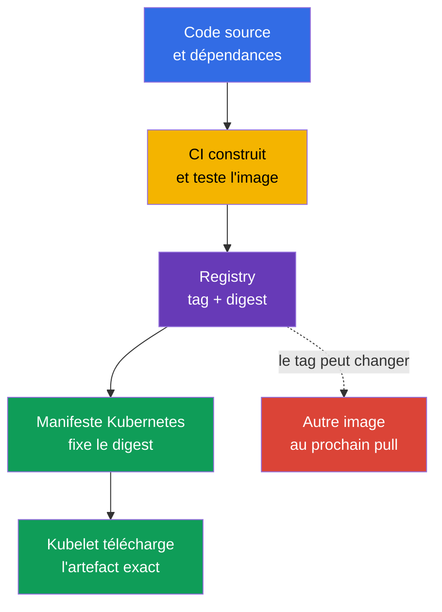
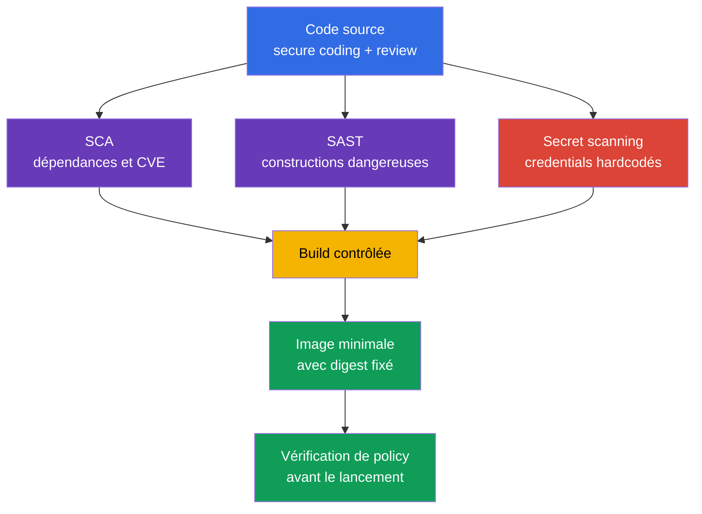

[Русская версия](ru.md) · [Eng version](README.md) · [Versión en español](es.md) · [Deutsche Version](de.md) · [ქართული ვერსია](ge.md) · [繁體中文版](tw.md) · [日本語版](jp.md)

# Chapitre 06. Sécurité des artefacts, des images et du code

> **Pour la suite.** Dans le [chapitre 05](../05/fr.md), nous avons étudié les controls, les frameworks et l'isolation des workloads. Nous suivrons maintenant le parcours d'une application jusqu'au `Pod` : du code source et des dépendances au container image dans le registry. Cela fait partie du domaine **Overview of Cloud Native Security**, dont le poids est de 14 %. Un cluster sécurisé ne compense pas une image malveillante, vulnérable ou modifiée de manière imprévisible.

Une image de conteneur est un artefact exécutable de livraison. Elle contient l'application, son runtime, ses bibliothèques et ses fichiers de configuration. La sécurité de l'image commence donc avant Kubernetes : avec la confiance dans le registry, une build reproductible, la composition des dépendances et l'absence de secrets dans les sources.

## 06.1 Registres, tags, digests et images de confiance

Un **container registry** stocke et distribue des container images. Kubernetes ne distingue pas les registry publics et privés du point de vue du format de l'image, mais il les distingue en matière de confiance et d'accès.

- Un **public registry** est accessible depuis Internet. Il est pratique pour les images de base publiées, mais le nom de l'auteur ou la popularité du repository ne prouvent pas la sécurité du contenu.
- Un **private registry** limite les push et pull aux comptes, rôles ou accès réseau. Il aide à contrôler qui publie et qui reçoit les artefacts internes, mais ne rend pas automatiquement une image sûre.
- Un **proxy ou mirror registry** met en cache les images externes autorisées. Un tel point permet de journaliser les téléchargements, de limiter la liste des sources et de réduire la dépendance des builds au réseau externe.

Le chemin d'une image comprend un registry, un repository et une référence à une version précise. Par exemple, dans `registry.example.internal/payments/api:v2.4.1`, le tag `v2.4.1` est un nom lisible par les humains. Dans l'entrée `registry.example.internal/payments/api@sha256:...`, le digest est indiqué, c'est-à-dire l'identifiant cryptographique du contenu précis du manifeste de l'image.

| Mode de référence | Ce qui est fixé | Risque principal | Utilisation typique |
|---|---|---|---|
| Tag, par exemple `v2.4.1` | Nom logique de version | Le tag peut être déplacé vers une autre image | Navigation pratique et étape de build |
| Mutable tag, par exemple `latest` ou `stable` | Seulement le nom du canal | Le même manifeste peut lancer des octets différents | À ne pas utiliser comme release de production immuable |
| Digest, par exemple `@sha256:...` | Contenu précis de l'image | N'indique pas à lui seul qui l'a construite ni pourquoi | Deployment et livraison vérifiable |

Un tag est pratique, mais modifiable. Le propriétaire du repository peut supprimer `v2.4.1` et attribuer ce tag à une nouvelle image. Au prochain pull, Kubernetes récupérera un autre artefact, bien que le YAML n'ait pas changé. Le digest résout précisément le problème de l'identité : un digest particulier désigne des octets particuliers. Il ne confirme pas que les octets sont sûrs, vérifiés ou construits par votre organisation.



`imagePullPolicy: Always` ne rend pas une image plus digne de confiance. Elle force seulement le kubelet à vérifier le registry à chaque lancement. Si la référence utilise un mutable tag, le kubelet peut récupérer une nouvelle version. La fixation du digest rend le résultat univoque ; la pull policy détermine quand vérifier sa disponibilité.

### Confiance dans la source

Une **trusted image** n'est pas simplement une image sans CVE détectée. C'est un artefact pour lequel l'organisation peut répondre aux questions suivantes : d'où vient-il, qui a le droit de le publier, comment a-t-il été construit, a-t-il été vérifié et est-il autorisé pour cet environnement.

Un modèle de confiance courant comporte plusieurs controls indépendants :

1. Autoriser les registry et les repository au moyen d'une allowlist, et non n'importe quelle adresse Internet.
2. Limiter les push vers le repository de production à des service accounts distincts avec des droits minimaux.
3. Vérifier l'image avec un scanner de vulnérabilités connues en tenant compte de la gravité, de l'exploitabilité et de l'existence d'un correctif.
4. Signer les artefacts et vérifier la signature avant le lancement. La signature crée une affirmation cryptographique liée à un artifact/digest précis et à une signing key ou une signing identity. Lors de la verification, le système applique séparément une trust policy : cette key/identity/issuer est-elle considérée comme digne de confiance pour cet artefact ? La signature ne prouve pas l'absence de vulnérabilités et ne remplace ni la provenance ni le vulnerability scanning.
5. Fixer le digest dans l'artefact de deployment et conserver les informations de build, par exemple le SBOM et la provenance.
6. Appliquer une admission policy qui rejette les images provenant de registry non autorisés ou dépourvues de la signature requise.

Un public registry présente des menaces supplémentaires : typosquatting avec un nom semblable, compte de l'éditeur compromis, modification inattendue du tag et provenance peu claire de la base image. Dans un private registry, les menaces de droits de push excessifs, de compromission des credentials CI et d'absence de vérification de ce qui est réellement arrivé dans le repository subsistent.

> **Important.** L'entrée `image: company/app:latest` ne signifie pas « version la plus sûre ». `latest` est un tag ordinaire sans sémantique Kubernetes spéciale. Il est souvent mutable, n'indique pas de version et complique l'investigation : après un incident, il est difficile d'établir quelle image précise fonctionnait réellement.

## 06.2 Images minimales : distroless, scratch et multi-stage build

Chaque package dans l'image finale augmente la surface d'attaque : il peut avoir des CVE, des utilitaires exécutables, de la configuration et des bibliothèques dépendantes. La minimisation de l'image réduit le nombre de composants, mais ne corrige pas une vulnérabilité de l'application et ne remplace pas `SecurityContext`, l'isolation réseau ou la runtime detection.

### Options de base

| Base de l'image finale | Contenu | Quand elle est utile | Limitation |
|---|---|---|---|
| `scratch` | Système de fichiers vide | Binaire compilé statiquement avec des besoins connus | Pas de shell, de CA bundle, de données de fuseau horaire ni de dynamic loader |
| distroless | Language runtime et bibliothèques nécessaires sans shell/package manager | Runtime d'une application qui n'a pas besoin d'utilitaires interactifs | Le débogage avec `kubectl exec -- sh` est généralement impossible |
| Image Linux complète | Shell, package manager et large ensemble de packages | Diagnostic justifié ou dépendances de runtime spécifiques | Davantage de composants et de possibilités après compromission |

`distroless` signifie que l'image conserve l'ensemble minimal nécessaire à l'exécution de l'application, mais n'inclut généralement ni shell ni gestionnaire de packages. Cela complique la post-exploitation d'un attaquant après une RCE : il n'obtient pas immédiatement `sh`, `curl`, `wget` ni de package manager. Ce n'est pas une garantie : le processus de l'application peut toujours lire les fichiers accessibles, contacter le réseau et utiliser ses privilèges.

`scratch` est une base vide. Elle ne convient pas « à toute petite image », mais à une application qui démarre sans bibliothèques dynamiques ni fichiers de runtime absents. Par exemple, un binaire Go statique peut nécessiter un CA bundle pour TLS, et certaines applications nécessitent des données de fuseau horaire ou d'autres fichiers absents de `scratch` ; ils doivent être ajoutés ou montés explicitement. Dans Kubernetes, le kubelet fournit habituellement la configuration DNS du Pod via `/etc/resolv.conf`, elle ne doit donc pas être citée comme un fichier à inclure automatiquement dans l'image finale. La sécurité ne doit pas être obtenue en supprimant par hasard des composants nécessaires.

### Multi-stage build

Le builder, le compilateur, les outils de test et le code source sont nécessaires lors de la build, mais généralement inutiles à l'exécution. Une **multi-stage build** sépare ces responsabilités : le premier stage crée l'artifact, le second ne contient que le runtime et les fichiers nécessaires.

```dockerfile
# L'étape de build contient le compilateur et le code source.
FROM golang:1.27.1 AS build
WORKDIR /src
COPY . .
RUN CGO_ENABLED=0 go build -o /out/api ./cmd/api

# L'image finale reçoit uniquement le binaire prêt.
FROM scratch
COPY --from=build /out/api /api
USER 65532:65532
ENTRYPOINT ["/api"]
```

L'exemple montre le principe, et non une recette universelle. Les versions de base image, les dépendances et la méthode de build sont choisies conformément à la politique de l'organisation. Pour une application dotée de bibliothèques dynamiques, un runtime distroless peut être nécessaire à la place de `scratch`. Il faut aussi vérifier séparément le démarrage, la connexion TLS, le DNS, les droits d'écriture et l'exécution sous un utilisateur non privilégié.

| Ce qui ne doit pas entrer dans le final stage sans nécessité | Pourquoi c'est important |
|---|---|
| Compilateurs, package manager, frameworks de test | Nouvelles CVE et outils de post-exploitation |
| Code source et `.git` | Risque de divulgation de la logique, des clés et de l'historique des changements |
| Fichiers de build temporaires et caches | Augmentent l'image et peuvent contenir des credentials |
| Shell et utilitaires administratifs | Facilitent les actions interactives après une RCE |

Une image minimale exige une discipline opérationnelle différente. Il ne faut pas compter sur le fait qu'un ingénieur pourra toujours entrer dans le conteneur et y installer un utilitaire. L'observabilité s'appuie sur les logs, les métriques, les traces et, si nécessaire, un debug container temporaire avec des droits contrôlés. Cette approche est utile tant pour l'exploitation que pour la sécurité.

## 06.3 Sécurité du code, des dépendances et des secrets

Une image hérite des risques du code source. Même un private registry parfaitement configuré n'arrêtera ni une SQL injection, ni SSRF, ni une désérialisation non sûre, ni une dépendance présentant une vulnérabilité critique connue. La sécurité du workload comprend donc le secure coding et le contrôle du cycle de vie des dépendances.

### Secure coding comme control avant le conteneur

Le **secure coding** est un ensemble de pratiques d'ingénierie qui réduit la probabilité de vulnérabilités avant la build et le lancement. Pour KCSA, il est important de comprendre l'objectif de ces pratiques :

- valider les données d'entrée et utiliser des API sûres au lieu de traiter manuellement des chaînes ;
- vérifier l'authentification et l'autorisation dans l'application, et ne pas considérer le réseau comme digne de confiance ;
- gérer les erreurs sans exposer à l'utilisateur un token, une stack trace ou une configuration interne ;
- limiter l'accès de l'application au réseau, au système de fichiers et aux cloud credentials selon le principe du least privilege ;
- effectuer des code review et maintenir les corrections des bibliothèques utilisées.

Le Static application security testing, ou **SAST**, analyse le code source ou le compiled code sans l'exécuter. Cette analyse peut signaler un appel d'API dangereux, une injection, un hardcoded secret ou une configuration non sûre. Elle réduit la probabilité d'erreur, mais ses résultats exigent du contexte : chaque avertissement n'est pas exploitable, et chaque erreur logique n'est pas visible pour un analyseur statique.

### Dépendances et SCA

Une application moderne comprend des dépendances directes et transitives : language packages, packages du système d'exploitation, base image et plugins. La **Software Composition Analysis**, ou SCA, établit un inventaire des dépendances et compare leurs versions aux vulnérabilités connues, aux licences et aux politiques de l'organisation.

La SCA répond aux questions suivantes :

- quelle bibliothèque et quelle version sont incluses dans l'artifact ;
- existe-t-il une CVE connue pour cette version ;
- existe-t-il une version corrigée ;
- la dépendance est-elle transitive ;
- la licence respecte-t-elle les règles de l'organisation.

La SCA n'est pas équivalente au scanning d'un container image, bien que les périmètres se recoupent. La SCA examine en premier lieu la composition de l'application. Un image scanner analyse habituellement les packages du système d'exploitation et les bibliothèques de l'image construite. Un processus fiable utilise les deux points de vue et ne considère pas un rapport sans CVE détectée comme une preuve de sécurité complète.

Un lock file fixe les versions résolues des dépendances et contribue à rendre la build reproductible. Son existence n'annule pas les mises à jour : une dépendance peut devenir vulnérable après la création du lock file. Des vérifications régulières dans CI et un processus clair d'évaluation et de correction des résultats sont donc utiles.

### Les secrets ne doivent pas vivre dans le code ni dans l'image

Un hardcoded password, une API key, une private key ou un cloud token se retrouvent souvent dans l'historique Git, les logs CI, une Docker layer ou une image publiée. Supprimer la chaîne lors du commit suivant ne suffit pas : le secret peut rester dans l'historique du repository, le cache CI ou une couche d'image déjà chargée.

La réaction correcte à un secret découvert est la suivante :

1. Révoquer ou remplacer immédiatement le credential. Le secret doit être considéré comme compromis.
2. Le supprimer du code, de la configuration de build et des logs.
3. Vérifier l'historique, les artefacts et les accès où il a pu être conservé.
4. Transmettre les secrets au workload via un mécanisme prévu à cet effet : Kubernetes `Secret` avec un RBAC limité ou un secret manager externe.
5. Ajouter du secret scanning et des règles de review afin d'éviter la répétition de l'erreur.

Kubernetes `Secret` ne rend pas acceptable le stockage d'une clé dans un Dockerfile. Si un secret est transmis via `ARG`, `ENV` ou copié dans une image, il peut être disponible dans les metadata ou les couches. Les secrets sont nécessaires à l'application pendant son fonctionnement, et non comme partie permanente de l'image.



## 06.4 Place des images et du code dans le modèle 4C et la Platform Security

Dans le modèle 4C du [chapitre 03](../03/fr.md), l'image appartient avant tout à la couche **Container**, et le code source et les dépendances à la couche **Code**. Les couches externes ne remplacent pas les couches internes :

- Cloud IAM ne corrige pas un hardcoded secret dans le repository.
- Le RBAC dans le cluster ne rend pas un mutable tag immuable.
- `NetworkPolicy` ne retire pas une CVE de la base image.
- Une image minimale ne limite pas les droits excessifs d'un service account.

La protection est donc construite en couches. Le code est vérifié avant la build, CI produit un artifact connu, le registry contrôle le stockage et la distribution, et Kubernetes vérifie ce qui est précisément admis à l'exécution. Lorsqu'un control est compromis, les autres réduisent les conséquences.

Le chapitre 06 explique les artefacts entrants au niveau Overview of Cloud Native Security. Dans le [chapitre 17](../17/fr.md), le sujet se poursuivra du point de vue de la Platform Security : supply chain, SBOM, signatures, image repository et admission control. L'organisation y décide comment transformer la confiance dans le digest et l'éditeur en une règle que Kubernetes applique avant la création d'un `Pod`.

| Couche 4C | Question de sécurité | Exemple de control |
|---|---|---|
| Code | L'application contient-elle des erreurs, des dépendances vulnérables ou des secrets ? | Review, SAST, SCA, secret scanning |
| Container | Qu'est-ce qui est réellement lancé et combien de composants superflus contient-il ? | Base minimale, multi-stage build, scanner, digest |
| Cluster | Le cluster admettra-t-il un artifact inadapté ? | Admission policy, allowlist registry, RBAC |
| Cloud | Qui peut lire le registry et les credentials CI ? | IAM, private endpoint, audit logging |

## 06.5 Comment cela s'applique en pratique

L'équipe plateforme formule généralement un processus de livraison de base, que les équipes produit suivent dans CI/CD :

1. Elles utilisent des base images approuvées provenant d'un controlled registry et les mettent régulièrement à jour.
2. Elles construisent l'image dans CI, exécutent les tests, SAST, SCA, secret scanning et image scanning.
3. Elles publient le résultat dans un private registry avec un service account disposant de droits minimaux.
4. Elles conservent le digest, le SBOM et les informations de build avec le release.
5. Dans les deployment de production, elles fixent le digest et non `:latest`.
6. L'admission control autorise seulement les registry approuvés et, lorsque cela est adopté, exige une signature ou d'autres attestations.
7. Pour une CVE découverte, elles évaluent l'exposition réelle, l'existence d'un correctif et la criticité du workload, puis mettent à jour la dépendance ou la base image.

Au niveau associate, il est utile de distinguer un moyen d'une garantie. Un scanner trouve des problèmes connus, mais pas toutes les vulnérabilités. Une verification réussie confirme que l'affirmation cryptographique concernant l'artifact vérifié est validée sous la signing key/identity attendue ; la confiance dans le signer est définie par une verification policy distincte. Elle ne prouve pas l'absence de défaut. Un private registry limite l'accès, mais ne remplace pas la review. La combinaison des controls forme une defense in depth.

## 06.6 Exam vocabulary / Mini-glossaire

| Terme | Signification |
|---|---|
| Artifact | Résultat de livraison, par exemple un container image, un SBOM ou un manifest signé. |
| Container registry | Service de stockage et de distribution des container images. |
| Digest | Identifiant cryptographique immuable du contenu précis d'une image. |
| Distroless | Runtime image minimal sans shell ni package manager habituels. |
| Image tag | Étiquette lisible par les humains d'une image, qui peut être modifiée. |
| Multi-stage build | Build avec un builder stage distinct et un final stage minimal. |
| SAST | Analyse statique du code sans exécuter l'application. |
| SCA | Analyse de la composition d'un logiciel et de ses dépendances. |
| Secret scanning | Recherche de credentials et d'autres secrets dans le code, l'historique et les artefacts. |
| Trusted image | Image dont la provenance est vérifiable et qui dispose d'un ensemble de controls de confiance. |

## 06.7 Exam Essentials / Points essentiels du chapitre

- Le registry stocke les images, mais n'établit pas à lui seul la confiance envers elles. Les registry publics et privés exigent un contrôle de la source, de l'accès et de la publication.
- Un tag est pratique pour les humains, mais peut être mutable. Le digest fixe un artifact précis et est préférable pour un deployment de production.
- `:latest` est un tag ordinaire modifiable, et non un signe de sécurité ou de nouveauté.
- La multi-stage build et une image minimale réduisent la surface d'attaque, mais ne remplacent pas la sécurité de l'application ni les runtime controls.
- Le secure coding, SAST, SCA et le secret scanning protègent la couche Code avant le lancement du conteneur.
- Un secret ne peut pas être considéré comme sûr s'il a été placé dans Git, un Dockerfile, un log CI ou une image layer. Un credential découvert est révoqué et remplacé.
- La protection de Container et Code est liée à la Platform Security : un artifact de confiance doit encore être vérifié et autorisé à l'exécution.

## 06.8 À ne pas confondre et comment cela apparaît à l'examen

Dans les questions KCSA, plusieurs mesures utiles sont souvent proposées et il faut choisir la plus précise face à la menace donnée.

- Pour un lancement reproductible, choisissez un **digest**, et non un tag. Le digest garantit l'identité du contenu, mais ne remplace ni la signature ni le scanning.
- `latest` ne signifie pas « dernier release vérifié ». C'est un mutable tag qui dégrade la prévisibilité et l'investigation.
- `scratch` et distroless réduisent la composition de l'image, mais ne sont pas un sandbox et n'empêchent pas toutes les conséquences d'une RCE.
- SCA concerne la composition des dépendances ; SAST analyse le code ; le secret scanning recherche les credentials. Les outils se complètent.
- Un private registry limite l'accès aux images, mais la confiance dépend aussi de l'éditeur, de CI, du scanning, de la signature et de la policy.

## 06.9 Questions d'auto-évaluation

### 1. Quelle méthode de référence d'une image fixe le mieux un ensemble précis d'octets pour un deployment de production ?

   - a. `registry.example/app:stable`

   - b. `registry.example/app:latest`

   - c. Tout tag avec `imagePullPolicy: Always`

   - d. `registry.example/app@sha256:...`

<details>
<summary>Réponse et explication</summary>

**Bonne réponse : d.** Un digest identifie le contenu précis d'une image. `latest` et `stable` sont des tags et peuvent être réattribués. `imagePullPolicy: Always` vérifie le registry, mais ne rend pas un mutable tag immuable.

</details>

### 2. Quelle description de `:latest` est la plus précise ?

   - a. Le digest immuable de la dernière build.

   - b. Un tag ordinaire qui peut désigner différentes images à différents moments.

   - c. Un mode Kubernetes spécial qui garantit l'image sûre la plus récente.

   - d. Une policy qui interdit le lancement sans signature.

<details>
<summary>Réponse et explication</summary>

**Bonne réponse : b.** Kubernetes ne confère pas à `latest` de propriétés de confiance particulières. C'est un tag, généralement mutable. Il n'indique pas quels octets précis ont été lancés et ne remplace pas la verification.

</details>

### 3. Quelle affirmation concernant une multi-stage build est vraie ?

   - a. Elle conserve le compiler, le code source et le build cache dans l'image finale afin que le conteneur de production puisse répéter la build.

   - b. Elle signe automatiquement l'image finale et remplace ainsi une artifact signature verification distincte.

   - c. Elle rend SCA et image scanning inutiles, car les dépendances sont vérifiées automatiquement entre les build stages.

   - d. Elle construit l'artifact dans un builder stage et ne copie dans le final stage que les fichiers et dépendances de runtime nécessaires.

<details>
<summary>Réponse et explication</summary>

**Bonne réponse : d.** Une multi-stage build permet de laisser les build-only tooling, les sources et les données intermédiaires dans le builder stage, et de ne transférer dans l'image finale que les runtime artifacts et dependencies nécessaires. La signature, SCA et l'image scanning restent des controls distincts.

</details>

### 4. À quoi sert avant tout la SCA ?

   - a. Analyser les flux réseau au runtime entre un `Pod` et déterminer les connexions effectivement établies.
   - b. Inventorier les software dependencies et comparer leurs versions aux vulnerabilities et à la policy connues.
   - c. Fournir un shell interactif dans les conteneurs où les debugging tools standards sont absents.
   - d. Chiffrer les données Kubernetes `Secret` avant de stocker les objets API dans `etcd`.

<details>
<summary>Réponse et explication</summary>

**Bonne réponse : b.** La SCA analyse la composition du logiciel : dépendances directes et transitives, leurs versions, vulnérabilités connues et souvent licences/policy. La visibilité réseau au runtime, le débogage et le chiffrement au repos répondent à d'autres objectifs.

</details>

### 5. Une cloud API key active est trouvée dans un repository Git. Quelle devrait être l'action prioritaire ?

   - a. Supprimer la chaîne dans le prochain commit et continuer à utiliser la clé.

   - b. Encoder la clé en base64 et la conserver dans le repository.

   - c. Révoquer ou remplacer la clé, puis la supprimer du code et vérifier l'historique et les artefacts.

   - d. Ajouter la clé dans le `Dockerfile` pour que CI ne la perde pas.

<details>
<summary>Réponse et explication</summary>

**Bonne réponse : c.** Le secret doit être considéré comme compromis : il a pu se retrouver dans l'historique Git, les caches, les logs ou l'image. La suppression de la chaîne n'annule pas l'accès déjà accordé. Base64 n'est pas une protection.

</details>

> **Pour la suite.** Pour une minimisation pratique des images, passez au chapitre 24 CKS. Le chapitre 25 CKS traite la supply chain, le SBOM et le registry, le chapitre 26 CKS les signatures, le chapitre 27 CKS l'analyse statique, et le chapitre 28 CKS le scanning des images. Les concepts de supply chain et d'admission control au niveau KCSA se poursuivent dans le [chapitre 17](../17/fr.md).

[Table des matières](../README_FR.md) · [Chapitre 05](../05/fr.md) · [Chapitre 07](../07/fr.md)
