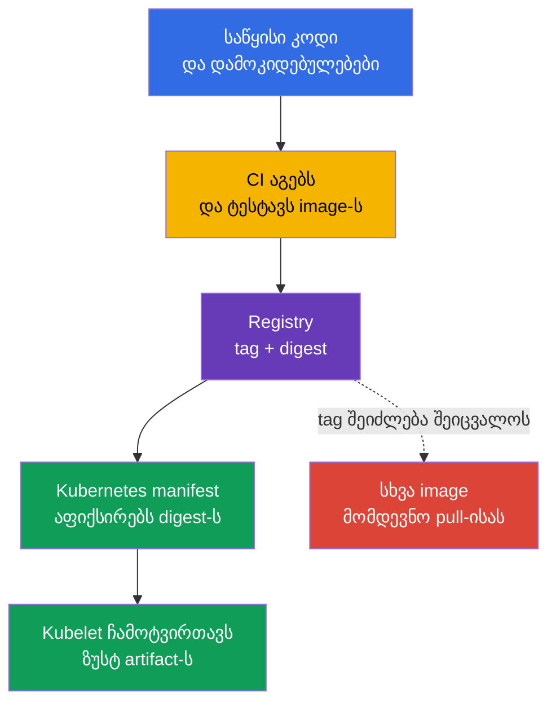
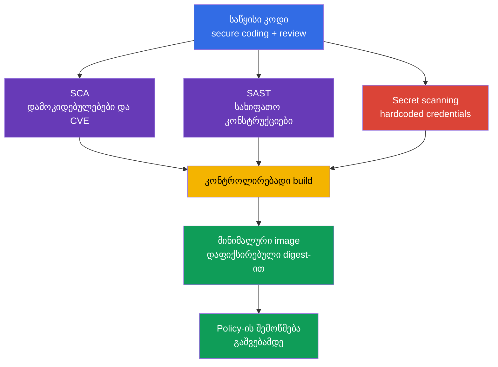

[Русская версия](ru.md) · [Eng version](README.md) · [Versión en español](es.md) · [Version française](fr.md) · [Deutsche Version](de.md) · [繁體中文版](tw.md) · [日本語版](jp.md)

# თავი 06. არტეფაქტების, იმიჯებისა და კოდის უსაფრთხოება

> **რა არის შემდეგ.** [თავი 05-ში](../05/ge.md) განვიხილეთ controls, ფრეიმვორკები და სამუშაო დატვირთვის იზოლაცია. ახლა გავყვებით აპლიკაციის გზას `Pod`-მდე: საწყისი კოდიდან და დამოკიდებულებებიდან registry-ში განთავსებულ container image-მდე. ეს არის **Overview of Cloud Native Security** დომენის ნაწილი, რომლის წონაა 14%. უსაფრთხო კლასტერი ვერ ანაზღაურებს მავნე, მოწყვლად ან არაპროგნოზირებად შეცვლილ იმიჯს.

კონტეინერის იმიჯი მიწოდების შესრულებადი არტეფაქტია. ის შეიცავს აპლიკაციას, მის runtime-ს, ბიბლიოთეკებსა და კონფიგურაციის ფაილებს. ამიტომ იმიჯის უსაფრთხოება Kubernetes-მდე იწყება: registry-ის სანდოობით, კვლავწარმოებადი build-ით, დამოკიდებულებების შემადგენლობითა და საწყის კოდში საიდუმლოებების არარსებობით.

## 06.1 რეესტრები, ტეგები, დაიჯესტები და სანდო იმიჯები

**Container registry** ინახავს და ავრცელებს container images-ს. იმიჯის ფორმატის თვალსაზრისით Kubernetes public და private registry-ს ერთმანეთისგან არ განასხვავებს, თუმცა სანდოობისა და წვდომის თვალსაზრისით განასხვავებს.

- **Public registry** ინტერნეტიდან ხელმისაწვდომია. ის მოსახერხებელია გამოქვეყნებული საბაზისო იმიჯებისთვის, მაგრამ ავტორის სახელი ან repository-ის პოპულარობა შიგთავსის უსაფრთხოებას არ ადასტურებს.
- **Private registry** push-სა და pull-ს ანგარიშების, როლების ან ქსელური წვდომის საშუალებით ზღუდავს. ის გვეხმარება ვაკონტროლოთ, ვინ აქვეყნებს და ვინ იღებს შიდა არტეფაქტებს, თუმცა იმიჯს ავტომატურად უსაფრთხოს არ ხდის.
- **Proxy ან mirror registry** ნებადართულ გარე იმიჯებს კეშირებს. ასეთი წერტილი საშუალებას იძლევა ჩაიწეროს ჩამოტვირთვები, შეიზღუდოს წყაროების სია და შემცირდეს build-ების დამოკიდებულება გარე ქსელზე.

იმიჯის მისამართი შედგება registry-ისგან, repository-ისგან და კონკრეტულ ვერსიაზე მითითებისგან. მაგალითად, `registry.example.internal/payments/api:v2.4.1`-ში ტეგი `v2.4.1` ადამიანისთვის წაკითხვადი სახელია. ჩანაწერში `registry.example.internal/payments/api@sha256:...` მითითებულია digest, ანუ იმიჯის manifest-ის კონკრეტული შიგთავსის კრიპტოგრაფიული იდენტიფიკატორი.

| მითითების მეთოდი | რას აფიქსირებს | მთავარი რისკი | ტიპური გამოყენება |
|---|---|---|---|
| Tag, მაგალითად `v2.4.1` | ვერსიის ლოგიკურ სახელს | ტეგი შეიძლება სხვა იმიჯზე გადავიდეს | მოსახერხებელი ნავიგაცია და build-ის ეტაპი |
| Mutable tag, მაგალითად `latest` ან `stable` | მხოლოდ არხის სახელს | იმავე manifest-მა შეიძლება სხვა ბაიტები გაუშვას | არ გამოიყენოთ უცვლელ production-release-ად |
| Digest, მაგალითად `@sha256:...` | იმიჯის კონკრეტულ შიგთავსს | თავისთავად არ გვატყობინებს, ვინ და რატომ ააგო ის | Deployment და შემოწმებადი მიწოდება |

ტეგი მოსახერხებელია, მაგრამ ცვალებადია. repository-ის მფლობელს შეუძლია წაშალოს `v2.4.1` და ეს ტეგი ახალ image-ს მიანიჭოს. მომდევნო pull-ისას Kubernetes სხვა არტეფაქტს მიიღებს, მიუხედავად იმისა, რომ YAML არ შეცვლილა. Digest სწორედ იდენტობის პრობლემას წყვეტს: კონკრეტული digest კონკრეტულ ბაიტებზე მიუთითებს. ის არ ადასტურებს, რომ ბაიტები უსაფრთხოა, შემოწმებულია ან თქვენი ორგანიზაციის მიერაა აგებული.



`imagePullPolicy: Always` იმიჯს უფრო სანდოს არ ხდის. ის მხოლოდ აიძულებს kubelet-ს, ყოველი გაშვებისას შეამოწმოს registry. თუ მითითება mutable tag-ს იყენებს, kubelet-მა შეიძლება ახალი ვერსია მიიღოს. digest-ის დაფიქსირება შედეგს ერთმნიშვნელოვანს ხდის, ხოლო pull-ის policy განსაზღვრავს, როდის უნდა შემოწმდეს მისი ხელმისაწვდომობა.

### წყაროს სანდოობა

**Trusted image** უბრალოდ იმიჯი არ არის, რომელშიც CVE ვერ იპოვეს. ეს არის არტეფაქტი, რომლის შესახებაც ორგანიზაციას შეუძლია უპასუხოს კითხვებს: საიდან არის მიღებული, ვის აქვს მისი გამოქვეყნების უფლება, როგორ არის აგებული, შემოწმდა თუ არა და ნებადართულია თუ არა მოცემული გარემოსთვის.

სანდოობის ჩვეულებრივი მოდელი რამდენიმე დამოუკიდებელ კონტროლს მოიცავს:

1. registry და repository დაუშვით allowlist-ის მიხედვით და არა ინტერნეტის ნებისმიერი მისამართიდან.
2. production repository-ში push ცალკეული service accounts-ითა და მინიმალური უფლებებით შეზღუდეთ.
3. იმიჯი სკანერით შეამოწმეთ ცნობილ მოწყვლადობებზე და გაითვალისწინეთ კრიტიკულობა, ექსპლუატაციის შესაძლებლობა და შესწორების არსებობა.
4. ხელი მოაწერეთ არტეფაქტებს და გაშვებამდე ხელმოწერა შეამოწმეთ. ხელმოწერა ქმნის კრიპტოგრაფიულ მტკიცებას, რომელიც დაკავშირებულია კონკრეტულ artifact/digest-სა და signing key-ს ან signing identity-სთან. verification-ისას სისტემა ცალკე იყენებს trust policy-ს: ითვლება თუ არა მოცემული key/identity/issuer სანდოდ ამ არტეფაქტისთვის. ხელმოწერა არ ადასტურებს მოწყვლადობების არარსებობას და არ ცვლის provenance-ს ან vulnerability scanning-ს.
5. deployment-არტეფაქტში დააფიქსირეთ digest და შეინახეთ build-ის ინფორმაცია, მაგალითად SBOM და provenance.
6. გამოიყენეთ admission policy, რომელიც უარყოფს არანებადართული registry-დან მიღებულ ან საჭირო ხელმოწერის არმქონე იმიჯებს.

Public registry-ს დამატებითი საფრთხეები აქვს: მსგავსი სახელით typosquatting, გამომცემლის მიტაცებული ანგარიში, ტეგის მოულოდნელი ცვლილება და base image-ის გაურკვეველი წარმოშობა. Private registry-ში რჩება push-ის გადაჭარბებული უფლებების, CI credential-ის კომპრომეტირებისა და repository-ში მოხვედრილი შიგთავსის შემოწმების არარსებობის საფრთხეები.

> **მნიშვნელოვანია.** ჩანაწერი `image: company/app:latest` არ ნიშნავს „ყველაზე უსაფრთხო ვერსიას“. `latest` ჩვეულებრივი tag-ია Kubernetes-ის განსაკუთრებული სემანტიკის გარეშე. ის ხშირად mutable-ია, ვერსიას არ გვატყობინებს და გამოძიებას ართულებს: ინციდენტის შემდეგ ძნელია დადგინდეს, რეალურად რომელი image მუშაობდა.

## 06.2 მინიმალური იმიჯები: distroless, scratch და multi-stage build

Final image-ში ყოველი პაკეტი ზრდის შეტევის ზედაპირს: მას შეიძლება ჰქონდეს CVE, შესრულებადი უტილიტები, კონფიგურაცია და დამოკიდებული ბიბლიოთეკები. იმიჯის მინიმიზაცია კომპონენტების რაოდენობას ამცირებს, მაგრამ აპლიკაციის მოწყვლადობას არ ასწორებს და `SecurityContext`-ს, ქსელურ იზოლაციას ან runtime detection-ს არ ცვლის.

### საბაზისო ვარიანტები

| Final image-ის საფუძველი | შიგთავსი | როდის არის სასარგებლო | შეზღუდვა |
|---|---|---|---|
| `scratch` | ცარიელი ფაილური სისტემა | სტატიკურად კომპილირებული binary ცნობილი საჭიროებებით | არ აქვს shell, CA bundle, timezone data და dynamic loader |
| distroless | საჭირო language runtime და ბიბლიოთეკები shell/package manager-ის გარეშე | აპლიკაციის runtime, რომელსაც ინტერაქტიული უტილიტები არ სჭირდება | `kubectl exec -- sh`-ით გამართვა, როგორც წესი, შეუძლებელია |
| სრულფასოვანი Linux image | Shell, package manager და პაკეტების ფართო ნაკრები | დასაბუთებული დიაგნოსტიკა ან სპეციფიკური runtime-დამოკიდებულებები | კომპრომეტირების შემდეგ მეტი კომპონენტი და შესაძლებლობა |

`distroless` ნიშნავს, რომ იმიჯში აპლიკაციის გასაშვებად საჭირო მინიმალური ნაკრებია დატოვებული, თუმცა, ჩვეულებრივ, shell და პაკეტების მენეჯერი არ არის. ეს თავდამსხმელს RCE-ის შემდეგ პოსტექსპლუატაციას ურთულებს: მას არ ხვდება მზა `sh`, `curl`, `wget` და package manager. ეს გარანტია არ არის: აპლიკაციის პროცესს კვლავ შეუძლია ხელმისაწვდომი ფაილების წაკითხვა, ქსელში დაკავშირება და საკუთარი პრივილეგიების გამოყენება.

`scratch` ცარიელი ბაზაა. ის გამოდგება არა „ნებისმიერი პატარა იმიჯისთვის“, არამედ აპლიკაციისთვის, რომელიც დინამიკური ბიბლიოთეკებისა და არმყოფი runtime-ფაილების გარეშე ეშვება. მაგალითად, სტატიკურ Go binary-ს TLS-ისთვის შეიძლება CA bundle დასჭირდეს, ზოგიერთ აპლიკაციას კი timezone data ან სხვა ფაილები, რომლებიც `scratch`-ში არ არის. ისინი ცხადად უნდა დაემატოს ან დამონტაჟდეს. Kubernetes-ში Pod-ის DNS-პარამეტრებს, ჩვეულებრივ, kubelet `/etc/resolv.conf`-ის საშუალებით აწვდის, ამიტომ ის არ უნდა მოვიყვანოთ ფაილად, რომელიც final image-ში ავტომატურად უნდა ჩაირთოს. უსაფრთხოება საჭირო კომპონენტების შემთხვევითი წაშლით არ უნდა მიიღწეოდეს.

### Multi-stage build

ამწყობი, კომპილატორი, სატესტო ხელსაწყოები და საწყისი კოდი საჭიროა build-ის ეტაპზე, მაგრამ გაშვებისას, ჩვეულებრივ, საჭირო არ არის. **Multi-stage build** ამ მოვალეობებს ყოფს: პირველი stage ქმნის artifact-ს, მეორე კი მხოლოდ runtime-სა და საჭირო ფაილებს შეიცავს.

```dockerfile
# Build-ის ეტაპი შეიცავს კომპილატორსა და საწყის კოდს.
FROM golang:1.27.1 AS build
WORKDIR /src
COPY . .
RUN CGO_ENABLED=0 go build -o /out/api ./cmd/api

# Final image მხოლოდ მზა binary-ს იღებს.
FROM scratch
COPY --from=build /out/api /api
USER 65532:65532
ENTRYPOINT ["/api"]
```

მაგალითი პრინციპს აჩვენებს და არა უნივერსალურ რეცეპტს. base image-ის ვერსიები, დამოკიდებულებები და build-ის მეთოდი ორგანიზაციის policy-ის შესაბამისად ირჩევა. დინამიკური ბიბლიოთეკების მქონე აპლიკაციას `scratch`-ის ნაცვლად შეიძლება distroless runtime დასჭირდეს. ცალკე მოწმდება გაშვება, TLS-კავშირი, DNS, ჩაწერის უფლებები და არაპრივილეგირებული მომხმარებლით მუშაობა.

| რა არ უნდა მოხვდეს final stage-ში აუცილებლობის გარეშე | რატომ არის ეს მნიშვნელოვანი |
|---|---|
| კომპილატორები, package manager, სატესტო ფრეიმვორკები | ახალი CVE და პოსტექსპლუატაციის ხელსაწყოები |
| საწყისი კოდი და `.git` | ლოგიკის, გასაღებებისა და ცვლილებების ისტორიის გამჟღავნების რისკი |
| build-ის დროებითი ფაილები და კეშები | ზრდის იმიჯს და შეიძლება credentials-ს შეიცავდეს |
| Shell და ადმინისტრაციული უტილიტები | RCE-ის შემდეგ ინტერაქტიულ მოქმედებებს ამარტივებს |

მინიმალური იმიჯი განსხვავებულ საოპერაციო დისციპლინას მოითხოვს. არ შეიძლება იმის იმედად ყოფნა, რომ ინჟინერი ყოველთვის შევა კონტეინერში და უტილიტას დააყენებს. დაკვირვებადობა შენდება ლოგების, მეტრიკების, ტრეისებისა და საჭიროების შემთხვევაში კონტროლირებადი უფლებების მქონე დროებითი debug container-ის საშუალებით. ასეთი მიდგომა სასარგებლოა როგორც ექსპლუატაციისთვის, ისე უსაფრთხოებისთვის.

## 06.3 კოდის, დამოკიდებულებებისა და საიდუმლოებების უსაფრთხოება

იმიჯი საწყისი კოდის რისკებს მემკვიდრეობით იღებს. იდეალურად გამართული private registry-ც კი ვერ შეაჩერებს SQL injection-ს, SSRF-ს, არაუსაფრთხო დესერიალიზაციას ან ცნობილი კრიტიკული მოწყვლადობის მქონე დამოკიდებულებას. ამიტომ სამუშაო დატვირთვის უსაფრთხოება secure coding-სა და დამოკიდებულებების სასიცოცხლო ციკლის კონტროლს მოიცავს.

### Secure coding, როგორც კონტროლი კონტეინერამდე

**Secure coding** საინჟინრო პრაქტიკების ნაკრებია, რომლებიც build-მდე და გაშვებამდე მოწყვლადობების ალბათობას ამცირებს. KCSA-სთვის მნიშვნელოვანია ამ პრაქტიკების დანიშნულების გაგება:

- შეამოწმეთ შემავალი მონაცემები და სტრიქონების ხელით დამუშავების ნაცვლად უსაფრთხო API-ები გამოიყენეთ;
- აპლიკაციაში შეამოწმეთ ავთენტიფიკაცია და ავტორიზაცია და ქსელი სანდოდ არ ჩათვალოთ;
- დაამუშავეთ შეცდომები ისე, რომ მომხმარებელს token, stack trace ან შიდა კონფიგურაცია არ გადაეცეს;
- least privilege პრინციპით შეზღუდეთ აპლიკაციის წვდომა ქსელზე, ფაილურ სისტემასა და cloud credentials-ზე;
- ჩაატარეთ code review და განაახლეთ გამოყენებული ბიბლიოთეკების შესწორებები.

Static application security testing, ანუ **SAST**, საწყის ან compiled code-ს მისი გაშვების გარეშე აანალიზებს. ასეთმა ანალიზმა შეიძლება მიუთითოს API-ის სახიფათო გამოძახებაზე, ინიექციაზე, hardcoded secret-ზე ან არაუსაფრთხო კონფიგურაციაზე. ის შეცდომის ალბათობას ამცირებს, თუმცა მისი შედეგები კონტექსტს მოითხოვს: ყველა გაფრთხილების ექსპლუატაცია შესაძლებელი არ არის და სტატიკური ანალიზატორი ყველა ლოგიკურ შეცდომას ვერ ხედავს.

### დამოკიდებულებები და SCA

თანამედროვე აპლიკაცია პირდაპირ და ტრანზიტიულ დამოკიდებულებებს მოიცავს: language packages, OS-პაკეტებს, base image-სა და პლაგინებს. **Software Composition Analysis**, ანუ SCA, დამოკიდებულებების ინვენტარს ქმნის და ვერსიებს ცნობილ მოწყვლადობებს, ლიცენზიებსა და ორგანიზაციის policy-ებს ადარებს.

SCA პასუხობს კითხვებს:

- რომელი ბიბლიოთეკა და რომელი ვერსია შედის artifact-ში;
- არსებობს თუ არა ცნობილი CVE ამ ვერსიისთვის;
- არსებობს თუ არა შესწორებული ვერსია;
- არის თუ არა დამოკიდებულება ტრანზიტიული;
- შეესაბამება თუ არა ლიცენზია ორგანიზაციის წესებს.

SCA container image-ის სკანირების ტოლი არ არის, თუმცა სფეროები ერთმანეთს კვეთს. SCA, პირველ რიგში, აპლიკაციის composition-ს განიხილავს. Image scanner, ჩვეულებრივ, აგებულ image-ში OS-პაკეტებსა და ბიბლიოთეკებს აანალიზებს. საიმედო პროცესი ორივე ხედვას იყენებს და ანგარიშს, რომელშიც არცერთი CVE არ არის ნაპოვნი, სრული უსაფრთხოების მტკიცებულებად არ მიიჩნევს.

Lock file დამოკიდებულებების ამოხსნილ ვერსიებს აფიქსირებს და build-ის კვლავწარმოებადობას ხელს უწყობს. მისი არსებობა განახლებას არ აუქმებს: დამოკიდებულება შეიძლება მოწყვლადი გახდეს lock file-ის შექმნის შემდეგაც. ამიტომ CI-ში სასარგებლოა რეგულარული შემოწმებები და აღმოჩენილი პრობლემების შეფასებისა და გამოსწორების გასაგები პროცესი.

### საიდუმლოებები კოდსა და იმიჯში არ უნდა ინახებოდეს

Hardcoded password, API key, private key ან cloud token ხშირად ხვდება Git history-ში, CI log-ში, Docker layer-ში ან გამოქვეყნებულ image-ში. მომდევნო commit-ში სტრიქონის წაშლა საკმარისი არ არის: საიდუმლო შეიძლება repository-ის ისტორიაში, CI-ის კეშში ან უკვე ატვირთულ image layer-ში დარჩეს.

აღმოჩენილ საიდუმლოზე სწორი რეაგირებაა:

1. დაუყოვნებლივ გააუქმეთ ან შეცვალეთ credential. საიდუმლო კომპრომეტირებულად უნდა ჩაითვალოს.
2. წაშალეთ ის კოდიდან, build-ის კონფიგურაციიდან და ლოგებიდან.
3. შეამოწმეთ ისტორია, არტეფაქტები და წვდომები, სადაც ის შეიძლებოდა დარჩენილიყო.
4. სამუშაო დატვირთვას საიდუმლოებები ამისთვის განკუთვნილი მექანიზმით გადაეცით: Kubernetes `Secret` შეზღუდული RBAC-ით ან გარე secret manager.
5. დაამატეთ secret scanning და review-ს წესები, რათა შეცდომა არ განმეორდეს.

Kubernetes `Secret` Dockerfile-ში გასაღების შენახვას დასაშვებს არ ხდის. თუ საიდუმლო `ARG`-ის, `ENV`-ის საშუალებით გადაიცა ან image-ში დაკოპირდა, ის შეიძლება metadata-ში ან layer-ებში ხელმისაწვდომი იყოს. საიდუმლოებები აპლიკაციას მუშაობის დროს სჭირდება და არა იმიჯის მუდმივ ნაწილად.



## 06.4 იმიჯებისა და კოდის ადგილი 4C მოდელსა და Platform Security-ში

[თავი 03-ის](../03/ge.md) 4C მოდელში იმიჯი, პირველ რიგში, **Container** ფენას მიეკუთვნება, ხოლო საწყისი კოდი და დამოკიდებულებები - **Code** ფენას. გარე ფენები შიდა ფენებს არ ცვლის:

- Cloud IAM repository-ში hardcoded secret-ს არ ასწორებს.
- კლასტერში RBAC mutable tag-ს უცვლელს არ ხდის.
- `NetworkPolicy` base image-იდან CVE-ს არ შლის.
- მინიმალური image service account-ის გადაჭარბებულ უფლებებს არ ზღუდავს.

ამიტომ დაცვა ფენებად შენდება. კოდი build-მდე მოწმდება, CI ცნობილ artifact-ს ქმნის, registry შენახვასა და გავრცელებას აკონტროლებს, Kubernetes კი ამოწმებს, კონკრეტულად რის გაშვებაა დაშვებული. ერთი კონტროლის კომპრომეტირებისას დანარჩენები შედეგებს ამცირებს.

თავი 06 შემომავალ არტეფაქტებს Overview of Cloud Native Security-ის დონეზე ხსნის. [თავი 17-ში](../17/ge.md) თემა Platform Security-ის თვალსაზრისით გაგრძელდება: supply chain, SBOM, ხელმოწერები, image repository და admission control. იქ ორგანიზაცია წყვეტს, როგორ გარდაქმნას digest-ისა და გამომცემლის მიმართ ნდობა წესად, რომელსაც Kubernetes `Pod`-ის შექმნამდე გამოიყენებს.

| 4C ფენა | უსაფრთხოების საკითხი | კონტროლის მაგალითი |
|---|---|---|
| Code | ხომ არ შეიცავს აპლიკაცია შეცდომებს, მოწყვლად დამოკიდებულებებს ან secrets-ს? | Review, SAST, SCA, secret scanning |
| Container | რეალურად რა ეშვება და რამდენი ზედმეტი კომპონენტია მასში? | Minimal base, multi-stage build, scanner, digest |
| Cluster | დაუშვებს თუ არა კლასტერი შეუსაბამო artifact-ს? | Admission policy, allowlist registry, RBAC |
| Cloud | ვის შეუძლია registry-ისა და CI credentials-ის წაკითხვა? | IAM, private endpoint, audit logging |

## 06.5 როგორ გამოიყენება ეს პრაქტიკაში

პლატფორმის გუნდი, ჩვეულებრივ, მიწოდების საბაზისო პროცესს აყალიბებს, პროდუქტის გუნდები კი მას CI/CD-ში მიჰყვებიან:

1. იყენებენ controlled registry-ში განთავსებულ დამტკიცებულ base images-ს და რეგულარულად აახლებენ მათ.
2. CI-ში აგებენ image-ს, უშვებენ ტესტებს, SAST-ს, SCA-ს, secret scanning-სა და image scanning-ს.
3. შედეგს private registry-ში service account-ის მინიმალური უფლებებით აქვეყნებენ.
4. რელიზთან ერთად ინახავენ digest-ს, SBOM-სა და build-ის ინფორმაციას.
5. production-ის deployment-ში `:latest`-ის ნაცვლად digest-ს აფიქსირებენ.
6. Admission control მხოლოდ დამტკიცებულ registry-ებს უშვებს და, სადაც მიღებულია, ხელმოწერას ან სხვა attestations-ს მოითხოვს.
7. აღმოჩენილი CVE-სთვის აფასებენ რეალურ ექსპოზიციას, შესწორების არსებობასა და სამუშაო დატვირთვის კრიტიკულობას, შემდეგ კი დამოკიდებულებას ან base image-ს აახლებენ.

Associate-დონეზე სასარგებლოა საშუალებისა და გარანტიის განსხვავება. Scanner ცნობილ პრობლემებს პოულობს, თუმცა არა ყველა მოწყვლადობას. წარმატებული verification ადასტურებს, რომ შემოწმებად artifact-ზე კრიპტოგრაფიული მტკიცება მოსალოდნელი signing key/identity-ის ქვეშ ვალიდირდება. signer-ის მიმართ ნდობას ცალკე verification policy განსაზღვრავს. ის დეფექტის არარსებობას არ ამტკიცებს. Private registry წვდომას ზღუდავს, თუმცა review-ს არ ცვლის. კონტროლების კომბინაცია defense in depth-ს ქმნის.

## 06.6 Exam vocabulary / მინი-ლექსიკონი

| ტერმინი | მნიშვნელობა |
|---|---|
| Artifact | მიწოდების შედეგი, მაგალითად container image, SBOM ან ხელმოწერილი manifest. |
| Container registry | Container images-ის შენახვისა და გავრცელების სერვისი. |
| Digest | Image-ის კონკრეტული შიგთავსის უცვლელი კრიპტოგრაფიული იდენტიფიკატორი. |
| Distroless | მინიმალური runtime image ჩვეულებრივი shell-ისა და package manager-ის გარეშე. |
| Image tag | იმიჯის ადამიანისთვის წაკითხვადი ჭდე, რომელიც შეიძლება შეიცვალოს. |
| Multi-stage build | Build ცალკე builder stage-ითა და მინიმალური final stage-ით. |
| SAST | კოდის სტატიკური ანალიზი აპლიკაციის გაშვების გარეშე. |
| SCA | პროგრამული უზრუნველყოფის შემადგენლობისა და მისი დამოკიდებულებების ანალიზი. |
| Secret scanning | Credentials-ისა და სხვა საიდუმლოებების ძიება კოდში, ისტორიასა და არტეფაქტებში. |
| Trusted image | Image შემოწმებადი წარმოშობითა და სანდოობის კონტროლების ნაკრებით. |

## 06.7 Exam Essentials / თავის შეჯამება

- Registry იმიჯებს ინახავს, მაგრამ თავისთავად მათ მიმართ ნდობას არ ადგენს. Public და private registry მოითხოვს წყაროს, წვდომისა და გამოქვეყნების კონტროლს.
- Tag ადამიანისთვის მოსახერხებელია, მაგრამ შეიძლება mutable იყოს. Digest კონკრეტულ artifact-ს აფიქსირებს და production deployment-ისთვის სასურველია.
- `:latest` ჩვეულებრივი ცვალებადი tag-ია და არა უსაფრთხოების ან სიახლის ნიშანი.
- Multi-stage build და minimal image შეტევის ზედაპირს ამცირებს, მაგრამ აპლიკაციის უსაფრთხოებასა და runtime controls-ს არ ცვლის.
- Secure coding, SAST, SCA და secret scanning კონტეინერის გაშვებამდე Code ფენას იცავს.
- საიდუმლო უსაფრთხოდ ვერ ჩაითვლება, თუ ის Git-ში, Dockerfile-ში, CI log-ში ან image layer-ში მოხვდა. აღმოჩენილი credential უქმდება და იცვლება.
- Container-ისა და Code-ის დაცვა Platform Security-ს უკავშირდება: სანდო artifact ჯერ კიდევ უნდა შემოწმდეს და მისი გაშვება დაშვებული უნდა იყოს.

## 06.8 არ აგერიოთ და როგორ გვხვდება ეს გამოცდაზე

KCSA-ს კითხვებში ხშირად რამდენიმე სასარგებლო ზომაა მოცემული და საჭიროა კონკრეტული საფრთხისთვის ყველაზე ზუსტი ზომის არჩევა.

- კვლავწარმოებადი გაშვებისთვის აირჩიეთ **digest** და არა tag. Digest შიგთავსის იდენტობას უზრუნველყოფს, მაგრამ ხელმოწერასა და სკანირებას არ ცვლის.
- `latest` არ ნიშნავს „ბოლო შემოწმებულ release-ს“. ეს mutable tag-ია, რომელიც პროგნოზირებადობასა და გამოძიებას აუარესებს.
- `scratch` და distroless იმიჯის შემადგენლობას ამცირებს, მაგრამ sandbox არ არის და RCE-ის ყველა შედეგს ვერ აღკვეთს.
- SCA დამოკიდებულებების შემადგენლობას ეხება; SAST კოდს აანალიზებს; secret scanning credentials-ს ეძებს. ხელსაწყოები ერთმანეთს ავსებს.
- Private registry იმიჯებზე წვდომას ზღუდავს, მაგრამ ნდობა ასევე დამოკიდებულია publisher-ზე, CI-ზე, სკანირებაზე, ხელმოწერასა და policy-ზე.

## 06.9 თვითშემოწმების კითხვები

### 1. Image-ზე მითითების რომელი მეთოდი აფიქსირებს ყველაზე უკეთ production deployment-ისთვის ბაიტების კონკრეტულ ნაკრებს?

   - a. `registry.example/app:stable`

   - b. `registry.example/app:latest`

   - c. ნებისმიერი tag `imagePullPolicy: Always`-ის გამოყენებისას

   - d. `registry.example/app@sha256:...`

<details>
<summary>პასუხი და განმარტება</summary>

**სწორი პასუხია: d.** Digest image-ის კონკრეტულ შიგთავსს განსაზღვრავს. `latest` და `stable` ტეგებია და შეიძლება სხვა იმიჯებს მიენიჭოს. `imagePullPolicy: Always` registry-ს ამოწმებს, მაგრამ mutable tag-ს უცვლელს არ ხდის.

</details>

### 2. რა აღწერს `:latest`-ს ყველაზე ზუსტად?

   - a. ბოლო build-ის უცვლელი digest.

   - b. ჩვეულებრივი tag, რომელიც სხვადასხვა დროს შეიძლება სხვადასხვა იმიჯზე მიუთითებდეს.

   - c. Kubernetes-ის სპეციალური რეჟიმი, რომელიც უახლეს უსაფრთხო იმიჯს უზრუნველყოფს.

   - d. Policy, რომელიც ხელმოწერის გარეშე გაშვებას კრძალავს.

<details>
<summary>პასუხი და განმარტება</summary>

**სწორი პასუხია: b.** Kubernetes `latest`-ს სანდოობის განსაკუთრებულ თვისებებს არ ანიჭებს. ეს არის tag, ჩვეულებრივ mutable. ის არ გვატყობინებს, კონკრეტულად რომელი ბაიტები გაეშვა, და verification-ს არ ცვლის.

</details>

### 3. რომელი მტკიცებაა სწორი multi-stage build-ის შესახებ?

   - a. ის compiler-ს, საწყის კოდსა და build cache-ს final image-ში ინახავს, რათა production-კონტეინერმა build გაიმეოროს.

   - b. ის final image-ს ავტომატურად აწერს ხელს და ამით artifact signature-ის ცალკე verification-ს ცვლის.

   - c. ის SCA-სა და image scanning-ს არასაჭიროს ხდის, რადგან build stages-ს შორის დამოკიდებულებები ავტომატურად მოწმდება.

   - d. ის artifact-ს builder stage-ში აგებს და final stage-ში მხოლოდ საჭირო runtime-ფაილებსა და დამოკიდებულებებს აკოპირებს.

<details>
<summary>პასუხი და განმარტება</summary>

**სწორი პასუხია: d.** Multi-stage build საშუალებას გვაძლევს build-only tooling, საწყისი კოდი და შუალედური მონაცემები builder stage-ში დავტოვოთ, final image-ში კი მხოლოდ საჭირო runtime artifacts და dependencies გადავიტანოთ. ხელმოწერა, SCA და image scanning ცალკე controls-ად რჩება.

</details>

### 4. უპირველეს ყოვლისა, რისთვის გამოიყენება SCA?

   - a. `Pod`-ებს შორის runtime-ქსელური ნაკადების ანალიზისა და რეალურად დამყარებული კავშირების განსაზღვრისთვის.
   - b. Software dependencies-ის ინვენტარიზაციისა და მათი ვერსიების ცნობილ vulnerabilities-სა და policy-სთან შედარებისთვის.
   - c. ინტერაქტიული shell-ის მისაწოდებლად კონტეინერებში, რომლებშიც სტანდარტული debugging tools არ არის.
   - d. Kubernetes `Secret` data-ს დასაშიფრად API-ობიექტების `etcd`-ში შენახვამდე.

<details>
<summary>პასუხი და განმარტება</summary>

**სწორი პასუხია: b.** SCA პროგრამული უზრუნველყოფის შემადგენლობას აანალიზებს: პირდაპირ და ტრანზიტიულ დამოკიდებულებებს, მათ ვერსიებს, ცნობილ მოწყვლადობებს და ხშირად ლიცენზიებს/policy-ს. Runtime network visibility, debugging და encryption at rest სხვა ამოცანებს წყვეტს.

</details>

### 5. Git-repository-ში მოქმედი cloud API key იპოვეს. რა უნდა გაკეთდეს უპირველესად?

   - a. წაიშალოს სტრიქონი მომდევნო commit-ში და გასაღების გამოყენება გაგრძელდეს.

   - b. გასაღები base64-ში დაიკოდოს და repository-ში შეინახოს.

   - c. გასაღები გაუქმდეს ან შეიცვალოს, შემდეგ კი წაიშალოს კოდიდან და შემოწმდეს ისტორია და არტეფაქტები.

   - d. გასაღები `Dockerfile`-ში დაემატოს, რათა CI-მ არ დაკარგოს.

<details>
<summary>პასუხი და განმარტება</summary>

**სწორი პასუხია: c.** საიდუმლო კომპრომეტირებულად უნდა ჩაითვალოს: ის შეიძლება Git-ის ისტორიაში, კეშებში, ლოგებში ან იმიჯში მოხვედრილიყო. სტრიქონის წაშლა უკვე გაცემულ წვდომას არ აუქმებს. Base64 დაცვა არ არის.

</details>

> **სად წავიდეთ შემდეგ.** იმიჯების პრაქტიკული მინიმიზაციისთვის გადადით CKS-ის 24-ე თავზე. Supply chain-ს, SBOM-სა და registry-ს განიხილავს CKS-ის 25-ე თავი, ხელმოწერებს - CKS-ის 26-ე თავი, სტატიკურ ანალიზს - CKS-ის 27-ე თავი, იმიჯების სკანირებას - CKS-ის 28-ე თავი. KCSA-ს დონეზე supply chain-ისა და admission control-ის კონცეფციებს აგრძელებს [თავი 17](../17/ge.md).

[სარჩევი](../README_GE.md) · [თავი 05](../05/ge.md) · [თავი 07](../07/ge.md)
