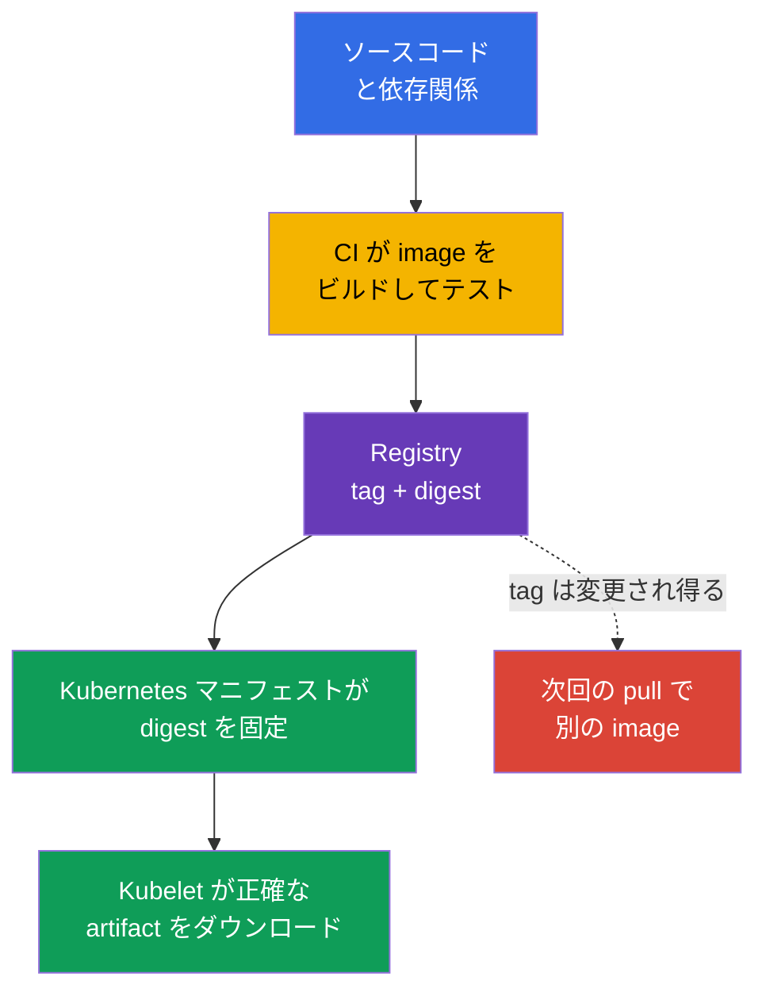
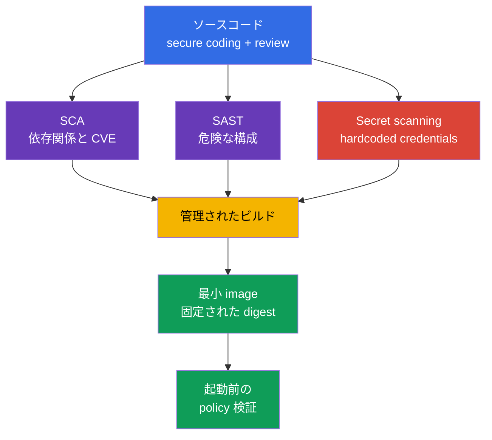

[Русская версия](ru.md) · [Eng version](README.md) · [Versión en español](es.md) · [Version française](fr.md) · [Deutsche Version](de.md) · [ქართული ვერსია](ge.md) · [繁體中文版](tw.md)

# 第06章. アーティファクト、イメージ、コードのセキュリティ

> **次に進む前に。** [第05章](../05/jp.md)では、controls、フレームワーク、およびワークロードの分離を取り上げました。ここからは、アプリケーションが `Pod` に至るまでの経路を追います。ソースコードと依存関係から、registry 内の container image までです。これは比重14%の **Overview of Cloud Native Security** ドメインの一部です。安全なクラスターであっても、悪意のある、脆弱な、または予測不能に変更されたイメージを補うことはできません。

コンテナーイメージはデリバリーにおける実行可能なアーティファクトです。アプリケーション、その runtime、ライブラリ、設定ファイルを含みます。そのため、イメージのセキュリティは Kubernetes より前に始まります。registry への信頼、再現可能なビルド、依存関係の構成、ソース内に secret がないことから始まります。

## 06.1 レジストリ、タグ、digest、信頼できるイメージ

**Container registry** は container images を保存し配布します。Kubernetes はイメージ形式の観点では public registry と private registry を区別しませんが、信頼とアクセスの観点では区別します。

- **Public registry** はインターネットからアクセスできます。公開されたベースイメージには便利ですが、作者名や repository の人気はコンテンツの安全性を証明しません。
- **Private registry** は、アカウント、ロール、またはネットワークアクセスによって push と pull を制限します。誰が内部アーティファクトを公開し取得できるかを制御できますが、自動的にイメージを安全にするものではありません。
- **Proxy または mirror registry** は、許可された外部イメージをキャッシュします。このようなポイントでは、ダウンロードの記録、ソース一覧の制限、およびビルドの外部ネットワークへの依存低減が可能です。

イメージのパスは registry、repository、特定バージョンへの参照で構成されます。たとえば、`registry.example.internal/payments/api:v2.4.1` では、タグ `v2.4.1` は人間が読める名前です。`registry.example.internal/payments/api@sha256:...` という記述では、digest、すなわちイメージマニフェストの特定コンテンツに対する暗号学的識別子が指定されます。

| 参照方法 | 固定するもの | 主なリスク | 典型的な用途 |
|---|---|---|---|
| Tag、例: `v2.4.1` | 論理的なバージョン名 | タグを別のイメージへ移動できる | 利便性の高いナビゲーションとビルド段階 |
| Mutable tag、例: `latest` または `stable` | チャネル名のみ | 同じマニフェストが別のバイト列を起動し得る | 不変の production リリースとして使用しない |
| Digest、例: `@sha256:...` | 特定のイメージコンテンツ | 誰がなぜビルドしたかは単独では示さない | Deployment と検証可能なデリバリー |

タグは便利ですが、変更可能です。repository の所有者は `v2.4.1` を削除し、このタグを新しい image に割り当てられます。次の pull では、YAML が変更されていなくても Kubernetes は別のアーティファクトを取得します。Digest が解決するのはまさに同一性の問題です。特定の digest は特定のバイト列を指します。バイト列が安全、検証済み、または組織によってビルドされたことを証明するものではありません。



`imagePullPolicy: Always` はイメージをより信頼できるものにはしません。これは kubelet に起動のたびに registry を確認させるだけです。参照に mutable tag を使う場合、kubelet は新しいバージョンを取得する可能性があります。digest を固定すると結果は一意になります。pull policy は、その可用性をいつ確認するかを決定します。

### ソースへの信頼

**Trusted image** は、発見された CVE がないだけのイメージではありません。組織が、どこから取得されたか、誰が公開する権限を持つか、どのようにビルドされたか、検証済みか、特定の環境で許可されているかという問いに答えられるアーティファクトです。

一般的な信頼モデルには、複数の独立した controls が含まれます。

1. インターネット上の任意のアドレスではなく、allowlist により registry と repository を許可する。
2. production repository への push を、専用 service accounts と最小限の権限に制限する。
3. 既知の脆弱性について scanner でイメージを確認し、深刻度、悪用可能性、修正の有無を考慮する。
4. アーティファクトに署名し、起動前に署名を検証する。署名は、特定の artifact/digest と signing key または signing identity に結び付いた暗号学的な主張を作成します。verification 時には、システムが別途 trust policy を適用します。つまり、当該 key/identity/issuer がこのアーティファクトに対して信頼できると見なされるかです。署名は脆弱性がないことを証明せず、provenance や vulnerability scanning を置き換えるものでもありません。
5. deployment-アーティファクトで digest を固定し、たとえば SBOM と provenance などのビルド情報を保存する。
6. 許可されていない registry からのイメージ、または必要な署名がないイメージを拒否する admission policy を適用する。

public registry には、似た名前を使う typosquatting、公開者アカウントの乗っ取り、タグの予期しない変更、base image の不明確な出所といった追加の脅威があります。private registry にも、push 権限の過剰付与、CI credential の侵害、実際に repository に入ったものの検証不足という脅威は残ります。

> **重要。** `image: company/app:latest` という記述は「最も安全なバージョン」を意味しません。`latest` は Kubernetes に特別な意味を持たない通常の tag です。多くの場合 mutable であり、バージョンを示さず、調査を困難にします。インシデント後、実際に稼働していた image を特定しにくくなります。

## 06.2 最小イメージ: distroless、scratch、multi-stage build

final image 内の各パッケージは攻撃対象領域を増やします。CVE、実行可能なユーティリティ、設定、依存ライブラリを含む可能性があるためです。イメージの最小化はコンポーネント数を減らしますが、アプリケーションの脆弱性を修正するものでも、`SecurityContext`、ネットワーク分離、runtime detection を置き換えるものでもありません。

### ベースの選択肢

| final image のベース | 内容 | 有用な場面 | 制約 |
|---|---|---|---|
| `scratch` | 空のファイルシステム | 要件が明確な静的コンパイル済み binary | shell、CA bundle、timezone data、dynamic loader がない |
| distroless | shell/package manager を除いた必要な language runtime とライブラリ | 対話的ユーティリティを必要としないアプリケーションの runtime | `kubectl exec -- sh` によるデバッグは通常不可能 |
| 完全な Linux image | Shell、package manager、幅広いパッケージ群 | 正当な診断または特定の runtime 依存関係 | 侵害後のコンポーネントと機能が多い |

`distroless` は、アプリケーションを実行する最小限のセットだけをイメージに残すことを意味しますが、通常 shell とパッケージマネージャーはありません。これは RCE 後の攻撃者による post-exploitation を難しくします。すぐに使える `sh`、`curl`、`wget`、package manager を得られないためです。これは保証ではありません。アプリケーションプロセスは依然として利用可能なファイルの読み取り、ネットワークへのアクセス、自身の権限の使用が可能です。

`scratch` は空のベースです。「小さいイメージなら何でも」適するのではなく、動的ライブラリや存在しない runtime ファイルなしで起動できるアプリケーションに適しています。たとえば、TLS を使う静的 Go binary には CA bundle が必要な場合があり、一部のアプリケーションには `scratch` に存在しない timezone data やその他のファイルが必要です。それらは明示的に追加またはマウントする必要があります。Kubernetes では通常、kubelet が `/etc/resolv.conf` を通じて Pod の DNS 設定を提供するため、final image に自動的に含める必要があるファイルとして挙げるべきではありません。必要なコンポーネントを偶然削除してセキュリティを実現してはなりません。

### Multi-stage build

ビルダー、コンパイラー、テストツール、ソースコードは build 段階では必要ですが、通常は実行時に不要です。**Multi-stage build** はこれらの責務を分離します。最初の stage が artifact を作成し、2番目の stage は runtime と必要なファイルだけを含みます。

```dockerfile
# ビルド段階にはコンパイラーとソースコードが含まれる。
FROM golang:1.27.1 AS build
WORKDIR /src
COPY . .
RUN CGO_ENABLED=0 go build -o /out/api ./cmd/api

# Final image は完成した binary だけを受け取る。
FROM scratch
COPY --from=build /out/api /api
USER 65532:65532
ENTRYPOINT ["/api"]
```

この例は原則を示すものであり、万能のレシピではありません。base image のバージョン、依存関係、ビルド方法は組織のポリシーに従って選択します。動的ライブラリを使うアプリケーションでは、`scratch` の代わりに distroless runtime が必要な場合があります。起動、TLS 接続、DNS、書き込み権限、非特権ユーザーとしての実行も個別に検証します。

| 不要な限り final stage に含めるべきでないもの | 重要な理由 |
|---|---|
| コンパイラー、package manager、テストフレームワーク | 新たな CVE と post-exploitation のためのツール |
| ソースコードと `.git` | ロジック、キー、変更履歴の漏洩リスク |
| 一時的なビルドファイルとキャッシュ | イメージを肥大化させ、credentials を含む可能性がある |
| Shell と管理用ユーティリティ | RCE 後の対話的な操作を容易にする |

最小イメージには異なる運用規律が必要です。エンジニアが常にコンテナーに入り、ユーティリティをインストールできるとは期待できません。可観測性はログ、メトリクス、トレースにより構築し、必要に応じて、権限が制御された一時的な debug container を用います。このアプローチは運用とセキュリティの両方に有益です。

## 06.3 コード、依存関係、secret のセキュリティ

イメージはソースコードのリスクを継承します。完全に設定された private registry であっても、SQL injection、SSRF、安全でないデシリアライズ、または既知の重大な脆弱性を持つ依存関係を止めることはできません。そのため、ワークロードのセキュリティには secure coding と依存関係ライフサイクルの管理が含まれます。

### コンテナーより前の control としての Secure coding

**Secure coding** は、ビルドと起動より前に脆弱性の可能性を減らす一連のエンジニアリングプラクティスです。KCSA では、これらのプラクティスの目的を理解することが重要です。

- 入力データを検証し、手作業の文字列処理の代わりに安全な API を使用する。
- ネットワークを信頼できると見なすのではなく、アプリケーション内で認証と認可を検証する。
- ユーザーに token、stack trace、内部設定を返さずにエラーを処理する。
- least privilege の原則に従い、アプリケーションのネットワーク、ファイルシステム、cloud credentials へのアクセスを制限する。
- code review を実施し、利用するライブラリの修正を維持する。

Static application security testing、すなわち **SAST** は、実行せずにソースコードまたは compiled code を分析します。この分析は危険な API 呼び出し、injection、hardcoded secret、安全でない設定を指摘できます。エラーの可能性を減らしますが、結果には文脈が必要です。すべての警告が悪用可能なわけではなく、すべてのロジックエラーが静的アナライザーに見えるわけでもありません。

### 依存関係と SCA

現代のアプリケーションには、直接および推移的な依存関係が含まれます。language packages、OS パッケージ、base image、プラグインです。**Software Composition Analysis**、すなわち SCA は、依存関係のインベントリを構築し、バージョンを既知の脆弱性、ライセンス、組織のポリシーと照合します。

SCA は以下の問いに答えます。

- どのライブラリとどのバージョンが artifact に含まれるか。
- このバージョンに既知の CVE があるか。
- 修正済みバージョンが存在するか。
- 依存関係が推移的か。
- ライセンスが組織のルールに適合するか。

SCA は container image のスキャンと同じではありませんが、対象領域は重なります。SCA は主にアプリケーションの composition を扱います。Image scanner は通常、ビルド済み image 内の OS パッケージとライブラリを分析します。信頼できるプロセスは両方の観点を利用し、発見された CVE がゼロのレポートを完全な安全性の証明とは見なしません。

Lock file は解決済みの依存関係バージョンを固定し、ビルドの再現性を助けます。存在しても更新は不要になりません。lock file が作成された後に依存関係が脆弱になる可能性があるためです。そのため、CI では定期的な検査と、検出結果を評価し修正する明確なプロセスが有用です。

### Secret はコードやイメージに置くべきではない

Hardcoded password、API key、private key、cloud token は、Git history、CI log、Docker layer、公開された image にしばしば現れます。次のコミットで文字列を削除しても不十分です。secret は repository の履歴、CI キャッシュ、すでにアップロード済みの image layer に残っている可能性があります。

secret が見つかった場合の正しい対応は次のとおりです。

1. 直ちに credential を失効または交換する。secret は侵害されたものと見なす必要があります。
2. コード、ビルド設定、ログから削除する。
3. 保存された可能性がある履歴、アーティファクト、アクセス権を確認する。
4. Kubernetes `Secret` と制限された RBAC、または外部 secret manager という、専用のメカニズムを通じてワークロードに secret を渡す。
5. 同じ誤りを繰り返さないよう、secret scanning と review ルールを追加する。

Kubernetes `Secret` があるからといって、Dockerfile にキーを保存してよいわけではありません。secret を `ARG`、`ENV` で渡したり image にコピーしたりすると、metadata や layer からアクセスできる可能性があります。secret はアプリケーションの実行中に必要であり、イメージの恒久的な一部として必要なのではありません。



## 06.4 4C モデルと Platform Security におけるイメージとコードの位置付け

[第03章](../03/jp.md)の 4C モデルでは、イメージは主に **Container** レイヤーに、ソースコードと依存関係は **Code** レイヤーに属します。外側のレイヤーは内側のレイヤーを置き換えません。

- Cloud IAM は repository 内の hardcoded secret を修正しません。
- クラスターの RBAC は mutable tag を不変にしません。
- `NetworkPolicy` は base image から CVE を削除しません。
- 最小 image は過剰な service account 権限を制限しません。

そのため、防御はレイヤーで構築します。コードはビルド前に検証し、CI は既知の artifact を作成し、registry は保存と配布を制御し、Kubernetes は実行を許可するものを検証します。1つの control が侵害されても、他の controls が影響を軽減します。

第06章は Overview of Cloud Native Security のレベルで、入力されるアーティファクトを説明します。[第17章](../17/jp.md)では、Platform Security の観点からこのテーマを続けます。supply chain、SBOM、署名、image repository、admission control を扱います。そこで組織は、digest と公開者への信頼を、Kubernetes が `Pod` 作成前に適用するルールへ変換する方法を決定します。

| 4C レイヤー | セキュリティの問い | control の例 |
|---|---|---|
| Code | アプリケーションにエラー、脆弱な依存関係、secret が含まれていないか。 | Review、SAST、SCA、secret scanning |
| Container | 実際に何が起動され、余分なコンポーネントはいくつあるか。 | Minimal base、multi-stage build、scanner、digest |
| Cluster | クラスターは不適切な artifact を許可するか。 | Admission policy、allowlist registry、RBAC |
| Cloud | 誰が registry と CI credentials を読み取れるか。 | IAM、private endpoint、audit logging |

## 06.5 実運用での適用方法

プラットフォームチームは通常、基本的なデリバリープロセスを定義し、プロダクトチームは CI/CD でそれに従います。

1. controlled registry にある承認済み base images を使用し、定期的に更新する。
2. CI で image をビルドし、テスト、SAST、SCA、secret scanning、image scanning を実行する。
3. 最小権限の service account で、結果を private registry に公開する。
4. digest、SBOM、ビルド情報をリリースとともに保存する。
5. production の deployment では、`:latest` ではなく digest を固定する。
6. Admission control は承認済みの registry のみを許可し、採用されている場合は署名またはその他の attestations を要求する。
7. 発見された CVE について、実際の露出、修正の有無、ワークロードの深刻度を評価してから、依存関係または base image を更新する。

associate レベルでは、手段と保証を区別することが有用です。Scanner は既知の問題を見つけますが、すべての脆弱性を見つけるわけではありません。verification が成功すると、検証対象 artifact に対する暗号学的主張が、期待される signing key/identity に基づいて検証されることを確認します。signer への信頼は別個の verification policy によって決まります。これは欠陥がないことを証明しません。Private registry はアクセスを制限しますが、review を置き換えるものではありません。controls の組み合わせが defense in depth を形成します。

## 06.6 Exam vocabulary / ミニ用語集

| 用語 | 意味 |
|---|---|
| Artifact | container image、SBOM、署名付き manifest などのデリバリー成果物。 |
| Container registry | container images を保存し配布するサービス。 |
| Digest | 特定の image コンテンツに対する不変の暗号学的識別子。 |
| Distroless | 通常の shell と package manager を含まない最小の runtime image。 |
| Image tag | 変更できる、人間が読めるイメージラベル。 |
| Multi-stage build | builder stage と最小の final stage を分けたビルド。 |
| SAST | アプリケーションを実行せずに行う静的コード分析。 |
| SCA | ソフトウェアの構成と依存関係の分析。 |
| Secret scanning | コード、履歴、アーティファクト内の credentials やその他の secret の検索。 |
| Trusted image | 検証可能な出所と一連の信頼 controls を備えた image。 |

## 06.7 Exam Essentials / 章の要点

- Registry はイメージを保存しますが、それ自体でイメージへの信頼を確立するわけではありません。Public と private registry には、ソース、アクセス、公開の管理が必要です。
- Tag は人間には便利ですが mutable になり得ます。Digest は特定の artifact を固定し、production deployment に適しています。
- `:latest` は通常の変更可能な tag であり、安全性や新しさを示すものではありません。
- Multi-stage build と minimal image は攻撃対象領域を減らしますが、アプリケーションセキュリティや runtime controls を置き換えません。
- Secure coding、SAST、SCA、secret scanning は、コンテナー起動前の Code レイヤーを保護します。
- secret が Git、Dockerfile、CI log、image layer に入った場合、安全と見なすことはできません。見つかった credential は失効させ、交換します。
- Container と Code の保護は Platform Security とつながります。信頼できる artifact であっても、起動を検証し許可する必要があります。

## 06.8 混同しやすい点と試験での出題

KCSA の問題では、複数の有益な対策を提示し、特定の脅威に最も正確なものを尋ねることがよくあります。

- 再現可能な起動には tag ではなく **digest** を選びます。Digest はコンテンツの同一性を保証しますが、署名やスキャンを置き換えるものではありません。
- `latest` は「最後に検証された release」を意味しません。予測可能性と調査を悪化させる mutable tag です。
- `scratch` と distroless はイメージ構成を減らしますが、sandbox ではなく、RCE のすべての影響を防ぐものではありません。
- SCA は依存関係の構成を扱い、SAST はコードを分析し、secret scanning は credentials を探します。ツールは互いに補完します。
- Private registry はイメージへのアクセスを制限しますが、信頼は publisher、CI、スキャン、署名、policy にも依存します。

## 06.9 自己確認問題

### 1. production deployment で特定のバイト列を固定するのに最も適した image の参照方法はどれですか。

   - a. `registry.example/app:stable`

   - b. `registry.example/app:latest`

   - c. `imagePullPolicy: Always` を指定した任意の tag

   - d. `registry.example/app@sha256:...`

<details>
<summary>回答と解説</summary>

**正解: d.** Digest は特定の image コンテンツを識別します。`latest` と `stable` はタグであり、再割り当てできます。`imagePullPolicy: Always` は registry を確認しますが、mutable tag を不変にはしません。

</details>

### 2. `:latest` を最も正確に説明しているものはどれですか。

   - a. 最新ビルドの不変な digest。

   - b. 時間によって異なるイメージを指し得る通常の tag。

   - c. 最も新しく安全なイメージを保証する特別な Kubernetes モード。

   - d. 署名なしの起動を禁止する policy。

<details>
<summary>回答と解説</summary>

**正解: b.** Kubernetes は `latest` に特別な信頼プロパティを付与しません。これは通常 mutable な tag です。実行された具体的なバイト列を示さず、verification を置き換えるものでもありません。

</details>

### 3. multi-stage build に関する正しい記述はどれですか。

   - a. production コンテナーでビルドを再実行できるよう、compiler、ソースコード、build cache を final image に保存する。

   - b. final image に自動的に署名し、個別の artifact signature verification を不要にする。

   - c. 依存関係が build stages 間で自動的に検証されるため、SCA と image scanning を不要にする。

   - d. builder stage で artifact をビルドし、必要な runtime ファイルと依存関係だけを final stage にコピーする。

<details>
<summary>回答と解説</summary>

**正解: d.** Multi-stage build では、build 専用の tooling、ソース、途中のデータを builder stage に残し、必要な runtime artifacts と dependencies のみを final image に移せます。署名、SCA、image scanning は引き続き別個の controls です。

</details>

### 4. SCA は主に何のために使われますか。

   - a. `Pod` 間の runtime ネットワークフローを分析し、実際に確立された接続を特定するため。
   - b. software dependencies をインベントリ化し、そのバージョンを既知の vulnerabilities および policy と照合するため。
   - c. 標準の debugging tools がないコンテナーで、対話的 shell を提供するため。
   - d. Kubernetes `Secret` data を `etcd` に API オブジェクトとして保存する前に暗号化するため。

<details>
<summary>回答と解説</summary>

**正解: b.** SCA はソフトウェアの構成を分析します。直接および推移的な依存関係、そのバージョン、既知の脆弱性、多くの場合ライセンス/policy です。Runtime network visibility、debugging、encryption at rest は別の課題を解決します。

</details>

### 5. Git repository に有効な cloud API key が見つかりました。最優先で行うべきことは何ですか。

   - a. 次のコミットで文字列を削除し、そのままキーを使い続ける。

   - b. キーを base64 でエンコードして repository に保存する。

   - c. キーを失効または交換し、その後コードから削除して履歴とアーティファクトを確認する。

   - d. CI が失わないように、キーを `Dockerfile` に追加する。

<details>
<summary>回答と解説</summary>

**正解: c.** secret は侵害されたものと見なす必要があります。Git の履歴、キャッシュ、ログ、image に入った可能性があります。文字列を削除しても、すでに付与されたアクセスは無効になりません。Base64 は保護ではありません。

</details>

> **次に進む場所。** イメージの実践的な最小化については、CKS 第24章へ進んでください。supply chain、SBOM、registry は CKS 第25章、署名は第26章、静的分析は第27章、イメージスキャンは第28章で扱います。KCSA レベルの supply chain と admission control の概念は、[第17章](../17/jp.md)で続きます。

[目次](../README_JP.md) · [第05章](../05/jp.md) · [第07章](../07/jp.md)
