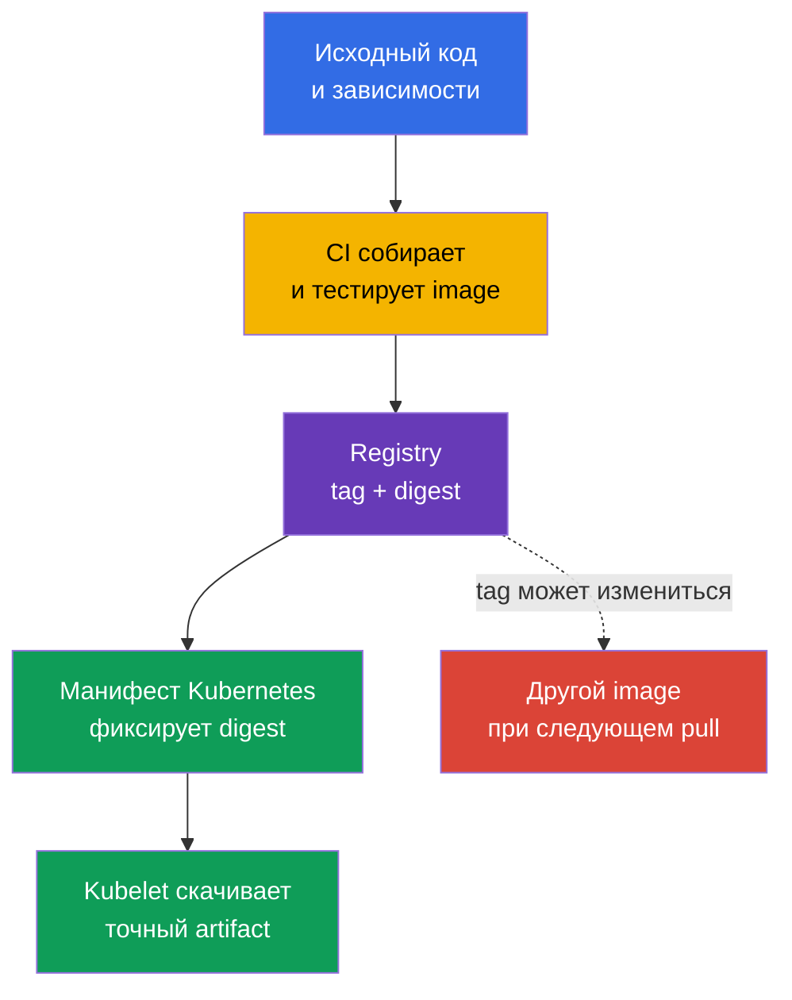
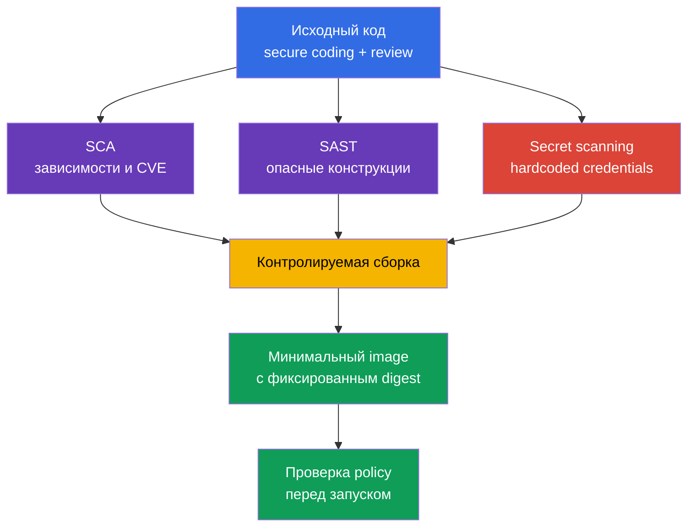

[Eng version](README.md) · [Versión en español](es.md) · [Version française](fr.md) · [Deutsche Version](de.md) · [ქართული ვერსია](ge.md) · [繁體中文版](tw.md) · [日本語版](jp.md)

# Глава 06. Безопасность артефактов, образов и кода

> **Что дальше.** В [главе 05](../05/ru.md) мы рассмотрели controls, фреймворки и изоляцию рабочей нагрузки. Теперь проследим путь приложения до `Pod`: от исходного кода и зависимостей до container image в registry. Это часть домена **Overview of Cloud Native Security** с весом 14%. Безопасный кластер не компенсирует вредоносный, уязвимый или непредсказуемо изменившийся образ.

Образ контейнера - исполняемый артефакт поставки. Он содержит приложение, его runtime, библиотеки и конфигурационные файлы. Поэтому безопасность образа начинается до Kubernetes: с доверия к registry, воспроизводимой сборки, состава зависимостей и отсутствия секретов в исходниках.

## 06.1 Реестры, теги, дайджесты и доверенные образы

**Container registry** хранит и раздаёт container images. Kubernetes не различает public и private registry с точки зрения формата образа, но различает их с точки зрения доверия и доступа.

- **Public registry** доступен из интернета. Он удобен для опубликованных базовых образов, но имя автора или популярность репозитория не доказывают безопасность содержимого.
- **Private registry** ограничивает push и pull учётными записями, ролями или сетевым доступом. Он помогает контролировать, кто публикует и кто получает внутренние артефакты, но не делает образ безопасным автоматически.
- **Proxy или mirror registry** кеширует разрешённые внешние образы. Такая точка позволяет журналировать загрузки, ограничить перечень источников и уменьшить зависимость сборок от внешней сети.

Путь образа состоит из registry, repository и ссылки на конкретную версию. Например, в `registry.example.internal/payments/api:v2.4.1` тег `v2.4.1` - человекочитаемое имя. В записи `registry.example.internal/payments/api@sha256:...` указан digest, то есть криптографический идентификатор конкретного содержимого манифеста образа.

| Способ ссылки | Что фиксирует | Главный риск | Типичное применение |
|---|---|---|---|
| Tag, например `v2.4.1` | Логическое имя версии | Тег можно переместить на другой образ | Удобная навигация и этап сборки |
| Mutable tag, например `latest` или `stable` | Только имя канала | Один и тот же манифест может запустить другие байты | Не использовать как неизменяемый production-релиз |
| Digest, например `@sha256:...` | Конкретное содержимое образа | Не сообщает сам по себе, кто и почему его собрал | Deployment и проверяемая поставка |

Тег удобен, но изменяем. Владелец repository может удалить `v2.4.1` и назначить этот тег новому image. При следующем pull Kubernetes получит другой артефакт, хотя YAML не менялся. Digest решает именно проблему идентичности: конкретный digest указывает на конкретные байты. Он не подтверждает, что байты безопасны, проверены или собраны вашей организацией.



`imagePullPolicy: Always` не делает образ более доверенным. Она лишь заставляет kubelet проверять registry при каждом запуске. Если ссылка использует mutable tag, kubelet может получить новую версию. Фиксация digest делает результат однозначным; политика pull определяет, когда проверять его доступность.

### Доверие к источнику

**Trusted image** - не просто образ без найденных CVE. Это артефакт, для которого организация может ответить на вопросы: откуда он получен, кто имеет право его публиковать, как он собран, был ли он проверен и разрешён ли для данной среды.

Обычная модель доверия включает несколько независимых контролей:

1. Разрешать registry и repository по allowlist, а не любой адрес из интернета.
2. Ограничить push в production repository отдельными service accounts и минимальными правами.
3. Проверять образ сканером на известные уязвимости и учитывать критичность, эксплуатируемость и наличие исправления.
4. Подписывать артефакты и проверять подпись до запуска. Подпись создаёт криптографическое утверждение, связанное с конкретным artifact/digest и signing key или signing identity. При verification система отдельно применяет trust policy: считается ли данный key/identity/issuer доверенным для этого артефакта. Подпись не доказывает отсутствие уязвимостей и не заменяет provenance или vulnerability scanning.
5. Фиксировать digest в deployment-артефакте и сохранять сведения о сборке, например SBOM и provenance.
6. Применять admission policy, которая отклоняет образы из неразрешённых registry или без нужной подписи.

У public registry есть дополнительные угрозы: typosquatting с похожим названием, захваченная учётная запись издателя, неожиданное изменение тега и непонятное происхождение base image. В private registry остаются угрозы чрезмерных прав на push, компрометации CI credential и отсутствия проверки того, что именно попало в repository.

> **Важно.** Запись `image: company/app:latest` не означает «самая безопасная версия». `latest` - обычный tag без специальной семантики Kubernetes. Он часто mutable, не сообщает версию и мешает расследованию: после инцидента трудно установить, какой именно image реально работал.

## 06.2 Минимальные образы: distroless, scratch и multi-stage build

Каждый пакет в final image увеличивает поверхность атаки: у него могут быть CVE, исполняемые утилиты, конфигурация и зависимые библиотеки. Минимизация образа уменьшает число компонентов, но не исправляет уязвимость приложения и не заменяет `SecurityContext`, сетевую изоляцию или runtime detection.

### Базовые варианты

| Основа final image | Содержимое | Когда полезна | Ограничение |
|---|---|---|---|
| `scratch` | Пустая файловая система | Статически скомпилированный binary с известными потребностями | Нет shell, CA bundle, timezone data и dynamic loader |
| distroless | Нужный language runtime и библиотеки без shell/package manager | Runtime приложения, которому не нужны интерактивные утилиты | Отладка через `kubectl exec -- sh` обычно невозможна |
| Полноценный Linux image | Shell, package manager и широкий набор пакетов | Обоснованная диагностика или специфичные runtime-зависимости | Больше компонентов и возможностей после компрометации |

`distroless` означает, что в образе оставлен минимальный набор для запуска приложения, но обычно нет shell и менеджера пакетов. Это усложняет злоумышленнику постэксплуатацию после RCE: он не получает готовые `sh`, `curl`, `wget` и package manager. Это не гарантия: процесс приложения всё ещё может читать доступные файлы, обращаться в сеть и использовать свои привилегии.

`scratch` - пустая база. Она подходит не «для любого маленького образа», а для приложения, которое запускается без динамических библиотек и отсутствующих runtime-файлов. Например, статическому Go binary для TLS может понадобиться CA bundle, а некоторым приложениям - timezone data или другие файлы, которых нет в `scratch`; их нужно явно добавить или смонтировать. В Kubernetes DNS-настройки Pod обычно предоставляет kubelet через `/etc/resolv.conf`, поэтому их не следует приводить как файл, который нужно автоматически включать в final image. Безопасность не должна достигаться случайным удалением нужных компонентов.

### Multi-stage build

Сборщик, компилятор, тестовые инструменты и исходный код нужны на этапе build, но обычно не нужны при запуске. **Multi-stage build** разделяет эти обязанности: первый stage создаёт artifact, второй содержит только runtime и необходимые файлы.

```dockerfile
# Этап сборки содержит компилятор и исходный код.
FROM golang:1.27.1 AS build
WORKDIR /src
COPY . .
RUN CGO_ENABLED=0 go build -o /out/api ./cmd/api

# Final image получает только готовый binary.
FROM scratch
COPY --from=build /out/api /api
USER 65532:65532
ENTRYPOINT ["/api"]
```

Пример показывает принцип, а не универсальный рецепт. Версии base image, зависимости и способ сборки выбирают в соответствии с политикой организации. Для приложения с динамическими библиотеками вместо `scratch` может потребоваться distroless runtime. Отдельно проверяют запуск, TLS-подключение, DNS, права на запись и работу под непривилегированным пользователем.

| Что не должно попадать в final stage без необходимости | Почему это важно |
|---|---|
| Компиляторы, package manager, тестовые фреймворки | Новые CVE и инструменты для постэксплуатации |
| Исходный код и `.git` | Риск раскрытия логики, ключей и истории изменений |
| Временные файлы сборки и кеши | Увеличивают образ и могут содержать credentials |
| Shell и административные утилиты | Упрощают интерактивные действия после RCE |

Минимальный образ требует иной операционной дисциплины. Нельзя рассчитывать, что инженер всегда войдёт в контейнер и установит утилиту. Наблюдаемость строят через логи, метрики, трейсы и при необходимости временный debug container с контролируемыми правами. Такой подход полезен и для эксплуатации, и для безопасности.

## 06.3 Безопасность кода, зависимостей и секретов

Образ наследует риски исходного кода. Даже идеально настроенный private registry не остановит SQL injection, SSRF, небезопасную десериализацию или зависимость с известной критической уязвимостью. Поэтому безопасность рабочей нагрузки включает secure coding и контроль жизненного цикла зависимостей.

### Secure coding как контроль до контейнера

**Secure coding** - набор инженерных практик, которые снижают вероятность уязвимостей до сборки и запуска. Для KCSA важно понимать назначение этих практик:

- валидировать входные данные и применять безопасные API вместо ручной обработки строк;
- проверять аутентификацию и авторизацию в приложении, а не считать сеть доверенной;
- обрабатывать ошибки без выдачи пользователю token, stack trace или внутренней конфигурации;
- ограничивать доступ приложения к сети, файловой системе и облачным credentials по принципу least privilege;
- проводить code review и поддерживать исправления используемых библиотек.

Static application security testing, или **SAST**, анализирует исходный код или compiled code без его запуска. Такой анализ может указать на опасный вызов API, инъекцию, hardcoded secret или небезопасную конфигурацию. Он уменьшает вероятность ошибки, но его результаты требуют контекста: не каждое предупреждение эксплуатируемо, и не каждая логическая ошибка видна статическому анализатору.

### Зависимости и SCA

Современное приложение включает прямые и транзитивные зависимости: language packages, ОС-пакеты, base image и плагины. **Software Composition Analysis**, или SCA, строит инвентарь зависимостей и сопоставляет версии с известными уязвимостями, лицензиями и политиками организации.

SCA отвечает на вопросы:

- какая библиотека и какая версия включена в artifact;
- существует ли известная CVE для этой версии;
- есть ли исправленная версия;
- является ли зависимость транзитивной;
- соответствует ли лицензия правилам организации.

SCA не равна сканированию container image, хотя области пересекаются. SCA в первую очередь рассматривает composition приложения. Image scanner обычно анализирует ОС-пакеты и библиотеки в собранном image. Надёжный процесс использует оба взгляда и не считает отчёт с нулём найденных CVE доказательством полной безопасности.

Lock file фиксирует разрешённые версии зависимостей и помогает сделать сборку повторяемой. Его наличие не отменяет обновления: зависимость может стать уязвимой уже после того, как lock file был создан. Поэтому в CI полезны регулярные проверки и понятный процесс оценки и исправления находок.

### Секреты не должны жить в коде и образе

Hardcoded password, API key, private key или cloud token часто оказываются в Git history, CI log, Docker layer или опубликованном image. Удалить строку в следующем коммите недостаточно: секрет может остаться в истории repository, в кеше CI или в уже загруженном слое image.

Правильная реакция на найденный секрет:

1. Немедленно отозвать или заменить credential. Секрет нужно считать скомпрометированным.
2. Удалить его из кода, конфигурации сборки и логов.
3. Проверить историю, артефакты и доступы, где он мог сохраниться.
4. Передавать секреты рабочей нагрузке через предназначенный механизм: Kubernetes `Secret` с ограниченным RBAC либо внешний secret manager.
5. Добавить secret scanning и review правила, чтобы не повторить ошибку.

Kubernetes `Secret` не делает допустимым хранение ключа в Dockerfile. Если секрет передан через `ARG`, `ENV` или скопирован в image, он может быть доступен в metadata или слоях. Секреты нужны приложению во время работы, а не как постоянная часть образа.



## 06.4 Место образов и кода в модели 4C и Platform Security

В модели 4C из [главы 03](../03/ru.md) образ относится прежде всего к слою **Container**, а исходный код и зависимости - к слою **Code**. Внешние слои не заменяют внутренние:

- Cloud IAM не исправляет hardcoded secret в репозитории.
- RBAC в кластере не делает mutable tag неизменяемым.
- `NetworkPolicy` не удаляет CVE из base image.
- Минимальный image не ограничивает чрезмерные права service account.

Поэтому защита строится слоями. Код проверяют до сборки, CI формирует известный artifact, registry контролирует хранение и распространение, а Kubernetes проверяет, что именно допускается к запуску. При компрометации одного контроля остальные уменьшают последствия.

Глава 06 объясняет входящие артефакты на уровне Overview of Cloud Native Security. В [главе 17](../17/ru.md) тема продолжится с точки зрения Platform Security: supply chain, SBOM, подписи, image repository и admission control. Там организация решает, как превращать доверие к digest и издателю в правило, которое Kubernetes применяет перед созданием `Pod`.

| Слой 4C | Вопрос безопасности | Пример контроля |
|---|---|---|
| Code | Не содержит ли приложение ошибки, уязвимые зависимости или secrets? | Review, SAST, SCA, secret scanning |
| Container | Что реально запускается и сколько в нём лишних компонентов? | Minimal base, multi-stage build, scanner, digest |
| Cluster | Допустит ли кластер неподходящий artifact? | Admission policy, allowlist registry, RBAC |
| Cloud | Кто может читать registry и credentials CI? | IAM, private endpoint, audit logging |

## 06.5 Как это применяют на практике

Команда платформы обычно формулирует базовый процесс поставки, а продуктовые команды следуют ему в CI/CD:

1. Используют утверждённые base images из controlled registry и регулярно обновляют их.
2. Собирают image в CI, запускают тесты, SAST, SCA, secret scanning и image scanning.
3. Публикуют результат в private registry с минимальными правами service account.
4. Сохраняют digest, SBOM и сведения о сборке рядом с релизом.
5. В deployment для production фиксируют digest, а не `:latest`.
6. Admission control разрешает только одобренные registry и, где принято, требует подпись или другие attestations.
7. Для обнаруженной CVE оценивают реальную экспозицию, наличие исправления и критичность рабочей нагрузки, затем обновляют зависимость или base image.

На associate-уровне полезно отличать средство от гарантии. Scanner находит известные проблемы, но не все уязвимости. Успешная verification подтверждает, что криптографическое утверждение над проверяемым artifact валидируется под ожидаемым signing key/identity; доверие к signer определяется отдельной verification policy. Она не доказывает отсутствие дефекта. Private registry ограничивает доступ, но не заменяет review. Комбинация контролей образует defense in depth.

## 06.6 Exam vocabulary / Мини-глоссарий

| Термин | Значение |
|---|---|
| Artifact | Результат поставки, например container image, SBOM или подписанный manifest. |
| Container registry | Сервис хранения и распространения container images. |
| Digest | Неизменяемый криптографический идентификатор конкретного содержимого image. |
| Distroless | Минимальный runtime image без обычного shell и package manager. |
| Image tag | Человекочитаемая метка образа, которая может быть изменена. |
| Multi-stage build | Сборка с отдельным builder stage и минимальным final stage. |
| SAST | Статический анализ кода без запуска приложения. |
| SCA | Анализ состава программного обеспечения и его зависимостей. |
| Secret scanning | Поиск credentials и других секретов в коде, истории и артефактах. |
| Trusted image | Image с проверяемым происхождением и набором контролей доверия. |

## 06.7 Exam Essentials / Итоги главы

- Registry хранит образы, но сам по себе не устанавливает доверие к ним. Public и private registry требуют контроля источника, доступа и публикации.
- Tag удобен для человека, но может быть mutable. Digest фиксирует конкретный artifact и предпочтителен для production deployment.
- `:latest` - обычный изменяемый tag, а не признак безопасности или новизны.
- Multi-stage build и minimal image уменьшают поверхность атаки, но не заменяют безопасность приложения и runtime controls.
- Secure coding, SAST, SCA и secret scanning защищают слой Code до запуска контейнера.
- Секрет нельзя считать безопасным, если он попал в Git, Dockerfile, CI log или image layer. Найденный credential отзывают и заменяют.
- Защита Container и Code связана с Platform Security: доверенный artifact нужно ещё проверить и разрешить к запуску.

## 06.8 Не путать и как это встречается на экзамене

В вопросах KCSA часто предлагают несколько полезных мер и спрашивают наиболее точную для заданной угрозы.

- Для воспроизводимого запуска выбирают **digest**, а не tag. Digest обеспечивает идентичность содержимого, но не заменяет подпись и сканирование.
- `latest` не означает «последний проверенный release». Это mutable tag, который ухудшает предсказуемость и расследование.
- `scratch` и distroless уменьшают состав образа, но не являются sandbox и не предотвращают все последствия RCE.
- SCA относится к составу зависимостей; SAST анализирует код; secret scanning ищет credentials. Инструменты дополняют друг друга.
- Private registry ограничивает доступ к образам, но доверие также зависит от publisher, CI, сканирования, подписи и policy.

## 06.9 Вопросы для самопроверки

### 1. Какой способ ссылки на image лучше всего фиксирует конкретный набор байтов для production deployment?

   - a. `registry.example/app:stable`

   - b. `registry.example/app:latest`

   - c. Любой tag при `imagePullPolicy: Always`

   - d. `registry.example/app@sha256:...`

<details>
<summary>Ответ и разбор</summary>

**Верный ответ: d.** Digest идентифицирует конкретное содержимое image. `latest` и `stable` являются тегами и могут быть переназначены. `imagePullPolicy: Always` проверяет registry, но не делает mutable tag неизменяемым.

</details>

### 2. Что точнее всего описывает `:latest`?

   - a. Неизменяемый digest последней сборки.

   - b. Обычный tag, который может указывать на разные образы в разное время.

   - c. Специальный Kubernetes-режим, который гарантирует самый новый безопасный образ.

   - d. Политика, запрещающая запуск без подписи.

<details>
<summary>Ответ и разбор</summary>

**Верный ответ: b.** Kubernetes не наделяет `latest` особыми свойствами доверия. Это tag, обычно mutable. Он не сообщает, какие конкретно байты были запущены, и не заменяет verification.

</details>

### 3. Какое утверждение о multi-stage build верно?

   - a. Он сохраняет compiler, исходный код и build cache в final image, чтобы production-контейнер мог повторить сборку.

   - b. Он автоматически подписывает final image и тем самым заменяет отдельную artifact signature verification.

   - c. Он делает SCA и image scanning ненужными, потому что зависимости проверяются между build stages автоматически.

   - d. Он собирает artifact в builder stage и копирует в final stage только нужные runtime-файлы и зависимости.

<details>
<summary>Ответ и разбор</summary>

**Верный ответ: d.** Multi-stage build позволяет оставить build-only tooling, исходники и промежуточные данные в builder stage, а в final image перенести только нужные runtime artifacts и dependencies. Подпись, SCA и image scanning остаются отдельными controls.

</details>

### 4. Для чего прежде всего применяют SCA?

   - a. Для анализа runtime-сетевых потоков между `Pod` и определения фактически установленных соединений.
   - b. Для инвентаризации software dependencies и сопоставления их версий с известными vulnerabilities и policy.
   - c. Для предоставления интерактивного shell в контейнерах, где отсутствуют стандартные debugging tools.
   - d. Для шифрования Kubernetes `Secret` data перед сохранением API-объектов в `etcd`.

<details>
<summary>Ответ и разбор</summary>

**Верный ответ: b.** SCA анализирует состав программного обеспечения: прямые и транзитивные зависимости, их версии, известные уязвимости и часто лицензии/policy. Runtime network visibility, debugging и encryption at rest решают другие задачи.

</details>

### 5. В Git-репозитории найден действующий cloud API key. Что должно быть первоочередным действием?

   - a. Удалить строку в следующем коммите и продолжить использовать ключ.

   - b. Закодировать ключ в base64 и сохранить в repository.

   - c. Отозвать или заменить ключ, затем удалить его из кода и проверить историю и артефакты.

   - d. Добавить ключ в `Dockerfile`, чтобы CI не терял его.

<details>
<summary>Ответ и разбор</summary>

**Верный ответ: c.** Секрет нужно считать скомпрометированным: он мог попасть в историю Git, кеши, логи или образ. Удаление строки не отменяет уже выданный доступ. Base64 не является защитой.

</details>

> **Куда дальше.** Для практической минимизации образов перейдите к главе 24 CKS. Цепочку поставки, SBOM и registry рассматривает глава 25 CKS, подписи - глава 26 CKS, статический анализ - глава 27 CKS, сканирование образов - глава 28 CKS. Концепции supply chain и admission control на уровне KCSA продолжает [глава 17](../17/ru.md).

[Оглавление](../README_RU.md) · [Глава 05](../05/ru.md) · [Глава 07](../07/ru.md)
