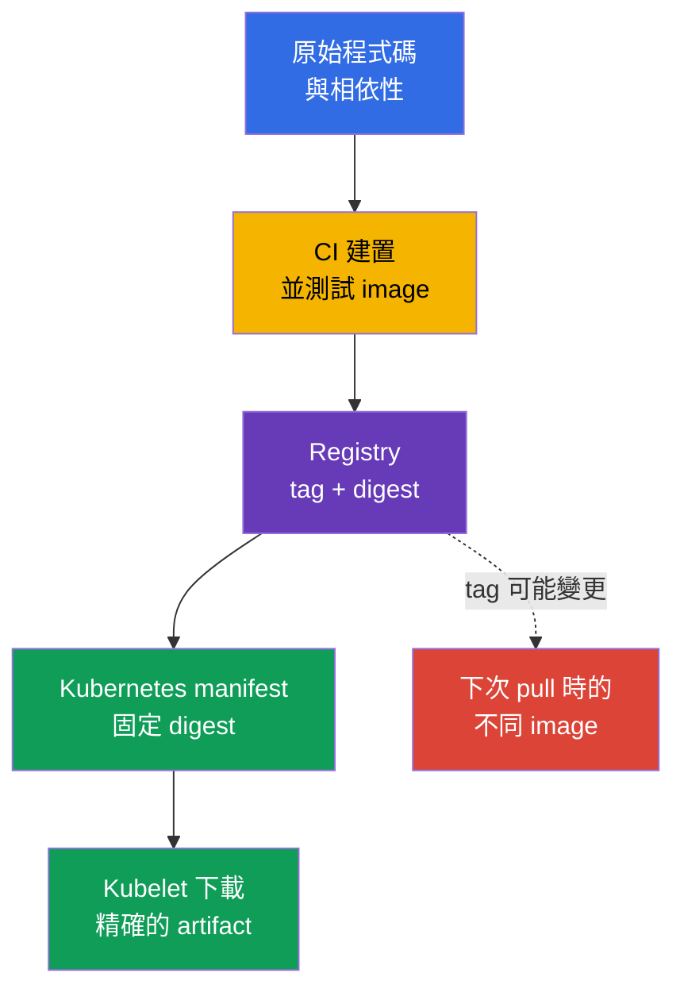
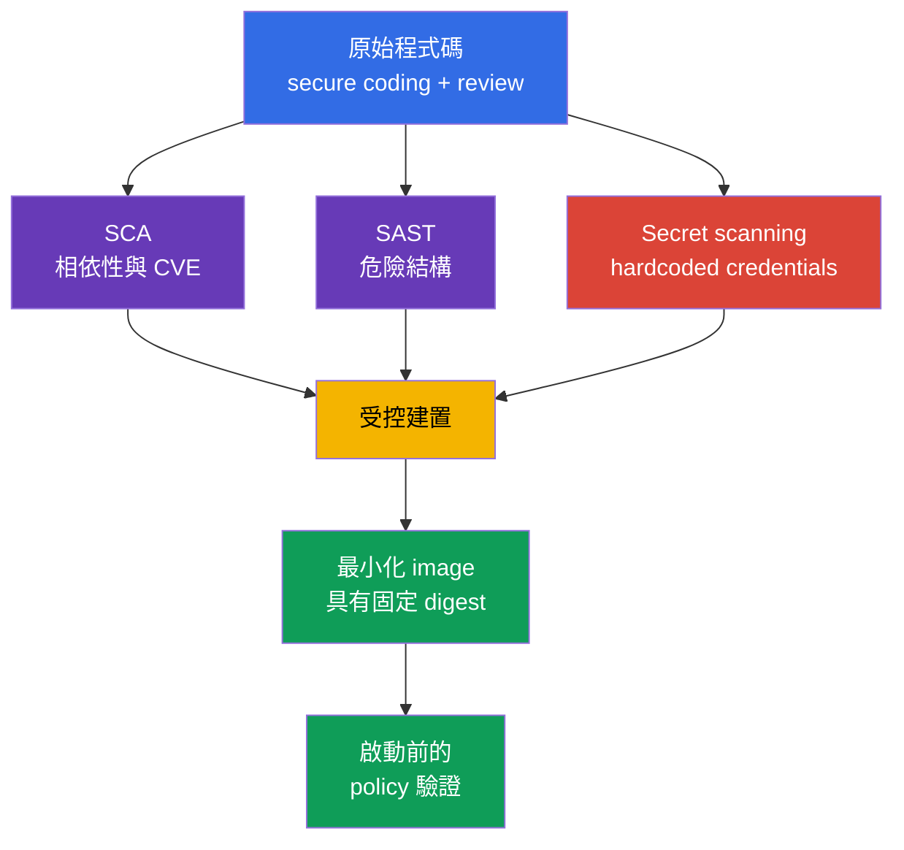

[Русская версия](ru.md) · [Eng version](README.md) · [Versión en español](es.md) · [Version française](fr.md) · [Deutsche Version](de.md) · [ქართული ვერსია](ge.md) · [日本語版](jp.md)

# 第 06 章。Artifact、image 與程式碼安全性

> **接下來。** 在[第 05 章](../05/tw.md)中，我們探討了控制措施、框架與工作負載隔離。現在將追蹤應用程式到 `Pod` 的路徑：從原始程式碼與相依性，到 registry 中的 container image。這是權重為 14% 的 **Overview of Cloud Native Security** 領域的一部分。安全的叢集無法彌補惡意、有漏洞或不可預測地變更過的 image。

Container image 是可執行的交付 artifact。它包含應用程式、其 runtime、函式庫與設定檔。因此，image 安全性在 Kubernetes 之前就開始：從對 registry 的信任、可重現的建置、相依性的組成，以及原始程式碼中沒有 secret。

## 06.1 Registry、tag、digest 與受信任的 image

**Container registry** 儲存並發佈 container images。就 image 格式而言，Kubernetes 不區分 public 與 private registry，但就信任與存取而言會加以區分。

- **Public registry** 可從網際網路存取。它適合已發布的 base image，但作者名稱或 repository 的熱門程度無法證明其內容安全。
- **Private registry** 以帳號、角色或網路存取限制 push 與 pull。它有助於控制誰可以發布及誰可以取得內部 artifact，但不會自動讓 image 變得安全。
- **Proxy 或 mirror registry** 快取已允許的外部 image。此類端點可記錄下載、限制來源清單，並降低建置對外部網路的依賴。

Image 路徑由 registry、repository 與對特定版本的參照構成。例如，在 `registry.example.internal/payments/api:v2.4.1` 中，tag `v2.4.1` 是人類可讀的名稱。在 `registry.example.internal/payments/api@sha256:...` 中指定的是 digest，也就是 image manifest 特定內容的密碼學識別碼。

| 參照方式 | 固定的內容 | 主要風險 | 典型用途 |
|---|---|---|---|
| Tag，例如 `v2.4.1` | 邏輯版本名稱 | Tag 可以移至另一個 image | 便利的導覽與建置階段 |
| Mutable tag，例如 `latest` 或 `stable` | 僅限通道名稱 | 相同 manifest 可能啟動不同的位元組 | 不可作為不可變的 production release 使用 |
| Digest，例如 `@sha256:...` | 特定 image 內容 | 本身不說明誰及為何建置它 | Deployment 與可驗證的交付 |

Tag 很方便，但可變更。Repository 擁有者可以刪除 `v2.4.1`，並將這個 tag 指派給新的 image。下次 pull 時，雖然 YAML 未變更，Kubernetes 會取得不同的 artifact。Digest 正好解決識別性問題：特定 digest 指向特定位元組。它不證明這些位元組安全、已驗證，或由您的組織建置。



`imagePullPolicy: Always` 不會使 image 更受信任。它只會要求 kubelet 每次啟動時檢查 registry。若參照使用 mutable tag，kubelet 可能取得新版本。固定 digest 使結果明確無誤；pull policy 則決定何時檢查其可用性。

### 對來源的信任

**Trusted image** 不只是沒有發現 CVE 的 image。它是組織能夠回答下列問題的 artifact：它來自何處、誰有權發布、如何建置、是否已驗證，以及是否獲准用於此環境。

常見的信任模型包含數個彼此獨立的控制措施：

1. 透過 allowlist 允許 registry 與 repository，而不是允許網際網路上的任何位址。
2. 以獨立的 service accounts 與最小權限，限制對 production repository 的 push。
3. 使用 scanner 檢查 image 是否有已知漏洞，並納入嚴重性、可利用性與是否有修正可用。
4. 對 artifact 簽署，並在執行前驗證簽章。簽章建立與特定 artifact/digest 及 signing key 或 signing identity 關聯的密碼學聲明。驗證時，系統會另行套用 trust policy：此 key/identity/issuer 是否被信任用於此 artifact。簽章不證明不存在漏洞，亦不取代 provenance 或 vulnerability scanning。
5. 在 deployment artifact 中固定 digest，並保存建置資訊，例如 SBOM 與 provenance。
6. 套用 admission policy，拒絕來自未允許 registry 或沒有必要簽章的 image。

Public registry 還有其他威脅：使用相似名稱的 typosquatting、發布者帳號被接管、tag 意外變更，以及 base image 來源不明。Private registry 仍存在過多 push 權限、CI credential 遭入侵，以及未驗證實際進入 repository 內容的威脅。

> **重要。** `image: company/app:latest` 不表示「最安全的版本」。`latest` 是沒有 Kubernetes 特殊語意的一般 tag。它通常是 mutable，不表示版本且妨礙調查：事件發生後，很難確定實際運作的是哪個 image。

## 06.2 最小化 image：distroless、scratch 與 multi-stage build

Final image 中的每個 package 都會增加攻擊面：它可能有 CVE、可執行的工具、設定及相依函式庫。最小化 image 可減少元件數量，但無法修正應用程式漏洞，也不能取代 `SecurityContext`、網路隔離或 runtime detection。

### 基本選項

| Final image 基礎 | 內容 | 適用時機 | 限制 |
|---|---|---|---|
| `scratch` | 空的檔案系統 | 具有已知需求的靜態編譯 binary | 沒有 shell、CA bundle、timezone data 與 dynamic loader |
| distroless | 必要的 language runtime 與函式庫，沒有 shell/package manager | 不需要互動式工具的應用程式 runtime | 通常無法透過 `kubectl exec -- sh` 偵錯 |
| 完整 Linux image | Shell、package manager 與廣泛的 package 集合 | 有正當理由的診斷或特定 runtime 相依性 | 遭入侵後有更多元件與能力 |

`distroless` 表示 image 中只保留執行應用程式所需的最小集合，但通常沒有 shell 與 package manager。這讓攻擊者在 RCE 後的後續利用更加困難：他不會直接取得現成的 `sh`、`curl`、`wget` 與 package manager。這不是保證：應用程式程序仍可能讀取可存取的檔案、連線至網路，並使用自身權限。

`scratch` 是空白基礎。它不適用於「任何小型 image」，而是適用於無須動態函式庫和缺少的 runtime 檔案即可執行的應用程式。例如，靜態 Go binary 若要使用 TLS，可能需要 CA bundle，而有些應用程式需要 `scratch` 中沒有的 timezone data 或其他檔案；必須明確加入或掛載它們。在 Kubernetes 中，Pod 的 DNS 設定通常由 kubelet 透過 `/etc/resolv.conf` 提供，因此不應將其說成是必須自動納入 final image 的檔案。安全性不應透過意外移除必要元件來達成。

### Multi-stage build

Builder、compiler、測試工具與原始程式碼在 build 階段需要，但執行時通常不需要。**Multi-stage build** 將這些職責分離：第一個 stage 建立 artifact，第二個 stage 僅包含 runtime 與必要檔案。

```dockerfile
# 建置階段包含 compiler 與原始程式碼。
FROM golang:1.27.1 AS build
WORKDIR /src
COPY . .
RUN CGO_ENABLED=0 go build -o /out/api ./cmd/api

# Final image 僅取得完成的 binary。
FROM scratch
COPY --from=build /out/api /api
USER 65532:65532
ENTRYPOINT ["/api"]
```

此範例說明原則，而非通用配方。Base image 版本、相依性與建置方法應依組織政策選擇。對於有動態函式庫的應用程式，可能需要 distroless runtime 而非 `scratch`。也應個別驗證啟動、TLS 連線、DNS、寫入權限，以及在非特權使用者下的運作。

| 不應在沒有必要時進入 final stage 的內容 | 為何重要 |
|---|---|
| Compiler、package manager、測試框架 | 新的 CVE 與後續利用工具 |
| 原始程式碼與 `.git` | 洩漏邏輯、金鑰與變更歷程的風險 |
| 暫存建置檔案與快取 | 增加 image 大小且可能含有 credentials |
| Shell 與管理工具 | 讓 RCE 後的互動操作更容易 |

最小化 image 需要不同的營運紀律。不能假定工程師隨時都能進入 container 並安裝工具。應透過日誌、指標、trace 建立可觀測性，並在必要時使用具受控權限的暫時 debug container。這種方法對營運與安全性都有幫助。

## 06.3 程式碼、相依性與 secret 的安全性

Image 繼承原始程式碼的風險。即使 private registry 設定完美，也無法阻止 SQL injection、SSRF、不安全的反序列化，或具有已知重大漏洞的相依性。因此，工作負載安全性包含 secure coding 與相依性生命週期控制。

### Secure coding 作為 container 之前的控制措施

**Secure coding** 是一組工程實務，可在建置與執行前降低漏洞機率。對 KCSA 而言，理解這些實務的用途很重要：

- 驗證輸入資料，並使用安全 API 而非手動處理字串；
- 在應用程式中驗證 authentication 與 authorization，而不是將網路視為受信任的；
- 處理錯誤時，不向使用者洩露 token、stack trace 或內部設定；
- 依 least privilege 原則限制應用程式對網路、檔案系統與雲端 credentials 的存取；
- 進行 code review，並持續修正所使用的函式庫。

Static application security testing，也就是 **SAST**，會在不執行原始程式碼或 compiled code 的情況下進行分析。此分析可指出危險的 API 呼叫、injection、hardcoded secret 或不安全的設定。它降低錯誤機率，但結果需要情境：不是每個警告都可被利用，也不是每個邏輯錯誤都能被靜態分析器看見。

### 相依性與 SCA

現代應用程式包含直接與傳遞相依性：language packages、OS package、base image 與 plugin。**Software Composition Analysis**，即 SCA，會建立相依性清單，並將版本與已知漏洞、授權及組織政策進行比對。

SCA 回答以下問題：

- 哪個函式庫及其哪個版本被納入 artifact；
- 此版本是否存在已知 CVE；
- 是否有已修正的版本；
- 相依性是否為傳遞相依；
- 授權是否符合組織規則。

SCA 不等於 container image scanning，儘管兩者範圍有所重疊。SCA 首要檢視應用程式的 composition。Image scanner 通常分析已建置 image 中的 OS package 與函式庫。可靠的流程會同時採用兩種觀點，且不會將 CVE 發現數為零的報告視為完全安全的證明。

Lock file 固定解析後的相依性版本，並有助於讓建置可重現。其存在不代表無須更新：相依性可能在 lock file 建立後才變得有漏洞。因此，CI 需要定期檢查，以及明確的發現評估與修正流程。

### Secret 不應存在於程式碼與 image 中

Hardcoded password、API key、private key 或 cloud token 經常出現在 Git history、CI log、Docker layer 或已發布的 image 中。僅在下一個 commit 移除該行並不足夠：secret 可能留在 repository history、CI cache 或已上傳的 image layer 中。

對發現的 secret 正確的回應是：

1. 立即撤銷或更換 credential。必須將 secret 視為已遭洩露。
2. 從程式碼、建置設定與日誌中移除它。
3. 檢查可能儲存它的 history、artifact 與存取權限。
4. 透過專用機制將 secret 提供給工作負載：具有限制 RBAC 的 Kubernetes `Secret` 或外部 secret manager。
5. 加入 secret scanning 與 review 規則，以避免重複犯錯。

Kubernetes `Secret` 不會讓在 Dockerfile 儲存金鑰變得可接受。若 secret 透過 `ARG`、`ENV` 傳遞或複製到 image 中，它可能可在 metadata 或 layer 中取得。應用程式在執行期間需要 secret，而不是讓它成為 image 的永久部分。



## 06.4 Image 與程式碼在 4C 模型及 Platform Security 中的位置

在[第 03 章](../03/tw.md)的 4C 模型中，image 主要屬於 **Container** 層，而原始程式碼與相依性屬於 **Code** 層。外層不能取代內層：

- Cloud IAM 無法修正 repository 中的 hardcoded secret。
- 叢集中的 RBAC 不會使 mutable tag 不可變。
- `NetworkPolicy` 無法從 base image 移除 CVE。
- 最小化 image 不會限制過多的 service account 權限。

因此，防護要分層建構。程式碼在建置前接受檢查，CI 產生已知 artifact，registry 控制儲存與散布，而 Kubernetes 驗證究竟允許哪些內容執行。一項控制措施遭入侵時，其餘措施可降低後果。

第 06 章從 Overview of Cloud Native Security 層級說明輸入 artifact。在[第 17 章](../17/tw.md)中，此主題會從 Platform Security 觀點延續：supply chain、SBOM、簽章、image repository 與 admission control。組織在該章節決定如何將對 digest 與發布者的信任轉換為 Kubernetes 在建立 `Pod` 前套用的規則。

| 4C 層 | 安全性問題 | 控制措施範例 |
|---|---|---|
| Code | 應用程式是否含有錯誤、有漏洞的相依性或 secrets？ | Review、SAST、SCA、secret scanning |
| Container | 實際執行什麼，以及其中有多少多餘元件？ | Minimal base、multi-stage build、scanner、digest |
| Cluster | 叢集是否會允許不合適的 artifact？ | Admission policy、allowlist registry、RBAC |
| Cloud | 誰可以讀取 registry 與 CI credentials？ | IAM、private endpoint、audit logging |

## 06.5 實務上的應用方式

Platform 團隊通常會制定基本交付流程，而產品團隊會在 CI/CD 中遵循：

1. 使用 controlled registry 中核准的 base images，並定期更新。
2. 在 CI 中建置 image，執行測試、SAST、SCA、secret scanning 與 image scanning。
3. 以最小 service account 權限將結果發布至 private registry。
4. 在 release 旁保存 digest、SBOM 與建置資訊。
5. 在 production 的 deployment 中固定 digest，而不是 `:latest`。
6. Admission control 僅允許已核准 registry，並在採用時要求簽章或其他 attestations。
7. 對已發現的 CVE，評估實際暴露程度、是否有修正可用及工作負載嚴重性，然後更新相依性或 base image。

在 associate 層級，區分工具與保證很有用。Scanner 會找出已知問題，但不會找出所有漏洞。成功的 verification 證明：受檢 artifact 上的密碼學聲明在預期的 signing key/identity 下可被驗證；對 signer 的信任由獨立的 verification policy 決定。它不證明不存在缺陷。Private registry 限制存取，但不取代 review。控制措施的組合構成 defense in depth。

## 06.6 Exam vocabulary / 迷你詞彙表

| 術語 | 含義 |
|---|---|
| Artifact | 交付結果，例如 container image、SBOM 或已簽署的 manifest。 |
| Container registry | 儲存與散布 container images 的服務。 |
| Digest | 特定 image 內容的不可變密碼學識別碼。 |
| Distroless | 沒有一般 shell 與 package manager 的最小 runtime image。 |
| Image tag | 可變更的人類可讀 image 標籤。 |
| Multi-stage build | 具有獨立 builder stage 與最小 final stage 的建置。 |
| SAST | 不執行應用程式的靜態程式碼分析。 |
| SCA | 軟體組成及其相依性的分析。 |
| Secret scanning | 在程式碼、history 與 artifact 中搜尋 credentials 及其他 secret。 |
| Trusted image | 具備可驗證來源及一組信任控制措施的 image。 |

## 06.7 Exam Essentials / 章節重點

- Registry 儲存 image，但本身不建立對它們的信任。Public 與 private registry 都需要來源、存取與發布控制。
- Tag 方便人類使用，但可能是 mutable。Digest 固定特定 artifact，且更適合 production deployment。
- `:latest` 是一般 mutable tag，而非安全性或新穎性的標誌。
- Multi-stage build 與 minimal image 可降低攻擊面，但不取代應用程式安全性與 runtime controls。
- Secure coding、SAST、SCA 與 secret scanning 在 container 執行前保護 Code 層。
- 若 secret 已進入 Git、Dockerfile、CI log 或 image layer，就不能視為安全。應撤銷並更換發現的 credential。
- Container 與 Code 防護和 Platform Security 有關：仍必須驗證並允許受信任的 artifact 執行。

## 06.8 不要混淆，以及它們在考試中的出現方式

KCSA 題目常會提出多項有用措施，並詢問哪一項最精確地應對指定威脅。

- 對於可重現的執行，選擇 **digest** 而非 tag。Digest 確保內容識別性，但不取代簽章與 scanning。
- `latest` 不表示「最後一個已驗證的 release」。它是會降低可預測性與調查能力的 mutable tag。
- `scratch` 與 distroless 可減少 image 組成，但不是 sandbox，也不能防止 RCE 的所有後果。
- SCA 與相依性組成相關；SAST 分析程式碼；secret scanning 搜尋 credentials。這些工具相互補足。
- Private registry 限制對 image 的存取，但信任還取決於 publisher、CI、scanning、簽章與 policy。

## 06.9 自我檢查問題

### 1. 哪種 image 參照方式最能固定 production deployment 的特定位元組集合？

   - a. `registry.example/app:stable`

   - b. `registry.example/app:latest`

   - c. 使用 `imagePullPolicy: Always` 的任何 tag

   - d. `registry.example/app@sha256:...`

<details>
<summary>答案與說明</summary>

**正確答案：d。** Digest 識別特定 image 內容。`latest` 與 `stable` 都是可重新指派的 tag。`imagePullPolicy: Always` 會檢查 registry，但不會使 mutable tag 不可變。

</details>

### 2. 哪個選項最準確地描述 `:latest`？

   - a. 最後一次建置的不可變 digest。

   - b. 一般 tag，在不同時間可能指向不同 image。

   - c. 保證最新安全 image 的特殊 Kubernetes 模式。

   - d. 禁止未簽署內容執行的 policy。

<details>
<summary>答案與說明</summary>

**正確答案：b。** Kubernetes 不賦予 `latest` 特殊的信任屬性。它是通常 mutable 的 tag。它不表示執行了哪些特定位元組，也不取代 verification。

</details>

### 3. 關於 multi-stage build，哪個敘述正確？

   - a. 它將 compiler、原始程式碼與 build cache 保留在 final image，使 production container 可以重複建置。

   - b. 它自動簽署 final image，因此取代獨立的 artifact signature verification。

   - c. 它使 SCA 與 image scanning 變得不必要，因為相依性會在 build stages 之間自動驗證。

   - d. 它在 builder stage 中建置 artifact，且只將必要的 runtime 檔案與相依性複製到 final stage。

<details>
<summary>答案與說明</summary>

**正確答案：d。** Multi-stage build 可將僅供建置使用的 tooling、原始程式碼與中間資料留在 builder stage，並僅將必要的 runtime artifacts 與 dependencies 移至 final image。簽章、SCA 與 image scanning 仍是獨立的 controls。

</details>

### 4. SCA 最主要用於何處？

   - a. 分析 `Pod` 間的 runtime 網路流量，並確定實際建立的連線。
   - b. 清查 software dependencies，並將其版本與已知 vulnerabilities 及 policy 比對。
   - c. 在缺少標準 debugging tools 的 container 中提供互動式 shell。
   - d. 在 Kubernetes `Secret` data 儲存 API 物件至 `etcd` 前加密它。

<details>
<summary>答案與說明</summary>

**正確答案：b。** SCA 分析軟體組成：直接與傳遞相依性、其版本、已知漏洞，通常也包含 licenses/policy。Runtime network visibility、debugging 與 encryption at rest 解決的是其他問題。

</details>

### 5. 在 Git repository 中發現仍有效的 cloud API key。最優先應採取何種行動？

   - a. 在下一個 commit 移除該行，並繼續使用該 key。

   - b. 將 key 以 base64 編碼並儲存在 repository 中。

   - c. 撤銷或更換 key，然後將其從程式碼移除，並檢查 history 與 artifact。

   - d. 將 key 加入 `Dockerfile`，以免 CI 遺失它。

<details>
<summary>答案與說明</summary>

**正確答案：c。** Secret 必須視為已遭洩露：它可能進入 Git history、cache、log 或 image。移除該行不會撤銷已授予的存取權。Base64 並非保護措施。

</details>

> **接下來去哪裡。** 若要實際最小化 image，請前往 CKS 第 24 章。Supply chain、SBOM 與 registry 請見 CKS 第 25 章，簽章請見第 26 章，靜態分析請見第 27 章，image scanning 請見第 28 章。KCSA 層級的 supply chain 與 admission control 概念由[第 17 章](../17/tw.md)延續。

[目錄](../README_TW.md) · [第 05 章](../05/tw.md) · [第 07 章](../07/tw.md)