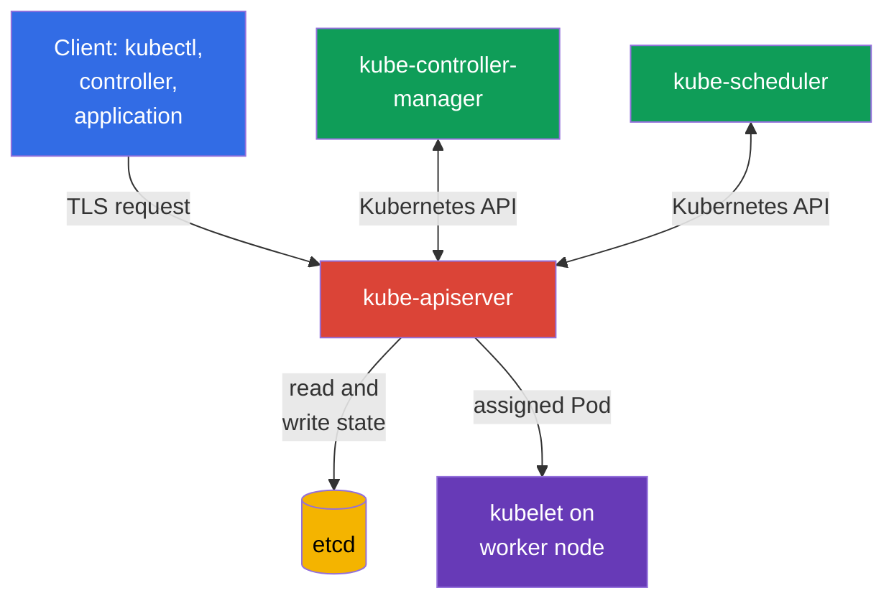
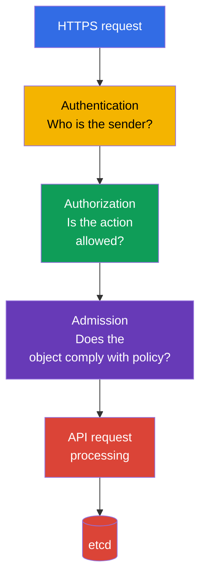

[Русская версия](ru.md) · [Versión en español](es.md) · [Version française](fr.md) · [Deutsche Version](de.md) · [ქართული ვერსია](ge.md) · [繁體中文版](tw.md) · [日本語版](jp.md)

# Chapter 07. Control plane security: API Server, Controller Manager, Scheduler, Etcd

> **What comes next.** In the previous chapters, we covered cloud, image, and code security. Now we move on to the Kubernetes control plane. It belongs to the Kubernetes Cluster Component Security domain, which accounts for 22% of the KCSA exam: compromising the control plane usually means compromising the entire cluster.

## 07.1 Control plane and why it is a critical area

The control plane maintains the desired state of the cluster. It accepts requests, stores Kubernetes objects, and continuously reconciles the actual state with the state described in the API. Its key components usually run on control plane nodes, but they logically form a single control plane:

- `kube-apiserver` provides the Kubernetes API and is the entry point for `kubectl`, controllers, and other components;
- `etcd` stores cluster state;
- `kube-controller-manager` runs controllers that watch the API and correct deviations from the desired state;
- `kube-scheduler` selects a worker node for a new `Pod`.

There are two especially important trust boundaries here. The first is between the client and the API Server: the cluster must understand who sent the request and what that subject is allowed to do. The second is between the API Server and `etcd`: the data store contains the cluster's most valuable data and must not be accessible from arbitrary networks or to node users.

Control plane protection is built in layers: restricted network and node access, TLS, reliable component credentials, least privilege for API access, auditing, and backups. One control does not replace another. For example, TLS protects traffic, but it will not prevent a legitimate yet overly privileged client from deleting objects through the API.

## 07.2 API Server: decision chain and dangerous entry points

`kube-apiserver` is Kubernetes' central intermediary. Even control plane components usually do not read `etcd` directly: they call the API Server. Therefore, its availability, configuration, and logs are especially important.

In simplified form, a request passes through three consecutive stages:

1. **Authentication** establishes an identity: for example, a user through a client certificate, a ServiceAccount through a token, or an external user through OIDC.
2. **Authorization** checks that identity's permissions. RBAC is a typical mechanism. A request can be denied even though the client was successfully authenticated.
3. **Admission** validates or modifies an object before it is saved. Built-in admission plugins, webhooks, and policies operate here. For example, admission can deny a `Pod` with `privileged: true`.

The order matters for MCQs (multiple choice questions): admission does not replace authentication and does not grant permissions to a user. It receives an already authenticated and authorized request.

### Anonymous access

If the API Server accepts anonymous requests, an unauthenticated client receives the `system:anonymous` identity in the `system:unauthenticated` group. Enabling `--anonymous-auth` by itself does not mean that such a client can read secrets: authorization makes the final decision. However, anonymous access increases the attack surface, makes reconnaissance easier when RBAC bindings are misconfigured, and is unnecessary for normal API access.

The safe principle is to provide explicit credentials to every client and grant no unnecessary permissions to `system:unauthenticated`. Separately, verify which health and metrics endpoints are externally available and whether they truly need public access.

### Insecure ports and transport

The Kubernetes API should be accessed through a protected HTTPS endpoint with certificate verification. The historical insecure HTTP API Server port should not be considered an acceptable administration path: in modern Kubernetes, it is not a viable option for normal operations. Do not bypass TLS verification with client flags such as `--insecure-skip-tls-verify` without a justified temporary procedure.

The risk of an insecure endpoint is not limited to interception of a password or token. An attacker on the network can alter an API response, obtain credentials, or execute a request as the client. Network access to the API Server is usually limited by a load balancer, firewall, or security groups, but the network does not replace authentication and authorization.

## 07.3 Etcd: cluster state, secrets, and recovery

`etcd` is Kubernetes' distributed key-value store. It contains definitions of `Pod`, `Deployment`, `Service`, RBAC objects, `Secret`, and many other API objects. In modern clusters, a `Pod` usually receives a short-lived bound ServiceAccount token through `TokenRequest` as a projected volume; such a token is not stored as a separate token `Secret` in `etcd`. A manually created legacy `kubernetes.io/service-account-token` `Secret`, by contrast, is stored as a `Secret`. Loss of `etcd` integrity or availability affects the entire cluster.

A special property of `Secret` is that Kubernetes encodes ordinary `Secret` data in base64 rather than encrypting it. Without encryption at rest, a `Secret` value stored in `etcd` is available to anyone who obtains access to the data store or its backup. Base64 is not cryptographic protection.

| Risk | Consequence | Conceptual control |
|---|---|---|
| Unauthorized reading of `etcd` | Theft of `Secret`, persisted legacy token Secrets, configuration, and other sensitive Kubernetes state. | Do not expose the endpoint, restrict network and local access, use TLS and authentication |
| Modification of keys | Creation or modification of objects, compromise of cluster integrity | Minimal administrative access, protected credentials, auditing |
| Data loss | Inability to restore cluster state | Regular tested snapshots and protected storage of copies |
| Storing secrets without encryption at rest | Secrets are readable from the data store and backup | Encryption at rest, KMS when necessary, restricted access to keys |

### TLS and access restriction

The API Server client and `etcd` cluster members use TLS. It provides traffic confidentiality and makes it possible to verify connection parties with certificates. However, TLS does not make `etcd` secure if a private key is stolen or the endpoint is accessible to all network users.

For mTLS, it is important to separate certificate roles. For example, the PKI created by `kubeadm` uses a separate `etcd-ca` for etcd-related trust and a separate `apiserver-etcd-client` client certificate, with which `kube-apiserver` authenticates to `etcd`. This does not mean that every Kubernetes installation must have exactly this file structure or a separate root CA, but separating trust domains / CA chains makes it possible to avoid mixing serving and client credentials of different components, restrict trust separately, and independently plan etcd rotation or migration.

Do not use the `kube-apiserver` server certificate as a universal shared credential for etcd. A certificate must match its role, and private keys and CA material must be protected as sensitive control plane credentials.

A practical rule: the `etcd` endpoint must be accessible only to necessary control plane components. Do not place the `etcd` port behind a public load balancer, do not grant an application in a `Pod` direct access to it, and do not use shared credentials for all operators. Use the Kubernetes API, rather than direct writes to `etcd`, for normal modification of Kubernetes objects.

### Backups

An `etcd` snapshot contains the same sensitive state as the working data store. Therefore, a backup is not merely a convenience file: encrypt it, restrict access to it, control its retention period, and periodically test recovery. A backup without restore verification creates a false sense of readiness.

Compromising `etcd` often equals compromising the cluster. An attacker can extract secrets, modify RBAC, substitute a workload, or disrupt the control plane. This explains why protecting `etcd` concerns both secrets management and control plane security.

## 07.4 Controller Manager and Scheduler: service identities and attack surface

`kube-controller-manager` combines a set of controllers. A controller compares the desired state in the API with the actual state and tries to eliminate the difference. For example, the `Deployment` controller creates a `ReplicaSet`, while the `ReplicaSet` controller maintains the required number of `Pod` instances.

`kube-scheduler` watches `Pod` instances without an assigned `nodeName`, evaluates available worker nodes, and writes its scheduling decision through the API Server. It does not start a container itself, but its decision determines where the workload will run.

Both components are API clients and operate under their own identities, such as `system:kube-controller-manager` and `system:kube-scheduler`. Their kubeconfig, client certificates, tokens, and signing keys must be treated as sensitive data. If an attacker obtains such credentials, they can act within the component's permissions. Those permissions are often broad for controllers because they manage objects across the entire cluster.

Typical attack surface elements:

- kubeconfig, certificates, and component private keys;
- access to the API Server as a service identity;
- health, metrics, and profiling endpoints if they are exposed to the wrong networks or unprotected;
- startup parameters that affect authentication, authorization, TLS, or bind address;
- the ability to modify static Pod manifests or systemd configuration on a control plane node.

Do not give people Controller Manager or Scheduler credentials for everyday `kubectl` use. A service identity has a specific purpose, while an operator needs a separate, minimally privileged identity with accountable access.

## 07.5 Insecure flags: what you need to know at KCSA level

For the KCSA exam, it is important to recognize the class of dangerous configuration rather than memorize a complete list of flags or edit manifests. Suspicious settings are those that:

- allow anonymous access without necessity;
- disable authentication or authorization;
- make an endpoint available on all interfaces instead of the administrative network;
- use HTTP or disable TLS verification;
- disable audit logging;
- expose profiling, metrics, or debug endpoints to a broad network;
- weaken `etcd` protection or grant access to its data.

A flag by itself is not always a vulnerability. For example, a metrics endpoint may be needed by a monitoring system. The security question is: who can connect to it, how is that subject authenticated, what can they learn or modify, and is there a less risky way to provide the required function?

When reviewing a configuration, first look for explicitly insecure values, then relate them to the threat model. Remediation usually includes restricting network access, enabling secure modes, rotating compromised credentials, and reviewing logs. Detailed adjustment of control plane parameters belongs to the practical CKS level.

## 07.6 How this is applied in practice

A platform team typically treats control plane protection as a repeatable set of checks rather than a one-time configuration:

1. It restricts the path to the API Server to administrative networks and uses only TLS with a trusted CA.
2. It separates identities for people, CI/CD, and control plane components, and reviews RBAC using the least privilege principle.
3. It isolates `etcd` from worker nodes and application networks, protects certificates, and applies encryption at rest to sensitive resources.
4. It creates `etcd` snapshots, stores them as secret data, and regularly tests recovery in a secure environment.
5. It scans configuration against CIS Benchmark, tracks changes to static Pod manifests, and collects audit logs.

This does not mean that one team manually operates everything in every cluster. In managed Kubernetes, the cloud provider runs part of the control plane, but responsibility for IAM, API access, secrets, logs, networking, and understanding responsibility boundaries remains with the platform user.

## 07.7 Exam vocabulary / Mini-glossary

| Term | Meaning |
|---|---|
| control plane | Kubernetes components that manage cluster state and its workloads. |
| `kube-apiserver` | The central Kubernetes HTTPS API through which operations on cluster objects pass. |
| authentication | Establishing a client identity. |
| authorization | The decision on whether an identified subject has the right to perform an action. |
| admission | The stage of validating or modifying an API request after authentication and authorization. |
| `etcd` | Kubernetes state store. |
| encryption at rest | Encryption of data in storage, not only while it is transmitted over a network. |
| snapshot | A consistent backup of `etcd` state at a specific time. |
| service identity | A component account used to access the Kubernetes API. |

## 07.8 Exam Essentials / Chapter summary

- The control plane combines the API Server, `etcd`, Controller Manager, and Scheduler; compromising it affects the entire cluster.
- The API Server processes a request through authentication → authorization → admission. Successful authentication does not grant permission by itself.
- Anonymous access and insecure endpoints increase the attack surface and require especially strict restrictions.
- `etcd` contains cluster state, and without encryption at rest, `Secret` values are not cryptographically protected in storage.
- TLS, restricted access, credential protection, audit logs, and tested backups complement one another.
- Controller Manager and Scheduler have service identities with sensitive credentials and must be protected as privileged API clients.

## 07.9 What not to confuse and how this appears on the exam

KCSA questions usually test cause-and-effect relationships rather than exact flag syntax. Common wording includes: which component stores cluster state, in what order the API Server processes a request, why access to `etcd` is dangerous, what TLS protects, and how base64 differs from encryption at rest.

Typical traps:

- do not confuse authentication with authorization;
- do not consider admission a mechanism for granting RBAC permissions;
- do not consider base64 encryption;
- do not assume that a managed control plane completely removes the user's responsibility for API and data access;
- do not choose direct work with `etcd` as the normal way to manage Kubernetes objects.

## 07.10 Self-check questions

### 1. In what order does the API Server process a request in the simplified model?

   - a. authentication → admission → authorization

   - b. admission → authorization → authentication

   - c. authorization → admission → authentication

   - d. authentication → authorization → admission

Answer and explanation

**Correct answer: d.** Kubernetes first establishes the client's identity, then checks its permissions, and after that admission can validate or modify an allowed request.

### 2. Why is direct access to `etcd` by an unauthorized party a critical risk?

   - a. It allows management only of local kubelet logs and does not affect API state.
   - b. It provides access only to the scheduler cache and does not contain workload configuration.
   - c. It exposes only control plane metrics but does not allow reading or changing Kubernetes objects.
   - d. It can expose Kubernetes API state, including sensitive objects, and allow reading or changing critical cluster data.

Answer and explanation

**Correct answer: d.** `etcd` stores Kubernetes API state. Therefore, unauthorized direct access to it can affect the confidentiality and integrity of critical data; protection includes strict network reachability, mTLS, and encryption at rest for sensitive resources.

### 3. What best describes the risk of `--anonymous-auth` on kube-apiserver?

   - a. Unauthenticated requests automatically receive the permissions of any ServiceAccount in the namespace.
   - b. An unauthenticated request receives an anonymous identity, and an incorrect authorization configuration can allow it unwanted API actions.
   - c. An anonymous client automatically becomes `system:masters`, regardless of authorizer configuration.
   - d. Enabling anonymous authentication disables TLS certificate verification between the API Server and `etcd`.

Answer and explanation

**Correct answer: b.** Anonymous authentication defines the identity of an unauthenticated request; authorization still determines the actual permissions. The risk occurs when the anonymous identity receives unnecessary permissions or when an anonymous endpoint increases the attack surface.

### 4. Which control most directly protects `Secret` data stored in `etcd` or its backup from being read from the data store itself?

   - a. Restrict application traffic through NetworkPolicy and use TLS between user services while leaving storage data without encryption at rest.

   - b. Restrict the Kubernetes API through RBAC and store Secret data in base64, considering encoding sufficient protection for storage.

   - c. Use encryption at rest and separately restrict access to etcd, snapshots, and key material for decryption.

   - d. Use mTLS between the API Server and etcd, but store snapshots and keys without separate access control.

Answer and explanation

**Correct answer: c.** Encryption at rest protects stored records, while `etcd`, backups/snapshots, and decryption key material must have separate access control. NetworkPolicy and transport mTLS protect other boundaries, and base64 is not encryption.

### 5. How should credentials for `kube-controller-manager` and `kube-scheduler` be treated?

   - a. As shared administrative credentials if the control plane endpoint is closed to the internal network.

   - b. As public service data because these components operate inside the control plane.

   - c. As privileged component API credentials that must be protected and limited according to least privilege.

   - d. As a replacement for the API Server serving certificate if TLS is already used between components.

Answer and explanation

**Correct answer: c.** `kube-controller-manager` and `kube-scheduler` are authenticated API clients. Their kubeconfig, client certificates, keys, or tokens are sensitive credentials and must have only the permissions required by the component. An internal network does not make shared administrator credentials secure, and a component's client identity does not replace the API Server serving certificate.

> **Where next.** For practical configuration review, study CKS chapter 07 on CIS Benchmark and `kube-bench`, CKS chapter 09 on control plane protection and TLS, and CKS chapter 21 on secrets management and `etcd`.

[Contents](../README.md) · [Chapter 06](../06/README.md) · [Chapter 08](../08/README.md)
