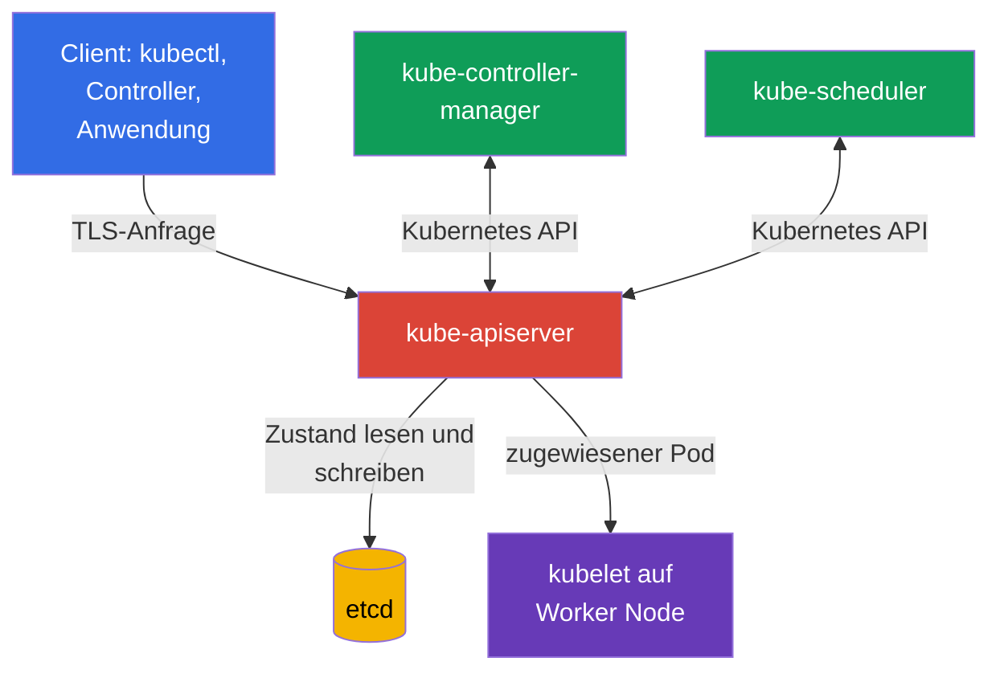
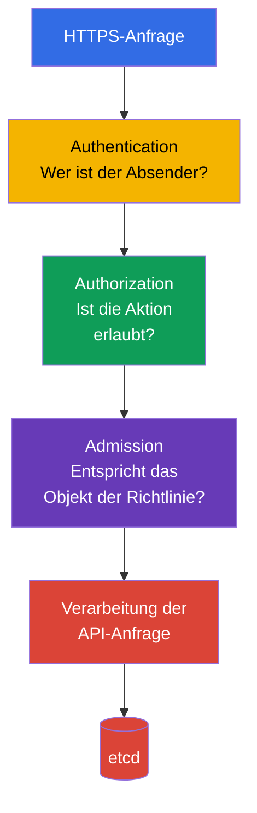

[Русская версия](ru.md) · [Eng version](README.md) · [Versión en español](es.md) · [Version française](fr.md) · [ქართული ვერსია](ge.md) · [繁體中文版](tw.md) · [日本語版](jp.md)

# Kapitel 07. Sicherheit der Control Plane: API Server, Controller Manager, Scheduler, Etcd

> **Wie geht es weiter?** In den vorherigen Kapiteln haben wir die Sicherheit der Cloud, von Images und von Code behandelt. Jetzt wenden wir uns der Kubernetes Control Plane zu. Sie gehört zur Domäne Kubernetes Cluster Component Security, die 22 % der KCSA-Prüfung ausmacht: Eine Kompromittierung der Control Plane bedeutet gewöhnlich die Kompromittierung des gesamten Clusters.

## 07.1 Control Plane und warum sie eine kritische Zone ist

Die Control Plane hält den gewünschten Zustand des Clusters aufrecht. Sie nimmt Anfragen entgegen, speichert Kubernetes-Objekte und führt den tatsächlichen Zustand fortlaufend dem im API beschriebenen Zustand zu. Ihre Schlüsselkomponenten laufen gewöhnlich auf Control-Plane-Knoten, bilden logisch jedoch eine einheitliche Steuerungsebene:

- `kube-apiserver` stellt die Kubernetes API bereit und ist der Einstiegspunkt für `kubectl`, Controller und andere Komponenten;
- `etcd` speichert den Clusterzustand;
- `kube-controller-manager` führt Controller aus, die die API beobachten und Abweichungen vom gewünschten Zustand korrigieren;
- `kube-scheduler` wählt für einen neuen `Pod` einen Worker Node aus.

Hier gibt es zwei besonders wichtige Vertrauensgrenzen. Die erste liegt zwischen Client und API Server: Das Cluster muss erkennen, wer die Anfrage gesendet hat und was diesem Subjekt erlaubt ist. Die zweite liegt zwischen API Server und `etcd`: Der Datenspeicher enthält die wertvollsten Daten des Clusters und darf keinem beliebigen Netzwerk oder Node-Benutzer zugänglich sein.

Der Schutz der Control Plane besteht aus mehreren Schichten: eingeschränktes Netzwerk und eingeschränkter Zugriff auf Nodes, TLS, zuverlässige Component Credentials, least privilege für API-Zugriff, Auditierung und Backups. Eine Kontrolle ersetzt keine andere. TLS schützt beispielsweise den Datenverkehr, hindert aber keinen legitimen, jedoch übermäßig privilegierten Client daran, Objekte über die API zu löschen.

## 07.2 API Server: Entscheidungskette und gefährliche Einstiegspunkte

`kube-apiserver` ist der zentrale Vermittler von Kubernetes. Selbst die Control-Plane-Komponenten lesen `etcd` gewöhnlich nicht direkt: Sie wenden sich an den API Server. Daher sind seine Verfügbarkeit, Konfiguration und Logs besonders wichtig.

Vereinfacht durchläuft eine Anfrage drei aufeinanderfolgende Phasen:

1. **Authentication** legt die Identität fest: beispielsweise die eines Benutzers anhand eines Client-Zertifikats, die eines ServiceAccount anhand eines Tokens oder die eines externen Benutzers über OIDC.
2. **Authorization** prüft die Rechte dieser Identität. Der typische Mechanismus ist RBAC. Die Anfrage kann abgelehnt werden, obwohl der Client erfolgreich authentifiziert wurde.
3. **Admission** prüft oder verändert das Objekt vor dem Speichern. Hier wirken integrierte Admission Plugins, Webhooks und Richtlinien. Admission kann beispielsweise einen `Pod` mit `privileged: true` verbieten.

Die Reihenfolge ist für MCQ (multiple choice question, Frage mit mehreren Antwortmöglichkeiten) wichtig: Admission ersetzt Authentication nicht und erteilt dem Benutzer keine Rechte. Es erhält eine bereits authentifizierte und autorisierte Anfrage.

### Anonymous access

Wenn der API Server anonyme Anfragen annimmt, erhält ein nicht authentifizierter Client die Identität `system:anonymous` in der Gruppe `system:unauthenticated`. Ein aktiviertes `--anonymous-auth` bedeutet für sich allein nicht, dass ein solcher Client Secrets lesen kann: Die endgültige Entscheidung bleibt bei Authorization. Anonymer Zugriff vergrößert jedoch die Angriffsfläche, erleichtert die Aufklärung bei fehlerhaften RBAC-Bindungen und ist für den gewöhnlichen API-Zugriff nicht nötig.

Das sichere Prinzip besteht darin, jedem Client explizite Credentials bereitzustellen und `system:unauthenticated` keine überflüssigen Berechtigungen zu geben. Zusätzlich wird geprüft, welche Health- und Metrics-Endpoints von außen erreichbar sind und ob sie wirklich öffentlichen Zugriff benötigen.

### Unsichere Ports und Transport

Auf die Kubernetes API sollte über einen geschützten HTTPS-Endpoint mit Zertifikatsprüfung zugegriffen werden. Der historische unsichere HTTP-Port des API Server sollte nicht als zulässiger Administrationsweg betrachtet werden: In modernem Kubernetes ist er keine funktionsfähige Option für den normalen Betrieb. Die TLS-Prüfung sollte nicht ohne begründete, zeitlich begrenzte Vorgehensweise mit Client-Flags wie `--insecure-skip-tls-verify` umgangen werden.

Das Risiko eines unsicheren Endpoint besteht nicht nur darin, dass ein Passwort oder Token abgefangen wird. Ein Angreifer im Netzwerk kann die API-Antwort manipulieren, Credentials erlangen oder eine Anfrage im Namen des Clients ausführen. Der Netzwerkzugriff auf den API Server wird gewöhnlich durch einen Load Balancer, eine Firewall oder Security Groups begrenzt, aber das Netzwerk ersetzt Authentication und Authorization nicht.

## 07.3 Etcd: Clusterzustand, Secrets und Wiederherstellung

`etcd` ist der verteilte Key-Value-Speicher von Kubernetes. Er enthält Beschreibungen von `Pod`, `Deployment`, `Service`, RBAC-Objekten, `Secret` und vielen anderen API-Objekten. In modernen Clustern erhält ein `Pod` gewöhnlich einen kurzlebigen gebundenen ServiceAccount token über `TokenRequest` als projected volume; ein solches Token wird nicht als separates token `Secret` in `etcd` gespeichert. Ein manuell erstelltes Legacy-`kubernetes.io/service-account-token`-`Secret` wird dagegen als `Secret` gespeichert. Der Verlust der Integrität oder Verfügbarkeit von `etcd` betrifft das gesamte Cluster.

Eine besondere Eigenschaft von `Secret`: Kubernetes kodiert gewöhnliche Daten von `Secret` in base64, verschlüsselt sie jedoch nicht. Ohne encryption at rest ist ein in `etcd` gespeicherter `Secret`-Wert für jeden zugänglich, der Zugriff auf den Datenspeicher oder dessen Backup erhält. Base64 ist kein kryptografischer Schutz.

| Risiko | Folge | Konzeptionelle Kontrolle |
|---|---|---|
| Unbefugtes Lesen von `etcd` | Diebstahl von `Secret`, persistenten Legacy-Token-Secrets, Konfigurationen und anderem sensiblen Kubernetes-Zustand. | Endpoint nicht veröffentlichen, Netzwerk- und lokalen Zugriff beschränken, TLS und Authentication verwenden |
| Ändern von Schlüsseln | Erstellen oder Ändern von Objekten, Verletzung der Clusterintegrität | Möglichst wenige administrative Zugriffe, geschützte Credentials, Auditierung |
| Datenverlust | Unmöglichkeit, den Clusterzustand wiederherzustellen | Regelmäßige geprüfte Snapshots und geschützte Speicherung der Kopien |
| Speicherung von Secrets ohne encryption at rest | Secrets sind aus dem Datenspeicher und Backup lesbar | Encryption at rest, bei Bedarf KMS, Zugriff auf Schlüssel einschränken |

### TLS und Zugriffsbeschränkung

Der API-Server-Client und die `etcd`-Cluster-Mitglieder verwenden TLS. Es gewährleistet die Vertraulichkeit des Datenverkehrs und ermöglicht, die Seiten der Verbindung anhand von Zertifikaten zu bestätigen. TLS macht `etcd` jedoch nicht sicher, wenn der private Schlüssel gestohlen wird oder der Endpoint für alle Netzwerkbenutzer zugänglich ist.

Für mTLS ist es wichtig, die Rollen von Zertifikaten zu trennen. Beispielsweise verwendet die von `kubeadm` erstellte PKI eine separate `etcd-ca` für etcd-related trust und ein separates Client-Zertifikat `apiserver-etcd-client`, mit dem sich `kube-apiserver` bei `etcd` authentifiziert. Das bedeutet nicht, dass jede Kubernetes-Installation genau diese Dateistruktur oder eine separate Root CA haben muss, aber die Trennung von trust domains / CA chains verhindert die Vermischung von Serving- und Client-Credentials verschiedener Komponenten, begrenzt Vertrauen separat und ermöglicht die unabhängige Planung von Rotation oder Migration von etcd.

Das Server-Zertifikat `kube-apiserver` darf nicht als universelles Shared Credential für etcd verwendet werden. Das Zertifikat muss seiner Rolle entsprechen, und private keys sowie CA material werden als sensible Control-Plane-Credentials geschützt.

Praktische Regel: Der `etcd`-Endpoint darf nur den erforderlichen Control-Plane-Komponenten zugänglich sein. Stellen Sie den `etcd`-Port nicht hinter einen öffentlichen Load Balancer, geben Sie einer Anwendung in einem `Pod` keinen direkten Zugriff darauf und verwenden Sie keine gemeinsamen Credentials für alle Operatoren. Für reguläre Änderungen von Kubernetes-Objekten wird die Kubernetes API verwendet, nicht das direkte Schreiben in `etcd`.

### Backups

Ein `etcd`-Snapshot enthält denselben sensiblen Zustand wie der laufende Datenspeicher. Ein Backup ist daher nicht nur eine Datei zur Bequemlichkeit: Es wird verschlüsselt, der Zugriff darauf wird eingeschränkt, die Aufbewahrungsdauer kontrolliert und die Wiederherstellung regelmäßig geprüft. Ein Backup ohne Prüfung des Restore erzeugt ein falsches Gefühl der Bereitschaft.

Die Kompromittierung von `etcd` entspricht oft der Kompromittierung des Clusters. Ein Angreifer kann Secrets extrahieren, RBAC ändern, Workloads manipulieren oder die Funktion der Control Plane beeinträchtigen. Dies erklärt, warum der Schutz von `etcd` sowohl zum Secrets Management als auch zur Sicherheit der Control Plane gehört.

## 07.4 Controller Manager und Scheduler: Dienstidentitäten (service identity) und Angriffsfläche

`kube-controller-manager` vereint eine Reihe von Controllern. Ein Controller vergleicht den gewünschten Zustand aus der API mit dem tatsächlichen Zustand und versucht, die Differenz zu beseitigen. Beispielsweise erstellt der `Deployment`-Controller ein `ReplicaSet`, und der `ReplicaSet`-Controller hält die benötigte Anzahl von `Pod` aufrecht.

`kube-scheduler` beobachtet `Pod` ohne zugewiesenen `nodeName`, bewertet verfügbare Worker Nodes und schreibt die Zuweisungsentscheidung über den API Server. Er startet Container nicht selbst, seine Entscheidung bestimmt jedoch, wo der Workload ausgeführt wird.

Beide Komponenten sind API-Clients und arbeiten unter eigenen Identitäten, beispielsweise `system:kube-controller-manager` und `system:kube-scheduler`. Ihre kubeconfig, Client-Zertifikate, Tokens und Signaturschlüssel sind als sensible Daten zu behandeln. Erhält ein Angreifer solche Credentials, kann er innerhalb der Berechtigungen der Komponente handeln. Bei Controllern sind diese Berechtigungen oft weitreichend, da sie Objekte im gesamten Cluster verwalten.

Typische Elemente der Angriffsfläche:

- kubeconfig, Zertifikate und private keys der Komponenten;
- Zugriff auf den API Server im Namen einer Dienstidentität;
- Health-, Metrics- und Profiling-Endpoints, wenn sie für falsche Netzwerke zugänglich oder nicht geschützt sind;
- Startparameter, die Authentication, Authorization, TLS oder bind address beeinflussen;
- die Möglichkeit, Static Pod Manifests oder die systemd-Konfiguration auf einem Control-Plane-Node zu ändern.

Menschen sollten für das alltägliche `kubectl` nicht die Credentials von Controller Manager oder Scheduler erhalten. Eine Dienstidentität hat einen konkreten Zweck, während ein Operator eine separate, minimal privilegierte Identität mit nachvollziehbarem Zugriff benötigt.

## 07.5 Unsichere Flags: Was auf KCSA-Niveau zu wissen ist

In der KCSA-Prüfung ist es wichtig, die Klasse einer gefährlichen Konfiguration zu erkennen, statt die vollständige Liste von Flags auswendig zu lernen oder Manifests zu bearbeiten. Verdächtig sind Konfigurationen, die:

- anonymous access ohne Notwendigkeit erlauben;
- Authentication oder Authorization deaktivieren;
- einen Endpoint auf allen Interfaces statt im administrativen Netzwerk erreichbar machen;
- HTTP verwenden oder die TLS-Prüfung deaktivieren;
- audit logging deaktivieren;
- Profiling-, Metrics- oder Debug-Endpoints für ein breites Netzwerk öffnen;
- den Schutz von `etcd` schwächen oder Zugriff auf seine Daten gewähren.

Ein Flag ist nicht immer selbst eine Schwachstelle. Beispielsweise kann ein Metrics-Endpoint für ein Monitoring-System benötigt werden. Die Sicherheitsfrage lautet: Wer kann sich damit verbinden, wie authentifiziert sich dieses Subjekt, was kann es erfahren oder ändern, und gibt es eine weniger riskante Möglichkeit, die benötigte Funktion bereitzustellen?

Bei der Prüfung einer Konfiguration werden zuerst explizit unsichere Werte gesucht, dann werden sie dem Bedrohungsmodell gegenübergestellt. Die Behebung umfasst gewöhnlich die Einschränkung des Netzwerkzugriffs, das Aktivieren geschützter Modi, die Rotation kompromittierter Credentials und die Prüfung der Logs. Die detaillierte Anpassung der Parameter der Control Plane gehört zur praktischen Ebene von CKS.

## 07.6 Wie dies in der Praxis angewendet wird

Ein Plattformteam gestaltet den Schutz der Control Plane gewöhnlich als wiederholbaren Satz von Prüfungen, nicht als einmalige Konfiguration:

1. Es begrenzt den Weg zum API Server auf administrative Netzwerke und verwendet ausschließlich TLS mit einer vertrauenswürdigen CA.
2. Es trennt die Identitäten von Menschen, CI/CD und Control-Plane-Komponenten und prüft RBAC nach dem Prinzip least privilege.
3. Es schließt `etcd` für Worker Nodes und Anwendungsnetzwerke, schützt Zertifikate und verwendet encryption at rest für sensible Ressourcen.
4. Es erstellt `etcd`-Snapshots, speichert sie als geheime Daten und prüft die Wiederherstellung regelmäßig in einer sicheren Umgebung.
5. Es prüft die Konfiguration gegen den CIS Benchmark, überwacht Änderungen an Static Pod Manifests und sammelt audit logs.

Dies bedeutet nicht, dass ein Team in jedem Cluster alles manuell betreut. In managed Kubernetes wird ein Teil der Control Plane vom Cloud Provider betrieben, aber die Verantwortung für IAM, API-Zugriff, Secrets, Logs, Netzwerk und das Verständnis der Verantwortungsgrenzen verbleibt beim Plattformnutzer.

## 07.7 Exam vocabulary / Mini-Glossar

| Begriff | Bedeutung |
|---|---|
| control plane | Kubernetes-Komponenten, die den Zustand des Clusters und seiner Workloads steuern. |
| `kube-apiserver` | Zentrale HTTPS API von Kubernetes, über die Operationen mit Clusterobjekten laufen. |
| authentication | Feststellung der Identität eines Clients. |
| authorization | Entscheidung darüber, ob ein identifiziertes Subjekt eine Aktion ausführen darf. |
| admission | Phase zum Prüfen oder Ändern einer API-Anfrage nach Authentication und Authorization. |
| `etcd` | Datenspeicher für den Kubernetes-Zustand. |
| encryption at rest | Verschlüsselung der Daten im Datenspeicher, nicht nur bei der Übertragung über das Netzwerk. |
| snapshot | Konsistente Sicherung des `etcd`-Zustands zu einem bestimmten Zeitpunkt. |
| Dienstidentität (service identity) | Konto einer Komponente, mit dem sie auf die Kubernetes API zugreift. |

## 07.8 Exam Essentials / Zusammenfassung des Kapitels

- Die Control Plane vereint API Server, `etcd`, Controller Manager und Scheduler; ihre Kompromittierung betrifft das gesamte Cluster.
- Der API Server verarbeitet eine Anfrage in der Kette Authentication → Authorization → Admission. Eine erfolgreiche Authentifizierung verleiht nicht selbstständig Berechtigungen.
- Anonymous access und ungeschützte Endpoints vergrößern die Angriffsfläche und erfordern besonders strenge Einschränkungen.
- `etcd` enthält den Clusterzustand, und ohne encryption at rest sind Werte von `Secret` im Datenspeicher nicht kryptografisch geschützt.
- TLS, eingeschränkter Zugriff, der Schutz von Credentials, audit logs und geprüfte Backups ergänzen einander.
- Controller Manager und Scheduler besitzen Dienstidentitäten mit sensiblen Credentials und müssen als privilegierte API-Clients geschützt werden.

## 07.9 Nicht verwechseln und wie dies in der Prüfung vorkommt

KCSA-Fragen prüfen gewöhnlich Ursache-Wirkungs-Zusammenhänge, nicht die exakte Syntax eines Flags. Häufige Formulierungen sind: Welche Komponente speichert den Clusterzustand, in welcher Reihenfolge verarbeitet der API Server eine Anfrage, warum ist Zugriff auf `etcd` gefährlich, was schützt TLS und worin unterscheidet sich base64 von encryption at rest.

Typische Fallen:

- Authentication nicht mit Authorization verwechseln;
- Admission nicht als Mechanismus zum Erteilen von RBAC-Berechtigungen betrachten;
- base64 nicht als Verschlüsselung ansehen;
- nicht annehmen, dass eine managed Control Plane dem Nutzer die Verantwortung für den Zugriff auf API und Daten vollständig abnimmt;
- nicht die direkte Arbeit mit `etcd` als regulären Weg zur Verwaltung von Kubernetes-Objekten wählen.

## 07.10 Fragen zur Selbstkontrolle

### 1. In welcher Reihenfolge verarbeitet der API Server eine Anfrage im vereinfachten Modell?

   - a. authentication → admission → authorization

   - b. admission → authorization → authentication

   - c. authorization → admission → authentication

   - d. authentication → authorization → admission

Antwort und Erläuterung

**Richtige Antwort: d.** Zuerst stellt Kubernetes die Identität des Clients fest, dann prüft es dessen Berechtigungen, und danach kann Admission die zulässige Anfrage prüfen oder ändern.

### 2. Warum ist direkter Zugriff Unbefugter auf `etcd` ein kritisches Risiko?

   - a. Er ermöglicht nur die Verwaltung lokaler kubelet-Logs und betrifft den API-Zustand nicht.
   - b. Er bietet nur Zugriff auf den Scheduler-Cache und enthält keine Workload-Konfiguration.
   - c. Er öffnet nur Control-Plane-Metriken, erlaubt aber nicht das Lesen oder Ändern von Kubernetes-Objekten.
   - d. Er kann den Zustand der Kubernetes API einschließlich sensibler Objekte offenlegen und das Lesen oder Ändern kritischer Clusterdaten ermöglichen.

Antwort und Erläuterung

**Richtige Antwort: d.** `etcd` speichert den Zustand der Kubernetes API. Daher kann unbefugter direkter Zugriff darauf die Vertraulichkeit und Integrität kritischer Daten beeinträchtigen; der Schutz umfasst strenge Netzwerkzugänglichkeit, mTLS und encryption at rest für sensible Ressourcen.

### 3. Was beschreibt das Risiko von `--anonymous-auth` bei kube-apiserver am besten?

   - a. Nicht authentifizierte Anfragen erhalten automatisch die Rechte jedes beliebigen ServiceAccount im Namespace.
   - b. Eine nicht authentifizierte Anfrage erhält eine anonyme Identität, und eine fehlerhafte Authorization-Konfiguration kann ihr unerwünschte API-Aktionen erlauben.
   - c. Ein anonymer Client wird unabhängig von der Authorizer-Konfiguration automatisch zu `system:masters`.
   - d. Das Aktivieren von anonymous authentication deaktiviert die TLS-Zertifikatsprüfung zwischen API Server und `etcd`.

Antwort und Erläuterung

**Richtige Antwort: b.** Anonymous authentication legt die Identität einer nicht authentifizierten Anfrage fest; die tatsächlichen Permissions bestimmt weiterhin Authorization. Das Risiko entsteht, wenn die anonyme Identität unnötige Berechtigungen erhält oder ein anonymer Endpoint die Angriffsfläche vergrößert.

### 4. Welche Kontrolle schützt `Secret`-Daten, die in `etcd` oder dessen Backup gespeichert sind, am unmittelbarsten davor, aus dem Datenspeicher selbst gelesen zu werden?

   - a. Application Traffic mittels NetworkPolicy beschränken und TLS zwischen Benutzerservices verwenden, während Storage-Daten ohne encryption at rest verbleiben.

   - b. Die Kubernetes API mittels RBAC beschränken und Secret-Daten in base64 speichern, wobei die Kodierung als ausreichender Schutz des Storage betrachtet wird.

   - c. Encryption at rest verwenden und den Zugriff auf etcd, Snapshots und das Schlüsselmaterial zur Entschlüsselung separat beschränken.

   - d. mTLS zwischen API Server und etcd verwenden, Snapshots und Schlüssel jedoch ohne separate access control speichern.

Antwort und Erläuterung

**Richtige Antwort: c.** Encryption at rest schützt gespeicherte Einträge, und `etcd`, Backups/Snapshots sowie decryption key material benötigen separate access control. NetworkPolicy und Transport-mTLS schützen andere Grenzen, und base64 ist keine encryption.

### 5. Wie sollten Credentials von `kube-controller-manager` und `kube-scheduler` behandelt werden?

   - a. Als gemeinsame administrative Credentials, wenn der Control-Plane-Endpoint durch ein internes Netzwerk geschlossen ist.

   - b. Als öffentliche Servicedaten, weil diese Komponenten innerhalb der Control Plane arbeiten.

   - c. Als privilegierte API-Credentials von Komponenten, die geschützt und nach least privilege begrenzt werden.

   - d. Als Ersatz für das Serving-Zertifikat des API Server, wenn zwischen den Komponenten bereits TLS verwendet wird.

Antwort und Erläuterung

**Richtige Antwort: c.** `kube-controller-manager` und `kube-scheduler` sind authentifizierte API-Clients. Ihre kubeconfig, Client-Zertifikate, Keys oder Tokens sind sensible Credentials und dürfen nur die für die Komponente erforderlichen Permissions besitzen. Ein internes Netzwerk macht gemeinsame Admin-Credentials nicht sicher, und die Client-Identität einer Komponente ersetzt nicht das Serving-Zertifikat des API Server.

> **Wie geht es weiter?** Für die praktische Prüfung der Konfiguration lesen Sie Kapitel 07 CKS über CIS Benchmark und `kube-bench`, Kapitel 09 CKS über den Schutz der Control Plane und TLS sowie Kapitel 21 CKS über Secrets Management und `etcd`.

[Inhaltsverzeichnis](../README_DE.md) · [Kapitel 06](../06/de.md) · [Kapitel 08](../08/de.md)
