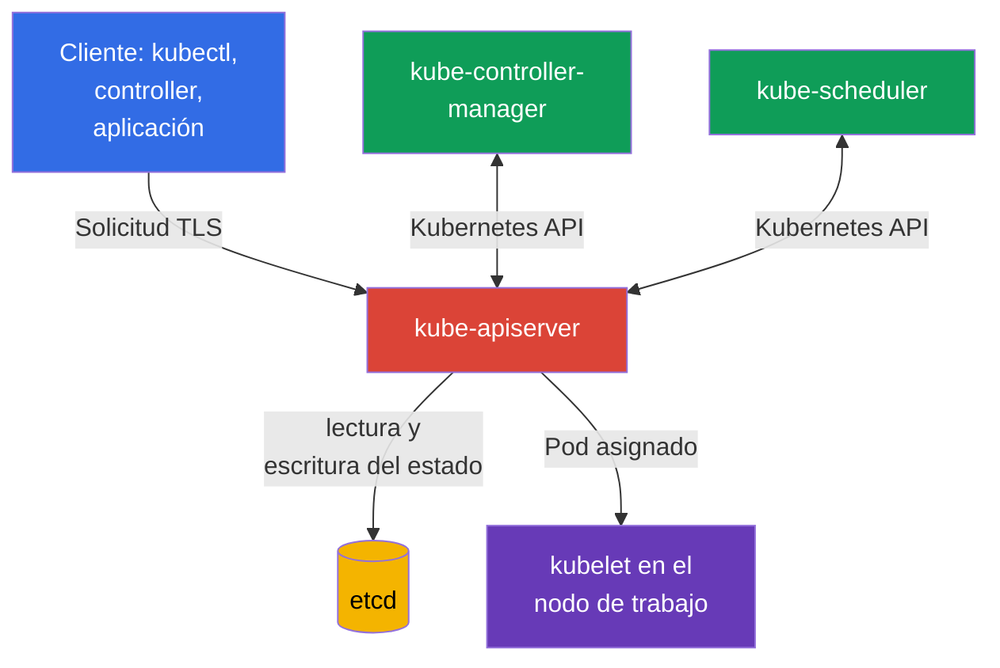
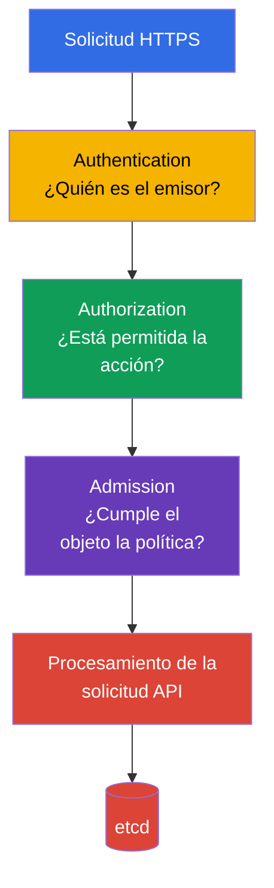

[Русская версия](ru.md) · [Eng version](README.md) · [Version française](fr.md) · [Deutsche Version](de.md) · [ქართული ვერსია](ge.md) · [繁體中文版](tw.md) · [日本語版](jp.md)

# Capítulo 07. Seguridad del control plane: API Server, Controller Manager, Scheduler, Etcd

> **Qué sigue.** En los capítulos anteriores examinamos la seguridad de la nube, las imágenes y el código. Ahora pasamos al plano de control de Kubernetes. Pertenece al dominio Kubernetes Cluster Component Security, que representa el 22% del examen KCSA: la vulneración del control plane normalmente implica la vulneración de todo el clúster.

## 07.1 Control plane y por qué es una zona crítica

El control plane mantiene el estado deseado del clúster. Acepta solicitudes, almacena objetos de Kubernetes y lleva continuamente el estado real al descrito en la API. Normalmente, sus componentes clave se ejecutan en los nodos control plane, pero lógicamente forman un único plano de control:

- `kube-apiserver` proporciona la API de Kubernetes y es el punto de entrada para `kubectl`, los controladores y otros componentes;
- `etcd` almacena el estado del clúster;
- `kube-controller-manager` ejecuta controladores que observan la API y corrigen las desviaciones del estado deseado;
- `kube-scheduler` elige un nodo de trabajo para un nuevo `Pod`.

Aquí hay dos límites de confianza especialmente importantes. El primero está entre el cliente y API Server: el clúster debe entender quién envió la solicitud y qué se le permite a ese sujeto. El segundo está entre API Server y `etcd`: el almacenamiento contiene los datos más valiosos del clúster y no debe estar disponible para una red o usuario del nodo arbitrarios.

La protección del control plane se construye por capas: red y acceso a nodos limitados, TLS, credenciales de componentes fiables, least privilege para el acceso a la API, auditoría y copias de seguridad. Un control no sustituye a otro. Por ejemplo, TLS protege el tráfico, pero no impedirá que un cliente legítimo, aunque excesivamente privilegiado, elimine objetos mediante la API.

## 07.2 API Server: cadena de decisión y puntos de entrada peligrosos

`kube-apiserver` es el intermediario central de Kubernetes. Incluso los componentes del control plane normalmente no leen `etcd` directamente: se dirigen a API Server. Por eso su disponibilidad, configuración y registros son especialmente importantes.

De forma simplificada, una solicitud pasa por tres etapas consecutivas:

1. **Authentication** establece la identidad: por ejemplo, la de un usuario mediante un certificado de cliente, la de un ServiceAccount mediante un token o la de un usuario externo a través de OIDC.
2. **Authorization** comprueba los permisos de esta identidad. El mecanismo habitual es RBAC. La solicitud puede rechazarse aunque el cliente se haya autenticado correctamente.
3. **Admission** comprueba o modifica el objeto antes de almacenarlo. Aquí funcionan admission plugins integrados, webhooks y políticas. Por ejemplo, admission puede prohibir un `Pod` con `privileged: true`.

El orden es importante para las MCQ (multiple choice question, pregunta de opción múltiple): admission no sustituye a authentication ni concede permisos al usuario. Recibe una solicitud ya autenticada y autorizada.

### Anonymous access

Si API Server acepta solicitudes anónimas, un cliente no autenticado recibe la identidad `system:anonymous` en el grupo `system:unauthenticated`. Que `--anonymous-auth` esté habilitado por sí mismo no significa que ese cliente pueda leer secretos: la decisión final sigue correspondiendo a authorization. Pero el acceso anónimo aumenta la superficie de ataque, facilita el reconocimiento ante enlaces RBAC erróneos y no es necesario para el acceso habitual a la API.

El principio seguro es proporcionar credenciales explícitas a cada cliente y no otorgar a `system:unauthenticated` ningún permiso innecesario. Por separado, se comprueba qué health- y metrics-endpoints están disponibles desde fuera y si realmente necesitan acceso público.

### Puertos y transporte inseguros

La API de Kubernetes debe usarse mediante un endpoint HTTPS protegido con verificación de certificados. El puerto HTTP inseguro histórico de API Server no debe considerarse una vía aceptable de administración: en Kubernetes moderno no es una opción funcional para la operación habitual. No se debe omitir la verificación TLS con flags de cliente como `--insecure-skip-tls-verify` sin un procedimiento temporal justificado.

El riesgo de un endpoint inseguro no consiste solo en interceptar una contraseña o un token. Un atacante en la red puede sustituir una respuesta de la API, obtener credenciales o ejecutar una solicitud en nombre del cliente. El acceso de red a API Server normalmente se restringe con un balanceador de carga, firewall o security groups, pero la red no sustituye a authentication y authorization.

## 07.3 Etcd: estado del clúster, secretos y recuperación

`etcd` es el almacenamiento key-value distribuido de Kubernetes. Contiene las descripciones de `Pod`, `Deployment`, `Service`, objetos RBAC, `Secret` y muchos otros objetos de API. En clústeres modernos, un `Pod` normalmente recibe un ServiceAccount token bound de corta duración mediante `TokenRequest` como projected volume; dicho token no se almacena como un token `Secret` independiente en `etcd`. En cambio, un `Secret` legacy `kubernetes.io/service-account-token` creado manualmente se conserva como `Secret`. La pérdida de integridad o disponibilidad de `etcd` afecta a todo el clúster.

Una propiedad especial de `Secret`: Kubernetes codifica los datos normales de `Secret` en base64, pero no los cifra. Sin encryption at rest, el valor de un `Secret` almacenado en `etcd` está disponible para quien obtenga acceso al almacenamiento o a su copia de seguridad. Base64 no es protección criptográfica.

| Riesgo | Consecuencia | Control conceptual |
|---|---|---|
| Lectura de `etcd` por una persona no autorizada | Robo de `Secret`, persisted legacy token Secrets, configuración y otro estado sensible de Kubernetes. | No publicar el endpoint, limitar la red y el acceso local, usar TLS y authentication |
| Modificación de claves | Creación o modificación de objetos, vulneración de la integridad del clúster | Mínimo de accesos administrativos, credenciales protegidas, auditoría |
| Pérdida de datos | Imposibilidad de recuperar el estado del clúster | Snapshots periódicos verificados y almacenamiento protegido de las copias |
| Almacenamiento de secretos sin encryption at rest | Los secretos se pueden leer desde el almacenamiento y el backup | Encryption at rest, KMS si es necesario, restricción de acceso a las claves |

### TLS y restricción de acceso

El cliente API Server y los miembros del clúster `etcd` usan TLS. Este proporciona confidencialidad del tráfico y permite confirmar las partes de la conexión con certificados. Sin embargo, TLS no hace seguro a `etcd` si se roba la clave privada o si el endpoint es accesible para todos los usuarios de la red.

Para mTLS es importante separar las funciones de los certificados. Por ejemplo, la PKI creada por `kubeadm` usa un `etcd-ca` separado para la confianza relacionada con etcd y un certificado de cliente `apiserver-etcd-client` separado, con el que `kube-apiserver` se autentica ante `etcd`. Esto no significa que toda instalación de Kubernetes deba tener exactamente esa estructura de archivos o un root CA separado, pero separar trust domains / CA chains permite no mezclar serving- y client-credentials de componentes diferentes, restringir la confianza por separado y planificar de forma independiente la rotation o migration de etcd.

No se debe usar el server certificate `kube-apiserver` como una credencial compartida universal para etcd. El certificado debe corresponder a su función, y los private keys y el CA material se protegen como control-plane credentials sensibles.

Regla práctica: el endpoint `etcd` debe estar disponible solo para los componentes necesarios del control plane. No coloque el puerto `etcd` detrás de un balanceador de carga público, no dé a una aplicación en un `Pod` acceso directo a él y no use credenciales compartidas para todos los operadores. Para la modificación habitual de objetos de Kubernetes se usa la API de Kubernetes, no la escritura directa en `etcd`.

### Copias de seguridad

Un snapshot de `etcd` contiene el mismo estado sensible que el almacenamiento operativo. Por ello, un backup no es simplemente un archivo práctico: se cifra, se restringe el acceso, se controla el periodo de retención y se comprueba periódicamente la restauración. Un backup sin comprobar el restore crea una falsa sensación de preparación.

La vulneración de `etcd` equivale a menudo a la vulneración del clúster. Un atacante puede extraer secretos, modificar RBAC, sustituir un workload o interrumpir el funcionamiento del plano de control. Esto explica por qué la protección de `etcd` pertenece tanto a la gestión de secretos como a la seguridad del control plane.

## 07.4 Controller Manager y Scheduler: identidades de servicio (service identity) y superficie de ataque

`kube-controller-manager` reúne un conjunto de controladores. Un controlador compara el estado deseado de la API con el real e intenta eliminar la diferencia. Por ejemplo, el controlador `Deployment` crea un `ReplicaSet`, y el controlador `ReplicaSet` mantiene el número requerido de `Pod`.

`kube-scheduler` observa los `Pod` sin `nodeName` asignado, evalúa los nodos de trabajo disponibles y escribe la decisión de asignación mediante API Server. No inicia contenedores por sí mismo, pero su decisión determina dónde se ejecutará la carga de trabajo.

Ambos componentes son clientes de API y operan con sus propias identidades, por ejemplo `system:kube-controller-manager` y `system:kube-scheduler`. Sus kubeconfig, certificados de cliente, tokens y claves de firma deben considerarse datos sensibles. Si un atacante obtiene tales credenciales, puede actuar dentro de los permisos del componente. Para los controladores estos permisos suelen ser amplios, pues gestionan objetos en todo el clúster.

Elementos típicos de la superficie de ataque:

- kubeconfig, certificados y private keys de los componentes;
- acceso a API Server en nombre de una identidad de servicio;
- endpoints health, metrics y profiling, si son accesibles desde redes indebidas o no están protegidos;
- parámetros de inicio que afectan a authentication, authorization, TLS o bind address;
- posibilidad de modificar static Pod manifests o la configuración systemd en el nodo control plane.

No se deben dar a una persona las credenciales de Controller Manager o Scheduler para el `kubectl` cotidiano. Una identidad de servicio tiene una finalidad concreta, mientras que un operador necesita una identidad separada con el mínimo privilegio y acceso auditable.

## 07.5 Flags inseguros: lo que hay que saber en el nivel KCSA

En el examen KCSA es importante reconocer la clase de configuración peligrosa, no memorizar la lista completa de flags ni editar manifests. Son sospechosas las configuraciones que:

- permiten anonymous access sin necesidad;
- deshabilitan authentication o authorization;
- hacen que un endpoint esté disponible en todas las interfaces en lugar de la red administrativa;
- usan HTTP o deshabilitan la verificación TLS;
- deshabilitan audit logging;
- abren endpoints profiling, metrics o debug a una red amplia;
- debilitan la protección de `etcd` o proporcionan acceso a sus datos.

Un flag no siempre es una vulnerabilidad por sí mismo. Por ejemplo, un endpoint metrics puede ser necesario para el sistema de monitorización. La pregunta de seguridad es: quién puede conectarse a él, cómo se autentica ese sujeto, qué puede conocer o modificar y si existe una forma menos arriesgada de proporcionar la función necesaria.

Al revisar una configuración, primero se buscan valores explícitamente inseguros y después se comparan con el modelo de amenazas. La corrección normalmente incluye restringir el acceso de red, habilitar los modos protegidos, rotar las credentials comprometidas y revisar los registros. La modificación detallada de los parámetros del control plane pertenece al nivel práctico de CKS.

## 07.6 Cómo se aplica en la práctica

El equipo de plataforma normalmente formaliza la protección del control plane como un conjunto repetible de comprobaciones, no como una configuración puntual:

1. Restringe la ruta a API Server a redes administrativas y usa solo TLS con una CA de confianza.
2. Separa las identidades de las personas, CI/CD y componentes del control plane; comprueba RBAC según el principio de least privilege.
3. Cierra `etcd` a los nodos de trabajo y las redes de aplicaciones, protege los certificados y aplica encryption at rest a los recursos sensibles.
4. Crea snapshots de `etcd`, los almacena como datos secretos y comprueba periódicamente la restauración en un entorno seguro.
5. Escanea la configuración respecto a CIS Benchmark, rastrea cambios en static Pod manifests y recopila audit logs.

Esto no significa que un equipo mantenga manualmente todo en cualquier clúster. En Kubernetes gestionado, el proveedor cloud opera parte del control plane, pero la responsabilidad de IAM, acceso a API, secretos, logs, red y comprensión de los límites de responsabilidad sigue siendo del usuario de la plataforma.

## 07.7 Exam vocabulary / Mini glosario

| Término | Significado |
|---|---|
| control plane | Componentes de Kubernetes que gestionan el estado del clúster y sus cargas de trabajo. |
| `kube-apiserver` | API HTTPS central de Kubernetes por la que pasan las operaciones con objetos del clúster. |
| authentication | Establecimiento de la identidad del cliente. |
| authorization | Decisión sobre si el sujeto identificado tiene derecho a realizar una acción. |
| admission | Etapa de comprobación o modificación de la solicitud a la API después de authentication y authorization. |
| `etcd` | Almacenamiento del estado de Kubernetes. |
| encryption at rest | Cifrado de datos en el almacenamiento, no solo durante la transmisión por la red. |
| snapshot | Copia de seguridad coherente del estado de `etcd` en un momento concreto. |
| identidad de servicio (service identity) | Cuenta de un componente con la que se conecta a la API de Kubernetes. |

## 07.8 Exam Essentials / Resumen del capítulo

- El control plane reúne API Server, `etcd`, Controller Manager y Scheduler; su vulneración afecta a todo el clúster.
- API Server procesa una solicitud mediante la cadena authentication → authorization → admission. Una autenticación correcta no concede permiso por sí sola.
- Anonymous access y los endpoints no protegidos aumentan la superficie de ataque y requieren restricciones especialmente estrictas.
- `etcd` contiene el estado del clúster y, sin encryption at rest, los valores de `Secret` no están protegidos criptográficamente en el almacenamiento.
- TLS, acceso restringido, protección de credentials, audit logs y backups verificados se complementan entre sí.
- Controller Manager y Scheduler tienen identidades de servicio con credenciales sensibles y deben protegerse como clientes API privilegiados.

## 07.9 No confundir y cómo aparece en el examen

Las preguntas de KCSA normalmente comprueban relaciones de causa y efecto, no la sintaxis exacta de un flag. Formulaciones frecuentes: qué componente almacena el estado del clúster, en qué orden API Server procesa una solicitud, por qué el acceso a `etcd` es peligroso, qué protege TLS y en qué se diferencia base64 de encryption at rest.

Trampas típicas:

- no confundir authentication con authorization;
- no considerar admission como un mecanismo para otorgar permisos RBAC;
- no considerar base64 como cifrado;
- no suponer que un control plane gestionado elimina por completo la responsabilidad del usuario sobre el acceso a la API y los datos;
- no elegir el trabajo directo con `etcd` como modo habitual de gestionar objetos de Kubernetes.

## 07.10 Preguntas de autoevaluación

### 1. ¿En qué orden procesa API Server una solicitud en el modelo simplificado?

   - a. authentication → admission → authorization

   - b. admission → authorization → authentication

   - c. authorization → admission → authentication

   - d. authentication → authorization → admission

Respuesta y explicación

**Respuesta correcta: d.** Primero Kubernetes establece la identidad del cliente, después comprueba sus permisos y, tras ello, admission puede comprobar o modificar la solicitud admisible.

### 2. ¿Por qué el acceso directo de una persona no autorizada a `etcd` es un riesgo crítico?

   - a. Permite gestionar solo los registros locales de kubelet y no afecta al estado de la API.
   - b. Proporciona acceso solo a la scheduler cache y no contiene configuración de workload.
   - c. Abre únicamente las métricas del control plane, pero no permite leer ni modificar objetos de Kubernetes.
   - d. Puede exponer el estado de la API de Kubernetes, incluidos objetos sensibles, y permitir leer o modificar datos críticos del clúster.

Respuesta y explicación

**Respuesta correcta: d.** `etcd` almacena el estado de la API de Kubernetes. Por tanto, el acceso directo no autorizado a este puede afectar a la confidencialidad y la integridad de los datos críticos; la protección incluye disponibilidad de red estricta, mTLS y encryption at rest para recursos sensibles.

### 3. ¿Qué describe mejor el riesgo de `--anonymous-auth` en kube-apiserver?

   - a. Las solicitudes no autenticadas obtienen automáticamente los permisos de cualquier ServiceAccount del namespace.
   - b. Una solicitud no autenticada recibe una anonymous identity, y una configuración de authorization errónea puede permitirle acciones API no deseadas.
   - c. Un cliente anónimo se convierte automáticamente en `system:masters`, independientemente de la authorizer configuration.
   - d. Habilitar anonymous authentication deshabilita la verificación de certificados TLS entre API Server y `etcd`.

Respuesta y explicación

**Respuesta correcta: b.** Anonymous authentication define la identity de una solicitud no autenticada; los permissions reales los sigue definiendo authorization. El riesgo surge cuando la anonymous identity recibe permisos innecesarios o cuando un endpoint anónimo aumenta la superficie de ataque.

### 4. ¿Qué control protege más directamente los datos de `Secret` guardados en `etcd` o su backup contra la lectura desde el propio almacenamiento?

   - a. Restringir el application traffic mediante NetworkPolicy y usar TLS entre servicios de usuario, dejando los storage data sin encryption at rest.

   - b. Restringir la API de Kubernetes mediante RBAC y guardar Secret data en base64, considerando que la codificación es suficiente protección del storage.

   - c. Usar encryption at rest y restringir por separado el acceso a etcd, snapshots y el key material para el descifrado.

   - d. Usar mTLS entre API Server y etcd, pero almacenar snapshots y claves sin un access control separado.

Respuesta y explicación

**Respuesta correcta: c.** Encryption at rest protege los registros almacenados, y `etcd`, backup/snapshots y el decryption key material deben disponer de un access control separado. NetworkPolicy y transport mTLS protegen otros límites, y base64 no es encryption.

### 5. ¿Cómo se deben tratar las credentials de `kube-controller-manager` y `kube-scheduler`?

   - a. Como credentials administrativas compartidas, si el endpoint control plane está cerrado por una red interna.

   - b. Como datos de servicio públicos, porque estos componentes se ejecutan dentro del control plane.

   - c. Como API credentials privilegiadas de los componentes, que se protegen y restringen mediante least privilege.

   - d. Como sustituto del serving certificate de API Server, si ya se usa TLS entre los componentes.

Respuesta y explicación

**Respuesta correcta: c.** `kube-controller-manager` y `kube-scheduler` son clientes API autenticados. Sus kubeconfig, client certificates, keys o tokens son credentials sensibles y solo deben tener los permissions necesarios para el componente. Una red interna no hace seguras las shared admin credentials, y la client identity del componente no sustituye al serving certificate de API Server.

> **Adónde seguir.** Para la comprobación práctica de la configuración, estudie el capítulo 07 de CKS sobre CIS Benchmark y `kube-bench`, el capítulo 09 de CKS sobre protección del control plane y TLS, y el capítulo 21 de CKS sobre gestión de secretos y `etcd`.

[Índice](../README_ES.md) · [Capítulo 06](../06/es.md) · [Capítulo 08](../08/es.md)