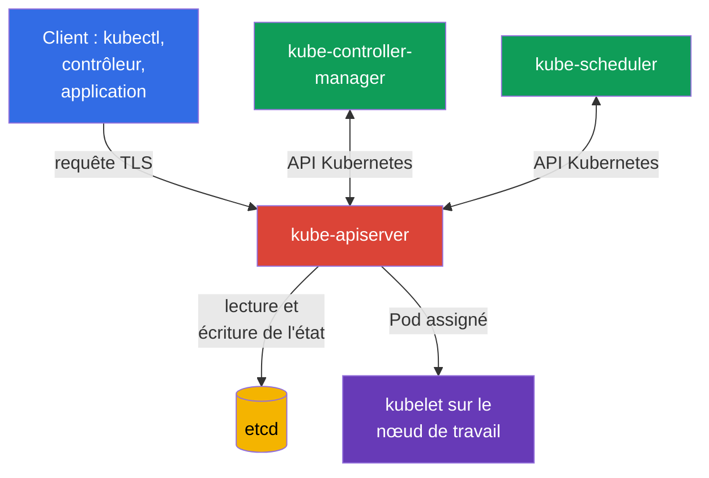
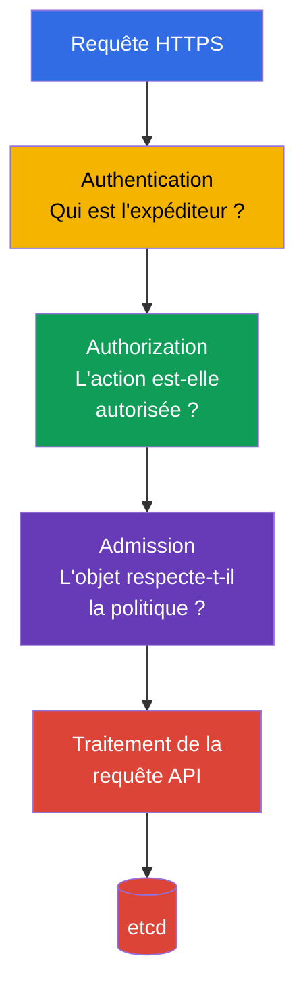

[Русская версия](ru.md) · [Eng version](README.md) · [Versión en español](es.md) · [Deutsche Version](de.md) · [ქართული ვერსია](ge.md) · [繁體中文版](tw.md) · [日本語版](jp.md)

# Chapitre 07. Sécurité du control plane : API Server, Controller Manager, Scheduler, Etcd

> **Suite.** Dans les chapitres précédents, nous avons abordé la sécurité du cloud, des images et du code. Nous passons maintenant au plan de contrôle Kubernetes. Il relève du domaine Kubernetes Cluster Component Security, qui représente 22 % de l'examen KCSA : la compromission du control plane implique généralement celle de l'ensemble du cluster.

## 07.1 Control plane et pourquoi il constitue une zone critique

Le control plane maintient l'état souhaité du cluster. Il reçoit les requêtes, stocke les objets Kubernetes et rapproche continuellement l'état réel de celui décrit dans l'API. Ses composants clés s'exécutent généralement sur les nœuds du control plane, mais forment logiquement un seul plan de contrôle :

- `kube-apiserver` fournit l'API Kubernetes et constitue le point d'entrée pour `kubectl`, les contrôleurs et les autres composants ;
- `etcd` stocke l'état du cluster ;
- `kube-controller-manager` exécute les contrôleurs qui observent l'API et corrigent les écarts par rapport à l'état souhaité ;
- `kube-scheduler` choisit un nœud de travail pour un nouveau `Pod`.

Deux frontières de confiance sont particulièrement importantes ici. La première se situe entre le client et l'API Server : le cluster doit savoir qui envoie la requête et ce que ce sujet est autorisé à faire. La seconde se situe entre l'API Server et `etcd` : le stockage contient les données les plus précieuses du cluster et ne doit pas être accessible depuis un réseau ou par un utilisateur de nœud arbitraire.

La protection du control plane repose sur plusieurs couches : réseau et accès aux nœuds restreints, TLS, identifiants de composants robustes, least privilege pour l'accès à l'API, audit et sauvegardes. Un contrôle ne remplace pas les autres. Par exemple, TLS protège le trafic, mais n'empêche pas un client légitime, mais excessivement privilégié, de supprimer des objets via l'API.

## 07.2 API Server : chaîne de décision et points d'entrée dangereux

`kube-apiserver` est le médiateur central de Kubernetes. Même les composants du control plane ne lisent généralement pas `etcd` directement : ils accèdent à l'API Server. Sa disponibilité, sa configuration et ses journaux sont donc particulièrement importants.

En simplifiant, une requête passe par trois étapes successives :

1. **Authentication** établit l'identité, par exemple celle d'un utilisateur par certificat client, d'un ServiceAccount par token ou d'un utilisateur externe par OIDC.
2. **Authorization** vérifie les droits de cette identité. Le mécanisme typique est RBAC. Une requête peut être refusée alors que le client a été authentifié avec succès.
3. **Admission** vérifie ou modifie l'objet avant sa persistance. C'est là que s'exécutent les admission plugins intégrés, les webhooks et les politiques. Par exemple, admission peut interdire un `Pod` avec `privileged: true`.

L'ordre est important pour les MCQ (multiple choice question, question à choix multiple) : admission ne remplace pas authentication et n'attribue pas de droits à un utilisateur. Il reçoit une requête déjà authentifiée et autorisée.

### Accès anonyme

Si l'API Server accepte les requêtes anonymes, un client non authentifié reçoit l'identité `system:anonymous` dans le groupe `system:unauthenticated`. L'activation de `--anonymous-auth` ne signifie pas à elle seule qu'un tel client peut lire les secrets : la décision finale relève de authorization. Toutefois, l'accès anonyme accroît la surface d'attaque, facilite la reconnaissance en cas de liaisons RBAC erronées et n'est pas nécessaire pour l'accès ordinaire à l'API.

Le principe sûr consiste à fournir des identifiants explicites à chaque client et à n'accorder aucune permission superflue à `system:unauthenticated`. Vérifiez aussi quels endpoints de santé et de métriques sont accessibles depuis l'extérieur et s'ils ont réellement besoin d'un accès public.

### Ports et transport non sécurisés

L'accès à l'API Kubernetes doit passer par un endpoint HTTPS sécurisé avec vérification du certificat. L'ancien port HTTP non sécurisé de l'API Server ne doit pas être considéré comme un moyen d'administration acceptable : dans Kubernetes moderne, il ne constitue pas une option fonctionnelle pour l'exploitation courante. N'utilisez pas de contournement de la vérification TLS avec des flags client comme `--insecure-skip-tls-verify` sans procédure temporaire justifiée.

Le risque d'un endpoint non sécurisé ne se limite pas à l'interception d'un mot de passe ou d'un token. Un attaquant sur le réseau peut falsifier une réponse de l'API, obtenir des identifiants ou exécuter une requête au nom du client. L'accès réseau à l'API Server est généralement limité par un load balancer, un firewall ou des security groups, mais le réseau ne remplace pas authentication ni authorization.

## 07.3 Etcd : état du cluster, secrets et restauration

`etcd` est le stockage key-value distribué de Kubernetes. Il contient les descriptions de `Pod`, `Deployment`, `Service`, objets RBAC, `Secret` et de nombreux autres objets API. Dans les clusters modernes, un `Pod` reçoit généralement un bound ServiceAccount token de courte durée via `TokenRequest` sous forme de projected volume ; ce token n'est pas stocké comme token `Secret` distinct dans `etcd`. Un `Secret` legacy `kubernetes.io/service-account-token` créé manuellement, en revanche, est persisté comme `Secret`. La perte d'intégrité ou de disponibilité de `etcd` affecte l'ensemble du cluster.

Une caractéristique particulière de `Secret` : Kubernetes encode les données ordinaires de `Secret` en base64, mais ne les chiffre pas. Sans encryption at rest, une valeur de `Secret` stockée dans `etcd` est accessible à toute personne qui a obtenu l'accès au stockage ou à sa sauvegarde. Base64 n'est pas une protection cryptographique.

| Risque | Conséquence | Contrôle conceptuel |
|---|---|---|
| Lecture de `etcd` par un tiers | Vol de `Secret`, de persisted legacy token Secrets, de configurations et d'autres états Kubernetes sensibles. | Ne pas exposer l'endpoint, restreindre le réseau et l'accès local, utiliser TLS et authentication |
| Modification des clés | Création ou modification d'objets, atteinte à l'intégrité du cluster | Minimum d'accès administratifs, identifiants protégés, audit |
| Perte de données | Impossibilité de restaurer l'état du cluster | Snapshots réguliers et vérifiés, stockage protégé des copies |
| Stockage de secrets sans encryption at rest | Secrets lisibles depuis le stockage et la sauvegarde | Encryption at rest, KMS si nécessaire, restriction de l'accès aux clés |

### TLS et restriction de l'accès

Le client API Server et les membres du cluster `etcd` utilisent TLS. Il assure la confidentialité du trafic et permet de confirmer les parties de la connexion au moyen de certificats. Toutefois, TLS ne rend pas `etcd` sûr si la clé privée est volée ou si l'endpoint est accessible à tous les utilisateurs du réseau.

Pour mTLS, il est important de séparer les rôles des certificats. Par exemple, la PKI créée par `kubeadm` utilise un `etcd-ca` distinct pour la confiance liée à etcd et un certificat client distinct `apiserver-etcd-client`, avec lequel `kube-apiserver` s'authentifie auprès de `etcd`. Cela ne signifie pas que toute installation Kubernetes doit avoir exactement cette structure de fichiers ou un root CA distinct, mais la séparation des trust domains / CA chains évite de mélanger les serving- et client-credentials des différents composants, permet de limiter séparément la confiance et de planifier indépendamment la rotation ou la migration de etcd.

N'utilisez pas le server certificate `kube-apiserver` comme shared credential universel pour etcd. Le certificat doit correspondre à son rôle, et les private keys ainsi que le CA material doivent être protégés comme des control-plane credentials sensibles.

Règle pratique : l'endpoint `etcd` ne doit être accessible qu'aux composants nécessaires du control plane. Ne placez pas le port `etcd` derrière un load balancer public, ne donnez pas à une application dans un `Pod` un accès direct à celui-ci et n'utilisez pas d'identifiants partagés pour tous les opérateurs. Pour modifier normalement des objets Kubernetes, utilisez l'API Kubernetes, et non l'écriture directe dans `etcd`.

### Sauvegardes

Un snapshot `etcd` contient le même état sensible que le stockage en fonctionnement. Une sauvegarde n'est donc pas simplement un fichier pratique : elle doit être chiffrée, son accès doit être restreint, sa durée de conservation doit être contrôlée et sa restauration doit être vérifiée périodiquement. Une sauvegarde sans test de restauration donne un faux sentiment de préparation.

La compromission de `etcd` équivaut souvent à la compromission du cluster. Un attaquant peut extraire des secrets, modifier RBAC, falsifier un workload ou perturber le fonctionnement du control plane. Cela explique pourquoi la protection de `etcd` relève à la fois de la gestion des secrets et de la sécurité du control plane.

## 07.4 Controller Manager et Scheduler : identités de service (service identity) et surface d'attaque

`kube-controller-manager` regroupe un ensemble de contrôleurs. Un contrôleur compare l'état souhaité de l'API à l'état réel et tente d'éliminer l'écart. Par exemple, le contrôleur `Deployment` crée un `ReplicaSet`, et le contrôleur `ReplicaSet` maintient le nombre requis de `Pod`.

`kube-scheduler` observe les `Pod` sans `nodeName` attribué, évalue les nœuds de travail disponibles et enregistre la décision d'attribution via l'API Server. Il n'exécute pas lui-même un conteneur, mais sa décision détermine l'emplacement d'exécution de la charge de travail.

Ces deux composants sont des clients de l'API et s'exécutent avec leurs propres identités, par exemple `system:kube-controller-manager` et `system:kube-scheduler`. Leurs kubeconfig, certificats clients, tokens et clés de signature doivent être considérés comme des données sensibles. Si un attaquant obtient ces identifiants, il peut agir dans les limites des droits du composant. Pour les contrôleurs, ces droits sont souvent étendus, car ils gèrent des objets dans l'ensemble du cluster.

Éléments typiques de la surface d'attaque :

- kubeconfig, certificats et private keys des composants ;
- accès à l'API Server au nom d'une identité de service ;
- endpoints de santé, métriques et profiling, s'ils sont accessibles à des réseaux inappropriés ou non protégés ;
- paramètres de démarrage qui affectent authentication, authorization, TLS ou bind address ;
- possibilité de modifier les static Pod manifests ou la configuration systemd sur un nœud du control plane.

N'attribuez pas les identifiants de Controller Manager ou de Scheduler à une personne pour son `kubectl` quotidien. Une identité de service a un objectif précis, tandis qu'un opérateur a besoin d'une identité distincte avec least privilege et d'un accès traçable.

## 07.5 Flags non sécurisés : ce qu'il faut connaître au niveau KCSA

À l'examen KCSA, il est important de reconnaître la catégorie d'une configuration dangereuse, plutôt que de mémoriser une liste complète de flags ou de modifier des manifests. Sont suspectes les configurations qui :

- autorisent un accès anonyme sans nécessité ;
- désactivent authentication ou authorization ;
- rendent un endpoint disponible sur toutes les interfaces au lieu du réseau administratif ;
- utilisent HTTP ou désactivent la vérification TLS ;
- désactivent audit logging ;
- ouvrent les endpoints de profiling, metrics ou debug à un vaste réseau ;
- affaiblissent la protection de `etcd` ou donnent accès à ses données.

Un flag n'est pas toujours une vulnérabilité en soi. Par exemple, un endpoint de metrics peut être nécessaire à un système de monitoring. La question de sécurité est la suivante : qui peut s'y connecter, comment ce sujet s'authentifie-t-il, que peut-il apprendre ou modifier, et existe-t-il une manière moins risquée de fournir la fonction nécessaire ?

Lors de la vérification de la configuration, recherchez d'abord les valeurs explicitement non sécurisées, puis comparez-les au modèle de menace. La correction comprend généralement la restriction de l'accès réseau, l'activation des modes sécurisés, la rotation des credentials compromis et la vérification des journaux. La modification détaillée des paramètres du control plane relève du niveau pratique CKS.

## 07.6 Application pratique

Une équipe plateforme formalise habituellement la protection du control plane en un ensemble de vérifications répétables, plutôt qu'en une configuration ponctuelle :

1. Elle limite le chemin vers l'API Server aux réseaux administratifs et utilise uniquement TLS avec une CA de confiance.
2. Elle sépare les identités des personnes, de CI/CD et des composants du control plane ; elle vérifie RBAC selon le principe du least privilege.
3. Elle isole `etcd` des nœuds de travail et des réseaux applicatifs, protège les certificats et applique encryption at rest aux ressources sensibles.
4. Elle crée des snapshots `etcd`, les conserve comme données secrètes et teste régulièrement la restauration dans un environnement sûr.
5. Elle analyse la configuration par rapport au CIS Benchmark, surveille les modifications des static Pod manifests et collecte les audit logs.

Cela ne signifie pas qu'une équipe assure manuellement toute l'exploitation dans chaque cluster. Dans Kubernetes managé, le fournisseur cloud gère une partie du control plane, mais la responsabilité de l'IAM, de l'accès à l'API, des secrets, des journaux, du réseau et de la compréhension des limites de responsabilité reste celle de l'utilisateur de la plateforme.

## 07.7 Exam vocabulary / Mini-glossaire

| Terme | Signification |
|---|---|
| control plane | Composants Kubernetes qui gèrent l'état du cluster et ses charges de travail. |
| `kube-apiserver` | API HTTPS centrale de Kubernetes, par laquelle passent les opérations sur les objets du cluster. |
| authentication | Établissement de l'identité du client. |
| authorization | Décision indiquant si le sujet identifié est autorisé à effectuer une action. |
| admission | Étape de vérification ou de modification d'une requête API après authentication et authorization. |
| `etcd` | Stockage de l'état Kubernetes. |
| encryption at rest | Chiffrement des données dans le stockage, et pas seulement pendant leur transmission réseau. |
| snapshot | Copie de sauvegarde cohérente de l'état de `etcd` à un moment donné. |
| identité de service (service identity) | Compte d'un composant utilisé pour accéder à l'API Kubernetes. |

## 07.8 Exam Essentials / Points essentiels du chapitre

- Le control plane regroupe API Server, `etcd`, Controller Manager et Scheduler ; sa compromission affecte tout le cluster.
- L'API Server traite une requête selon la chaîne authentication → authorization → admission. Une authentication réussie n'accorde pas de droits en elle-même.
- L'accès anonyme et les endpoints non sécurisés augmentent la surface d'attaque et exigent des restrictions particulièrement strictes.
- `etcd` contient l'état du cluster et, sans encryption at rest, les valeurs de `Secret` ne sont pas protégées cryptographiquement dans le stockage.
- TLS, accès restreint, protection des credentials, audit logs et backups vérifiés se complètent.
- Controller Manager et Scheduler disposent d'identités de service avec des identifiants sensibles et doivent être protégés comme des clients API privilégiés.

## 07.9 À ne pas confondre et comment cela apparaît à l'examen

Les questions KCSA évaluent généralement les relations de cause à effet, et non la syntaxe exacte d'un flag. Formulations fréquentes : quel composant stocke l'état du cluster, dans quel ordre l'API Server traite une requête, pourquoi l'accès à `etcd` est dangereux, ce que TLS protège et en quoi base64 diffère de encryption at rest.

Pièges typiques :

- ne pas confondre authentication et authorization ;
- ne pas considérer admission comme un mécanisme d'attribution de droits RBAC ;
- ne pas considérer base64 comme du chiffrement ;
- ne pas supposer qu'un control plane managé décharge totalement l'utilisateur de sa responsabilité concernant l'accès à l'API et aux données ;
- ne pas choisir le travail direct avec `etcd` comme moyen habituel de gérer les objets Kubernetes.

## 07.10 Questions d'auto-évaluation

### 1. Dans quel ordre l'API Server traite-t-il une requête dans le modèle simplifié ?

   - a. authentication → admission → authorization

   - b. admission → authorization → authentication

   - c. authorization → admission → authentication

   - d. authentication → authorization → admission

Réponse et explication

**Réponse correcte : d.** Kubernetes établit d'abord l'identité du client, vérifie ensuite ses droits, puis admission peut vérifier ou modifier la requête autorisée.

### 2. Pourquoi l'accès direct d'un tiers à `etcd` représente-t-il un risque critique ?

   - a. Il permet de gérer uniquement les journaux locaux de kubelet et n'affecte pas l'état de l'API.
   - b. Il donne accès uniquement au cache du scheduler et ne contient pas de configuration de workload.
   - c. Il ouvre uniquement les métriques du control plane, sans permettre de lire ou de modifier les objets Kubernetes.
   - d. Il peut exposer l'état de l'API Kubernetes, y compris des objets sensibles, et permettre de lire ou modifier des données critiques du cluster.

Réponse et explication

**Réponse correcte : d.** `etcd` stocke l'état de l'API Kubernetes. Un accès direct non autorisé peut donc affecter la confidentialité et l'intégrité de données critiques ; la protection inclut une accessibilité réseau stricte, mTLS et encryption at rest pour les ressources sensibles.

### 3. Quelle proposition décrit le mieux le risque de `--anonymous-auth` sur kube-apiserver ?

   - a. Les requêtes non authentifiées reçoivent automatiquement les droits de tout ServiceAccount dans le namespace.
   - b. Une requête non authentifiée reçoit une identité anonyme, et une configuration authorization erronée peut lui permettre des actions API non souhaitées.
   - c. Un client anonyme devient automatiquement `system:masters`, indépendamment de la configuration de l'authorizer.
   - d. L'activation de l'authentication anonyme désactive la vérification du certificat TLS entre l'API Server et `etcd`.

Réponse et explication

**Réponse correcte : b.** L'authentication anonyme définit l'identité d'une requête non authentifiée ; authorization détermine toujours les permissions réelles. Le risque apparaît lorsque l'identité anonyme obtient des droits inutiles ou qu'un endpoint anonyme accroît la surface d'attaque.

### 4. Quel contrôle protège le plus directement les données de `Secret` stockées dans `etcd` ou sa sauvegarde contre leur lecture depuis le stockage lui-même ?

   - a. Restreindre le trafic applicatif au moyen de NetworkPolicy et utiliser TLS entre les services utilisateur, tout en laissant les données du stockage sans encryption at rest.

   - b. Restreindre l'API Kubernetes à l'aide de RBAC et stocker les données Secret en base64, en considérant que l'encodage est une protection suffisante du stockage.

   - c. Utiliser encryption at rest et restreindre séparément l'accès à etcd, aux snapshots et au matériel de clés nécessaire au déchiffrement.

   - d. Utiliser mTLS entre l'API Server et etcd, mais stocker les snapshots et les clés sans access control distinct.

Réponse et explication

**Réponse correcte : c.** Encryption at rest protège les enregistrements persistés, tandis que `etcd`, les backups/snapshots et le decryption key material doivent avoir un access control distinct. NetworkPolicy et le transport mTLS protègent d'autres frontières, et base64 n'est pas du chiffrement.

### 5. Comment faut-il traiter les credentials de `kube-controller-manager` et `kube-scheduler` ?

   - a. Comme des credentials administratifs partagés, si l'endpoint du control plane est fermé au réseau interne.

   - b. Comme des données de service publiques, puisque ces composants s'exécutent dans le control plane.

   - c. Comme des API credentials privilégiés de composants, à protéger et limiter selon le least privilege.

   - d. Comme un remplacement du serving certificate de l'API Server, si TLS est déjà utilisé entre les composants.

Réponse et explication

**Réponse correcte : c.** `kube-controller-manager` et `kube-scheduler` sont des clients API authentifiés. Leurs kubeconfig, client certificates, keys ou tokens sont des credentials sensibles et ne doivent posséder que les permissions nécessaires au composant. Le réseau interne ne rend pas les shared admin credentials sûrs, et l'identité client du composant ne remplace pas le serving certificate de l'API Server.

> **Suite.** Pour vérifier la configuration en pratique, étudiez le chapitre 07 CKS sur le CIS Benchmark et `kube-bench`, le chapitre 09 CKS sur la protection du control plane et TLS, ainsi que le chapitre 21 CKS sur la gestion des secrets et `etcd`.

[Table des matières](../README_FR.md) · [Chapitre 06](../06/fr.md) · [Chapitre 08](../08/fr.md)
