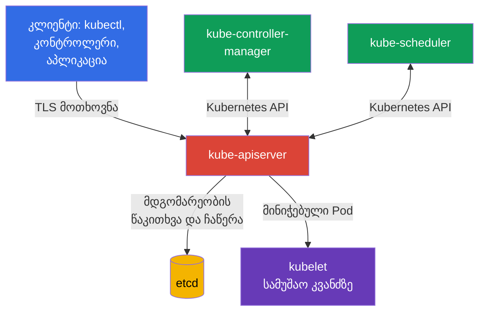
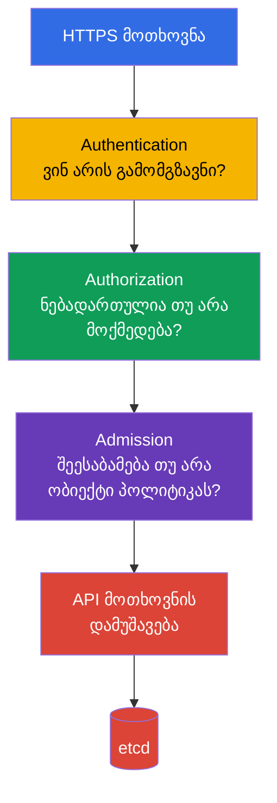

[Русская версия](ru.md) · [Eng version](README.md) · [Versión en español](es.md) · [Version française](fr.md) · [Deutsche Version](de.md) · [繁體中文版](tw.md) · [日本語版](jp.md)

# თავი 07. control plane-ის უსაფრთხოება: API Server, Controller Manager, Scheduler, Etcd

> **შემდეგი ნაბიჯი.** წინა თავებში განვიხილეთ cloud-ის, image-ებისა და კოდის უსაფრთხოება. ახლა გადავდივართ Kubernetes-ის მმართველ სიბრტყეზე. ის მიეკუთვნება Kubernetes Cluster Component Security დომენს, რომელიც KCSA გამოცდის 22%-ს შეადგენს: control plane-ის კომპრომეტაცია, ჩვეულებრივ, მთელი კლასტერის კომპრომეტაციას ნიშნავს.

## 07.1 Control plane და რატომ არის ის კრიტიკული ზონა

Control plane კლასტერის სასურველ მდგომარეობას ინარჩუნებს. ის იღებს მოთხოვნებს, ინახავს Kubernetes ობიექტებს და ფაქტობრივი მდგომარეობა მუდმივად მოჰყავს API-ში აღწერილ მდგომარეობასთან შესაბამისობაში. ჩვეულებრივ, მისი ძირითადი კომპონენტები control plane-ის კვანძებზე მუშაობენ, მაგრამ ლოგიკურად ერთ მმართველ სიბრტყეს ქმნიან:

- `kube-apiserver` უზრუნველყოფს Kubernetes API-ს და არის შესასვლელი წერტილი `kubectl`-ისთვის, კონტროლერებისა და სხვა კომპონენტებისთვის;
- `etcd` ინახავს კლასტერის მდგომარეობას;
- `kube-controller-manager` უშვებს კონტროლერებს, რომლებიც API-ს აკვირდებიან და სასურველი მდგომარეობიდან გადახრებს ასწორებენ;
- `kube-scheduler` ახალი `Pod`-ისთვის სამუშაო კვანძს ირჩევს.

აქ ნდობის ორი განსაკუთრებით მნიშვნელოვანი საზღვარია. პირველი კლიენტსა და API Server-ს შორის გადის: კლასტერს უნდა ესმოდეს, ვინ გაგზავნა მოთხოვნა და რა არის ნებადართული ამ სუბიექტისთვის. მეორე API Server-სა და `etcd`-ს შორის გადის: საცავი კლასტერის ყველაზე ღირებულ მონაცემებს შეიცავს და არ უნდა იყოს ხელმისაწვდომი ნებისმიერი ქსელის ან კვანძის მომხმარებლისთვის.

control plane-ის დაცვა ფენებად იგება: შეზღუდული ქსელი და კვანძებზე წვდომა, TLS, კომპონენტების საიმედო credentials, least privilege API წვდომისთვის, აუდიტი და სარეზერვო ასლები. ერთი კონტროლი მეორეს ვერ ჩაანაცვლებს. მაგალითად, TLS იცავს ტრაფიკს, მაგრამ ვერ შეუშლის ხელს ლეგიტიმურ, თუმცა ზედმეტად პრივილეგირებულ კლიენტს, API-ის მეშვეობით ობიექტები წაშალოს.

## 07.2 API Server: გადაწყვეტილების მიღების ჯაჭვი და სახიფათო შესასვლელი წერტილები

`kube-apiserver` Kubernetes-ის ცენტრალური შუამავალია. control plane-ის კომპონენტებიც კი, ჩვეულებრივ, `etcd`-ს პირდაპირ არ კითხულობენ: ისინი API Server-ს მიმართავენ. ამიტომ მისი ხელმისაწვდომობა, კონფიგურაცია და ჟურნალები განსაკუთრებით მნიშვნელოვანია.

გამარტივებულად, მოთხოვნა სამ თანმიმდევრულ ეტაპს გადის:

1. **Authentication** ადგენს იდენტობას: მაგალითად, მომხმარებელს client certificate-ის მიხედვით, ServiceAccount-ს token-ის მიხედვით ან გარე მომხმარებელს OIDC-ის მეშვეობით.
2. **Authorization** ამოწმებს ამ იდენტობის უფლებებს. ტიპური მექანიზმია RBAC. მოთხოვნა შეიძლება უარყოფილი იყოს, მიუხედავად იმისა, რომ კლიენტმა authentication წარმატებით გაიარა.
3. **Admission** შენახვამდე ამოწმებს ან ცვლის ობიექტს. აქ მუშაობს ჩაშენებული admission plugins, webhooks და პოლიტიკები. მაგალითად, admission-ს შეუძლია აკრძალოს `Pod`, რომელსაც აქვს `privileged: true`.

თანმიმდევრობა მნიშვნელოვანია MCQ-სთვის (multiple choice question, შეკითხვა პასუხის ვარიანტებით): admission არ ანაცვლებს authentication-ს და მომხმარებელს უფლებებს არ ანიჭებს. ის იღებს მოთხოვნას, რომელმაც უკვე გაიარა authentication და authorization.

### Anonymous access

თუ API Server ანონიმურ მოთხოვნებს იღებს, არაავთენტიფიცირებული კლიენტი იღებს იდენტობას `system:anonymous` ჯგუფში `system:unauthenticated`. ჩართული `--anonymous-auth` თავისთავად არ ნიშნავს, რომ ასეთ კლიენტს საიდუმლოებების წაკითხვა შეუძლია: საბოლოო გადაწყვეტილება authorization-ზე რჩება. თუმცა ანონიმური წვდომა ზრდის შეტევის ზედაპირს, ამარტივებს დაზვერვას მცდარი RBAC მიბმების შემთხვევაში და API-ზე ჩვეულებრივი წვდომისთვის საჭირო არ არის.

უსაფრთხო პრინციპია, თითოეულ კლიენტს მიენიჭოს ცხადად განსაზღვრული credentials და `system:unauthenticated`-ს არ მიეცეს ზედმეტი ნებართვები. ცალკე ამოწმებენ, რომელი health და metrics endpoints არის გარედან ხელმისაწვდომი და ნამდვილად სჭირდება თუ არა მათ საჯარო წვდომა.

### დაუცველი პორტები და ტრანსპორტი

Kubernetes API-ს უნდა მიმართოთ დაცული HTTPS endpoint-ის მეშვეობით, certificate-ის შემოწმებით. API Server-ის ისტორიული დაუცველი HTTP პორტი არ უნდა ჩაითვალოს ადმინისტრირების დასაშვებ გზად: თანამედროვე Kubernetes-ში ის ჩვეულებრივი ექსპლუატაციისთვის მოქმედი ვარიანტი არ არის. არ უნდა მოხდეს TLS შემოწმების გვერდის ავლა კლიენტის ისეთი flags-ით, როგორიცაა `--insecure-skip-tls-verify`, დასაბუთებული დროებითი პროცედურის გარეშე.

დაუცველი endpoint-ის რისკი მხოლოდ პაროლის ან token-ის ხელში ჩაგდება არ არის. ქსელში მყოფ თავდამსხმელს შეუძლია API-ის პასუხი ჩაანაცვლოს, მიიღოს credentials ან კლიენტის სახელით შეასრულოს მოთხოვნა. API Server-ზე ქსელურ წვდომას, ჩვეულებრივ, load balancer-ით, firewall-ით ან security groups-ით ზღუდავენ, მაგრამ ქსელი authentication-სა და authorization-ს არ ანაცვლებს.

## 07.3 Etcd: კლასტერის მდგომარეობა, საიდუმლოებები და აღდგენა

`etcd` Kubernetes-ის განაწილებული key-value საცავია. მასში ინახება `Pod`, `Deployment`, `Service`, RBAC ობიექტების, `Secret`-ისა და მრავალი სხვა API ობიექტის აღწერები. თანამედროვე კლასტერებში `Pod`, ჩვეულებრივ, იღებს მოკლევადიან bound ServiceAccount token-ს `TokenRequest`-ის მეშვეობით, როგორც projected volume-ს; ასეთი token `etcd`-ში ცალკე token `Secret`-ად არ ინახება. ამის საპირისპიროდ, ხელით შექმნილი legacy `kubernetes.io/service-account-token` `Secret` ინახება, როგორც `Secret`. `etcd`-ის მთლიანობის ან ხელმისაწვდომობის დაკარგვა მთელ კლასტერზე მოქმედებს.

`Secret`-ის განსაკუთრებული თვისება: Kubernetes `Secret`-ის ჩვეულებრივ მონაცემებს base64-ში აკოდირებს და არ შიფრავს. encryption at rest-ის გარეშე `etcd`-ში შენახული `Secret`-ის მნიშვნელობა ხელმისაწვდომია იმისთვის, ვინც საცავზე ან მის სარეზერვო ასლზე წვდომა მოიპოვა. Base64 კრიპტოგრაფიული დაცვა არ არის.

| რისკი | შედეგი | კონცეპტუალური კონტროლი |
|---|---|---|
| უცხო პირის მიერ `etcd`-ის წაკითხვა | `Secret`-ების, persisted legacy token Secrets-ის, კონფიგურაციისა და Kubernetes-ის სხვა მგრძნობიარე მდგომარეობის მოპარვა. | არ გამოაქვეყნოთ endpoint, შეზღუდეთ ქსელური და ლოკალური წვდომა, გამოიყენეთ TLS და authentication |
| გასაღებების შეცვლა | ობიექტების შექმნა ან შეცვლა, კლასტერის მთლიანობის დარღვევა | ადმინისტრაციული წვდომების მინიმუმამდე დაყვანა, დაცული credentials, აუდიტი |
| მონაცემების დაკარგვა | კლასტერის მდგომარეობის აღდგენის შეუძლებლობა | რეგულარული, შემოწმებული snapshots და ასლების დაცული შენახვა |
| საიდუმლოებების შენახვა encryption at rest-ის გარეშე | საიდუმლოებები იკითხება საცავიდან და backup-იდან | Encryption at rest, საჭიროების შემთხვევაში KMS, გასაღებებზე წვდომის შეზღუდვა |

### TLS და წვდომის შეზღუდვა

API Server-ის კლიენტი და `etcd` კლასტერის მონაწილეები TLS-ს იყენებენ. ის უზრუნველყოფს ტრაფიკის კონფიდენციალურობას და certificates-ის მეშვეობით კავშირის მხარეების დადასტურების საშუალებას იძლევა. თუმცა TLS `etcd`-ს უსაფრთხოს ვერ გახდის, თუ private key მოპარულია ან endpoint ქსელის ყველა მომხმარებლისთვისაა ხელმისაწვდომი.

mTLS-ისთვის certificates-ის როლების განცალკევება მნიშვნელოვანია. მაგალითად, `kubeadm`-ის მიერ შექმნილი PKI იყენებს ცალკე `etcd-ca`-ს etcd-related trust-ისთვის და ცალკე client certificate-ს `apiserver-etcd-client`, რომლითაც `kube-apiserver` `etcd`-ის წინაშე authentication-ს გადის. ეს არ ნიშნავს, რომ Kubernetes-ის ყველა ინსტალაციას ზუსტად ასეთი ფაილური სტრუქტურა ან ცალკე root CA უნდა ჰქონდეს, თუმცა trust domains / CA chains-ის განცალკევება საშუალებას იძლევა, არ აირიოს სხვადასხვა კომპონენტის serving და client credentials, ნდობა ცალ-ცალკე შეიზღუდოს და დამოუკიდებლად დაიგეგმოს etcd-ის rotation ან migration.

არ შეიძლება server certificate `kube-apiserver`-ის გამოყენება, როგორც უნივერსალური shared credential etcd-ისთვის. Certificate თავის როლს უნდა შეესაბამებოდეს, ხოლო private keys და CA material დაცული უნდა იყოს, როგორც მგრძნობიარე control-plane credentials.

პრაქტიკული წესი: `etcd` endpoint ხელმისაწვდომი უნდა იყოს მხოლოდ control plane-ის აუცილებელი კომპონენტებისთვის. არ განათავსოთ `etcd` პორტი საჯარო load balancer-ის უკან, არ მისცეთ `Pod`-ში არსებულ აპლიკაციას მასზე პირდაპირი წვდომა და არ გამოიყენოთ საერთო credentials ყველა ოპერატორისთვის. Kubernetes ობიექტების ჩვეულებრივი ცვლილებისთვის გამოიყენება Kubernetes API და არა პირდაპირი ჩაწერა `etcd`-ში.

### სარეზერვო ასლები

`etcd` snapshot შეიცავს იმავე მგრძნობიარე მდგომარეობას, რასაც მოქმედი საცავი. ამიტომ backup უბრალოდ მოხერხებულობისთვის განკუთვნილი ფაილი არ არის: მას შიფრავენ, მასზე წვდომას ზღუდავენ, შენახვის ვადას აკონტროლებენ და აღდგენას პერიოდულად ამოწმებენ. restore-ის შემოწმების გარეშე backup მზადყოფნის მცდარ განცდას ქმნის.

`etcd`-ის კომპრომეტაცია ხშირად კლასტერის კომპრომეტაციის ტოლფასია. თავდამსხმელს შეუძლია საიდუმლოებების ამოღება, RBAC-ის შეცვლა, workload-ის ჩანაცვლება ან მმართველი სიბრტყის მუშაობის დარღვევა. ეს ხსნის, რატომ მიეკუთვნება `etcd`-ის დაცვა როგორც საიდუმლოებების მართვას, ისე control plane-ის უსაფრთხოებას.

## 07.4 Controller Manager და Scheduler: სამსახურებრივი იდენტობები (service identity) და შეტევის ზედაპირი

`kube-controller-manager` კონტროლერების ერთობლიობას აერთიანებს. კონტროლერი API-დან მიღებულ სასურველ მდგომარეობას ფაქტობრივთან ადარებს და განსხვავების აღმოფხვრას ცდილობს. მაგალითად, `Deployment` კონტროლერი ქმნის `ReplicaSet`-ს, ხოლო `ReplicaSet` კონტროლერი `Pod`-ების საჭირო რაოდენობას ინარჩუნებს.

`kube-scheduler` აკვირდება `Pod`-ებს, რომლებსაც `nodeName` არ აქვთ მინიჭებული, აფასებს ხელმისაწვდომ სამუშაო კვანძებს და მინიჭების გადაწყვეტილებას API Server-ის მეშვეობით წერს. ის თავად არ უშვებს container-ს, მაგრამ მისი გადაწყვეტილება განსაზღვრავს, სად შესრულდება სამუშაო დატვირთვა.

ორივე კომპონენტი API clients-ია და საკუთარი იდენტობებით მუშაობს, მაგალითად, `system:kube-controller-manager` და `system:kube-scheduler`. მათი kubeconfig, client certificates, tokens და ხელმოწერის გასაღებები მგრძნობიარე მონაცემებად უნდა ჩაითვალოს. თუ თავდამსხმელი ასეთ credentials-ს მიიღებს, მას კომპონენტის უფლებების ფარგლებში მოქმედება შეეძლება. კონტროლერებისთვის ეს უფლებები ხშირად ფართოა, რადგან ისინი მთელ კლასტერში მართავენ ობიექტებს.

შეტევის ზედაპირის ტიპური ელემენტები:

- კომპონენტების kubeconfig, certificates და private keys;
- API Server-ზე წვდომა სამსახურებრივი იდენტობის სახელით;
- health, metrics და profiling endpoints, თუ ისინი არასათანადო ქსელებისთვისაა ხელმისაწვდომი ან დაცული არ არის;
- გაშვების პარამეტრები, რომლებიც გავლენას ახდენს authentication-ზე, authorization-ზე, TLS-ზე ან bind address-ზე;
- control plane კვანძზე static Pod manifests-ის ან systemd კონფიგურაციის შეცვლის შესაძლებლობა.

ადამიანს არ უნდა მიეცეს Controller Manager-ის ან Scheduler-ის credentials ყოველდღიური `kubectl` გამოყენებისთვის. სამსახურებრივ იდენტობას კონკრეტული დანიშნულება აქვს, ხოლო ოპერატორს ცალკე, მინიმალურად პრივილეგირებული იდენტობა სჭირდება ანგარიშვალდებული წვდომით.

## 07.5 დაუცველი flags: რა უნდა იცოდეთ KCSA-ს დონეზე

KCSA გამოცდაზე მნიშვნელოვანია სახიფათო პარამეტრის კლასის ამოცნობა და არა flags-ის სრული სიის დამახსოვრება ან manifests-ის რედაქტირება. საეჭვოა პარამეტრები, რომლებიც:

- საჭიროების გარეშე იძლევა anonymous access-ს;
- თიშავს authentication-ს ან authorization-ს;
- endpoint-ს ადმინისტრაციული ქსელის ნაცვლად ყველა interface-ზე ხელმისაწვდომს ხდის;
- იყენებს HTTP-ს ან თიშავს TLS შემოწმებას;
- თიშავს audit logging-ს;
- ფართო ქსელისთვის ხსნის profiling, metrics ან debug endpoints-ს;
- ასუსტებს `etcd`-ის დაცვას ან მის მონაცემებზე წვდომას იძლევა.

Flag თავისთავად ყოველთვის მოწყვლადობა არ არის. მაგალითად, metrics endpoint შეიძლება მონიტორინგის სისტემას სჭირდებოდეს. უსაფრთხოების შეკითხვა ასეთია: ვის შეუძლია მასთან დაკავშირება, როგორ გადის ეს სუბიექტი authentication-ს, რისი გაგება ან შეცვლა შეუძლია და არსებობს თუ არა საჭირო ფუნქციის მიწოდების ნაკლებად სარისკო გზა.

კონფიგურაციის შემოწმებისას ჯერ აშკარად დაუცველ მნიშვნელობებს ეძებენ, შემდეგ კი მათ საფრთხეების მოდელს ადარებენ. გამოსწორება, ჩვეულებრივ, მოიცავს ქსელური წვდომის შეზღუდვას, დაცული რეჟიმების ჩართვას, კომპრომეტირებული credentials-ის rotation-ს და ჟურნალების შემოწმებას. control plane-ის პარამეტრების დეტალური რედაქტირება CKS-ის პრაქტიკულ დონეს მიეკუთვნება.

## 07.6 როგორ გამოიყენება ეს პრაქტიკაში

პლატფორმის გუნდი control plane-ის დაცვას, ჩვეულებრივ, აყალიბებს როგორც განმეორებადი შემოწმებების ერთობლიობას და არა ერთჯერად კონფიგურაციას:

1. ზღუდავს API Server-მდე გზას ადმინისტრაციული ქსელებით და იყენებს მხოლოდ TLS-ს სანდო CA-ით.
2. ერთმანეთისგან აცალკევებს ადამიანების, CI/CD-ისა და control plane კომპონენტების იდენტობებს; ამოწმებს RBAC-ს least privilege პრინციპით.
3. კეტავს `etcd`-ს სამუშაო კვანძებისა და აპლიკაციების ქსელებისგან, იცავს certificates-ს და მგრძნობიარე რესურსებისთვის იყენებს encryption at rest-ს.
4. ქმნის `etcd` snapshots-ს, ინახავს მათ როგორც საიდუმლო მონაცემებს და უსაფრთხო გარემოში რეგულარულად ამოწმებს აღდგენას.
5. CIS Benchmark-თან მიმართებით ასკანერებს კონფიგურაციას, თვალყურს ადევნებს static Pod manifests-ის ცვლილებებს და აგროვებს audit logs-ს.

ეს არ ნიშნავს, რომ ნებისმიერ კლასტერში ყველაფერს ერთი გუნდი ხელით ემსახურება. managed Kubernetes-ში control plane-ის ნაწილს cloud provider მართავს, მაგრამ IAM-ზე, API წვდომაზე, საიდუმლოებებზე, ჟურნალებზე, ქსელსა და პასუხისმგებლობის საზღვრების გააზრებაზე პასუხისმგებლობა პლატფორმის მომხმარებელს რჩება.

## 07.7 Exam vocabulary / მინი-ლექსიკონი

| ტერმინი | მნიშვნელობა |
|---|---|
| control plane | Kubernetes კომპონენტები, რომლებიც კლასტერის მდგომარეობასა და მის სამუშაო დატვირთვებს მართავენ. |
| `kube-apiserver` | Kubernetes-ის ცენტრალური HTTPS API, რომლის მეშვეობითაც კლასტერის ობიექტებზე ოპერაციები სრულდება. |
| authentication | კლიენტის იდენტობის დადგენა. |
| authorization | გადაწყვეტილება იმის შესახებ, აქვს თუ არა იდენტიფიცირებულ სუბიექტს მოქმედების შესრულების უფლება. |
| admission | authentication-ისა და authorization-ის შემდეგ API მოთხოვნის შემოწმების ან შეცვლის ეტაპი. |
| `etcd` | Kubernetes-ის მდგომარეობის საცავი. |
| encryption at rest | მონაცემების შიფრაცია საცავში და არა მხოლოდ ქსელით გადაცემისას. |
| snapshot | `etcd`-ის მდგომარეობის თანმიმდევრული სარეზერვო ასლი დროის კონკრეტულ მომენტში. |
| სამსახურებრივი იდენტობა (service identity) | კომპონენტის ანგარიში, რომლითაც ის Kubernetes API-ს მიმართავს. |

## 07.8 Exam Essentials / თავის შეჯამება

- Control plane აერთიანებს API Server-ს, `etcd`-ს, Controller Manager-სა და Scheduler-ს; მისი კომპრომეტაცია მთელ კლასტერზე მოქმედებს.
- API Server მოთხოვნას ამუშავებს ჯაჭვით authentication → authorization → admission. წარმატებული authentication თავისთავად უფლებას არ იძლევა.
- Anonymous access და დაუცველი endpoints ზრდის შეტევის ზედაპირს და განსაკუთრებით მკაცრ შეზღუდვებს მოითხოვს.
- `etcd` შეიცავს კლასტერის მდგომარეობას, ხოლო encryption at rest-ის გარეშე `Secret`-ის მნიშვნელობები საცავში კრიპტოგრაფიულად დაცული არ არის.
- TLS, შეზღუდული წვდომა, credentials-ის დაცვა, audit logs და შემოწმებული backups ერთმანეთს ავსებს.
- Controller Manager-სა და Scheduler-ს აქვთ სამსახურებრივი იდენტობები მგრძნობიარე credentials-ით და ისინი დაცული უნდა იყოს, როგორც პრივილეგირებული API clients.

## 07.9 არ აგერიოთ და როგორ გვხვდება ეს გამოცდაზე

KCSA შეკითხვები, ჩვეულებრივ, მიზეზშედეგობრივ კავშირებს ამოწმებს და არა flag-ის ზუსტ სინტაქსს. ხშირი ფორმულირებებია: რომელი კომპონენტი ინახავს კლასტერის მდგომარეობას, რა თანმიმდევრობით ამუშავებს API Server მოთხოვნას, რატომ არის `etcd`-ზე წვდომა სახიფათო, რას იცავს TLS და რით განსხვავდება base64 encryption at rest-ისგან.

ტიპური ხაფანგები:

- არ აგერიოთ authentication და authorization;
- admission არ ჩათვალოთ RBAC უფლებების მინიჭების მექანიზმად;
- base64 არ ჩათვალოთ შიფრაციად;
- არ ივარაუდოთ, რომ managed control plane მომხმარებელს სრულად უხსნის პასუხისმგებლობას API-სა და მონაცემებზე წვდომისთვის;
- Kubernetes ობიექტების მართვის ჩვეულებრივ გზად არ აირჩიოთ `etcd`-თან პირდაპირი მუშაობა.

## 07.10 თვითშემოწმების კითხვები

### 1. გამარტივებულ მოდელში რა თანმიმდევრობით ამუშავებს API Server მოთხოვნას?

   - a. authentication → admission → authorization

   - b. admission → authorization → authentication

   - c. authorization → admission → authentication

   - d. authentication → authorization → admission

პასუხი და განმარტება

**სწორი პასუხია: d.** ჯერ Kubernetes ადგენს კლიენტის იდენტობას, შემდეგ ამოწმებს მის უფლებებს, რის შემდეგაც admission-ს შეუძლია დასაშვები მოთხოვნა შეამოწმოს ან შეცვალოს.

### 2. რატომ არის უცხო პირის პირდაპირი წვდომა `etcd`-ზე კრიტიკული რისკი?

   - a. ის მხოლოდ kubelet-ის ლოკალური ჟურნალების მართვის საშუალებას იძლევა და API state-ზე არ მოქმედებს.
   - b. ის მხოლოდ scheduler cache-ზე წვდომას იძლევა და workload-ის კონფიგურაციას არ შეიცავს.
   - c. ის მხოლოდ control plane metrics-ს ხსნის, მაგრამ Kubernetes ობიექტების წაკითხვის ან შეცვლის საშუალებას არ იძლევა.
   - d. მას შეუძლია გახსნას Kubernetes API-ის მდგომარეობა, მათ შორის მგრძნობიარე ობიექტები, და კლასტერის კრიტიკული მონაცემების წაკითხვის ან შეცვლის საშუალება მისცეს.

პასუხი და განმარტება

**სწორი პასუხია: d.** `etcd` ინახავს Kubernetes API-ის მდგომარეობას. ამიტომ მასზე უნებართვო პირდაპირ წვდომას შეუძლია კრიტიკული მონაცემების კონფიდენციალურობასა და მთლიანობაზე ზემოქმედება; დაცვა მოიცავს მკაცრ ქსელურ ხელმისაწვდომობას, mTLS-ს და მგრძნობიარე რესურსებისთვის encryption at rest-ს.

### 3. რა აღწერს ყველაზე უკეთ `kube-apiserver`-ის `--anonymous-auth` რისკს?

   - a. არაავთენტიფიცირებული მოთხოვნები ავტომატურად იღებს namespace-ში ნებისმიერი ServiceAccount-ის უფლებებს.
   - b. არაავთენტიფიცირებული მოთხოვნა იღებს anonymous identity-ს, ხოლო მცდარმა authorization კონფიგურაციამ შეიძლება მას არასასურველი API მოქმედებები დაუშვას.
   - c. ანონიმური კლიენტი ავტომატურად ხდება `system:masters`, authorizer configuration-ის მიუხედავად.
   - d. anonymous authentication-ის ჩართვა თიშავს TLS certificate-ის შემოწმებას API Server-სა და `etcd`-ს შორის.

პასუხი და განმარტება

**სწორი პასუხია: b.** Anonymous authentication განსაზღვრავს არაავთენტიფიცირებული მოთხოვნის identity-ს; ფაქტობრივ permissions-ს კვლავ authorization განსაზღვრავს. რისკი ჩნდება, როცა anonymous identity ზედმეტ უფლებებს იღებს ან როცა ანონიმური endpoint შეტევის ზედაპირს ზრდის.

### 4. რომელი კონტროლი იცავს ყველაზე უშუალოდ `etcd`-ში ან მის backup-ში შენახულ `Secret` მონაცემებს თავად საცავიდან წაკითხვისგან?

   - a. NetworkPolicy-ის მეშვეობით application traffic-ის შეზღუდვა და მომხმარებლის services-ს შორის TLS-ის გამოყენება, ხოლო storage data-ს encryption at rest-ის გარეშე დატოვება.

   - b. Kubernetes API-ის შეზღუდვა RBAC-ით და Secret data-ს base64-ში შენახვა იმ დაშვებით, რომ კოდირება storage-ის საკმარისი დაცვაა.

   - c. encryption at rest-ის გამოყენება და etcd-ზე, snapshots-სა და გაშიფვრის გასაღების მასალაზე წვდომის ცალ-ცალკე შეზღუდვა.

   - d. API Server-სა და etcd-ს შორის mTLS-ის გამოყენება, მაგრამ snapshots-ისა და გასაღებების ცალკე access control-ის გარეშე შენახვა.

პასუხი და განმარტება

**სწორი პასუხია: c.** Encryption at rest შენახულ ჩანაწერებს იცავს, ხოლო `etcd`-ს, backup/snapshots-სა და decryption key material-ს ცალკე access control უნდა ჰქონდეს. NetworkPolicy და transport mTLS სხვა საზღვრებს იცავს, base64 კი encryption არ არის.

### 5. როგორ უნდა მივუდგეთ `kube-controller-manager`-ისა და `kube-scheduler`-ის credentials-ს?

   - a. როგორც საერთო ადმინისტრაციულ credentials-ს, თუ control-plane endpoint შიდა ქსელითაა ჩაკეტილი.

   - b. როგორც საჯარო სამსახურებრივ მონაცემებს, რადგან ეს კომპონენტები control plane-ის შიგნით მუშაობს.

   - c. როგორც კომპონენტების პრივილეგირებულ API credentials-ს, რომლებიც დაცული და least privilege პრინციპით შეზღუდული უნდა იყოს.

   - d. როგორც API Server-ის serving certificate-ის შემცვლელს, თუ კომპონენტებს შორის TLS უკვე გამოიყენება.

პასუხი და განმარტება

**სწორი პასუხია: c.** `kube-controller-manager` და `kube-scheduler` ავთენტიფიცირებული API clients-ია. მათი kubeconfig, client certificates, keys ან tokens მგრძნობიარე credentials-ია და მხოლოდ კომპონენტისთვის საჭირო permissions უნდა ჰქონდეს. შიდა ქსელი shared admin credentials-ს უსაფრთხოს არ ხდის, ხოლო კომპონენტის client identity API Server-ის serving certificate-ს არ ანაცვლებს.

> **შემდეგ სად წავიდეთ.** კონფიგურაციის პრაქტიკული შემოწმებისთვის შეისწავლეთ CKS-ის თავი 07 CIS Benchmark-ისა და `kube-bench`-ის შესახებ, CKS-ის თავი 09 control plane-ისა და TLS-ის დაცვის შესახებ და CKS-ის თავი 21 საიდუმლოებებისა და `etcd`-ის მართვის შესახებ.

[სარჩევი](../README_GE.md) · [თავი 06](../06/ge.md) · [თავი 08](../08/ge.md)
