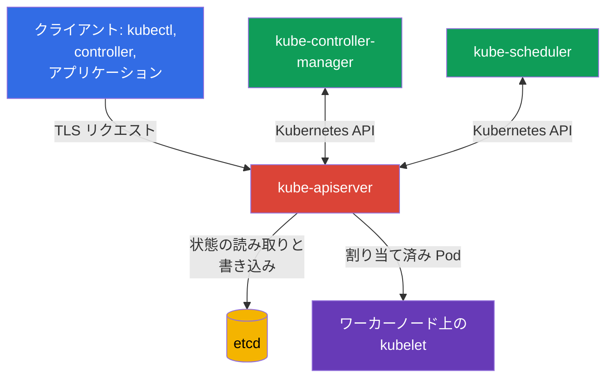
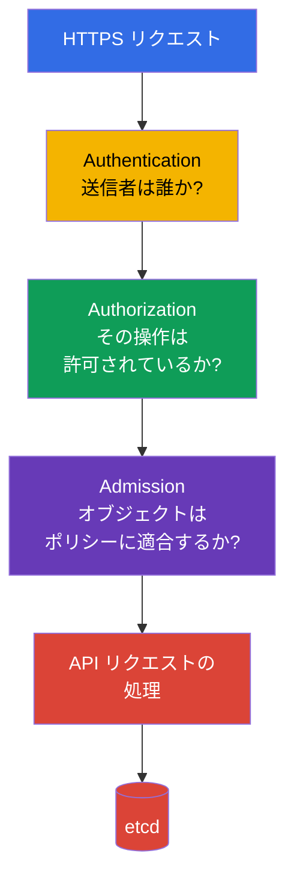

[Русская версия](ru.md) · [Eng version](README.md) · [Versión en español](es.md) · [Version française](fr.md) · [Deutsche Version](de.md) · [ქართული ვერსია](ge.md) · [繁體中文版](tw.md)

# 第07章. Control plane のセキュリティ: API Server、Controller Manager、Scheduler、Etcd

> **次へ進む前に。** これまでの章では、クラウド、イメージ、コードのセキュリティを扱いました。ここから Kubernetes の control plane に進みます。これは KCSA 試験の 22% を占める Kubernetes Cluster Component Security ドメインに属します。control plane の侵害は通常、クラスタ全体の侵害を意味します。

## 07.1 Control plane と、それが重要な領域である理由

Control plane はクラスタの desired state を維持します。リクエストを受け取り、Kubernetes オブジェクトを保存し、実際の状態を API で記述された状態へ継続的に収束させます。通常、主要コンポーネントは control plane ノード上で動作しますが、論理的には単一の管理プレーンを構成します。

- `kube-apiserver` は Kubernetes API を提供し、`kubectl`、コントローラー、その他のコンポーネントの入口となる。
- `etcd` はクラスタの状態を保存する。
- `kube-controller-manager` は API を監視し、desired state からの逸脱を修正するコントローラーを実行する。
- `kube-scheduler` は新しい `Pod` のワーカーノードを選択する。

ここには特に重要な信頼境界が 2 つあります。1 つ目はクライアントと API Server の間です。クラスタは、誰がリクエストを送ったのか、またその主体に何が許可されているのかを把握する必要があります。2 つ目は API Server と `etcd` の間です。ストレージにはクラスタで最も価値の高いデータが含まれるため、任意のネットワークやノードユーザーからアクセス可能であってはなりません。

control plane の保護は、制限されたネットワークとノードアクセス、TLS、信頼できるコンポーネントの認証情報、API アクセスに対する least privilege、監査、バックアップという層で構成されます。あるコントロールが別のコントロールに取って代わることはありません。たとえば TLS は通信を保護しますが、正規であっても過剰な権限を持つクライアントが API 経由でオブジェクトを削除することは防げません。

## 07.2 API Server: 意思決定チェーンと危険な入口

`kube-apiserver` は Kubernetes の中央仲介役です。control plane のコンポーネントでさえ、通常は `etcd` を直接読み取りません。API Server にアクセスします。そのため、可用性、設定、ログが特に重要です。

簡略化すると、リクエストは 3 つの連続した段階を通過します。

1. **Authentication** はアイデンティティを確立します。たとえば、クライアント証明書によるユーザー、トークンによる ServiceAccount、OIDC 経由の外部ユーザーです。
2. **Authorization** はそのアイデンティティの権限を確認します。代表的な仕組みは RBAC です。クライアントが正常に認証されても、リクエストは拒否されることがあります。
3. **Admission** は保存前にオブジェクトを検査または変更します。ここで組み込みの admission plugins、webhooks、ポリシーが機能します。たとえば admission は `privileged: true` を持つ `Pod` を拒否できます。

この順序は MCQ (multiple choice question、選択式問題) で重要です。admission は authentication を置き換えるものでも、ユーザーに権限を割り当てるものでもありません。すでに認証され、認可済みのリクエストを受け取ります。

### Anonymous access

API Server が匿名リクエストを受け入れる場合、認証されていないクライアントにはグループ `system:unauthenticated` 内のアイデンティティ `system:anonymous` が付与されます。`--anonymous-auth` が有効であること自体は、そのクライアントが Secret を読み取れることを意味しません。最終的な判断は authorization に委ねられます。しかし匿名アクセスは攻撃対象領域を広げ、RBAC バインディングの誤りがある場合の偵察を容易にし、通常の API アクセスには不要です。

安全な原則は、各クライアントに明示的な認証情報を提供し、`system:unauthenticated` に不要な権限を一切与えないことです。さらに、どの health および metrics endpoints が外部から利用可能か、それらに本当に公開アクセスが必要かを確認します。

### 安全でないポートとトランスポート

Kubernetes API には、証明書を検証する保護された HTTPS endpoint を通じてアクセスすべきです。歴史的な API Server の安全でない HTTP ポートは、許容される管理経路と見なすべきではありません。現代の Kubernetes では、通常の運用で機能する選択肢ではありません。正当な一時的手順なしに、`--insecure-skip-tls-verify` のようなクライアントフラグで TLS 検証を回避してはなりません。

安全でない endpoint のリスクは、パスワードやトークンの傍受だけではありません。ネットワーク上の攻撃者は API レスポンスを改ざんし、認証情報を取得し、またはクライアントになりすましてリクエストを実行できます。API Server へのネットワークアクセスは通常、load balancer、firewall、security groups で制限されますが、ネットワークは authentication と authorization を置き換えません。

## 07.3 Etcd: クラスタの状態、Secret、復旧

`etcd` は Kubernetes の分散 key-value ストアです。`Pod`、`Deployment`、`Service`、RBAC オブジェクト、`Secret`、その他多数の API オブジェクトの記述が保存されています。現代のクラスタでは、`Pod` は通常、`TokenRequest` を projected volume として通じて短命な bound ServiceAccount token を受け取ります。そのようなトークンは `etcd` に個別の token `Secret` として保存されません。一方、手動で作成した legacy `kubernetes.io/service-account-token` `Secret` は `Secret` として保存されます。`etcd` の完全性または可用性の喪失は、クラスタ全体に影響します。

`Secret` の重要な特性として、Kubernetes は通常の `Secret` データを暗号化せず base64 でエンコードします。encryption at rest がなければ、`etcd` に保存された `Secret` の値は、ストレージまたはそのバックアップへのアクセスを取得した者が利用できます。Base64 は暗号学的な保護ではありません。

| リスク | 結果 | 概念的なコントロール |
|---|---|---|
| 部外者による `etcd` の読み取り | `Secret`、persisted legacy token Secrets、設定、その他の機密 Kubernetes 状態の窃取。 | endpoint を公開せず、ネットワークとローカルアクセスを制限し、TLS と authentication を使用する |
| キーの変更 | オブジェクトの作成または変更、クラスタ完全性の侵害 | 管理アクセスを最小限にし、認証情報を保護し、監査を行う |
| データの喪失 | クラスタ状態を復旧できない | 定期的に検証された snapshots と保護されたコピーの保存 |
| encryption at rest なしでの Secret の保存 | ストレージおよび backup から Secret を読み取れる | Encryption at rest、必要に応じた KMS、キーへのアクセス制限 |

### TLS とアクセス制限

API Server クライアントと `etcd` クラスタの参加者は TLS を使用します。これは通信の機密性を提供し、証明書で接続先を確認できます。ただし、秘密鍵が盗まれた場合や endpoint がすべてのネットワークユーザーに公開されている場合、TLS は `etcd` を安全にはしません。

mTLS では証明書の役割を分離することが重要です。たとえば `kubeadm` により作成される PKI は、etcd-related trust 用の専用 `etcd-ca` と、`kube-apiserver` が `etcd` に対して認証するための別個のクライアント証明書 `apiserver-etcd-client` を使用します。これは、すべての Kubernetes インストールがまったく同じファイル構成や別個の root CA を持つ必要があることを意味しません。しかし trust domains / CA chains を分離することで、異なるコンポーネントの serving- および client-credentials を混在させず、信頼を個別に制限し、rotation や migration etcd を独立して計画できます。

server certificate `kube-apiserver` を `etcd` 用の汎用 shared credential として使用してはなりません。証明書はその役割に適合しなければならず、private keys と CA material は機密性の高い control-plane credentials として保護します。

実践的な原則は、`etcd` endpoint を必要な control plane コンポーネントだけが利用できるようにすることです。`etcd` ポートを公開 load balancer の背後に置かず、`Pod` 内のアプリケーションに直接アクセスを与えず、すべてのオペレーターに共通の認証情報を使用しないでください。通常の Kubernetes オブジェクト変更には、`etcd` への直接書き込みではなく Kubernetes API を使用します。

### バックアップ

`etcd` の snapshot には、稼働中のストレージと同じ機密状態が含まれます。したがって backup は単なる便利なファイルではありません。暗号化し、アクセスを制限し、保持期間を管理し、復元を定期的に確認します。restore を検証しない backup は、準備ができているという誤った安心感を生みます。

`etcd` の侵害は、多くの場合クラスタの侵害に等しくなります。攻撃者は Secret を抽出し、RBAC を変更し、workload を改ざんし、または管理プレーンの動作を妨害できます。このため、`etcd` の保護は Secret 管理と control plane セキュリティの両方に関係します。

## 07.4 Controller Manager と Scheduler: service identity と攻撃対象領域

`kube-controller-manager` は一連のコントローラーをまとめています。コントローラーは API の desired state と実際の状態を比較し、差異の解消を試みます。たとえば `Deployment` コントローラーは `ReplicaSet` を作成し、`ReplicaSet` コントローラーは必要な数の `Pod` を維持します。

`kube-scheduler` は `nodeName` が割り当てられていない `Pod` を監視し、利用可能なワーカーノードを評価して、API Server を通じて割り当ての決定を書き込みます。コンテナを自ら起動するわけではありませんが、その決定によって workload の実行場所が決まります。

両コンポーネントは API クライアントであり、たとえば `system:kube-controller-manager` と `system:kube-scheduler` のような独自のアイデンティティで動作します。kubeconfig、クライアント証明書、トークン、署名キーは機密データと見なす必要があります。攻撃者がこのような認証情報を取得すると、コンポーネントの権限の範囲で行動できます。コントローラーはクラスタ全体のオブジェクトを管理するため、その権限はしばしば広範です。

攻撃対象領域の典型的な要素:

- コンポーネントの kubeconfig、証明書、private keys。
- service identity としての API Server へのアクセス。
- 誤ったネットワークに公開されている、または保護されていない health、metrics、profiling endpoints。
- authentication、authorization、TLS、bind address に影響する起動パラメーター。
- control plane ノード上の static Pod manifests または systemd 設定を変更できる可能性。

日常的な `kubectl` 操作のために、人へ Controller Manager や Scheduler の認証情報を渡してはなりません。service identity には特定の目的があり、オペレーターには、説明責任のあるアクセスを備えた別個の最小権限アイデンティティが必要です。

## 07.5 安全でないフラグ: KCSA レベルで知るべきこと

KCSA 試験では、フラグの完全な一覧を暗記したり manifests を編集したりすることではなく、危険な設定の分類を認識することが重要です。次のような設定は疑わしいものです。

- 必要なく anonymous access を許可する。
- authentication または authorization を無効にする。
- administrative network ではなく、すべてのインターフェースで endpoint を利用可能にする。
- HTTP を使用する、または TLS 検証を無効にする。
- audit logging を無効にする。
- profiling、metrics、debug endpoints を広範なネットワークへ公開する。
- `etcd` の保護を弱める、またはそのデータへのアクセスを提供する。

フラグ自体が常に脆弱性であるとは限りません。たとえば metrics endpoint は monitoring system に必要な場合があります。セキュリティ上の問いは、誰が接続できるか、その主体はどのように認証されるか、何を知りまたは変更できるか、必要な機能を提供するより低リスクな方法があるかです。

設定を確認するときは、まず明示的に安全でない値を探し、次に脅威モデルと照合します。修正には通常、ネットワークアクセスの制限、安全なモードの有効化、侵害された credentials の rotation、ログの確認が含まれます。control plane パラメーターの詳細な修正は、CKS の実践レベルに属します。

## 07.6 実務での適用方法

プラットフォームチームは通常、control plane の保護を一回限りの設定ではなく、再現可能なチェックのセットとして整備します。

1. API Server への経路を administrative networks に制限し、信頼された CA を持つ TLS のみを使用する。
2. 人、CI/CD、control plane コンポーネントのアイデンティティを分離し、least privilege の原則に従って RBAC を確認する。
3. `etcd` をワーカーノードとアプリケーションネットワークから隔離し、証明書を保護し、機密リソースに encryption at rest を適用する。
4. `etcd` snapshots を作成し、Secret データとして保存し、安全な環境での復元を定期的に確認する。
5. CIS Benchmark に照らして設定をスキャンし、static Pod manifests の変更を追跡し、audit logs を収集する。

これは、どのクラスタでも 1 つのチームがすべてを手作業で保守することを意味しません。managed Kubernetes では control plane の一部をクラウドプロバイダーが管理しますが、IAM、API アクセス、Secret、ログ、ネットワーク、責任境界の理解に対する責任は、プラットフォームの利用者に残ります。

## 07.7 Exam vocabulary / ミニ用語集

| 用語 | 意味 |
|---|---|
| control plane | クラスタの状態と workload を管理する Kubernetes コンポーネント。 |
| `kube-apiserver` | クラスタオブジェクトの操作が通過する、Kubernetes の中央 HTTPS API。 |
| authentication | クライアントのアイデンティティを確立すること。 |
| authorization | 識別された主体に操作実行の権利があるかを判断すること。 |
| admission | authentication と authorization の後に行われる、API リクエストの検査または変更の段階。 |
| `etcd` | Kubernetes 状態のストレージ。 |
| encryption at rest | ネットワーク転送時だけでなく、ストレージ内のデータを暗号化すること。 |
| snapshot | ある時点における `etcd` 状態の整合性のあるバックアップ。 |
| service identity | Kubernetes API にアクセスするコンポーネントのアカウント。 |

## 07.8 Exam Essentials / 章のまとめ

- Control plane は API Server、`etcd`、Controller Manager、Scheduler を統合する。その侵害はクラスタ全体に影響する。
- API Server は authentication → authorization → admission のチェーンでリクエストを処理する。認証の成功だけでは権限は付与されない。
- Anonymous access と保護されていない endpoint は攻撃対象領域を広げ、特に厳格な制限を必要とする。
- `etcd` にはクラスタ状態が含まれ、encryption at rest がなければ `Secret` の値はストレージ内で暗号学的に保護されない。
- TLS、アクセス制限、credentials の保護、audit logs、検証済み backups は相互に補完する。
- Controller Manager と Scheduler は機密性の高い認証情報を持つ service identity を使用し、特権 API クライアントとして保護する必要がある。

## 07.9 混同しないことと試験での出題例

KCSA の問題は通常、フラグの正確な構文ではなく、因果関係を確認します。頻出の問いには、クラスタ状態を保存するコンポーネントは何か、API Server はどの順序でリクエストを処理するか、なぜ `etcd` へのアクセスが危険か、TLS は何を保護するか、base64 と encryption at rest の違いは何か、があります。

典型的な落とし穴:

- authentication と authorization を混同しない。
- admission を RBAC 権限の付与機構と見なさない。
- base64 を暗号化と見なさない。
- managed control plane が API やデータへのアクセスに関する利用者の責任を完全に取り除くと考えない。
- Kubernetes オブジェクトを管理する通常の方法として、`etcd` を直接操作することを選ばない。

## 07.10 自己確認問題

### 1. 簡略化したモデルでは、API Server はどの順序でリクエストを処理しますか?

   - a. authentication → admission → authorization

   - b. admission → authorization → authentication

   - c. authorization → admission → authentication

   - d. authentication → authorization → admission

回答と解説

**正解: d.** Kubernetes は最初にクライアントのアイデンティティを確立し、次にその権限を確認し、その後 admission が許可可能なリクエストを検査または変更できます。

### 2. 部外者による `etcd` への直接アクセスが重大なリスクである理由は何ですか?

   - a. ローカルの kubelet ログのみを管理でき、API state には影響しないため。
   - b. scheduler cache のみにアクセスでき、workload 設定は含まれないため。
   - c. control plane の metrics のみが公開され、Kubernetes オブジェクトの読み取りや変更はできないため。
   - d. 機密オブジェクトを含む Kubernetes API 状態が公開され、クラスタの重要データの読み取りや変更が可能になるため。

回答と解説

**正解: d.** `etcd` は Kubernetes API の状態を保存します。したがって、そこへの不正な直接アクセスは重要データの機密性と完全性に影響する可能性があります。保護には、厳格なネットワーク到達性、mTLS、機密リソースに対する encryption at rest が含まれます。

### 3. kube-apiserver における `--anonymous-auth` のリスクを最も適切に説明するものはどれですか?

   - a. 認証されていないリクエストは、namespace 内の任意の ServiceAccount の権限を自動的に取得する。
   - b. 認証されていないリクエストは anonymous identity を取得し、誤った authorization 設定により不要な API 操作が許可される可能性がある。
   - c. anonymous クライアントは、authorizer configuration に関係なく自動的に `system:masters` になる。
   - d. anonymous authentication を有効にすると、API Server と `etcd` 間の TLS 証明書検証が無効になる。

回答と解説

**正解: b.** Anonymous authentication は認証されていないリクエストの identity を定義します。実際の permissions は引き続き authorization が決定します。anonymous identity に不要な権限が与えられた場合、または anonymous endpoint が攻撃対象領域を広げる場合にリスクが発生します。

### 4. `etcd` またはその backup に保存された `Secret` データを、ストレージ自体からの読み取りから最も直接的に保護するコントロールはどれですか?

   - a. NetworkPolicy で application traffic を制限し、ユーザーサービス間で TLS を使用する一方、storage data は encryption at rest なしで残す。

   - b. RBAC で Kubernetes API を制限し、Secret data を base64 で保存して、エンコードを十分な storage 保護と見なす。

   - c. encryption at rest を使用し、さらに etcd、snapshots、復号のためのキー material へのアクセスを個別に制限する。

   - d. API Server と etcd 間で mTLS を使用するが、snapshots とキーは個別の access control なしで保存する。

回答と解説

**正解: c.** Encryption at rest は保存されたレコードを保護し、`etcd`、backup/snapshots、decryption key material には個別の access control が必要です。NetworkPolicy と transport mTLS は別の境界を保護し、base64 は encryption ではありません。

### 5. `kube-controller-manager` と `kube-scheduler` の credentials はどのように扱うべきですか?

   - a. control-plane endpoint が内部ネットワークで閉じられている場合は、共通の管理 credentials として扱う。

   - b. これらのコンポーネントは control plane 内で動作するため、公開の service data として扱う。

   - c. 保護し、least privilege により制限する、特権コンポーネントの API credentials として扱う。

   - d. コンポーネント間ですでに TLS を使用している場合は、API Server の serving certificate の代替として扱う。

回答と解説

**正解: c.** `kube-controller-manager` と `kube-scheduler` は認証済み API クライアントです。これらの kubeconfig、client certificates、keys、tokens は機密性の高い credentials であり、コンポーネントに必要な permissions だけを持つ必要があります。内部ネットワークは shared admin credentials を安全にはせず、コンポーネントの client identity は API Server の serving certificate を置き換えません。

> **次へ。** 実践的な設定確認については、CIS Benchmark と `kube-bench` に関する CKS 第07章、control plane と TLS の保護に関する CKS 第09章、Secret と `etcd` の管理に関する CKS 第21章を学んでください。

[目次](../README_JP.md) · [第06章](../06/jp.md) · [第08章](../08/jp.md)
