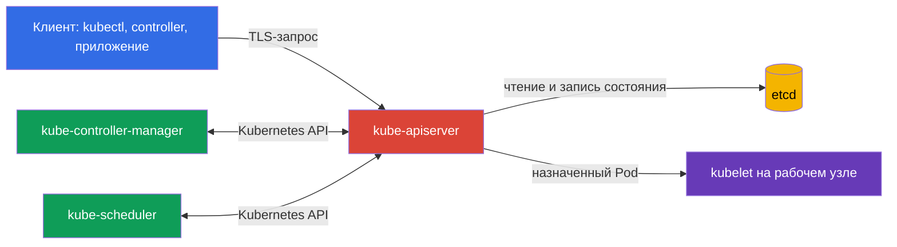
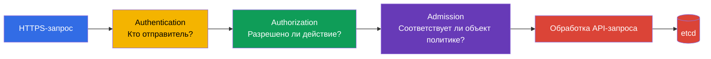

> **Язык:** русский. Переводы будут добавлены после публикации соответствующих файлов.

# Глава 07. Безопасность control plane: API Server, Controller Manager, Scheduler, Etcd

> **Что дальше.** В предыдущих главах мы рассмотрели безопасность облака, образов и кода. Теперь переходим к управляющей плоскости Kubernetes. Она относится к домену Kubernetes Cluster Component Security, который составляет 22% экзамена KCSA: компрометация control plane обычно означает компрометацию всего кластера.

## 07.1 Control plane и почему он является критической зоной

Control plane поддерживает желаемое состояние кластера. Он принимает запросы, хранит объекты Kubernetes и постоянно приводит фактическое состояние к описанному в API. Обычно его ключевые компоненты работают на узлах control plane, но логически образуют одну управляющую плоскость:

- `kube-apiserver` предоставляет Kubernetes API и является входной точкой для `kubectl`, контроллеров и других компонентов;
- `etcd` хранит состояние кластера;
- `kube-controller-manager` запускает контроллеры, которые наблюдают за API и исправляют отклонения от желаемого состояния;
- `kube-scheduler` выбирает рабочий узел для нового `Pod`.

Здесь есть две особенно важные границы доверия. Первая проходит между клиентом и API Server: кластер должен понимать, кто отправил запрос и что этому субъекту разрешено. Вторая проходит между API Server и `etcd`: хранилище содержит наиболее ценные данные кластера и не должно быть доступно произвольной сети или пользователю узла.

Защита control plane строится слоями: ограниченная сеть и доступ к узлам, TLS, надёжные учётные данные компонентов, least privilege для API-доступа, аудит и резервные копии. Один контроль не заменяет другой. Например, TLS защищает трафик, но не помешает легитимному, однако чрезмерно привилегированному клиенту удалить объекты через API.

## 07.2 API Server: цепочка принятия решения и опасные точки входа

`kube-apiserver` - центральный посредник Kubernetes. Даже компоненты control plane обычно не читают `etcd` напрямую: они обращаются к API Server. Поэтому его доступность, конфигурация и журналы особенно важны.

Упрощённо запрос проходит три последовательных этапа:

1. **Authentication** устанавливает идентичность: например, пользователя по клиентскому сертификату, ServiceAccount по токену или внешнего пользователя через OIDC.
2. **Authorization** проверяет права этой идентичности. Типичный механизм - RBAC. Запрос может быть отклонён, хотя клиент успешно аутентифицирован.
3. **Admission** проверяет или изменяет объект до сохранения. Здесь работают встроенные admission plugins, webhooks и политики. Например, admission может запретить `Pod` с `privileged: true`.

Порядок важен для MCQ: admission не заменяет authentication и не назначает пользователю права. Он получает уже аутентифицированный и авторизованный запрос.

### Anonymous access

Если API Server принимает анонимные запросы, неаутентифицированный клиент получает идентичность `system:anonymous` в группе `system:unauthenticated`. Сам по себе включённый `--anonymous-auth` не означает, что такой клиент может читать секреты: окончательное решение остаётся за authorization. Но анонимный доступ увеличивает поверхность атаки, облегчает разведку при ошибочных RBAC-привязках и не нужен для обычного доступа к API.

Безопасный принцип - предоставлять явные учётные данные каждому клиенту и не выдавать `system:unauthenticated` никаких лишних разрешений. Отдельно проверяют, какие health- и metrics-endpoints доступны извне и действительно ли им нужен публичный доступ.

### Небезопасные порты и транспорт

К Kubernetes API следует обращаться по защищённому HTTPS endpoint с проверкой сертификата. Исторический небезопасный HTTP-порт API Server не следует рассматривать как допустимый путь администрирования: в современном Kubernetes он не является рабочим вариантом для обычной эксплуатации. Не следует обходить TLS-проверку флагами клиента вроде `--insecure-skip-tls-verify` без обоснованной временной процедуры.

Риск небезопасного endpoint состоит не только в перехвате пароля или токена. Атакующий в сети может подменить ответ API, получить учётные данные или выполнить запрос от имени клиента. Сетевой доступ к API Server обычно ограничивают балансировщиком, firewall или security groups, но сеть не заменяет authentication и authorization.

## 07.3 Etcd: состояние кластера, секреты и восстановление

`etcd` - распределённое key-value хранилище Kubernetes. В нём находятся описания `Pod`, `Deployment`, `Service`, RBAC-объекты, `Secret` и многие другие API-объекты. В современных кластерах `Pod` обычно получает короткоживущий bound ServiceAccount token через `TokenRequest` как projected volume; такой токен не хранится отдельным token `Secret` в `etcd`. Вручную созданный legacy `kubernetes.io/service-account-token` `Secret`, напротив, сохраняется как `Secret`. Потеря целостности или доступности `etcd` влияет на весь кластер.

Особое свойство `Secret`: Kubernetes кодирует обычные данные `Secret` в base64, а не шифрует их. Без encryption at rest значение `Secret`, сохранённое в `etcd`, доступно тому, кто получил доступ к хранилищу или его резервной копии. Base64 не является криптографической защитой.

| Риск | Последствие | Концептуальный контроль |
|---|---|---|
| Чтение `etcd` посторонним | Кража `Secret`, persisted legacy token Secrets, конфигурации и другого чувствительного состояния Kubernetes. | Не публиковать endpoint, ограничить сеть и локальный доступ, использовать TLS и authentication |
| Изменение ключей | Создание или изменение объектов, нарушение целостности кластера | Минимум административных доступов, защищённые учётные данные, аудит |
| Потеря данных | Невозможность восстановить состояние кластера | Регулярные проверенные snapshots и защищённое хранение копий |
| Хранение секретов без encryption at rest | Секреты читаемы из хранилища и backup | Encryption at rest, при необходимости KMS, ограничение доступа к ключам |

### TLS и ограничение доступа

Клиент API Server и участники кластера `etcd` используют TLS. Он обеспечивает конфиденциальность трафика и позволяет подтвердить стороны соединения сертификатами. Однако TLS не делает `etcd` безопасным, если закрытый ключ украден или endpoint доступен всем пользователям сети.

Практическое правило: endpoint `etcd` должен быть доступен только необходимым компонентам control plane. Не размещайте порт `etcd` за публичным балансировщиком, не давайте приложению в `Pod` прямой доступ к нему и не используйте общие учётные данные для всех операторов. Для штатного изменения Kubernetes-объектов применяют Kubernetes API, а не прямую запись в `etcd`.

### Резервные копии

Snapshot `etcd` содержит то же чувствительное состояние, что и рабочее хранилище. Поэтому backup не является просто файлом для удобства: его шифруют, ограничивают к нему доступ, контролируют срок хранения и периодически проверяют восстановление. Backup без проверки restore создаёт ложное чувство готовности.

Компрометация `etcd` часто равна компрометации кластера. Атакующий может извлечь секреты, изменить RBAC, подменить workload или нарушить работу управляющей плоскости. Это объясняет, почему защита `etcd` относится и к управлению секретами, и к безопасности control plane.

## 07.4 Controller Manager и Scheduler: служебные идентичности и поверхность атаки

`kube-controller-manager` объединяет набор контроллеров. Контроллер сравнивает желаемое состояние из API с фактическим и пытается устранить разницу. Например, контроллер `Deployment` создаёт `ReplicaSet`, а контроллер `ReplicaSet` поддерживает нужное число `Pod`.

`kube-scheduler` наблюдает за `Pod` без назначенного `nodeName`, оценивает доступные рабочие узлы и записывает решение о назначении через API Server. Он не запускает контейнер сам, но его решение определяет, где будет исполняться рабочая нагрузка.

Оба компонента являются API-клиентами и работают от собственных идентичностей, например `system:kube-controller-manager` и `system:kube-scheduler`. Их kubeconfig, клиентские сертификаты, токены и ключи подписи нужно считать чувствительными данными. Если атакующий получает такие учётные данные, он может действовать в пределах прав компонента. Для контроллеров эти права нередко широкие, потому что они управляют объектами во всём кластере.

Типичные элементы поверхности атаки:

- kubeconfig, сертификаты и private keys компонентов;
- доступ к API Server от имени служебной идентичности;
- endpoints health, metrics и profiling, если они доступны не тем сетям или не защищены;
- параметры запуска, влияющие на authentication, authorization, TLS или bind address;
- возможность изменить static Pod manifests либо systemd-конфигурацию на узле control plane.

Не следует выдавать человеку учётные данные Controller Manager или Scheduler для повседневного `kubectl`. Служебная идентичность имеет конкретное назначение, а оператору нужна отдельная, минимально привилегированная идентичность с подотчётным доступом.

## 07.5 Небезопасные флаги: что нужно знать на уровне KCSA

На экзамене KCSA важно распознавать класс опасной настройки, а не запоминать полный список флагов или редактировать manifests. Подозрительными являются настройки, которые:

- разрешают anonymous access без необходимости;
- отключают authentication или authorization;
- делают endpoint доступным на всех интерфейсах вместо административной сети;
- используют HTTP или отключают TLS-проверку;
- отключают audit logging;
- открывают profiling, metrics или debug endpoints широкой сети;
- ослабляют защиту `etcd` или предоставляют доступ к его данным.

Флаг сам по себе не всегда является уязвимостью. Например, endpoint metrics может быть нужен системе наблюдаемости. Вопрос безопасности звучит так: кто может к нему подключиться, как аутентифицируется этот субъект, что он может узнать или изменить и есть ли менее рискованный способ предоставить нужную функцию.

При проверке конфигурации сначала ищут явные небезопасные значения, затем сопоставляют их с моделью угроз. Исправление обычно включает ограничение сетевого доступа, включение защищённых режимов, ротацию скомпрометированных credentials и проверку журналов. Детальная правка параметров control plane относится к практическому уровню CKS.

## 07.6 Как это применяют на практике

Платформенная команда обычно оформляет защиту control plane как повторяемый набор проверок, а не как разовую настройку:

1. Ограничивает путь к API Server административными сетями и использует только TLS с доверенным CA.
2. Разделяет идентичности людей, CI/CD и компонентов control plane; проверяет RBAC по принципу least privilege.
3. Закрывает `etcd` от рабочих узлов и прикладных сетей, защищает сертификаты и применяет encryption at rest для чувствительных ресурсов.
4. Создаёт snapshots `etcd`, хранит их как секретные данные и регулярно проверяет восстановление в безопасной среде.
5. Сканирует конфигурацию относительно CIS Benchmark, отслеживает изменения static Pod manifests и собирает audit logs.

Это не означает, что одна команда вручную обслуживает всё в любом кластере. В managed Kubernetes часть control plane ведёт облачный провайдер, но ответственность за IAM, API-доступ, секреты, логи, сеть и понимание границ ответственности остаётся у пользователя платформы.

## 07.7 Exam vocabulary / Мини-глоссарий

| Термин | Значение |
|---|---|
| control plane | Компоненты Kubernetes, управляющие состоянием кластера и его рабочими нагрузками. |
| `kube-apiserver` | Центральный HTTPS API Kubernetes, через который проходят операции с объектами кластера. |
| authentication | Установление идентичности клиента. |
| authorization | Решение о том, имеет ли идентифицированный субъект право выполнить действие. |
| admission | Этап проверки или изменения запроса к API после authentication и authorization. |
| `etcd` | Хранилище состояния Kubernetes. |
| encryption at rest | Шифрование данных в хранилище, а не только при передаче по сети. |
| snapshot | Согласованная резервная копия состояния `etcd` в конкретный момент. |
| служебная идентичность | Учётная запись компонента, с которой он обращается к Kubernetes API. |

## 07.8 Exam Essentials / Итоги главы

- Control plane объединяет API Server, `etcd`, Controller Manager и Scheduler; его компрометация затрагивает весь кластер.
- API Server обрабатывает запрос по цепочке authentication → authorization → admission. Успешная аутентификация не даёт права сама по себе.
- Anonymous access и незащищённые endpoint увеличивают поверхность атаки и требуют особенно строгих ограничений.
- `etcd` содержит состояние кластера, а без encryption at rest значения `Secret` не защищены криптографически в хранилище.
- TLS, ограниченный доступ, защита credentials, audit logs и проверенные backups дополняют друг друга.
- Controller Manager и Scheduler имеют служебные идентичности с чувствительными учётными данными и должны быть защищены как привилегированные API-клиенты.

## 07.9 Не путать и как это встречается на экзамене

Вопросы KCSA обычно проверяют причинно-следственные связи, а не точный синтаксис флага. Частые формулировки: какой компонент хранит состояние кластера, в каком порядке API Server обрабатывает запрос, почему доступ к `etcd` опасен, что защищает TLS и чем base64 отличается от encryption at rest.

Типичные ловушки:

- не путать authentication с authorization;
- не считать admission механизмом выдачи RBAC-прав;
- не считать base64 шифрованием;
- не предполагать, что managed control plane полностью снимает с пользователя ответственность за доступ к API и данным;
- не выбирать прямую работу с `etcd` как штатный способ управления Kubernetes-объектами.

## 07.10 Вопросы для самопроверки

### 1. В каком порядке API Server в упрощённой модели обрабатывает запрос?

   - a. authentication → admission → authorization

   - b. admission → authorization → authentication

   - c. authorization → admission → authentication

   - d. authentication → authorization → admission

Ответ и разбор

**Верный ответ: d.** Сначала Kubernetes устанавливает идентичность клиента, затем проверяет его права, а после этого admission может проверить или изменить допустимый запрос.

### 2. Почему прямой доступ постороннего к `etcd` является критичным риском?

   - a. Он позволяет управлять только локальными журналами kubelet и не затрагивает API state.
   - b. Он предоставляет доступ только к scheduler cache и не содержит workload-конфигурации.
   - c. Он открывает только метрики control plane, но не позволяет читать или менять объекты Kubernetes.
   - d. Он может открыть состояние Kubernetes API, включая чувствительные объекты, и позволить читать или изменять критичные данные кластера.

Ответ и разбор

**Верный ответ: d.** `etcd` хранит состояние Kubernetes API. Поэтому несанкционированный прямой доступ к нему может затронуть конфиденциальность и целостность критичных данных; защита включает строгую сетевую доступность, mTLS и encryption at rest для чувствительных ресурсов.

### 3. Что лучше всего описывает риск `--anonymous-auth` у kube-apiserver?

   - a. Неаутентифицированные запросы автоматически получают права любого ServiceAccount в namespace.
   - b. Неаутентифицированный запрос получает anonymous identity, а ошибочная authorization-конфигурация может разрешить ей нежелательные API-действия.
   - c. Анонимный клиент автоматически становится `system:masters`, независимо от authorizer configuration.
   - d. Включение anonymous authentication отключает TLS-проверку сертификата между API Server и `etcd`.

Ответ и разбор

**Верный ответ: b.** Anonymous authentication определяет identity неаутентифицированного запроса; фактические permissions всё равно определяет authorization. Риск возникает, когда anonymous identity получает ненужные права или когда анонимный endpoint увеличивает поверхность атаки.

### 4. Какой контроль наиболее непосредственно защищает данные `Secret`, сохранённые в `etcd` или его backup, от чтения из самого хранилища?

   - a. `NetworkPolicy`, ограничивающая сетевые соединения между выбранными application Pods.
   - b. Namespace labels, используемые для организационной классификации workloads.
   - c. Encryption at rest для `Secret` вместе с ограничением доступа к `etcd`, ключам и snapshots.
   - d. Base64-кодирование Secret data перед сохранением Kubernetes API object.

Ответ и разбор

**Верный ответ: c.** Encryption at rest защищает сохранённые API data, а доступ к `etcd`, snapshots и ключевому материалу должен быть отдельно ограничен. `NetworkPolicy` не шифрует storage, labels не обеспечивают confidentiality, а base64 является кодированием, а не шифрованием.

### 5. Как следует относиться к credentials `kube-controller-manager` и `kube-scheduler`?

   - a. Как к общим credentials для всех администраторов.

   - b. Как к замене TLS-сертификата API Server.

   - c. Как к чувствительным служебным credentials с API-правами, которые нужно ограничивать, защищать и не использовать для повседневной работы человека.

   - d. Как к несекретным данным, потому что компоненты работают внутри control plane.

Ответ и разбор

**Верный ответ: c.** Эти компоненты являются привилегированными API-клиентами. Кража их kubeconfig, сертификатов или токенов позволяет атакующему действовать от имени компонента в пределах его полномочий.

> **Куда дальше.** Для практической проверки конфигурации изучите главу 07 CKS о CIS Benchmark и `kube-bench`, главу 09 CKS о защите control plane и TLS и главу 21 CKS об управлении секретами и `etcd`.

[Оглавление](../README_RU.md) · [Глава 06](../06/ru.md) · [Глава 08](../08/ru.md)
