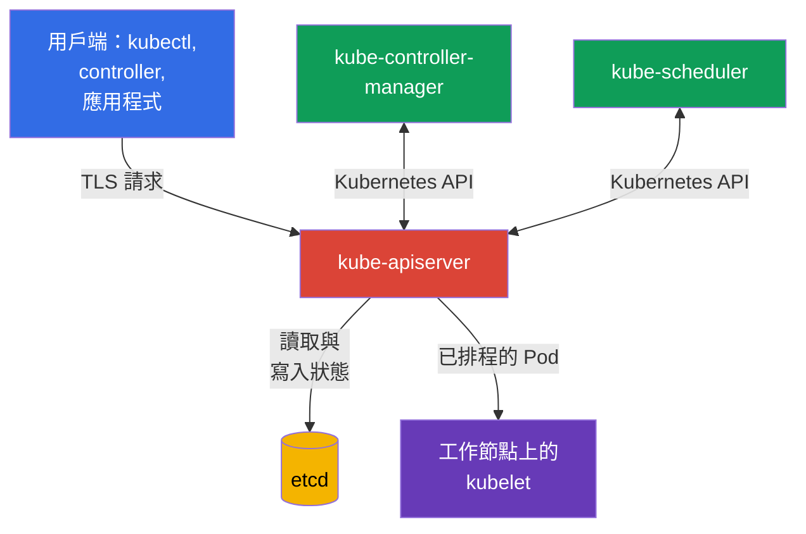
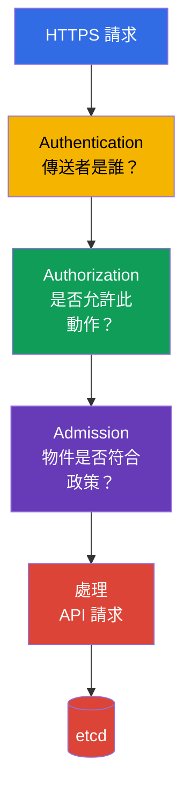

[Русская версия](ru.md) · [Eng version](README.md) · [Versión en español](es.md) · [Version française](fr.md) · [Deutsche Version](de.md) · [ქართული ვერსია](ge.md) · [日本語版](jp.md)

# 第 07 章：control plane 安全性：API Server、Controller Manager、Scheduler、Etcd

> **接下來。** 在前幾章中，我們討論了雲端、映像檔與程式碼的安全性。現在轉向 Kubernetes control plane。它屬於 Kubernetes Cluster Component Security 領域，在 KCSA 考試中占 22%：control plane 遭入侵通常代表整個叢集遭入侵。

## 07.1 Control plane 及其為何是關鍵區域

Control plane 維護叢集的期望狀態。它接收請求、儲存 Kubernetes 物件，並持續讓實際狀態符合 API 中描述的狀態。其主要元件通常在 control plane 節點上執行，但在邏輯上構成一個 control plane：

- `kube-apiserver` 提供 Kubernetes API，並且是 `kubectl`、控制器和其他元件的進入點；
- `etcd` 儲存叢集狀態；
- `kube-controller-manager` 執行控制器，這些控制器會觀察 API 並修正與期望狀態的偏差；
- `kube-scheduler` 為新的 `Pod` 選擇工作節點。

此處有兩個格外重要的信任邊界。第一個位於用戶端與 API Server 之間：叢集必須了解由誰送出請求，以及該主體可執行哪些動作。第二個位於 API Server 與 `etcd` 之間：該儲存庫包含叢集最有價值的資料，不應可由任意網路或節點使用者存取。

Control plane 的防護由多層措施構成：受限的網路與節點存取、TLS、可靠的元件憑證、API 存取的 least privilege、稽核與備份。單一控制措施無法取代其他措施。例如，TLS 能保護流量，但無法阻止合法卻權限過高的用戶端透過 API 刪除物件。

## 07.2 API Server：決策鏈與危險的進入點

`kube-apiserver` 是 Kubernetes 的中央中介者。即使是 control plane 元件通常也不會直接讀取 `etcd`：它們會向 API Server 發出請求。因此，它的可用性、設定與日誌尤其重要。

簡化而言，請求會依序經過三個階段：

1. **Authentication** 建立身分：例如，透過用戶端憑證識別使用者、透過權杖識別 ServiceAccount，或透過 OIDC 識別外部使用者。
2. **Authorization** 檢查該身分的權限。典型機制是 RBAC。即使用戶端已成功通過 authentication，請求仍可能遭拒絕。
3. **Admission** 在儲存物件之前檢查或修改該物件。內建 admission plugins、webhooks 與政策在此運作。例如，admission 可拒絕 `privileged: true` 的 `Pod`。

這個順序對 MCQ（multiple choice question，選擇題）很重要：admission 不會取代 authentication，也不會向使用者授予權限。它接收的是已完成 authentication 和 authorization 的請求。

### Anonymous access

如果 API Server 接受匿名請求，未通過 authentication 的用戶端會在 `system:unauthenticated` 群組中取得 `system:anonymous` 身分。單純啟用 `--anonymous-auth` 不代表該用戶端能讀取 Secret：最終決定仍由 authorization 作出。但匿名存取會擴大攻擊面、在 RBAC 繫結設定錯誤時使偵察更容易，並且對正常的 API 存取並非必要。

安全原則是為每個用戶端提供明確的憑證，且不向 `system:unauthenticated` 授予任何多餘權限。還應另外檢查哪些 health 與 metrics endpoints 可從外部存取，以及它們是否確實需要公開存取。

### 不安全的連接埠與傳輸

Kubernetes API 應透過受保護的 HTTPS endpoint 存取，並驗證憑證。歷史上的 API Server 不安全 HTTP 連接埠不應被視為可接受的管理途徑：在現代 Kubernetes 中，它不是一般營運可用的方案。若沒有具正當理由的臨時程序，不應以 `--insecure-skip-tls-verify` 之類的用戶端旗標略過 TLS 驗證。

不安全 endpoint 的風險不僅是密碼或權杖遭攔截。網路中的攻擊者可以竄改 API 回應、取得憑證，或以用戶端身分執行請求。API Server 的網路存取通常會以 load balancer、firewall 或 security groups 限制，但網路無法取代 authentication 與 authorization。

## 07.3 Etcd：叢集狀態、秘密與復原

`etcd` 是 Kubernetes 的分散式 key-value 儲存庫。其中包含 `Pod`、`Deployment`、`Service`、RBAC 物件、`Secret` 以及許多其他 API 物件的描述。在現代叢集中，`Pod` 通常會透過 `TokenRequest` 以 projected volume 取得短期有效的 bound ServiceAccount token；這類權杖不會作為個別 token `Secret` 儲存在 `etcd` 中。相反地，手動建立的 legacy `kubernetes.io/service-account-token` `Secret` 會儲存為 `Secret`。`etcd` 的完整性或可用性喪失會影響整個叢集。

`Secret` 有一項特殊性質：Kubernetes 會以 base64 編碼一般 `Secret` 資料，而非加密它們。若沒有 encryption at rest，儲存在 `etcd` 中的 `Secret` 值可被任何取得儲存庫或其備份存取權的人讀取。Base64 並不是密碼學保護。

| 風險 | 後果 | 概念性控制措施 |
|---|---|---|
| 未授權者讀取 `etcd` | 竊取 `Secret`、持久化的 legacy token Secrets、設定及其他敏感 Kubernetes 狀態。 | 不公開 endpoint，限制網路與本機存取，使用 TLS 與 authentication |
| 修改金鑰 | 建立或修改物件，破壞叢集完整性 | 最少的管理存取權、受保護的憑證、稽核 |
| 資料遺失 | 無法復原叢集狀態 | 定期建立經驗證的 snapshots，並安全儲存副本 |
| 儲存秘密時未使用 encryption at rest | 可從儲存庫與備份讀取秘密 | Encryption at rest，必要時使用 KMS，限制對金鑰的存取 |

### TLS 與存取限制

API Server 用戶端與 `etcd` 叢集成員使用 TLS。它能保護流量機密性，並讓各方透過憑證驗證連線對象。然而，若私密金鑰遭竊，或 endpoint 對所有網路使用者開放，TLS 無法使 `etcd` 變得安全。

對 mTLS 而言，區分憑證角色很重要。例如，`kubeadm` 建立的 PKI 使用獨立的 `etcd-ca` 作為 etcd-related trust，並使用獨立的用戶端憑證 `apiserver-etcd-client`，讓 `kube-apiserver` 向 `etcd` 進行 authentication。這不表示每個 Kubernetes 安裝都必須具有完全相同的檔案結構、或獨立的 root CA，但區分 trust domains / CA chains 可避免混合不同元件的 serving- 與 client-credentials、可分別限制信任，並獨立規劃 etcd 的 rotation 或 migration。

不可將 server certificate `kube-apiserver` 作為 etcd 的通用 shared credential。憑證必須符合其角色，private keys 與 CA material 應視為敏感的 control-plane credentials 加以保護。

實務原則是：`etcd` endpoint 應只可由必要的 control plane 元件存取。請勿將 `etcd` 連接埠置於公開 load balancer 後方，不要讓 `Pod` 中的應用程式直接存取它，也不要對所有操作人員使用共用憑證。若要正常變更 Kubernetes 物件，應使用 Kubernetes API，而不是直接寫入 `etcd`。

### 備份

`etcd` snapshot 含有與運作中儲存庫相同的敏感狀態。因此，backup 不僅是方便使用的檔案：應將其加密、限制存取、控管保留期限，並定期驗證是否能復原。未經測試 restore 的 backup 會造成虛假的準備就緒感。

`etcd` 遭入侵往往等同於叢集遭入侵。攻擊者可以擷取秘密、修改 RBAC、竄改 workload，或破壞 control plane 的運作。這說明為何 `etcd` 保護同時屬於秘密管理與 control plane 安全性。

## 07.4 Controller Manager 與 Scheduler：服務身分 (service identity) 與攻擊面

`kube-controller-manager` 整合了一組控制器。控制器會將 API 中的期望狀態與實際狀態比較，並嘗試消除差異。例如，`Deployment` 控制器會建立 `ReplicaSet`，而 `ReplicaSet` 控制器會維持所需數量的 `Pod`。

`kube-scheduler` 會觀察沒有指派 `nodeName` 的 `Pod`、評估可用工作節點，並透過 API Server 寫入排程決策。它不會自行啟動 container，但其決策決定 workload 的執行位置。

兩個元件都是 API 用戶端，並以各自的身分執行，例如 `system:kube-controller-manager` 與 `system:kube-scheduler`。其 kubeconfig、用戶端憑證、權杖與簽署金鑰都必須視為敏感資料。若攻擊者取得這類憑證，他能在該元件權限範圍內行動。控制器的權限通常很廣，因為它們管理整個叢集的物件。

攻擊面的典型要素：

- 元件的 kubeconfig、憑證與 private keys；
- 以服務身分存取 API Server；
- health、metrics 與 profiling endpoints，若其對不應存取的網路開放或未受保護；
- 影響 authentication、authorization、TLS 或 bind address 的啟動參數；
- 能夠在 control plane 節點上修改 static Pod manifests 或 systemd 設定的能力。

不應向人員提供 Controller Manager 或 Scheduler 的憑證來進行日常 `kubectl` 操作。服務身分有其特定用途，而操作人員需要獨立、符合 least privilege 且具可追溯存取的身分。

## 07.5 不安全旗標：KCSA 層級必須知道的內容

在 KCSA 考試中，重要的是辨識危險設定的類別，而非記住完整旗標清單或編輯 manifests。可疑的設定包括：

- 在沒有必要時允許 anonymous access；
- 停用 authentication 或 authorization；
- 讓 endpoint 在所有介面而非管理網路上可用；
- 使用 HTTP 或停用 TLS 驗證；
- 停用 audit logging；
- 向廣泛網路開放 profiling、metrics 或 debug endpoints；
- 弱化 `etcd` 保護，或允許存取其資料。

旗標本身不一定就是弱點。例如，monitoring 系統可能需要 metrics endpoint。安全問題是：誰可以連線、該主體如何完成 authentication、他能取得或變更什麼，以及是否有風險更低的方式提供所需功能。

檢查設定時，先尋找明顯不安全的值，再將它們對應到威脅模型。修正通常包括限制網路存取、啟用安全模式、rotation 已遭入侵的 credentials，以及檢查日誌。control plane 參數的詳細修改屬於 CKS 的實務層級。

## 07.6 如何在實務中套用

平台團隊通常會將 control plane 防護制定為可重複執行的一組檢查，而非一次性的設定：

1. 以管理網路限制通往 API Server 的路徑，並只使用由受信任 CA 簽發的 TLS。
2. 區分人員、CI/CD 與 control plane 元件的身分，並依 least privilege 原則檢查 RBAC。
3. 將 `etcd` 與工作節點及應用程式網路隔離，保護憑證，並對敏感資源採用 encryption at rest。
4. 建立 `etcd` snapshots，將其作為秘密資料儲存，並定期在安全環境中測試復原。
5. 依 CIS Benchmark 掃描設定、追蹤 static Pod manifests 的變更，並收集 audit logs。

這不代表在任何叢集中都由同一團隊手動維護所有部分。在 managed Kubernetes 中，部分 control plane 由雲端供應商維護，但 IAM、API 存取、秘密、日誌、網路，以及對責任邊界的理解，仍由平台使用者負責。

## 07.7 Exam vocabulary / 迷你詞彙表

| 詞彙 | 意義 |
|---|---|
| control plane | 管理叢集狀態及其 workloads 的 Kubernetes 元件。 |
| `kube-apiserver` | Kubernetes 的中央 HTTPS API，所有叢集物件操作皆經由它進行。 |
| authentication | 建立用戶端身分。 |
| authorization | 判定已識別的主體是否有權執行動作。 |
| admission | 在 authentication 與 authorization 之後，檢查或修改 API 請求的階段。 |
| `etcd` | Kubernetes 的狀態儲存庫。 |
| encryption at rest | 對儲存庫中的資料加密，而不僅是傳輸中的資料。 |
| snapshot | 特定時間點 `etcd` 狀態的一致性備份。 |
| 服務身分 (service identity) | 元件用來存取 Kubernetes API 的帳戶。 |

## 07.8 Exam Essentials / 本章重點

- Control plane 包含 API Server、`etcd`、Controller Manager 與 Scheduler；其遭入侵會影響整個叢集。
- API Server 依 authentication → authorization → admission 鏈處理請求。成功 authentication 本身不會授予權限。
- Anonymous access 與不安全 endpoints 會擴大攻擊面，並需要特別嚴格的限制。
- `etcd` 包含叢集狀態，若沒有 encryption at rest，`Secret` 值在儲存庫中不受密碼學保護。
- TLS、受限存取、credentials 保護、audit logs 與經驗證的 backups 彼此互補。
- Controller Manager 與 Scheduler 具有包含敏感憑證的服務身分，必須作為具權限的 API 用戶端加以保護。

## 07.9 不要混淆的概念，以及它們在考試中的出現方式

KCSA 問題通常測試因果關係，而非精確旗標語法。常見題型包括：哪個元件儲存叢集狀態、API Server 依何種順序處理請求、為何存取 `etcd` 很危險、TLS 保護什麼，以及 base64 與 encryption at rest 有何差異。

典型陷阱：

- 不要混淆 authentication 與 authorization；
- 不要將 admission 視為授予 RBAC 權限的機制；
- 不要將 base64 視為加密；
- 不要假定 managed control plane 完全免除使用者對 API 與資料存取的責任；
- 不要選擇直接操作 `etcd` 作為管理 Kubernetes 物件的正常方式。

## 07.10 自我檢查問題

### 1. 在簡化模型中，API Server 以何種順序處理請求？

   - a. authentication → admission → authorization

   - b. admission → authorization → authentication

   - c. authorization → admission → authentication

   - d. authentication → authorization → admission

答案與說明

**正確答案：d。** Kubernetes 先建立用戶端身分，接著檢查其權限，之後 admission 才能檢查或修改可接受的請求。

### 2. 為何未授權者直接存取 `etcd` 是關鍵風險？

   - a. 它只允許管理本機 kubelet 日誌，不會影響 API state。
   - b. 它只提供 scheduler cache 的存取，且不包含 workload 設定。
   - c. 它只開放 control plane metrics，但無法讀取或變更 Kubernetes 物件。
   - d. 它可能開放 Kubernetes API 狀態，包括敏感物件，並允許讀取或變更關鍵叢集資料。

答案與說明

**正確答案：d。** `etcd` 儲存 Kubernetes API 狀態。因此，未授權的直接存取會影響關鍵資料的機密性與完整性；保護措施包括嚴格的網路可達性、mTLS，以及敏感資源的 encryption at rest。

### 3. 下列何者最能描述 kube-apiserver 的 `--anonymous-auth` 風險？

   - a. 未通過 authentication 的請求會自動取得 namespace 中任何 ServiceAccount 的權限。
   - b. 未通過 authentication 的請求會取得 anonymous identity，而錯誤的 authorization 設定可能允許它執行不需要的 API 動作。
   - c. 不論 authorizer configuration 為何，匿名用戶端都會自動成為 `system:masters`。
   - d. 啟用 anonymous authentication 會停用 API Server 與 `etcd` 間的 TLS 憑證驗證。

答案與說明

**正確答案：b。** Anonymous authentication 決定未通過 authentication 請求的 identity；實際 permissions 仍由 authorization 決定。當 anonymous identity 取得不必要權限，或匿名 endpoint 擴大攻擊面時，就會產生風險。

### 4. 何種控制措施最直接保護儲存在 `etcd` 或其 backup 中的 `Secret` 資料，使其不會從儲存庫本身遭讀取？

   - a. 透過 NetworkPolicy 限制 application traffic，並在使用者服務間使用 TLS，同時讓 storage data 不使用 encryption at rest。

   - b. 透過 RBAC 限制 Kubernetes API，並以 base64 儲存 Secret data，將編碼視為足夠的 storage 保護。

   - c. 使用 encryption at rest，並另外限制對 etcd、snapshots 及解密 key material 的存取。

   - d. 在 API Server 與 etcd 間使用 mTLS，但不另外對 snapshots 與 keys 進行 access control。

答案與說明

**正確答案：c。** Encryption at rest 保護已儲存的記錄，並且 `etcd`、backup/snapshots 與 decryption key material 應有獨立的 access control。NetworkPolicy 與 transport mTLS 保護其他邊界，而 base64 不是 encryption。

### 5. 應如何看待 `kube-controller-manager` 與 `kube-scheduler` 的 credentials？

   - a. 將其視為共用管理 credentials，只要 control-plane endpoint 由內部網路封閉即可。

   - b. 將其視為公開的服務資料，因為這些元件在 control plane 內運作。

   - c. 將其視為具權限的元件 API credentials，並加以保護及依 least privilege 限制。

   - d. 若元件間已使用 TLS，將其視為 API Server serving certificate 的替代品。

答案與說明

**正確答案：c。** `kube-controller-manager` 與 `kube-scheduler` 是已完成 authentication 的 API 用戶端。它們的 kubeconfig、client certificates、keys 或 tokens 是敏感 credentials，且只應具備元件所需的 permissions。內部網路不會讓 shared admin credentials 變得安全，元件的 client identity 也無法取代 API Server serving certificate。

> **接下來。** 如需實務檢查設定，請研讀第 07 章 CKS，內容為 CIS Benchmark 與 `kube-bench`；第 09 章 CKS，內容為 control plane 與 TLS 防護；以及第 21 章 CKS，內容為秘密管理與 `etcd`。

[目錄](../README_TW.md) · [第 06 章](../06/tw.md) · [第 08 章](../08/tw.md)
