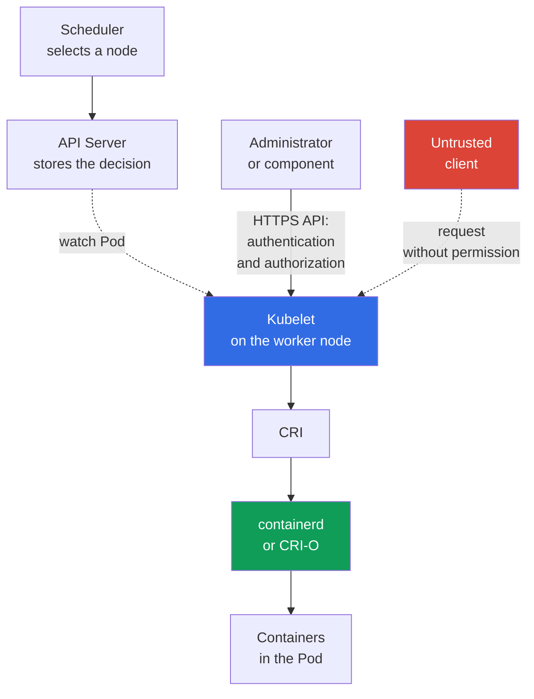

[Русская версия](ru.md) · [Versión en español](es.md) · [Version française](fr.md) · [Deutsche Version](de.md) · [ქართული ვერსია](ge.md) · [繁體中文版](tw.md) · [日本語版](jp.md)

# Chapter 08. Node Security: Kubelet, Container Runtime, KubeProxy

> **What comes next.** In the [previous chapter](../07/README.md), the control plane was covered as the cluster's management center. This chapter shifts attention to the worker node: this is where `kubelet` starts a `Pod`, the container runtime creates containers, and `kube-proxy` routes traffic to a `Service`. This is part of the KCSA domain **Kubernetes Cluster Component Security**, weighted at 22%.

## 08.1 Kubelet and its API

`kubelet` is the Kubernetes agent on every worker node. It does not receive a `Pod` through a push notification: kubelet itself opens a watch connection to the API Server (`GET .../pods?fieldSelector=spec.nodeName=<node>&watch=true`) and subscribes to changes for `Pod` objects whose `spec.nodeName` matches its node name. When `kube-scheduler` assigns a `Pod` to this node and the API Server stores the updated object in `etcd`, kubelet receives the event through the already-open watch, retrieves the `Pod` specification, and calls the container runtime through CRI to start it. For diagnostics and management, `kubelet` also provides its own HTTPS API, usually on port `10250`.

This API is useful to an administrator, but dangerous when protected incorrectly. It can be used to obtain information about the node's pods, perform diagnostic actions, and, depending on permissions, interact with containers. Access to the Kubelet API must not be a side effect of the client being on the cluster network.

Three concepts commonly occur in questions:

| Setting or mechanism | What it controls | Secure meaning |
|---|---|---|
| `--anonymous-auth` | Whether an unauthenticated client can call the Kubelet API | Disable anonymous access: `false` |
| authorization mode | Whether the permission of an already authenticated client for a specific action is checked | Use authorization checks, usually `Webhook`, rather than unconditional allow |
| `--read-only-port` | Legacy Kubelet HTTP port without full authentication and authorization | Disable it by setting `0` |

With `--anonymous-auth=true`, a client without credentials can access endpoints available to the anonymous user. Even if the responses seem harmless, metadata about pods, images, and the node helps an attacker. The principle is therefore simple: the Kubelet API is available only over a secure channel, only to known subjects, and only for required operations.

`Webhook` authorization makes kubelet delegate a request check through `SubjectAccessReview` to `kube-apiserver`; the decision is made by the authorizer chain configured on the API Server, often including RBAC, rather than by a local `AlwaysAllow`. Network reachability of kubelet `10250` should be restricted with a host firewall, cloud security groups / authorized-network controls and, if the specific CNI supports host/node policy, the corresponding CNI mechanism. Regular Kubernetes `NetworkPolicy` cannot be treated as universal protection for the kubelet host endpoint.

After hardening, it is useful to monitor whether the kubelet configuration has changed relative to the approved baseline. File-integrity/configuration monitoring can detect and log unexpected changes and provide post-event evidence of observed changes. The strength of that evidence depends on whether monitoring was continuously enabled, protected from modification, and retained tamper-resistant/centralized records; merely having FIM does not prove that tampering never occurred.

## 08.2 Container runtime, CRI, and sockets

The container runtime creates and manages containers on the node. Modern clusters often use `containerd` or CRI-O. Kubernetes communicates with them through the **Container Runtime Interface (CRI)**, so `kubelet` does not depend on the internal API of a particular runtime.

Communication usually takes place through a Unix domain socket. Example paths are `/run/containerd/containerd.sock` for `containerd` and `/var/run/crio/crio.sock` for CRI-O. The path depends on the distribution and configuration, but the risk is the same: a process that is allowed to call the runtime socket can manage the node's containers with very high privileges.

| Object | Role | Risk of excessive access |
|---|---|---|
| CRI | contract between `kubelet` and runtime | not an access boundary by itself |
| runtime socket | local runtime management interface | starting, stopping, and inspecting containers, possible node takeover |
| `containerd` / CRI-O | implementation of the container lifecycle | compromise of the process or its configuration affects all pods on the node |

Do not mount the runtime socket into an application `Pod` or give it to a CI job merely for convenient builds or debugging. Such a mount is comparable to handing over control of the host. Restrict permissions on the socket file, run only the necessary privileged system components, and control who can create `Pod` objects with `hostPath` or `privileged: true`.

Docker was historically a common runtime, but Kubernetes uses CRI, not the Docker API, as the standard interface. Therefore, in a question about modern interaction between `kubelet` and `containerd`, the correct term is CRI and its socket, not the Docker socket.

## 08.3 KubeProxy and the network attack surface

`kube-proxy` runs on nodes and configures kernel-level rules for routing traffic to the `Service` abstraction: it programs `iptables`, `nftables`, or IPVS so that packets to virtual `ClusterIP` and `NodePort` ports are redirected to suitable endpoint objects. On Linux, `iptables`, `nftables`, and IPVS modes are available. In the current Kubernetes v1.37 documentation, the default remains `iptables`; `nftables` (Linux kernel 5.13+) is recommended as the replacement for IPVS, which has been deprecated since v1.35. `kube-proxy` is not a userspace traffic proxy: it does not forward packets itself, but only configures netfilter/IPVS in the kernel, which then processes the traffic. It is also not an application encryption proxy and does not replace `NetworkPolicy`.

| Mechanism | What it does | What it does not do |
|---|---|---|
| `iptables` mode | creates packet redirection rules to endpoint objects | does not check application business authorization |
| `nftables` mode | creates `nftables` rules for `Service` redirection; suitable as a replacement for IPVS on supported Linux | does not replace network segmentation |
| IPVS mode | uses IP Virtual Server for `Service` load balancing; deprecated since Kubernetes v1.35 | does not replace network segmentation; `nftables` is the replacement, and `iptables` is considered when it is unavailable |
| `NetworkPolicy` | restricts permitted flows between pods and networks when supported by the CNI | does not build `Service` rules and is not replaced by `kube-proxy` |

Compromise of `kube-proxy`, its configuration, or the host lets an attacker observe and alter network processing on that node: disrupt availability, redirect some traffic, or bypass the expected path to a service. Protection starts not with selecting `iptables`, `nftables`, or IPVS mode, but with protecting the node itself: up-to-date OS, minimal administrator access, restricted component credentials, protected channels to the API Server, and monitoring for unusual changes to network rules. For Linux nodes that support `nftables`, it is selected instead of deprecated IPVS; the current Kubernetes v1.37 default nonetheless remains `iptables`. This does not remove the need for separate CNI enforcement of `NetworkPolicy`.

For KCSA, it is important to distinguish the roles. `kube-proxy` provides `Service` reachability; CNI connects pods to the network and can enforce `NetworkPolicy`; mTLS and a service mesh address the separate task of cryptographic identity and traffic encryption.

## 08.4 What node compromise means

A worker node is a strong trust boundary, but not absolute isolation between the pods scheduled on it. A user with root access to the node can interfere with the runtime, network rules, and local data. The practical outcome depends on cluster configuration, but the threat model must assume a serious incident.

An attacker who takes over a node can potentially obtain:

- control of containers and their processes through the runtime;
- access to the file systems and network traffic of pods scheduled on that node;
- service account tokens and secrets mounted into those pods;
- the ability to replace or observe `kubelet` and `kube-proxy` operation;
- a point for lateral movement with weak RBAC, overly broad tokens, or open network paths.

This does not mean automatic access to every cluster secret. For example, a secret that is not mounted into a pod on the compromised node does not have to be accessible merely because one node was taken over. However, a broadly privileged `ServiceAccount`, access to the API Server, or privileged pods can rapidly expand the impact.

Defense in depth reduces the blast radius: schedule sensitive workloads separately, use `Pod Security Standards`, least-privilege RBAC, `NetworkPolicy`, short-lived credentials, encryption, and reliable infrastructure boundaries. Node updates, auditing, and monitoring are also important: protection does not guarantee the absence of an incident, but it helps detect one and limit its consequences.

## 08.5 How this is applied in practice

The platform team treats a worker node as a small container-management server, rather than as a transparent part of Kubernetes. A typical approach looks like this:

1. Secure the Kubelet API: disable anonymous access and the read-only port, enable authorization checks, and permit port `10250` only from required sources.
2. Check permissions on `containerd` or CRI-O sockets and look for dangerous mounts in manifests. Application pods do not get access to the runtime socket.
3. Restrict creation of privileged pods, `hostPath`, `hostNetwork`, and other settings that connect a pod to the node. Combine RBAC, Pod Security Admission, and admission policies for this.
4. Minimize the consequences: separate sensitive workloads, limit their network permissions, and monitor for signs of node compromise and unexpected changes to network rules.

This is not a lab sequence of commands. Check the specific flags and paths in your distribution documentation and cluster configuration: managed Kubernetes may hide part of the control plane, but worker nodes and their boundaries still require attention.

## 08.6 Exam vocabulary / Mini-glossary

| Term | Meaning |
|---|---|
| `kubelet` | Kubernetes agent on a worker node that manages the pods assigned to it. |
| Kubelet API | Kubelet HTTPS interface for operations and diagnostics on a node. |
| CRI | Standard Kubernetes interface between `kubelet` and the container runtime. |
| container runtime | Component that creates and runs containers, such as `containerd` or CRI-O. |
| runtime socket | Unix socket through which a client manages the container runtime. |
| `kube-proxy` | Component that configures kernel rules (`iptables`, `nftables`, or IPVS) to route `Service` traffic on nodes; it is not itself a userspace traffic proxy, because the kernel performs the actual packet forwarding. |
| `iptables` | `kube-proxy` implementation mode for `Service` traffic redirection. |
| `nftables` | `kube-proxy` mode; recommended on supported Linux as a replacement for deprecated IPVS. |
| IPVS | `kube-proxy` `Service` load-balancing mode being deprecated since Kubernetes v1.35. |

## 08.7 Exam Essentials / Chapter summary

- `kubelet` manages pods on a worker node, and its API must require authentication and authorization.
- `--anonymous-auth=false` and a disabled read-only port remove simple paths to unauthenticated access to Kubelet.
- CRI connects Kubelet to `containerd` or CRI-O; access to the runtime socket is almost equivalent to privileged access to the node.
- `kube-proxy` implements `Service` routing through `iptables`, `nftables`, or IPVS. In Kubernetes v1.37, the default is `iptables`; `nftables` is recommended on supported Linux instead of IPVS, deprecated since v1.35. It does not replace `NetworkPolicy` and does not encrypt traffic.
- Taking over a node puts the pods scheduled on it, their mounted data, network processing, and potentially enables lateral movement at risk.

## 08.8 Do not confuse these, and how they appear on the exam

MCQs (multiple choice questions) usually test the mapping between a component and its function, as well as the safest option among several. Typical traps include:

- confusing Kubelet with the API Server: Kubelet manages pods on a specific node, whereas the API Server is the central API endpoint;
- considering the read-only port suitable for secure diagnostics: the lack of full access checks makes it an unnecessary risk;
- confusing a CRI socket with an ordinary configuration file: access to it provides a runtime management interface;
- attributing `NetworkPolicy`, encryption, or mTLS functions to `kube-proxy`, or considering IPVS the recommended mode for a new cluster;
- concluding that taking over one node automatically exposes every secret in the cluster without considering pod placement and credential permissions.

When selecting an answer, first identify the boundary: the Kubelet API, local runtime, `Service` network path, or pod credentials. Then assess which setting reduces access or the blast radius.

## 08.9 Self-assessment questions

### 1. Which Kubelet setting eliminates unauthenticated access specifically to its primary (HTTPS) API?

   - a. `--authorization-mode=AlwaysAllow`

   - b. `--anonymous-auth=false`

   - c. Enabling IPVS in `kube-proxy`

   - d. `--read-only-port=10255`

Answer and explanation

**Correct answer: b.** `--anonymous-auth=false` prevents anonymous requests to the primary kubelet API. This does not eliminate a separate risk: `--read-only-port` (option d) is a separate, optional legacy endpoint without any authentication or authorization; it must be disabled independently (`--read-only-port=0`), rather than considered closed through `--anonymous-auth`. `AlwaysAllow` does not check permissions (it is a risk for authorization, not authentication). IPVS mode belongs to `kube-proxy`, not the Kubelet API.

### 2. Why is mounting the `containerd` socket in a regular application `Pod` dangerous?

   - a. It gives the application access only to metadata of its own image layer and does not affect the runtime.
   - b. It exposes a privileged runtime API and can allow management of containers or other runtime objects on the node.
   - c. It is required by the CNI to enforce Kubernetes `NetworkPolicy` for namespace traffic.
   - d. It automatically enables mutual TLS authentication between all Pods on the node.

Answer and explanation

**Correct answer: b.** The runtime socket is an administrative interface for the container runtime. Giving it to a regular workload can dramatically expand the impact of a compromised container on the node. NetworkPolicy and workload mTLS solve different tasks.

### 3. What task is `kube-proxy` primarily responsible for?

   - a. Scanning images for vulnerabilities.

   - b. Creating containers through CRI.

   - c. Checking RBAC for requests to the API Server.

   - d. Routing `Service` traffic to appropriate endpoint objects.

Answer and explanation

**Correct answer: d.** `kube-proxy` implements the `Service` network abstraction through `iptables`, `nftables`, or IPVS. `nftables` has been stable since Kubernetes v1.33 and is recommended instead of IPVS, deprecated since v1.35. `NetworkPolicy` is enforced by a CNI that supports it, not by `kube-proxy`; CRI is used by Kubelet, RBAC is handled in the API Server chain, and image scanning belongs to the supply chain.

### 4. Which statement most accurately describes the consequences of taking over a worker node?

   - a. Compromise affects only kube-proxy rules and does not affect scheduled workloads.
   - b. Root on one worker automatically means reading every `Secret` object in all namespaces through the API.
   - c. An attacker can affect local Pods, the runtime, mounted data, and network processing, while the further scope depends on available credentials and permissions.
   - d. NetworkPolicy retains full trust in compromised host root and prevents access to workload data.

Answer and explanation

**Correct answer: c.** Taking over host root destroys trust in the local workload boundary, but further cluster-wide impact depends on scheduled data, tokens, RBAC, and other available paths. You cannot automatically assume either complete isolation or unconditional access to all cluster Secrets.

> **Where to next.** For practical protection of ingress paths and node-level surfaces, study CKS chapter 08: Secure Ingress with TLS and CKS chapter 14: minimizing the host OS footprint and runtime daemon security. In KCSA, continue with [chapter 09](../09/README.md) on `Pod`, network, storage, and client credential security.

[Table of contents](../README.md) · [Chapter 07](../07/README.md) · [Chapter 09](../09/README.md)
