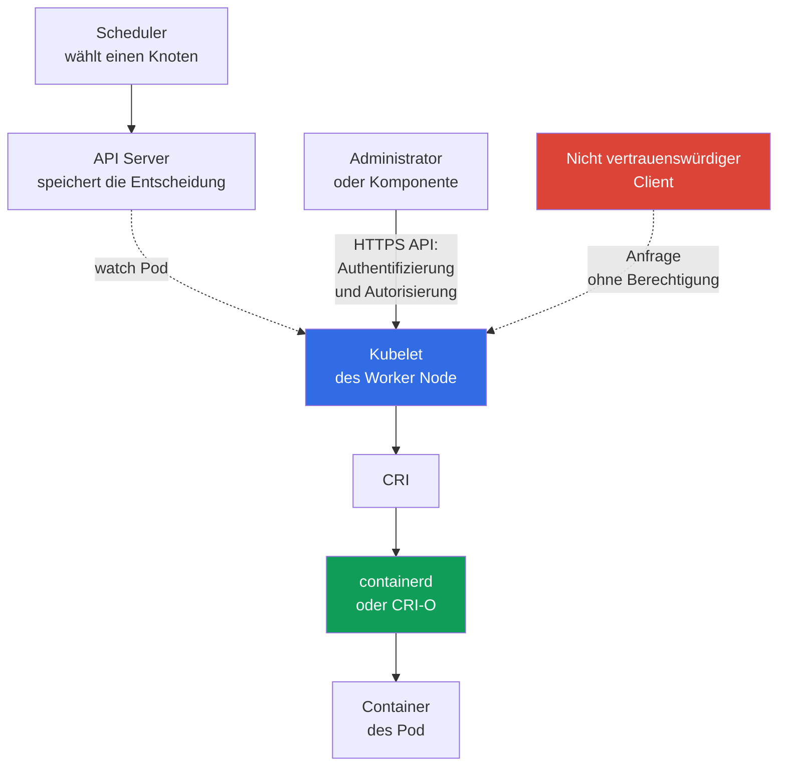

[Русская версия](ru.md) · [Eng version](README.md) · [Versión en español](es.md) · [Version française](fr.md) · [ქართული ვერსია](ge.md) · [繁體中文版](tw.md) · [日本語版](jp.md)

# Kapitel 08. Knotensicherheit: Kubelet, Container Runtime, KubeProxy

> **Was kommt als Nächstes.** Im [vorherigen Kapitel](../07/de.md) wurde die control plane als Steuerzentrum des Clusters behandelt. Dieses Kapitel richtet den Blick auf den Worker Node: Hier startet `kubelet` einen `Pod`, die container runtime erstellt Container und `kube-proxy` leitet Traffic zu einem `Service` weiter. Dies ist Teil der KCSA-Domäne **Kubernetes Cluster Component Security** mit einer Gewichtung von 22 %.

## 08.1 Kubelet und seine API

`kubelet` ist der Kubernetes-Agent auf jedem Worker Node. Er erhält `Pod` nicht per Push-Benachrichtigung: Kubelet selbst öffnet eine Watch-Verbindung zum API Server (`GET .../pods?fieldSelector=spec.nodeName=<Knoten>&watch=true`) und abonniert Änderungen an `Pod`, deren `spec.nodeName` mit dem Namen seines Knotens übereinstimmt. Wenn `kube-scheduler` einen `Pod` diesem Knoten zuweist und der API Server das aktualisierte Objekt in `etcd` speichert, erhält Kubelet das Ereignis über die bereits offene Watch, ruft die Beschreibung des `Pod` ab und wendet sich über CRI an die container runtime, um ihn zu starten. Für Diagnose und Verwaltung stellt `kubelet` außerdem eine eigene HTTPS API bereit, gewöhnlich auf Port `10250`.

Diese API ist für Administratoren nützlich, aber bei fehlerhaftem Schutz gefährlich. Über sie lassen sich Informationen über die Pods eines Knotens abrufen, Diagnoseaktionen ausführen und, abhängig von den Berechtigungen, mit Containern interagieren. Der Zugriff auf die Kubelet API darf keine Nebenwirkung davon sein, dass sich ein Client im Clusternetzwerk befindet.

Drei Konzepte kommen in Prüfungsfragen oft vor:

| Einstellung oder Mechanismus | Was sie bzw. er steuert | Sichere Bedeutung |
|---|---|---|
| `--anonymous-auth` | Ob ein nicht authentifizierter Client die Kubelet API aufrufen darf | Anonymen Zugriff deaktivieren: `false` |
| authorization mode | Ob die Berechtigung eines bereits authentifizierten Clients für eine konkrete Aktion geprüft wird | Berechtigungsprüfung nutzen, in der Regel `Webhook`, statt bedingungsloser Erlaubnis |
| `--read-only-port` | Älterer HTTP-Port des Kubelet ohne vollständige Authentifizierung und Autorisierung | Durch Setzen auf `0` deaktivieren |

Bei `--anonymous-auth=true` kann ein Client ohne Anmeldedaten auf Endpunkte zugreifen, die dem anonymen Benutzer zugänglich sind. Selbst wenn Antworten harmlos wirken, helfen Metadaten über Pods, Images und den Knoten einem Angreifer. Das Prinzip ist daher einfach: Die Kubelet API ist nur über einen geschützten Kanal, nur für bekannte Subjects und nur für notwendige Operationen verfügbar.

`Webhook` authorization veranlasst Kubelet, die Prüfung einer Anfrage mittels `SubjectAccessReview` an `kube-apiserver` zu delegieren. Die Entscheidung trifft die im API Server konfigurierte Kette von authorizers, oft einschließlich RBAC, statt ein lokales `AlwaysAllow`. Die Netzwerk-Erreichbarkeit von Kubelet `10250` sollte mit Host Firewall, Cloud Security Groups / Authorized-Network Controls und, falls das konkrete CNI Host/Node Policy unterstützt, dem entsprechenden CNI-Mechanismus eingeschränkt werden. Gewöhnliche Kubernetes `NetworkPolicy` kann nicht als universeller Schutz des Kubelet Host Endpoint gelten.

Nach dem Hardening ist es sinnvoll zu überwachen, ob sich die Kubelet-Konfiguration gegenüber einer genehmigten Baseline geändert hat. File-Integrity/Configuration Monitoring kann unerwartete Änderungen erkennen und protokollieren und Post-Event Evidence über beobachtete Änderungen liefern. Die Aussagekraft solcher Evidence hängt davon ab, ob das Monitoring fortlaufend aktiviert, vor Änderungen geschützt war und manipulationsresistente/zentralisierte Aufzeichnungen bewahrt hat. Das bloße Vorhandensein von FIM beweist nicht, dass nie eine Manipulation stattgefunden hat.

## 08.2 Container Runtime, CRI und Sockets

Die container runtime erstellt und verwaltet Container auf dem Knoten. In modernen Clustern werden oft `containerd` oder CRI-O eingesetzt. Kubernetes kommuniziert mit ihnen über das **Container Runtime Interface (CRI)**, sodass `kubelet` nicht vom internen API einer bestimmten runtime abhängt.

Die Verbindung erfolgt üblicherweise über einen Unix Domain Socket. Beispiele für Pfade sind `/run/containerd/containerd.sock` für `containerd` und `/var/run/crio/crio.sock` für CRI-O. Der Pfad hängt von Distribution und Konfiguration ab, das Risiko ist jedoch gleich: Ein Prozess mit dem Recht, auf den Runtime Socket zuzugreifen, kann Container des Knotens mit sehr hohen Berechtigungen verwalten.

| Objekt | Rolle | Risiko bei übermäßigem Zugriff |
|---|---|---|
| CRI | Vertrag zwischen `kubelet` und runtime | für sich genommen keine Zugriffsgrenze |
| runtime socket | Lokale Verwaltungsschnittstelle der runtime | Starten, Stoppen und Untersuchen von Containern, mögliche Übernahme des Knotens |
| `containerd` / CRI-O | Implementierung des Container-Lebenszyklus | Kompromittierung des Prozesses oder seiner Konfiguration betrifft alle Pods des Knotens |

Mounten Sie den Runtime Socket nicht in einen Anwendungs-`Pod` und geben Sie ihn nicht nur für bequemes Bauen oder Debugging an einen CI-Job weiter. Ein solcher Mount entspricht der Übergabe der Kontrolle über den Host. Beschränken Sie Berechtigungen für die Socket-Datei, führen Sie nur erforderliche privilegierte Systemkomponenten aus und kontrollieren Sie, wer `Pod` mit `hostPath` oder `privileged: true` erstellen kann.

Docker war historisch eine weit verbreitete runtime, Kubernetes verwendet jedoch CRI und nicht die Docker API als reguläre Schnittstelle. Daher lautet der korrekte Begriff bei einer Frage zur modernen Interaktion zwischen `kubelet` und `containerd` CRI und dessen Socket, nicht Docker Socket.

## 08.3 KubeProxy und die Angriffsfläche des Netzwerks

`kube-proxy` läuft auf Knoten und konfiguriert Regeln auf Kernel-Ebene für die Weiterleitung von Traffic zur `Service`-Abstraktion: Er programmiert `iptables`, `nftables` oder IPVS so, dass Pakete zur virtuellen `ClusterIP` und zu `NodePort`-Ports an passende Endpoints weitergeleitet werden. Unter Linux sind die Modi `iptables`, `nftables` und IPVS verfügbar. In der aktuellen Kubernetes-v1.37-Dokumentation bleibt `iptables` der Default; `nftables` (Linux Kernel 5.13+) wird als Ersatz für das seit v1.35 deprecated IPVS empfohlen. `kube-proxy` ist kein Traffic Proxy im Userspace: Er leitet Pakete nicht selbst weiter, sondern konfiguriert nur Netfilter/IPVS im Kernel, der den Traffic anschließend verarbeitet. Außerdem ist er kein verschlüsselnder Application Proxy und ersetzt keine `NetworkPolicy`.

| Mechanismus | Was er tut | Was er nicht tut |
|---|---|---|
| `iptables` mode | Erstellt Regeln zur Paketweiterleitung an Endpoints | Prüft keine Business-Autorisierung der Anwendung |
| `nftables` mode | Erstellt `nftables`-Regeln für die Weiterleitung an `Service`; geeignet als Ersatz für IPVS auf unterstütztem Linux | Ersetzt keine Netzwerksegmentierung |
| IPVS mode | Verwendet IP Virtual Server für `Service`-Load-Balancing; seit Kubernetes v1.35 deprecated | Ersetzt keine Netzwerksegmentierung; Ersatz ist `nftables`, und bei dessen Nichtverfügbarkeit wird `iptables` erwogen |
| `NetworkPolicy` | Beschränkt zulässige Flows zwischen Pods und Netzwerken bei CNI-Unterstützung | Erstellt keine `Service`-Regeln und wird nicht durch `kube-proxy` ersetzt |

Die Kompromittierung von `kube-proxy`, seiner Konfiguration oder des Hosts ermöglicht einem Angreifer, die Netzwerkverarbeitung dieses Knotens zu beobachten und zu verändern: Verfügbarkeit zu beeinträchtigen, Teile des Traffic umzuleiten oder den erwarteten Pfad zu einem Service zu umgehen. Der Schutz beginnt nicht mit der Wahl von `iptables`, `nftables` oder IPVS, sondern mit dem Schutz des Knotens selbst: aktuelle OS, minimaler Administratorzugriff, Beschränkung der Credentials der Komponente, geschützte Kanäle zum API Server und Beobachtung ungewöhnlicher Änderungen an Netzwerkregeln. Für Linux-Knoten mit Unterstützung für `nftables` wird es anstelle des deprecated IPVS gewählt; der aktuelle Kubernetes-v1.37-Default bleibt dabei `iptables`. Dies hebt das separate CNI-Enforcement für `NetworkPolicy` nicht auf.

Für KCSA ist es wichtig, die Rollen zu unterscheiden. `kube-proxy` stellt die Erreichbarkeit von `Service` bereit; CNI verbindet Pods mit dem Netzwerk und kann `NetworkPolicy` anwenden; mTLS und service mesh lösen die getrennte Aufgabe kryptografischer Identität und Verschlüsselung von Traffic.

## 08.4 Was die Kompromittierung eines Knotens bedeutet

Ein Worker Node ist eine starke Vertrauensgrenze, aber keine absolute Isolation zwischen den darauf platzierten Pods. Ein Benutzer mit Root-Zugriff auf den Knoten kann in runtime, Netzwerkregeln und lokale Daten eingreifen. Das praktische Ergebnis hängt von der Cluster-Konfiguration ab, doch das Bedrohungsmodell sollte von einem schwerwiegenden Incident ausgehen.

Ein Angreifer, der einen Knoten übernommen hat, erhält potenziell:

- Kontrolle über Container und ihre Prozesse mittels runtime;
- Zugriff auf Dateisysteme und Netzwerk-Traffic der auf diesem Knoten platzierten Pods;
- ServiceAccount Tokens und Secrets, die in diese Pods gemountet sind;
- die Möglichkeit, die Arbeit von `kubelet` und `kube-proxy` zu manipulieren oder zu beobachten;
- einen Ausgangspunkt für laterale Bewegung bei schwachem RBAC, zu weitreichenden Tokens oder offenen Netzwerkpfaden.

Das bedeutet nicht automatisch Zugriff auf alle Secrets des Clusters. Beispielsweise muss ein Secret, das nicht in einem Pod auf dem kompromittierten Knoten gemountet ist, nicht allein wegen der Übernahme eines Knotens verfügbar sein. Ein weitreichendes `ServiceAccount`, Zugriff auf den API Server oder privilegierte Pods können die Folgen jedoch schnell ausweiten.

Defense in depth verringert den Blast Radius: Platzieren Sie sensible Workloads getrennt, verwenden Sie `Pod Security Standards`, Least-Privilege RBAC, `NetworkPolicy`, kurzlebige Credentials, Verschlüsselung und verlässliche Infrastrukturgrenzen. Auch Node-Updates, Auditing und Monitoring sind wichtig: Schutz garantiert nicht das Ausbleiben eines Incidents, hilft aber, ihn zu bemerken und Folgen zu begrenzen.

## 08.5 Praktische Anwendung

Das Plattformteam betrachtet einen Worker Node als kleinen Server zur Verwaltung von Containern, nicht als transparenten Teil von Kubernetes. Ein typischer Ansatz sieht so aus:

1. Sie schützen die Kubelet API: Sie deaktivieren anonymous access und read-only port, aktivieren die Autorisierungsprüfung und erlauben Port `10250` nur für notwendige Quellen.
2. Sie überprüfen die Berechtigungen für Sockets von `containerd` oder CRI-O und suchen in Manifests nach gefährlichen Mounts. Anwendungs-Pods erhalten keinen Zugriff auf den Runtime Socket.
3. Sie beschränken die Erstellung privilegierter Pods, `hostPath`, `hostNetwork` und anderer Einstellungen, die einen Pod an den Knoten binden. Dafür kombinieren sie RBAC, Pod Security Admission und Admission Policies.
4. Sie minimieren die Folgen: Sie trennen sensible Workloads, begrenzen deren Netzwerkrechte und achten auf Anzeichen für Node-Kompromittierung und unerwartete Änderungen an Netzwerkregeln.

Dies ist keine Laborabfolge von Befehlen. Konkrete Flags und Pfade werden in der Dokumentation der Distribution und in der Konfiguration des eigenen Clusters geprüft: Managed Kubernetes kann Teile der control plane verbergen, aber Worker Nodes und ihre Grenzen erfordern weiterhin Aufmerksamkeit.

## 08.6 Exam vocabulary / Mini-Glossar

| Begriff | Bedeutung |
|---|---|
| `kubelet` | Kubernetes-Agent auf einem Worker Node, der ihm zugewiesene Pods verwaltet. |
| Kubelet API | HTTPS-Schnittstelle von Kubelet für Operationen und Diagnose auf dem Knoten. |
| CRI | Kubernetes-Standardschnittstelle zwischen `kubelet` und container runtime. |
| container runtime | Komponente, die Container erstellt und startet, zum Beispiel `containerd` oder CRI-O. |
| runtime socket | Unix Socket, über den ein Client die container runtime verwaltet. |
| `kube-proxy` | Komponente, die Kernel-Regeln (`iptables`, `nftables` oder IPVS) für die Weiterleitung von Traffic an `Service` auf Knoten konfiguriert; sie fungiert selbst nicht als Traffic Proxy im Userspace, die tatsächliche Paketweiterleitung übernimmt der Kernel. |
| `iptables` | Implementierungsmodus für die Weiterleitung von `Service`-Traffic in `kube-proxy`. |
| `nftables` | `kube-proxy`-Modus; auf unterstütztem Linux als Ersatz für deprecated IPVS empfohlen. |
| IPVS | Seit Kubernetes v1.35 auslaufender Modus für `Service`-Load-Balancing in `kube-proxy`. |

## 08.7 Exam Essentials / Zusammenfassung des Kapitels

- `kubelet` verwaltet Pods auf dem Worker Node, und seine API muss Authentifizierung und Autorisierung verlangen.
- `--anonymous-auth=false` und ein deaktivierter read-only port beseitigen einfache Wege für nicht authentifizierten Zugriff auf Kubelet.
- CRI verbindet Kubelet mit `containerd` oder CRI-O; Zugriff auf den Runtime Socket entspricht nahezu privilegiertem Zugriff auf den Knoten.
- `kube-proxy` implementiert `Service`-Weiterleitung über `iptables`, `nftables` oder IPVS. In Kubernetes v1.37 ist `iptables` der Default; `nftables` wird auf unterstütztem Linux anstelle des seit v1.35 deprecated IPVS empfohlen. Es ersetzt keine `NetworkPolicy` und verschlüsselt keinen Traffic.
- Die Übernahme eines Knotens gefährdet die darauf platzierten Pods, deren gemountete Daten und Netzwerkverarbeitung und kann den Beginn lateraler Bewegung darstellen.

## 08.8 Nicht verwechseln und Prüfungsbezug

In MCQ (multiple choice question, Frage mit Antwortauswahl) wird üblicherweise die Zuordnung einer Komponente zu ihrer Funktion sowie die sicherste Option aus mehreren geprüft. Typische Fallen sind:

- Kubelet mit dem API Server zu verwechseln: Kubelet verwaltet Pods eines konkreten Knotens, der API Server ist der zentrale API-Punkt;
- anzunehmen, dass sich der read-only port für sichere Diagnose eignet: Das Fehlen einer vollständigen Zugriffsprüfung macht ihn zu einem unnötigen Risiko;
- CRI socket mit einer gewöhnlichen Konfigurationsdatei zu verwechseln: Der Zugriff darauf bietet eine Verwaltungsschnittstelle für die runtime;
- `kube-proxy` Funktionen von `NetworkPolicy`, Verschlüsselung oder mTLS zuzuschreiben oder IPVS für einen neuen Cluster als empfohlenen Modus zu betrachten;
- zu folgern, dass die Übernahme eines Knotens automatisch alle Secrets des gesamten Clusters offenlegt, ohne Pod-Platzierung und Berechtigungen der Credentials zu berücksichtigen.

Bestimmen Sie bei der Antwortwahl zuerst die Grenze: Kubelet API, lokale runtime, Netzwerkpfad von `Service` oder Credentials eines Pod. Bewerten Sie anschließend, welche Einstellung Zugriff oder Blast Radius verringert.

## 08.9 Fragen zur Selbstkontrolle

### 1. Welche Kubelet-Einstellung beseitigt nicht authentifizierten Zugriff speziell auf seine primäre (HTTPS) API?

   - a. `--authorization-mode=AlwaysAllow`

   - b. `--anonymous-auth=false`

   - c. Aktivierung von IPVS in `kube-proxy`

   - d. `--read-only-port=10255`

Antwort und Erklärung

**Richtige Antwort: b.** `--anonymous-auth=false` verbietet anonyme Anfragen an die primäre Kubelet API. Dies beseitigt nicht das separate Risiko: `--read-only-port` (Option d) ist ein eigenständiger optionaler Legacy Endpoint ohne jegliche Authentifizierung oder Autorisierung. Er muss separat deaktiviert werden (`--read-only-port=0`) und gilt nicht durch `--anonymous-auth` als geschlossen. `AlwaysAllow` prüft keine Berechtigungen (dies ist ein Risiko für authorization, nicht für authentication). Der IPVS-Modus gehört zu `kube-proxy`, nicht zur Kubelet API.

### 2. Warum ist der Mount des `containerd` Socket in einen normalen Anwendungs-`Pod` gefährlich?

   - a. Er gibt der Anwendung nur Zugriff auf Metadaten ihres eigenen Image Layer und beeinflusst die runtime nicht.
   - b. Er öffnet eine privilegierte Runtime API und kann die Verwaltung von Containern oder anderen Runtime-Objekten des Knotens ermöglichen.
   - c. Er wird vom CNI benötigt, um Kubernetes `NetworkPolicy` auf Namespace-Traffic anzuwenden.
   - d. Er aktiviert automatisch gegenseitige TLS-Authentifizierung zwischen allen Pods auf dem Knoten.

Antwort und Erklärung

**Richtige Antwort: b.** Der Runtime Socket ist eine administrative Schnittstelle der container runtime. Ihn einem gewöhnlichen Workload bereitzustellen, kann die Auswirkungen eines kompromittierten Containers auf den Knoten drastisch vergrößern. NetworkPolicy und Workload mTLS lösen andere Aufgaben.

### 3. Für welche Aufgabe ist `kube-proxy` primär verantwortlich?

   - a. Prüfung von Images auf Schwachstellen.

   - b. Erstellung von Containern über CRI.

   - c. Prüfung von RBAC für Anfragen an den API Server.

   - d. Weiterleitung von `Service`-Traffic an passende Endpoints.

Antwort und Erklärung

**Richtige Antwort: d.** `kube-proxy` implementiert die Netzwerkabstraktion `Service` über `iptables`, `nftables` oder IPVS. `nftables` ist seit Kubernetes v1.33 stable und wird anstelle des seit v1.35 deprecated IPVS empfohlen. `NetworkPolicy` wird von einem sie unterstützenden CNI durchgesetzt, nicht von `kube-proxy`; CRI nutzt Kubelet, RBAC wird in der API-Server-Kette verarbeitet und Image Scanning gehört zur supply chain.

### 4. Welche Aussage beschreibt die Folgen der Übernahme eines Worker Node am genauesten?

   - a. Die Kompromittierung betrifft nur kube-proxy rules und beeinflusst die platzierten Workloads nicht.
   - b. Root auf einem Worker bedeutet automatisch, dass jedes `Secret`-Objekt aller Namespaces über die API gelesen werden kann.
   - c. Ein Angreifer kann lokale Pods, runtime, gemountete Daten und Netzwerkverarbeitung beeinflussen; die weitere Auswirkung hängt von verfügbaren Credentials und Permissions ab.
   - d. NetworkPolicy bewahrt vollständiges Vertrauen in kompromittiertes Host Root und schließt Zugriff auf Workload Data aus.

Antwort und Erklärung

**Richtige Antwort: c.** Die Übernahme von Host Root zerstört das Vertrauen in die lokale Workload Boundary, doch die weitere clusterweite Auswirkung hängt von platzierten Daten, Tokens, RBAC und anderen verfügbaren Wegen ab. Weder vollständige Isolation noch bedingungsloser Zugriff auf alle Secrets des Clusters darf automatisch angenommen werden.

> **Wohin als Nächstes.** Für den praktischen Schutz eingehender Pfade und Node-Oberflächen lesen Sie Kapitel 08 CKS: Secure Ingress mit TLS sowie Kapitel 14 CKS: Minimierung des Footprint des Host OS und Sicherheit des Runtime-Daemons. Setzen Sie in KCSA mit [Kapitel 09](../09/de.md) über die Sicherheit von `Pod`, Netzwerk, Storage und Client Credentials fort.

[Inhaltsverzeichnis](../README_DE.md) · [Kapitel 07](../07/de.md) · [Kapitel 09](../09/de.md)
