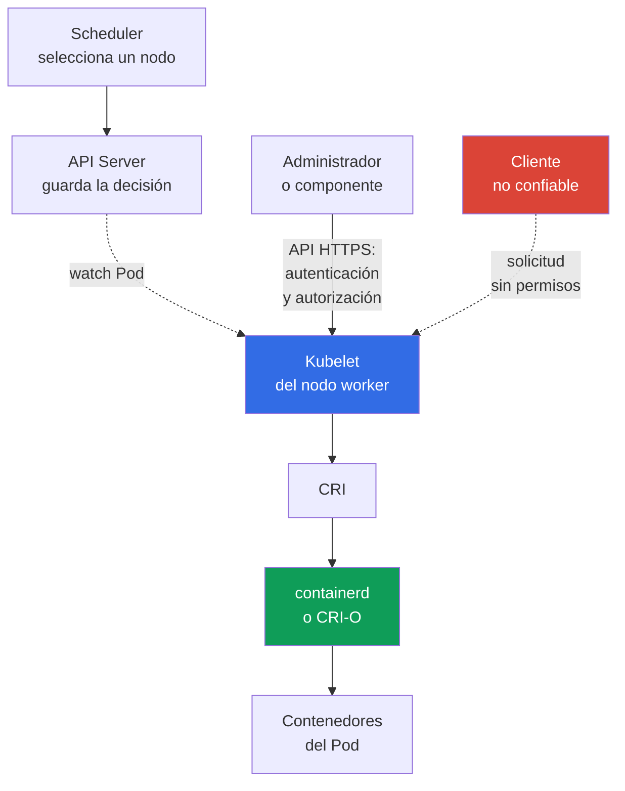

[Русская версия](ru.md) · [Eng version](README.md) · [Version française](fr.md) · [Deutsche Version](de.md) · [ქართული ვერსია](ge.md) · [繁體中文版](tw.md) · [日本語版](jp.md)

# Capítulo 08. Seguridad del nodo: Kubelet, Container Runtime, KubeProxy

> **Qué sigue.** En el [capítulo anterior](../07/es.md), el control plane se examinó como el centro de gestión del clúster. Este capítulo centra la atención en el nodo worker: aquí `kubelet` inicia los `Pod`, el container runtime crea contenedores y `kube-proxy` dirige el tráfico a `Service`. Esto forma parte del dominio KCSA **Kubernetes Cluster Component Security**, con un peso del 22%.

## 08.1 Kubelet y su API

`kubelet` es el agente de Kubernetes en cada nodo worker. No recibe los `Pod` mediante una notificación push: kubelet abre por sí mismo una conexión watch al API Server (`GET .../pods?fieldSelector=spec.nodeName=<nodo>&watch=true`) y se suscribe a los cambios de los `Pod` cuyo `spec.nodeName` coincide con el nombre de su nodo. Cuando `kube-scheduler` asigna un `Pod` a ese nodo y el API Server guarda el objeto actualizado en `etcd`, kubelet recibe el evento mediante el watch ya abierto, obtiene la descripción del `Pod` y se comunica con el container runtime mediante CRI para iniciarlo. Para diagnóstico y gestión, `kubelet` también expone su propia API HTTPS, normalmente en el puerto `10250`.

Esta API es útil para el administrador, pero peligrosa si no está correctamente protegida. A través de ella se puede obtener información sobre los pods del nodo, realizar acciones de diagnóstico y, según los permisos, interactuar con los contenedores. El acceso a la API de Kubelet no debe ser una consecuencia incidental de que el cliente se encuentre en la red del clúster.

Tres conceptos aparecen con frecuencia en las preguntas:

| Configuración o mecanismo | Qué controla | Significado seguro |
|---|---|---|
| `--anonymous-auth` | Si un cliente no autenticado puede acceder a la API de Kubelet | Deshabilitar el acceso anónimo: `false` |
| authorization mode | Si se verifica el derecho de un cliente ya autenticado para una acción concreta | Usar verificación de permisos, normalmente `Webhook`, y no una autorización incondicional |
| `--read-only-port` | Puerto HTTP antiguo de Kubelet sin autenticación y autorización completas | Deshabilitarlo estableciendo `0` |

Con `--anonymous-auth=true`, un cliente sin credenciales puede acceder a los endpoints disponibles para el usuario anónimo. Aunque las respuestas parezcan inofensivas, los metadatos sobre pods, imágenes y el nodo ayudan a un atacante. Por tanto, el principio es simple: la API de Kubelet solo está disponible por un canal protegido, solo para sujetos conocidos y solo para las operaciones necesarias.

La autorización `Webhook` obliga a kubelet a delegar la verificación de la solicitud mediante `SubjectAccessReview` en `kube-apiserver`; la decisión la toma la cadena de authorizers configurada en el API Server, a menudo incluida RBAC, y no `AlwaysAllow` local. La accesibilidad de red de kubelet en `10250` debe restringirse mediante host firewall, cloud security groups / authorized-network controls y, si el CNI concreto admite host/node policy, mediante el mecanismo CNI correspondiente. No se debe considerar una `NetworkPolicy` normal de Kubernetes como protección universal del endpoint host de kubelet.

Después del hardening, es útil controlar si la configuración de kubelet ha cambiado respecto al baseline aprobado. File-integrity/configuration monitoring puede detectar y registrar cambios inesperados, y proporcionar post-event evidence de los cambios observados. La solidez de tal evidence depende de si el monitoring estuvo habilitado de forma continua, protegido contra modificaciones y si conservó tamper-resistant/centralized records; la mera existencia de FIM no demuestra que nunca se hayan producido alteraciones.

## 08.2 Container runtime, CRI y sockets

El container runtime crea y gestiona contenedores en el nodo. En los clústeres modernos se usan con frecuencia `containerd` o CRI-O. Kubernetes se comunica con ellos mediante la **Container Runtime Interface (CRI)**, por lo que `kubelet` no depende de la API interna de un runtime concreto.

La comunicación normalmente se realiza a través de un Unix domain socket. Algunos ejemplos de rutas son `/run/containerd/containerd.sock` para `containerd` y `/var/run/crio/crio.sock` para CRI-O. La ruta depende de la distribución y la configuración, pero el riesgo es el mismo: un proceso que tiene permiso para acceder al socket del runtime puede gestionar los contenedores del nodo con privilegios muy elevados.

| Objeto | Rol | Riesgo con acceso excesivo |
|---|---|---|
| CRI | contrato entre `kubelet` y runtime | por sí mismo no es una frontera de acceso |
| runtime socket | interfaz local de gestión del runtime | inicio, detención e inspección de contenedores, posible toma de control del nodo |
| `containerd` / CRI-O | implementación del ciclo de vida de los contenedores | comprometer el proceso o su configuración afecta a todos los pods del nodo |

No monte el socket del runtime en un `Pod` de aplicación ni se lo conceda a una tarea de CI solo por comodidad durante la compilación o la depuración. Tal mount es comparable a entregar el control del host. Restrinja los permisos del archivo de socket, ejecute únicamente los componentes de sistema privilegiados necesarios y controle quién puede crear `Pod` con `hostPath` o `privileged: true`.

Docker fue históricamente un runtime extendido, pero Kubernetes utiliza CRI, no Docker API, como interfaz estándar. Por tanto, en una pregunta sobre la interacción moderna entre `kubelet` y `containerd`, el término correcto es CRI y su socket, no Docker socket.

## 08.3 KubeProxy y la superficie de ataque de red

`kube-proxy` se ejecuta en los nodos y configura reglas de nivel de kernel para enrutar el tráfico a la abstracción `Service`: programa `iptables`, `nftables` o IPVS para que los paquetes dirigidos al `ClusterIP` virtual y a los puertos `NodePort` se redirijan al endpoint adecuado. En Linux están disponibles los modos `iptables`, `nftables` e IPVS. En la documentación actual de Kubernetes v1.37, el valor default sigue siendo `iptables`; `nftables` (Linux kernel 5.13+) se recomienda como reemplazo de IPVS, deprecated desde v1.35. `kube-proxy` no es un traffic proxy en userspace: no reenvía paquetes por sí mismo, sino que solo configura netfilter/IPVS en el kernel, que posteriormente procesa el tráfico. Tampoco es un proxy de aplicaciones que cifra el tráfico ni reemplaza a `NetworkPolicy`.

| Mecanismo | Qué hace | Qué no hace |
|---|---|---|
| modo `iptables` | crea reglas para redirigir paquetes al endpoint | no verifica la autorización de negocio de la aplicación |
| modo `nftables` | crea reglas `nftables` para redirigir `Service`; es adecuado como reemplazo de IPVS en Linux compatible | no reemplaza la segmentación de red |
| modo IPVS | usa IP Virtual Server para el balanceo de `Service`; deprecated desde Kubernetes v1.35 | no reemplaza la segmentación de red; `nftables` es su sustituto y, si no está disponible, se considera `iptables` |
| `NetworkPolicy` | limita los flujos permitidos entre pods y redes cuando el CNI la admite | no crea reglas de `Service` ni es reemplazada por `kube-proxy` |

Comprometer `kube-proxy`, su configuración o el host permite a un atacante observar y modificar el procesamiento de red de ese nodo: interrumpir la disponibilidad, redirigir parte del tráfico o evitar la ruta esperada hacia el servicio. La protección no comienza con la elección del modo `iptables`, `nftables` o IPVS, sino con la protección del propio nodo: SO actualizado, acceso de administrador mínimo, restricción de las credenciales del componente, canales protegidos hacia el API Server y supervisión de cambios inusuales en las reglas de red. Para nodos Linux con soporte de `nftables`, se elige en lugar de IPVS, deprecated; sin embargo, el default actual de Kubernetes v1.37 sigue siendo `iptables`. Esto no elimina la necesidad de CNI-enforcement independiente para `NetworkPolicy`.

Para KCSA es importante distinguir los roles. `kube-proxy` proporciona la accesibilidad de `Service`; CNI conecta los pods a la red y puede aplicar `NetworkPolicy`; mTLS y service mesh resuelven la tarea independiente de identificación criptográfica y cifrado del tráfico.

## 08.4 Qué significa comprometer un nodo

Un nodo worker es una fuerte frontera de confianza, pero no un aislamiento absoluto entre los pods alojados en él. Un usuario con acceso root al nodo puede intervenir en el runtime, las reglas de red y los datos locales. El resultado práctico depende de la configuración del clúster, pero el modelo de amenazas debe partir de un incidente grave.

Un atacante que toma control de un nodo obtiene potencialmente:

- control de los contenedores y sus procesos mediante el runtime;
- acceso a los sistemas de archivos y al tráfico de red de los pods alojados en ese nodo;
- service account tokens y secretos montados en esos pods;
- capacidad de sustituir u observar el funcionamiento de `kubelet` y `kube-proxy`;
- un punto para el movimiento lateral si existen RBAC débiles, tokens demasiado amplios o rutas de red abiertas.

Esto no implica acceso automático a todos los secretos del clúster. Por ejemplo, un secreto no montado en un pod de un nodo comprometido no tiene por qué estar disponible únicamente debido a la toma de un nodo. Pero un `ServiceAccount` amplio, el acceso al API Server o los pods privilegiados pueden ampliar rápidamente las consecuencias.

Defense in depth reduce el radio de impacto: aloje las cargas de trabajo sensibles por separado, use `Pod Security Standards`, RBAC de mínimo privilegio, `NetworkPolicy`, credenciales de corta duración, cifrado y fronteras de infraestructura sólidas. La actualización de nodos, la auditoría y el monitoreo también son importantes: la protección no garantiza la ausencia de incidentes, pero ayuda a detectarlos y limitar sus consecuencias.

## 08.5 Cómo se aplica en la práctica

El equipo de plataforma considera un nodo worker como un pequeño servidor de gestión de contenedores, no como una parte transparente de Kubernetes. Un enfoque típico es el siguiente:

1. Protegen la API de Kubelet: deshabilitan el acceso anónimo y el read-only port, habilitan la comprobación de autorización y permiten el puerto `10250` solo desde los orígenes necesarios.
2. Comprueban los permisos de los sockets de `containerd` o CRI-O y buscan mounts peligrosos en los manifiestos. Los pods de aplicación no obtienen acceso al runtime socket.
3. Restringen la creación de pods privilegiados, `hostPath`, `hostNetwork` y otras configuraciones que vinculan el pod con el nodo. Para ello combinan RBAC, Pod Security Admission y admission policies.
4. Minimizan las consecuencias: separan las cargas de trabajo sensibles, restringen sus permisos de red y vigilan indicios de compromiso del nodo y cambios inesperados en las reglas de red.

Esta no es una secuencia de comandos de laboratorio. Los flags y rutas concretos se comprueban en la documentación de la distribución y en la configuración del propio clúster: managed Kubernetes puede ocultar parte del control plane, pero los nodos worker y sus fronteras aún requieren atención.

## 08.6 Exam vocabulary / Mini glosario

| Término | Significado |
|---|---|
| `kubelet` | Agente de Kubernetes en el nodo worker que gestiona los pods asignados a él. |
| Kubelet API | Interfaz HTTPS de Kubelet para operaciones y diagnóstico en el nodo. |
| CRI | Interfaz estándar de Kubernetes entre `kubelet` y container runtime. |
| container runtime | Componente que crea e inicia contenedores, por ejemplo `containerd` o CRI-O. |
| runtime socket | Socket Unix mediante el cual un cliente gestiona el container runtime. |
| `kube-proxy` | Componente que configura reglas de kernel (`iptables`, `nftables` o IPVS) para enrutar el tráfico a `Service` en los nodos; no actúa por sí mismo como traffic proxy en userspace, el kernel realiza el reenvío real de paquetes. |
| `iptables` | Modo de implementación del redireccionamiento de tráfico `Service` en `kube-proxy`. |
| `nftables` | Modo de `kube-proxy`; en Linux compatible se recomienda como reemplazo de IPVS, deprecated. |
| IPVS | Modo de balanceo de `Service` en `kube-proxy` que queda obsoleto desde Kubernetes v1.35. |

## 08.7 Exam Essentials / Resumen del capítulo

- `kubelet` gestiona los pods en el nodo worker y su API debe requerir autenticación y autorización.
- `--anonymous-auth=false` y un read-only port deshabilitado eliminan vías simples de acceso no autenticado a Kubelet.
- CRI conecta Kubelet con `containerd` o CRI-O; acceder al runtime socket casi equivale a acceso privilegiado al nodo.
- `kube-proxy` implementa el enrutamiento de `Service` mediante `iptables`, `nftables` o IPVS. En Kubernetes v1.37 el default es `iptables`; `nftables` se recomienda en Linux compatible en lugar de IPVS, deprecated desde v1.35. No reemplaza a `NetworkPolicy` ni cifra el tráfico.
- La toma de un nodo pone en riesgo los pods alojados en él, sus datos montados, el procesamiento de red y puede ser el inicio de movimiento lateral.

## 08.8 No confundir y cómo aparece en el examen

En una MCQ (multiple choice question, pregunta de opción múltiple) normalmente se comprueba la correspondencia entre un componente y su función, así como la opción más segura entre varias. Trampas típicas:

- confundir Kubelet con API Server: Kubelet gestiona los pods de un nodo concreto, API Server es el punto central de la API;
- pensar que el read-only port sirve para diagnóstico seguro: la falta de comprobación completa de acceso lo convierte en un riesgo innecesario;
- confundir un CRI socket con un archivo de configuración normal: acceder a él proporciona una interfaz de gestión del runtime;
- atribuir a `kube-proxy` funciones de `NetworkPolicy`, cifrado o mTLS, o considerar IPVS el modo recomendado para un clúster nuevo;
- concluir que la toma de un nodo abre automáticamente todos los secretos de todo el clúster, sin considerar la ubicación de los pods y los permisos de las credenciales.

Al elegir una respuesta, primero determine la frontera: API de Kubelet, runtime local, ruta de red de `Service` o credenciales del pod. Después evalúe qué configuración reduce el acceso o el radio de impacto.

## 08.9 Preguntas de autoevaluación

### 1. ¿Qué configuración de Kubelet elimina el acceso no autenticado específicamente a su API principal (HTTPS)?

   - a. `--authorization-mode=AlwaysAllow`

   - b. `--anonymous-auth=false`

   - c. Habilitar IPVS en `kube-proxy`

   - d. `--read-only-port=10255`

Respuesta y explicación

**Respuesta correcta: b.** `--anonymous-auth=false` prohíbe las solicitudes anónimas a la API principal de kubelet. Esto no elimina un riesgo independiente: `--read-only-port` (opción d) es un legacy endpoint separado y opcional sin autenticación ni autorización de ningún tipo; debe deshabilitarse por separado (`--read-only-port=0`), no considerarse cerrado mediante `--anonymous-auth`. `AlwaysAllow` no comprueba permisos (es un riesgo para authorization, no para authentication). El modo IPVS corresponde a `kube-proxy`, no a la API de Kubelet.

### 2. ¿Por qué es peligroso montar el socket de `containerd` en un `Pod` de aplicación normal?

   - a. Proporciona a la aplicación acceso solo a los metadata de su propio image layer y no afecta al runtime.
   - b. Abre una API de runtime privilegiada y puede permitir gestionar contenedores u otros objetos de runtime del nodo.
   - c. Es necesario para que CNI aplique Kubernetes `NetworkPolicy` al tráfico del namespace.
   - d. Habilita automáticamente autenticación TLS mutua entre todos los Pods del nodo.

Respuesta y explicación

**Respuesta correcta: b.** El runtime socket es una interfaz administrativa del container runtime. Concederlo a un workload ordinario puede ampliar drásticamente el impacto de un contenedor comprometido sobre el nodo. NetworkPolicy y workload mTLS resuelven tareas distintas.

### 3. ¿De qué tarea es responsable principalmente `kube-proxy`?

   - a. Comprobar las imágenes en busca de vulnerabilidades.

   - b. Crear contenedores mediante CRI.

   - c. Comprobar RBAC para solicitudes al API Server.

   - d. Dirigir el tráfico de `Service` al endpoint adecuado.

Respuesta y explicación

**Respuesta correcta: d.** `kube-proxy` implementa la abstracción de red `Service` mediante `iptables`, `nftables` o IPVS. `nftables` es stable desde Kubernetes v1.33 y se recomienda en lugar de IPVS, deprecated desde v1.35. La `NetworkPolicy` la aplica el CNI que la admite, no `kube-proxy`; Kubelet utiliza CRI, RBAC se procesa en la cadena de API Server y el escaneo de imágenes pertenece a la supply chain.

### 4. ¿Qué afirmación describe con mayor precisión las consecuencias de tomar un nodo worker?

   - a. El compromiso afecta solo a las reglas de kube-proxy y no influye en los workload alojados.
   - b. Root en un worker significa automáticamente leer cualquier objeto `Secret` de todos los namespace mediante la API.
   - c. Un atacante puede afectar a los Pods locales, el runtime, mounted data y el procesamiento de red, y el alcance posterior depende de los credentials y permissions disponibles.
   - d. NetworkPolicy mantiene una confianza completa en host root comprometido y excluye el acceso a los workload data.

Respuesta y explicación

**Respuesta correcta: c.** Tomar host root destruye la confianza en la frontera local de workload, pero el impacto posterior en todo el clúster depende de los datos alojados, tokens, RBAC y otras rutas disponibles. No se debe asumir automáticamente ni aislamiento completo ni acceso incondicional a todos los Secrets del clúster.

> **Adónde seguir.** Para la protección práctica de las rutas de entrada y las superficies de los nodos, estudie el capítulo 08 de CKS: Secure Ingress con TLS y el capítulo 14 de CKS: minimización del footprint del SO host y seguridad del daemon runtime. En KCSA, continúe con el [capítulo 09](../09/es.md) sobre la seguridad de `Pod`, red, storage y credenciales de clientes.

[Índice](../README_ES.md) · [Capítulo 07](../07/es.md) · [Capítulo 09](../09/es.md)
