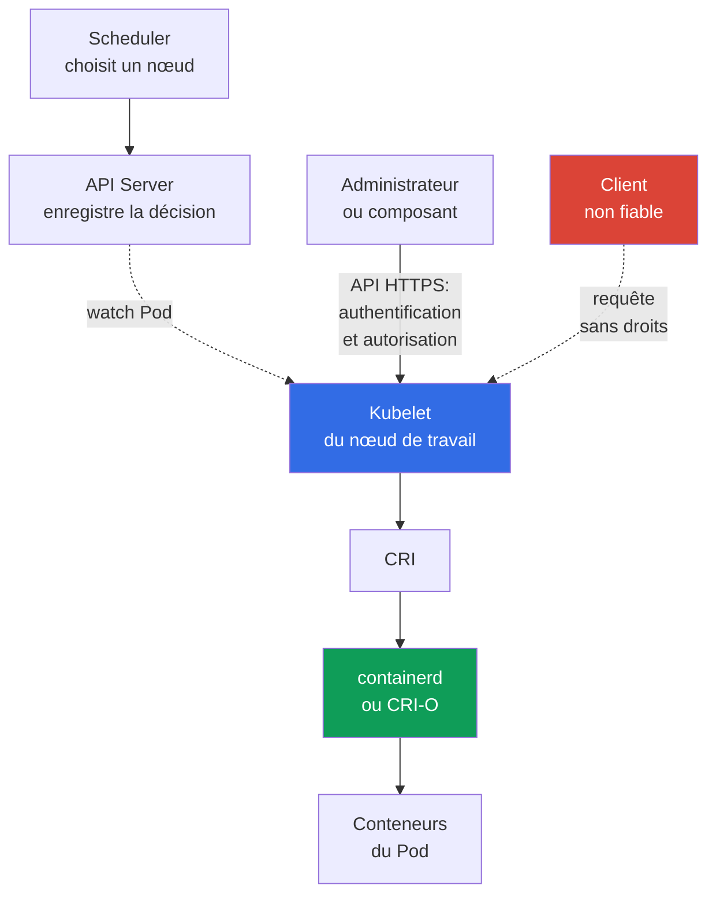

[Русская версия](ru.md) · [Eng version](README.md) · [Versión en español](es.md) · [Deutsche Version](de.md) · [ქართული ვერსია](ge.md) · [繁體中文版](tw.md) · [日本語版](jp.md)

# Chapitre 08. Sécurité des nœuds : Kubelet, Container Runtime, KubeProxy

> **La suite.** Dans le [chapitre précédent](../07/fr.md), le control plane a été étudié comme centre de contrôle du cluster. Ce chapitre déplace l'attention vers le nœud de travail : c'est là que `kubelet` démarre les `Pod`, que le container runtime crée les conteneurs et que `kube-proxy` dirige le trafic vers les `Service`. Cela fait partie du domaine KCSA **Kubernetes Cluster Component Security**, dont le poids est de 22 %.

## 08.1 Kubelet et son API

`kubelet` est l'agent Kubernetes présent sur chaque nœud de travail. Il ne reçoit pas les `Pod` par notification push : kubelet ouvre lui-même une connexion watch vers l'API Server (`GET .../pods?fieldSelector=spec.nodeName=<nœud>&watch=true`) et s'abonne aux modifications des `Pod` dont `spec.nodeName` correspond au nom de son nœud. Lorsque `kube-scheduler` affecte un `Pod` à ce nœud et que l'API Server enregistre l'objet mis à jour dans `etcd`, kubelet reçoit l'événement par le watch déjà ouvert, récupère la description du `Pod` et contacte le container runtime via CRI pour le démarrer. Pour le diagnostic et l'administration, `kubelet` fournit également sa propre API HTTPS, généralement sur le port `10250`.

Cette API est utile à l'administrateur, mais dangereuse si elle est mal protégée. Elle permet d'obtenir des informations sur les pods du nœud, d'exécuter des actions de diagnostic et, selon les autorisations, d'interagir avec les conteneurs. L'accès à l'API Kubelet ne doit pas être une conséquence indirecte de la présence du client sur le réseau du cluster.

Trois notions reviennent souvent dans les questions :

| Paramètre ou mécanisme | Ce qu'il contrôle | Signification sûre |
|---|---|---|
| `--anonymous-auth` | Si un client non authentifié peut appeler l'API Kubelet | Désactiver l'accès anonyme : `false` |
| authorization mode | Si le droit d'un client déjà authentifié à réaliser une action précise est vérifié | Utiliser une vérification des autorisations, habituellement `Webhook`, plutôt qu'une autorisation inconditionnelle |
| `--read-only-port` | Ancien port HTTP de Kubelet sans authentification ni autorisation complètes | Désactiver en définissant `0` |

Avec `--anonymous-auth=true`, un client sans identifiants peut accéder aux endpoints disponibles pour l'utilisateur anonyme. Même si les réponses semblent inoffensives, les métadonnées sur les pods, les images et le nœud aident un attaquant. Le principe est donc simple : l'API Kubelet est accessible uniquement par un canal protégé, seulement aux sujets connus et uniquement pour les opérations nécessaires.

L'authorization `Webhook` oblige kubelet à déléguer la vérification de la requête par un `SubjectAccessReview` au `kube-apiserver` ; la décision est prise par la chaîne d'authorizers configurée sur l'API Server, incluant souvent RBAC, et non par un `AlwaysAllow` local. La joignabilité réseau de kubelet `10250` doit être restreinte au moyen d'un host firewall, de cloud security groups / authorized-network controls et, si le CNI concerné prend en charge une host/node policy, du mécanisme CNI approprié. Une `NetworkPolicy` Kubernetes standard ne doit pas être considérée comme une protection universelle de l'endpoint host de kubelet.

Après le hardening, il est utile de contrôler si la configuration de kubelet a changé par rapport au baseline approuvé. Le monitoring de l'intégrité des fichiers et de la configuration peut détecter et journaliser les modifications inattendues, et fournir des post-event evidence des changements observés. La force de ces evidence dépend du fait que le monitoring ait été activé en continu, protégé contre les modifications et qu'il ait conservé des enregistrements tamper-resistant/centralized ; la seule présence de FIM ne prouve pas qu'aucune altération ne s'est jamais produite.

## 08.2 Container runtime, CRI et sockets

Le container runtime crée et gère les conteneurs sur le nœud. Dans les clusters modernes, `containerd` ou CRI-O sont souvent utilisés. Kubernetes communique avec eux via la **Container Runtime Interface (CRI)**, de sorte que `kubelet` ne dépende pas de l'API interne d'un runtime particulier.

La communication passe généralement par un Unix domain socket. Exemples de chemins : `/run/containerd/containerd.sock` pour `containerd` et `/var/run/crio/crio.sock` pour CRI-O. Le chemin dépend de la distribution et de la configuration, mais le risque est le même : un processus autorisé à accéder au socket runtime peut gérer les conteneurs du nœud avec des privilèges très élevés.

| Objet | Rôle | Risque en cas d'accès excessif |
|---|---|---|
| CRI | contrat entre `kubelet` et le runtime | n'est pas en soi une frontière d'accès |
| runtime socket | interface locale d'administration du runtime | démarrage, arrêt et inspection de conteneurs, possible prise de contrôle du nœud |
| `containerd` / CRI-O | implémentation du cycle de vie des conteneurs | la compromission du processus ou de sa configuration affecte tous les pods du nœud |

Ne montez pas le socket runtime dans un `Pod` applicatif et ne l'accordez pas à une tâche CI uniquement pour faciliter la compilation ou le débogage. Un tel mount équivaut à céder le contrôle de l'hôte. Limitez les droits sur le fichier socket, n'exécutez que les composants système privilégiés nécessaires et contrôlez qui peut créer des `Pod` avec `hostPath` ou `privileged: true`.

Docker était historiquement un runtime très répandu, mais Kubernetes utilise CRI, et non l'API Docker, comme interface standard. Ainsi, dans une question sur l'interaction moderne entre `kubelet` et `containerd`, le terme correct est CRI et son socket, pas le Docker socket.

## 08.3 KubeProxy et surface d'attaque réseau

`kube-proxy` s'exécute sur les nœuds et configure des règles au niveau du noyau pour acheminer le trafic vers l'abstraction `Service` : il programme `iptables`, `nftables` ou IPVS afin que les paquets destinés au `ClusterIP` virtuel et aux ports `NodePort` soient redirigés vers l'endpoint approprié. Sous Linux, les modes `iptables`, `nftables` et IPVS sont disponibles. Dans la documentation actuelle de Kubernetes v1.37, la valeur par défaut reste `iptables` ; `nftables` (noyau Linux 5.13+) est recommandé en remplacement d'IPVS, deprecated depuis la v1.35. `kube-proxy` n'est pas un traffic proxy en userspace : il ne retransmet pas lui-même les paquets, mais configure uniquement netfilter/IPVS dans le noyau, qui traite ensuite le trafic. Il n'est pas non plus un proxy de chiffrement applicatif et ne remplace pas `NetworkPolicy`.

| Mécanisme | Ce qu'il fait | Ce qu'il ne fait pas |
|---|---|---|
| mode `iptables` | crée des règles pour rediriger les paquets vers les endpoint | ne vérifie pas l'autorisation métier de l'application |
| mode `nftables` | crée des règles `nftables` pour rediriger le `Service` ; convient comme remplacement d'IPVS sous Linux pris en charge | ne remplace pas la segmentation réseau |
| mode IPVS | utilise IP Virtual Server pour équilibrer le `Service` ; deprecated depuis Kubernetes v1.35 | ne remplace pas la segmentation réseau ; son remplacement est `nftables`, et lorsque celui-ci n'est pas disponible, on considère `iptables` |
| `NetworkPolicy` | limite les flux autorisés entre pods et réseaux lorsque le CNI le prend en charge | ne construit pas les règles `Service` et n'est pas remplacé par `kube-proxy` |

La compromission de `kube-proxy`, de sa configuration ou de l'hôte permet à un attaquant d'observer et de modifier le traitement réseau de ce nœud : nuire à la disponibilité, rediriger une partie du trafic ou contourner le chemin attendu vers un service. La protection ne commence pas par le choix du mode `iptables`, `nftables` ou IPVS, mais par la protection du nœud lui-même : OS à jour, accès administrateur minimal, restriction des identifiants du composant, canaux protégés vers l'API Server et surveillance des modifications inhabituelles des règles réseau. Pour les nœuds Linux prenant en charge `nftables`, celui-ci est choisi à la place d'IPVS, deprecated ; la valeur par défaut actuelle de Kubernetes v1.37 reste toutefois `iptables`. Cela ne dispense pas d'un enforcement CNI distinct pour `NetworkPolicy`.

Pour KCSA, il importe de distinguer les rôles. `kube-proxy` assure la joignabilité du `Service` ; le CNI connecte les pods au réseau et peut appliquer `NetworkPolicy` ; mTLS et le service mesh répondent à la tâche distincte d'identification cryptographique et de chiffrement du trafic.

## 08.4 Ce que signifie la compromission d'un nœud

Un nœud de travail constitue une forte frontière de confiance, mais pas une isolation absolue entre les pods qu'il héberge. Un utilisateur disposant d'un accès root au nœud peut interférer avec le runtime, les règles réseau et les données locales. Le résultat concret dépend de la configuration du cluster, mais le modèle de menace doit partir de l'hypothèse d'un incident grave.

Un attaquant ayant pris le contrôle d'un nœud peut potentiellement obtenir :

- le contrôle des conteneurs et de leurs processus par le runtime ;
- l'accès aux systèmes de fichiers et au trafic réseau des pods placés sur ce nœud ;
- les service account tokens et les secrets montés dans ces pods ;
- la possibilité de remplacer ou d'observer le fonctionnement de `kubelet` et de `kube-proxy` ;
- un point de départ pour le déplacement latéral en cas de RBAC faible, de tokens trop étendus ou de chemins réseau ouverts.

Cela ne signifie pas un accès automatique à tous les secrets du cluster. Par exemple, un secret non monté dans un pod sur le nœud compromis ne doit pas être accessible uniquement en raison de la prise de contrôle d'un nœud. Cependant, un `ServiceAccount` trop étendu, l'accès à l'API Server ou des pods privilégiés peuvent rapidement élargir les conséquences.

La defense in depth réduit le rayon d'impact : placez les workloads sensibles séparément, utilisez les `Pod Security Standards`, le RBAC de moindre privilège, `NetworkPolicy`, des identifiants de courte durée, le chiffrement et des frontières d'infrastructure robustes. La mise à jour des nœuds, l'audit et le monitoring sont également importants : la protection ne garantit pas l'absence d'incident, mais aide à le détecter et à limiter ses conséquences.

## 08.5 Application pratique

L'équipe plateforme considère le nœud de travail comme un petit serveur de gestion des conteneurs, et non comme une partie transparente de Kubernetes. Une approche typique est la suivante :

1. Elle protège l'API Kubelet : désactive l'accès anonyme et le read-only port, active la vérification d'autorisation et autorise le port `10250` uniquement depuis les sources nécessaires.
2. Elle vérifie les droits sur les sockets `containerd` ou CRI-O et recherche les mounts dangereux dans les manifestes. Les pods applicatifs n'obtiennent pas accès au runtime socket.
3. Elle limite la création de pods privilégiés, `hostPath`, `hostNetwork` et d'autres paramètres qui lient un pod au nœud. Pour cela, elle combine RBAC, Pod Security Admission et admission policies.
4. Elle minimise les conséquences : sépare les workloads sensibles, restreint leurs droits réseau et surveille les signes de compromission du nœud ainsi que les modifications inattendues des règles réseau.

Il ne s'agit pas d'une séquence de commandes de laboratoire. Les flags et chemins précis sont vérifiés dans la documentation de la distribution et dans la configuration de son cluster : le Kubernetes managé peut masquer une partie du control plane, mais les nœuds de travail et leurs frontières exigent toujours de l'attention.

## 08.6 Exam vocabulary / Mini-glossaire

| Terme | Signification |
|---|---|
| `kubelet` | Agent Kubernetes sur le nœud de travail, qui gère les pods qui lui sont affectés. |
| API Kubelet | Interface HTTPS de Kubelet pour les opérations et le diagnostic sur le nœud. |
| CRI | Interface Kubernetes standard entre `kubelet` et le container runtime. |
| container runtime | Composant qui crée et exécute les conteneurs, par exemple `containerd` ou CRI-O. |
| runtime socket | Socket Unix par lequel un client gère le container runtime. |
| `kube-proxy` | Composant qui configure les règles du noyau (`iptables`, `nftables` ou IPVS) pour acheminer le trafic vers le `Service` sur les nœuds ; il n'agit pas lui-même comme traffic proxy en userspace, le noyau effectue la réelle retransmission des paquets. |
| `iptables` | Mode d'implémentation de la redirection du trafic `Service` dans `kube-proxy`. |
| `nftables` | Mode de `kube-proxy` ; sous Linux pris en charge, recommandé en remplacement d'IPVS deprecated. |
| IPVS | Mode d'équilibrage du `Service` dans `kube-proxy`, devenu obsolète à partir de Kubernetes v1.35. |

## 08.7 Exam Essentials / Points essentiels du chapitre

- `kubelet` gère les pods sur un nœud de travail, et son API doit exiger une authentification et une autorisation.
- `--anonymous-auth=false` et la désactivation du read-only port éliminent les voies simples d'accès non authentifié à Kubelet.
- CRI relie Kubelet à `containerd` ou CRI-O ; l'accès au runtime socket équivaut presque à un accès privilégié au nœud.
- `kube-proxy` réalise le routage du `Service` via `iptables`, `nftables` ou IPVS. Dans Kubernetes v1.37, la valeur par défaut est `iptables` ; `nftables` est recommandé sous Linux pris en charge à la place d'IPVS, deprecated depuis la v1.35. Il ne remplace pas `NetworkPolicy` et ne chiffre pas le trafic.
- La prise de contrôle d'un nœud met en danger les pods qui y sont placés, leurs données montées, le traitement réseau et peut devenir le début d'un déplacement latéral.

## 08.8 À ne pas confondre et présence à l'examen

Dans les MCQ (multiple choice question, question à choix multiple), on vérifie généralement la correspondance entre un composant et sa fonction, ainsi que le choix le plus sûr parmi plusieurs. Pièges typiques :

- confondre Kubelet avec l'API Server : Kubelet gère les pods d'un nœud spécifique, l'API Server est le point API central ;
- considérer que le read-only port convient à un diagnostic sécurisé : l'absence de vérification d'accès complète en fait un risque inutile ;
- confondre le CRI socket avec un fichier de configuration ordinaire : son accès fournit une interface d'administration du runtime ;
- attribuer à `kube-proxy` des fonctions de `NetworkPolicy`, de chiffrement ou de mTLS, ou considérer IPVS comme le mode recommandé pour un nouveau cluster ;
- conclure que la prise de contrôle d'un nœud ouvre automatiquement tous les secrets de l'ensemble du cluster, sans tenir compte de l'emplacement des pods et des autorisations des identifiants.

Lors du choix d'une réponse, déterminez d'abord la frontière : API Kubelet, runtime local, chemin réseau du `Service` ou identifiants du pod. Évaluez ensuite quel paramètre réduit l'accès ou le rayon d'impact.

## 08.9 Questions d'auto-évaluation

### 1. Quel paramètre Kubelet élimine l'accès non authentifié précisément à son API principale (HTTPS) ?

   - a. `--authorization-mode=AlwaysAllow`

   - b. `--anonymous-auth=false`

   - c. Activation d'IPVS dans `kube-proxy`

   - d. `--read-only-port=10255`

Réponse et explication

**Bonne réponse : b.** `--anonymous-auth=false` interdit les requêtes anonymes vers l'API principale de kubelet. Cela n'élimine pas un risque distinct : `--read-only-port` (option d) est un legacy endpoint séparé et facultatif, sans aucune authentification ni autorisation ; il doit être désactivé séparément (`--read-only-port=0`), et non considéré comme fermé par `--anonymous-auth`. `AlwaysAllow` ne vérifie pas les autorisations (c'est un risque pour l'authorization, pas pour l'authentication). Le mode IPVS concerne `kube-proxy`, pas l'API Kubelet.

### 2. Pourquoi le mount du socket `containerd` dans un `Pod` applicatif ordinaire est-il dangereux ?

   - a. Il fournit à l'application l'accès uniquement aux metadata de son propre image layer et n'affecte pas le runtime.
   - b. Il ouvre une API runtime privilégiée et peut permettre de gérer des conteneurs ou d'autres objets runtime du nœud.
   - c. Il est requis par le CNI pour appliquer une Kubernetes `NetworkPolicy` au trafic du namespace.
   - d. Il active automatiquement l'authentification TLS mutuelle entre tous les Pods du nœud.

Réponse et explication

**Bonne réponse : b.** Le runtime socket est une interface administrative du container runtime. Le fournir à un workload ordinaire peut fortement étendre l'impact d'un conteneur compromis sur le nœud. NetworkPolicy et le mTLS de workload répondent à d'autres problèmes.

### 3. De quelle tâche `kube-proxy` est-il principalement responsable ?

   - a. L'analyse des vulnérabilités des images.

   - b. La création de conteneurs via CRI.

   - c. La vérification RBAC des requêtes vers l'API Server.

   - d. L'acheminement du trafic `Service` vers les endpoint appropriés.

Réponse et explication

**Bonne réponse : d.** `kube-proxy` implémente l'abstraction réseau `Service` via `iptables`, `nftables` ou IPVS. `nftables` est stable depuis Kubernetes v1.33 et recommandé à la place d'IPVS, deprecated depuis la v1.35. `NetworkPolicy` est appliqué par le CNI qui le prend en charge, et non par `kube-proxy` ; CRI est utilisé par Kubelet, RBAC est traité dans la chaîne de l'API Server et l'analyse d'images relève de la supply chain.

### 4. Quelle affirmation décrit le plus précisément les conséquences de la prise de contrôle d'un nœud de travail ?

   - a. La compromission affecte uniquement les règles de kube-proxy et n'influence pas les workloads placés sur le nœud.
   - b. Root sur un worker signifie automatiquement la lecture de tout objet `Secret` dans tous les namespace via l'API.
   - c. L'attaquant peut affecter les Pods locaux, le runtime, les mounted data et le traitement réseau, et l'ampleur ultérieure dépend des credentials et permissions disponibles.
   - d. NetworkPolicy maintient une confiance totale dans le root de l'host compromis et exclut l'accès aux workload data.

Réponse et explication

**Bonne réponse : c.** La prise de contrôle du root de l'host rompt la confiance dans la frontière des workload locaux, mais l'impact ultérieur à l'échelle du cluster dépend des données placées, des tokens, de RBAC et des autres chemins disponibles. Il ne faut automatiquement supposer ni une isolation complète ni un accès inconditionnel à tous les Secrets du cluster.

> **Où aller ensuite.** Pour la protection pratique des chemins d'entrée et des surfaces des nœuds, étudiez le chapitre 08 CKS : Secure Ingress avec TLS et le chapitre 14 CKS : réduction du footprint de l'OS hôte et sécurité du runtime daemon. Dans KCSA, poursuivez avec le [chapitre 09](../09/fr.md) sur la sécurité des `Pod`, du réseau, du storage et des identifiants clients.

[Table des matières](../README_FR.md) · [Chapitre 07](../07/fr.md) · [Chapitre 09](../09/fr.md)
