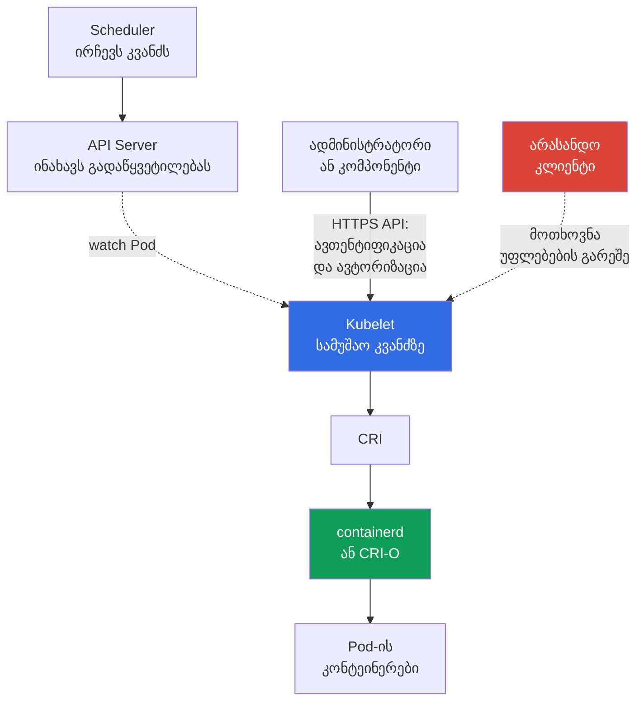

[Русская версия](ru.md) · [Eng version](README.md) · [Versión en español](es.md) · [Version française](fr.md) · [Deutsche Version](de.md) · [繁體中文版](tw.md) · [日本語版](jp.md)

# თავი 08. კვანძის უსაფრთხოება: Kubelet, Container Runtime, KubeProxy

> **რა არის შემდეგ.** [წინა თავში](../07/ge.md) control plane განხილული იყო, როგორც კლასტერის მართვის ცენტრი. ეს თავი ყურადღებას სამუშაო კვანძზე გადაიტანს: სწორედ აქ უშვებს `kubelet` `Pod`-ს, container runtime ქმნის კონტეინერებს, ხოლო `kube-proxy` ტრაფიკს `Service`-ისკენ მიმართავს. ეს არის KCSA დომენის **Kubernetes Cluster Component Security** ნაწილი, რომლის წონაა 22%.

## 08.1 Kubelet და მისი API

`kubelet` არის Kubernetes-ის აგენტი თითოეულ სამუშაო კვანძზე. ის `Pod`-ს push-შეტყობინებით არ იღებს: kubelet თავად ხსნის watch-კავშირს API Server-თან (`GET .../pods?fieldSelector=spec.nodeName=<კვანძი>&watch=true`) და გამოიწერს იმ `Pod`-ების ცვლილებებს, რომელთა `spec.nodeName` მისი კვანძის სახელს ემთხვევა. როდესაც `kube-scheduler` `Pod`-ს ამ კვანძზე ანიჭებს და API Server განახლებულ ობიექტს `etcd`-ში ინახავს, kubelet უკვე გახსნილი watch-ის მეშვეობით იღებს მოვლენას, იღებს `Pod`-ის აღწერას და მის გასაშვებად CRI-ის მეშვეობით container runtime-ს მიმართავს. დიაგნოსტიკისა და მართვისთვის `kubelet` ასევე საკუთარ HTTPS API-ს იძლევა, ჩვეულებრივ, `10250` პორტზე.

ეს API ადმინისტრატორისთვის სასარგებლოა, მაგრამ არასწორი დაცვის შემთხვევაში საშიშია. მისი მეშვეობით შესაძლებელია კვანძის Pod-ების შესახებ ინფორმაციის მიღება, დიაგნოსტიკური მოქმედებების შესრულება და, ნებართვების მიხედვით, კონტეინერებთან ურთიერთქმედება. Kubelet API-ზე წვდომა მხოლოდ იმის შედეგი არ უნდა იყოს, რომ კლიენტი კლასტერის ქსელში იმყოფება.

კითხვებში ხშირად გვხვდება სამი ცნება:

| პარამეტრი ან მექანიზმი | რას აკონტროლებს | უსაფრთხო მიდგომა |
|---|---|---|
| `--anonymous-auth` | შეუძლია თუ არა არაავთენტიფიცირებულ კლიენტს Kubelet API-სთან მიმართვა | ანონიმური წვდომის გამორთვა: `false` |
| authorization mode | მოწმდება თუ არა უკვე ავთენტიფიცირებული კლიენტის უფლება კონკრეტულ მოქმედებაზე | უფლებამოსილების შემოწმების გამოყენება, ჩვეულებრივ `Webhook`, უპირობო დაშვების ნაცვლად |
| `--read-only-port` | Kubelet-ის ძველი HTTP-პორტი სრულფასოვანი ავთენტიფიკაციისა და ავტორიზაციის გარეშე | გამორთვა `0`-ის მითითებით |

`--anonymous-auth=true`-ის შემთხვევაში კლიენტმა რწმუნებათა მონაცემების გარეშე შეიძლება ანონიმური მომხმარებლისთვის ხელმისაწვდომ endpoint-ებზე წვდომა მიიღოს. მაშინაც კი, თუ პასუხები უვნებელი ჩანს, Pod-ების, image-ებისა და კვანძის metadata თავდამსხმელს ეხმარება. ამიტომ პრინციპი მარტივია: Kubelet API ხელმისაწვდომი უნდა იყოს მხოლოდ დაცული არხით, მხოლოდ ცნობილი სუბიექტებისთვის და მხოლოდ საჭირო ოპერაციებისთვის.

`Webhook` authorization აიძულებს kubelet-ს, მოთხოვნის შემოწმება `SubjectAccessReview`-ის მეშვეობით `kube-apiserver`-ს გადასცეს; გადაწყვეტილებას იღებს API Server-ზე კონფიგურირებული authorizer-ების ჯაჭვი, რომელიც ხშირად RBAC-ს მოიცავს, და არა ლოკალური `AlwaysAllow`. kubelet-ის `10250`-ის ქსელური ხელმისაწვდომობა უნდა შეიზღუდოს host firewall-ით, cloud security groups / authorized-network controls-ით და, თუ კონკრეტულ CNI-ს host/node policy-ის მხარდაჭერა აქვს, CNI-ის შესაბამისი მექანიზმით. ჩვეულებრივი Kubernetes `NetworkPolicy` kubelet-ის host endpoint-ის უნივერსალურ დაცვად არ უნდა ჩაითვალოს.

Hardening-ის შემდეგ სასარგებლოა იმის კონტროლი, შეიცვალა თუ არა kubelet-ის კონფიგურაცია დამტკიცებულ baseline-თან შედარებით. File-integrity/configuration monitoring-ს შეუძლია მოულოდნელი ცვლილებების აღმოჩენა და ჟურნალში ჩაწერა, ასევე დაფიქსირებული ცვლილებების შესახებ post-event evidence-ის მოწოდება. ასეთი evidence-ის სიძლიერე დამოკიდებულია იმაზე, იყო თუ არა monitoring უწყვეტად ჩართული, დაცული ცვლილებისგან და ინახავდა თუ არა tamper-resistant/centralized records-ს; მხოლოდ FIM-ის არსებობის ფაქტი არ ამტკიცებს, რომ ჩანაცვლება არასდროს მომხდარა.

## 08.2 Container runtime, CRI და socket-ები

Container runtime კვანძზე ქმნის კონტეინერებს და მართავს მათ. თანამედროვე კლასტერებში ხშირად გამოიყენება `containerd` ან CRI-O. Kubernetes მათთან **Container Runtime Interface (CRI)**-ის მეშვეობით ურთიერთქმედებს, ამიტომ `kubelet` კონკრეტული runtime-ის შიდა API-ზე დამოკიდებული არ არის.

კავშირი ჩვეულებრივ Unix domain socket-ის მეშვეობით ხორციელდება. გზების მაგალითებია: `/run/containerd/containerd.sock` `containerd`-ისთვის და `/var/run/crio/crio.sock` CRI-O-სთვის. გზა დისტრიბუციასა და კონფიგურაციაზეა დამოკიდებული, მაგრამ რისკი იგივეა: პროცესს, რომელსაც runtime-ის socket-თან მიმართვის უფლება აქვს, შეუძლია კვანძის კონტეინერები ძალიან მაღალი პრივილეგიებით მართოს.

| ობიექტი | როლი | გადაჭარბებული წვდომის რისკი |
|---|---|---|
| CRI | კონტრაქტი `kubelet`-სა და runtime-ს შორის | თავისთავად არ არის წვდომის საზღვარი |
| runtime socket | runtime-ის მართვის ლოკალური ინტერფეისი | კონტეინერების გაშვება, შეჩერება და ინსპექტირება, კვანძის შესაძლო ხელში ჩაგდება |
| `containerd` / CRI-O | კონტეინერების სასიცოცხლო ციკლის იმპლემენტაცია | პროცესის ან მისი კონფიგურაციის კომპრომეტაცია გავლენას ახდენს კვანძის ყველა Pod-ზე |

არ დაამონტაჟოთ runtime-ის socket აპლიკაციის `Pod`-ში და არ მისცეთ ის CI-დავალებას მხოლოდ მოსახერხებელი build-ის ან debugging-ისთვის. ასეთი mount ჰოსტის მართვის გადაცემის ტოლფასია. შეზღუდეთ socket-ის ფაილის უფლებები, გაუშვით მხოლოდ აუცილებელი პრივილეგირებული სისტემური კომპონენტები და აკონტროლეთ, ვის შეუძლია `hostPath`-ის ან `privileged: true`-ის მქონე `Pod`-ის შექმნა.

Docker ისტორიულად ფართოდ გავრცელებული runtime იყო, მაგრამ Kubernetes სტანდარტულ ინტერფეისად CRI-ს იყენებს და არა Docker API-ს. ამიტომ თანამედროვე `kubelet`-ისა და `containerd`-ის ურთიერთქმედების შესახებ კითხვაში სწორი ტერმინებია CRI და მისი socket, და არა Docker socket.

## 08.3 KubeProxy და ქსელური შეტევის ზედაპირი

`kube-proxy` მუშაობს კვანძებზე და `Service` აბსტრაქციისკენ ტრაფიკის მარშრუტიზაციისთვის kernel-ის დონის წესებს აკონფიგურირებს: ის `iptables`-ს, `nftables`-ს ან IPVS-ს ისე აპროგრამებს, რომ ვირტუალური `ClusterIP`-ისა და `NodePort` პორტებისკენ მიმართული პაკეტები შესაბამის endpoint-ზე გადაიგზავნოს. Linux-ში ხელმისაწვდომია `iptables`, `nftables` და IPVS რეჟიმები. Kubernetes v1.37-ის მიმდინარე დოკუმენტაციაში default კვლავ `iptables`-ია; `nftables` (Linux kernel 5.13+) რეკომენდებულია v1.35-დან deprecated IPVS-ის შემცვლელად. `kube-proxy` არ არის userspace-ში მოქმედი traffic proxy: ის თავად არ აგზავნის პაკეტებს, არამედ მხოლოდ kernel-ში აკონფიგურირებს netfilter/IPVS-ს, რომელიც შემდეგ ტრაფიკს ამუშავებს. ის ასევე არ არის აპლიკაციების დამშიფრავი proxy და არ ანაცვლებს `NetworkPolicy`-ს.

| მექანიზმი | რას აკეთებს | რას არ აკეთებს |
|---|---|---|
| `iptables` mode | ქმნის პაკეტების endpoint-ისკენ გადამისამართების წესებს | არ ამოწმებს აპლიკაციის ბიზნეს-ავტორიზაციას |
| `nftables` mode | ქმნის `nftables` წესებს `Service`-ის გადამისამართებისთვის; მხარდაჭერილ Linux-ზე გამოდგება IPVS-ის შემცვლელად | არ ანაცვლებს ქსელის სეგმენტაციას |
| IPVS mode | იყენებს IP Virtual Server-ს `Service`-ის დატვირთვის დასაბალანსებლად; deprecated Kubernetes v1.35-დან | არ ანაცვლებს ქსელის სეგმენტაციას; შემცვლელია `nftables`, ხოლო მისი მიუწვდომლობისას განიხილება `iptables` |
| `NetworkPolicy` | CNI-ის მხარდაჭერის შემთხვევაში ზღუდავს Pod-ებსა და ქსელებს შორის დასაშვებ ნაკადებს | არ ქმნის `Service`-ის წესებს და მას `kube-proxy` ვერ ანაცვლებს |

`kube-proxy`-ის, მისი კონფიგურაციის ან ჰოსტის კომპრომეტაცია თავდამსხმელს ამ კვანძის ქსელური დამუშავების დაკვირვებისა და შეცვლის საშუალებას აძლევს: ხელმისაწვდომობის დარღვევა, ტრაფიკის ნაწილის გადამისამართება ან Service-ისკენ მოსალოდნელი გზის გვერდის ავლა. დაცვა იწყება არა `iptables`, `nftables` ან IPVS რეჟიმის არჩევით, არამედ თავად კვანძის დაცვით: განახლებული OS, ადმინისტრატორის მინიმალური წვდომა, კომპონენტის რწმუნებათა მონაცემების შეზღუდვა, API Server-თან დაცული არხები და ქსელური წესების უჩვეულო ცვლილებებზე დაკვირვება. `nftables`-ის მხარდაჭერის მქონე Linux-კვანძებისთვის მას deprecated IPVS-ის ნაცვლად ირჩევენ; ამასთან, Kubernetes v1.37-ის მიმდინარე default კვლავ `iptables`-ია. ეს არ აუქმებს `NetworkPolicy`-სთვის ცალკე CNI-enforcement-ის საჭიროებას.

KCSA-სთვის მნიშვნელოვანია როლების განსხვავება. `kube-proxy` უზრუნველყოფს `Service`-ის ხელმისაწვდომობას; CNI უზრუნველყოფს Pod-ების ქსელთან დაკავშირებას და შეუძლია `NetworkPolicy`-ის გამოყენება; mTLS და service mesh წყვეტს ტრაფიკის კრიპტოგრაფიული იდენტიფიკაციისა და დაშიფვრის ცალკე ამოცანას.

## 08.4 რას ნიშნავს კვანძის კომპრომეტაცია

სამუშაო კვანძი ნდობის ძლიერი საზღვარია, მაგრამ არა მასზე განთავსებულ Pod-ებს შორის აბსოლუტური იზოლაცია. კვანძზე root-წვდომის მქონე მომხმარებელს შეუძლია ჩაერიოს runtime-ში, ქსელურ წესებსა და ლოკალურ მონაცემებში. პრაქტიკული შედეგი კლასტერის კონფიგურაციაზეა დამოკიდებული, მაგრამ საფრთხის მოდელი ამას სერიოზულ ინციდენტად უნდა მიიჩნევდეს.

კვანძის ხელში ჩაგდებისას თავდამსხმელს პოტენციურად შეუძლია მიიღოს:

- runtime-ის მეშვეობით კონტეინერებისა და მათი პროცესების მართვა;
- ამ კვანძზე განთავსებული Pod-ების ფაილურ სისტემებსა და ქსელურ ტრაფიკზე წვდომა;
- ამ Pod-ებში დამონტაჟებული service account tokens და Secret-ები;
- `kubelet`-ისა და `kube-proxy`-ის მუშაობის ჩანაცვლების ან დაკვირვების შესაძლებლობა;
- ლატერალური გადაადგილების საწყისი წერტილი სუსტი RBAC-ის, ზედმეტად ფართო token-ების ან ღია ქსელური გზების შემთხვევაში.

ეს არ ნიშნავს კლასტერის ყველა Secret-ზე ავტომატურ წვდომას. მაგალითად, Secret, რომელიც კომპრომეტირებულ კვანძზე არსებულ Pod-ში არ არის დამონტაჟებული, მხოლოდ ერთი კვანძის ხელში ჩაგდების გამო აუცილებლად ხელმისაწვდომი არ ხდება. მაგრამ ფართო უფლებების მქონე `ServiceAccount`-მა, API Server-ზე წვდომამ ან პრივილეგირებულმა Pod-ებმა შეიძლება შედეგები სწრაფად გააფართოოს.

Defense in depth ამცირებს დაზიანების რადიუსს: მგრძნობიარე workload-ები ცალკე განათავსეთ, გამოიყენეთ `Pod Security Standards`, least-privilege RBAC, `NetworkPolicy`, ხანმოკლე რწმუნებათა მონაცემები, დაშიფვრა და ინფრასტრუქტურის საიმედო საზღვრები. ასევე მნიშვნელოვანია კვანძების განახლება, აუდიტი და monitoring: დაცვა ინციდენტის არარსებობის გარანტიას არ იძლევა, მაგრამ მის აღმოჩენასა და შედეგების შეზღუდვაში გვეხმარება.

## 08.5 როგორ გამოიყენება ეს პრაქტიკაში

პლატფორმის გუნდი სამუშაო კვანძს განიხილავს, როგორც კონტეინერების მართვის მცირე სერვერს და არა როგორც Kubernetes-ის გამჭვირვალე ნაწილს. ტიპური მიდგომა ასე გამოიყურება:

1. იცავენ Kubelet API-ს: თიშავენ anonymous access-სა და read-only port-ს, რთავენ ავტორიზაციის შემოწმებას, `10250` პორტს კი მხოლოდ საჭირო წყაროებისთვის უშვებენ.
2. ამოწმებენ `containerd` ან CRI-O socket-ების უფლებებს და მანიფესტებში საშიშ mount-ებს ეძებენ. აპლიკაციის Pod-ები runtime socket-ზე წვდომას არ იღებენ.
3. ზღუდავენ პრივილეგირებული Pod-ების, `hostPath`-ის, `hostNetwork`-ისა და სხვა ისეთი პარამეტრების შექმნას, რომლებიც Pod-ს კვანძთან აკავშირებს. ამისთვის აერთიანებენ RBAC-ს, Pod Security Admission-სა და admission policies-ს.
4. შედეგებს მინიმუმამდე ამცირებენ: მგრძნობიარე workload-ებს აცალკევებენ, მათ ქსელურ უფლებებს ზღუდავენ და აკვირდებიან კვანძის კომპრომეტაციის ნიშნებსა და ქსელური წესების მოულოდნელ ცვლილებებს.

ეს არ არის ბრძანებების ლაბორატორიული თანმიმდევრობა. კონკრეტული flag-ები და გზები უნდა შემოწმდეს დისტრიბუციის დოკუმენტაციასა და საკუთარი კლასტერის კონფიგურაციაში: managed Kubernetes-მა შესაძლოა control plane-ის ნაწილი დამალოს, მაგრამ სამუშაო კვანძები და მათი საზღვრები მაინც ყურადღებას მოითხოვს.

## 08.6 საგამოცდო ლექსიკა / მინი-ლექსიკონი

| ტერმინი | მნიშვნელობა |
|---|---|
| `kubelet` | Kubernetes-ის აგენტი სამუშაო კვანძზე, რომელიც მისთვის მინიჭებულ Pod-ებს მართავს. |
| Kubelet API | Kubelet-ის HTTPS-ინტერფეისი კვანძზე ოპერაციებისა და დიაგნოსტიკისთვის. |
| CRI | Kubernetes-ის სტანდარტული ინტერფეისი `kubelet`-სა და container runtime-ს შორის. |
| container runtime | კომპონენტი, რომელიც ქმნის და უშვებს კონტეინერებს, მაგალითად `containerd` ან CRI-O. |
| runtime socket | Unix-სოკეტი, რომლის მეშვეობით კლიენტი container runtime-ს მართავს. |
| `kube-proxy` | კომპონენტი, რომელიც კვანძებზე `Service`-ისკენ ტრაფიკის მარშრუტიზაციისთვის kernel-ის წესებს (`iptables`, `nftables` ან IPVS) აკონფიგურირებს; თავად userspace-ში traffic proxy-ის როლში არ მოქმედებს, პაკეტების რეალურ გადაგზავნას kernel ასრულებს. |
| `iptables` | `kube-proxy`-ში `Service`-ის ტრაფიკის გადამისამართების იმპლემენტაციის რეჟიმი. |
| `nftables` | `kube-proxy`-ის რეჟიმი; მხარდაჭერილ Linux-ზე რეკომენდებულია deprecated IPVS-ის შემცვლელად. |
| IPVS | Kubernetes v1.35-დან მოძველებადი `Service`-ის დატვირთვის დაბალანსების რეჟიმი `kube-proxy`-ში. |

## 08.7 საგამოცდო ძირითადი საკითხები / თავის შეჯამება

- `kubelet` მართავს Pod-ებს სამუშაო კვანძზე, ხოლო მის API-ს ავთენტიფიკაცია და ავტორიზაცია უნდა მოეთხოვებოდეს.
- `--anonymous-auth=false` და გამორთული read-only port Kubelet-ზე არაავთენტიფიცირებული წვდომის მარტივ გზებს აუქმებს.
- CRI Kubelet-ს `containerd`-თან ან CRI-O-სთან აკავშირებს; runtime socket-ზე წვდომა თითქმის კვანძზე პრივილეგირებული წვდომის ტოლფასია.
- `kube-proxy` `Service`-ის მარშრუტიზაციას `iptables`-ის, `nftables`-ის ან IPVS-ის მეშვეობით ახორციელებს. Kubernetes v1.37-ში default არის `iptables`; მხარდაჭერილ Linux-ზე `nftables` რეკომენდებულია v1.35-დან deprecated IPVS-ის ნაცვლად. ის არ ანაცვლებს `NetworkPolicy`-ს და არ შიფრავს ტრაფიკს.
- კვანძის ხელში ჩაგდება საფრთხეს უქმნის მასზე განთავსებულ Pod-ებს, მათ დამონტაჟებულ მონაცემებსა და ქსელურ დამუშავებას და შესაძლოა ლატერალური გადაადგილების დასაწყისი გახდეს.

## 08.8 რა არ უნდა აგერიოთ და როგორ გვხვდება ეს გამოცდაზე

MCQ-ში (multiple choice question, კითხვა პასუხის არჩევით) ჩვეულებრივ ამოწმებენ კომპონენტისა და მისი ფუნქციის შესაბამისობას, ასევე რამდენიმე ვარიანტიდან ყველაზე უსაფრთხო არჩევანს. ტიპური ხაფანგებია:

- Kubelet-ის API Server-ში არევა: Kubelet კონკრეტული კვანძის Pod-ებს მართავს, API Server კი ცენტრალური API წერტილია;
- მოსაზრება, რომ read-only port უსაფრთხო დიაგნოსტიკისთვის გამოდგება: სრულფასოვანი წვდომის შემოწმების არარსებობა მას არასაჭირო რისკად აქცევს;
- CRI socket-ის ჩვეულებრივ კონფიგურაციის ფაილში არევა: მასზე წვდომა runtime-ის მართვის ინტერფეისს იძლევა;
- `kube-proxy`-ისთვის `NetworkPolicy`-ის, დაშიფვრის ან mTLS-ის ფუნქციების მიწერა, ან IPVS-ის ახალი კლასტერისთვის რეკომენდებულ რეჟიმად მიჩნევა;
- დასკვნა, რომ ერთი კვანძის ხელში ჩაგდება ავტომატურად ხსნის მთელი კლასტერის ყველა Secret-ს, Pod-ების განთავსებისა და რწმუნებათა მონაცემების უფლებამოსილებების გაუთვალისწინებლად.

პასუხის არჩევისას ჯერ განსაზღვრეთ საზღვარი: Kubelet API, ლოკალური runtime, `Service`-ის ქსელური გზა თუ Pod-ის რწმუნებათა მონაცემები. შემდეგ შეაფასეთ, რომელი პარამეტრი ამცირებს წვდომას ან დაზიანების რადიუსს.

## 08.9 თვითშემოწმების კითხვები

### 1. Kubelet-ის რომელი პარამეტრი გამორიცხავს არაავთენტიფიცირებულ წვდომას უშუალოდ მის ძირითად (HTTPS) API-ზე?

   - a. `--authorization-mode=AlwaysAllow`

   - b. `--anonymous-auth=false`

   - c. IPVS-ის ჩართვა `kube-proxy`-ში

   - d. `--read-only-port=10255`

პასუხი და განმარტება

**სწორი პასუხია: b.** `--anonymous-auth=false` კრძალავს ანონიმურ მოთხოვნებს kubelet-ის ძირითად API-ზე. ეს არ გამორიცხავს ცალკე რისკს: `--read-only-port` (ვარიანტი d) არის დამოუკიდებელი, არასავალდებულო legacy endpoint ყოველგვარი ავთენტიფიკაციისა და ავტორიზაციის გარეშე; ის ცალკე უნდა გამოირთოს (`--read-only-port=0`) და არ უნდა ჩაითვალოს `--anonymous-auth`-ის მეშვეობით დახურულად. `AlwaysAllow` უფლებამოსილებებს არ ამოწმებს (ეს authorization-ის რისკია და არა authentication-ის). IPVS რეჟიმი `kube-proxy`-ს ეხება და არა Kubelet API-ს.

### 2. რატომ არის საშიში `containerd` socket-ის ჩვეულებრივ აპლიკაციის `Pod`-ში mount?

   - a. ის აპლიკაციას მხოლოდ საკუთარი image layer-ის metadata-ზე აძლევს წვდომას და runtime-ზე გავლენას არ ახდენს.
   - b. ის ხსნის პრივილეგირებულ runtime API-ს და შესაძლოა კვანძის კონტეინერების ან runtime-ის სხვა ობიექტების მართვის საშუალება მისცეს.
   - c. ის CNI-ს სჭირდება namespace-ის ტრაფიკზე Kubernetes `NetworkPolicy`-ის გამოსაყენებლად.
   - d. ის ავტომატურად რთავს ორმხრივ TLS-ავთენტიფიკაციას კვანძის ყველა Pod-ს შორის.

პასუხი და განმარტება

**სწორი პასუხია: b.** Runtime socket არის container runtime-ის ადმინისტრაციული ინტერფეისი. მისი ჩვეულებრივი workload-ისთვის გადაცემამ შესაძლოა კომპრომეტირებული კონტეინერის გავლენა კვანძზე მკვეთრად გააფართოოს. NetworkPolicy და workload mTLS სხვა ამოცანებს წყვეტს.

### 3. უპირველესად რომელ ამოცანაზეა პასუხისმგებელი `kube-proxy`?

   - a. Image-ების მოწყვლადობებზე შემოწმება.

   - b. კონტეინერების შექმნა CRI-ის მეშვეობით.

   - c. API Server-ის მოთხოვნებისთვის RBAC-ის შემოწმება.

   - d. `Service`-ის ტრაფიკის შესაბამის endpoint-ზე მიმართვა.

პასუხი და განმარტება

**სწორი პასუხია: d.** `kube-proxy` `Service`-ის ქსელურ აბსტრაქციას `iptables`-ის, `nftables`-ის ან IPVS-ის მეშვეობით ახორციელებს. `nftables` stable არის Kubernetes v1.33-დან და რეკომენდებულია v1.35-დან deprecated IPVS-ის ნაცვლად. `NetworkPolicy`-ს მისი მხარდამჭერი CNI იყენებს და არა `kube-proxy`; CRI-ს Kubelet იყენებს, RBAC API Server-ის ჯაჭვში მუშავდება, ხოლო image-ების სკანირება supply chain-ს მიეკუთვნება.

### 4. რომელი მტკიცება აღწერს ყველაზე ზუსტად სამუშაო კვანძის ხელში ჩაგდების შედეგებს?

   - a. კომპრომეტაცია მხოლოდ kube-proxy rules-ზე მოქმედებს და განთავსებულ workload-ზე გავლენას არ ახდენს.
   - b. ერთ worker-ზე root ავტომატურად ნიშნავს API-ის მეშვეობით ყველა namespace-ში ნებისმიერი `Secret` ობიექტის წაკითხვას.
   - c. თავდამსხმელს შეუძლია გავლენა მოახდინოს ლოკალურ Pod-ებზე, runtime-ზე, mounted data-სა და ქსელურ დამუშავებაზე, ხოლო შემდგომი მასშტაბი ხელმისაწვდომ credentials-სა და permissions-ზეა დამოკიდებული.
   - d. NetworkPolicy ინარჩუნებს კომპრომეტირებული host root-ისადმი სრულ ნდობას და workload data-ზე წვდომას გამორიცხავს.

პასუხი და განმარტება

**სწორი პასუხია: c.** Host root-ის ხელში ჩაგდება ლოკალური workload boundary-ისადმი ნდობას ანადგურებს, მაგრამ შემდგომი cluster-wide impact დამოკიდებულია განთავსებულ მონაცემებზე, token-ებზე, RBAC-სა და სხვა ხელმისაწვდომ გზებზე. ავტომატურად არც სრული იზოლაცია და არც კლასტერის ყველა Secret-ზე უპირობო წვდომა არ უნდა ვივარაუდოთ.

> **სად წავიდეთ შემდეგ.** შემომავალი გზებისა და კვანძის ზედაპირების პრაქტიკული დაცვისთვის შეისწავლეთ CKS-ის თავი 08: Secure Ingress TLS-ით და CKS-ის თავი 14: ჰოსტის OS-ის footprint-ის მინიმიზაცია და runtime daemon-ის უსაფრთხოება. KCSA-ში გააგრძელეთ [თავი 09](../09/ge.md), რომელიც `Pod`-ის, ქსელის, storage-ისა და კლიენტის რწმუნებათა მონაცემების უსაფრთხოებას ეხება.

[სარჩევი](../README_GE.md) · [თავი 07](../07/ge.md) · [თავი 09](../09/ge.md)
