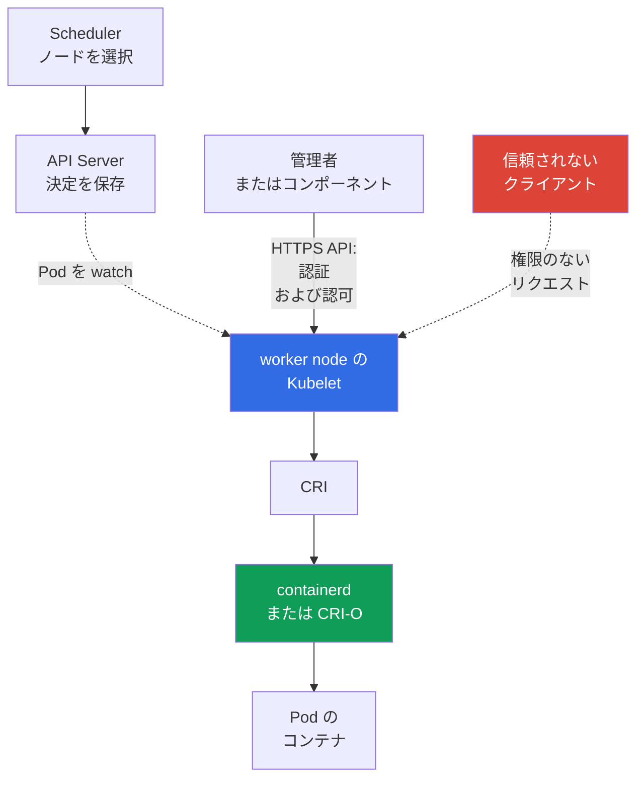

[Русская версия](ru.md) · [Eng version](README.md) · [Versión en español](es.md) · [Version française](fr.md) · [Deutsche Version](de.md) · [ქართული ვერსია](ge.md) · [繁體中文版](tw.md)

# 第08章. ノードセキュリティ: Kubelet、Container Runtime、KubeProxy

> **この後の内容。** [前章](../07/jp.md)では、control plane をクラスターの制御センターとして扱いました。この章では worker node に注目します。ここでは `kubelet` が `Pod` を起動し、container runtime がコンテナを作成し、`kube-proxy` がトラフィックを `Service` にルーティングします。これは、比重 22% の KCSA ドメイン **Kubernetes Cluster Component Security** の一部です。

## 08.1 Kubelet とその API

`kubelet` は各 worker node 上の Kubernetes エージェントです。`Pod` を push 通知で受け取るのではありません。kubelet 自身が API Server への watch 接続 (`GET .../pods?fieldSelector=spec.nodeName=<ノード>&watch=true`) を開き、`spec.nodeName` が自身のノード名と一致する `Pod` の変更を購読します。`kube-scheduler` がこのノードに `Pod` を割り当て、API Server が更新済みオブジェクトを `etcd` に保存すると、kubelet は開いている watch を通じてイベントを受け取り、`Pod` の定義を取得し、CRI 経由で container runtime に起動を依頼します。診断と管理のため、`kubelet` は通常ポート `10250` 上で独自の HTTPS API も提供します。

この API は管理者には便利ですが、保護が不適切だと危険です。これを通じてノード上の Pod に関する情報を取得し、診断操作を実行し、権限に応じてコンテナとやり取りできます。Kubelet API へのアクセスが、クライアントがクラスターのネットワーク内にいるという副次的な結果であってはなりません。

問題でよく出る概念は 3 つあります。

| 設定またはメカニズム | 制御対象 | 安全な考え方 |
|---|---|---|
| `--anonymous-auth` | 認証されていないクライアントが Kubelet API にアクセスできるか | 匿名アクセスを無効化する: `false` |
| authorization mode | すでに認証されたクライアントが特定の操作を行う権限を持つか検証するか | 無条件の許可ではなく、通常は `Webhook` による権限確認を使用する |
| `--read-only-port` | 完全な認証と認可を伴わない、旧式の Kubelet HTTP ポート | `0` を設定して無効化する |

`--anonymous-auth=true` の場合、認証情報のないクライアントが匿名ユーザーに公開された endpoint にアクセスできる可能性があります。応答が無害に見えても、Pod、image、ノードに関するメタデータは攻撃者の助けになります。したがって原則は単純です。Kubelet API は保護されたチャネルを通じ、既知の主体に対してのみ、必要な操作だけを許可します。

`Webhook` authorization は、kubelet に `SubjectAccessReview` を通じたリクエストの検証を `kube-apiserver` へ委任させます。決定は API Server に設定された authorizer チェーンが行い、そこには多くの場合 RBAC が含まれ、ローカルの `AlwaysAllow` は使われません。kubelet `10250` へのネットワーク到達性は、host firewall、cloud security groups / authorized-network controls、さらに特定の CNI が host/node policy をサポートする場合は対応する CNI メカニズムで制限すべきです。通常の Kubernetes `NetworkPolicy` を、kubelet host endpoint の汎用的な保護と見なすことはできません。

hardening の後は、承認済み baseline と比べて kubelet の設定が変更されていないかを監視することが有用です。File-integrity/configuration monitoring は予期しない変更を検出して記録し、観測された変更に関する post-event evidence を提供できます。その evidence の強さは、monitoring が継続的に有効で、変更から保護され、tamper-resistant/centralized records を保存していたかに依存します。FIM が存在するだけでは、改ざんが一度も発生しなかったことの証明にはなりません。

## 08.2 Container runtime、CRI、ソケット

Container runtime はノード上でコンテナを作成し管理します。現代のクラスターでは、`containerd` または CRI-O がよく使われます。Kubernetes は **Container Runtime Interface (CRI)** を通じてこれらと通信するため、`kubelet` は特定の runtime の内部 API に依存しません。

通信は通常 Unix domain socket を介して行われます。パスの例は、`containerd` の `/run/containerd/containerd.sock` と CRI-O の `/var/run/crio/crio.sock` です。パスはディストリビューションと設定によって異なりますが、リスクは同じです。runtime socket にアクセスする権限を持つプロセスは、非常に高い権限でノードのコンテナを管理できます。

| オブジェクト | 役割 | 過剰なアクセスによるリスク |
|---|---|---|
| CRI | `kubelet` と runtime 間の契約 | それ自体はアクセス境界ではない |
| runtime socket | runtime のローカル管理インターフェース | コンテナの起動、停止、調査、およびノード乗っ取りの可能性 |
| `containerd` / CRI-O | コンテナライフサイクルの実装 | プロセスまたは設定の侵害はノード上のすべての Pod に影響する |

便利なビルドやデバッグのためだけに、runtime socket をアプリケーション `Pod` に mount したり、CI ジョブに付与したりしてはいけません。このような mount はホストの制御権を渡すことに等しいものです。socket ファイルの権限を制限し、必要な特権付きシステムコンポーネントだけを実行し、`hostPath` または `privileged: true` を持つ `Pod` を誰が作成できるかを管理してください。

Docker は歴史的に一般的な runtime でしたが、Kubernetes は標準インターフェースとして Docker API ではなく CRI を使用します。したがって、現代的な `kubelet` と `containerd` の連携についての問題では、Docker socket ではなく CRI とその socket が正しい用語です。

## 08.3 KubeProxy とネットワーク攻撃面

`kube-proxy` はノード上で動作し、`Service` 抽象化へのトラフィックをルーティングするためのカーネルレベルのルールを設定します。`iptables`、`nftables`、または IPVS をプログラムし、仮想 `ClusterIP` と `NodePort` のポートへのパケットが適切な endpoint にリダイレクトされるようにします。Linux では `iptables`、`nftables`、IPVS モードを利用できます。Kubernetes v1.37 の現在のドキュメントでは、default は引き続き `iptables` です。`nftables` (Linux kernel 5.13+) は、v1.35 から deprecated となった IPVS の代替として推奨されます。`kube-proxy` は userspace の traffic proxy ではありません。パケットを自ら転送せず、カーネル内の netfilter/IPVS を設定するだけであり、その後はカーネルがトラフィックを処理します。また、アプリケーションの暗号化 proxy でもなく、`NetworkPolicy` の代わりにもなりません。

| メカニズム | 実行すること | 実行しないこと |
|---|---|---|
| `iptables` mode | endpoint へパケットをリダイレクトするルールを作成する | アプリケーションのビジネス認可を検証しない |
| `nftables` mode | `Service` をリダイレクトする `nftables` ルールを作成する。サポートされる Linux では IPVS の代替として適する | ネットワークセグメンテーションの代わりにはならない |
| IPVS mode | `Service` の負荷分散に IP Virtual Server を使用する。Kubernetes v1.35 から deprecated | ネットワークセグメンテーションの代わりにはならない。代替は `nftables` であり、それが利用できない場合は `iptables` を検討する |
| `NetworkPolicy` | CNI がサポートする場合に Pod とネットワーク間で許可されるフローを制限する | `Service` ルールを構築せず、`kube-proxy` に置き換えられない |

`kube-proxy`、その設定、またはホストが侵害されると、攻撃者はこのノードのネットワーク処理を観測および変更できます。可用性を損ない、トラフィックの一部をリダイレクトし、Service への想定経路を迂回できます。保護は `iptables`、`nftables`、IPVS のモード選択からではなく、ノード自体の保護から始まります。OS を最新に保ち、管理者アクセスを最小化し、コンポーネントの認証情報を制限し、API Server へのチャネルを保護し、ネットワークルールの異常な変更を監視します。`nftables` をサポートする Linux ノードでは、deprecated となった IPVS ではなくこれを選択します。ただし Kubernetes v1.37 の現在の default は引き続き `iptables` です。これは `NetworkPolicy` のための個別の CNI-enforcement を不要にするものではありません。

KCSA では役割を区別することが重要です。`kube-proxy` は `Service` の到達可能性を提供します。CNI は Pod をネットワークに接続し、`NetworkPolicy` を適用できます。mTLS と service mesh は、トラフィックの暗号学的アイデンティティと暗号化という別の課題を解決します。

## 08.4 ノード侵害の意味

worker node は強力な信頼境界ですが、そこに配置された Pod 間の絶対的な分離ではありません。ノードへの root アクセスを持つユーザーは、runtime、ネットワークルール、ローカルデータに介入できます。実際の結果はクラスター設定に依存しますが、脅威モデルは重大なインシデントを前提とすべきです。

ノードを侵害した攻撃者は、潜在的に以下を得ます。

- runtime を通じたコンテナとそのプロセスの制御
- そのノードに配置された Pod のファイルシステムとネットワークトラフィックへのアクセス
- これらの Pod に mount された service account tokens と Secrets
- `kubelet` および `kube-proxy` の動作を置き換えたり観測したりする能力
- RBAC が弱い、token が広すぎる、またはネットワーク経路が開放されている場合の lateral movement の足がかり

これは、クラスター内のすべての Secrets に自動的にアクセスできることを意味しません。たとえば、侵害されたノード上の Pod に mount されていない Secret は、1 つのノードが侵害されたというだけでアクセス可能になる必要はありません。しかし、広範な `ServiceAccount`、API Server へのアクセス、または特権付き Pod は、影響をすぐに拡大する可能性があります。

Defense in depth は影響範囲を縮小します。機密性の高い workload を分離して配置し、`Pod Security Standards`、least-privilege RBAC、`NetworkPolicy`、短命な認証情報、暗号化、信頼できるインフラストラクチャ境界を使用してください。ノードの更新、監査、monitoring も重要です。保護はインシデントが起こらないことを保証しませんが、検知し、影響を制限する助けになります。

## 08.5 実際の適用方法

プラットフォームチームは worker node を Kubernetes の透過的な一部ではなく、小さなコンテナ管理サーバーとして扱います。典型的なアプローチは次のとおりです。

1. Kubelet API を保護する: anonymous access と read-only port を無効化し、認可チェックを有効にして、ポート `10250` を必要な送信元だけに許可する。
2. `containerd` または CRI-O の socket 権限を確認し、manifest 内の危険な mounts を探す。アプリケーション Pod に runtime socket へのアクセスを与えない。
3. 特権付き Pod、`hostPath`、`hostNetwork`、および Pod をノードに結び付けるその他の設定の作成を制限する。このために RBAC、Pod Security Admission、admission policies を組み合わせる。
4. 影響を最小化する: 機密性の高い workload を分離し、そのネットワーク権限を制限し、ノード侵害の兆候とネットワークルールの予期しない変更を監視する。

これはコマンドのラボ手順ではありません。具体的な flag とパスは、ディストリビューションのドキュメントと自身のクラスター設定で確認します。managed Kubernetes は control plane の一部を隠す場合がありますが、worker node とその境界には引き続き注意が必要です。

## 08.6 Exam vocabulary / ミニ用語集

| 用語 | 意味 |
|---|---|
| `kubelet` | worker node 上の Kubernetes エージェントで、割り当てられた Pod を管理する。 |
| Kubelet API | ノード上の操作と診断のための Kubelet HTTPS インターフェース。 |
| CRI | `kubelet` と container runtime 間の標準 Kubernetes インターフェース。 |
| container runtime | たとえば `containerd` や CRI-O のように、コンテナを作成し起動するコンポーネント。 |
| runtime socket | クライアントが container runtime を管理するための Unix socket。 |
| `kube-proxy` | ノード上で `Service` へのトラフィックをルーティングするためのカーネルルール (`iptables`、`nftables`、または IPVS) を設定するコンポーネント。userspace の traffic proxy としては動作せず、実際のパケット転送はカーネルが行う。 |
| `iptables` | `kube-proxy` における `Service` トラフィックリダイレクトの実装モード。 |
| `nftables` | `kube-proxy` のモード。サポートされる Linux では deprecated IPVS の代替として推奨される。 |
| IPVS | Kubernetes v1.35 から非推奨になりつつある、`kube-proxy` における `Service` 負荷分散モード。 |

## 08.7 Exam Essentials / 章の要点

- `kubelet` は worker node 上の Pod を管理し、その API では認証と認可が必須であるべきです。
- `--anonymous-auth=false` と read-only port の無効化により、Kubelet への認証されていない簡単なアクセス経路を排除します。
- CRI は Kubelet を `containerd` または CRI-O に接続します。runtime socket へのアクセスは、ほぼノードへの特権アクセスに等しいです。
- `kube-proxy` は `iptables`、`nftables`、または IPVS を通じて `Service` ルーティングを実装します。Kubernetes v1.37 の default は `iptables` です。`nftables` はサポートされる Linux で、v1.35 から deprecated の IPVS の代わりに推奨されます。これは `NetworkPolicy` の代わりにはならず、トラフィックを暗号化しません。
- ノードの侵害は、そこに配置された Pod、その mount されたデータ、ネットワーク処理を危険にさらし、lateral movement の始まりとなる可能性があります。

## 08.8 混同しやすい点と試験での出題

MCQ (multiple choice question、選択式問題) では通常、コンポーネントとその機能の対応、および複数の選択肢から最も安全なものを問います。典型的な落とし穴は次のとおりです。

- Kubelet と API Server を混同すること: Kubelet は特定ノードの Pod を管理し、API Server は中央 API エンドポイントである
- read-only port が安全な診断に適すると考えること: 完全なアクセスチェックがないため、不要なリスクとなる
- CRI socket を通常の設定ファイルと混同すること: これへのアクセスは runtime の管理インターフェースを提供する
- `kube-proxy` に `NetworkPolicy`、暗号化、mTLS の機能を帰属させること、または新しいクラスターに IPVS が推奨されるモードだと考えること
- Pod の配置と認証情報の権限を考慮せず、1 つのノードの侵害がクラスター全体のすべての Secrets を自動的に公開すると結論付けること

回答を選ぶ際は、まず境界を特定してください。Kubelet API、ローカル runtime、`Service` のネットワーク経路、または Pod の認証情報です。次に、どの設定がアクセスまたは影響範囲を縮小するかを評価します。

## 08.9 自己確認問題

### 1. Kubelet の主要な (HTTPS) API への認証されていないアクセスを、まさに排除する Kubelet 設定はどれですか。

   - a. `--authorization-mode=AlwaysAllow`

   - b. `--anonymous-auth=false`

   - c. `kube-proxy` で IPVS を有効にする

   - d. `--read-only-port=10255`

回答と解説

**正解: b.** `--anonymous-auth=false` は kubelet の主要 API への匿名リクエストを禁止します。これは別のリスクを排除するものではありません。`--read-only-port` (選択肢 d) は、認証も認可もない独立した任意の legacy endpoint です。`--anonymous-auth` で閉じられていると見なすのではなく、別途無効化 (`--read-only-port=0`) する必要があります。`AlwaysAllow` は権限を検証しません (authentication ではなく authorization のリスクです)。IPVS モードは Kubelet API ではなく `kube-proxy` に関するものです。

### 2. 通常のアプリケーション `Pod` に `containerd` socket を mount することが危険なのはなぜですか。

   - a. アプリケーションに自身の image layer の metadata へのアクセスだけを提供し、runtime には影響しない。
   - b. 特権 runtime API を開き、コンテナまたはノード上の他の runtime オブジェクトを管理できる可能性がある。
   - c. namespace トラフィックに Kubernetes `NetworkPolicy` を適用するために CNI が必要とする。
   - d. ノード上のすべての Pods 間で相互 TLS 認証を自動的に有効にする。

回答と解説

**正解: b.** Runtime socket は container runtime の管理インターフェースです。通常の workload にこれを提供すると、侵害されたコンテナがノードに及ぼす影響を大幅に拡大し得ます。NetworkPolicy と workload mTLS は別の課題を解決します。

### 3. `kube-proxy` が主に担うタスクはどれですか。

   - a. image の脆弱性を検査する。

   - b. CRI を通じてコンテナを作成する。

   - c. API Server へのリクエストに対する RBAC を検証する。

   - d. `Service` トラフィックを適切な endpoint に送る。

回答と解説

**正解: d.** `kube-proxy` は `iptables`、`nftables`、または IPVS を通じて `Service` のネットワーク抽象化を実装します。`nftables` は Kubernetes v1.33 から stable で、v1.35 から deprecated の IPVS の代替として推奨されます。`NetworkPolicy` は、それをサポートする CNI が適用するものであり、`kube-proxy` ではありません。CRI は Kubelet が使用し、RBAC は API Server チェーンで処理され、image scanning は supply chain に属します。

### 4. worker node の侵害による結果を最も正確に説明する記述はどれですか。

   - a. 侵害は kube-proxy rules のみに影響し、配置された workload には影響しない。
   - b. 1 つの worker の root は、API を通じてすべての namespace の任意の `Secret` を自動的に読み取れることを意味する。
   - c. 攻撃者はローカルの Pods、runtime、mounted data、ネットワーク処理に影響でき、その後の拡大は利用可能な credentials と permissions に依存する。
   - d. NetworkPolicy は侵害された host root を完全に信頼し続け、workload data へのアクセスを排除する。

回答と解説

**正解: c.** host root の侵害はローカル workload 境界への信頼を破壊しますが、その後の cluster-wide impact は配置されたデータ、tokens、RBAC、その他の利用可能な経路に依存します。完全な分離も、クラスター内のすべての Secrets への無条件なアクセスも、自動的に想定することはできません。

> **次の章へ。** 受信経路とノードの攻撃面を実践的に保護するため、CKS の第08章「TLS による Secure Ingress」と CKS の第14章「ホスト OS footprint の最小化と runtime daemon のセキュリティ」を学んでください。KCSA では、`Pod`、ネットワーク、storage、クライアント認証情報のセキュリティを扱う[第09章](../09/jp.md)へ進みます。

[目次](../README_JP.md) · [第07章](../07/jp.md) · [第09章](../09/jp.md)
