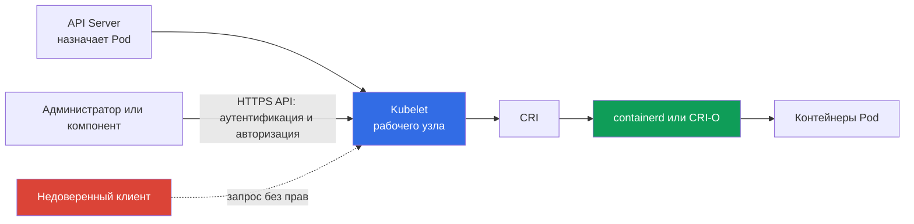

> **Язык:** русский. Переводы будут добавлены после публикации соответствующих файлов.

# Глава 08. Безопасность узла: Kubelet, Container Runtime, KubeProxy

> **Что дальше.** В [предыдущей главе](../07/ru.md) control plane был рассмотрен как центр управления кластером. Эта глава переносит внимание на рабочий узел: именно здесь `kubelet` запускает `Pod`, container runtime создаёт контейнеры, а `kube-proxy` направляет трафик к `Service`. Это часть домена KCSA **Kubernetes Cluster Component Security** с весом 22%.

## 08.1 Kubelet и его API

`kubelet` - агент Kubernetes на каждом рабочем узле. Он получает назначенные ему `Pod` через API Server, следит за их жизненным циклом и обращается к container runtime через CRI. Для диагностики и управления `kubelet` предоставляет HTTPS API, обычно на порту `10250`.

Этот API полезен администратору, но опасен при неправильной защите. Через него можно получить сведения о подах узла, выполнить диагностические действия и в зависимости от разрешений взаимодействовать с контейнерами. Доступ к API Kubelet не должен быть побочным следствием того, что клиент находится в сети кластера.

Три понятия часто встречаются в вопросах:

| Настройка или механизм | Что контролирует | Безопасный смысл |
|---|---|---|
| `--anonymous-auth` | Может ли неаутентифицированный клиент обратиться к API Kubelet | Отключить анонимный доступ: `false` |
| authorization mode | Проверяется ли право уже аутентифицированного клиента на конкретное действие | Использовать проверку полномочий, обычно `Webhook`, а не безусловное разрешение |
| `--read-only-port` | Старый HTTP-порт Kubelet без полноценной аутентификации и авторизации | Отключить, задав `0` |

При `--anonymous-auth=true` клиент без учётных данных может получить доступ к конечным точкам, доступным анонимному пользователю. Даже если ответы кажутся безобидными, метаданные о подах, образах и узле помогают атакующему. Поэтому принцип прост: Kubelet API доступен только по защищённому каналу, только известным субъектам и только для необходимых операций.

`Webhook` authorization передаёт решение об авторизации API Server. Так Kubelet использует центральные правила RBAC вместо локального набора исключений. Это не отменяет сетевые ограничения: firewall, security group или `NetworkPolicy` для компонентов должны сужать круг источников, которые вообще могут достичь порта `10250`.

После настройки безопасной конфигурации Kubelet также нужно доказательство, что она не была изменена задним числом. Мониторинг целостности файлов или конфигурации на узле (file integrity/configuration monitoring), который фиксирует и оповещает о неожиданных изменениях файлов конфигурации Kubelet, - практика, дающая такое evidence постфактум: она отдельна от самой настройки `--anonymous-auth` или authorization mode и относится к общей модели node hardening evidence, а не к единственному специфичному инструменту.

## 08.2 Container runtime, CRI и сокеты

Container runtime создаёт контейнеры и управляет ими на узле. В современных кластерах часто используются `containerd` или CRI-O. Kubernetes общается с ними через **Container Runtime Interface (CRI)**, поэтому `kubelet` не зависит от внутреннего API конкретного runtime.

Связь обычно идёт через Unix domain socket. Примеры путей: `/run/containerd/containerd.sock` для `containerd` и `/var/run/crio/crio.sock` для CRI-O. Путь зависит от дистрибутива и конфигурации, но риск одинаков: процесс, имеющий право обращаться к сокету runtime, может управлять контейнерами узла с очень высокими привилегиями.

| Объект | Роль | Риск при чрезмерном доступе |
|---|---|---|
| CRI | контракт между `kubelet` и runtime | сам по себе не граница доступа |
| runtime socket | локальный интерфейс управления runtime | запуск, остановка и инспекция контейнеров, возможный захват узла |
| `containerd` / CRI-O | реализация жизненного цикла контейнеров | компрометация процесса или его конфигурации влияет на все поды узла |

Не монтируйте socket runtime в прикладной `Pod` и не выдавайте его CI-задаче только ради удобной сборки или отладки. Такой mount сопоставим с передачей управления хостом. Ограничивайте права на файл сокета, запускайте только необходимые привилегированные системные компоненты и контролируйте, кто может создавать `Pod` с `hostPath` или `privileged: true`.

Docker исторически был распространённым runtime, но Kubernetes использует CRI, а не Docker API как штатный интерфейс. Поэтому в вопросе о современном взаимодействии `kubelet` и `containerd` верный термин - CRI и его сокет, а не Docker socket.

## 08.3 KubeProxy и поверхность сетевой атаки

`kube-proxy` работает на узлах и реализует сетевую часть абстракции `Service`: перенаправляет трафик с виртуального `ClusterIP` и портов `NodePort` к подходящим endpoint. В Linux доступны режимы `iptables`, `nftables` и IPVS. В текущей документации Kubernetes v1.37 default остаётся `iptables`; `nftables` (Linux kernel 5.13+) рекомендуется как замена deprecated с v1.35 IPVS. `kube-proxy` не является шифрующим прокси приложений и не заменяет `NetworkPolicy`.

| Механизм | Что делает | Что не делает |
|---|---|---|
| `iptables` mode | создаёт правила перенаправления пакетов к endpoint | не проверяет бизнес-авторизацию приложения |
| `nftables` mode | создаёт правила `nftables` для перенаправления `Service`; подходит как замена IPVS на поддерживаемом Linux | не заменяет сегментацию сети |
| IPVS mode | использует IP Virtual Server для балансировки `Service`; deprecated с Kubernetes v1.35 | не заменяет сегментацию сети; заменой служит `nftables`, а при его недоступности рассматривают `iptables` |
| `NetworkPolicy` | ограничивает допустимые потоки между подами и сетями при поддержке CNI | не строит правила `Service` и не заменяется `kube-proxy` |

Компрометация `kube-proxy`, его конфигурации или хоста позволяет атакующему наблюдать и менять сетевую обработку этого узла: нарушать доступность, перенаправлять часть трафика или обходить ожидаемый путь к сервису. Защита начинается не с выбора режима `iptables`, `nftables` или IPVS, а с защиты самого узла: актуальная ОС, минимальный доступ администратора, ограничение учетных данных компонента, защищённые каналы к API Server и наблюдение за необычными изменениями сетевых правил. Для Linux-узлов с поддержкой `nftables` его выбирают вместо deprecated IPVS; при этом текущий default Kubernetes v1.37 остаётся `iptables`. Это не отменяет отдельного CNI-enforcement для `NetworkPolicy`.

Для KCSA важно различать роли. `kube-proxy` обеспечивает достижимость `Service`; CNI обеспечивает подключение подов к сети и может применять `NetworkPolicy`; mTLS и service mesh решают отдельную задачу криптографической идентификации и шифрования трафика.

## 08.4 Что означает компрометация узла

Рабочий узел - сильная граница доверия, но не абсолютная изоляция между размещёнными на нём подами. Пользователь с root-доступом к узлу может вмешиваться в runtime, сетевые правила и локальные данные. Практический результат зависит от конфигурации кластера, но модель угроз должна исходить из серьёзного инцидента.

Атакующий, захвативший узел, потенциально получает:

- управление контейнерами и их процессами через runtime;
- доступ к файловым системам и сетевому трафику подов, размещённых на этом узле;
- service account tokens и секреты, смонтированные в эти поды;
- возможность подменить или наблюдать работу `kubelet` и `kube-proxy`;
- точку для латерального перемещения при слабом RBAC, слишком широких токенах или открытых сетевых путях.

Это не означает автоматический доступ ко всем секретам кластера. Например, секрет, не смонтированный в под на скомпрометированном узле, не обязан быть доступен только из-за захвата одного узла. Но широкий `ServiceAccount`, доступ к API Server или привилегированные поды могут быстро расширить последствия.

Defense in depth уменьшает радиус поражения: размещайте чувствительные рабочие нагрузки отдельно, используйте `Pod Security Standards`, least-privilege RBAC, `NetworkPolicy`, короткоживущие учётные данные, шифрование и надёжные границы инфраструктуры. Обновление узлов, аудит и мониторинг также важны: защита не гарантирует отсутствие инцидента, но помогает заметить его и ограничить последствия.

## 08.5 Как это применяют на практике

Команда платформы рассматривает рабочий узел как небольшой сервер управления контейнерами, а не как прозрачную часть Kubernetes. Типовой подход выглядит так:

1. Защищают Kubelet API: отключают anonymous access и read-only port, включают проверку авторизации, разрешают порт `10250` только нужным источникам.
2. Проверяют права на сокеты `containerd` или CRI-O и ищут опасные mounts в манифестах. Прикладные поды не получают доступ к runtime socket.
3. Ограничивают создание привилегированных подов, `hostPath`, `hostNetwork` и других настроек, связывающих под с узлом. Для этого сочетают RBAC, Pod Security Admission и admission policies.
4. Минимизируют последствия: разделяют чувствительные рабочие нагрузки, ограничивают их сетевые права и следят за признаками компрометации узла и неожиданными изменениями правил сети.

Это не лабораторная последовательность команд. Конкретные флаги и пути проверяют в документации дистрибутива и в конфигурации своего кластера: managed Kubernetes может скрывать часть control plane, но рабочие узлы и их границы всё равно требуют внимания.

## 08.6 Exam vocabulary / Мини-глоссарий

| Термин | Значение |
|---|---|
| `kubelet` | Агент Kubernetes на рабочем узле, управляющий назначенными ему подами. |
| Kubelet API | HTTPS-интерфейс Kubelet для операций и диагностики на узле. |
| CRI | Стандартный интерфейс Kubernetes между `kubelet` и container runtime. |
| container runtime | Компонент, создающий и запускающий контейнеры, например `containerd` или CRI-O. |
| runtime socket | Unix-сокет, через который клиент управляет container runtime. |
| `kube-proxy` | Компонент, реализующий сетевую абстракцию `Service` на узлах. |
| `iptables` | Режим реализации перенаправления трафика `Service` в `kube-proxy`. |
| `nftables` | Режим `kube-proxy`; на поддерживаемом Linux рекомендован как замена deprecated IPVS. |
| IPVS | Устаревающий с Kubernetes v1.35 режим балансировки `Service` в `kube-proxy`. |

## 08.7 Exam Essentials / Итоги главы

- `kubelet` управляет подами на рабочем узле, а его API должен требовать аутентификации и авторизации.
- `--anonymous-auth=false` и отключённый read-only port убирают простые пути неаутентифицированного доступа к Kubelet.
- CRI связывает Kubelet с `containerd` или CRI-O; доступ к runtime socket почти равен привилегированному доступу к узлу.
- `kube-proxy` реализует маршрутизацию `Service` через `iptables`, `nftables` или IPVS. В Kubernetes v1.37 default — `iptables`; `nftables` рекомендован на поддерживаемом Linux вместо IPVS, deprecated с v1.35. Он не заменяет `NetworkPolicy` и не шифрует трафик.
- Захват узла ставит под угрозу размещённые на нём поды, их смонтированные данные, сетевую обработку и может стать началом латерального перемещения.

## 08.8 Не путать и как это встречается на экзамене

В MCQ обычно проверяют соответствие между компонентом и его функцией, а также наиболее безопасный вариант из нескольких. Типичные ловушки:

- путать Kubelet с API Server: Kubelet управляет подами конкретного узла, API Server является центральной точкой API;
- считать, что read-only port подходит для безопасной диагностики: отсутствие полноценной проверки доступа делает его ненужным риском;
- путать CRI socket с обычным файлом конфигурации: доступ к нему даёт интерфейс управления runtime;
- приписывать `kube-proxy` функции `NetworkPolicy`, шифрования или mTLS, либо считать IPVS рекомендуемым режимом для нового кластера;
- делать вывод, что захват одного узла автоматически открывает все секреты всего кластера, не учитывая размещение подов и полномочия учётных данных.

Выбирая ответ, сначала определите границу: API Kubelet, локальный runtime, сетевой путь `Service` или учётные данные пода. Затем оцените, какая настройка уменьшает доступ или радиус поражения.

## 08.9 Вопросы для самопроверки

### 1. Какая настройка Kubelet устраняет неаутентифицированный доступ именно к его основному (HTTPS) API?

a. `--authorization-mode=AlwaysAllow`

b. `--anonymous-auth=false`

c. Включение IPVS в `kube-proxy`

d. `--read-only-port=10255`

Ответ и разбор

**Верный ответ: b.** `--anonymous-auth=false` запрещает анонимные запросы к основному API kubelet. Это не устраняет отдельный риск: `--read-only-port` (вариант d) - самостоятельный, необязательный legacy endpoint без какой-либо аутентификации или авторизации; его нужно отключать отдельно (`--read-only-port=0`), а не считать закрытым через `--anonymous-auth`. `AlwaysAllow` не проверяет полномочия (это risk для authorization, а не для authentication). Режим IPVS относится к `kube-proxy`, не к API Kubelet.

### 2. Почему mount сокета `containerd` в прикладной `Pod` опасен?

a. Он лишь увеличивает размер образа.

b. Он позволяет контейнеру обращаться к API управления runtime и потенциально управлять контейнерами узла.

c. Он необходим для работы `NetworkPolicy`.

d. Он включает шифрование трафика между подами.

Ответ и разбор

**Верный ответ: b.** Runtime socket - привилегированный интерфейс управления контейнерами. Его не предоставляют обычным рабочим нагрузкам. Размер образа, шифрование и `NetworkPolicy` к этому доступу не относятся.

### 3. За какую задачу прежде всего отвечает `kube-proxy`?

a. Проверка образов на уязвимости.

b. Создание контейнеров через CRI.

c. Проверка RBAC для запросов к API Server.

d. Направление трафика `Service` к подходящим endpoint.

Ответ и разбор

**Верный ответ: d.** `kube-proxy` реализует сетевую абстракцию `Service` через `iptables`, `nftables` или IPVS. `nftables` stable с Kubernetes v1.33 и рекомендован вместо deprecated с v1.35 IPVS. `NetworkPolicy` применяет поддерживающий её CNI, а не `kube-proxy`; CRI использует Kubelet, RBAC обрабатывается в цепочке API Server, а сканирование образов относится к supply chain.

### 4. Какое утверждение точнее всего описывает последствия захвата рабочего узла?

a. Инцидент влияет только на `kube-proxy` и не касается контейнеров.

b. Атакующий гарантированно читает каждый `Secret` в etcd.

c. Атакующий может повлиять на размещённые на узле поды, их смонтированные данные и сетевую обработку; дальнейший масштаб зависит от полномочий и конфигурации.

d. Захват узла несущественен, если включён `NetworkPolicy`.

Ответ и разбор

**Верный ответ: c.** Root-доступ к узлу серьёзно нарушает доверие к локальным подам, runtime и сети. Но доступ ко всем данным кластера не следует считать автоматическим: он зависит от токенов, RBAC, размещения и других границ.

> **Куда дальше.** Для практической защиты входящих путей и узловых поверхностей изучите [главу 08 CKS: Secure Ingress с TLS](../../../cks/course/08/ru.md) и [главу 14 CKS: минимизация footprint хостовой ОС и безопасность runtime-демона](../../../cks/course/14/ru.md). В KCSA продолжите с [главой 09](../09/ru.md) о безопасности `Pod`, сети, storage и клиентских учётных данных.

[Оглавление](../README_RU.md) · [Глава 07](../07/ru.md) · [Глава 09](../09/ru.md)
