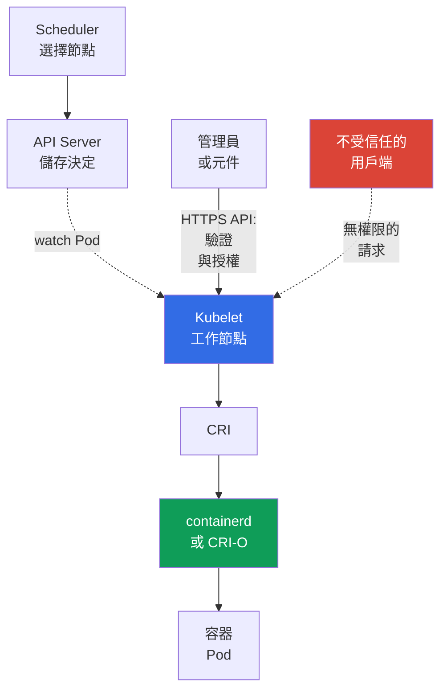

[Русская версия](ru.md) · [Eng version](README.md) · [Versión en español](es.md) · [Version française](fr.md) · [Deutsche Version](de.md) · [ქართული ვერსია](ge.md) · [日本語版](jp.md)

# 第 08 章。節點安全性：Kubelet、Container Runtime、KubeProxy

> **下一步。** 在[上一章](../07/tw.md)中，control plane 被視為叢集的控制中樞。本章將焦點轉向工作節點：`kubelet` 在此啟動 `Pod`，container runtime 建立容器，而 `kube-proxy` 將流量導向 `Service`。這是 KCSA **Kubernetes Cluster Component Security** 領域的一部分，權重為 22%。

## 08.1 Kubelet 與其 API

`kubelet` 是每個工作節點上的 Kubernetes agent。它不會透過 push 通知接收 `Pod`：kubelet 會自行開啟與 API Server 的 watch 連線（`GET .../pods?fieldSelector=spec.nodeName=<節點>&watch=true`），並訂閱 `spec.nodeName` 與其節點名稱相符之 `Pod` 的變更。當 `kube-scheduler` 將 `Pod` 指派到該節點，且 API Server 將更新後的物件儲存到 `etcd` 時，kubelet 會透過已開啟的 watch 接收事件、取得 `Pod` 描述，並透過 CRI 呼叫 container runtime 來啟動它。為了診斷與管理，`kubelet` 也會提供自己的 HTTPS API，通常使用連接埠 `10250`。

此 API 對管理員很有用，但若保護不當則十分危險。透過它可以取得節點上 Pod 的資訊、執行診斷動作，且可視權限與容器互動。對 Kubelet API 的存取不應只是因為用戶端位於叢集網路中而產生的附帶結果。

三個概念經常出現在題目中：

| 設定或機制 | 控制項目 | 安全含義 |
|---|---|---|
| `--anonymous-auth` | 未驗證的用戶端是否可以呼叫 Kubelet API | 停用匿名存取：`false` |
| authorization mode | 是否檢查已驗證用戶端對特定動作的權限 | 使用權限檢查，通常為 `Webhook`，而不是無條件允許 |
| `--read-only-port` | 沒有完整驗證與授權的舊版 Kubelet HTTP 連接埠 | 設為 `0` 以停用 |

使用 `--anonymous-auth=true` 時，沒有認證資料的用戶端可存取匿名使用者可用的 endpoint。即使回應看似無害，關於 Pod、image 與節點的中繼資料也能協助攻擊者。因此原則很簡單：Kubelet API 僅能透過受保護的通道、由已知主體、為必要操作而存取。

`Webhook` authorization 會讓 kubelet 透過 `SubjectAccessReview` 將請求檢查委派給 `kube-apiserver`；決定由設定在 API Server 上的 authorizer 鏈作出，通常包含 RBAC，而非本機的 `AlwaysAllow`。應使用 host firewall、cloud security groups / authorized-network controls 來限縮 kubelet `10250` 的網路可達性；若特定 CNI 支援 host/node policy，則使用相應的 CNI 機制。一般 Kubernetes `NetworkPolicy` 不可視為對 kubelet host endpoint 的通用防護。

hardening 後，最好監控 kubelet 設定是否偏離核准的 baseline。File-integrity/configuration monitoring 可以偵測及記錄非預期的變更，並提供已觀察到變更的 post-event evidence。此 evidence 的強度取決於 monitoring 是否持續啟用、是否受到防止篡改的保護，以及是否保留 tamper-resistant/centralized records；僅有 FIM 並不能證明篡改從未發生。

## 08.2 Container runtime、CRI 與 socket

Container runtime 在節點上建立並管理容器。現代叢集中常使用 `containerd` 或 CRI-O。Kubernetes 透過 **Container Runtime Interface (CRI)** 與它們通訊，因此 `kubelet` 不依賴特定 runtime 的內部 API。

通訊通常經由 Unix domain socket。路徑範例包括 `containerd` 的 `/run/containerd/containerd.sock`，以及 CRI-O 的 `/var/run/crio/crio.sock`。路徑取決於發行版與設定，但風險相同：有權存取 runtime socket 的程序能以極高權限管理節點容器。

| 物件 | 角色 | 過度存取時的風險 |
|---|---|---|
| CRI | `kubelet` 與 runtime 間的契約 | 本身不是存取邊界 |
| runtime socket | runtime 的本機管理介面 | 啟動、停止與檢查容器，可能取得節點控制權 |
| `containerd` / CRI-O | 容器生命週期的實作 | 程序或其設定遭入侵會影響節點上的所有 Pod |

不要將 runtime socket 掛載到應用程式 `Pod`，也不要只是為了方便建置或除錯就將它提供給 CI 工作。這類 mount 相當於交出 host 的控制權。限制 socket 檔案權限、僅執行必要的特權系統元件，並控制誰可以建立包含 `hostPath` 或 `privileged: true` 的 `Pod`。

Docker 在歷史上曾是常見的 runtime，但 Kubernetes 使用 CRI，而非 Docker API 作為標準介面。因此，關於現代 `kubelet` 與 `containerd` 互動的題目中，正確術語是 CRI 及其 socket，而非 Docker socket。

## 08.3 KubeProxy 與網路攻擊面

`kube-proxy` 在節點上執行，並設定核心層級的規則，將流量路由至 `Service` 抽象：它設定 `iptables`、`nftables` 或 IPVS，使發往虛擬 `ClusterIP` 與 `NodePort` 連接埠的封包重新導向到適當的 endpoint。在 Linux 上可使用 `iptables`、`nftables` 與 IPVS 模式。根據目前 Kubernetes v1.37 文件，default 仍為 `iptables`；在 Linux kernel 5.13+ 上，建議以 `nftables` 取代從 v1.35 起 deprecated 的 IPVS。`kube-proxy` 不是 userspace traffic proxy：它不會自行轉送封包，而是僅設定核心中的 netfilter/IPVS，後者接著處理流量。它也不是應用程式加密 proxy，且不會取代 `NetworkPolicy`。

| 機制 | 功能 | 不做的事 |
|---|---|---|
| `iptables` mode | 建立將封包重新導向至 endpoint 的規則 | 不檢查應用程式的商業授權 |
| `nftables` mode | 建立用於重新導向 `Service` 的 `nftables` 規則；適合作為支援 Linux 上的 IPVS 替代方案 | 不取代網路分段 |
| IPVS mode | 使用 IP Virtual Server 平衡 `Service` 負載；自 Kubernetes v1.35 起 deprecated | 不取代網路分段；替代方案為 `nftables`，無法使用時則考慮 `iptables` |
| `NetworkPolicy` | 在 CNI 支援時限制 Pod 與網路之間允許的流量 | 不建立 `Service` 規則，且不會被 `kube-proxy` 取代 |

`kube-proxy`、其設定或 host 遭入侵，會使攻擊者能觀察及變更該節點的網路處理：破壞可用性、重新導向部分流量，或繞過預期的 Service 路徑。防護不是從選擇 `iptables`、`nftables` 或 IPVS 模式開始，而是從保護節點本身開始：保持 OS 最新、最小化管理員存取、限制元件認證資料、保護連往 API Server 的通道，並監控不尋常的網路規則變更。對支援 `nftables` 的 Linux 節點，應選擇它來取代 deprecated IPVS；同時，目前 Kubernetes v1.37 的 default 仍是 `iptables`。這不會取消對 `NetworkPolicy` 的獨立 CNI-enforcement。

對 KCSA 而言，區分角色很重要。`kube-proxy` 確保 `Service` 的可達性；CNI 提供 Pod 網路連線，並可套用 `NetworkPolicy`；mTLS 與 service mesh 處理密碼學身分識別及流量加密這項不同的工作。

## 08.4 節點遭入侵的含義

工作節點是強大的信任邊界，但不是其上所部署 Pod 之間的絕對隔離。擁有節點 root 存取權的使用者可以干預 runtime、網路規則與本機資料。實際結果取決於叢集設定，但威脅模型應將其視為嚴重事件。

取得節點控制權的攻擊者可能獲得：

- 透過 runtime 控制容器及其程序；
- 存取部署在該節點之 Pod 的檔案系統與網路流量；
- 掛載到這些 Pod 的 service account tokens 與 secret；
- 取代或觀察 `kubelet` 與 `kube-proxy` 的運作；
- 在 RBAC 薄弱、token 過於寬泛或網路路徑開放時，作為橫向移動的據點。

這不表示會自動存取叢集中的所有 secret。例如，未掛載到遭入侵節點上的 Pod 的 secret，並不會僅因一個節點被控制就必然可用。但範圍過廣的 `ServiceAccount`、API Server 存取權或特權 Pod，可能迅速擴大後果。

Defense in depth 可縮小影響範圍：分開部署敏感工作負載、使用 `Pod Security Standards`、least-privilege RBAC、`NetworkPolicy`、短期認證資料、加密及可靠的基礎設施邊界。節點更新、稽核與監控也很重要：防護無法保證不發生事件，但可協助偵測事件並限制後果。

## 08.5 實務上的套用方式

平台團隊將工作節點視為小型容器管理伺服器，而非 Kubernetes 的透明部分。典型方法如下：

1. 保護 Kubelet API：停用 anonymous access 與 read-only port、啟用授權檢查，且僅允許所需來源存取連接埠 `10250`。
2. 檢查 `containerd` 或 CRI-O socket 的權限，並在 manifest 中尋找危險 mount。應用程式 Pod 不得存取 runtime socket。
3. 限制建立特權 Pod、`hostPath`、`hostNetwork` 及其他將 Pod 與節點連結的設定。為此可結合 RBAC、Pod Security Admission 與 admission policies。
4. 最小化後果：隔離敏感工作負載、限制其網路權限，並監控節點遭入侵跡象及意外網路規則變更。

這不是實驗室命令序列。應在發行版文件及自身叢集設定中確認具體 flag 與路徑：managed Kubernetes 可能隱藏部分 control plane，但工作節點及其邊界仍需注意。

## 08.6 Exam vocabulary / 迷你詞彙表

| 術語 | 含義 |
|---|---|
| `kubelet` | 工作節點上的 Kubernetes agent，管理指派給它的 Pod。 |
| Kubelet API | 用於節點操作與診斷的 Kubelet HTTPS 介面。 |
| CRI | Kubernetes 在 `kubelet` 與 container runtime 之間的標準介面。 |
| container runtime | 建立及執行容器的元件，例如 `containerd` 或 CRI-O。 |
| runtime socket | 用戶端透過它管理 container runtime 的 Unix socket。 |
| `kube-proxy` | 在節點上設定核心規則（`iptables`、`nftables` 或 IPVS）以將流量路由至 `Service` 的元件；它本身不是 userspace traffic proxy，實際封包轉送由核心完成。 |
| `iptables` | `kube-proxy` 中實作 `Service` 流量重新導向的模式。 |
| `nftables` | `kube-proxy` 模式；在支援的 Linux 上建議作為 deprecated IPVS 的替代方案。 |
| IPVS | 自 Kubernetes v1.35 起逐漸淘汰的 `kube-proxy` `Service` 負載平衡模式。 |

## 08.7 Exam Essentials / 本章重點

- `kubelet` 管理工作節點上的 Pod，其 API 必須要求驗證與授權。
- `--anonymous-auth=false` 以及停用 read-only port 可移除未驗證存取 Kubelet 的簡單路徑。
- CRI 將 Kubelet 與 `containerd` 或 CRI-O 連接；存取 runtime socket 幾乎等同於對節點的特權存取。
- `kube-proxy` 透過 `iptables`、`nftables` 或 IPVS 實作 `Service` 路由。在 Kubernetes v1.37 中 default 為 `iptables`；在支援的 Linux 上，建議使用 `nftables` 取代自 v1.35 起 deprecated 的 IPVS。它不取代 `NetworkPolicy`，也不加密流量。
- 控制節點會危及其上部署的 Pod、其掛載資料與網路處理，並可能成為橫向移動的起點。

## 08.8 不要混淆，以及它在考試中的出現方式

在 MCQ（multiple choice question，多選題）中，通常會測試元件與其功能的對應關係，以及多個選項中最安全的方案。典型陷阱包括：

- 將 Kubelet 與 API Server 混淆：Kubelet 管理特定節點的 Pod，API Server 是中央 API 端點；
- 認為 read-only port 適合安全診斷：缺乏完整存取檢查使它成為不必要的風險；
- 將 CRI socket 與一般設定檔混淆：存取它即取得 runtime 管理介面；
- 將 `NetworkPolicy`、加密或 mTLS 功能歸給 `kube-proxy`，或者認為 IPVS 是新叢集的建議模式；
- 推論控制一個節點會自動開放整個叢集的所有 secret，而未考量 Pod 部署位置與認證資料權限。

選擇答案時，先判定邊界：Kubelet API、本機 runtime、`Service` 網路路徑，或 Pod 認證資料。接著評估哪一項設定可降低存取權或影響範圍。

## 08.9 自我檢查問題

### 1. 哪項 Kubelet 設定可消除對其主要（HTTPS）API 的未驗證存取？

   - a. `--authorization-mode=AlwaysAllow`

   - b. `--anonymous-auth=false`

   - c. 在 `kube-proxy` 中啟用 IPVS

   - d. `--read-only-port=10255`

答案與說明

**正確答案：b。** `--anonymous-auth=false` 會禁止對主要 kubelet API 的匿名請求。這無法消除另一項風險：`--read-only-port`（選項 d）是獨立、可選的 legacy endpoint，沒有任何驗證或授權；必須另外停用它（`--read-only-port=0`），不能認為它會被 `--anonymous-auth` 關閉。`AlwaysAllow` 不檢查權限（這是 authorization 的 risk，而非 authentication）。IPVS 模式屬於 `kube-proxy`，而非 Kubelet API。

### 2. 為什麼在一般應用程式 `Pod` 中 mount `containerd` socket 是危險的？

   - a. 它僅讓應用程式存取自身 image layer 的 metadata，不會影響 runtime。
   - b. 它會開啟特權 runtime API，可能允許管理節點上的容器或其他 runtime 物件。
   - c. CNI 需要它才能將 Kubernetes `NetworkPolicy` 套用至 namespace 流量。
   - d. 它會自動在節點上的所有 Pod 之間啟用 mutual TLS authentication。

答案與說明

**正確答案：b。** Runtime socket 是 container runtime 的管理介面。將它提供給一般 workload，可能大幅擴大遭入侵容器對節點的影響。NetworkPolicy 與 workload mTLS 解決的是不同問題。

### 3. `kube-proxy` 主要負責哪項工作？

   - a. 掃描 image 漏洞。

   - b. 透過 CRI 建立容器。

   - c. 檢查對 API Server 請求的 RBAC。

   - d. 將 `Service` 流量導向適當的 endpoint。

答案與說明

**正確答案：d。** `kube-proxy` 透過 `iptables`、`nftables` 或 IPVS 實作 `Service` 網路抽象。`nftables` 自 Kubernetes v1.33 起 stable，且建議取代自 v1.35 起 deprecated 的 IPVS。`NetworkPolicy` 由支援它的 CNI 套用，而非由 `kube-proxy`；CRI 由 Kubelet 使用，RBAC 在 API Server 鏈中處理，而 image 掃描屬於 supply chain。

### 4. 哪項敘述最準確描述工作節點遭控制的後果？

   - a. 入侵只會影響 kube-proxy rules，不會影響部署的 workload。
   - b. 一個 worker 上的 root 自動表示可透過 API 讀取所有 namespace 中的任何 `Secret` 物件。
   - c. 攻擊者可影響本機 Pods、runtime、mounted data 與網路處理，而進一步擴大與否取決於可用的 credentials 與 permissions。
   - d. NetworkPolicy 會完全信任遭入侵的 host root，並排除對 workload data 的存取。

答案與說明

**正確答案：c。** 控制 host root 會破壞對本機 workload boundary 的信任，但進一步的 cluster-wide impact 取決於部署的資料、token、RBAC 及其他可用路徑。不能自動假定完整隔離，也不能假定無條件存取叢集的所有 Secrets。

> **下一步。** 若要實務保護輸入路徑與節點攻擊面，請學習 CKS 第 08 章：使用 TLS 保護 Ingress，以及 CKS 第 14 章：最小化 host OS footprint 與 runtime daemon 安全性。在 KCSA 中，繼續閱讀關於 `Pod`、網路、storage 與用戶端認證資料安全性的[第 09 章](../09/tw.md)。

[目錄](../README_TW.md) · [第 07 章](../07/tw.md) · [第 09 章](../09/tw.md)
