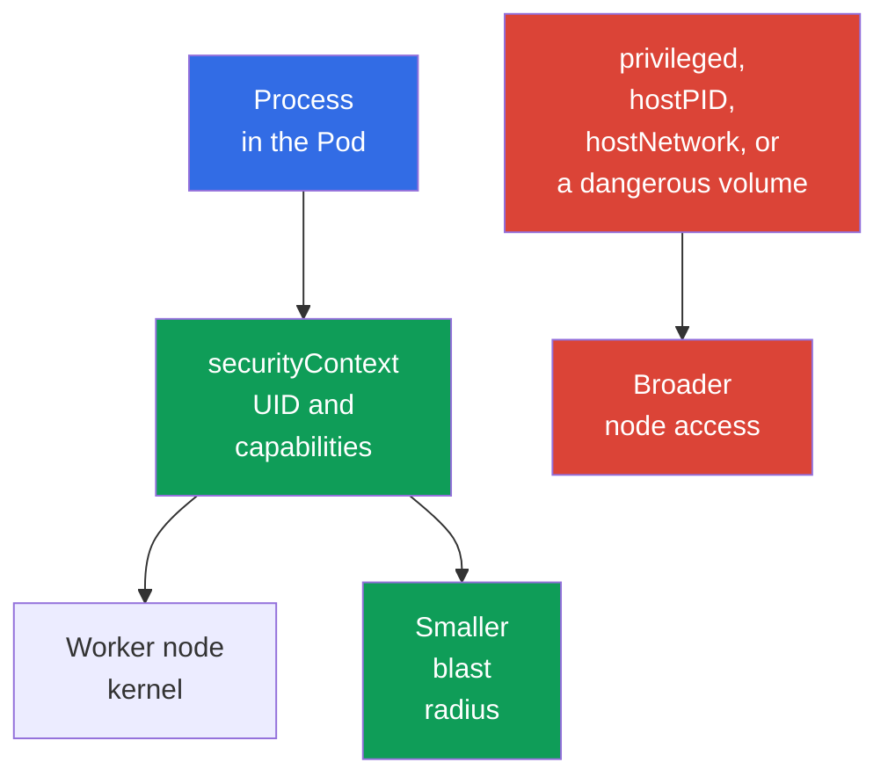

[Русская версия](ru.md) · [Versión en español](es.md) · [Version française](fr.md) · [Deutsche Version](de.md) · [ქართული ვერსია](ge.md) · [繁體中文版](tw.md) · [日本語版](jp.md)

# Chapter 09. Pod, container networking, storage, and client security

> **What comes next.** [Chapter 08](../08/README.md) covered the boundaries of a worker node: Kubelet, container runtime, and `kube-proxy`. Now we will examine what a developer or administrator works with most often: `Pod` settings, networking, volumes, and client credentials. This concludes the KCSA **Kubernetes Cluster Component Security** domain, weighted at 22%.

## 09.1 Security at the `Pod` level

A `Pod` combines one or more containers, their networking, and volumes. Its manifest can both restrict process privileges and give it a direct path to the worker node. Therefore, `securityContext` is an important protection layer, but not the only one: it does not replace RBAC, `NetworkPolicy`, image scanning, or node security.

The main idea is to grant a container only the privileges without which the application cannot work. An error made for convenience increases the impact of an application vulnerability or malicious image.

| Field or setting | Purpose | Risk or secure choice |
|---|---|---|
| `runAsNonRoot: true` | Prevents the container from running as UID 0 | Reduces the risk of running as root; the image must have a non-root user, or `runAsUser` must be set. |
| `capabilities` | Controls individual Linux privileges | Start with `drop: ["ALL"]`, then add only a justified capability. |
| `privileged: true` | Gives the container nearly all host capabilities | Dangerous for an ordinary workload and may make node compromise easier. |
| `hostPID: true` | Exposes the node process namespace | The container can see host processes and other Pods on the node. |
| `hostNetwork: true` | Uses the node network namespace | Removes normal `Pod` network isolation, creates port conflicts, and expands network visibility. |

`runAsNonRoot` does not make a container secure by itself. A process without UID 0 can still be dangerous with `privileged: true`, excessive capabilities, `hostPID`, or a dangerous volume. Likewise, not using `privileged` does not fix vulnerable code. A reliable model is built from several independent restrictions.

Below is a minimal example for an HTTP application in Kubernetes `v1.36`. It uses the `nginx-unprivileged` image, which is prepared for unprivileged execution and listens on port `8080` by default. The `containerPort` field only describes the container port for Kubernetes and the manifest reader; it does not itself change the port on which the process inside the image listens.

```yaml
apiVersion: v1
kind: Pod
metadata:
  name: web
spec:
  securityContext:
    runAsNonRoot: true
    seccompProfile:
      type: RuntimeDefault
  containers:
  - name: web
    image: nginxinc/nginx-unprivileged:1.30.4-alpine-slim
    ports:
    - containerPort: 8080
    securityContext:
      allowPrivilegeEscalation: false
      capabilities:
        drop: ["ALL"]
```

This baseline reduces process privileges: the workload runs as non-root, receives no additional Linux capabilities, cannot escalate privileges through a `no_new_privs`-compatible path, and uses `RuntimeDefault` seccomp. This is not a universal profile for every image: the application must still be compatible with a non-root UID and writable paths. `containerPort` is not a security control and does not reconfigure the application.



### Mental model: a container as a Linux process

A container is not a VM or a separate kernel, but a Linux process with a set of restrictions. Namespaces determine which PIDs, network, mounts, and other objects it sees; cgroups limit the resources available to it; capabilities grant individual privileged actions; seccomp filters system calls; AppArmor/SELinux apply mandatory access control policy. `securityContext` connects some of these decisions to a `Pod`.

> **Do not confuse.** A Namespace is not a security policy; a cgroup is not a sandbox; a capability is not full root; seccomp is not `NetworkPolicy`; AppArmor/SELinux do not filter syscalls instead of seccomp. `gVisor` and Kata Containers use OCI-compatible runtime interfaces, but provide a stronger execution boundary than typical `runc`: gVisor `runsc` implements the OCI Runtime Specification and places the workload behind a userspace application-kernel boundary, while Kata Containers runs container workloads inside lightweight VMs. These are runtime-isolation mechanisms, not replacements for RBAC, PSS/PSA, or NetworkPolicy. A complete comparison map and resource isolation are provided in [chapter 05](../05/README.md).

Within one `Pod`, containers deliberately share a network namespace and can communicate through localhost. Therefore, a `Pod` is a relevant workload boundary relative to other `Pod` objects, but not a promise of separate networking between its sidecar containers.

## 09.2 Container networking: CNI, traffic, and DNS

The **CNI** plugin connects a `Pod` to the network: it usually assigns an IP address and configures routing between Pods. The specific implementation depends on the cluster, for example Calico or Cilium, but the model is the same for a workload: a `Pod` can reach another `Pod` over the network, and a `Service` by its stable name or virtual IP.

A typical request path looks like this: an application resolves the name `api`, CoreDNS returns the `Service` address, and networking components direct the connection to a suitable endpoint. DNS is needed both for internal names such as `api.team.svc.cluster.local` and often for external dependencies. If egress is closed without allowing DNS, an application can lose not only internet access but also the ability to find cluster services.

| Component | Role | Important boundary |
|---|---|---|
| CNI | Connects a `Pod` to the network and can enforce network policies | Not every CNI implements `NetworkPolicy`. |
| CoreDNS | Resolves DNS names for services and external addresses | Does not provide authorization to an application. |
| `Service` | Provides a stable access point to a set of endpoints | Is not an access policy between Pods. |
| `NetworkPolicy` | Describes permitted ingress and egress for selected `Pod` objects | Works only with CNI support. |

Without isolating policies, pod-to-pod traffic is often allowed by default. If an attacker gains code execution in one `Pod`, a flat network makes service scanning, lateral movement, and data exfiltration easier. `NetworkPolicy` helps define allowed connections, for example, "frontend reaches only backend over TCP 8080". This is an allow model, not a replacement for TLS, RBAC, or application-side user verification.

Default-deny, ingress, egress, and selectors are covered in detail in [chapter 13](../13/README.md). When designing a policy, account separately for DNS, health checks, API access, and external dependencies: a secure policy must leave only truly required paths.

## 09.3 Volumes, `hostPath`, and data

A volume lets a container store or share data. Access to a volume means access to data, so choose it as carefully as a network permission. A container should have only required volumes, and filesystem permissions and `readOnly` mode must match the task.

`hostPath` mounts a worker node filesystem path into a `Pod`. This is sometimes necessary for a system agent, but dangerous for an ordinary application: the path can expose logs, configuration, data from other components, a runtime socket, or sensitive node files. Mounting `/`, `/var/lib/kubelet`, or a container runtime socket is especially dangerous and can lead to node compromise.

| Storage type or approach | When appropriate | Risk and control |
|---|---|---|
| `emptyDir` | Temporary data for the lifetime of a `Pod` | Not intended for long-term secrecy; data is available to containers in the same `Pod` with the mount. |
| PersistentVolume through CSI | Application data that must outlive a `Pod` | API access to PVC/PV is restricted by RBAC; admission policy can restrict allowed volume references and `storageClassName`; `accessModes` describe the supported mount/attachment model and are not a security ACL; access to data after mount is determined by filesystem/backend permissions and identity. |
| `hostPath` | A node agent with explicit trust | Directly connects a `Pod` to a node, so creating such Pods requires strict control. |
| `Secret` volume | Delivers a secret to a process as a file | Does not eliminate RBAC or the risk of a compromised container reading the secret. |

Volume encryption at rest is usually provided by the storage backend or CSI driver: it encrypts data on disk, while keys can reside in the KMS provider. This protects the medium, snapshot, or a stolen disk, but does not hide data from a container to which the volume is already mounted. Protecting traffic to remote storage requires a separate secure channel, usually TLS.

Separate four questions: (1) who can create or modify a `Pod` and `PVC`: RBAC; (2) which volume types and StorageClass objects are allowed: admission/policy; (3) where and in which mode a volume can technically attach/mount: CSI, topology, and `accessModes`; (4) who can read or modify data after mount: filesystem/backend permissions, workload identity, and encryption. `StorageClass` and `accessModes` are not authorization policies by themselves.

## 09.4 Client security: `kubeconfig` and `kubectl`

`kubeconfig` tells `kubectl` which API Server to contact, whom to trust, and which credentials to use for authentication. It can contain a client certificate and private key, bearer token, reference to an external login mechanism, or identity provider details. Such a file must not be considered harmless configuration: its exposure can grant access to the cluster with the corresponding subject's permissions.

A `kubectl` context connects a cluster, user, and namespace. A context mistake can send a command to production instead of test, while excessively broad credentials turn a simple mistake into an incident. Before a dangerous command, it is useful to check the current context and namespace, and to specify `--context` and `--namespace` explicitly for one-off actions.

| Practice | Why |
|---|---|
| Store `kubeconfig` with permissions available only to its owner | Reduces the risk of another user on the machine reading credentials. |
| Use separate identities and contexts for test and production | Reduces the likelihood of an erroneous action in production. |
| Issue short-lived credentials and least-privilege RBAC permissions | Limits the value and lifetime of a leaked credential. |
| Do not send `--token`, `kubeconfig`, or `Secret` output to shell history, logs, Git, or tickets | Prevents a common path for token leakage. |
| Check unfamiliar `kubeconfig` files and exec plugins | Configuration can specify an external executable plugin that must not be trusted without review. |

`kubectl` does not bypass RBAC: the server authenticates the subject from `kubeconfig`, then checks its permissions. However, local hygiene matters before that stage. For example, a token copied into a CI log or command history can be used by another client before it expires.

## 09.5 How this is applied in practice

The platform team defines a secure `Pod` baseline: a non-root process, an empty set of capabilities, and no `privileged` mode or host namespaces unless there is a documented exception. Admission policies and `Pod Security Admission` help avoid relying only on the manual attention of the manifest author.

For networking, the team first describes actual application connections, then introduces isolation and specific allowances. Rules include DNS and necessary dependencies, and the team also verifies that the CNI actually enforces `NetworkPolicy`.

For data, the team restricts creation of `hostPath` Pods, chooses storage with access control and encryption at rest, and treats access to volumes as access to data. Administration uses separate contexts, short-lived credentials, and least-privilege RBAC. This reduces risk, but does not eliminate the need for auditing, updates, and incident response.

## 09.6 Exam vocabulary / Mini-glossary

| Term | Meaning |
|---|---|
| `securityContext` | `Pod` or container fields that set UID, capabilities, and other process restrictions. |
| capability | An individual Linux privilege that can be granted or revoked independently of UID 0. |
| `privileged` | A container mode with very broad privileges relative to the host. |
| CNI | A standard and plugins for connecting containers to the Kubernetes network. |
| `NetworkPolicy` | A Kubernetes resource that describes permitted network traffic for selected `Pod` objects. |
| `hostPath` | A volume that mounts a worker node filesystem path into a `Pod`. |
| `kubeconfig` | Client configuration with the cluster address, trust data, and credentials. |
| context | The cluster, user, and namespace selection used by `kubectl`. |

## 09.7 Exam Essentials / Chapter summary

- `securityContext` restricts the `Pod` process, but a reliable baseline requires no unnecessary capabilities, `privileged`, `hostPID`, or `hostNetwork`.
- CNI provides Pod connectivity, DNS helps find services, and `NetworkPolicy` restricts network paths only with CNI support.
- Volumes provide data access; `hostPath` connects a `Pod` to a worker node and requires especially strict control. Encryption at rest protects the medium, but not a trusted mounted container.
- `kubeconfig`, client keys, and bearer tokens are credentials. Separate contexts, least privilege, and protection from leakage reduce the impact of an error or compromise.

## 09.8 Do not confuse, and how this appears on the exam

A KCSA question usually tests whether you can connect a mechanism to its boundary. `runAsNonRoot` relates to the process UID, a capability to an individual Linux privilege, `hostNetwork` to worker node networking, and `hostPath` to its filesystem. None of these mechanisms is a complete replacement for the others.

Typical pitfalls include assuming `NetworkPolicy` works without CNI support, confusing a `Service` with access control, considering volume encryption protection from an already compromised container, and treating `kubeconfig` as a file without secrets. In answer choices, select the control that protects the specified surface: process, network path, data, or client identity.

## 09.9 Self-check questions

### 1. Which set of settings best reduces the privileges of an ordinary container?

   - a. `hostNetwork: true` and `NET_ADMIN`

   - b. `privileged: true` and `hostPID: true`

   - c. `runAsNonRoot: true` and `capabilities.drop: ["ALL"]`

   - d. Only `containerPort: 8080`

<details>
<summary>Answer and explanation</summary>

**Correct answer: c.** Non-root execution and dropping capabilities reduce process privileges. The other choices grant additional host privileges or are not security controls at all.

</details>

### 2. What is required for `NetworkPolicy` to actually restrict `Pod` traffic?

   - a. Storing DNS records in a `ConfigMap`

   - b. `hostNetwork: true` for every `Pod`

   - c. `NetworkPolicy` support by the CNI in use

   - d. `kube-proxy` enabled in IPVS mode

<details>
<summary>Answer and explanation</summary>

**Correct answer: c.** The `NetworkPolicy` resource describes the desired rules, but a CNI with corresponding support enforces them. The `kube-proxy` mode, host networking, and where DNS records are stored do not provide this.

</details>

### 3. Why does `hostPath` require special control?

   - a. It always encrypts data on disk.

   - b. It creates a separate persistent disk for every `Pod`.

   - c. It can expose worker node files and privileged sockets to a container.

   - d. It prevents a container from accessing the network.

<details>
<summary>Answer and explanation</summary>

**Correct answer: c.** `hostPath` mounts a node path into a container. If the path is sensitive, the Pod can read host data or access the runtime management interface. Encryption and network isolation are not its properties.

</details>

### 4. Which practice best reduces the risk of an erroneous `kubectl` command in production?

   - a. Use separate contexts and identities for environments, check the active context, and grant the minimum required permissions.
   - b. Use one context for all environments, but rely only on different namespace names before running commands.
   - c. Disable TLS certificate verification so trust errors do not interfere with quickly switching between cluster endpoints.
   - d. Use one `cluster-admin` kubeconfig for all environments and distinguish production only through shell aliases.

<details>
<summary>Answer and explanation</summary>

**Correct answer: a.** Separate contexts/identities, checking the active context, and least privilege reduce the likelihood of an erroneous action and its impact. A shared administrative credential or disabled TLS verification increases risk.

</details>

> **Where to go next.** For a practical hardened `SecurityContext`, study CKS chapter 18 and CKA chapter 20. For network isolation, use CKS chapters 04-06 and CKA chapter 34. For data and credential protection, CKS chapter 21 is useful, while basic work with `Secret` is covered in CKA chapter 19. In KCSA, continue with [chapter 10](../10/README.md).

[Table of contents](../README.md) · [Chapter 08](../08/README.md) · [Chapter 10](../10/README.md)
