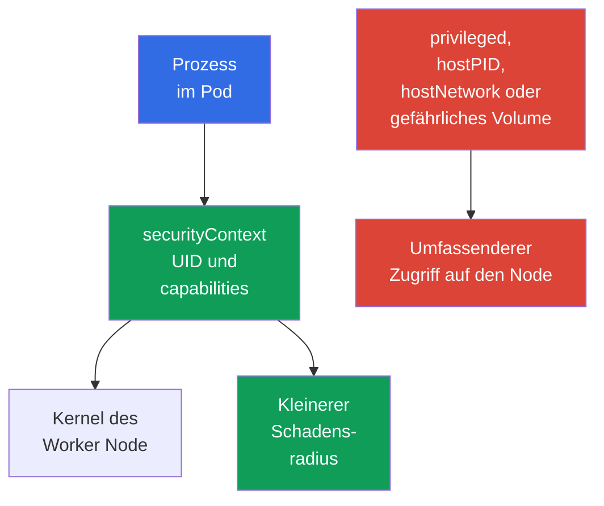

[Русская версия](ru.md) · [Eng version](README.md) · [Versión en español](es.md) · [Version française](fr.md) · [ქართული ვერსია](ge.md) · [繁體中文版](tw.md) · [日本語版](jp.md)

# Kapitel 09. Pod, Container-Netzwerk, Storage und Client-Sicherheit

> **Wie geht es weiter.** In [Kapitel 08](../08/de.md) wurden die Grenzen des Worker Node behandelt: Kubelet, Container Runtime und `kube-proxy`. Jetzt betrachten wir das, womit Entwickler oder Administratoren am häufigsten arbeiten: Einstellungen von `Pod`, Netzwerk, Volumes und Client-Anmeldedaten. Damit endet die KCSA-Domain **Kubernetes Cluster Component Security** mit einer Gewichtung von 22 %.

## 09.1 Sicherheit auf `Pod`-Ebene

Ein `Pod` fasst einen oder mehrere Container, ihr Netzwerk und ihre Volumes zusammen. Sein Manifest kann sowohl die Rechte eines Prozesses einschränken als ihm auch einen direkten Weg zum Worker Node geben. Daher ist `securityContext` eine wichtige Schutzschicht, aber nicht die einzige: Es ersetzt weder RBAC noch `NetworkPolicy`, Image-Prüfung oder Node-Schutz.

Die zentrale Idee besteht darin, einem Container nur die Rechte zu gewähren, ohne die die Anwendung nicht funktioniert. Ein Fehler zugunsten der Bequemlichkeit vergrößert die Folgen einer Schwachstelle in der Anwendung oder eines bösartigen Image.

| Feld oder Einstellung | Zweck | Risiko oder sichere Wahl |
|---|---|---|
| `runAsNonRoot: true` | Verhindert, dass der Container als UID 0 startet | Verringert das Risiko einer Ausführung als root; das Image muss einen non-root Benutzer haben oder `runAsUser` muss gesetzt werden. |
| `capabilities` | Steuert einzelne Linux-Privilegien | Beginn mit `drop: ["ALL"]`, anschließend nur begründete capability hinzufügen. |
| `privileged: true` | Gibt dem Container fast alle Fähigkeiten des Hosts | Gefährlich für gewöhnliche Workloads, kann die Übernahme eines Node erleichtern. |
| `hostPID: true` | Öffnet den Prozessnamensraum des Node | Der Container sieht Prozesse des Hosts und anderer Pods auf dem Node. |
| `hostNetwork: true` | Verwendet den Netzwerk-Namespace des Node | Hebt die gewöhnliche Netzwerkisolation des `Pod` auf, verursacht Portkonflikte und erweitert die Netzwerksichtbarkeit. |

`runAsNonRoot` macht einen Container nicht von selbst sicher. Ein Prozess ohne UID 0 kann bei `privileged: true`, übermäßigen capabilities, `hostPID` oder einem gefährlichen Volume weiterhin gefährlich sein. Umgekehrt behebt der Verzicht auf `privileged` keinen verwundbaren Code. Ein belastbares Modell besteht aus mehreren unabhängigen Einschränkungen.

Im Folgenden ein Minimalbeispiel für eine HTTP-Anwendung in Kubernetes `v1.36`. Es verwendet das Image `nginx-unprivileged`, das für einen nicht privilegierten Start vorbereitet ist und standardmäßig auf Port `8080` lauscht. Das Feld `containerPort` beschreibt den Container-Port nur für Kubernetes und den Leser des Manifests; es ändert nicht selbst den Port, auf dem der Prozess im Image lauscht.

```yaml
apiVersion: v1
kind: Pod
metadata:
  name: web
spec:
  securityContext:
    runAsNonRoot: true
    seccompProfile:
      type: RuntimeDefault
  containers:
  - name: web
    image: nginxinc/nginx-unprivileged:1.30.4-alpine-slim
    ports:
    - containerPort: 8080
    securityContext:
      allowPrivilegeEscalation: false
      capabilities:
        drop: ["ALL"]
```

Diese Baseline verringert die Prozessprivilegien: Der Workload wird als non-root ausgeführt, erhält keine zusätzlichen Linux capabilities, kann seine Privilegien nicht über einen mit `no_new_privs` kompatiblen Weg erhöhen und verwendet `RuntimeDefault` seccomp. Dies ist kein universelles Profil für jedes Image: Die Anwendung muss weiterhin mit einer non-root UID und beschreibbaren Pfaden kompatibel sein. `containerPort` ist kein security control und konfiguriert die Anwendung nicht um.



### Mentales Modell: Container als Linux process

Ein Container ist keine VM und kein separater Kernel, sondern ein Linux process mit einer Reihe von Einschränkungen. Namespaces bestimmen, welche PID, Netzwerke, mounts und anderen Objekte er sieht; cgroups begrenzen die verfügbaren Ressourcen; capabilities gewähren einzelne privileged Aktionen; seccomp filtert system calls; AppArmor/SELinux wenden mandatory access control policy an. `securityContext` verknüpft einen Teil dieser Entscheidungen mit dem `Pod`.

> **Nicht verwechseln.** Ein Namespace ist keine security policy; eine cgroup ist keine Sandbox; eine capability ist nicht gleich vollständigem root; seccomp ist keine `NetworkPolicy`; AppArmor/SELinux filtern keine syscalls anstelle von seccomp. `gVisor` und Kata Containers verwenden OCI-compatible Runtime-Interfaces, bieten jedoch eine stärkere execution boundary als ein typisches `runc`: gVisor `runsc` implementiert die OCI Runtime Specification und platziert den Workload hinter einer userspace application-kernel boundary, während Kata Containers den Container-Workload in einer lightweight VM ausführt. Dies sind Runtime-Isolationsmechanismen und kein Ersatz für RBAC, PSS/PSA oder NetworkPolicy. Eine vollständige Vergleichsübersicht und die Ressourcenisolation stehen in [Kapitel 05](../05/de.md).

Innerhalb eines `Pod` teilen Container bewusst den network namespace und können über localhost kommunizieren. Daher ist ein `Pod` gegenüber anderen `Pod` eine relevante workload boundary, verspricht aber kein separates Netzwerk zwischen seinen Sidecar-Containern.

## 09.2 Container-Netzwerk: CNI, Traffic und DNS

Das **CNI**-Plugin verbindet einen `Pod` mit dem Netzwerk: Es weist ihm gewöhnlich eine IP-Adresse zu und richtet das Routing zwischen Pods ein. Die konkrete Implementierung hängt vom Cluster ab, beispielsweise Calico oder Cilium, doch für den Workload ist das Modell einheitlich: Ein `Pod` kann einen anderen `Pod` über das Netzwerk erreichen und einen `Service` über einen stabilen Namen oder eine virtuelle IP.

Der gewöhnliche Anfragepfad sieht so aus: Die Anwendung fragt den Namen `api` ab, DNS CoreDNS liefert die Adresse des `Service` zurück und die Netzwerkkomponenten leiten die Verbindung an einen passenden Endpoint. DNS wird sowohl für interne Namen wie `api.team.svc.cluster.local` als auch häufig für externe Abhängigkeiten benötigt. Wird Egress ohne Freigabe von DNS gesperrt, kann die Anwendung nicht nur den Zugang zum Internet, sondern auch die Möglichkeit verlieren, Services im Cluster zu finden.

| Komponente | Rolle | Wichtige Grenze |
|---|---|---|
| CNI | Verbindet den `Pod` mit dem Netzwerk und kann Netzwerk-Policies anwenden | Nicht jedes CNI implementiert `NetworkPolicy`. |
| CoreDNS | Löst DNS-Namen von Services und externen Adressen auf | Bietet keine Autorisierung für die Anwendung. |
| `Service` | Bietet einen stabilen Zugriffspunkt für eine Reihe von Endpoints | Ist keine Zugriffs-Policy zwischen Pods. |
| `NetworkPolicy` | Beschreibt zulässigen Ingress und Egress für ausgewählte `Pod` | Wirkt nur bei Unterstützung durch CNI. |

Ohne isolierende Policies ist Pod-zu-Pod-Traffic oft standardmäßig erlaubt. Wenn ein Angreifer Code-Ausführung in einem `Pod` erlangt, erleichtert ein flaches Netzwerk das Scannen von Services, lateral movement und die Datenexfiltration. `NetworkPolicy` hilft dabei, erlaubte Verbindungen zu formulieren, etwa "frontend kommuniziert nur mit backend über TCP 8080". Dies ist ein Allow-Modell und kein Ersatz für TLS, RBAC oder die Prüfung des Benutzers durch die Anwendung.

Default-deny, Ingress, Egress und Selektoren werden ausführlich in [Kapitel 13](../13/de.md) behandelt. Beim Entwurf einer Policy werden DNS, Health Checks, der Zugriff auf die API und externe Abhängigkeiten getrennt berücksichtigt: Eine sichere Policy darf nur die tatsächlich erforderlichen Wege offenlassen.

## 09.3 Volumes, `hostPath` und Daten

Ein Volume erlaubt Containern, Daten zu speichern oder gemeinsam zu nutzen. Zugriff auf ein Volume bedeutet Zugriff auf Daten, deshalb wird es genauso sorgfältig gewählt wie eine Netzwerkfreigabe. Ein Container darf nur die erforderlichen Volumes haben, und die Dateisystemrechte sowie der Modus `readOnly` müssen der Aufgabe entsprechen.

`hostPath` mountet einen Dateisystempfad des Worker Node in einen `Pod`. Für einen Systemagenten ist dies manchmal nötig, für eine gewöhnliche Anwendung jedoch gefährlich: Der Pfad kann Logs, Konfiguration, Daten anderer Komponenten, einen Runtime Socket oder sensible Node-Dateien zugänglich machen. Das Mounten von `/`, `/var/lib/kubelet` oder eines Container-Runtime-Socket ist besonders gefährlich und kann zur Übernahme eines Node führen.

| Storage-Typ oder Ansatz | Wann angemessen | Risiko und Kontrolle |
|---|---|---|
| `emptyDir` | Temporäre Daten für die Lebensdauer eines `Pod` | Nicht für langfristige Geheimhaltung vorgesehen; die Daten sind Containern desselben `Pod` mit mount zugänglich. |
| PersistentVolume über CSI | Anwendungsdaten, die einen `Pod` überdauern müssen | Der API-Zugriff auf PVC/PV wird durch RBAC eingeschränkt; eine Admission-Policy kann zulässige volume references und `storageClassName` begrenzen; `accessModes` beschreiben das unterstützte Modell für mount/attachment und sind keine security ACL; der Datenzugriff nach dem Mount wird durch filesystem/backend permissions und identity bestimmt. |
| `hostPath` | Node-Agent mit explizitem Vertrauen | Verknüpft den `Pod` direkt mit dem Node, die Erstellung solcher Pods erfordert strenge Kontrolle. |
| `Secret` volume | Übergibt einem Prozess ein Secret als Datei | Hebt weder RBAC noch das Risiko auf, dass ein kompromittierter Container das Secret liest. |

Die Verschlüsselung eines Volume at rest wird üblicherweise vom Storage Backend oder CSI-Treiber bereitgestellt: Es verschlüsselt die Daten auf dem Datenträger, und die Schlüssel können beim KMS-Provider liegen. Dies schützt den Datenträger, einen Snapshot oder eine gestohlene Platte, verbirgt die Daten jedoch nicht vor dem Container, in dem das Volume bereits gemountet ist. Zum Schutz des Traffics zu Remote Storage ist ein separater geschützter Kanal erforderlich, üblicherweise TLS.

Trennen Sie vier Fragen: (1) Wer darf `Pod` und `PVC` erstellen oder ändern - RBAC; (2) welche Volume-Typen und StorageClass sind erlaubt - Admission/Policy; (3) wo und in welchem Modus ein Volume technisch attach/mount werden kann - CSI, Topology und `accessModes`; (4) wer die Daten nach dem Mount lesen oder ändern kann - filesystem/backend permissions, workload identity und encryption. `StorageClass` und `accessModes` sind für sich genommen keine authorization policy.

## 09.4 Client-Sicherheit: `kubeconfig` und `kubectl`

`kubeconfig` teilt `kubectl` mit, welchen API Server es ansprechen soll, wem es vertrauen kann und mit welchen Anmeldedaten es sich authentifiziert. Darin können ein client certificate und privater Schlüssel, ein bearer token, ein Verweis auf einen externen Login-Mechanismus oder Angaben zu einem identity provider stehen. Eine solche Datei darf nicht als harmlose Konfiguration gelten: Ihr Verlust kann Zugriff auf den Cluster mit den Rechten des entsprechenden Subjekts gewähren.

Ein `kubectl`-Kontext verknüpft cluster, user und namespace. Ein Fehler beim Kontext kann einen Befehl statt in test in production lenken, und zu weitreichende Anmeldedaten machen aus einem einfachen Fehler einen Incident. Vor einem gefährlichen Befehl ist es sinnvoll, den aktuellen context und namespace zu prüfen und für einmalige Aktionen explizit `--context` und `--namespace` anzugeben.

| Praxis | Warum |
|---|---|
| `kubeconfig` mit Berechtigungen speichern, die nur dem Eigentümer zugänglich sind | Verringert das Risiko, dass credentials von einem anderen Benutzer der Maschine gelesen werden. |
| Getrennte identities und contexts für test und production verwenden | Senkt die Wahrscheinlichkeit einer fehlerhaften Aktion in production. |
| Short-lived credentials und die geringstmöglichen RBAC-Rechte vergeben | Begrenzt den Wert und die Lebensdauer eines geleakten Kontos. |
| `--token`, `kubeconfig` und die Ausgabe von `Secret` nicht an Shell-History, Logs, Git oder Tickets weitergeben | Verhindert einen verbreiteten Weg, auf dem Tokens offengelegt werden. |
| Unbekannte `kubeconfig` und exec-Plugins prüfen | Die Konfiguration kann ein externes ausführbares Plugin angeben, dem ohne Prüfung nicht vertraut werden darf. |

`kubectl` umgeht RBAC nicht: Der Server authentifiziert das Subjekt aus `kubeconfig` und prüft dann seine Berechtigungen. Lokale Hygiene ist jedoch schon vor diesem Schritt wichtig. Beispielsweise kann ein in ein CI-Log oder in den Befehlsverlauf kopiertes Token von einem anderen Client bis zum Ablaufzeitpunkt verwendet werden.

## 09.5 Praktische Anwendung

Das Plattformteam legt eine sichere Baseline für `Pod` fest: non-root Prozess, leere Menge von capabilities sowie kein `privileged` und keine Host-Namespaces, sofern keine dokumentierte Ausnahme besteht. Admission-Policies und `Pod Security Admission` helfen, nicht allein auf die manuelle Sorgfalt des Verfassers eines Manifests angewiesen zu sein.

Für das Netzwerk beschreibt das Team zunächst die tatsächlichen Anwendungsbeziehungen und führt dann Isolation sowie gezielte Freigaben ein. Die Regeln beinhalten DNS und erforderliche Abhängigkeiten, außerdem wird geprüft, ob CNI `NetworkPolicy` tatsächlich anwendet.

Für Daten begrenzt das Team die Erstellung von `hostPath`-Pods, wählt Storage mit Zugriffskontrolle und Verschlüsselung at rest und betrachtet den Zugriff auf Volumes als Datenzugriff. Für die Administration werden getrennte contexts, kurzlebige credentials und least-privilege RBAC verwendet. Dies verringert das Risiko, ersetzt jedoch weder Audits und Updates noch die Reaktion auf Incidents.

## 09.6 Exam vocabulary / Mini-Glossar

| Begriff | Bedeutung |
|---|---|
| `securityContext` | Felder eines `Pod` oder Containers, die UID, capabilities und weitere Prozessbeschränkungen festlegen. |
| capability | Einzelnes Linux-Privileg, das unabhängig von UID 0 gewährt oder entzogen werden kann. |
| `privileged` | Container-Modus mit sehr weitreichenden Rechten gegenüber dem Host. |
| CNI | Standard und Plugins für die Verbindung von Containern mit dem Kubernetes-Netzwerk. |
| `NetworkPolicy` | Kubernetes-Ressource zur Beschreibung erlaubten Netzwerk-Traffics ausgewählter `Pod`. |
| `hostPath` | Volume, das einen Dateisystempfad des Worker Node in einen `Pod` mountet. |
| `kubeconfig` | Client-Konfiguration mit Cluster-Adresse, Vertrauensdaten und Konto. |
| context | Auswahl von cluster, user und namespace, die `kubectl` verwendet. |

## 09.7 Exam Essentials / Zusammenfassung des Kapitels

- `securityContext` beschränkt den Prozess eines `Pod`, aber eine belastbare Baseline erfordert das Fehlen unnötiger capabilities, von `privileged`, `hostPID` und `hostNetwork`.
- CNI stellt die Konnektivität von Pods bereit, DNS hilft beim Auffinden von Services und `NetworkPolicy` beschränkt Netzwerkpfade nur bei CNI-Unterstützung.
- Volumes geben Zugriff auf Daten; `hostPath` verknüpft einen `Pod` mit dem Worker Node und erfordert besonders strenge Kontrolle. Encryption at rest schützt den Datenträger, nicht aber einen vertrauenswürdigen gemounteten Container.
- `kubeconfig`, client keys und bearer tokens sind credentials. Getrennte contexts, least privilege und Schutz vor Leaks verringern die Folgen eines Fehlers oder einer Kompromittierung.

## 09.8 Nicht verwechseln und typische Prüfungsfragen

Eine KCSA-Frage prüft gewöhnlich, ob Sie einen Mechanismus mit seiner Grenze verknüpfen können. `runAsNonRoot` bezieht sich auf die UID des Prozesses, eine capability auf ein einzelnes Linux-Privileg, `hostNetwork` auf das Netzwerk des Worker Node und `hostPath` auf dessen Dateisystem. Keiner dieser Mechanismen ersetzt die anderen vollständig.

Typische Fallen: Anzunehmen, dass `NetworkPolicy` ohne CNI-Unterstützung funktioniert, `Service` mit Zugriffskontrolle zu verwechseln, die Verschlüsselung eines Volume als Schutz vor einem bereits kompromittierten Container anzusehen und `kubeconfig` für eine Datei ohne Secrets zu halten. Wählen Sie bei den Antwortoptionen die Kontrolle, die die angegebene Oberfläche schützt: Prozess, Netzwerkpfad, Daten oder Client-Identity.

## 09.9 Fragen zur Selbstkontrolle

### 1. Welche Einstellungskombination verringert die Privilegien eines gewöhnlichen Containers am besten?

   - a. `hostNetwork: true` und `NET_ADMIN`

   - b. `privileged: true` und `hostPID: true`

   - c. `runAsNonRoot: true` und `capabilities.drop: ["ALL"]`

   - d. Nur `containerPort: 8080`

<details>
<summary>Antwort und Erklärung</summary>

**Richtige Antwort: c.** Der Start als non-root und der Verzicht auf capabilities verringern die Prozessrechte. Die übrigen Optionen gewähren zusätzliche Host-Rechte oder sind überhaupt keine Sicherheitskontrollen.

</details>

### 2. Was ist erforderlich, damit `NetworkPolicy` den Traffic eines `Pod` tatsächlich beschränkt?

   - a. Speicherung von DNS-Einträgen in einer `ConfigMap`

   - b. `hostNetwork: true` für jeden `Pod`

   - c. Unterstützung von `NetworkPolicy` durch das verwendete CNI

   - d. Aktiviertes `kube-proxy` im IPVS-Modus

<details>
<summary>Antwort und Erklärung</summary>

**Richtige Antwort: c.** Die Ressource `NetworkPolicy` beschreibt die gewünschten Regeln, aber ein CNI mit entsprechender Unterstützung setzt sie durch. Der Modus von `kube-proxy`, Host-Netzwerk und der Speicherort von DNS-Einträgen gewährleisten dies nicht.

</details>

### 3. Warum erfordert `hostPath` besondere Kontrolle?

   - a. Es verschlüsselt Daten auf dem Datenträger immer.

   - b. Es erstellt für jeden `Pod` eine eigene persistente Platte.

   - c. Es kann dem Container Dateien und privilegierte Sockets des Worker Node zugänglich machen.

   - d. Es verbietet dem Container den Zugriff auf das Netzwerk.

<details>
<summary>Antwort und Erklärung</summary>

**Richtige Antwort: c.** `hostPath` mountet einen Node-Pfad in den Container. Wenn der Pfad sensibel ist, kann der Pod Host-Daten lesen oder Zugriff auf eine Runtime-Verwaltungsschnittstelle erhalten. Verschlüsselung und Netzwerkisolation gehören nicht zu seinen Eigenschaften.

</details>

### 4. Welche Praxis verringert das Risiko eines fehlerhaften `kubectl`-Befehls in production am besten?

   - a. Getrennte contexts und identities für Umgebungen verwenden, den aktiven context prüfen und die minimal erforderlichen Rechte vergeben.
   - b. Einen context für alle Umgebungen verwenden, sich vor der Befehlsausführung aber nur auf unterschiedliche Namespace-Namen verlassen.
   - c. Die TLS certificate verification deaktivieren, damit Vertrauensfehler den schnellen Wechsel zwischen cluster endpoints nicht behindern.
   - d. Einen `cluster-admin` kubeconfig für alle Umgebungen verwenden und production nur anhand von Shell-Aliases unterscheiden.

<details>
<summary>Antwort und Erklärung</summary>

**Richtige Antwort: a.** Getrennte contexts/identities, die Prüfung des aktiven context und least privilege verringern die Wahrscheinlichkeit einer fehlerhaften Aktion und ihre Folgen. Gemeinsame administrative credentials oder das Deaktivieren der TLS-Prüfung erhöhen das Risiko.

</details>

> **Wie geht es weiter.** Für einen praktischen gehärteten `SecurityContext` lesen Sie Kapitel 18 CKS und Kapitel 20 CKA. Für Netzwerkisolation verwenden Sie die Kapitel 04-06 CKS und Kapitel 34 CKA. Für den Schutz von Daten und credentials ist Kapitel 21 CKS hilfreich, während die grundlegende Arbeit mit `Secret` in Kapitel 19 CKA behandelt wird. Setzen Sie in KCSA mit [Kapitel 10](../10/de.md) fort.

[Inhaltsverzeichnis](../README_DE.md) · [Kapitel 08](../08/de.md) · [Kapitel 10](../10/de.md)