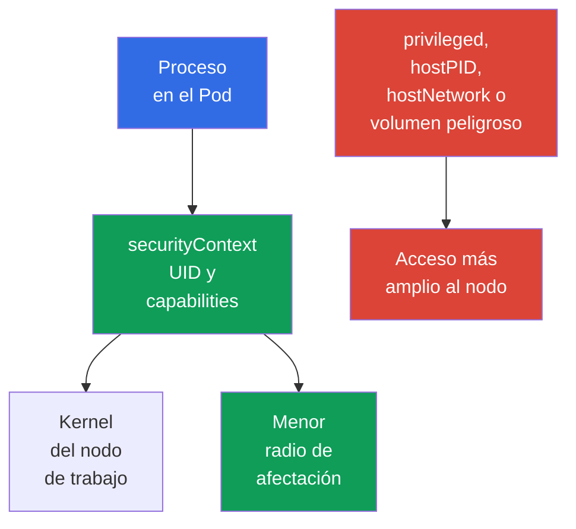

[Русская версия](ru.md) · [Eng version](README.md) · [Version française](fr.md) · [Deutsche Version](de.md) · [ქართული ვერსია](ge.md) · [繁體中文版](tw.md) · [日本語版](jp.md)

# Capítulo 09. Pod, red de contenedores, storage y seguridad del cliente

> **Qué sigue.** En el [capítulo 08](../08/es.md) se analizaron los límites del nodo de trabajo: Kubelet, container runtime y `kube-proxy`. Ahora examinaremos aquello con lo que un desarrollador o administrador trabaja más a menudo: la configuración de `Pod`, la red, los volúmenes y las credenciales de cliente. Esto completa el dominio KCSA **Kubernetes Cluster Component Security**, con un peso del 22%.

## 09.1 Seguridad en el nivel de `Pod`

`Pod` agrupa uno o varios contenedores, su red y sus volúmenes. Su manifiesto puede tanto restringir los permisos del proceso como darle una ruta directa al nodo de trabajo. Por ello, `securityContext` es una capa importante de protección, pero no la única: no sustituye a RBAC, `NetworkPolicy`, la verificación de la imagen ni la protección del nodo.

La idea principal es conceder al contenedor únicamente los permisos sin los cuales la aplicación no funciona. Un error a favor de la comodidad aumenta las consecuencias de una vulnerabilidad de la aplicación o de una imagen maliciosa.

| Campo o configuración | Para qué sirve | Riesgo o elección segura |
|---|---|---|
| `runAsNonRoot: true` | Impide ejecutar el contenedor como UID 0 | Reduce el riesgo de ejecutarlo como root; la imagen debe tener un usuario non-root o se debe establecer `runAsUser`. |
| `capabilities` | Gestiona privilegios individuales de Linux | Se empieza con `drop: ["ALL"]` y luego se añade únicamente una capability justificada. |
| `privileged: true` | Otorga al contenedor casi todas las capacidades del host | Es peligroso para una carga de trabajo común y puede facilitar la toma del nodo. |
| `hostPID: true` | Expone el espacio de procesos del nodo | El contenedor ve los procesos del host y de otros pods en el nodo. |
| `hostNetwork: true` | Usa el espacio de red del nodo | Elimina el aislamiento de red habitual del `Pod`, crea conflictos de puertos y amplía la visibilidad de la red. |

`runAsNonRoot` no hace seguro al contenedor por sí solo. Un proceso sin UID 0 aún puede ser peligroso con `privileged: true`, capabilities excesivas, `hostPID` o un volumen peligroso. Del mismo modo, renunciar a `privileged` no corrige código vulnerable. Un modelo fiable se construye a partir de varias restricciones independientes.

A continuación se presenta un ejemplo mínimo para una aplicación HTTP en Kubernetes `v1.36`. Se usa la imagen `nginx-unprivileged`, preparada para una ejecución sin privilegios y que escucha por defecto en el puerto `8080`. El campo `containerPort` solo describe el puerto del contenedor para Kubernetes y para quien lee el manifiesto; por sí solo no cambia el puerto que escucha el proceso dentro de la image.

```yaml
apiVersion: v1
kind: Pod
metadata:
  name: web
spec:
  securityContext:
    runAsNonRoot: true
    seccompProfile:
      type: RuntimeDefault
  containers:
  - name: web
    image: nginxinc/nginx-unprivileged:1.30.4-alpine-slim
    ports:
    - containerPort: 8080
    securityContext:
      allowPrivilegeEscalation: false
      capabilities:
        drop: ["ALL"]
```

Este baseline reduce los privilegios del proceso: la workload se ejecuta como non-root, no recibe capabilities adicionales de Linux, no puede escalar privilegios mediante una ruta compatible con `no_new_privs` y usa seccomp `RuntimeDefault`. No es un perfil universal para cualquier image: la aplicación debe seguir siendo compatible con un UID non-root y writable paths. `containerPort` no es un security control y no reconfigura la aplicación.



### Modelo mental: el contenedor como proceso Linux

Un contenedor no es una VM ni un kernel separado, sino un proceso Linux con un conjunto de restricciones. Los namespaces determinan qué PID, red, mounts y otros objetos ve; los cgroups limitan los recursos disponibles; las capabilities otorgan acciones privileged individuales; seccomp filtra system calls; AppArmor/SELinux aplican una policy de mandatory access control. `securityContext` vincula parte de estas decisiones con el `Pod`.

> **No confundir.** Un namespace no equivale a una security policy; un cgroup no es un sandbox; una capability no equivale a root completo; seccomp no es `NetworkPolicy`; AppArmor/SELinux no filtran syscalls en lugar de seccomp. `gVisor` y Kata Containers usan OCI-compatible runtime interfaces, pero proporcionan una execution boundary más fuerte que el `runc` típico: `runsc` de gVisor implementa OCI Runtime Specification y sitúa la workload tras una userspace application-kernel boundary, mientras que Kata Containers ejecuta la container workload dentro de una lightweight VM. Son mecanismos de runtime isolation, no sustitutos de RBAC, PSS/PSA ni NetworkPolicy. El mapa comparativo completo y el aislamiento de recursos se presentan en el [capítulo 05](../05/es.md).

Dentro de un mismo `Pod`, los contenedores comparten deliberadamente el network namespace y pueden comunicarse mediante localhost. Por ello, `Pod` es un límite de workload relevante con respecto a otros `Pod`, pero no promete una red separada entre sus contenedores sidecar.

## 09.2 Red de contenedores: CNI, tráfico y DNS

El plugin **CNI** conecta el `Pod` a la red: normalmente le asigna una dirección IP y configura el enrutamiento entre pods. La implementación concreta depende del clúster, por ejemplo Calico o Cilium, pero para la workload el modelo es uniforme: un `Pod` puede comunicarse con otro `Pod` por la red y con un `Service` mediante un nombre estable o una IP virtual.

La ruta habitual de una solicitud es la siguiente: la aplicación consulta el nombre `api`, DNS CoreDNS devuelve la dirección del `Service` y los componentes de red dirigen la conexión a un endpoint adecuado. DNS es necesario tanto para nombres internos como `api.team.svc.cluster.local` como, a menudo, para dependencias externas. Si se bloquea el egress sin permitir DNS, la aplicación puede perder no solo acceso a Internet, sino también la capacidad de encontrar servicios del clúster.

| Componente | Rol | Límite importante |
|---|---|---|
| CNI | Conecta el `Pod` a la red y puede aplicar políticas de red | No todos los CNI implementan `NetworkPolicy`. |
| CoreDNS | Resuelve nombres DNS de servicios y direcciones externas | No proporciona autorización para la aplicación. |
| `Service` | Ofrece un punto de acceso estable a un conjunto de endpoint | No es una política de acceso entre pods. |
| `NetworkPolicy` | Describe el ingress y egress permitidos para los `Pod` seleccionados | Solo tiene efecto con soporte de CNI. |

Sin políticas de aislamiento, el tráfico pod-to-pod suele estar permitido por defecto. Si un atacante logra ejecución de código en un `Pod`, una red plana facilita el escaneo de servicios, el lateral movement y la exfiltración de datos. `NetworkPolicy` ayuda a expresar las conexiones permitidas, por ejemplo, "frontend se comunica solo con backend mediante TCP 8080". Es un modelo allow, no un sustituto de TLS, RBAC o la verificación del usuario por la aplicación.

El default-deny, ingress, egress y los selectores se explican en detalle en el [capítulo 13](../13/es.md). Al diseñar una política se consideran por separado DNS, health checks, acceso a la API y dependencias externas: una política segura debe dejar únicamente las rutas realmente necesarias.

## 09.3 Volúmenes, `hostPath` y datos

Un volumen permite a un contenedor almacenar o compartir datos. El acceso al volumen implica acceso a los datos, por lo que se elige con la misma cautela que un permiso de red. El contenedor debe tener únicamente los volúmenes necesarios, y los permisos del sistema de archivos y el modo `readOnly` deben corresponder a la tarea.

`hostPath` monta una ruta del sistema de archivos del nodo de trabajo en un `Pod`. Para un agente de sistema esto a veces es necesario, pero para una aplicación común es peligroso: la ruta puede exponer logs, configuración, datos de otros componentes, un runtime socket o archivos sensibles del nodo. Montar `/`, `/var/lib/kubelet` o el socket del container runtime es especialmente peligroso y puede llevar a la toma del nodo.

| Tipo de almacenamiento o enfoque | Cuándo es adecuado | Riesgo y control |
|---|---|---|
| `emptyDir` | Datos temporales durante la vida del `Pod` | No está destinado a secretos de larga duración; los datos son accesibles a los contenedores del mismo `Pod` con un mount. |
| PersistentVolume mediante CSI | Datos de aplicación que deben sobrevivir al `Pod` | El acceso a la API de PVC/PV se limita con RBAC; una admission policy puede restringir las volume references y `storageClassName` permitidas; `accessModes` describe el modelo admitido de mount/attachment y no es una ACL de seguridad; el acceso a los datos tras el mount lo determinan los permisos del filesystem/backend y la identity. |
| `hostPath` | Agente de nodo con confianza explícita | Vincula directamente el `Pod` con el nodo y exige un control estricto de la creación de esos pods. |
| Volumen `Secret` | Entregar un secreto al proceso como archivo | No elimina RBAC ni el riesgo de que un contenedor comprometido lea el secreto. |

El cifrado de volumen at rest suele proporcionarlo el storage backend o el controlador CSI: cifra los datos en disco y las claves pueden residir en el KMS del proveedor. Esto protege el medio, el snapshot o un disco robado, pero no oculta los datos al contenedor al que ya se ha montado el volumen. Para proteger el tráfico hacia almacenamiento remoto se requiere un canal seguro independiente, normalmente TLS.

Diferencie cuatro preguntas: (1) quién puede crear o modificar `Pod` y `PVC`: RBAC; (2) qué tipos de volume y StorageClass están permitidos: admission/policy; (3) dónde y en qué modo se puede técnicamente hacer attach/mount del volume: CSI, topology y `accessModes`; (4) quién puede leer o modificar los datos después del mount: permisos de filesystem/backend, workload identity y encryption. `StorageClass` y `accessModes` por sí mismos no son una authorization policy.

## 09.4 Seguridad del cliente: `kubeconfig` y `kubectl`

`kubeconfig` indica a `kubectl` a qué API Server debe dirigirse, en quién confiar y con qué credenciales autenticarse. Puede contener un client certificate y una clave privada, un bearer token, una referencia a un mecanismo de inicio de sesión externo o datos sobre un identity provider. Este archivo no debe considerarse una configuración inofensiva: su filtración puede dar acceso al clúster con los permisos del sujeto correspondiente.

El contexto de `kubectl` vincula cluster, user y namespace. Un error de contexto puede dirigir un comando a production en lugar de test, y unas credenciales demasiado amplias convierten un simple error en un incidente. Antes de un comando peligroso es útil comprobar el context y namespace actuales y, para acciones puntuales, indicar explícitamente `--context` y `--namespace`.

| Práctica | Motivo |
|---|---|
| Guardar `kubeconfig` con permisos accesibles solo para el propietario | Reduce el riesgo de que otro usuario de la máquina lea las credentials. |
| Usar identities y contexts separados para test y production | Reduce la probabilidad de una acción equivocada en production. |
| Conceder short-lived credentials y los mínimos permisos RBAC | Limita el valor y la duración de una cuenta filtrada. |
| No enviar `--token`, `kubeconfig` ni la salida de `Secret` al shell history, logs, Git o tickets | Evita una vía habitual de filtración de tokens. |
| Revisar `kubeconfig` y plugins exec desconocidos | La configuración puede indicar un plugin ejecutable externo en el que no se debe confiar sin verificarlo. |

`kubectl` no elude RBAC: el servidor autentica al sujeto de `kubeconfig` y después comprueba sus permisos. Pero la higiene local es importante antes de esta etapa. Por ejemplo, un token copiado a un log de CI o al historial de comandos puede ser usado por otro cliente antes de caducar.

## 09.5 Cómo se aplica en la práctica

El equipo de plataforma establece un baseline seguro para `Pod`: proceso non-root, conjunto vacío de capabilities y ausencia de `privileged` y host namespaces, salvo que exista una excepción documentada. Las admission policies y `Pod Security Admission` ayudan a no depender solo de la atención manual del autor del manifiesto.

Para la red, el equipo primero describe las conexiones reales de las aplicaciones y después introduce aislamiento y permisos específicos. Las reglas incluyen DNS y las dependencias necesarias, y también se verifica que el CNI aplique realmente `NetworkPolicy`.

Para los datos, el equipo restringe la creación de pods `hostPath`, elige storage con control de acceso y cifrado at rest, y considera el acceso a volúmenes como acceso a datos. Para la administración se usan contexts separados, credentials de corta duración y RBAC de least privilege. Esto reduce el riesgo, pero no elimina la necesidad de auditoría, actualizaciones y respuesta a incidentes.

## 09.6 Vocabulario del examen / Miniglosario

| Término | Significado |
|---|---|
| `securityContext` | Campos de `Pod` o contenedor que establecen UID, capabilities y otras restricciones del proceso. |
| capability | Privilegio individual de Linux que puede concederse o revocarse independientemente del UID 0. |
| `privileged` | Modo de contenedor con permisos muy amplios respecto al host. |
| CNI | Estándar y plugins para conectar contenedores a la red de Kubernetes. |
| `NetworkPolicy` | Recurso Kubernetes para describir el tráfico de red permitido para los `Pod` seleccionados. |
| `hostPath` | Volumen que monta una ruta del sistema de archivos del nodo de trabajo en un `Pod`. |
| `kubeconfig` | Configuración de cliente con la dirección del clúster, datos de confianza y una cuenta. |
| context | Selección de cluster, user y namespace que usa `kubectl`. |

## 09.7 Conceptos esenciales del examen / Resumen del capítulo

- `securityContext` restringe el proceso de `Pod`, pero un baseline fiable exige la ausencia de capabilities innecesarias, `privileged`, `hostPID` y `hostNetwork`.
- CNI proporciona conectividad entre pods, DNS ayuda a encontrar servicios y `NetworkPolicy` restringe las rutas de red solo cuando el CNI lo admite.
- Los volúmenes dan acceso a los datos; `hostPath` vincula el `Pod` con el nodo de trabajo y requiere un control especialmente estricto. El encryption at rest protege el medio, pero no al contenedor de confianza que tiene el volumen montado.
- `kubeconfig`, client keys y bearer tokens son credentials. Los contexts separados, least privilege y la protección contra filtraciones reducen las consecuencias de un error o compromiso.

## 09.8 No confundir y cómo aparece en el examen

Una pregunta KCSA normalmente comprueba si puede asociar un mecanismo con su límite. `runAsNonRoot` se refiere al UID del proceso, capability a un privilegio individual de Linux, `hostNetwork` a la red del nodo de trabajo y `hostPath` a su sistema de archivos. Ninguno de estos mecanismos sustituye por completo a los demás.

Trampas habituales: suponer que `NetworkPolicy` funciona sin soporte de CNI, confundir `Service` con control de acceso, considerar el encryption del volumen como protección frente a un contenedor ya comprometido y tomar `kubeconfig` por un archivo sin secretos. En las opciones de respuesta, elija el control que protege la superficie indicada: proceso, ruta de red, datos o identity del cliente.

## 09.9 Preguntas de autoevaluación

### 1. ¿Qué conjunto de configuraciones reduce mejor los privilegios de un contenedor común?

   - a. `hostNetwork: true` y `NET_ADMIN`

   - b. `privileged: true` y `hostPID: true`

   - c. `runAsNonRoot: true` y `capabilities.drop: ["ALL"]`

   - d. Solo `containerPort: 8080`

<details>
<summary>Respuesta y explicación</summary>

**Respuesta correcta: c.** La ejecución non-root y la eliminación de capabilities reducen los permisos del proceso. Las otras opciones otorgan permisos adicionales del host o no son controles de seguridad en absoluto.

</details>

### 2. ¿Qué se necesita para que `NetworkPolicy` restrinja realmente el tráfico de `Pod`?

   - a. Almacenar registros DNS en `ConfigMap`

   - b. `hostNetwork: true` en cada `Pod`

   - c. Soporte de `NetworkPolicy` por el CNI usado

   - d. `kube-proxy` habilitado en modo IPVS

<details>
<summary>Respuesta y explicación</summary>

**Respuesta correcta: c.** El recurso `NetworkPolicy` describe las reglas deseadas, pero las aplica un CNI con el soporte correspondiente. El modo de `kube-proxy`, host network y el lugar donde se almacenan los registros DNS no proporcionan esto.

</details>

### 3. ¿Por qué `hostPath` requiere un control especial?

   - a. Siempre cifra los datos en disco.

   - b. Crea un persistent disk independiente para cada `Pod`.

   - c. Puede exponer al contenedor archivos y sockets privilegiados del nodo de trabajo.

   - d. Impide que el contenedor acceda a la red.

<details>
<summary>Respuesta y explicación</summary>

**Respuesta correcta: c.** `hostPath` monta una ruta del nodo en el contenedor. Si la ruta es sensible, el pod puede leer datos del host u obtener acceso a la interfaz de administración del runtime. El cifrado y el aislamiento de red no son propiedades suyas.

</details>

### 4. ¿Qué práctica reduce mejor el riesgo de ejecutar un comando `kubectl` equivocado en production?

   - a. Usar contexts e identities separados para los entornos, comprobar el context activo y conceder solo los permisos mínimos necesarios.
   - b. Usar un context para todos los entornos, pero depender únicamente de nombres de namespace distintos antes de ejecutar comandos.
   - c. Desactivar la verificación de certificados TLS para que los errores de confianza no impidan cambiar rápidamente entre endpoints de cluster.
   - d. Usar un único `cluster-admin` kubeconfig para todos los entornos y distinguir production solo mediante shell aliases.

<details>
<summary>Respuesta y explicación</summary>

**Respuesta correcta: a.** Los contexts/identities separados, comprobar el context activo y least privilege reducen la probabilidad de una acción errónea y sus consecuencias. Una credential administrativa compartida o desactivar la verificación TLS aumenta el riesgo.

</details>

> **Adónde seguir.** Para un `SecurityContext` hardened práctico, estudie el capítulo 18 de CKS y el capítulo 20 de CKA. Para el aislamiento de red, use los capítulos 04-06 de CKS y el capítulo 34 de CKA. Para la protección de datos y credentials es útil el capítulo 21 de CKS, y el trabajo básico con `Secret` se explica en el capítulo 19 de CKA. En KCSA, continúe con el [capítulo 10](../10/es.md).

[Índice](../README_ES.md) · [Capítulo 08](../08/es.md) · [Capítulo 10](../10/es.md)
