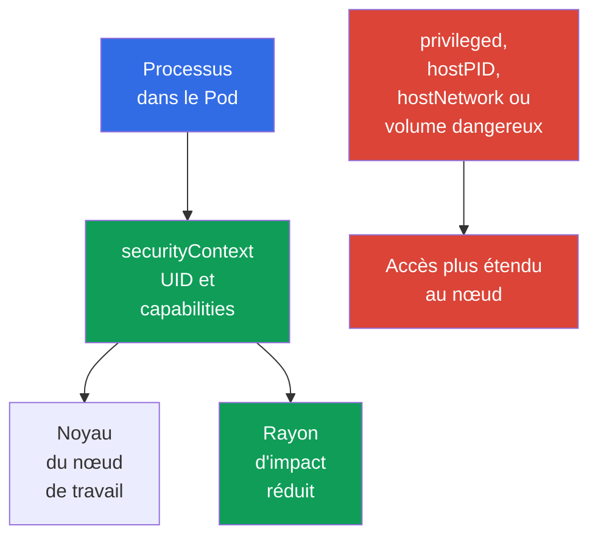

[Русская версия](ru.md) · [Eng version](README.md) · [Versión en español](es.md) · [Deutsche Version](de.md) · [ქართული ვერსია](ge.md) · [繁體中文版](tw.md) · [日本語版](jp.md)

# Chapitre 09. Pod, réseau des conteneurs, stockage et sécurité côté client

> **Et ensuite.** Le [chapitre 08](../08/fr.md) a traité des frontières du nœud de travail : Kubelet, container runtime et `kube-proxy`. Examinons maintenant ce avec quoi le développeur ou l'administrateur travaille le plus souvent : les réglages de `Pod`, le réseau, les volumes et les identifiants client. Ceci achève le domaine KCSA **Kubernetes Cluster Component Security**, dont le poids est de 22 %.

## 09.1 Sécurité au niveau du `Pod`

Un `Pod` regroupe un ou plusieurs conteneurs, leur réseau et leurs volumes. Son manifeste peut à la fois restreindre les droits du processus et lui donner un accès direct au nœud de travail. C'est pourquoi `securityContext` est une couche de protection importante, mais non unique : il ne remplace pas RBAC, `NetworkPolicy`, la vérification d'image ni la protection du nœud.

L'idée principale est de n'accorder au conteneur que les droits sans lesquels l'application ne fonctionne pas. Une erreur privilégiant la commodité augmente les conséquences d'une vulnérabilité de l'application ou d'une image malveillante.

| Champ ou réglage | Utilité | Risque ou choix sécurisé |
|---|---|---|
| `runAsNonRoot: true` | Empêche le lancement du conteneur avec l'UID 0 | Réduit le risque d'exécution en root ; l'image doit posséder un utilisateur non-root ou il faut définir `runAsUser`. |
| `capabilities` | Gère les privilèges Linux individuels | On commence avec `drop: ["ALL"]`, puis on ajoute uniquement une capability justifiée. |
| `privileged: true` | Donne au conteneur presque toutes les possibilités de l'hôte | Dangereux pour une charge de travail ordinaire, peut faciliter la compromission du nœud. |
| `hostPID: true` | Ouvre l'espace des processus du nœud | Le conteneur voit les processus de l'hôte et des autres pods sur le nœud. |
| `hostNetwork: true` | Utilise l'espace réseau du nœud | Supprime l'isolation réseau habituelle du `Pod`, crée des conflits de ports et étend la visibilité réseau. |

`runAsNonRoot` ne rend pas un conteneur sûr à lui seul. Un processus sans UID 0 peut tout de même être dangereux avec `privileged: true`, des capabilities excessives, `hostPID` ou un volume dangereux. De même, renoncer à `privileged` ne corrige pas un code vulnérable. Un modèle fiable repose sur plusieurs restrictions indépendantes.

Voici un exemple minimal pour une application HTTP sous Kubernetes `v1.36`. Il utilise l'image `nginx-unprivileged`, préparée pour une exécution non privilégiée et qui écoute par défaut sur le port `8080`. Le champ `containerPort` décrit seulement le port du conteneur pour Kubernetes et le lecteur du manifeste ; il ne modifie pas par lui-même le port écouté par le processus à l'intérieur de l'image.

```yaml
apiVersion: v1
kind: Pod
metadata:
  name: web
spec:
  securityContext:
    runAsNonRoot: true
    seccompProfile:
      type: RuntimeDefault
  containers:
  - name: web
    image: nginxinc/nginx-unprivileged:1.30.4-alpine-slim
    ports:
    - containerPort: 8080
    securityContext:
      allowPrivilegeEscalation: false
      capabilities:
        drop: ["ALL"]
```

Ce baseline réduit les privilèges du processus : la workload s'exécute en non-root, ne reçoit pas de capabilities Linux supplémentaires, ne peut pas élever ses privilèges par un chemin compatible avec `no_new_privs` et utilise le seccomp `RuntimeDefault`. Ce n'est pas un profil universel pour toute image : l'application doit toujours être compatible avec un UID non-root et des chemins accessibles en écriture. `containerPort` n'est pas un security control et ne reconfigure pas l'application.



### Modèle mental : le conteneur comme processus Linux

Un conteneur n'est pas une VM ni un noyau séparé, mais un processus Linux assorti d'un ensemble de restrictions. Les namespaces déterminent quels PID, réseau, mounts et autres objets il voit ; les cgroups limitent les ressources disponibles ; les capabilities accordent des actions privileged individuelles ; seccomp filtre les system calls ; AppArmor/SELinux appliquent une policy de mandatory access control. `securityContext` relie une partie de ces décisions au `Pod`.

> **À ne pas confondre.** Un Namespace n'est pas une security policy ; un cgroup n'est pas une sandbox ; une capability n'équivaut pas au root complet ; seccomp n'est pas une `NetworkPolicy` ; AppArmor/SELinux ne filtrent pas les syscalls à la place de seccomp. `gVisor` et Kata Containers utilisent des interfaces de runtime compatibles OCI, mais fournissent une frontière d'exécution plus forte que le `runc` typique : `runsc` de gVisor implémente l'OCI Runtime Specification et place la workload derrière une frontière userspace application-kernel, tandis que Kata Containers exécute la workload de conteneur dans une lightweight VM. Ce sont des mécanismes d'isolation du runtime, et non un remplacement de RBAC, PSS/PSA ou NetworkPolicy. Une carte comparative complète et l'isolation des ressources sont présentées dans le [chapitre 05](../05/fr.md).

Au sein d'un même `Pod`, les conteneurs partagent intentionnellement le network namespace et peuvent communiquer via localhost. Le `Pod` constitue donc une frontière de workload pertinente vis-à-vis des autres `Pod`, mais il ne promet pas un réseau séparé entre ses conteneurs sidecar.

## 09.2 Réseau des conteneurs : CNI, trafic et DNS

Le plugin **CNI** connecte le `Pod` au réseau : il lui attribue généralement une adresse IP et configure le routage entre les pods. L'implémentation précise dépend du cluster, par exemple Calico ou Cilium, mais le modèle est le même pour la workload : un `Pod` peut joindre un autre `Pod` par le réseau et un `Service` par un nom stable ou une IP virtuelle.

Le chemin habituel d'une requête est le suivant : l'application contacte le nom `api`, le DNS CoreDNS renvoie l'adresse du `Service`, puis les composants réseau dirigent la connexion vers un endpoint approprié. Le DNS est nécessaire tant pour les noms internes comme `api.team.svc.cluster.local` que, souvent, pour les dépendances externes. Si l'egress est fermé sans autoriser le DNS, l'application peut perdre non seulement l'accès à Internet, mais aussi la capacité de trouver les services du cluster.

| Composant | Rôle | Limite importante |
|---|---|---|
| CNI | Connecte le `Pod` au réseau et peut appliquer des politiques réseau | Tous les CNI n'implémentent pas `NetworkPolicy`. |
| CoreDNS | Résout les noms DNS des services et des adresses externes | Ne fournit pas d'autorisation à l'application. |
| `Service` | Fournit un point d'accès stable à un ensemble d'endpoint | N'est pas une politique d'accès entre pods. |
| `NetworkPolicy` | Décrit l'ingress et l'egress autorisés pour les `Pod` sélectionnés | Agit uniquement avec le support du CNI. |

Sans politiques d'isolation, le trafic pod-to-pod est souvent autorisé par défaut. Si un attaquant obtient l'exécution de code dans un `Pod`, un réseau plat facilite le scan des services, le lateral movement et l'exfiltration de données. `NetworkPolicy` aide à définir les connexions autorisées, par exemple « frontend contacte uniquement backend via TCP 8080 ». Il s'agit d'un modèle allow, et non d'un remplacement de TLS, RBAC ou de la vérification de l'utilisateur par l'application.

Le default-deny, l'ingress, l'egress et les sélecteurs sont détaillés dans le [chapitre 13](../13/fr.md). Lors de la conception d'une politique, il faut prendre séparément en compte le DNS, les health checks, l'accès à l'API et les dépendances externes : une politique sécurisée ne doit conserver que les chemins réellement nécessaires.

## 09.3 Volumes, `hostPath` et données

Un volume permet à un conteneur de stocker ou de partager des données. L'accès au volume signifie l'accès aux données ; il est donc choisi avec la même prudence qu'une autorisation réseau. Un conteneur ne doit disposer que des volumes nécessaires, et les droits du système de fichiers ainsi que le mode `readOnly` doivent correspondre à la tâche.

`hostPath` monte un chemin du système de fichiers du nœud de travail dans le `Pod`. Cela est parfois nécessaire pour un agent système, mais dangereux pour une application ordinaire : le chemin peut exposer des journaux, une configuration, les données d'autres composants, un runtime socket ou des fichiers sensibles du nœud. Monter `/`, `/var/lib/kubelet` ou le socket du container runtime est particulièrement dangereux et peut conduire à la compromission du nœud.

| Type de stockage ou approche | Quand l'utiliser | Risque et contrôle |
|---|---|---|
| `emptyDir` | Données temporaires pendant la durée de vie du `Pod` | N'est pas destiné au secret à long terme ; les données sont accessibles aux conteneurs du même `Pod` avec le mount. |
| PersistentVolume via CSI | Données d'application qui doivent survivre au `Pod` | L'accès API à PVC/PV est limité par RBAC ; une admission policy peut limiter les volume references et `storageClassName` admis ; `accessModes` décrit le modèle de mount/attachment pris en charge et n'est pas une security ACL ; l'accès aux données après le mount est déterminé par les permissions du filesystem/backend et l'identity. |
| `hostPath` | Agent de nœud bénéficiant d'une confiance explicite | Lie directement le `Pod` au nœud ; la création de tels pods nécessite un contrôle strict. |
| Volume `Secret` | Transmet un secret au processus sous forme de fichier | N'annule pas RBAC ni le risque de lecture du secret par un conteneur compromis. |

Le chiffrement d'un volume at rest est généralement assuré par le storage backend ou le pilote CSI : il chiffre les données sur le disque, et les clés peuvent résider dans le KMS du fournisseur. Cela protège le support, le snapshot ou le disque volé, mais ne masque pas les données au conteneur auquel le volume est déjà monté. La protection du trafic vers un stockage distant nécessite un canal sécurisé distinct, généralement TLS.

Distinguez quatre questions : (1) qui peut créer ou modifier un `Pod` et un `PVC` - RBAC ; (2) quels types de volume et quelles StorageClass sont autorisés - admission/policy ; (3) où et dans quel mode un volume peut techniquement être attach/mount - CSI, topology et `accessModes` ; (4) qui peut lire ou modifier les données après le mount - permissions du filesystem/backend, workload identity et encryption. `StorageClass` et `accessModes` ne constituent pas à eux seuls une authorization policy.

## 09.4 Sécurité côté client : `kubeconfig` et `kubectl`

`kubeconfig` indique à `kubectl` quel API Server contacter, auquel faire confiance et avec quels identifiants s'authentifier. Il peut contenir un client certificate et une clé privée, un bearer token, un lien vers un mécanisme de connexion externe ou des informations concernant un identity provider. Ce fichier ne doit pas être considéré comme une configuration inoffensive : sa fuite peut donner accès au cluster avec les droits du sujet correspondant.

Un context `kubectl` associe un cluster, un user et un namespace. Une erreur de context peut envoyer une commande vers production au lieu de test, et des identifiants trop larges transforment une simple erreur en incident. Avant une commande dangereuse, il est utile de vérifier le context et le namespace actuels, et pour les actions ponctuelles de spécifier explicitement `--context` et `--namespace`.

| Pratique | Pourquoi |
|---|---|
| Conserver `kubeconfig` avec des droits accessibles uniquement à son propriétaire | Réduit le risque que les credentials soient lus par un autre utilisateur de la machine. |
| Utiliser des identities et contexts distincts pour test et production | Réduit la probabilité d'une action erronée en production. |
| Accorder des credentials de courte durée et des droits RBAC minimaux | Limite la valeur et la durée de vie d'un compte ayant fuité. |
| Ne pas transmettre `--token`, `kubeconfig` ni la sortie de `Secret` dans l'historique shell, les logs, Git ou les tickets | Évite un chemin courant de fuite de tokens. |
| Vérifier les `kubeconfig` et les plugins exec inconnus | La configuration peut désigner un plugin externe exécutable auquel il ne faut pas faire confiance sans vérification. |

`kubectl` ne contourne pas RBAC : le serveur authentifie le sujet depuis `kubeconfig`, puis vérifie ses autorisations. Mais l'hygiène locale est importante avant cette étape. Par exemple, un token copié dans un log CI ou un historique de commandes peut être utilisé par un autre client avant son expiration.

## 09.5 Application pratique

L'équipe plateforme définit un baseline sécurisé pour les `Pod` : processus non-root, ensemble vide de capabilities, absence de `privileged` et de host namespaces, sauf exception documentée. Les admission policies et `Pod Security Admission` évitent de dépendre uniquement de l'attention manuelle de l'auteur du manifeste.

Pour le réseau, l'équipe décrit d'abord les connexions réelles des applications, puis introduit l'isolation et des autorisations ciblées. Les règles incluent le DNS et les dépendances nécessaires, tout en vérifiant que le CNI applique effectivement `NetworkPolicy`.

Pour les données, l'équipe limite la création de pods `hostPath`, choisit un stockage avec contrôle d'accès et chiffrement at rest, et considère l'accès aux volumes comme un accès aux données. Pour l'administration, elle utilise des contexts séparés, des credentials de courte durée et le RBAC du moindre privilège. Cela réduit le risque, mais n'élimine pas la nécessité d'auditer, de mettre à jour et de réagir aux incidents.

## 09.6 Vocabulaire d'examen / Mini-glossaire

| Terme | Signification |
|---|---|
| `securityContext` | Champs du `Pod` ou du conteneur définissant l'UID, les capabilities et d'autres restrictions du processus. |
| capability | Privilège Linux individuel qui peut être accordé ou retiré indépendamment de l'UID 0. |
| `privileged` | Mode de conteneur doté de droits très étendus par rapport à l'hôte. |
| CNI | Standard et plugins permettant de connecter les conteneurs au réseau Kubernetes. |
| `NetworkPolicy` | Ressource Kubernetes servant à décrire le trafic réseau autorisé pour les `Pod` sélectionnés. |
| `hostPath` | Volume qui monte dans le `Pod` un chemin du système de fichiers du nœud de travail. |
| `kubeconfig` | Configuration client contenant l'adresse du cluster, les données de confiance et le compte. |
| context | Sélection du cluster, du user et du namespace utilisée par `kubectl`. |

## 09.7 Exam Essentials / Points clés du chapitre

- `securityContext` restreint le processus du `Pod`, mais un baseline fiable exige l'absence de capabilities inutiles, de `privileged`, `hostPID` et `hostNetwork`.
- CNI assure la connectivité des pods, DNS aide à trouver les services et `NetworkPolicy` limite les chemins réseau uniquement si le CNI le prend en charge.
- Les volumes donnent accès aux données ; `hostPath` lie le `Pod` au nœud de travail et nécessite un contrôle particulièrement strict. Encryption at rest protège le support, mais pas un conteneur de confiance auquel le volume est monté.
- `kubeconfig`, les clés client et les bearer tokens sont des credentials. Des contexts distincts, le moindre privilège et la protection contre les fuites réduisent les conséquences d'une erreur ou d'une compromission.

## 09.8 À ne pas confondre et présence à l'examen

Une question KCSA vérifie généralement si vous savez relier un mécanisme à sa frontière. `runAsNonRoot` concerne l'UID du processus, capability un privilège Linux individuel, `hostNetwork` le réseau du nœud de travail et `hostPath` son système de fichiers. Aucun de ces mécanismes ne remplace totalement les autres.

Pièges fréquents : penser que `NetworkPolicy` fonctionne sans le support du CNI, confondre `Service` avec un contrôle d'accès, considérer le chiffrement d'un volume comme une protection contre un conteneur déjà compromis et prendre `kubeconfig` pour un fichier sans secrets. Dans les réponses proposées, choisissez le contrôle qui protège la surface indiquée : processus, chemin réseau, données ou identity client.

## 09.9 Questions d'auto-évaluation

### 1. Quel ensemble de réglages réduit le mieux les privilèges d'un conteneur ordinaire ?

   - a. `hostNetwork: true` et `NET_ADMIN`

   - b. `privileged: true` et `hostPID: true`

   - c. `runAsNonRoot: true` et `capabilities.drop: ["ALL"]`

   - d. Seulement `containerPort: 8080`

<details>
<summary>Réponse et explication</summary>

**Bonne réponse : c.** L'exécution non-root et l'abandon des capabilities réduisent les droits du processus. Les autres options accordent des droits hôte supplémentaires ou ne constituent pas du tout un contrôle de sécurité.

</details>

### 2. Que faut-il pour que `NetworkPolicy` limite réellement le trafic des `Pod` ?

   - a. Stocker les enregistrements DNS dans un `ConfigMap`

   - b. `hostNetwork: true` pour chaque `Pod`

   - c. La prise en charge de `NetworkPolicy` par le CNI utilisé

   - d. `kube-proxy` activé en mode IPVS

<details>
<summary>Réponse et explication</summary>

**Bonne réponse : c.** La ressource `NetworkPolicy` décrit les règles souhaitées, mais c'est le CNI avec le support correspondant qui les applique. Le mode `kube-proxy`, le host network et l'emplacement de stockage des enregistrements DNS ne garantissent pas cela.

</details>

### 3. Pourquoi `hostPath` exige-t-il un contrôle particulier ?

   - a. Il chiffre toujours les données sur le disque.

   - b. Il crée un persistent disk séparé pour chaque `Pod`.

   - c. Il peut exposer au conteneur les fichiers et sockets privilégiés du nœud de travail.

   - d. Il empêche le conteneur d'accéder au réseau.

<details>
<summary>Réponse et explication</summary>

**Bonne réponse : c.** `hostPath` monte un chemin du nœud dans le conteneur. Si ce chemin est sensible, le pod peut lire les données de l'hôte ou accéder à l'interface de gestion du runtime. Le chiffrement et l'isolation réseau ne sont pas ses propriétés.

</details>

### 4. Quelle pratique réduit le mieux le risque d'une commande `kubectl` erronée en production ?

   - a. Utiliser des contexts et identities distincts pour les environnements, vérifier le context actif et accorder les droits minimaux nécessaires.
   - b. Utiliser un seul context pour tous les environnements, mais se fier uniquement à des noms de namespace différents avant d'exécuter les commandes.
   - c. Désactiver la vérification des certificats TLS afin que les erreurs de confiance ne gênent pas les changements rapides entre les endpoints de cluster.
   - d. Utiliser un unique `kubeconfig` cluster-admin pour tous les environnements et distinguer production uniquement à l'aide de shell aliases.

<details>
<summary>Réponse et explication</summary>

**Bonne réponse : a.** Des contexts/identities séparés, la vérification du context actif et le moindre privilège réduisent la probabilité d'une action erronée et ses conséquences. Des credentials administrateur partagés ou la désactivation de la vérification TLS augmentent le risque.

</details>

> **Où aller ensuite.** Pour un `SecurityContext` hardened en pratique, étudiez le chapitre 18 CKS et le chapitre 20 CKA. Pour l'isolation réseau, utilisez les chapitres 04-06 CKS et le chapitre 34 CKA. Le chapitre 21 CKS est utile pour protéger les données et les credentials, tandis que le travail de base avec `Secret` est traité au chapitre 19 CKA. En KCSA, poursuivez avec le [chapitre 10](../10/fr.md).

[Table des matières](../README_FR.md) · [Chapitre 08](../08/fr.md) · [Chapitre 10](../10/fr.md)
