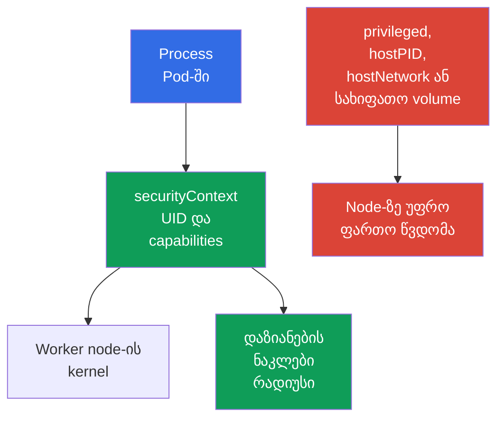

[Русская версия](ru.md) · [Eng version](README.md) · [Versión en español](es.md) · [Version française](fr.md) · [Deutsche Version](de.md) · [繁體中文版](tw.md) · [日本語版](jp.md)

# თავი 09. Pod, კონტეინერების ქსელი, storage და კლიენტის უსაფრთხოება

> **რა არის შემდეგ.** [თავში 08](../08/ge.md) განხილული იყო worker node-ის საზღვრები: Kubelet, container runtime და `kube-proxy`. ახლა განვიხილავთ იმას, რასთანაც დეველოპერს ან ადმინისტრატორს ყველაზე ხშირად უწევს მუშაობა: `Pod`-ის პარამეტრებს, ქსელს, volume-ებსა და კლიენტის credentials-ს. ამით სრულდება KCSA-ს დომენი **Kubernetes Cluster Component Security**, რომლის წონაა 22%.

## 09.1 უსაფრთხოება `Pod`-ის დონეზე

`Pod` აერთიანებს ერთ ან რამდენიმე კონტეინერს, მათ ქსელსა და volume-ებს. მის manifest-ს შეუძლია როგორც process-ის უფლებების შეზღუდვა, ისე მისთვის worker node-მდე პირდაპირი გზის მიცემა. ამიტომ `securityContext` დაცვის მნიშვნელოვანი ფენაა, თუმცა არა ერთადერთი: ის ვერ ჩაანაცვლებს RBAC-ს, `NetworkPolicy`-ს, image-ის შემოწმებასა და node-ის დაცვას.

მთავარი იდეაა, კონტეინერს მიეცეს მხოლოდ ის უფლებები, რომელთა გარეშეც აპლიკაცია ვერ იმუშავებს. მოხერხებულობის სასარგებლოდ დაშვებული შეცდომა ზრდის აპლიკაციის vulnerability-ის ან მავნე image-ის შედეგებს.

| ველი ან პარამეტრი | რისთვის არის საჭირო | რისკი ან უსაფრთხო არჩევანი |
|---|---|---|
| `runAsNonRoot: true` | არ აძლევს კონტეინერს UID 0-ით გაშვების საშუალებას | ამცირებს root-ის სახელით გაშვების რისკს; image-ს უნდა ჰყავდეს non-root მომხმარებელი ან უნდა მიეთითოს `runAsUser`. |
| `capabilities` | მართავს Linux-ის ცალკეულ privileges-ს | იწყებენ `drop: ["ALL"]`-ით, შემდეგ ამატებენ მხოლოდ დასაბუთებულ capability-ს. |
| `privileged: true` | კონტეინერს host-ის თითქმის ყველა შესაძლებლობას აძლევს | ჩვეულებრივი workload-ისთვის სახიფათოა და შესაძლოა node-ის ხელში ჩაგდება გააადვილოს. |
| `hostPID: true` | ხსნის node-ის process namespace-ს | კონტეინერი ხედავს host-ისა და node-ზე განთავსებული სხვა Pod-ების process-ებს. |
| `hostNetwork: true` | იყენებს node-ის network namespace-ს | აუქმებს `Pod`-ის ჩვეულებრივ ქსელურ იზოლაციას, ქმნის port-ების კონფლიქტებს და აფართოებს ქსელის ხილვადობას. |

`runAsNonRoot` თავისთავად კონტეინერს უსაფრთხოს არ ხდის. UID 0-ის გარეშე process-იც კი შეიძლება სახიფათო იყოს `privileged: true`-ის, ჭარბი capabilities-ის, `hostPID`-ის ან სახიფათო volume-ის შემთხვევაში. ანალოგიურად, `privileged`-ზე უარის თქმა vulnerable code-ს ვერ გამოასწორებს. საიმედო მოდელი რამდენიმე დამოუკიდებელი შეზღუდვისგან იქმნება.

ქვემოთ მოცემულია Kubernetes `v1.36`-ში HTTP აპლიკაციის მინიმალური მაგალითი. გამოყენებულია image `nginx-unprivileged`, რომელიც არაპრივილეგირებული გაშვებისთვისაა მომზადებული და ნაგულისხმევად `8080` port-ს უსმენს. ველი `containerPort` მხოლოდ აღწერს კონტეინერის port-ს Kubernetes-ისა და manifest-ის მკითხველისთვის; თავისთავად ის არ ცვლის port-ს, რომელსაც image-ის შიგნით process უსმენს.

```yaml
apiVersion: v1
kind: Pod
metadata:
  name: web
spec:
  securityContext:
    runAsNonRoot: true
    seccompProfile:
      type: RuntimeDefault
  containers:
  - name: web
    image: nginxinc/nginx-unprivileged:1.30.4-alpine-slim
    ports:
    - containerPort: 8080
    securityContext:
      allowPrivilegeEscalation: false
      capabilities:
        drop: ["ALL"]
```

ეს baseline ამცირებს process-ის privileges-ს: workload ეშვება non-root რეჟიმში, არ იღებს დამატებით Linux capabilities-ს, ვერ ზრდის privileges-ს `no_new_privs`-თან თავსებადი გზით და იყენებს `RuntimeDefault` seccomp-ს. ეს ნებისმიერი image-ისთვის უნივერსალური profile არ არის: აპლიკაცია მაინც თავსებადი უნდა იყოს non-root UID-სა და writable paths-თან. `containerPort` security control არ არის და აპლიკაციის კონფიგურაციას არ ცვლის.



### მენტალური მოდელი: კონტეინერი, როგორც Linux process

კონტეინერი VM ან ცალკე kernel კი არ არის, არამედ შეზღუდვების ნაკრების მქონე Linux process-ია. Namespaces განსაზღვრავს, რომელ PID-ებს, ქსელს, mounts-სა და სხვა ობიექტებს ხედავს ის; cgroups ზღუდავს ხელმისაწვდომ რესურსებს; capabilities ანიჭებს ცალკეულ privileged მოქმედებებს; seccomp ფილტრავს system calls-ს; AppArmor/SELinux იყენებს mandatory access control policy-ს. `securityContext` ამ გადაწყვეტილებების ნაწილს `Pod`-თან აკავშირებს.

> **არ აგერიოთ.** Namespace security policy-ს არ უდრის; cgroup sandbox არ არის; capability სრულ root-ს არ უდრის; seccomp `NetworkPolicy` არ არის; AppArmor/SELinux seccomp-ის ნაცვლად syscalls-ს არ ფილტრავს. `gVisor` და Kata Containers იყენებენ OCI-compatible runtime interfaces-ს, თუმცა ტიპურ `runc`-თან შედარებით უფრო ძლიერ execution boundary-ს უზრუნველყოფენ: gVisor `runsc` ახორციელებს OCI Runtime Specification-ს და workload-ს userspace application-kernel boundary-ის მიღმა ათავსებს, ხოლო Kata Containers container workload-ს lightweight VM-ის შიგნით უშვებს. ეს runtime-isolation მექანიზმებია და არა RBAC-ის, PSS/PSA-ს ან NetworkPolicy-ის შემცვლელი. სრული შედარებითი რუკა და რესურსების იზოლაცია მოცემულია [თავში 05](../05/ge.md).

ერთი `Pod`-ის შიგნით კონტეინერები განზრახ იზიარებენ network namespace-ს და შეუძლიათ localhost-ის მეშვეობით ურთიერთობა. ამიტომ `Pod` სხვა `Pod`-ებთან მიმართებით შესაბამისი workload boundary-ია, თუმცა მის sidecar კონტეინერებს შორის ცალკე ქსელს არ გულისხმობს.

## 09.2 კონტეინერების ქსელი: CNI, traffic და DNS

**CNI** plugin `Pod`-ს ქსელთან აკავშირებს: ჩვეულებრივ მას IP address-ს გამოუყოფს და Pod-ებს შორის routing-ს აწყობს. კონკრეტული იმპლემენტაცია cluster-ზეა დამოკიდებული, მაგალითად Calico ან Cilium, მაგრამ workload-ისთვის მოდელი ერთიანია: `Pod`-ს შეუძლია სხვა `Pod`-ს ქსელით მიმართოს, ხოლო `Service`-ს სტაბილური სახელით ან virtual IP-ით.

მოთხოვნის ჩვეულებრივი გზა ასე გამოიყურება: აპლიკაცია მიმართავს სახელს `api`, CoreDNS DNS აბრუნებს `Service`-ის address-ს, ხოლო ქსელის კომპონენტები connection-ს შესაბამის endpoint-მდე მიმართავენ. DNS საჭიროა როგორც `api.team.svc.cluster.local` ტიპის შიდა სახელებისთვის, ისე ხშირად გარე dependencies-სთვის. თუ egress DNS-ის დაშვების გარეშე დაიხურება, აპლიკაციამ შეიძლება დაკარგოს არა მხოლოდ internet-ზე წვდომა, არამედ cluster-ის services-ის პოვნის შესაძლებლობაც.

| კომპონენტი | როლი | მნიშვნელოვანი საზღვარი |
|---|---|---|
| CNI | `Pod`-ს ქსელთან აკავშირებს და შეუძლია network policies-ის გამოყენება | ყველა CNI არ ახორციელებს `NetworkPolicy`-ს. |
| CoreDNS | გარდაქმნის services-ისა და გარე addresses-ის DNS names-ს | აპლიკაციასთან ავტორიზაციას არ უზრუნველყოფს. |
| `Service` | endpoint-ების ნაკრებისთვის სტაბილურ წვდომის წერტილს უზრუნველყოფს | Pod-ებს შორის access policy არ არის. |
| `NetworkPolicy` | აღწერს არჩეული `Pod`-ებისთვის დასაშვებ ingress-სა და egress-ს | მოქმედებს მხოლოდ CNI-ის მხარდაჭერის შემთხვევაში. |

იზოლაციის policies-ის გარეშე pod-to-pod traffic ხშირად ნაგულისხმევად დაშვებულია. თუ თავდამსხმელი ერთ `Pod`-ში code execution-ს მოიპოვებს, flat network services-ის სკანირებას, lateral movement-სა და data exfiltration-ს ამარტივებს. `NetworkPolicy` დაშვებული კავშირების განსაზღვრაში გვეხმარება, მაგალითად, "frontend მხოლოდ TCP 8080-ით უკავშირდება backend-ს". ეს allow-მოდელია და არა TLS-ის, RBAC-ის ან აპლიკაციის მიერ მომხმარებლის შემოწმების შემცვლელი.

default-deny, ingress, egress და selectors დეტალურად განხილულია [თავში 13](../13/ge.md). Policy-ის დაპროექტებისას ცალ-ცალკე ითვალისწინებენ DNS-ს, health checks-ს, API-ზე წვდომასა და გარე dependencies-ს: უსაფრთხო policy-მ მხოლოდ ნამდვილად საჭირო paths უნდა დატოვოს.

## 09.3 Volume-ები, `hostPath` და მონაცემები

Volume კონტეინერს მონაცემების შენახვის ან გაზიარების საშუალებას აძლევს. Volume-ზე წვდომა მონაცემებზე წვდომას ნიშნავს, ამიტომ მას ისეთივე სიფრთხილით არჩევენ, როგორც ქსელურ ნებართვას. კონტეინერს მხოლოდ აუცილებელი volume-ები უნდა ჰქონდეს, ხოლო filesystem permissions და `readOnly` რეჟიმი ამოცანას უნდა შეესაბამებოდეს.

`hostPath` worker node-ის filesystem path-ს `Pod`-ში ამონტაჟებს. System agent-ისთვის ეს ზოგჯერ აუცილებელია, მაგრამ ჩვეულებრივი აპლიკაციისთვის სახიფათოა: path-მა შეიძლება გახსნას logs, configuration, სხვა კომპონენტების მონაცემები, runtime socket ან node-ის sensitive files. `/`-ის, `/var/lib/kubelet`-ის ან container runtime-ის socket-ის mount განსაკუთრებით სახიფათოა და შეიძლება node-ის ხელში ჩაგდება გამოიწვიოს.

| Storage-ის ტიპი ან მიდგომა | როდის არის შესაფერისი | რისკი და კონტროლი |
|---|---|---|
| `emptyDir` | დროებითი მონაცემები `Pod`-ის სიცოცხლის განმავლობაში | ხანგრძლივი secret-ისთვის განკუთვნილი არ არის; მონაცემები ხელმისაწვდომია იმავე `Pod`-ის კონტეინერებისთვის, რომლებსაც mount აქვთ. |
| PersistentVolume CSI-ის მეშვეობით | აპლიკაციის მონაცემები, რომლებიც `Pod`-ის სიცოცხლის შემდეგაც უნდა შენარჩუნდეს | PVC/PV-ზე API access იზღუდება RBAC-ით; admission policy-ს შეუძლია შეზღუდოს დასაშვები volume references და `storageClassName`; `accessModes` აღწერს მხარდაჭერილ mount/attachment მოდელს და security ACL არ არის; mount-ის შემდეგ მონაცემებზე წვდომას filesystem/backend permissions და identity განსაზღვრავს. |
| `hostPath` | მკაფიო ნდობის მქონე node agent | `Pod`-ს პირდაპირ აკავშირებს node-თან, ამიტომ ასეთი Pod-ების შექმნა მკაცრად უნდა გაკონტროლდეს. |
| `Secret` volume | Secret-ის process-ისთვის ფაილის სახით გადაცემა | არ აუქმებს RBAC-სა და კომპრომეტირებული კონტეინერის მიერ Secret-ის წაკითხვის რისკს. |

Volume-ის at rest encryption-ს ჩვეულებრივ storage backend ან CSI driver უზრუნველყოფს: ის მონაცემებს disk-ზე შიფრავს, ხოლო keys შეიძლება provider-ის KMS-ში ინახებოდეს. ეს იცავს storage media-ს, snapshot-ს ან მოპარულ disk-ს, მაგრამ მონაცემებს არ უმალავს კონტეინერს, რომელშიც volume უკვე mounted არის. დისტანციურ storage-მდე traffic-ის დასაცავად ცალკე დაცული channel, ჩვეულებრივ TLS, არის საჭირო.

განაცალკევეთ ოთხი საკითხი: (1) ვის შეუძლია `Pod`-ისა და `PVC`-ის შექმნა ან შეცვლა - RBAC; (2) volume-ის რომელი ტიპები და StorageClass-ებია დაშვებული - admission/policy; (3) სად და რა რეჟიმში შეიძლება volume-ის ტექნიკურად attach/mount - CSI, topology და `accessModes`; (4) ვის შეუძლია mount-ის შემდეგ მონაცემების წაკითხვა ან შეცვლა - filesystem/backend permissions, workload identity და encryption. `StorageClass` და `accessModes` თავისთავად authorization policy არ არის.

## 09.4 კლიენტის უსაფრთხოება: `kubeconfig` და `kubectl`

`kubeconfig` `kubectl`-ს ატყობინებს, რომელ API Server-ს მიმართოს, ვის ენდოს და რომელი credentials-ით გაიაროს authentication. ის შეიძლება შეიცავდეს client certificate-სა და private key-ს, bearer token-ს, გარე login mechanism-ის მითითებას ან identity provider-ის მონაცემებს. ასეთი ფაილი უვნებელ კონფიგურაციად არ უნდა ჩაითვალოს: მისმა გაჟონვამ შესაძლოა cluster-ზე შესაბამისი subject-ის უფლებებით წვდომა გახსნას.

`kubectl` context ერთმანეთთან აკავშირებს cluster-ს, user-სა და namespace-ს. Context-ის შეცდომამ შეიძლება command test-ის ნაცვლად production-ში მიმართოს, ხოლო ზედმეტად ფართო credentials უბრალო შეცდომას incident-ად აქცევს. სახიფათო command-მდე სასარგებლოა მიმდინარე context-ისა და namespace-ის შემოწმება, ხოლო ერთჯერადი მოქმედებებისთვის `--context`-ისა და `--namespace`-ის მკაფიოდ მითითება.

| პრაქტიკა | მიზანი |
|---|---|
| `kubeconfig`-ის შენახვა permissions-ით, რომლებიც მხოლოდ owner-ისთვისაა ხელმისაწვდომი | ამცირებს machine-ის სხვა user-ის მიერ credentials-ის წაკითხვის რისკს. |
| Test-ისა და production-ისთვის ცალკე identities-ისა და contexts-ის გამოყენება | ამცირებს production-ში მცდარი მოქმედების ალბათობას. |
| Short-lived credentials-ისა და მინიმალური RBAC უფლებების გაცემა | ზღუდავს გაჟონილი account-ის ღირებულებასა და სიცოცხლის ხანგრძლივობას. |
| `--token`-ის, `kubeconfig`-ისა და `Secret` output-ის shell history-ში, logs-ში, Git-ში ან tickets-ში არ გადაცემა | თავიდან გვაცილებს tokens-ის გაჟონვის გავრცელებულ გზას. |
| უცნობი `kubeconfig`-ისა და exec plugins-ის შემოწმება | Configuration-ში შეიძლება მითითებული იყოს გარე executable plugin, რომელსაც შემოწმების გარეშე არ უნდა ვენდოთ. |

`kubectl` RBAC-ს გვერდს არ უვლის: server `kubeconfig`-ში მითითებულ subject-ს authentication-ს უტარებს, შემდეგ კი მის permissions-ს ამოწმებს. თუმცა ადგილობრივი ჰიგიენა ამ ეტაპამდეც მნიშვნელოვანია. მაგალითად, CI log-ში ან command history-ში დაკოპირებული token შეიძლება სხვა client-მა ვადის გასვლამდე გამოიყენოს.

## 09.5 როგორ იყენებენ ამას პრაქტიკაში

Platform team `Pod`-ისთვის უსაფრთხო baseline-ს ადგენს: non-root process, capabilities-ის ცარიელი ნაკრები, `privileged`-ისა და host namespaces-ის არარსებობა, თუ დოკუმენტირებული exception არ არსებობს. Admission policies და `Pod Security Admission` გვეხმარება, მხოლოდ manifest-ის ავტორის ხელით ყურადღებაზე არ ვიყოთ დამოკიდებული.

ქსელისთვის team ჯერ აპლიკაციების რეალურ კავშირებს აღწერს, შემდეგ კი isolation-სა და კონკრეტულ permissions-ს ნერგავს. Rules-ში რთავენ DNS-სა და აუცილებელ dependencies-ს, ასევე ამოწმებენ, რომ CNI ნამდვილად იყენებს `NetworkPolicy`-ს.

მონაცემებისთვის team ზღუდავს `hostPath` Pod-ების შექმნას, ირჩევს access control-ისა და at rest encryption-ის მქონე storage-ს და volume-ებზე წვდომას მონაცემებზე წვდომად განიხილავს. ადმინისტრირებისთვის გამოიყენება ცალკე contexts, მოკლევადიანი credentials და least-privilege RBAC. ეს რისკს ამცირებს, თუმცა არ აუქმებს audit-ის, updates-ისა და incident response-ის საჭიროებას.

## 09.6 Exam vocabulary / მინი-ლექსიკონი

| ტერმინი | მნიშვნელობა |
|---|---|
| `securityContext` | `Pod`-ის ან კონტეინერის ველები, რომლებიც UID-ს, capabilities-სა და process-ის სხვა შეზღუდვებს განსაზღვრავს. |
| capability | Linux-ის ცალკეული privilege, რომლის მინიჭება ან გაუქმება UID 0-ისგან დამოუკიდებლად შეიძლება. |
| `privileged` | კონტეინერის რეჟიმი host-თან მიმართებით ძალიან ფართო უფლებებით. |
| CNI | Kubernetes-ში კონტეინერების ქსელთან დასაკავშირებელი სტანდარტი და plugins. |
| `NetworkPolicy` | Kubernetes resource არჩეული `Pod`-ების დასაშვები network traffic-ის აღსაწერად. |
| `hostPath` | Volume, რომელიც worker node-ის filesystem path-ს `Pod`-ში ამონტაჟებს. |
| `kubeconfig` | Client configuration cluster address-ით, trust data-ითა და account-ით. |
| context | `kubectl`-ის მიერ გამოყენებული cluster-ის, user-ისა და namespace-ის არჩევანი. |

## 09.7 Exam Essentials / თავის შეჯამება

- `securityContext` ზღუდავს `Pod`-ის process-ს, თუმცა საიმედო baseline მოითხოვს ზედმეტი capabilities-ის, `privileged`-ის, `hostPID`-ისა და `hostNetwork`-ის არარსებობას.
- CNI Pod-ების connectivity-ს უზრუნველყოფს, DNS services-ის პოვნაში გვეხმარება, ხოლო `NetworkPolicy` network paths-ს მხოლოდ CNI-ის მხარდაჭერის შემთხვევაში ზღუდავს.
- Volume-ები მონაცემებზე წვდომას იძლევა; `hostPath` `Pod`-ს worker node-თან აკავშირებს და განსაკუთრებით მკაცრ კონტროლს მოითხოვს. Encryption at rest იცავს storage media-ს, მაგრამ არა სანდო mounted კონტეინერს.
- `kubeconfig`, client keys და bearer tokens credentials-ია. ცალკე contexts, least privilege და გაჟონვისგან დაცვა შეცდომის ან compromise-ის შედეგებს ამცირებს.

## 09.8 არ აგერიოთ და როგორ გვხვდება ეს გამოცდაზე

KCSA-ს კითხვა ჩვეულებრივ ამოწმებს, შეგიძლიათ თუ არა მექანიზმის მის საზღვართან დაკავშირება. `runAsNonRoot` process-ის UID-ს ეხება, capability - Linux-ის ცალკეულ privilege-ს, `hostNetwork` - worker node-ის ქსელს, ხოლო `hostPath` - მის filesystem-ს. არცერთი ეს მექანიზმი დანარჩენების სრულ შემცვლელს არ წარმოადგენს.

ტიპური ხაფანგებია: `NetworkPolicy`-ის მოქმედად მიჩნევა CNI-ის მხარდაჭერის გარეშე, `Service`-ის access control-ში არევა, volume encryption-ის უკვე კომპრომეტირებული კონტეინერისგან დაცვად მიჩნევა და `kubeconfig`-ის secrets-ის არმქონე ფაილად აღქმა. პასუხის ვარიანტებში აირჩიეთ control, რომელიც მითითებულ attack surface-ს იცავს: process-ს, network path-ს, მონაცემებს ან client identity-ს.

## 09.9 თვითშემოწმების კითხვები

### 1. პარამეტრების რომელი ნაკრები ამცირებს ყველაზე უკეთ ჩვეულებრივი კონტეინერის privileges-ს?

   - a. `hostNetwork: true` და `NET_ADMIN`

   - b. `privileged: true` და `hostPID: true`

   - c. `runAsNonRoot: true` და `capabilities.drop: ["ALL"]`

   - d. მხოლოდ `containerPort: 8080`

<details>
<summary>პასუხი და განმარტება</summary>

**სწორი პასუხია: c.** Non-root გაშვება და capabilities-ზე უარის თქმა process-ის უფლებებს ამცირებს. დანარჩენი ვარიანტები host-ის დამატებით უფლებებს იძლევა ან საერთოდ არ არის security control.

</details>

### 2. რა არის საჭირო იმისთვის, რომ `NetworkPolicy`-მ რეალურად შეზღუდოს `Pod`-ის traffic?

   - a. DNS records-ის `ConfigMap`-ში შენახვა

   - b. `hostNetwork: true` ყველა `Pod`-ისთვის

   - c. გამოყენებული CNI-ის მიერ `NetworkPolicy`-ის მხარდაჭერა

   - d. IPVS რეჟიმში ჩართული `kube-proxy`

<details>
<summary>პასუხი და განმარტება</summary>

**სწორი პასუხია: c.** Resource `NetworkPolicy` სასურველ rules-ს აღწერს, მაგრამ მათ შესაბამისი მხარდაჭერის მქონე CNI იყენებს. ამას ვერ უზრუნველყოფს ვერც `kube-proxy`-ის რეჟიმი, ვერც host network და ვერც DNS records-ის შენახვის ადგილი.

</details>

### 3. რატომ მოითხოვს `hostPath` განსაკუთრებულ კონტროლს?

   - a. ის ყოველთვის შიფრავს მონაცემებს disk-ზე.

   - b. ის თითოეული `Pod`-ისთვის ცალკე persistent disk-ს ქმნის.

   - c. მას შეუძლია კონტეინერს worker node-ის files და privileged sockets გაუხსნას.

   - d. ის კონტეინერს ქსელთან დაკავშირებას უკრძალავს.

<details>
<summary>პასუხი და განმარტება</summary>

**სწორი პასუხია: c.** `hostPath` node-ის path-ს კონტეინერში ამონტაჟებს. თუ path sensitive-ია, Pod-ს შეუძლია host-ის მონაცემები წაიკითხოს ან runtime-ის management interface-ზე წვდომა მიიღოს. Encryption და network isolation მისი თვისებები არ არის.

</details>

### 4. რომელი პრაქტიკა ამცირებს ყველაზე უკეთ production-ში მცდარი `kubectl` command-ის რისკს?

   - a. გარემოებისთვის ცალკე contexts-ისა და identities-ის გამოყენება, active context-ის შემოწმება და მინიმალურად საჭირო უფლებების გაცემა.
   - b. ყველა გარემოსთვის ერთი context-ის გამოყენება, თუმცა commands-ის შესრულებამდე მხოლოდ namespace-ის სხვადასხვა სახელზე დაყრდნობა.
   - c. TLS certificate verification-ის გამორთვა, რათა trust errors-მა cluster endpoints-ს შორის სწრაფ გადართვას ხელი არ შეუშალოს.
   - d. ყველა გარემოსთვის ერთი `cluster-admin` kubeconfig-ის გამოყენება და production-ის მხოლოდ shell aliases-ით გარჩევა.

<details>
<summary>პასუხი და განმარტება</summary>

**სწორი პასუხია: a.** ცალკე contexts/identities, active context-ის შემოწმება და least privilege ამცირებს მცდარი მოქმედების ალბათობასა და მის შედეგებს. საერთო administrator credential ან TLS verification-ის გამორთვა რისკს ზრდის.

</details>

> **სად წავიდეთ შემდეგ.** პრაქტიკული hardened `SecurityContext`-ისთვის შეისწავლეთ CKS-ის თავი 18 და CKA-ს თავი 20. ქსელის იზოლაციისთვის გამოიყენეთ CKS-ის თავები 04-06 და CKA-ს თავი 34. მონაცემებისა და credentials-ის დასაცავად სასარგებლოა CKS-ის თავი 21, ხოლო `Secret`-თან საბაზისო მუშაობა განხილულია CKA-ს თავში 19. KCSA-ში განაგრძეთ [თავით 10](../10/ge.md).

[სარჩევი](../README_GE.md) · [თავი 08](../08/ge.md) · [თავი 10](../10/ge.md)
