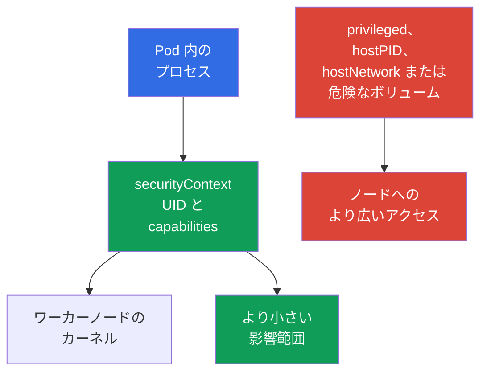

[Русская версия](ru.md) · [Eng version](README.md) · [Versión en español](es.md) · [Version française](fr.md) · [Deutsche Version](de.md) · [ქართული ვერსია](ge.md) · [繁體中文版](tw.md)

# 第09章. Pod、コンテナネットワーク、storage、クライアントセキュリティ

> **次へ。** [第08章](../08/jp.md)では、ワーカーノードの境界である Kubelet、container runtime、`kube-proxy` を扱いました。ここでは、開発者や管理者が最も頻繁に扱うもの、すなわち `Pod` の設定、ネットワーク、ボリューム、クライアント認証情報を見ていきます。これで、重みが 22% の KCSA ドメイン **Kubernetes Cluster Component Security** が完結します。

## 09.1 `Pod` レベルのセキュリティ

`Pod` は 1 つ以上のコンテナ、それらのネットワーク、およびボリュームをまとめます。そのマニフェストはプロセスの権限を狭めることも、ワーカーノードへの直接的な経路を与えることもできます。そのため `securityContext` は重要な防御層ですが、唯一のものではありません。RBAC、`NetworkPolicy`、イメージ検証、ノード保護を置き換えるものではありません。

中心となる考え方は、アプリケーションの動作に必要な権限だけをコンテナに与えることです。利便性を優先した誤りは、アプリケーションの脆弱性または悪意のあるイメージの影響を拡大します。

| フィールドまたは設定 | 用途 | リスクまたは安全な選択 |
|---|---|---|
| `runAsNonRoot: true` | UID 0 としてコンテナが起動することを防ぐ | root としての実行リスクを低減する。イメージには non-root ユーザーが必要であり、または `runAsUser` を設定する必要がある。 |
| `capabilities` | 個別の Linux 権限を管理する | `drop: ["ALL"]` から開始し、正当な理由のある capability だけを追加する。 |
| `privileged: true` | コンテナにホストのほぼすべての能力を与える | 通常の workload には危険であり、ノード侵害を容易にする可能性がある。 |
| `hostPID: true` | ノードのプロセス空間を公開する | コンテナがホストおよびノード上の他の Pod のプロセスを見られる。 |
| `hostNetwork: true` | ノードのネットワーク空間を使用する | 通常の `Pod` ネットワーク分離をなくし、ポート競合を生み、ネットワークの可視性を広げる。 |

`runAsNonRoot` だけでコンテナが安全になるわけではありません。UID 0 でないプロセスであっても、`privileged: true`、過剰な capabilities、`hostPID`、または危険なボリュームがあれば危険になり得ます。同様に、`privileged` を拒否しても脆弱なコードは修正されません。堅牢なモデルは、複数の独立した制限から構成されます。

以下は Kubernetes `v1.36` における HTTP アプリケーションの最小例です。非特権実行用に準備され、デフォルトでポート `8080` を listen する `nginx-unprivileged` イメージを使用します。`containerPort` フィールドは Kubernetes とマニフェストの読者にコンテナのポートを記述するだけであり、単独で image 内のプロセスが listen するポートを変更するものではありません。

```yaml
apiVersion: v1
kind: Pod
metadata:
  name: web
spec:
  securityContext:
    runAsNonRoot: true
    seccompProfile:
      type: RuntimeDefault
  containers:
  - name: web
    image: nginxinc/nginx-unprivileged:1.30.4-alpine-slim
    ports:
    - containerPort: 8080
    securityContext:
      allowPrivilegeEscalation: false
      capabilities:
        drop: ["ALL"]
```

この baseline はプロセス権限を低減します。workload は non-root で起動し、追加の Linux capabilities を受け取らず、`no_new_privs` と互換性のある経路を通じて権限昇格できず、`RuntimeDefault` seccomp を使用します。これはあらゆる image に共通するプロファイルではありません。アプリケーションは non-root UID と writable paths に対応している必要があります。`containerPort` は security control ではなく、アプリケーションを再設定しません。



### メンタルモデル: Linux process としてのコンテナ

コンテナは VM でも別個のカーネルでもなく、一連の制限を持つ Linux process です。namespaces は、どの PID、ネットワーク、mounts、その他のオブジェクトをコンテナが見られるかを定義します。cgroups は利用可能なリソースを制限し、capabilities は個別の privileged 操作を与え、seccomp は system calls をフィルタリングし、AppArmor/SELinux は mandatory access control policy を適用します。`securityContext` はこれらの判断の一部を `Pod` に結び付けます。

> **混同しないでください。** Namespace は security policy と同じではなく、cgroup は sandbox ではなく、capability は完全な root と同じではなく、seccomp は `NetworkPolicy` ではなく、AppArmor/SELinux は seccomp に代わって syscalls をフィルタリングするものではありません。`gVisor` と Kata Containers は OCI-compatible runtime interfaces を使用しますが、一般的な `runc` より強力な execution boundary を提供します。gVisor の `runsc` は OCI Runtime Specification を実装し、workload を userspace application-kernel boundary の背後に配置します。Kata Containers は container workload を lightweight VM 内で実行します。これらは runtime-isolation の仕組みであり、RBAC、PSS/PSA、NetworkPolicy の代替ではありません。完全な比較マップとリソース分離は [第05章](../05/jp.md) にあります。

同じ `Pod` 内のコンテナは意図的に network namespace を共有し、localhost 経由で通信できます。したがって `Pod` は他の `Pod` に対する関連する workload boundary ですが、その sidecar コンテナ間に別個のネットワークを保証するものではありません。

## 09.2 コンテナネットワーク: CNI、トラフィック、DNS

**CNI** プラグインは `Pod` をネットワークに接続します。通常は IP アドレスを割り当て、Pod 間のルーティングを設定します。具体的な実装は Calico や Cilium などクラスターに依存しますが、workload にとってモデルは共通です。`Pod` はネットワーク経由で別の `Pod` に接続でき、`Service` には安定した名前または仮想 IP で接続できます。

一般的なリクエストの経路は次のとおりです。アプリケーションは `api` という名前に接続し、DNS CoreDNS は `Service` のアドレスを返し、ネットワークコンポーネントが接続を適切な endpoint へ送ります。DNS は `api.team.svc.cluster.local` のような内部名だけでなく、外部依存関係にも頻繁に必要です。DNS を許可せずに egress を閉じると、アプリケーションはインターネットへのアクセスだけでなく、クラスターのサービスを見つける能力も失う可能性があります。

| コンポーネント | 役割 | 重要な境界 |
|---|---|---|
| CNI | `Pod` をネットワークに接続し、ネットワークポリシーを適用できる | すべての CNI が `NetworkPolicy` を実装するわけではない。 |
| CoreDNS | サービスおよび外部アドレスの DNS 名を解決する | アプリケーションへの認可を提供しない。 |
| `Service` | endpoint の集合に安定したアクセスポイントを提供する | Pod 間のアクセス制御ポリシーではない。 |
| `NetworkPolicy` | 選択された `Pod` に許可される ingress と egress を記述する | CNI がサポートする場合にのみ有効である。 |

分離ポリシーがなければ、pod-to-pod トラフィックはしばしばデフォルトで許可されています。攻撃者が 1 つの `Pod` でコード実行を得ると、フラットなネットワークはサービスのスキャン、lateral movement、データ流出を容易にします。`NetworkPolicy` は、たとえば「frontend は TCP 8080 で backend にのみ接続する」といった許可済みの関係を表現するのに役立ちます。これは allow モデルであり、TLS、RBAC、アプリケーションによるユーザー検証の代替ではありません。

default-deny、ingress、egress、セレクターについては [第13章](../13/jp.md) で詳しく扱います。ポリシーを設計する際は DNS、health checks、API へのアクセス、外部依存関係を個別に考慮します。安全なポリシーは、本当に必要な経路だけを残す必要があります。

## 09.3 ボリューム、`hostPath`、データ

ボリュームにより、コンテナはデータを保存または共有できます。ボリュームへのアクセスはデータへのアクセスを意味するため、ネットワーク許可と同じくらい慎重に選択します。コンテナには必要なボリュームだけを与え、ファイルシステム権限と `readOnly` モードは目的に合う必要があります。

`hostPath` はワーカーノードのファイルシステムパスを `Pod` に mount します。システムエージェントにはこれが必要な場合もありますが、通常のアプリケーションにとっては危険です。このパスはログ、設定、他のコンポーネントのデータ、runtime socket、またはノードの機密ファイルを公開する可能性があります。`/`、`/var/lib/kubelet`、または container runtime のソケットを mount することは特に危険であり、ノード侵害につながる可能性があります。

| ストレージの種類または方式 | 適切な場合 | リスクと制御 |
|---|---|---|
| `emptyDir` | `Pod` のライフサイクル中の一時データ | 長期的な機密保持を目的としない。同じ `Pod` で mount を持つコンテナからデータにアクセスできる。 |
| CSI 経由の PersistentVolume | `Pod` を超えて存続すべきアプリケーションデータ | PVC/PV への API アクセスは RBAC で制限する。admission policy は許可する volume references と `storageClassName` を制限できる。`accessModes` はサポートされる mount/attachment モデルを記述するもので、security ACL ではない。mount 後のデータアクセスは filesystem/backend permissions と identity によって決まる。 |
| `hostPath` | 明示的な信頼を持つノードエージェント | `Pod` をノードに直接結び付けるため、このような Pod の作成には厳格な制御が必要である。 |
| `Secret` volume | ファイルとしてプロセスに secret を渡す | RBAC および侵害されたコンテナが secret を読み取るリスクをなくすものではない。 |

ボリュームの at rest 暗号化は通常、storage backend または CSI ドライバーが提供します。これらはディスク上のデータを暗号化し、キーはプロバイダーの KMS に置かれる場合があります。これはメディア、snapshot、または盗難ディスクを保護しますが、すでにボリュームを mount したコンテナからデータを隠すものではありません。リモートストレージへのトラフィックを保護するには、別の保護されたチャネル、通常は TLS が必要です。

次の 4 つの問いを分けて考えてください。(1) `Pod` と `PVC` を作成または変更できるのは誰か - RBAC、(2) 許可される volume の種類と StorageClass は何か - admission/policy、(3) volume を技術的に attach/mount できる場所とモードは何か - CSI、topology、`accessModes`、(4) mount 後にデータを読み取りまたは変更できるのは誰か - filesystem/backend permissions、workload identity、encryption。`StorageClass` と `accessModes` は、それ自体では authorization policy ではありません。

## 09.4 クライアントセキュリティ: `kubeconfig` と `kubectl`

`kubeconfig` は、どの API Server に接続するか、誰を信頼するか、どの認証情報で認証するかを `kubectl` に伝えます。そこには client certificate と秘密鍵、bearer token、外部ログイン機構への参照、または identity provider の情報が含まれることがあります。このようなファイルを無害な設定とみなすことはできません。漏えいすると、対応する主体の権限でクラスターにアクセスされる可能性があります。

`kubectl` の context は cluster、user、namespace を結び付けます。context を誤るとコマンドが test ではなく production に向かう可能性があり、過度に広い認証情報は単純なミスをインシデントに変えます。危険なコマンドの前には、現在の context と namespace を確認することが有用です。一度限りの操作には `--context` と `--namespace` を明示的に指定します。

| 実践 | 理由 |
|---|---|
| 所有者だけがアクセスできる権限で `kubeconfig` を保存する | 同じマシンの別ユーザーが credentials を読み取るリスクを下げる。 |
| test と production に別々の identities と contexts を使用する | production で誤操作する可能性を下げる。 |
| short-lived credentials と最小限の RBAC 権限を与える | 漏えいした認証情報の価値と有効期間を制限する。 |
| `--token`、`kubeconfig`、`Secret` の出力を shell history、ログ、Git、チケットに渡さない | token 漏えいの一般的な経路を防ぐ。 |
| 不明な `kubeconfig` と exec プラグインを確認する | 設定に外部の実行可能 plugin が指定されている場合があり、確認なしに信頼してはならない。 |

`kubectl` は RBAC を迂回しません。サーバーは `kubeconfig` の主体を認証し、その後その権限を確認します。しかしローカルの衛生管理はこの段階より前に重要です。たとえば、CI ログまたはコマンド履歴にコピーされた token は、有効期限が切れる前に別のクライアントによって使用される可能性があります。

## 09.5 実務での適用

プラットフォームチームは `Pod` に安全な baseline を設定します。文書化された例外がない限り、non-root プロセス、空の capabilities セット、`privileged` と host namespaces の不使用を求めます。admission ポリシーと `Pod Security Admission` は、マニフェスト作成者の手作業による注意だけに頼らないために役立ちます。

ネットワークでは、チームはまず実際のアプリケーション接続を記述し、次に分離と限定的な許可を導入します。ルールには DNS と必要な依存関係を含め、CNI が実際に `NetworkPolicy` を適用していることも確認します。

データでは、チームは `hostPath` Pod の作成を制限し、アクセス制御と at rest 暗号化を備えた storage を選択し、ボリュームへのアクセスをデータへのアクセスとして扱います。管理には、分離された contexts、短命な credentials、least-privilege RBAC を使用します。これによりリスクは低減しますが、監査、更新、インシデント対応の必要性はなくなりません。

## 09.6 Exam vocabulary / ミニ用語集

| 用語 | 意味 |
|---|---|
| `securityContext` | UID、capabilities、その他のプロセス制限を設定する `Pod` またはコンテナのフィールド。 |
| capability | UID 0 とは独立して付与または取り消しできる、個別の Linux 権限。 |
| `privileged` | ホストに対して非常に広い権限を持つコンテナモード。 |
| CNI | コンテナを Kubernetes ネットワークに接続するための標準およびプラグイン。 |
| `NetworkPolicy` | 選択された `Pod` に許可されるネットワークトラフィックを記述する Kubernetes リソース。 |
| `hostPath` | ワーカーノードのファイルシステムパスを `Pod` に mount するボリューム。 |
| `kubeconfig` | クラスターアドレス、信頼情報、認証情報を含むクライアント設定。 |
| context | `kubectl` が使用する cluster、user、namespace の選択。 |

## 09.7 Exam Essentials / 章の要点

- `securityContext` は `Pod` プロセスを制限しますが、堅牢な baseline には不要な capabilities、`privileged`、`hostPID`、`hostNetwork` がないことも必要です。
- CNI は Pod の接続性を提供し、DNS はサービスの発見を助け、`NetworkPolicy` は CNI がサポートする場合にのみネットワーク経路を制限します。
- ボリュームはデータへのアクセスを与えます。`hostPath` は `Pod` をワーカーノードに結び付けるため、特に厳格な制御が必要です。at rest 暗号化はメディアを保護しますが、信頼された mount 済みコンテナを保護するものではありません。
- `kubeconfig`、client keys、bearer tokens は credentials です。分離された contexts、least privilege、漏えい防止により、ミスまたは侵害の影響を低減できます。

## 09.8 混同しやすい点と試験での出題

KCSA の問題では、仕組みとその境界を結び付けられるかがよく問われます。`runAsNonRoot` はプロセスの UID、capability は個別の Linux 権限、`hostNetwork` はワーカーノードのネットワーク、`hostPath` はそのファイルシステムに関係します。これらの仕組みのどれも、他のすべてを完全に置き換えるものではありません。

典型的な落とし穴は、CNI のサポートなしに `NetworkPolicy` が動作すると考えること、`Service` をアクセス制御と混同すること、ボリューム暗号化をすでに侵害されたコンテナからの保護とみなすこと、`kubeconfig` を secret を含まないファイルだと考えることです。回答の選択肢では、プロセス、ネットワーク経路、データ、またはクライアント identity のうち、示された対象を保護する control を選びます。

## 09.9 自己確認問題

### 1. 通常のコンテナの権限を最もよく低減する設定の組み合わせはどれですか。

   - a. `hostNetwork: true` と `NET_ADMIN`

   - b. `privileged: true` と `hostPID: true`

   - c. `runAsNonRoot: true` と `capabilities.drop: ["ALL"]`

   - d. `containerPort: 8080` のみ

<details>
<summary>回答と解説</summary>

**正解: c.** Non-root 実行と capabilities の削除は、プロセスの権限を低減します。他の選択肢は追加のホスト権限を与えるか、そもそも security control ではありません。

</details>

### 2. `NetworkPolicy` が実際に `Pod` のトラフィックを制限するために必要なものは何ですか。

   - a. `ConfigMap` への DNS レコードの保存

   - b. 各 `Pod` での `hostNetwork: true`

   - c. 使用する CNI による `NetworkPolicy` のサポート

   - d. IPVS モードで有効化された `kube-proxy`

<details>
<summary>回答と解説</summary>

**正解: c.** `NetworkPolicy` リソースは望ましいルールを記述しますが、それを適用するのは対応する機能を持つ CNI です。`kube-proxy` のモード、host network、DNS レコードの保存場所では実現されません。

</details>

### 3. `hostPath` に特別な制御が必要なのはなぜですか。

   - a. 常にディスク上のデータを暗号化するため。

   - b. 各 `Pod` に個別の persistent disk を作成するため。

   - c. コンテナにワーカーノードのファイルと privileged sockets を公開する可能性があるため。

   - d. コンテナがネットワークに接続することを禁止するため。

<details>
<summary>回答と解説</summary>

**正解: c.** `hostPath` はノードのパスをコンテナに mount します。パスが機密性の高いものであれば、Pod はホストデータを読み取るか、runtime 管理インターフェースにアクセスできます。暗号化とネットワーク分離はその特性ではありません。

</details>

### 4. production での `kubectl` コマンド誤実行リスクを最もよく低減する実践はどれですか。

   - a. 環境ごとに別々の contexts と identities を使用し、アクティブな context を確認し、必要最小限の権限を与える。
   - b. すべての環境で 1 つの context を使い、コマンド実行前に異なる namespace 名だけを確認する。
   - c. cluster endpoints 間の素早い切り替えを妨げないよう、TLS certificate verification を無効にする。
   - d. すべての環境で 1 つの `cluster-admin` kubeconfig を使用し、shell aliases だけで production を区別する。

<details>
<summary>回答と解説</summary>

**正解: a.** 分離された contexts/identities、アクティブな context の確認、least privilege は、誤操作の可能性とその影響を低減します。共通の管理者 credential または TLS 検証の無効化はリスクを高めます。

</details>

> **次の学習先。** 実用的な hardened `SecurityContext` については CKS の第18章と CKA の第20章を学んでください。ネットワーク分離については CKS の第04-06章と CKA の第34章を利用してください。データと credentials の保護には CKS の第21章が役立ち、`Secret` の基本的な扱いは CKA の第19章で解説されています。KCSA では [第10章](../10/jp.md) に進んでください。

[目次](../README_JP.md) · [第08章](../08/jp.md) · [第10章](../10/jp.md)
