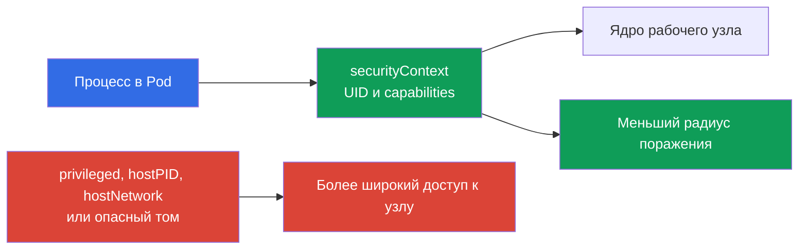

> **Язык:** русский. Переводы будут добавлены после публикации соответствующих файлов.

# Глава 09. Pod, сеть контейнеров, storage и клиентская безопасность

> **Что дальше.** В [главе 08](../08/ru.md) были рассмотрены границы рабочего узла: Kubelet, container runtime и `kube-proxy`. Теперь рассмотрим то, с чем чаще всего работает разработчик или администратор: настройки `Pod`, сеть, тома и клиентские учётные данные. Это завершает домен KCSA **Kubernetes Cluster Component Security** с весом 22%.

## 09.1 Безопасность на уровне `Pod`

`Pod` объединяет один или несколько контейнеров, их сеть и тома. Его манифест может как сузить права процесса, так и дать ему прямой путь к рабочему узлу. Поэтому `securityContext` - важный слой защиты, но не единственный: он не заменяет RBAC, `NetworkPolicy`, проверку образа и защиту узла.

Главная идея - выдавать контейнеру только те права, без которых приложение не работает. Ошибка в пользу удобства увеличивает последствия уязвимости приложения или вредоносного образа.

| Поле или настройка | Для чего нужно | Риск или безопасный выбор |
|---|---|---|
| `runAsNonRoot: true` | Не даёт запустить контейнер как UID 0 | Уменьшает риск запуска от root; образ должен иметь non-root пользователя или нужно задать `runAsUser`. |
| `capabilities` | Управляет отдельными привилегиями Linux | Начинают с `drop: ["ALL"]`, затем добавляют только обоснованную capability. |
| `privileged: true` | Даёт контейнеру почти все возможности хоста | Опасно для обычной рабочей нагрузки, может облегчить захват узла. |
| `hostPID: true` | Открывает пространство процессов узла | Контейнер видит процессы хоста и других подов на узле. |
| `hostNetwork: true` | Использует сетевое пространство узла | Убирает обычную сетевую изоляцию `Pod`, создаёт конфликты портов и расширяет видимость сети. |

`runAsNonRoot` не делает контейнер безопасным сам по себе. Процесс без UID 0 всё ещё может быть опасен при `privileged: true`, избыточных capabilities, `hostPID` или опасном томе. Аналогично, отказ от `privileged` не исправляет уязвимый код. Надёжная модель строится из нескольких независимых ограничений.

Ниже минимальный пример для HTTP-приложения в Kubernetes `v1.36`. Используется образ `nginx-unprivileged`, который подготовлен для непривилегированного запуска и по умолчанию слушает порт `8080`. Поле `containerPort` лишь описывает порт контейнера для Kubernetes и читателя манифеста; оно само по себе не меняет порт, который слушает процесс внутри image.

```yaml
apiVersion: v1
kind: Pod
metadata:
  name: web
spec:
  securityContext:
    runAsNonRoot: true
    seccompProfile:
      type: RuntimeDefault
  containers:
  - name: web
    image: nginxinc/nginx-unprivileged:1.27-alpine
    ports:
    - containerPort: 8080
    securityContext:
      allowPrivilegeEscalation: false
      capabilities:
        drop: ["ALL"]
```

Этот baseline уменьшает привилегии процесса: workload запускается non-root, не получает дополнительные Linux capabilities, не может повышать привилегии через `no_new_privs`-совместимый путь и использует `RuntimeDefault` seccomp. Это не универсальный профиль для любого image: приложение всё равно должно быть совместимо с non-root UID и writable paths. `containerPort` не является security control и не перенастраивает приложение.



### Ментальная модель: контейнер как Linux process

Контейнер - не VM и не отдельное ядро, а Linux process с набором ограничений. Namespaces определяют, какие PID, сеть, mounts и другие объекты он видит; cgroups ограничивают доступные ресурсы; capabilities выдают отдельные privileged действия; seccomp фильтрует system calls; AppArmor/SELinux применяют mandatory access control policy. `securityContext` связывает часть этих решений с `Pod`.

> **Не путать.** Namespace не равен security policy; cgroup не является sandbox; capability не равна полному root; seccomp не является `NetworkPolicy`; AppArmor/SELinux не фильтруют syscalls вместо seccomp. `gVisor` и Kata Containers используют OCI-compatible runtime interfaces, но дают более сильную execution boundary, чем типичный `runc`: gVisor `runsc` реализует OCI Runtime Specification и помещает workload за userspace application-kernel boundary, а Kata Containers запускает container workload внутри lightweight VM. Это runtime-isolation механизмы, а не замена RBAC, PSS/PSA или NetworkPolicy. Полная сравнительная карта и ресурсная изоляция даны в [главе 05](../05/ru.md).

Внутри одного `Pod` контейнеры намеренно разделяют network namespace и могут общаться через localhost. Поэтому `Pod` - релевантная workload boundary по отношению к другим `Pod`, но не обещание отдельной сети между его sidecar-контейнерами.

## 09.2 Сеть контейнеров: CNI, трафик и DNS

Плагин **CNI** подключает `Pod` к сети: обычно выделяет ему IP-адрес и настраивает маршрутизацию между подами. Конкретная реализация зависит от кластера, например Calico или Cilium, но для рабочей нагрузки модель едина: `Pod` может обращаться к другому `Pod` по сети, а к `Service` - по стабильному имени или виртуальному IP.

Обычный путь запроса выглядит так: приложение обращается к имени `api`, DNS CoreDNS возвращает адрес `Service`, а сетевые компоненты направляют соединение к подходящему endpoint. DNS нужен и для внутренних имён вида `api.team.svc.cluster.local`, и часто для внешних зависимостей. Если закрыть egress без разрешения DNS, приложение может потерять не только доступ к интернету, но и возможность найти сервисы кластера.

| Компонент | Роль | Важная граница |
|---|---|---|
| CNI | Подключает `Pod` к сети и может применять сетевые политики | Не каждый CNI реализует `NetworkPolicy`. |
| CoreDNS | Разрешает DNS-имена сервисов и внешних адресов | Не предоставляет авторизацию к приложению. |
| `Service` | Даёт стабильную точку доступа к набору endpoint | Не является политикой доступа между подами. |
| `NetworkPolicy` | Описывает допустимый ingress и egress для выбранных `Pod` | Действует только при поддержке CNI. |

Без изолирующих политик pod-to-pod трафик часто разрешён по умолчанию. Если атакующий получает выполнение кода в одном `Pod`, плоская сеть облегчает сканирование сервисов, lateral movement и вывод данных. `NetworkPolicy` помогает сформулировать разрешённые связи, например "frontend обращается только к backend по TCP 8080". Это allow-модель, а не замена TLS, RBAC или проверки пользователя приложением.

Детально default-deny, ingress, egress и селекторы разобраны в [главе 13](../13/ru.md). При проектировании политики отдельно учитывают DNS, health checks, доступ к API и внешние зависимости: безопасная политика должна оставить только действительно нужные пути.

## 09.3 Тома, `hostPath` и данные

Том позволяет контейнеру хранить или совместно использовать данные. Доступ к тому означает доступ к данным, поэтому его выбирают так же осторожно, как сетевое разрешение. У контейнера должны быть только необходимые тома, а права файловой системы и режим `readOnly` должны соответствовать задаче.

`hostPath` монтирует путь файловой системы рабочего узла в `Pod`. Для системного агента это иногда необходимо, но для обычного приложения опасно: путь может открыть журналы, конфигурацию, данные других компонентов, runtime socket или чувствительные файлы узла. Монтирование `/`, `/var/lib/kubelet` или сокета container runtime особенно опасно и может привести к захвату узла.

| Тип хранения или подход | Когда уместен | Риск и контроль |
|---|---|---|
| `emptyDir` | Временные данные на время жизни `Pod` | Не предназначен для долговременной тайны; данные доступны контейнерам того же `Pod` с mount. |
| PersistentVolume через CSI | Данные приложения, которые должны пережить `Pod` | API-доступ к PVC/PV ограничивают RBAC; admission policy может ограничивать допустимые volume references и `storageClassName`; `accessModes` описывают поддерживаемую модель mount/attachment и не являются security ACL; доступ к данным после mount определяется filesystem/backend permissions и identity. |
| `hostPath` | Узловой агент с явным доверием | Прямо связывает `Pod` с узлом, нужен строгий контроль создания таких подов. |
| `Secret` volume | Передача секрета процессу как файла | Не отменяет RBAC и риск чтения секрета скомпрометированным контейнером. |

Шифрование тома at rest обычно обеспечивает storage backend или CSI-драйвер: он шифрует данные на диске, а ключи могут находиться в KMS провайдера. Это защищает носитель, snapshot или украденный диск, но не скрывает данные от контейнера, которому том уже смонтирован. Для защиты трафика к удалённому хранилищу нужен отдельный защищённый канал, обычно TLS.

Разделяйте четыре вопроса: (1) кто может создавать или изменять `Pod` и `PVC` — RBAC; (2) какие типы volume и StorageClass разрешены — admission/policy; (3) где и в каком режиме volume технически можно attach/mount — CSI, topology и `accessModes`; (4) кто может читать или изменять данные после mount — filesystem/backend permissions, workload identity и encryption. `StorageClass` и `accessModes` сами по себе не являются authorization policy.

## 09.4 Клиентская безопасность: `kubeconfig` и `kubectl`

`kubeconfig` сообщает `kubectl`, к какому API Server обращаться, кому доверять и какими учётными данными аутентифицироваться. В нём могут находиться client certificate и закрытый ключ, bearer token, ссылка на внешний механизм входа или сведения об identity provider. Такой файл нельзя считать безобидной настройкой: его утечка может дать доступ к кластеру с правами соответствующего субъекта.

Контекст `kubectl` связывает cluster, user и namespace. Ошибка контекста способна направить команду в production вместо test, а слишком широкие учётные данные превращают простую ошибку в инцидент. Перед опасной командой полезно проверить текущий context и namespace, а для разовых действий явно указывать `--context` и `--namespace`.

| Практика | Зачем |
|---|---|
| Хранить `kubeconfig` с правами, доступными только владельцу | Уменьшает риск чтения credentials другим пользователем машины. |
| Использовать отдельные identities и contexts для test и production | Снижает вероятность ошибочного действия в production. |
| Выдавать short-lived credentials и наименьшие RBAC-права | Ограничивает ценность и срок жизни утёкшей учётной записи. |
| Не передавать `--token`, `kubeconfig` и вывод `Secret` в shell history, логи, Git или тикеты | Предотвращает распространённый путь утечки токенов. |
| Проверять незнакомые `kubeconfig` и exec-плагины | В конфигурации может быть указан внешний исполняемый plugin, которому нельзя доверять без проверки. |

`kubectl` не обходит RBAC: сервер аутентифицирует субъект из `kubeconfig`, затем проверяет его разрешения. Но локальная гигиена важна до этого этапа. Например, токен, скопированный в CI-лог или командную историю, может быть использован другим клиентом до истечения срока действия.

## 09.5 Как это применяют на практике

Команда платформы задаёт безопасный baseline для `Pod`: non-root процесс, пустой набор capabilities, отсутствие `privileged` и host namespaces, если нет документированного исключения. Admission-политики и `Pod Security Admission` помогают не полагаться только на ручную внимательность автора манифеста.

Для сети команда сначала описывает реальные связи приложений, затем вводит изоляцию и точечные разрешения. В правила включают DNS и необходимые зависимости, а также проверяют, что CNI действительно применяет `NetworkPolicy`.

Для данных команда ограничивает создание `hostPath`-подов, выбирает storage с контролем доступа и шифрованием at rest, а доступ к томам рассматривает как доступ к данным. Для администрирования используются раздельные contexts, короткоживущие credentials и least-privilege RBAC. Это уменьшает риск, но не исключает необходимость аудита, обновлений и реагирования на инциденты.

## 09.6 Exam vocabulary / Мини-глоссарий

| Термин | Значение |
|---|---|
| `securityContext` | Поля `Pod` или контейнера, задающие UID, capabilities и другие ограничения процесса. |
| capability | Отдельная привилегия Linux, которую можно выдать или отозвать независимо от UID 0. |
| `privileged` | Режим контейнера с очень широкими правами относительно хоста. |
| CNI | Стандарт и плагины для подключения контейнеров к сети Kubernetes. |
| `NetworkPolicy` | Ресурс Kubernetes для описания разрешённого сетевого трафика выбранных `Pod`. |
| `hostPath` | Том, монтирующий путь файловой системы рабочего узла в `Pod`. |
| `kubeconfig` | Клиентская конфигурация с адресом кластера, данными доверия и учётной записью. |
| context | Выбор cluster, user и namespace, используемый `kubectl`. |

## 09.7 Exam Essentials / Итоги главы

- `securityContext` ограничивает процесс `Pod`, но надёжный baseline требует отсутствия лишних capabilities, `privileged`, `hostPID` и `hostNetwork`.
- CNI обеспечивает связность подов, DNS помогает находить сервисы, а `NetworkPolicy` ограничивает сетевые пути только при поддержке CNI.
- Тома дают доступ к данным; `hostPath` связывает `Pod` с рабочим узлом и требует особенно строгого контроля. Encryption at rest защищает носитель, но не доверенный смонтированный контейнер.
- `kubeconfig`, client keys и bearer tokens являются credentials. Раздельные contexts, least privilege и защита от утечек уменьшают последствия ошибки или компрометации.

## 09.8 Не путать и как это встречается на экзамене

Вопрос KCSA обычно проверяет, можете ли вы связать механизм с его границей. `runAsNonRoot` относится к UID процесса, capability - к отдельной привилегии Linux, `hostNetwork` - к сети рабочего узла, а `hostPath` - к его файловой системе. Ни один из этих механизмов не является полной заменой остальных.

Типичные ловушки: считать `NetworkPolicy` работающей без поддержки CNI, путать `Service` с контролем доступа, считать encryption тома защитой от уже скомпрометированного контейнера и принимать `kubeconfig` за файл без секретов. В вариантах ответа выбирайте контроль, который защищает указанную поверхность: процесс, сетевой путь, данные или клиентскую identity.

## 09.9 Вопросы для самопроверки

### 1. Какой набор настроек лучше всего уменьшает привилегии обычного контейнера?

   - a. `hostNetwork: true` и `NET_ADMIN`

   - b. `privileged: true` и `hostPID: true`

   - c. `runAsNonRoot: true` и `capabilities.drop: ["ALL"]`

   - d. Только `containerPort: 8080`

<details>
<summary>Ответ и разбор</summary>

**Верный ответ: c.** Non-root запуск и отказ от capabilities уменьшают права процесса. Остальные варианты дают дополнительные права хоста или вообще не являются контролем безопасности.

</details>

### 2. Что необходимо, чтобы `NetworkPolicy` реально ограничивала трафик `Pod`?

   - a. Хранение DNS-записей в `ConfigMap`

   - b. `hostNetwork: true` у каждого `Pod`

   - c. Поддержка `NetworkPolicy` используемым CNI

   - d. Включённый `kube-proxy` в режиме IPVS

<details>
<summary>Ответ и разбор</summary>

**Верный ответ: c.** Ресурс `NetworkPolicy` описывает желаемые правила, но применяет их CNI с соответствующей поддержкой. Режим `kube-proxy`, host network и место хранения DNS-записей этого не обеспечивают.

</details>

### 3. Почему `hostPath` требует особого контроля?

   - a. Он всегда шифрует данные на диске.

   - b. Он создаёт отдельный persistent disk для каждого `Pod`.

   - c. Он может открыть контейнеру файлы и привилегированные сокеты рабочего узла.

   - d. Он запрещает контейнеру обращаться к сети.

<details>
<summary>Ответ и разбор</summary>

**Верный ответ: c.** `hostPath` монтирует путь узла в контейнер. Если путь чувствителен, под может прочитать данные хоста или получить доступ к интерфейсу управления runtime. Шифрование и сетевая изоляция не являются его свойствами.

</details>

### 4. Какая практика лучше всего снижает риск ошибочной команды `kubectl` в production?

   - a. Использовать отдельные contexts и identities для сред, проверять активный context и выдавать минимально необходимые права.
   - b. Использовать один context для всех сред, но полагаться только на разные имена namespace перед выполнением команд.
   - c. Отключить TLS certificate verification, чтобы ошибки доверия не мешали быстро переключаться между cluster endpoints.
   - d. Использовать один `cluster-admin` kubeconfig для всех сред и различать production только с помощью shell aliases.

<details>
<summary>Ответ и разбор</summary>

**Верный ответ: a.** Раздельные contexts/identities, проверка активного context и least privilege уменьшают вероятность ошибочного действия и его последствия. Общий администраторский credential или отключение TLS-проверки увеличивают риск.

</details>

> **Куда дальше.** Для практического hardened `SecurityContext` изучите главу 18 CKS и главу 20 CKA. Для сетевой изоляции используйте главы 04-06 CKS и главу 34 CKA. Для защиты данных и credentials полезна глава 21 CKS, а базовая работа с `Secret` разобрана в главе 19 CKA. В KCSA продолжите с [главой 10](../10/ru.md).

[Оглавление](../README_RU.md) · [Глава 08](../08/ru.md) · [Глава 10](../10/ru.md)
