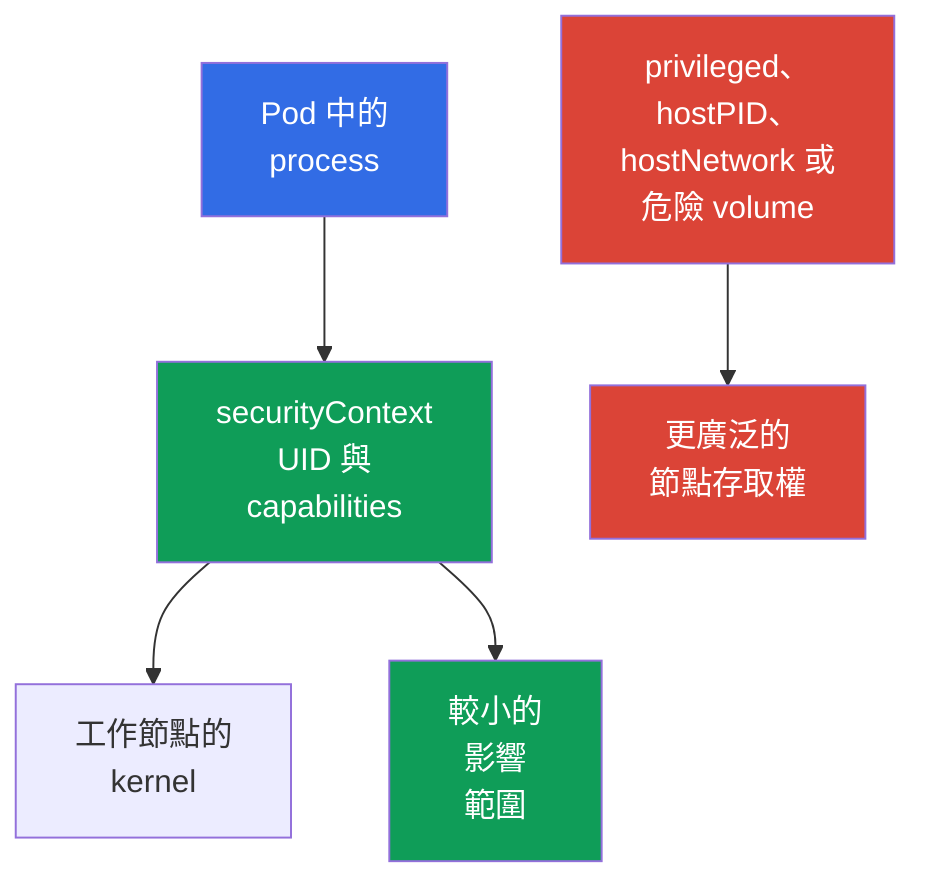

[Русская версия](ru.md) · [Eng version](README.md) · [Versión en español](es.md) · [Version française](fr.md) · [Deutsche Version](de.md) · [ქართული ვერსია](ge.md) · [日本語版](jp.md)

# 第 09 章。Pod、容器網路、storage 與用戶端安全性

> **接下來。** [第 08 章](../08/tw.md)探討了工作節點的邊界：Kubelet、container runtime 與 `kube-proxy`。現在來看看開發人員或管理員最常使用的內容：`Pod` 設定、網路、volume 與用戶端 credentials。這完成了權重為 22% 的 KCSA 網域 **Kubernetes Cluster Component Security**。

## 09.1 `Pod` 層級的安全性

`Pod` 將一個或多個 container、其網路及 volume 結合在一起。它的 manifest 既可縮小 process 的權限，也可讓它直接通往工作節點。因此，`securityContext` 是重要的防護層，但不是唯一的一層：它無法取代 RBAC、`NetworkPolicy`、image 驗證與節點防護。

核心原則是只授予 container 應用程式正常運作所需的權限。為求便利而犯錯，會擴大應用程式漏洞或惡意 image 的影響。

| 欄位或設定 | 用途 | 風險或安全選擇 |
|---|---|---|
| `runAsNonRoot: true` | 防止 container 以 UID 0 執行 | 降低以 root 執行的風險；image 必須具有 non-root 使用者，或需要設定 `runAsUser`。 |
| `capabilities` | 管理個別 Linux 權限 | 從 `drop: ["ALL"]` 開始，之後僅新增有合理依據的 capability。 |
| `privileged: true` | 賦予 container 幾乎所有 host capabilities | 對一般 workload 有危險，可能使節點遭接管更容易。 |
| `hostPID: true` | 開放節點的 process namespace | Container 可看見 host 及節點上其他 Pod 的 process。 |
| `hostNetwork: true` | 使用節點的 network namespace | 移除一般 `Pod` 網路隔離、造成 port 衝突，並擴大網路可見性。 |

`runAsNonRoot` 本身不會讓 container 安全。沒有 UID 0 的 process 若具備 `privileged: true`、過多 capabilities、`hostPID` 或危險的 volume，仍可能有危險。同樣地，拒絕 `privileged` 不會修正有漏洞的程式碼。可靠的模型由多個獨立限制所建立。

以下是在 Kubernetes `v1.36` 中 HTTP 應用程式的最小範例。它使用為非特權執行而準備、預設監聽 port `8080` 的 `nginx-unprivileged` image。`containerPort` 欄位僅為 Kubernetes 及 manifest 讀者描述 container port；它本身不會改變 image 內 process 監聽的 port。

```yaml
apiVersion: v1
kind: Pod
metadata:
  name: web
spec:
  securityContext:
    runAsNonRoot: true
    seccompProfile:
      type: RuntimeDefault
  containers:
  - name: web
    image: nginxinc/nginx-unprivileged:1.30.4-alpine-slim
    ports:
    - containerPort: 8080
    securityContext:
      allowPrivilegeEscalation: false
      capabilities:
        drop: ["ALL"]
```

此 baseline 會降低 process 權限：workload 以 non-root 執行、不會取得額外 Linux capabilities、無法透過與 `no_new_privs` 相容的路徑提升權限，並使用 `RuntimeDefault` seccomp。這不是適用於所有 image 的通用 profile：應用程式仍須與 non-root UID 及 writable paths 相容。`containerPort` 不是 security control，也不會重新設定應用程式。



### 心智模型：container 作為 Linux process

Container 不是 VM，也不是獨立的 kernel，而是具有限制集合的 Linux process。Namespaces 決定它可看見哪些 PID、網路、mounts 及其他物件；cgroups 限制可用資源；capabilities 授予個別 privileged 動作；seccomp 篩選 system calls；AppArmor/SELinux 套用 mandatory access control policy。`securityContext` 將部分這些決定與 `Pod` 連結起來。

> **請勿混淆。** Namespace 不等於 security policy；cgroup 不是 sandbox；capability 不等於完整 root；seccomp 不是 `NetworkPolicy`；AppArmor/SELinux 不會取代 seccomp 篩選 syscalls。`gVisor` 與 Kata Containers 使用 OCI-compatible runtime interfaces，但提供比典型 `runc` 更強的 execution boundary：gVisor `runsc` 實作 OCI Runtime Specification，並將 workload 放在 userspace application-kernel boundary 之後，而 Kata Containers 則在 lightweight VM 內執行 container workload。這些是 runtime-isolation 機制，不是 RBAC、PSS/PSA 或 NetworkPolicy 的替代方案。完整的比較圖與資源隔離說明位於[第 05 章](../05/tw.md)。

在同一個 `Pod` 內，containers 有意共享 network namespace，並可透過 localhost 通訊。因此，相對於其他 `Pod`，`Pod` 是相關的 workload boundary，但不保證其 sidecar containers 之間有獨立網路。

## 09.2 Container 網路：CNI、流量與 DNS

**CNI** plugin 將 `Pod` 連接到網路：通常會為其指派 IP address，並設定 Pod 之間的 routing。具體實作取決於 cluster，例如 Calico 或 Cilium，但對 workload 而言模型一致：`Pod` 可透過網路連線至另一個 `Pod`，也可透過穩定名稱或 virtual IP 存取 `Service`。

典型的 request 路徑如下：應用程式存取名稱 `api`，DNS CoreDNS 回傳 `Service` 的 address，而網路元件將 connection 導向適當的 endpoint。DNS 不僅用於 `api.team.svc.cluster.local` 之類的內部名稱，也常用於外部 dependencies。若在未允許 DNS 的情況下關閉 egress，應用程式不僅可能失去網際網路存取權，也可能無法找到 cluster services。

| 元件 | 角色 | 重要邊界 |
|---|---|---|
| CNI | 將 `Pod` 連接到網路，並可套用網路政策 | 並非所有 CNI 都實作 `NetworkPolicy`。 |
| CoreDNS | 解析 service 的 DNS 名稱與外部 address | 不提供應用程式 authorization。 |
| `Service` | 為一組 endpoints 提供穩定 access point | 不是 Pod 之間的 access policy。 |
| `NetworkPolicy` | 描述所選 `Pod` 允許的 ingress 與 egress | 僅在 CNI 支援時生效。 |

沒有隔離政策時，pod-to-pod 流量通常預設允許。如果攻擊者在一個 `Pod` 中取得 code execution，扁平網路會使掃描 services、lateral movement 與資料外洩更容易。`NetworkPolicy` 有助於描述允許的關係，例如「frontend 僅透過 TCP 8080 存取 backend」。這是 allow-model，而非 TLS、RBAC 或應用程式使用者驗證的替代方案。

[第 13 章](../13/tw.md)詳細說明 default-deny、ingress、egress 及 selectors。設計政策時應分別考量 DNS、health checks、API 存取及外部 dependencies：安全的政策應只保留真正需要的路徑。

## 09.3 Volumes、`hostPath` 與資料

Volume 可讓 container 儲存或共享資料。存取 volume 就是存取資料，因此選擇它時應與網路授權同樣審慎。Container 應只有必要的 volumes，且檔案系統權限與 `readOnly` 模式必須符合用途。

`hostPath` 會將工作節點的檔案系統路徑 mount 到 `Pod`。對系統 agent 而言，這有時是必要的，但對一般應用程式很危險：該路徑可能暴露 logs、configuration、其他元件資料、runtime socket 或敏感節點檔案。Mount `/`、`/var/lib/kubelet` 或 container runtime socket 特別危險，且可能導致節點遭接管。

| 儲存類型或方法 | 適用時機 | 風險與控制 |
|---|---|---|
| `emptyDir` | 在 `Pod` 存續期間的暫存資料 | 不適合長期保存 secrets；資料可被同一 `Pod` 中具有 mount 的 containers 存取。 |
| 透過 CSI 的 PersistentVolume | 必須跨越 `Pod` 存續的應用程式資料 | 透過 RBAC 限制對 PVC/PV 的 API 存取；admission policy 可限制允許的 volume references 與 `storageClassName`；`accessModes` 描述支援的 mount/attachment 模型，並非 security ACL；mount 後的資料存取由 filesystem/backend permissions 與 identity 決定。 |
| `hostPath` | 具有明確信任關係的節點 agent | 將 `Pod` 直接連結到節點，必須嚴格控制這類 Pod 的建立。 |
| `Secret` volume | 將 secret 作為檔案提供給 process | 不會排除 RBAC，亦不會消除遭入侵 container 讀取 secret 的風險。 |

Volume 的 encryption at rest 通常由 storage backend 或 CSI driver 提供：它會加密磁碟上的資料，而 keys 可儲存在 provider 的 KMS 中。這可保護 storage media、snapshot 或遭竊磁碟，但不會對已 mount 該 volume 的 container 隱藏資料。保護通往遠端 storage 的流量需要獨立的安全 channel，通常是 TLS。

請區分四個問題：(1) 誰可以建立或修改 `Pod` 與 `PVC` - RBAC；(2) 允許哪些 volume types 與 StorageClass - admission/policy；(3) volume 在何處以及以何種模式能技術性地 attach/mount - CSI、topology 與 `accessModes`；(4) mount 後誰可以讀取或修改資料 - filesystem/backend permissions、workload identity 與 encryption。`StorageClass` 與 `accessModes` 本身不是 authorization policy。

## 09.4 用戶端安全性：`kubeconfig` 與 `kubectl`

`kubeconfig` 告訴 `kubectl` 要連線至哪個 API Server、信任誰，以及使用哪些 credentials 進行 authentication。其中可能包含 client certificate 與 private key、bearer token、外部登入機制的連結，或 identity provider 的資訊。不能將這類檔案視為無害設定：其外洩可能依相應 subject 的權限授予 cluster access。

`kubectl` context 將 cluster、user 與 namespace 關聯起來。context 錯誤可能將命令導向 production 而非 test，而過度寬廣的 credentials 會將簡單的錯誤變成 incident。在執行危險命令前，建議檢查目前的 context 與 namespace，對一次性操作則明確指定 `--context` 與 `--namespace`。

| 實務做法 | 原因 |
|---|---|
| 將 `kubeconfig` 以僅 owner 可存取的 permissions 儲存 | 降低機器上其他使用者讀取 credentials 的風險。 |
| 為 test 與 production 使用不同 identities 與 contexts | 降低在 production 中誤操作的可能性。 |
| 授予 short-lived credentials 與最小 RBAC permissions | 限制外洩 identity 的價值與生命週期。 |
| 不要將 `--token`、`kubeconfig` 及 `Secret` 輸出傳入 shell history、logs、Git 或 tickets | 防止 tokens 常見的外洩途徑。 |
| 檢查不熟悉的 `kubeconfig` 與 exec plugins | Configuration 中可能指定外部 executable plugin，未經檢查不應信任。 |

`kubectl` 不會繞過 RBAC：server 會驗證來自 `kubeconfig` 的 subject，然後檢查其 permissions。但在此之前，本機 hygiene 仍很重要。例如，複製到 CI log 或 command history 的 token，可在到期前被其他 client 使用。

## 09.5 實務應用方式

平台團隊為 `Pod` 設定安全 baseline：non-root process、空的 capabilities 集合、沒有 `privileged` 與 host namespaces，除非存在已有文件記錄的例外。Admission policies 與 `Pod Security Admission` 有助於避免僅依賴 manifest 作者的人工謹慎。

針對網路，團隊先描述實際的應用程式關係，接著導入隔離與精準的允許規則。規則中包含 DNS 與必要 dependencies，且會驗證 CNI 確實套用 `NetworkPolicy`。

針對資料，團隊限制 `hostPath` Pod 的建立，選擇具有 access control 與 encryption at rest 的 storage，並將 volume access 視為 data access。管理工作使用分離的 contexts、short-lived credentials 與 least-privilege RBAC。這能降低風險，但不能免除 audit、updates 與 incident response 的需要。

## 09.6 Exam vocabulary / 迷你詞彙表

| 術語 | 意義 |
|---|---|
| `securityContext` | 設定 UID、capabilities 及其他 process 限制的 `Pod` 或 container 欄位。 |
| capability | 可獨立於 UID 0 授予或撤銷的個別 Linux 權限。 |
| `privileged` | 相對於 host 具有極廣泛權限的 container 模式。 |
| CNI | 將 containers 連接至 Kubernetes 網路的標準與 plugins。 |
| `NetworkPolicy` | 用於描述所選 `Pod` 允許網路流量的 Kubernetes resource。 |
| `hostPath` | 將工作節點檔案系統路徑 mount 到 `Pod` 的 volume。 |
| `kubeconfig` | 含有 cluster address、trust data 與 credentials 的用戶端 configuration。 |
| context | `kubectl` 所用的 cluster、user 與 namespace 選擇。 |

## 09.7 Exam Essentials / 本章重點

- `securityContext` 限制 `Pod` process，但可靠 baseline 還要求沒有多餘 capabilities、`privileged`、`hostPID` 與 `hostNetwork`。
- CNI 提供 Pod connectivity，DNS 協助尋找 services，且 `NetworkPolicy` 僅在 CNI 支援時限制 network paths。
- Volumes 提供資料存取；`hostPath` 將 `Pod` 連結至工作節點，需特別嚴格的控制。Encryption at rest 保護 storage media，但不保護受信任且已 mount 的 container。
- `kubeconfig`、client keys 與 bearer tokens 都是 credentials。分離 contexts、least privilege 與防止外洩可減少錯誤或 compromise 的後果。

## 09.8 請勿混淆，以及它如何出現在考試中

KCSA 題目通常會檢驗您能否將機制與其邊界連結。`runAsNonRoot` 關於 process UID，capability 關於個別 Linux 權限，`hostNetwork` 關於工作節點網路，而 `hostPath` 關於其檔案系統。這些機制沒有任何一項能完全取代其他機制。

常見陷阱包括：認為 `NetworkPolicy` 無須 CNI 支援即可運作、將 `Service` 與 access control 混淆、認為 volume encryption 可防護已遭入侵的 container，以及將 `kubeconfig` 當作不含 secrets 的檔案。在答案選項中，請選擇能保護所述 surface 的 control：process、network path、資料或 client identity。

## 09.9 自我檢查問題

### 1. 哪一組設定最能降低一般 container 的權限？

   - a. `hostNetwork: true` 與 `NET_ADMIN`

   - b. `privileged: true` 與 `hostPID: true`

   - c. `runAsNonRoot: true` 與 `capabilities.drop: ["ALL"]`

   - d. 僅使用 `containerPort: 8080`

<details>
<summary>答案與解析</summary>

**正確答案：c。** 以 non-root 執行並放棄 capabilities 可降低 process 權限。其他選項會授予額外 host 權限，或根本不是 security control。

</details>

### 2. 要讓 `NetworkPolicy` 真正限制 `Pod` 流量，必須具備什麼？

   - a. 將 DNS records 儲存在 `ConfigMap`

   - b. 每個 `Pod` 都設定 `hostNetwork: true`

   - c. 所使用 CNI 對 `NetworkPolicy` 的支援

   - d. 以 IPVS mode 啟用 `kube-proxy`

<details>
<summary>答案與解析</summary>

**正確答案：c。** `NetworkPolicy` resource 描述所需規則，但由具備相應支援的 CNI 套用。`kube-proxy` mode、host network 與 DNS records 儲存位置都無法提供此效果。

</details>

### 3. 為什麼 `hostPath` 需要特別控制？

   - a. 它總會加密磁碟上的資料。

   - b. 它為每個 `Pod` 建立獨立的 persistent disk。

   - c. 它可能向 container 開放工作節點的檔案與 privileged sockets。

   - d. 它禁止 container 存取網路。

<details>
<summary>答案與解析</summary>

**正確答案：c。** `hostPath` 將節點路徑 mount 至 container。若路徑敏感，Pod 可讀取 host 資料，或存取 runtime management interface。Encryption 與 network isolation 並非它的屬性。

</details>

### 4. 哪種實務做法最能降低在 production 中錯誤執行 `kubectl` 命令的風險？

   - a. 為環境使用不同的 contexts 與 identities、檢查 active context，並授予最小必要權限。
   - b. 所有環境使用一個 context，但僅在執行命令前依賴不同 namespace 名稱。
   - c. 停用 TLS certificate verification，使 trust errors 不會妨礙快速切換 cluster endpoints。
   - d. 所有環境使用一個 `cluster-admin` kubeconfig，並僅靠 shell aliases 區分 production。

<details>
<summary>答案與解析</summary>

**正確答案：a。** 分離 contexts/identities、檢查 active context 與 least privilege 可降低誤操作的可能性及其後果。共用 administrator credential 或停用 TLS verification 都會增加風險。

</details>

> **接下來去哪裡。** 如需實務 hardened `SecurityContext`，請學習 CKS 第 18 章與 CKA 第 20 章。網路隔離請使用 CKS 第 04-06 章與 CKA 第 34 章。CKS 第 21 章有助於資料與 credentials 保護，而 CKA 第 19 章則說明基本的 `Secret` 操作。在 KCSA 中，請繼續閱讀[第 10 章](../10/tw.md)。

[目錄](../README_TW.md) · [第 08 章](../08/tw.md) · [第 10 章](../10/tw.md)
