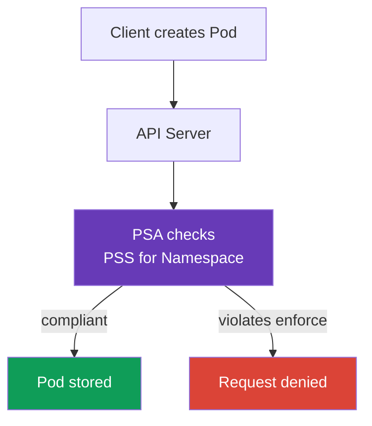

[Русская версия](ru.md) · [Versión en español](es.md) · [Version française](fr.md) · [Deutsche Version](de.md) · [ქართული ვერსია](ge.md) · [繁體中文版](tw.md) · [日本語版](jp.md)

# Chapter 11. Pod Security Standards and Pod Security Admission

> **What is next.** In [chapter 10](../10/README.md), authentication and authorization were separated: they determine who calls the API and which actions they are allowed to perform. But permission to create a `Pod` does not by itself make its manifest secure. Here, we will examine how built-in Pod Security Admission checks `Pod` settings against Pod Security Standards (PSS). This is part of the KCSA domain **Kubernetes Security Fundamentals**, weighted at 22%. The examples target Kubernetes `v1.36`.

## 11.1 The purpose of Pod Security Standards

> **PSS and PSA are distinct concepts that are easy to confuse.** **Pod Security Standards (PSS)** are the standard: three profiles (`privileged`, `baseline`, and `restricted`) that describe *which* `Pod` settings are acceptable. PSS itself does not check or enforce anything - it is only a definition of levels. **Pod Security Admission (PSA)** is the mechanism: a built-in admission controller that *applies* the selected PSS profile to a specific `Namespace` through the `enforce`, `audit`, and `warn` modes (see §11.3). In other words, PSS answers the question "what is allowed," while PSA answers "how is it checked and what happens upon a violation."

**How PSA is enabled and from which version it is enabled by default.** PSA is built into `kube-apiserver` as a regular admission controller and does not require installing a separate component or webhook. It appeared as beta and was enabled by default starting with Kubernetes v1.23; starting with v1.25, PSA has been stable (GA) functionality, available by default in all modern clusters, including the course target version `v1.36`. Having PSA enabled at the apiserver level does not mean restrictions are automatically applied: without `pod-security.kubernetes.io/<mode>: <level>` labels on a specific `Namespace`, PSA applies no profile to that namespace - the effective behavior is equivalent to `privileged` (see §11.3 for the exact label syntax).

**What came before PSS/PSA.** PSS and PSA are not the first mechanism of this kind: they replaced **PodSecurityPolicy (PSP)** - an older and more complex cluster admission controller that solved the same problem through a separate `PodSecurityPolicy` API object and RBAC bindings to it. PSP was deprecated in Kubernetes v1.21 and fully removed in v1.25; in `v1.36`, it is unavailable in any form. The details of how PSP worked and why it was abandoned are in §11.4.

**Pod Security Standards**, or PSS, define three ready-made security profiles for `Pod` resources. They restrict settings that can connect a container to the worker node, raise its privileges, or weaken isolation. Examples of such settings include `privileged: true`, host namespaces, dangerous Linux capabilities, and insecure volume types.

PSS answer the question: "What level of privilege is acceptable for this workload?" They do not replace code review, RBAC, or network isolation. For example, RBAC determines whether a subject is allowed to create a `Pod`, while PSS checks whether the `Pod` itself complies with the selected profile.

In Kubernetes, PSS is applied by the built-in **Pod Security Admission** (PSA) admission controller. It checks a request before the object is stored: a manifest that violates the enabled `enforce` mode will not be accepted by the API Server.



## 11.2 `privileged`, `baseline`, and `restricted` profiles

PSS profiles are ordered from least to most strict. Each subsequent profile includes the restrictions of the preceding one.

| Profile | Intended use | Core idea |
|---|---|---|
| `privileged` | Trusted system components that genuinely need node access | PSA imposes no PSS restrictions. |
| `baseline` | A general minimum level for regular namespaces and migration from legacy workloads | Blocks known escalation paths, such as privileged containers and host namespaces. |
| `restricted` | Ordinary application workloads | Requires least privilege: non-root, restricted capabilities, secure seccomp, and no privilege escalation. |

`privileged` does not mean "safe for an application." It is a deliberate absence of PSA restrictions that can be justified for CNI, CSI, or a node agent, but is rarely justified for a regular service.

`baseline` filters out the most dangerous requests. In particular, it prohibits `privileged` containers, `hostNetwork`, `hostPID`, `hostIPC`, unsafe capabilities, and `hostPath`. It is useful as minimum protection, but does not require the process to run as non-root.

`restricted` is suitable for most application `Pod` resources. Its typical requirements include `runAsNonRoot: true`, `allowPrivilegeEscalation: false`, `seccompProfile: RuntimeDefault` or `Localhost`, removing capabilities with `drop: ["ALL"]`, and a restricted list of volume types. The exact checks are tied to the PSS version, so the version is pinned in namespace labels.

## 11.3 PSA modes and namespace labels

PSA selects a profile and mode through labels on a `Namespace`. The same standard can be enabled in three ways:

| Mode | Result upon a violation | When useful |
|---|---|---|
| `enforce` | The API Server denies creation or modification of a noncompliant `Pod` | Protecting a namespace that is already ready. |
| `audit` | The request succeeds, but the violation is recorded in audit events | Assessing violations without stopping delivery. |
| `warn` | The request succeeds and the client receives a warning | Fast feedback for a developer or CI. |

Each mode can have its own profile and version: for example, strictly enforce `baseline` while warning about noncompliance with `restricted`. The version label pins expected behavior during Kubernetes upgrades, while the value `latest` uses the current version of the standards.

Each mode is enabled by a separate label and operates independently of the others - you can set only one mode. For example, only `enforce`:

```yaml
apiVersion: v1
kind: Namespace
metadata:
  name: payments
  labels:
    pod-security.kubernetes.io/enforce: restricted
    pod-security.kubernetes.io/enforce-version: v1.36
```

Such a namespace denies incompatible `Pod` resources on creation or modification, and that is all - it adds no audit records or warnings because its `audit` and `warn` modes are not set.

In practice, all three modes are often enabled at once, but not for the same migration stage: a typical scenario has `audit` and `warn` already set to `restricted` to see violations in advance, while `enforce` temporarily remains at the less strict `baseline` until the team remediates the discovered incompatibilities:

```yaml
apiVersion: v1
kind: Namespace
metadata:
  name: payments
  labels:
    pod-security.kubernetes.io/enforce: baseline
    pod-security.kubernetes.io/enforce-version: v1.36
    pod-security.kubernetes.io/audit: restricted
    pod-security.kubernetes.io/audit-version: v1.36
    pod-security.kubernetes.io/warn: restricted
    pod-security.kubernetes.io/warn-version: v1.36
```

Such a namespace already blocks `baseline` violations, but only reports incompatibility with `restricted` through the audit log and a client warning, without denying the request. This is gradual migration: first set `audit`/`warn` to the target profile, then, once incompatible manifests are fixed, raise `enforce` to the same `restricted` level.

### Namespace labels and cluster-wide defaults are two different ways to configure PSA

Labels on a `Namespace` are not the only way to enable PSA, but in practice the availability of the second method depends on who manages the control plane. The PSA admission controller itself can be configured through `AdmissionConfiguration` (`PodSecurityConfiguration`) - a configuration file passed to `kube-apiserver` with the `--admission-control-config-file` flag, defining **cluster-wide defaults**: the `enforce`/`audit`/`warn` profile and mode that apply by default to namespaces without their own labels. The cluster can also define exemptions (`exemptions`) for specific namespaces, `RuntimeClass` resources, or `User` resources, regardless of their labels.

**This requires access to `kube-apiserver`, which is unavailable in managed clusters.** The `--admission-control-config-file` flag changes the `kube-apiserver` process, and in a managed control plane (Amazon EKS, GKE, AKS), that process is inaccessible to the cluster administrator - its configuration is controlled by the cloud provider. Therefore, managed clusters generally do not configure `PodSecurityConfiguration` for cluster-wide defaults: only namespace labels remain, or a third-party dynamic admission webhook (for example, the Kubernetes community `pod-security-webhook`) that emulates a cluster-wide default without modifying `kube-apiserver`. Cluster-wide defaults through `AdmissionConfiguration` are realistic only where the user administers the control plane themselves - for example, a cluster deployed with `kubeadm`.

This leads to an important refinement of the model: if a namespace **does not** have PSA labels, that does **not automatically** mean that no PSS policy applies to it at all. The correct model is:

1. if a namespace has its own PSA labels, they apply;
2. if it has no labels, but the cluster is explicitly configured with cluster-wide defaults through `PodSecurityConfiguration`, those apply;
3. if there are neither namespace labels nor explicitly set cluster-wide defaults, the admission controller's built-in default applies, corresponding to the `privileged` profile for all three modes (`enforce`, `audit`, and `warn`), version `latest`. This permissive-by-default profile practically does not block or flag a Pod, but formally it is also an applied PSS policy rather than an "absence of any checking."

Namespace labels generally take priority over cluster-wide defaults where they are explicitly set: they override the default profile or mode applicable to a specific namespace. Therefore, the question "what happens to a Pod in a namespace without labels" has no single universal answer without stating whether this cluster has explicit cluster-wide defaults configured: KCSA-level reasoning should explicitly name this assumption and not confuse an "effectively permissive default `privileged`" with "no PSS checking at all."

Below is a minimal `Pod` example designed for the `restricted` profile:

```yaml
apiVersion: v1
kind: Pod
metadata:
  name: web
  namespace: payments
spec:
  securityContext:
    runAsNonRoot: true
    seccompProfile:
      type: RuntimeDefault
  containers:
  - name: web
    image: nginxinc/nginx-unprivileged:1.30.4-alpine-slim
    securityContext:
      allowPrivilegeEscalation: false
      capabilities:
        drop: ["ALL"]
```

PSA checks configuration, but does not confirm that a specific image can run with these restrictions. That is the responsibility of the team, which must test the workload before enabling strict `enforce`.

## 11.4 PSP, PSA boundaries, and policy engines

**PodSecurityPolicy** (PSP) was the former mechanism for restricting `Pod` resources. It has been removed from Kubernetes since `v1.25`, so it is not used for Kubernetes `v1.36`. PSA is the built-in replacement for standard PSS profiles.

PSA is deliberately limited. It works only with three fixed profiles and cannot express rules specific to an organization. For example, PSA cannot require an image only from `registry.example.internal`, a mandatory `owner` label, a CPU limit, or a special set of exemptions for one `Deployment`.

When such conditions are needed, a policy engine or built-in admission policies are used: for example, Kyverno, OPA/Gatekeeper, or ValidatingAdmissionPolicy with CEL. These mechanisms complement PSA rather than replace it: PSA conveniently applies a basic secure profile, while a separate policy checks organization-specific requirements.

## 11.5 Admission control map: built-in, webhook, and policy

Admission runs **after** authentication and authorization, before a change is saved to etcd. It evaluates an object and does not provide an identity or API permission. A simplified map for KCSA:

```text
Admission control
├── built-in admission plugins
│   ├── LimitRanger
│   ├── ResourceQuota
│   ├── ServiceAccount
│   ├── AlwaysPullImages
│   └── NodeRestriction
├── MutatingAdmissionPolicy + CEL
├── MutatingAdmissionWebhook
├── ValidatingAdmissionPolicy + CEL
└── ValidatingAdmissionWebhook
```

`LimitRanger` applies `LimitRange` limits and defaults; `ResourceQuota` does not allow a namespace quota to be exceeded; `ServiceAccount` performs service-account-related automation; `AlwaysPullImages` requires an image pull before starting; `NodeRestriction` narrows changes from kubelet. These are examples of admission plugins, not a list that must be memorized in full.

In Kubernetes `v1.36`, two built-in declarative policy APIs with CEL are available: `MutatingAdmissionPolicy` for modifying applicable API objects and `ValidatingAdmissionPolicy` for checking and denying inappropriate requests. `MutatingAdmissionPolicy` has been stable since `v1.36` and is enabled by default. Admission webhooks remain external HTTP services and are needed when a policy requires logic or integrations that cannot be expressed in a built-in CEL policy. These mechanisms do not replace authentication, authorization, or PSA.

OPA/Gatekeeper and Kyverno are policy engines that can participate in the admission path. They are **not** built-in Kubernetes authorizers and do **not** authenticate the client. `Gatekeeper`/Kyverno validate or modify an API object according to policy after the identity has already been established and the request authorized.

| Scenario | Best mechanism | Why not the similar distractor |
|---|---|---|
| Kubelet tries to modify another node's `Node` | `NodeRestriction` | The Node authorizer is the authorization stage; this checks whether the mutation is permitted. |
| A namespace has exhausted its allowed aggregate CPU | `ResourceQuota` admission plugin | HPA does not deny a request and does not limit tenant quota. |
| Deny images outside the corporate registry | validating policy / Gatekeeper / Kyverno / CEL policy | RBAC checks the caller, but does not inspect the image field. |

## 11.6 How it is applied in practice

A platform team usually separates namespaces by purpose. For application namespaces, they choose `restricted`; for legacy workloads, they start with `baseline`; and they place system components separately, using `privileged` only where justified and necessary.

Implementation is made observable: first inspect warnings and audit events, fix `securityContext` and image compatibility, then enable `enforce`. Pin the PSS version in labels so that a cluster upgrade does not change validation rules without a team decision.

An exemption should not become a policy bypass. If a particular workload needs node access, isolate it in a separate namespace, document the reason, and narrow its permissions by every available means: RBAC, network rules, separate nodes, and auditing.

## 11.7 Exam vocabulary / Mini-glossary

| Term | Meaning |
|---|---|
| PSS | Pod Security Standards, three standard `Pod` security profiles. |
| PSA | Pod Security Admission, the built-in admission controller that applies PSS. |
| `privileged` | A profile without PSA restrictions; suitable only for deliberately trusted cases. |
| `baseline` | A profile that blocks common privilege-escalation paths. |
| `restricted` | A strict least-privilege profile for application workloads. |
| `enforce` | A PSA mode that denies a `Pod` that violates the rules. |
| `audit` | A PSA mode that records violations in audit without denying the request. |
| `warn` | A PSA mode that displays a client warning without denying the request. |
| PSP | The removed PodSecurityPolicy mechanism, not used in Kubernetes `v1.36`. |

## 11.8 Exam Essentials / Chapter summary

- PSS define three ready-made profiles: `privileged`, `baseline`, and `restricted`.
- PSA checks a `Pod` before storage through `Namespace` labels; it complements RBAC rather than replacing it.
- `baseline` blocks obviously dangerous settings, while `restricted` additionally requires least privilege.
- `enforce` denies a violation, `audit` records it in audit, and `warn` reports it to the client.
- Profile versions are pinned with labels like `pod-security.kubernetes.io/*-version: v1.36`.
- PSP has been removed, and PSA does not cover arbitrary organization rules. Use a policy engine or admission policy for those.

## 11.9 Do not confuse these concepts and how they appear on the exam

In KCSA questions, it is important to distinguish the role of each layer. RBAC is responsible for the subject and API action, PSA for the `Pod` security profile, and `NetworkPolicy` for permitted network flows. A frequent trap is to treat `warn` as protection that blocks startup. It only reports a violation; only `enforce` denies it.

The distinction between `baseline` and `restricted` is also tested. The first profile does not promise non-root execution, while the second requires a stricter `securityContext`. If a question proposes `privileged` as the default for an application namespace, it is almost certainly the wrong choice.

## 11.10 Self-assessment questions

### 1. Which PSA mode prevents creation of a `Pod` that violates the selected profile?

   - a. `warn`

   - b. `privileged`

   - c. `audit`

   - d. `enforce`

<details>
<summary>Answer and explanation</summary>

**Correct answer: d.** `enforce` denies the request. `warn` only adds a warning, `audit` records an event, and `privileged` is a profile rather than a mode.

</details>

### 2. Which PSS profile is usually selected for an ordinary application `Pod` that needs least privilege?

   - a. `privileged`

   - b. `restricted`

   - c. `baseline`

   - d. `audit`

<details>
<summary>Answer and explanation</summary>

**Correct answer: b.** `restricted` includes non-root execution, secure seccomp, no privilege escalation, and restricted capabilities. `baseline` is a less strict intermediate level.

</details>

### 3. What does PSA not replace?

   - a. RBAC checking whether a subject has the right to `create pods`

   - b. Checking `Pod` settings against PSS

   - c. Denying an inappropriate `Pod` in `enforce` mode

   - d. Applying `pod-security.kubernetes.io/enforce` labels

<details>
<summary>Answer and explanation</summary>

**Correct answer: a.** RBAC and PSA solve different problems: RBAC checks a subject's permission for an API action, while PSA checks object security. The other options are PSA-related.

</details>

### 4. Why specify `pod-security.kubernetes.io/enforce-version: v1.36`?

   - a. To pin the PSS version against which PSA evaluates a `Pod`.

   - b. To enable `Pod` traffic encryption.

   - c. To grant the container the Linux capability `NET_ADMIN`.

   - d. To upgrade Kubernetes to version `v1.36`.

<details>
<summary>Answer and explanation</summary>

**Correct answer: a.** The version label pins the PSS requirements set and makes rule changes during a cluster upgrade manageable. It does not change the cluster version, network, or capabilities.

</details>

### 5. Which mechanism is appropriate for the requirement "allow only images from approved registries"?

   - a. PSA `warn`, which reports Pod Security Standards violations but does not define a registry allowlist.
   - b. PSA `restricted`, which restricts Pod security fields but does not check an organizational registry list.
   - c. An admission policy or policy engine with a rule that checks the image registry and denies unapproved values.
   - d. The removed `PodSecurityPolicy`, which historically restricted Pod security fields rather than a modern registry allowlist.

<details>
<summary>Answer and explanation</summary>

**Correct answer: c.** A registry allowlist is a separate admission requirement. PSA applies fixed Pod Security Standards and does not perform arbitrary organizational registry validation, while PodSecurityPolicy has been removed from Kubernetes.

</details>

> **Where to next.** To apply the standards in practice, study CKS chapter 19: Pod Security Admission and Pod Security Standards; for organizational rules on top of PSS, study CKS chapter 20: admission controllers and policy engines. A useful foundation for container fields is in CKA chapter 20: SecurityContext and capabilities. Then proceed to [chapter 12](../12/README.md) on `Secret`.

[Table of contents](../README.md) · [Chapter 10](../10/README.md) · [Chapter 12](../12/README.md)
