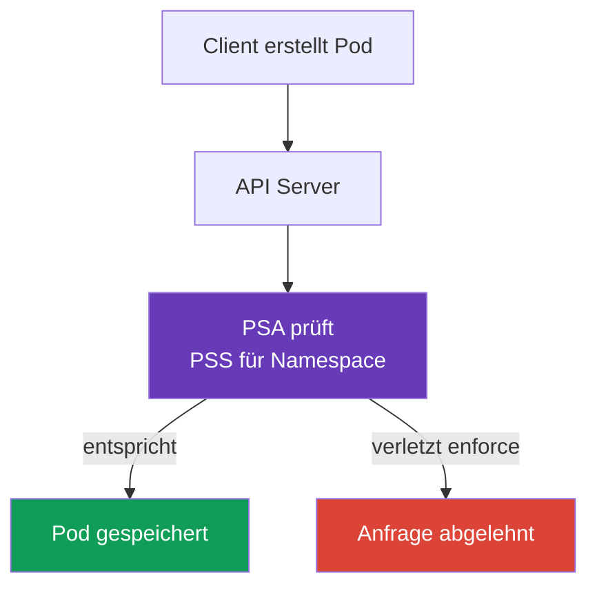

[Русская версия](ru.md) · [Eng version](README.md) · [Versión en español](es.md) · [Version française](fr.md) · [ქართული ვერსია](ge.md) · [繁體中文版](tw.md) · [日本語版](jp.md)

# Kapitel 11. Pod Security Standards und Pod Security Admission

> **Was kommt als Nächstes.** In [Kapitel 10](../10/de.md) wurden Authentifizierung und Autorisierung voneinander getrennt: Sie bestimmen, wer auf die API zugreift und welche Aktionen erlaubt sind. Doch die Berechtigung, einen `Pod` zu erstellen, macht dessen Manifest noch nicht sicher. Hier behandeln wir, wie das integrierte Pod Security Admission die Parameter eines `Pod` anhand der Pod Security Standards (PSS) prüft. Dies ist Teil der KCSA-Domäne **Kubernetes Security Fundamentals** mit einer Gewichtung von 22 %. Die Beispiele beziehen sich auf Kubernetes `v1.36`.

## 11.1 Zweck der Pod Security Standards

> **PSS und PSA sind unterschiedliche Objekte und leicht zu verwechseln.** **Pod Security Standards (PSS)** sind ein Standard: drei Profile (`privileged`, `baseline`, `restricted`), die beschreiben, *welche* `Pod`-Einstellungen zulässig sind. PSS prüft oder erzwingt für sich allein nichts, sondern definiert lediglich die Stufen. **Pod Security Admission (PSA)** ist der Mechanismus: ein integrierter Admission-Controller, der das gewählte PSS-Profil über die Modi `enforce`, `audit` und `warn` auf einen bestimmten `Namespace` anwendet (siehe §11.3). Anders ausgedrückt: PSS beantwortet die Frage „Was ist erlaubt?“, PSA die Frage „Wie wird dies geprüft und was geschieht bei einem Verstoß?“

**Wie PSA aktiviert wird und seit welcher Version es standardmäßig läuft.** PSA ist als regulärer Admission-Controller in `kube-apiserver` integriert und erfordert weder die Installation einer separaten Komponente noch eines Webhook. Es erschien als Beta und war ab Kubernetes v1.23 standardmäßig aktiviert; seit v1.25 ist PSA eine stabile Funktion (GA), die standardmäßig in allen modernen Clustern verfügbar ist, einschließlich der Kurszielversion `v1.36`. Dass PSA auf Apiserver-Ebene aktiviert ist, bedeutet keine automatische Einschränkung: Ohne Labels `pod-security.kubernetes.io/<mode>: <level>` auf einem bestimmten `Namespace` wendet PSA auf diesen Namespace kein Profil an - das effektive Verhalten entspricht `privileged` (die genaue Label-Syntax steht in §11.3).

**Was vor PSS/PSA war.** PSS und PSA waren nicht der erste Mechanismus dieser Art: Sie ersetzten **PodSecurityPolicy (PSP)**, einen älteren und komplexeren clusterweiten Admission-Controller, der dieselbe Aufgabe über ein separates API-Objekt `PodSecurityPolicy` und zugehörige RBAC-Bindings löste. PSP wurde in Kubernetes v1.21 als deprecated markiert und in v1.25 vollständig entfernt; unter `v1.36` ist es in keiner Form verfügbar. Details zu PSP und den Gründen für seine Ablösung folgen in §11.4.

**Pod Security Standards**, kurz PSS, definieren drei fertige Sicherheitsprofile für `Pod`. Sie beschränken Einstellungen, die einen Container mit dem Worker-Knoten verbinden, seine Privilegien erhöhen oder die Isolation schwächen können. Beispiele für solche Einstellungen sind `privileged: true`, Host-Namespaces, gefährliche Linux Capabilities und unsichere Volume-Typen.

PSS beantwortet die Frage: „Welche Privilegienstufe ist für diese Workload zulässig?“ Sie ersetzen weder Codeprüfung noch RBAC oder Netzwerkisolation. Beispielsweise entscheidet RBAC, ob ein Subjekt einen `Pod` erstellen darf, während PSS prüft, ob der `Pod` selbst dem gewählten Profil entspricht.

In Kubernetes wendet der integrierte Admission-Controller **Pod Security Admission** (PSA) PSS an. Er prüft die Anfrage, bevor das Objekt gespeichert wird: Ein Manifest, das den aktivierten Modus `enforce` verletzt, wird vom API Server nicht angenommen.



## 11.2 Die Profile `privileged`, `baseline` und `restricted`

Die PSS-Profile sind vom am wenigsten zum am stärksten restriktiven angeordnet. Jedes folgende Profil umfasst die Einschränkungen des vorherigen.

| Profil | Zweck | Grundidee |
|---|---|---|
| `privileged` | Vertrauenswürdige Systemkomponenten, die wirklich Zugriff auf den Knoten benötigen | PSA erzwingt keine PSS-Einschränkungen. |
| `baseline` | Allgemeines Mindestniveau für gewöhnliche Namespaces und die Migration alter Workloads | Blockiert bekannte Eskalationswege, etwa privilegierte Container und Host-Namespaces. |
| `restricted` | Normale Anwendungs-Workloads | Erzwingt Least Privilege: Non-Root, eingeschränkte Capabilities, sicheres seccomp und keine Privilegieneskalation. |

`privileged` bedeutet nicht „sicher für die Anwendung“. Es ist ein bewusster Verzicht auf PSA-Einschränkungen, der für CNI, CSI oder einen Knoten-Agent gerechtfertigt sein kann, für einen gewöhnlichen Dienst jedoch selten gerechtfertigt ist.

`baseline` schneidet die gefährlichsten Anfragen ab. Insbesondere verbietet es `privileged`-Container, `hostNetwork`, `hostPID`, `hostIPC`, unsichere Capabilities und `hostPath`. Es ist als Mindestschutz nützlich, verlangt aber nicht, dass ein Prozess ohne Root läuft.

`restricted` eignet sich für die meisten Anwendungs-`Pod`. Typische Anforderungen sind `runAsNonRoot: true`, `allowPrivilegeEscalation: false`, `seccompProfile: RuntimeDefault` oder `Localhost`, das Entfernen von Capabilities mit `drop: ["ALL"]` sowie eine eingeschränkte Liste von Volume-Typen. Die genauen Prüfungen sind an die PSS-Version gebunden, weshalb die Version in Namespace-Labels festgelegt wird.

## 11.3 PSA-Modi und Namespace-Labels

PSA wählt Profil und Modus über Labels am `Namespace`. Derselbe Standard kann auf drei Arten aktiviert werden:

| Modus | Ergebnis bei einem Verstoß | Wann nützlich |
|---|---|---|
| `enforce` | Der API Server lehnt die Erstellung oder Änderung eines ungeeigneten `Pod` ab | Schutz eines bereits vorbereiteten Namespace. |
| `audit` | Die Anfrage wird zugelassen, aber der Verstoß erscheint in Audit Events | Verstöße bewerten, ohne die Auslieferung zu stoppen. |
| `warn` | Die Anfrage wird zugelassen, und der Client erhält eine Warnung | Schnelles Feedback für Entwickler oder CI. |

Für jeden Modus können ein eigenes Profil und eine eigene Version festgelegt werden: Beispielsweise kann `baseline` strikt erzwungen werden, während bei Abweichungen von `restricted` gewarnt wird. Ein Versions-Label fixiert das erwartete Verhalten bei Kubernetes-Upgrades; der Wert `latest` verwendet die aktuelle Version der Standards.

Jeder Modus wird durch ein separates Label aktiviert und funktioniert unabhängig von den anderen - es kann nur ein einzelner Modus gesetzt werden. Beispielsweise nur `enforce`:

```yaml
apiVersion: v1
kind: Namespace
metadata:
  name: payments
  labels:
    pod-security.kubernetes.io/enforce: restricted
    pod-security.kubernetes.io/enforce-version: v1.36
```

Ein solcher Namespace lehnt inkompatible `Pod` beim Erstellen oder Ändern ab, und dabei bleibt es - er fügt weder Audit-Einträge noch Warnungen hinzu, da für ihn die Modi `audit` und `warn` nicht gesetzt sind.

In der Praxis werden oft alle drei Modi gleichzeitig aktiviert, allerdings nicht für denselben Migrationsschritt: Ein typisches Szenario ist, dass `audit` und `warn` bereits auf `restricted` gesetzt sind, um Verstöße frühzeitig zu erkennen, während `enforce` vorübergehend auf dem weniger strikten `baseline` bleibt, bis das Team die gefundenen Inkompatibilitäten beseitigt hat:

```yaml
apiVersion: v1
kind: Namespace
metadata:
  name: payments
  labels:
    pod-security.kubernetes.io/enforce: baseline
    pod-security.kubernetes.io/enforce-version: v1.36
    pod-security.kubernetes.io/audit: restricted
    pod-security.kubernetes.io/audit-version: v1.36
    pod-security.kubernetes.io/warn: restricted
    pod-security.kubernetes.io/warn-version: v1.36
```

Ein solcher Namespace blockiert bereits `baseline`-Verstöße, zeigt aber eine Inkompatibilität mit `restricted` nur über Audit Log und Client-Warnung an, ohne die Anfrage abzulehnen. Das ist die schrittweise Migration: zunächst `audit`/`warn` für das Zielprofil, dann wird `enforce`, nachdem inkompatible Manifeste korrigiert wurden, auf dasselbe `restricted` angehoben.

### Namespace-Labels und clusterweite Defaults - zwei unterschiedliche Möglichkeiten zur PSA-Konfiguration

Labels auf einem `Namespace` sind nicht die einzige Möglichkeit, PSA zu aktivieren, doch die praktische Verfügbarkeit der zweiten Methode hängt davon ab, wer die Control Plane verwaltet. Der PSA-Admission-Controller selbst kann über `AdmissionConfiguration` (`PodSecurityConfiguration`) konfiguriert werden. Dazu wird `kube-apiserver` die Konfigurationsdatei mit dem Flag `--admission-control-config-file` übergeben, um **clusterweite Defaults** festzulegen: Profil und Modus `enforce`/`audit`/`warn`, die standardmäßig auf Namespaces ohne eigene Labels angewendet werden. Ein Cluster kann unabhängig von deren Labels auch Ausnahmen (`exemptions`) für einzelne Namespaces, `RuntimeClass` oder `User` definieren.

**Dafür ist Zugriff auf `kube-apiserver` nötig, der in Managed Clustern nicht besteht.** Das Flag `--admission-control-config-file` verändert den Prozess `kube-apiserver`; in einer Managed Control Plane (Amazon EKS, GKE, AKS) ist dieser Prozess für Cluster-Administratoren jedoch nicht zugänglich - seine Konfiguration wird vom Cloud-Provider kontrolliert. Deshalb wird `PodSecurityConfiguration` für clusterweite Defaults in Managed Clustern üblicherweise nicht konfiguriert: Es bleiben nur Namespace-Labels oder ein dynamischer Admission-Webhook eines Drittanbieters, etwa `pod-security-webhook` aus der Kubernetes-Community, der einen clusterweiten Default ohne Änderung von `kube-apiserver` nachbildet. Clusterweite Defaults über `AdmissionConfiguration` sind nur realistisch, wenn die Control Plane vom Benutzer selbst verwaltet wird, beispielsweise in einem mit `kubeadm` bereitgestellten Cluster.

Daraus folgt eine wichtige Präzisierung des Modells: Wenn ein Namespace **keine** PSA-Labels enthält, bedeutet das **nicht automatisch**, dass für ihn überhaupt keine PSS-Policy gilt. Das korrekte Modell lautet:

1. Falls ein Namespace eigene PSA-Labels hat, gelten diese.
2. Falls er keine Labels hat, der Cluster jedoch ausdrücklich mit clusterweiten Defaults über `PodSecurityConfiguration` konfiguriert ist, gelten diese.
3. Falls weder Namespace-Labels noch ausdrücklich festgelegte clusterweite Defaults vorhanden sind, gilt der integrierte Standardwert des Admission-Controllers, der für alle drei Modi (`enforce`, `audit` und `warn`) dem Profil `privileged` in der Version `latest` entspricht. Dieses standardmäßig permissive Profil blockiert oder markiert praktisch keine Pods, formal ist es jedoch ebenfalls eine angewandte PSS-Policy und nicht „das Fehlen jeglicher Prüfung“.

Namespace-Labels haben normalerweise Vorrang vor clusterweiten Defaults, wenn sie ausdrücklich gesetzt sind: Sie überschreiben das standardmäßig anwendbare Profil oder den Modus für einen bestimmten Namespace. Deshalb hat die Frage „Was passiert mit einem Pod in einem Namespace ohne Labels?“ keine universelle Antwort, ohne anzugeben, ob in diesem Cluster ausdrückliche clusterweite Defaults konfiguriert sind. Eine KCSA-gerechte Begründung muss diese Annahme ausdrücklich nennen und darf „effektiv permissive Default `privileged`“ nicht mit „keinerlei PSS-Prüfung“ verwechseln.

Im Folgenden ein minimales `Pod`-Beispiel, das für das Profil `restricted` ausgelegt ist:

```yaml
apiVersion: v1
kind: Pod
metadata:
  name: web
  namespace: payments
spec:
  securityContext:
    runAsNonRoot: true
    seccompProfile:
      type: RuntimeDefault
  containers:
  - name: web
    image: nginxinc/nginx-unprivileged:1.30.4-alpine-slim
    securityContext:
      allowPrivilegeEscalation: false
      capabilities:
        drop: ["ALL"]
```

PSA prüft die Konfiguration, bestätigt jedoch nicht, dass ein bestimmtes Image unter diesen Einschränkungen tatsächlich funktionieren kann. Das ist die Verantwortung des Teams, das die Workload vor Aktivierung eines strikten `enforce` prüfen muss.

## 11.4 PSP, Grenzen von PSA und Policy Engines

**PodSecurityPolicy** (PSP) war der frühere Mechanismus zur Einschränkung von `Pod`. Sie wurde ab Kubernetes `v1.25` entfernt und wird daher für Kubernetes `v1.36` nicht verwendet. PSA ist der integrierte Ersatz für die Standardprofile von PSS.

PSA ist bewusst begrenzt. Es arbeitet nur mit drei festen Profilen und kann keine organisationsspezifischen Regeln ausdrücken. Beispielsweise kann PSA nicht ein Image ausschließlich aus `registry.example.internal`, ein verpflichtendes Label `owner`, ein CPU-Limit oder einen besonderen Satz von Ausnahmen für ein einzelnes `Deployment` verlangen.

Wenn solche Bedingungen erforderlich sind, werden eine Policy Engine oder integrierte Admission-Policies verwendet, beispielsweise Kyverno, OPA/Gatekeeper oder ValidatingAdmissionPolicy mit CEL. Diese Mechanismen ergänzen PSA, statt es aufzuheben: PSA wendet bequem ein sicheres Basisprofil an, während eine separate Policy die spezifischen Anforderungen der Organisation prüft.

## 11.5 Karte der Admission Control: built-in, Webhook und Policy

Admission erfolgt **nach** Authentifizierung und Autorisierung, aber vor dem Speichern der Änderung in etcd. Es bewertet das Objekt und erteilt weder eine Identity noch eine API-Berechtigung. Eine vereinfachte Karte für KCSA:

```text
Admission Control
├── integrierte Admission Plugins
│   ├── LimitRanger
│   ├── ResourceQuota
│   ├── ServiceAccount
│   ├── AlwaysPullImages
│   └── NodeRestriction
├── MutatingAdmissionPolicy + CEL
├── MutatingAdmissionWebhook
├── ValidatingAdmissionPolicy + CEL
└── ValidatingAdmissionWebhook
```

`LimitRanger` wendet Einschränkungen und Defaults von `LimitRange` an; `ResourceQuota` verhindert das Überschreiten der Namespace-Quota; `ServiceAccount` führt Automatisierung im Zusammenhang mit Service Accounts durch; `AlwaysPullImages` verlangt das Pull eines Image vor dem Start; `NodeRestriction` begrenzt Änderungen durch kubelet. Dies sind Beispiele für Admission Plugins und keine Liste, die vollständig auswendig gelernt werden muss.

In Kubernetes `v1.36` sind zwei integrierte deklarative Policy-APIs auf Basis von CEL verfügbar: `MutatingAdmissionPolicy` zum Ändern passender API-Objekte und `ValidatingAdmissionPolicy` zum Prüfen und Ablehnen ungeeigneter Anfragen. `MutatingAdmissionPolicy` ist seit `v1.36` stable und standardmäßig aktiviert. Admission Webhooks bleiben externe HTTP-Dienste und sind erforderlich, wenn eine Policy Logik oder Integrationen benötigt, die sich nicht durch eine integrierte CEL-Policy ausdrücken lassen. Diese Mechanismen ersetzen weder Authentifizierung, Autorisierung noch PSA.

OPA/Gatekeeper und Kyverno sind Policy Engines, die am Admission Path teilnehmen können. Sie sind **keine** integrierten Kubernetes Authorizer und authentifizieren den Client **nicht**. `Gatekeeper`/Kyverno prüfen oder ändern ein API-Objekt entsprechend einer Policy, nachdem die Identity bereits feststeht und die Anfrage autorisiert wurde.

| Szenario | Bester Mechanismus | Warum nicht der ähnliche Distraktor |
|---|---|---|
| Kubelet versucht, einen fremden `Node` zu ändern | `NodeRestriction` | Node Authorizer ist die Stufe der Autorisierung; hier wird die Zulässigkeit der Mutation geprüft. |
| Ein Namespace hat den erlaubten gesamten CPU-Wert ausgeschöpft | Admission Plugin `ResourceQuota` | HPA verbietet keine Anfrage und begrenzt keine Tenant-Quota. |
| Image außerhalb der Corporate Registry verbieten | Validating Policy / Gatekeeper / Kyverno / CEL Policy | RBAC prüft den Caller, analysiert jedoch nicht das Image-Feld. |

## 11.6 Praktische Anwendung

Ein Plattformteam trennt Namespaces üblicherweise nach ihrem Zweck. Für Anwendungs-Namespaces wird `restricted` gewählt, bei veralteten Workloads mit `baseline` begonnen, und Systemkomponenten werden separat platziert, wobei `privileged` nur begründet eingesetzt wird, wenn es erforderlich ist.

Die Einführung erfolgt beobachtbar: Zuerst werden Warnungen und Audit Events betrachtet, `securityContext` und Image-Kompatibilität korrigiert und anschließend `enforce` aktiviert. Die PSS-Version wird in Labels festgelegt, damit ein Cluster-Upgrade die Prüfregeln nicht ohne Entscheidung des Teams verändert.

Eine Ausnahme darf nicht zu einer Umgehung der Policy werden. Benötigt eine bestimmte Workload Zugriff auf den Knoten, wird sie in einem separaten Namespace isoliert, der Grund dokumentiert und die Berechtigungen werden mit allen verfügbaren Mitteln eingeschränkt: RBAC, Netzwerkregeln, separaten Knoten und Audit.

## 11.7 Exam Vocabulary / Mini-Glossar

| Begriff | Bedeutung |
|---|---|
| PSS | Pod Security Standards, drei Standard-Sicherheitsprofile für `Pod`. |
| PSA | Pod Security Admission, der integrierte Admission-Controller, der PSS anwendet. |
| `privileged` | Profil ohne PSA-Einschränkungen; nur für bewusst vertrauenswürdige Fälle geeignet. |
| `baseline` | Profil, das verbreitete Wege zur Privilegieneskalation blockiert. |
| `restricted` | Striktes Least-Privilege-Profil für Anwendungs-Workloads. |
| `enforce` | PSA-Modus, der einen regelverletzenden `Pod` ablehnt. |
| `audit` | PSA-Modus, der Verstöße ohne Ablehnung der Anfrage im Audit protokolliert. |
| `warn` | PSA-Modus, der dem Client ohne Ablehnung der Anfrage eine Warnung zeigt. |
| PSP | Entfernter PodSecurityPolicy-Mechanismus, der in Kubernetes `v1.36` nicht verwendet wird. |

## 11.8 Exam Essentials / Zusammenfassung des Kapitels

- PSS definiert drei fertige Profile: `privileged`, `baseline` und `restricted`.
- PSA prüft `Pod` vor dem Speichern über `Namespace`-Labels; es ergänzt RBAC, statt es zu ersetzen.
- `baseline` blockiert offensichtlich gefährliche Parameter, während `restricted` zusätzlich Least Privilege verlangt.
- `enforce` lehnt einen Verstoß ab, `audit` protokolliert ihn im Audit, `warn` meldet ihn dem Client.
- Profilversionen werden durch Labels der Art `pod-security.kubernetes.io/*-version: v1.36` festgelegt.
- PSP wurde entfernt, und PSA deckt keine beliebigen Organisationsregeln ab. Dafür werden Policy Engines oder Admission Policies verwendet.

## 11.9 Nicht verwechseln und Prüfungsbezug

In KCSA-Fragen ist es wichtig, die Rolle jeder Ebene zu unterscheiden. RBAC ist für Subjekt und API-Aktion zuständig, PSA für das Sicherheitsprofil des `Pod` und `NetworkPolicy` für zulässige Netzwerkflüsse. Eine häufige Falle ist, `warn` als Schutz zu betrachten, der den Start blockiert. Es meldet nur den Verstoß; nur `enforce` lehnt ab.

Ebenso wird der Unterschied zwischen `baseline` und `restricted` geprüft. Das erste Profil verspricht keinen Start ohne Root, das zweite verlangt einen strikteren `securityContext`. Wenn eine Frage `privileged` als Default für einen Anwendungs-Namespace anbietet, ist dies fast sicher die falsche Wahl.

## 11.10 Fragen zur Selbstkontrolle

### 1. Welcher PSA-Modus verhindert die Erstellung eines `Pod`, der das gewählte Profil verletzt?

   - a. `warn`

   - b. `privileged`

   - c. `audit`

   - d. `enforce`

<details>
<summary>Antwort und Erklärung</summary>

**Richtige Antwort: d.** `enforce` lehnt die Anfrage ab. `warn` fügt nur eine Warnung hinzu, `audit` protokolliert das Ereignis und `privileged` ist ein Profil, kein Modus.

</details>

### 2. Welches PSS-Profil wird üblicherweise für einen normalen Anwendungs-`Pod` gewählt, der Least Privilege benötigt?

   - a. `privileged`

   - b. `restricted`

   - c. `baseline`

   - d. `audit`

<details>
<summary>Antwort und Erklärung</summary>

**Richtige Antwort: b.** `restricted` umfasst Anforderungen an Non-Root, sicheres seccomp, das Verbot der Privilegieneskalation und eingeschränkte Capabilities. `baseline` ist eine weniger strikte Zwischenstufe.

</details>

### 3. Was ersetzt PSA nicht?

   - a. Die RBAC-Prüfung, ob ein Subjekt `create pods` ausführen darf

   - b. Die Prüfung der `Pod`-Parameter anhand von PSS

   - c. Die Ablehnung eines ungeeigneten `Pod` im Modus `enforce`

   - d. Die Anwendung von Labels `pod-security.kubernetes.io/enforce`

<details>
<summary>Antwort und Erklärung</summary>

**Richtige Antwort: a.** RBAC und PSA lösen unterschiedliche Aufgaben: RBAC prüft die Berechtigung des Subjekts für eine API-Aktion, PSA die Sicherheit des Objekts. Die übrigen Optionen beziehen sich auf PSA.

</details>

### 4. Warum wird `pod-security.kubernetes.io/enforce-version: v1.36` angegeben?

   - a. Um die PSS-Version festzulegen, nach der PSA den `Pod` bewertet.

   - b. Um die Verschlüsselung des `Pod`-Datenverkehrs zu aktivieren.

   - c. Um dem Container die Linux Capability `NET_ADMIN` zu erteilen.

   - d. Um Kubernetes auf die Version `v1.36` umzustellen.

<details>
<summary>Antwort und Erklärung</summary>

**Richtige Antwort: a.** Das Versions-Label fixiert die PSS-Anforderungen und macht eine Regeländerung beim Cluster-Upgrade kontrollierbar. Es ändert weder Cluster-Version noch Netzwerk oder Capabilities.

</details>

### 5. Welcher Mechanismus ist für die Anforderung „nur Images aus genehmigten Registries zulassen“ geeignet?

   - a. PSA `warn`, das über Verstöße gegen Pod Security Standards informiert, jedoch keine Registry-Allowlist festlegt.
   - b. PSA `restricted`, das Pod-Sicherheitsfelder einschränkt, jedoch keine organisationsspezifische Registry-Liste prüft.
   - c. Eine Admission Policy oder Policy Engine mit einer Regel, die die Image Registry prüft und nicht erlaubte Werte ablehnt.
   - d. Die entfernte `PodSecurityPolicy`, die historisch Pod-Sicherheitsfelder einschränkte, jedoch keine moderne Registry-Allowlist darstellt.

<details>
<summary>Antwort und Erklärung</summary>

**Richtige Antwort: c.** Eine Registry-Allowlist ist eine separate Admission-Anforderung. PSA wendet feste Pod Security Standards an und führt keine beliebige organisationsspezifische Registry-Prüfung durch; PodSecurityPolicy wurde aus Kubernetes entfernt.

</details>

> **Wie weiter.** Für die praktische Anwendung der Standards lesen Sie Kapitel 19 CKS: Pod Security Admission und Pod Security Standards; für Organisationsregeln zusätzlich zu PSS Kapitel 20 CKS: Admission-Controller und Policy Engines. Eine hilfreiche Grundlage zu Container-Feldern bietet Kapitel 20 CKA: SecurityContext und Capabilities. Fahren Sie anschließend mit [Kapitel 12](../12/de.md) über `Secret` fort.

[Inhaltsverzeichnis](../README_DE.md) · [Kapitel 10](../10/de.md) · [Kapitel 12](../12/de.md)
