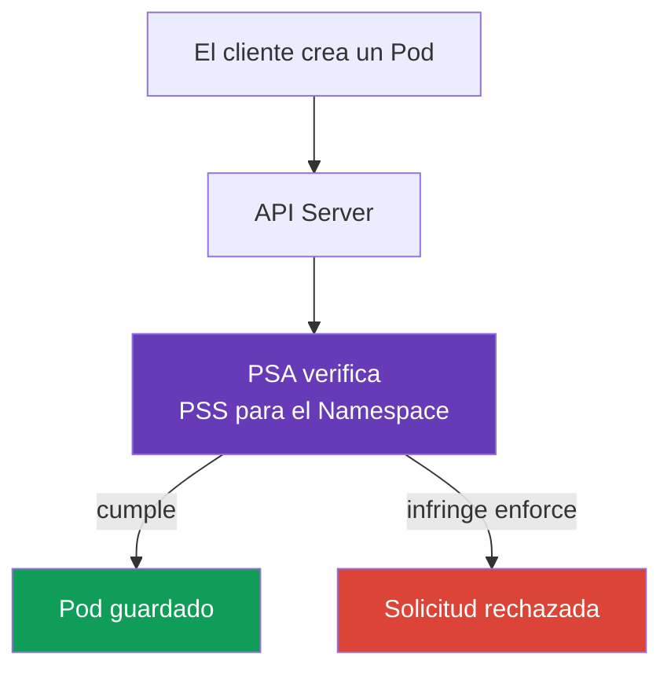

[Русская версия](ru.md) · [Eng version](README.md) · [Version française](fr.md) · [Deutsche Version](de.md) · [ქართული ვერსია](ge.md) · [繁體中文版](tw.md) · [日本語版](jp.md)

# Capítulo 11. Pod Security Standards y Pod Security Admission

> **Qué sigue.** En el [capítulo 10](../10/es.md) se separaron la autenticación y la autorización: determinan quién accede a la API y qué acciones tiene permitido realizar. Pero tener permiso para crear un `Pod` no hace que su manifiesto sea seguro. Aquí veremos cómo el Pod Security Admission integrado verifica los parámetros de un `Pod` conforme a los Pod Security Standards (PSS). Esto forma parte del dominio KCSA **Kubernetes Security Fundamentals**, con un peso del 22%. Los ejemplos se orientan a Kubernetes `v1.36`.

## 11.1 Propósito de Pod Security Standards

> **PSS y PSA son objetos diferentes y es fácil confundirlos.** **Pod Security Standards (PSS)** es un estándar: tres perfiles (`privileged`, `baseline`, `restricted`) que describen *qué* configuraciones de `Pod` se consideran admisibles. PSS por sí solo no verifica ni aplica nada - es solo la definición de los niveles. **Pod Security Admission (PSA)** es un mecanismo: un admission controller integrado que *aplica* el perfil PSS seleccionado a un `Namespace` concreto mediante los modos `enforce`, `audit` y `warn` (véase §11.3). Dicho de otro modo: PSS responde a la pregunta «qué está permitido», PSA responde a «cómo se verifica y qué ocurre ante una infracción».

**Cómo se habilita PSA y desde qué versión funciona de forma predeterminada.** PSA está integrado en `kube-apiserver` como un admission controller común y no requiere instalar un componente ni webhook separado. Apareció como beta y se habilitó de forma predeterminada desde Kubernetes v1.23; a partir de v1.25, PSA es funcionalidad estable (GA), disponible por defecto en todos los clústeres modernos, incluida la versión objetivo del curso `v1.36`. Que PSA esté habilitado a nivel del apiserver no implica una restricción automática: sin labels `pod-security.kubernetes.io/<mode>: <level>` en un `Namespace` específico, PSA no aplica ningún perfil a ese namespace - el comportamiento efectivo equivale a `privileged` (véase la sintaxis exacta de labels en §11.3).

**Qué había antes de PSS/PSA.** PSS y PSA no son el primer mecanismo de este tipo: sustituyeron a **PodSecurityPolicy (PSP)**, un admission controller de clúster más antiguo y complejo que resolvía la misma tarea mediante un objeto API independiente `PodSecurityPolicy` y enlaces RBAC a él. PSP quedó deprecado en Kubernetes v1.21 y se eliminó por completo en v1.25; en `v1.36` no está disponible de ninguna forma. Los detalles de PSP y el motivo de su abandono se explican en §11.4.

**Pod Security Standards**, o PSS, define tres perfiles de seguridad preparados para `Pod`. Restringen configuraciones que pueden conectar un contenedor con el nodo de trabajo, elevar sus privilegios o debilitar el aislamiento. Ejemplos de estas configuraciones son: `privileged: true`, host namespaces, Linux capabilities peligrosas y tipos de volúmenes inseguros.

PSS responde a la pregunta: «¿Qué nivel de privilegio es admisible para esta carga de trabajo?». No sustituye la revisión de código, RBAC ni el aislamiento de red. Por ejemplo, RBAC decide si un sujeto tiene derecho a crear un `Pod`, mientras PSS verifica si el propio `Pod` cumple el perfil seleccionado.

En Kubernetes, el admission controller integrado **Pod Security Admission** aplica PSS. Verifica la solicitud antes de guardar el objeto: un manifiesto que infrinja el modo `enforce` habilitado no será aceptado por el API Server.



## 11.2 Perfiles `privileged`, `baseline` y `restricted`

Los perfiles PSS se ordenan desde el menos hasta el más estricto. Cada perfil posterior incluye las restricciones del anterior.

| Perfil | Para qué sirve | Idea principal |
|---|---|---|
| `privileged` | Componentes de sistema de confianza que realmente necesitan acceso al nodo | PSA no impone restricciones PSS. |
| `baseline` | Nivel mínimo general para namespaces normales y transición desde cargas de trabajo antiguas | Bloquea vías de escalada conocidas, como contenedores privilegiados y host namespaces. |
| `restricted` | Cargas de trabajo de aplicaciones normales | Exige least privilege: non-root, capabilities restringidas, seccomp seguro y ausencia de escalada de privilegios. |

`privileged` no significa «seguro para una aplicación». Es una ausencia deliberada de restricciones PSA que puede justificarse para CNI, CSI o un agente de nodo, pero rara vez se justifica para un servicio común.

`baseline` elimina las solicitudes más peligrosas. En concreto, prohíbe contenedores `privileged`, `hostNetwork`, `hostPID`, `hostIPC`, capabilities inseguras y `hostPath`. Es útil como protección mínima, pero no exige que el proceso se ejecute sin root.

`restricted` es adecuado para la mayoría de los `Pod` de aplicaciones. Entre sus requisitos típicos están: `runAsNonRoot: true`, `allowPrivilegeEscalation: false`, `seccompProfile: RuntimeDefault` o `Localhost`, eliminar capabilities mediante `drop: ["ALL"]` y una lista limitada de tipos de volumen. Las comprobaciones exactas están ligadas a la versión de PSS, por lo que se fija la versión en los labels del namespace.

## 11.3 Modos PSA y labels de namespace

PSA selecciona el perfil y el modo mediante labels de `Namespace`. Un mismo estándar se puede habilitar de tres formas:

| Modo | Resultado ante una infracción | Cuándo es útil |
|---|---|---|
| `enforce` | API Server rechaza la creación o modificación de un `Pod` no adecuado | Protección de un namespace que ya está listo. |
| `audit` | La solicitud se acepta, pero la infracción aparece en audit events | Evaluar infracciones sin detener la entrega. |
| `warn` | La solicitud se acepta y el cliente recibe una advertencia | Retroalimentación rápida para el desarrollador o CI. |

A cada modo se le puede asignar su propio perfil y versión: por ejemplo, aplicar estrictamente `baseline`, pero advertir sobre el incumplimiento de `restricted`. El label de versión fija el comportamiento esperado al actualizar Kubernetes, mientras que el valor `latest` utiliza la versión actual de los estándares.

Cada modo se habilita con un label separado y funciona independientemente de los demás - se puede configurar un solo modo. Por ejemplo, solo `enforce`:

```yaml
apiVersion: v1
kind: Namespace
metadata:
  name: payments
  labels:
    pod-security.kubernetes.io/enforce: restricted
    pod-security.kubernetes.io/enforce-version: v1.36
```

Este namespace rechaza `Pod` incompatibles al crearlos o modificarlos, y eso es todo - no añade registros de audit ni advertencias porque los modos `audit` y `warn` no están configurados para él.

En la práctica, a menudo se habilitan los tres modos a la vez, pero no para la misma fase de migración: un escenario típico es tener `audit` y `warn` ya establecidos en `restricted` para detectar infracciones con antelación, mientras `enforce` permanece temporalmente en el menos estricto `baseline` hasta que el equipo resuelva las incompatibilidades encontradas:

```yaml
apiVersion: v1
kind: Namespace
metadata:
  name: payments
  labels:
    pod-security.kubernetes.io/enforce: baseline
    pod-security.kubernetes.io/enforce-version: v1.36
    pod-security.kubernetes.io/audit: restricted
    pod-security.kubernetes.io/audit-version: v1.36
    pod-security.kubernetes.io/warn: restricted
    pod-security.kubernetes.io/warn-version: v1.36
```

Este namespace ya bloquea las infracciones de `baseline`, pero solo muestra mediante el audit log y una advertencia al cliente la incompatibilidad con `restricted`, sin rechazar la solicitud. Esto es una migración gradual: primero `audit`/`warn` sobre el perfil objetivo y, después de corregir los manifiestos incompatibles, se eleva `enforce` al mismo `restricted`.

### Labels de Namespace y cluster-wide defaults: dos formas distintas de configurar PSA

Los labels de `Namespace` no son la única manera de habilitar PSA, pero en la práctica la disponibilidad de la segunda opción depende de quién gestione el control plane. El propio admission controller PSA puede configurarse mediante `AdmissionConfiguration` (`PodSecurityConfiguration`), un archivo de configuración que se pasa a `kube-apiserver` con el flag `--admission-control-config-file`, estableciendo **cluster-wide defaults**: el perfil y modo `enforce`/`audit`/`warn` que se aplican de forma predeterminada a los namespaces que no tienen labels propios. El clúster también puede definir excepciones (`exemptions`) para namespaces, `RuntimeClass` o `User` concretos, independientemente de sus labels.

**Esto requiere acceso a `kube-apiserver`, que no está disponible en clústeres managed.** El flag `--admission-control-config-file` cambia el proceso `kube-apiserver`, y en un control plane managed (Amazon EKS, GKE, AKS) el administrador del clúster no tiene acceso a ese proceso - su configuración está controlada por el proveedor cloud. Por ello, en los clústeres managed normalmente no se configura `PodSecurityConfiguration` para cluster-wide defaults: solo quedan los labels de namespace o un dynamic admission webhook de terceros, por ejemplo `pod-security-webhook` de la comunidad Kubernetes, que emula un cluster-wide default sin modificar `kube-apiserver`. Los cluster-wide defaults mediante `AdmissionConfiguration` son realistas solo cuando el propio usuario administra el control plane, por ejemplo, en un clúster desplegado con `kubeadm`.

De ello se deriva una aclaración importante del modelo: si un namespace **no tiene** labels PSA, eso **no significa automáticamente** que no tenga ninguna política PSS. El modelo correcto es el siguiente:

1. si el namespace tiene sus propios labels PSA, se aplican estos;
2. si no tiene labels, pero el clúster se configuró explícitamente con cluster-wide defaults mediante `PodSecurityConfiguration`, se aplican estos;
3. si no hay labels de namespace ni cluster-wide defaults definidos explícitamente, se aplica el valor predeterminado integrado del propio admission controller, que corresponde al perfil `privileged` para los tres modos (`enforce`, `audit` y `warn`), versión `latest`. Este perfil permissive por defecto prácticamente no bloquea ni marca ningún Pod, pero formalmente también es una política PSS aplicada, no «la ausencia de cualquier comprobación».

Los labels de namespace suelen tener prioridad sobre cluster-wide defaults donde se definen explícitamente: sustituyen (override) el perfil o modo predeterminado aplicable a un namespace concreto. Por eso, la pregunta «qué ocurrirá con un Pod en un namespace sin labels» no tiene una única respuesta universal sin indicar si en ese clúster se configuraron cluster-wide defaults explícitos: un razonamiento de nivel KCSA debe declarar explícitamente esta suposición y no confundir «default `privileged` efectivamente permissive» con «ausencia de cualquier comprobación PSS».

A continuación se muestra un ejemplo mínimo de `Pod` diseñado para el perfil `restricted`:

```yaml
apiVersion: v1
kind: Pod
metadata:
  name: web
  namespace: payments
spec:
  securityContext:
    runAsNonRoot: true
    seccompProfile:
      type: RuntimeDefault
  containers:
  - name: web
    image: nginxinc/nginx-unprivileged:1.30.4-alpine-slim
    securityContext:
      allowPrivilegeEscalation: false
      capabilities:
        drop: ["ALL"]
```

PSA verifica la configuración, pero no confirma que una imagen concreta pueda funcionar con esas restricciones. Esa es responsabilidad del equipo, que debe comprobar la carga de trabajo antes de habilitar un `enforce` estricto.

## 11.4 PSP, límites de PSA y policy engines

**PodSecurityPolicy** (PSP) era el mecanismo anterior para restringir `Pod`. Se eliminó de Kubernetes a partir de `v1.25`, por lo que no se usa para Kubernetes `v1.36`. PSA es el sustituto integrado para los perfiles PSS estándar.

PSA está limitado deliberadamente. Solo funciona con tres perfiles fijos y no expresa reglas específicas de una organización. Por ejemplo, PSA no puede exigir una imagen solo de `registry.example.internal`, un label obligatorio `owner`, un límite de CPU o un conjunto especial de excepciones para un `Deployment`.

Cuando se necesitan esas condiciones, se usa un policy engine o políticas de admission integradas: por ejemplo, Kyverno, OPA/Gatekeeper o ValidatingAdmissionPolicy con CEL. Estos mecanismos complementan a PSA, no lo anulan: PSA aplica cómodamente un perfil seguro básico, y una política independiente verifica los requisitos específicos de la organización.

## 11.5 Mapa de admission control: built-in, webhook y policy

Admission se ejecuta **después** de authentication y authorization, antes de guardar el cambio en etcd. Evalúa el objeto y no otorga identity ni API-permission. Un mapa simplificado para KCSA:

```text
Admission control
├── built-in admission plugins
│   ├── LimitRanger
│   ├── ResourceQuota
│   ├── ServiceAccount
│   ├── AlwaysPullImages
│   └── NodeRestriction
├── MutatingAdmissionPolicy + CEL
├── MutatingAdmissionWebhook
├── ValidatingAdmissionPolicy + CEL
└── ValidatingAdmissionWebhook
```

`LimitRanger` aplica las restricciones y defaults de `LimitRange`; `ResourceQuota` no permite superar la quota del namespace; `ServiceAccount` realiza automatizaciones relacionadas con service account; `AlwaysPullImages` exige hacer pull de la image antes de iniciarla; `NodeRestriction` restringe las modificaciones del kubelet. Son ejemplos de admission plugins, no una lista que debas memorizar por completo.

En Kubernetes `v1.36` hay dos API de políticas declarativas integradas basadas en CEL: `MutatingAdmissionPolicy` para modificar API-objects adecuados y `ValidatingAdmissionPolicy` para verificar y rechazar solicitudes no adecuadas. `MutatingAdmissionPolicy` es estable desde `v1.36` y está enabled by default. Los admission webhooks siguen siendo servicios HTTP externos y se necesitan cuando una policy requiere lógica o integraciones que no se pueden expresar mediante una política CEL integrada. Estos mecanismos no sustituyen authentication, authorization ni PSA.

OPA/Gatekeeper y Kyverno son policy engines que pueden participar en el admission path. **No** son un authorizer integrado de Kubernetes y **no** autentican al cliente. `Gatekeeper`/Kyverno verifican o modifican el API-object conforme a la policy después de que la identity ya se haya establecido y la solicitud se haya autorizado.

| Escenario | Mejor mecanismo | Por qué no el distractor cercano |
|---|---|---|
| Kubelet intenta modificar el `Node` de otro | `NodeRestriction` | Node authorizer es la fase de authorization; aquí se comprueba si la mutation es admisible. |
| Un namespace agotó el CPU total permitido | Admission plugin `ResourceQuota` | HPA no prohíbe la request ni limita la quota del tenant. |
| Prohibir una image fuera del corporate registry | Validating policy / Gatekeeper / Kyverno / CEL policy | RBAC verifica el caller, pero no analiza el campo image. |

## 11.6 Cómo se aplica en la práctica

El equipo de plataforma suele separar los namespaces por finalidad. Para los namespaces de aplicaciones seleccionan `restricted`, para cargas de trabajo antiguas comienzan con `baseline`, y colocan los componentes del sistema por separado, usando justificadamente `privileged` solo cuando es necesario.

La implantación se realiza de forma observable: primero se revisan las advertencias y audit events, se corrigen el `securityContext` y la compatibilidad de las imágenes, y luego se habilita `enforce`. La versión de PSS se fija en labels para que una actualización del clúster no cambie las reglas de verificación sin decisión del equipo.

Una excepción no debe convertirse en una forma de eludir la policy. Si una carga de trabajo concreta necesita acceso al nodo, se aísla en un namespace separado, se documenta la razón y se reducen los permisos por todos los medios disponibles: RBAC, reglas de red, nodos separados y auditoría.

## 11.7 Exam vocabulary / Mini glosario

| Término | Significado |
|---|---|
| PSS | Pod Security Standards, tres perfiles de seguridad estándar para `Pod`. |
| PSA | Pod Security Admission, admission controller integrado que aplica PSS. |
| `privileged` | Perfil sin restricciones PSA; adecuado solo para casos conscientemente confiables. |
| `baseline` | Perfil que bloquea vías habituales de escalada de privilegios. |
| `restricted` | Perfil estricto de least privilege para cargas de trabajo de aplicaciones. |
| `enforce` | Modo PSA que rechaza un `Pod` que infringe las reglas. |
| `audit` | Modo PSA que registra infracciones en la auditoría sin rechazar la solicitud. |
| `warn` | Modo PSA que muestra una advertencia al cliente sin rechazar la solicitud. |
| PSP | Mecanismo PodSecurityPolicy eliminado, no usado en Kubernetes `v1.36`. |

## 11.8 Exam Essentials / Resumen del capítulo

- PSS define tres perfiles preparados: `privileged`, `baseline` y `restricted`.
- PSA verifica el `Pod` antes de guardarlo mediante labels de `Namespace`; complementa RBAC, no lo sustituye.
- `baseline` bloquea parámetros evidentemente peligrosos, y `restricted` exige además least privilege.
- `enforce` rechaza la infracción, `audit` la registra en auditoría y `warn` la comunica al cliente.
- Las versiones de perfil se fijan con labels como `pod-security.kubernetes.io/*-version: v1.36`.
- PSP se eliminó, y PSA no cubre reglas arbitrarias de la organización. Para ellas se usa un policy engine o admission policy.

## 11.9 Qué no confundir y cómo aparece en el examen

En las preguntas KCSA es importante distinguir el papel de cada nivel. RBAC responde por el sujeto y la acción de API, PSA por el perfil de seguridad del `Pod`, y `NetworkPolicy` por los flujos de red permitidos. Una trampa habitual es considerar `warn` como una protección que bloquea el inicio. Solo comunica la infracción; únicamente `enforce` rechaza.

También se evalúa la diferencia entre `baseline` y `restricted`. El primer perfil no garantiza la ejecución sin root, el segundo requiere un `securityContext` más estricto. Si una pregunta propone `privileged` como default para un namespace de aplicaciones, es casi seguro que es la opción incorrecta.

## 11.10 Preguntas de autoevaluación

### 1. ¿Qué modo PSA no permite crear un `Pod` que infringe el perfil seleccionado?

   - a. `warn`

   - b. `privileged`

   - c. `audit`

   - d. `enforce`

<details>
<summary>Respuesta y explicación</summary>

**Respuesta correcta: d.** `enforce` rechaza la solicitud. `warn` solo añade una advertencia, `audit` registra el evento, y `privileged` es un perfil, no un modo.

</details>

### 2. ¿Qué perfil PSS se elige normalmente para un `Pod` de aplicación común que necesita least privilege?

   - a. `privileged`

   - b. `restricted`

   - c. `baseline`

   - d. `audit`

<details>
<summary>Respuesta y explicación</summary>

**Respuesta correcta: b.** `restricted` incluye requisitos de non-root, seccomp seguro, prohibición de escalada de privilegios y capabilities restringidas. `baseline` es un nivel intermedio menos estricto.

</details>

### 3. ¿Cuál de los siguientes PSA no sustituye?

   - a. La comprobación RBAC de que el sujeto tiene derecho a `create pods`

   - b. La comprobación de parámetros de `Pod` conforme a PSS

   - c. El rechazo de un `Pod` no adecuado en modo `enforce`

   - d. La aplicación de labels `pod-security.kubernetes.io/enforce`

<details>
<summary>Respuesta y explicación</summary>

**Respuesta correcta: a.** RBAC y PSA resuelven tareas distintas: RBAC verifica el derecho del sujeto a realizar una acción de API, mientras PSA verifica la seguridad del objeto. Las demás opciones corresponden a PSA.

</details>

### 4. ¿Para qué indicar `pod-security.kubernetes.io/enforce-version: v1.36`?

   - a. Para fijar la versión de PSS conforme a la cual PSA evalúa el `Pod`.

   - b. Para habilitar el cifrado del tráfico del `Pod`.

   - c. Para conceder al contenedor la Linux capability `NET_ADMIN`.

   - d. Para actualizar Kubernetes a la versión `v1.36`.

<details>
<summary>Respuesta y explicación</summary>

**Respuesta correcta: a.** El label de versión fija el conjunto de requisitos PSS y hace gestionable el cambio de reglas al actualizar el clúster. No cambia la versión del clúster, la red ni las capabilities.

</details>

### 5. ¿Qué mecanismo es adecuado para el requisito «permitir solo imágenes de registry aprobados»?

   - a. PSA `warn`, que informa sobre infracciones de Pod Security Standards, pero no define una allowlist de registry.
   - b. PSA `restricted`, que restringe los campos de seguridad de Pod, pero no verifica la lista organizativa de registry.
   - c. Una admission policy o policy engine con una regla que verifica el image registry y rechaza valores no permitidos.
   - d. El eliminado `PodSecurityPolicy`, que históricamente restringía los campos de seguridad de Pod, no una allowlist de registry moderna.

<details>
<summary>Respuesta y explicación</summary>

**Respuesta correcta: c.** Una allowlist de registry es un requisito de admission independiente. PSA aplica Pod Security Standards fijos y no realiza verificaciones organizativas arbitrarias de registry, y PodSecurityPolicy fue eliminado de Kubernetes.

</details>

> **Adónde seguir.** Para la aplicación práctica de los estándares, estudia el capítulo 19 de CKS: Pod Security Admission y Pod Security Standards; para las reglas de organización sobre PSS, el capítulo 20 de CKS: admission controllers y policy engines. Hay una base útil sobre los campos de contenedor en el capítulo 20 de CKA: SecurityContext y capabilities. Después, continúa con el [capítulo 12](../12/es.md) sobre `Secret`.

[Índice](../README_ES.md) · [Capítulo 10](../10/es.md) · [Capítulo 12](../12/es.md)
