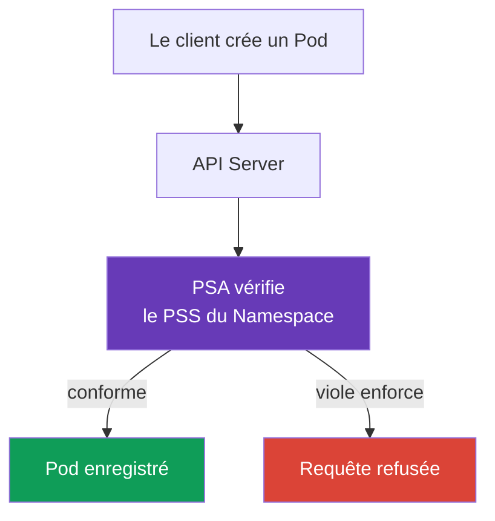

[Русская версия](ru.md) · [Eng version](README.md) · [Versión en español](es.md) · [Deutsche Version](de.md) · [ქართული ვერსია](ge.md) · [繁體中文版](tw.md) · [日本語版](jp.md)

# Chapitre 11. Pod Security Standards et Pod Security Admission

> **La suite.** Le [chapitre 10](../10/fr.md) a distingué l'authentication de l'authorization : elles déterminent qui accède à l'API et quelles actions lui sont permises. Mais le droit de créer un `Pod` ne rend pas pour autant son manifeste sûr. Nous verrons ici comment le Pod Security Admission intégré vérifie les paramètres d'un `Pod` selon les Pod Security Standards (PSS). Cela fait partie du domaine KCSA **Kubernetes Security Fundamentals**, dont le poids est de 22 %. Les exemples ciblent Kubernetes `v1.36`.

## 11.1 Rôle des Pod Security Standards

> **PSS et PSA sont des objets distincts, faciles à confondre.** Les **Pod Security Standards (PSS)** constituent le standard : trois profils (`privileged`, `baseline`, `restricted`) décrivent *quels* paramètres de `Pod` sont admissibles. Les PSS ne vérifient ni n'appliquent rien par eux-mêmes : ils ne font que définir les niveaux. **Pod Security Admission (PSA)** est le mécanisme : cet admission controller intégré *applique* le profil PSS choisi à un `Namespace` donné via les modes `enforce`, `audit` et `warn` (voir §11.3). Autrement dit, PSS répond à la question « qu'est-ce qui est autorisé ? », PSA à la question « comment cela est-il vérifié et que se passe-t-il en cas de violation ? ».

**Comment PSA est activé et depuis quelle version il est actif par défaut.** PSA est intégré à `kube-apiserver` comme admission controller standard et ne requiert ni l'installation d'un composant séparé ni de webhook. Il est apparu en beta et est activé par défaut depuis Kubernetes v1.23 ; depuis v1.25, PSA est une fonctionnalité stable (GA), disponible par défaut dans tous les clusters modernes, y compris la version cible du cours `v1.36`. L'activation de PSA au niveau de l'apiserver ne signifie pas une restriction automatique : sans labels `pod-security.kubernetes.io/<mode>: <level>` sur un `Namespace` donné, PSA n'applique aucun profil à ce namespace, et le comportement effectif équivaut à `privileged` (voir la syntaxe exacte des labels au §11.3).

**Ce qui existait avant PSS/PSA.** PSS et PSA ne sont pas le premier mécanisme de ce type : ils ont remplacé **PodSecurityPolicy (PSP)**, un admission controller de cluster plus ancien et plus complexe qui résolvait le même problème via un objet API `PodSecurityPolicy` distinct et des bindings RBAC associés. PSP a été déclaré deprecated dans Kubernetes v1.21 et complètement supprimé dans v1.25 ; dans `v1.36`, il n'est plus disponible sous aucune forme. Le fonctionnement de PSP et les raisons de son abandon sont détaillés au §11.4.

Les **Pod Security Standards**, ou PSS, définissent trois profils de sécurité prêts à l'emploi pour les `Pod`. Ils limitent les paramètres susceptibles de lier un conteneur au nœud de travail, d'augmenter ses privilèges ou d'affaiblir son isolation. Ces paramètres comprennent par exemple `privileged: true`, les host namespaces, les Linux capabilities dangereuses et les types de volumes non sûrs.

Les PSS répondent à la question : « Quel niveau de privilèges est acceptable pour cette charge de travail ? » Ils ne remplacent pas la revue de code, RBAC ni l'isolation réseau. Par exemple, RBAC détermine si un sujet a le droit de créer un `Pod`, tandis que PSS vérifie si le `Pod` lui-même respecte le profil sélectionné.

Dans Kubernetes, les PSS sont appliqués par l'admission controller intégré **Pod Security Admission** (PSA). Il vérifie la requête avant la persistance de l'objet : un manifeste qui viole le mode `enforce` activé ne sera pas accepté par l'API Server.



## 11.2 Profils `privileged`, `baseline` et `restricted`

Les profils PSS vont du moins au plus strict. Chaque profil suivant inclut les restrictions du précédent.

| Profil | Usage | Idée principale |
|---|---|---|
| `privileged` | Composants système de confiance qui nécessitent réellement un accès au nœud | PSA n'impose aucune restriction PSS. |
| `baseline` | Niveau minimal général pour les namespaces ordinaires et la migration des charges de travail héritées | Bloque les voies d'escalade connues, comme les conteneurs privilégiés et les host namespaces. |
| `restricted` | Charges de travail applicatives ordinaires | Exige le least privilege : non-root, capabilities limitées, seccomp sûr et absence d'escalade de privilèges. |

`privileged` ne signifie pas « sûr pour une application ». C'est l'absence délibérée de restrictions PSA, qui peut être justifiée pour CNI, CSI ou un agent de nœud, mais l'est rarement pour un service ordinaire.

`baseline` écarte les requêtes les plus dangereuses. En particulier, il interdit les conteneurs `privileged`, `hostNetwork`, `hostPID`, `hostIPC`, les capabilities non sûres et `hostPath`. Il est utile comme protection minimale, mais n'impose pas l'exécution du processus sans root.

`restricted` convient à la plupart des `Pod` applicatifs. Parmi ses exigences typiques figurent : `runAsNonRoot: true`, `allowPrivilegeEscalation: false`, `seccompProfile: RuntimeDefault` ou `Localhost`, la suppression des capabilities via `drop: ["ALL"]` et une liste limitée de types de volumes. Les vérifications précises dépendent de la version de PSS ; cette version est donc figée dans les labels du namespace.

## 11.3 Modes PSA et labels de namespace

PSA sélectionne le profil et le mode via les labels du `Namespace`. Le même standard peut être activé de trois manières :

| Mode | Résultat en cas de violation | Quand il est utile |
|---|---|---|
| `enforce` | API Server refuse la création ou la modification d'un `Pod` non conforme | Protection d'un namespace déjà prêt. |
| `audit` | La requête aboutit, mais la violation est inscrite dans les audit events | Évaluer les violations sans interrompre la livraison. |
| `warn` | La requête aboutit et le client reçoit un avertissement | Retour rapide au développeur ou au CI. |

Chaque mode peut avoir son propre profil et sa propre version : par exemple, appliquer strictement `baseline`, mais avertir en cas de non-conformité à `restricted`. Le label de version fixe le comportement attendu lors d'une mise à niveau de Kubernetes, tandis que la valeur `latest` utilise la version actuelle des standards.

Chaque mode est activé par un label distinct et fonctionne indépendamment des autres : il est possible de ne définir qu'un seul mode. Par exemple, uniquement `enforce` :

```yaml
apiVersion: v1
kind: Namespace
metadata:
  name: payments
  labels:
    pod-security.kubernetes.io/enforce: restricted
    pod-security.kubernetes.io/enforce-version: v1.36
```

Un tel namespace refuse les `Pod` incompatibles lors de leur création ou modification, et c'est tout : il n'ajoute ni enregistrements d'audit ni avertissements, car les modes `audit` et `warn` ne sont pas définis pour lui.

En pratique, les trois modes sont souvent activés simultanément, mais pas au même stade de migration : un scénario typique consiste à avoir déjà `audit` et `warn` sur `restricted` pour détecter les violations à l'avance, tandis que `enforce` reste temporairement sur le moins strict `baseline`, jusqu'à ce que l'équipe corrige les incompatibilités relevées :

```yaml
apiVersion: v1
kind: Namespace
metadata:
  name: payments
  labels:
    pod-security.kubernetes.io/enforce: baseline
    pod-security.kubernetes.io/enforce-version: v1.36
    pod-security.kubernetes.io/audit: restricted
    pod-security.kubernetes.io/audit-version: v1.36
    pod-security.kubernetes.io/warn: restricted
    pod-security.kubernetes.io/warn-version: v1.36
```

Un tel namespace bloque déjà les violations de `baseline`, mais indique seulement, via le journal d'audit et l'avertissement au client, les incompatibilités avec `restricted`, sans refuser la requête. C'est précisément une migration progressive : d'abord `audit`/`warn` sur le profil cible, puis, après correction des manifestes incompatibles, `enforce` est relevé au même `restricted`.

### Labels de Namespace et cluster-wide defaults : deux modes de configuration PSA différents

Les labels du `Namespace` ne sont pas le seul moyen d'activer PSA, mais en pratique l'accès au second moyen dépend de l'entité qui gère le control plane. L'admission controller PSA lui-même peut être configuré au moyen d'une `AdmissionConfiguration` (`PodSecurityConfiguration`) : un fichier de configuration transmis à `kube-apiserver` avec le flag `--admission-control-config-file`, qui définit des **cluster-wide defaults** : le profil et le mode `enforce`/`audit`/`warn` appliqués par défaut à un namespace sans labels propres. Le cluster peut aussi définir des exemptions (`exemptions`) pour certains namespaces, `RuntimeClass` ou `User`, indépendamment de leurs labels.

**Cela exige un accès à `kube-apiserver`, absent des clusters managed.** Le flag `--admission-control-config-file` modifie le processus `kube-apiserver`, mais dans un control plane managed (Amazon EKS, GKE, AKS), ce processus est inaccessible à l'administrateur du cluster : sa configuration est contrôlée par le fournisseur cloud. Ainsi, dans les clusters managed, `PodSecurityConfiguration` n'est généralement pas configuré pour les cluster-wide defaults : il ne reste que les labels de namespace, ou un dynamic admission webhook tiers, tel que `pod-security-webhook` de la communauté Kubernetes, qui émule un cluster-wide default sans modifier `kube-apiserver`. Les cluster-wide defaults via `AdmissionConfiguration` ne sont réalistes que lorsque le control plane est administré par l'utilisateur, par exemple dans un cluster déployé avec `kubeadm`.

Il en découle une précision importante du modèle : si un namespace **ne possède pas** de labels PSA, cela **ne signifie pas automatiquement** qu'aucune politique PSS ne s'y applique. Le modèle correct est le suivant :

1. si le namespace possède ses propres labels PSA, ils s'appliquent ;
2. s'il n'a pas de labels, mais que le cluster est explicitement configuré avec des cluster-wide defaults via `PodSecurityConfiguration`, ceux-ci s'appliquent ;
3. s'il n'y a ni labels de namespace ni cluster-wide defaults explicitement définis, la valeur par défaut intégrée de l'admission controller s'applique, correspondant au profil `privileged` pour les trois modes (`enforce`, `audit` et `warn`), version `latest`. Ce profil permissif par défaut ne bloque ni ne signale pratiquement aucun Pod, mais il reste formellement une politique PSS appliquée, et non une « absence de toute vérification ».

Les labels de namespace ont habituellement priorité sur les cluster-wide defaults lorsqu'ils sont définis explicitement : ils remplacent (override) le profil ou le mode applicable par défaut pour ce namespace. Par conséquent, la question « que se passera-t-il pour un Pod dans un namespace sans labels ? » n'a pas une réponse universelle sans préciser si des cluster-wide defaults explicites sont configurés dans ce cluster : un raisonnement de niveau KCSA doit énoncer clairement cette hypothèse et ne pas confondre « default `privileged` effectivement permissif » avec « absence de toute vérification PSS ».

Voici un exemple minimal de `Pod`, conçu pour le profil `restricted` :

```yaml
apiVersion: v1
kind: Pod
metadata:
  name: web
  namespace: payments
spec:
  securityContext:
    runAsNonRoot: true
    seccompProfile:
      type: RuntimeDefault
  containers:
  - name: web
    image: nginxinc/nginx-unprivileged:1.30.4-alpine-slim
    securityContext:
      allowPrivilegeEscalation: false
      capabilities:
        drop: ["ALL"]
```

PSA vérifie la configuration, mais ne confirme pas qu'une image donnée est capable de fonctionner avec ces restrictions. C'est la responsabilité de l'équipe, qui doit tester la charge de travail avant d'activer un `enforce` strict.

## 11.4 PSP, limites de PSA et policy engines

**PodSecurityPolicy** (PSP) était l'ancien mécanisme de restriction des `Pod`. Il est supprimé de Kubernetes depuis `v1.25` et n'est donc pas utilisé pour Kubernetes `v1.36`. PSA est son remplacement intégré pour les profils PSS standards.

PSA est volontairement limité. Il ne fonctionne qu'avec trois profils fixes et ne peut pas exprimer les règles propres à une organisation. Par exemple, PSA ne peut pas exiger une image provenant uniquement de `registry.example.internal`, un label `owner` obligatoire, une limite CPU ou un ensemble d'exceptions particulier pour un `Deployment`.

Lorsque ces conditions sont nécessaires, on utilise un policy engine ou des admission policies intégrées : par exemple Kyverno, OPA/Gatekeeper ou ValidatingAdmissionPolicy avec CEL. Ces mécanismes complètent PSA, ils ne l'annulent pas : PSA applique commodément un profil de base sûr, tandis qu'une politique distincte vérifie les exigences spécifiques de l'organisation.

## 11.5 Carte de l'admission control : built-in, webhook et policy

L'admission s'exécute **après** l'authentication et l'authorization, avant que la modification ne soit conservée dans etcd. Il évalue l'objet et n'accorde ni identity ni API-permission. Carte simplifiée pour KCSA :

```text
Admission control
├── built-in admission plugins
│   ├── LimitRanger
│   ├── ResourceQuota
│   ├── ServiceAccount
│   ├── AlwaysPullImages
│   └── NodeRestriction
├── MutatingAdmissionPolicy + CEL
├── MutatingAdmissionWebhook
├── ValidatingAdmissionPolicy + CEL
└── ValidatingAdmissionWebhook
```

`LimitRanger` applique les restrictions et valeurs par défaut de `LimitRange` ; `ResourceQuota` interdit le dépassement du quota de namespace ; `ServiceAccount` exécute l'automatisation associée au service account ; `AlwaysPullImages` exige le pull de l'image avant le lancement ; `NodeRestriction` limite les modifications effectuées par kubelet. Ce sont des exemples d'admission plugins, non une liste à apprendre entièrement.

Dans Kubernetes `v1.36`, deux API de policy déclaratives intégrées fondées sur CEL sont disponibles : `MutatingAdmissionPolicy` pour modifier les objets API admissibles et `ValidatingAdmissionPolicy` pour vérifier et refuser les requêtes non conformes. `MutatingAdmissionPolicy` est stable depuis `v1.36` et enabled by default. Les admission webhooks restent des services HTTP externes ; ils sont nécessaires quand une policy requiert une logique ou des intégrations impossibles à exprimer par une policy CEL intégrée. Ces mécanismes ne remplacent ni l'authentication, ni l'authorization, ni PSA.

OPA/Gatekeeper et Kyverno sont des policy engines qui peuvent participer à l'admission path. Ils **ne** sont **pas** un Kubernetes authorizer intégré et n'authentifient **pas** le client. `Gatekeeper`/Kyverno vérifient ou modifient l'objet API conformément à une policy une fois que l'identity est établie et que la requête est autorisée.

| Scénario | Meilleur mécanisme | Pourquoi pas le distracteur proche |
|---|---|---|
| Kubelet tente de modifier le `Node` d'un autre nœud | `NodeRestriction` | Node authorizer est à l'étape authorization ; ici, la validité de la mutation est vérifiée. |
| Un namespace a épuisé son CPU total autorisé | Admission plugin `ResourceQuota` | HPA n'interdit pas la requête et ne limite pas le quota du tenant. |
| Interdire une image hors du corporate registry | Validating policy / Gatekeeper / Kyverno / CEL policy | RBAC vérifie le caller, mais n'analyse pas le champ image. |

## 11.6 Application pratique

L'équipe de plateforme sépare généralement les namespaces selon leur finalité. Pour les namespaces applicatifs, elle choisit `restricted` ; pour les charges de travail héritées, elle commence par `baseline` ; les composants système sont placés séparément, et `privileged` est utilisé de façon justifiée seulement là où cela est nécessaire.

Le déploiement est construit de manière observable : l'équipe commence par examiner les avertissements et les audit events, corrige le `securityContext` et la compatibilité des images, puis active `enforce`. La version PSS est figée dans les labels afin qu'une mise à niveau du cluster ne modifie pas les règles de vérification sans décision de l'équipe.

Une exception ne doit pas devenir un contournement de policy. Si une charge de travail donnée a besoin d'accéder au nœud, elle est isolée dans un namespace distinct, la raison est documentée et les privilèges sont réduits par tous les moyens disponibles : RBAC, règles réseau, nœuds dédiés et audit.

## 11.7 Exam vocabulary / Mini-glossaire

| Terme | Signification |
|---|---|
| PSS | Pod Security Standards, les trois profils de sécurité `Pod` standards. |
| PSA | Pod Security Admission, l'admission controller intégré qui applique les PSS. |
| `privileged` | Profil sans restrictions PSA ; convient seulement aux cas consciemment approuvés. |
| `baseline` | Profil bloquant les voies courantes d'escalade de privilèges. |
| `restricted` | Profil strict de least privilege pour les charges de travail applicatives. |
| `enforce` | Mode PSA qui refuse un `Pod` violant les règles. |
| `audit` | Mode PSA qui inscrit les violations dans l'audit sans refuser la requête. |
| `warn` | Mode PSA qui affiche un avertissement au client sans refuser la requête. |
| PSP | Mécanisme PodSecurityPolicy supprimé, non utilisé dans Kubernetes `v1.36`. |

## 11.8 Exam Essentials / Synthèse du chapitre

- Les PSS définissent trois profils prêts à l'emploi : `privileged`, `baseline` et `restricted`.
- PSA vérifie un `Pod` avant sa persistance au moyen des labels de `Namespace` ; il complète RBAC, sans le remplacer.
- `baseline` bloque les paramètres manifestement dangereux, tandis que `restricted` exige en plus le least privilege.
- `enforce` refuse une violation, `audit` l'inscrit dans l'audit, `warn` la signale au client.
- Les versions de profils sont figées avec des labels de la forme `pod-security.kubernetes.io/*-version: v1.36`.
- PSP est supprimé, et PSA ne couvre pas les règles arbitraires d'une organisation. Pour celles-ci, utilisez un policy engine ou une admission policy.

## 11.9 À ne pas confondre et présentation à l'examen

Dans les questions KCSA, il est important de distinguer le rôle de chaque niveau. RBAC répond pour le sujet et l'action API, PSA pour le profil de sécurité du `Pod`, et `NetworkPolicy` pour les flux réseau autorisés. Piège courant : considérer `warn` comme une protection qui bloque le lancement. Il ne fait que signaler la violation ; seul `enforce` la refuse.

La différence entre `baseline` et `restricted` est également évaluée. Le premier profil ne promet pas une exécution sans root ; le second impose un `securityContext` plus strict. Si une question propose `privileged` comme default pour un namespace applicatif, c'est presque certainement un mauvais choix.

## 11.10 Questions d'auto-évaluation

### 1. Quel mode PSA empêche la création d'un `Pod` qui viole le profil sélectionné ?

   - a. `warn`

   - b. `privileged`

   - c. `audit`

   - d. `enforce`

<details>
<summary>Réponse et explication</summary>

**Bonne réponse : d.** `enforce` refuse la requête. `warn` ajoute uniquement un avertissement, `audit` consigne l'événement, et `privileged` est un profil, non un mode.

</details>

### 2. Quel profil PSS est généralement retenu pour un `Pod` applicatif ordinaire nécessitant le least privilege ?

   - a. `privileged`

   - b. `restricted`

   - c. `baseline`

   - d. `audit`

<details>
<summary>Réponse et explication</summary>

**Bonne réponse : b.** `restricted` inclut des exigences de non-root, de seccomp sûr, d'interdiction de l'escalade de privilèges et de capabilities limitées. `baseline` est un niveau intermédiaire moins strict.

</details>

### 3. Que PSA ne remplace-t-il pas parmi les éléments suivants ?

   - a. La vérification RBAC que le sujet a le droit de `create pods`

   - b. La vérification des paramètres du `Pod` selon les PSS

   - c. Le refus d'un `Pod` non conforme en mode `enforce`

   - d. L'application des labels `pod-security.kubernetes.io/enforce`

<details>
<summary>Réponse et explication</summary>

**Bonne réponse : a.** RBAC et PSA remplissent des fonctions distinctes : RBAC vérifie le droit du sujet sur l'action API, tandis que PSA vérifie la sécurité de l'objet. Les autres options relèvent de PSA.

</details>

### 4. Pourquoi indiquer `pod-security.kubernetes.io/enforce-version: v1.36` ?

   - a. Pour figer la version PSS selon laquelle PSA évalue le `Pod`.

   - b. Pour activer le chiffrement du trafic `Pod`.

   - c. Pour accorder au conteneur la Linux capability `NET_ADMIN`.

   - d. Pour remplacer Kubernetes par la version `v1.36`.

<details>
<summary>Réponse et explication</summary>

**Bonne réponse : a.** Le label de version fige l'ensemble des exigences PSS et rend le changement de règles lors d'une mise à niveau du cluster maîtrisable. Il ne modifie ni la version du cluster, ni le réseau, ni les capabilities.

</details>

### 5. Quel mécanisme convient à l'exigence « autoriser uniquement les images provenant de registries approuvés » ?

   - a. PSA `warn`, qui signale les violations des Pod Security Standards, mais ne définit pas de registry allowlist.
   - b. PSA `restricted`, qui limite les champs de sécurité du Pod, mais ne vérifie pas une liste de registries organisationnelle.
   - c. Une admission policy ou un policy engine avec une règle qui vérifie le registry de l'image et refuse les valeurs non autorisées.
   - d. Le `PodSecurityPolicy` supprimé, qui limitait historiquement les champs de sécurité du Pod, mais pas une registry allowlist moderne.

<details>
<summary>Réponse et explication</summary>

**Bonne réponse : c.** Une registry allowlist est une exigence d'admission distincte. PSA applique des Pod Security Standards fixes et n'effectue pas de vérification organisationnelle arbitraire de registry, tandis que PodSecurityPolicy est supprimé de Kubernetes.

</details>

> **Pour aller plus loin.** Pour appliquer les standards en pratique, étudiez le chapitre 19 CKS : Pod Security Admission et Pod Security Standards, puis, pour les règles organisationnelles en complément des PSS, le chapitre 20 CKS : admission controllers et policy engines. Une base utile sur les champs de conteneur se trouve au chapitre 20 CKA : SecurityContext et capabilities. Passez ensuite au [chapitre 12](../12/fr.md) sur `Secret`.

[Table des matières](../README_FR.md) · [Chapitre 10](../10/fr.md) · [Chapitre 12](../12/fr.md)
