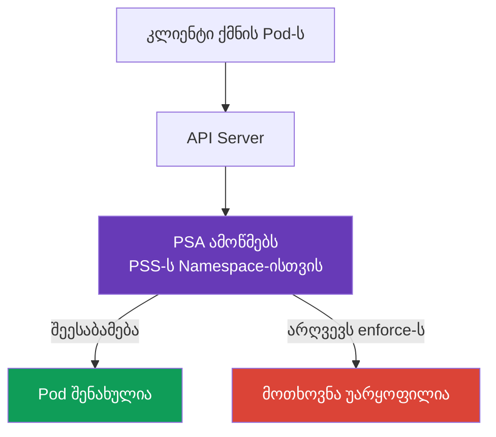

[Русская версия](ru.md) · [Eng version](README.md) · [Versión en español](es.md) · [Version française](fr.md) · [Deutsche Version](de.md) · [繁體中文版](tw.md) · [日本語版](jp.md)

# თავი 11. Pod Security Standards და Pod Security Admission

> **რა არის შემდეგ.** [მე-10 თავში](../10/ge.md) authentication და authorization გაიმიჯნა: ისინი განსაზღვრავენ, ვინ მიმართავს API-ს და რომელი მოქმედებების შესრულება შეუძლია მას. თუმცა `Pod`-ის შექმნის უფლება ჯერ კიდევ არ ნიშნავს, რომ მისი manifest უსაფრთხოა. აქ განვიხილავთ, როგორ ამოწმებს ჩაშენებული Pod Security Admission `Pod`-ის პარამეტრებს Pod Security Standards-ის (PSS) მიხედვით. ეს არის KCSA-ს **Kubernetes Security Fundamentals** დომენის ნაწილი, რომლის წონაა 22%. მაგალითები განკუთვნილია Kubernetes `v1.36`-ისთვის.

## 11.1 Pod Security Standards-ის დანიშნულება

> **PSS და PSA სხვადასხვა ობიექტია და მათი ერთმანეთში არევა ადვილია.** **Pod Security Standards (PSS)** არის სტანდარტი: სამი პროფილი (`privileged`, `baseline`, `restricted`), რომლებიც აღწერს, `Pod`-ის *რომელი* პარამეტრები ითვლება დასაშვებად. PSS თავისთავად არაფერს ამოწმებს და არ აღასრულებს, ის მხოლოდ დონეების განსაზღვრებაა. **Pod Security Admission (PSA)** არის მექანიზმი: ჩაშენებული admission-კონტროლერი, რომელიც არჩეულ PSS პროფილს კონკრეტულ `Namespace`-ზე `enforce`, `audit` და `warn` რეჟიმების მეშვეობით *იყენებს* (იხილეთ §11.3). სხვაგვარად რომ ვთქვათ: PSS პასუხობს კითხვას „რა არის ნებადართული“, PSA კი კითხვას „როგორ მოწმდება ეს და რა ხდება დარღვევისას“.

**როგორ ირთვება PSA და რომელი ვერსიიდან მუშაობს ის ნაგულისხმევად.** PSA ჩაშენებულია `kube-apiserver`-ში, როგორც ჩვეულებრივი admission-კონტროლერი, და ცალკე კომპონენტის ან webhook-ის დაყენებას არ საჭიროებს. ის პირველად beta სტატუსით გამოჩნდა და Kubernetes v1.23-იდან ნაგულისხმევად ჩაირთო; v1.25-იდან PSA სტაბილური (GA) ფუნქციონალია, რომელიც ნაგულისხმევად ხელმისაწვდომია ყველა თანამედროვე კლასტერში, მათ შორის კურსის სამიზნე `v1.36` ვერსიაში. apiserver-ის დონეზე PSA-ს ჩართვა ავტომატურ შეზღუდვას არ ნიშნავს: კონკრეტულ `Namespace`-ზე `pod-security.kubernetes.io/<mode>: <level>` label-ების გარეშე PSA ამ namespace-ზე არცერთ პროფილს არ იყენებს და ფაქტობრივი ქცევა `privileged`-ის ეკვივალენტურია (label-ების ზუსტი სინტაქსი იხილეთ §11.3-ში).

**რა იყო PSS/PSA-მდე.** PSS და PSA ამ ტიპის პირველი მექანიზმი არ არის: მათ ჩაანაცვლეს **PodSecurityPolicy (PSP)**, უფრო ძველი და რთული კლასტერული admission-კონტროლერი, რომელიც იმავე ამოცანას ცალკე API ობიექტის, `PodSecurityPolicy`-ის, და მასთან RBAC binding-ების მეშვეობით წყვეტდა. Kubernetes v1.21-ში PSP deprecated გამოცხადდა, v1.25-ში კი სრულად წაიშალა; `v1.36`-ში ის არანაირი სახით არ არის ხელმისაწვდომი. PSP-ის მოწყობის დეტალები და მასზე უარის თქმის მიზეზები მოცემულია §11.4-ში.

**Pod Security Standards**, ანუ PSS, `Pod`-ისთვის უსაფრთხოების სამ მზა პროფილს განსაზღვრავს. ისინი ზღუდავს პარამეტრებს, რომლებსაც შეუძლია container სამუშაო node-ს დაუკავშიროს, მისი პრივილეგიები გაზარდოს ან იზოლაცია შეასუსტოს. ასეთი პარამეტრების მაგალითებია: `privileged: true`, host namespace-ები, სახიფათო Linux capabilities და volume-ების არაუსაფრთხო ტიპები.

PSS პასუხობს კითხვას: „პრივილეგიების რომელი დონეა დასაშვები ამ workload-ისთვის?“ ისინი არ ანაცვლებს კოდის შემოწმებას, RBAC-ს ან ქსელურ იზოლაციას. მაგალითად, RBAC წყვეტს, აქვს თუ არა სუბიექტს `Pod`-ის შექმნის უფლება, ხოლო PSS ამოწმებს, შეესაბამება თუ არა თავად `Pod` არჩეულ პროფილს.

Kubernetes-ში PSS-ს ჩაშენებული admission-კონტროლერი **Pod Security Admission** (PSA) იყენებს. ის მოთხოვნას ობიექტის შენახვამდე ამოწმებს: manifest, რომელიც ჩართულ `enforce` რეჟიმს არღვევს, API Server-ის მიერ მიღებული არ იქნება.



## 11.2 პროფილები `privileged`, `baseline` და `restricted`

PSS პროფილები ყველაზე ნაკლებად მკაცრიდან ყველაზე მკაცრისკენაა განლაგებული. ყოველი მომდევნო პროფილი წინა პროფილის შეზღუდვებს მოიცავს.

| პროფილი | რისთვის არის საჭირო | ძირითადი იდეა |
|---|---|---|
| `privileged` | სანდო სისტემური კომპონენტები, რომლებსაც node-ზე წვდომა ნამდვილად სჭირდება | PSA PSS შეზღუდვებს არ აწესებს. |
| `baseline` | საერთო მინიმალური დონე ჩვეულებრივი namespace-ებისთვის და ძველი workload-ებიდან გადასასვლელად | ბლოკავს escalation-ის ცნობილ გზებს, მაგალითად პრივილეგირებულ container-ებსა და host namespace-ებს. |
| `restricted` | ჩვეულებრივი აპლიკაციური workload-ები | მოითხოვს least privilege-ს: non-root, შეზღუდული capabilities, უსაფრთხო seccomp და პრივილეგიების escalation-ის არარსებობა. |

`privileged` არ ნიშნავს „აპლიკაციისთვის უსაფრთხოს“. ეს PSA შეზღუდვების შეგნებული არარსებობაა, რაც შეიძლება გამართლებული იყოს CNI-სთვის, CSI-სთვის ან node-ის აგენტისთვის, მაგრამ იშვიათად არის გამართლებული ჩვეულებრივი სერვისისთვის.

`baseline` ყველაზე სახიფათო მოთხოვნებს ფილტრავს. კერძოდ, ის კრძალავს `privileged` container-ებს, `hostNetwork`-ს, `hostPID`-ს, `hostIPC`-ს, არაუსაფრთხო capabilities-სა და `hostPath`-ს. ის სასარგებლოა, როგორც მინიმალური დაცვა, თუმცა არ მოითხოვს, რომ პროცესი root-ის გარეშე მუშაობდეს.

`restricted` აპლიკაციური `Pod`-ების უმეტესობისთვის არის შესაფერისი. მის ტიპურ მოთხოვნებს შორისაა: `runAsNonRoot: true`, `allowPrivilegeEscalation: false`, `seccompProfile: RuntimeDefault` ან `Localhost`, capabilities-ის წაშლა `drop: ["ALL"]`-ის მეშვეობით და volume-ის ტიპების შეზღუდული სია. ზუსტი შემოწმებები PSS-ის ვერსიაზეა მიბმული, ამიტომ ვერსიას namespace-ის label-ებში აფიქსირებენ.

## 11.3 PSA რეჟიმები და namespace-ის labels

PSA პროფილსა და რეჟიმს `Namespace`-ის labels-ის მეშვეობით ირჩევს. ერთი და იგივე სტანდარტის ჩართვა სამი გზით შეიძლება:

| რეჟიმი | დარღვევის შედეგი | როდის არის სასარგებლო |
|---|---|---|
| `enforce` | API Server შეუსაბამო `Pod`-ის შექმნას ან შეცვლას უარყოფს | უკვე მომზადებული namespace-ის დაცვა. |
| `audit` | მოთხოვნა სრულდება, მაგრამ დარღვევა audit events-ში ხვდება | დარღვევების შეფასება მიწოდების შეჩერების გარეშე. |
| `warn` | მოთხოვნა სრულდება, კლიენტი კი გაფრთხილებას იღებს | სწრაფი უკუკავშირი დეველოპერისთვის ან CI-სთვის. |

თითოეული რეჟიმისთვის შესაძლებელია საკუთარი პროფილისა და ვერსიის მითითება: მაგალითად, `baseline` მკაცრად აღსრულდეს, ხოლო `restricted`-თან შეუსაბამობაზე გაფრთხილება გაიცეს. ვერსიის label Kubernetes-ის განახლებისას მოსალოდნელ ქცევას აფიქსირებს, ხოლო მნიშვნელობა `latest` სტანდარტების მიმდინარე ვერსიას იყენებს.

თითოეული რეჟიმი ცალკე label-ით ირთვება და სხვა რეჟიმებისგან დამოუკიდებლად მუშაობს, ამიტომ შესაძლებელია მხოლოდ ერთი რეჟიმის მითითებაც. მაგალითად, მხოლოდ `enforce`:

```yaml
apiVersion: v1
kind: Namespace
metadata:
  name: payments
  labels:
    pod-security.kubernetes.io/enforce: restricted
    pod-security.kubernetes.io/enforce-version: v1.36
```

ასეთი namespace შეუთავსებელ `Pod`-ებს შექმნის ან შეცვლისას უარყოფს და ამით ყველაფერი სრულდება, რადგან მისთვის `audit` და `warn` რეჟიმები მითითებული არ არის, ამიტომ არც audit ჩანაწერებს და არც გაფრთხილებებს არ ამატებს.

პრაქტიკაში ხშირად სამივე რეჟიმს ერთდროულად რთავენ, თუმცა არა ერთი და იმავე მიგრაციისთვის: ტიპურ სცენარში `audit` და `warn` უკვე `restricted`-ზეა დაყენებული, რათა დარღვევები წინასწარ გამოჩნდეს, ხოლო `enforce` დროებით ნაკლებად მკაცრ `baseline`-ზე რჩება, სანამ გუნდი აღმოჩენილ შეუთავსებლობებს არ აღმოფხვრის:

```yaml
apiVersion: v1
kind: Namespace
metadata:
  name: payments
  labels:
    pod-security.kubernetes.io/enforce: baseline
    pod-security.kubernetes.io/enforce-version: v1.36
    pod-security.kubernetes.io/audit: restricted
    pod-security.kubernetes.io/audit-version: v1.36
    pod-security.kubernetes.io/warn: restricted
    pod-security.kubernetes.io/warn-version: v1.36
```

ასეთი namespace უკვე ბლოკავს `baseline`-ის დარღვევებს, მაგრამ `restricted`-თან შეუთავსებლობას მხოლოდ აჩვენებს (audit log-ისა და კლიენტისთვის გაფრთხილების მეშვეობით) და მოთხოვნას არ უარყოფს. ეს არის ეტაპობრივი მიგრაცია: ჯერ `audit`/`warn` სამიზნე პროფილზე, შემდეგ კი, როდესაც შეუთავსებელი manifest-ები გამოსწორდება, `enforce` იმავე `restricted`-მდე იზრდება.

### Namespace labels და cluster-wide defaults PSA-ს კონფიგურაციის ორი განსხვავებული გზაა

`Namespace`-ის labels PSA-ს ჩართვის ერთადერთი გზა არ არის, თუმცა პრაქტიკაში მეორე გზის ხელმისაწვდომობა იმაზეა დამოკიდებული, თუ ვინ მართავს control plane-ს. თავად PSA admission-კონტროლერის კონფიგურაცია შესაძლებელია `AdmissionConfiguration`-ის (`PodSecurityConfiguration`) მეშვეობით. ეს არის კონფიგურაციის ფაილი, რომელიც `kube-apiserver`-ს `--admission-control-config-file` flag-ით გადაეცემა და **cluster-wide defaults**-ს განსაზღვრავს: `enforce`/`audit`/`warn` პროფილსა და რეჟიმს, რომლებიც ნაგულისხმევად გამოიყენება namespace-ზე, თუ მას საკუთარი labels არ აქვს. კლასტერს ასევე შეუძლია განსაზღვროს გამონაკლისები (`exemptions`) ცალკეული namespace-ისთვის, `RuntimeClass`-ისთვის ან `User`-ისთვის, მათი labels-ისგან დამოუკიდებლად.

**ეს მოითხოვს `kube-apiserver`-ზე წვდომას, რომელიც managed-კლასტერებში არ არის.** `--admission-control-config-file` flag `kube-apiserver` პროცესს ცვლის, ხოლო managed control plane-ში (Amazon EKS, GKE, AKS) ეს პროცესი კლასტერის ადმინისტრატორისთვის მიუწვდომელია, რადგან მის კონფიგურაციას cloud provider აკონტროლებს. ამიტომ managed-კლასტერებში cluster-wide defaults-ისთვის `PodSecurityConfiguration` ჩვეულებრივ არ კონფიგურირდება: რჩება მხოლოდ namespace-ის labels ან მესამე მხარის dynamic admission webhook, მაგალითად Kubernetes საზოგადოების `pod-security-webhook`, რომელიც `kube-apiserver`-ის შეცვლის გარეშე cluster-wide default-ის იმიტაციას ახდენს. `AdmissionConfiguration`-ის მეშვეობით cluster-wide defaults რეალისტურია მხოლოდ იქ, სადაც control plane-ს თავად მომხმარებელი მართავს, მაგალითად `kubeadm`-ით გაშლილ კლასტერში.

აქედან გამომდინარეობს მოდელის მნიშვნელოვანი დაზუსტება: თუ namespace-ს PSA labels **არ აქვს**, ეს **ავტომატურად არ ნიშნავს**, რომ მასზე საერთოდ არ მოქმედებს PSS policy. სწორი მოდელი ასეთია:

1. თუ namespace-ს საკუთარი PSA labels აქვს, მოქმედებს ისინი;
2. თუ labels არ არის, მაგრამ კლასტერი `PodSecurityConfiguration`-ის მეშვეობით აშკარად არის კონფიგურირებული cluster-wide defaults-ით, მოქმედებს ეს defaults;
3. თუ არც namespace-ის labels არსებობს და არც აშკარად მითითებული cluster-wide defaults, მოქმედებს თავად admission-კონტროლერის ჩაშენებული ნაგულისხმევი მნიშვნელობა, რომელიც სამივე რეჟიმისთვის (`enforce`, `audit` და `warn`) `privileged` პროფილსა და `latest` ვერსიას შეესაბამება. ასეთი ნაგულისხმევად permissive პროფილი პრაქტიკულად არ ბლოკავს და არ აღნიშნავს Pod-ს, თუმცა ფორმალურად ესეც გამოყენებული PSS policy-ა და არა „ყოველგვარი შემოწმების არარსებობა“.

namespace-ის labels ჩვეულებრივ უპირატესია cluster-wide defaults-ზე იქ, სადაც ისინი აშკარად არის მითითებული: ისინი კონკრეტული namespace-ისთვის ნაგულისხმევად გამოყენებულ პროფილს ან რეჟიმს გადაწერს (override). ამიტომ კითხვას „რა მოხდება Pod-თან namespace-ში, რომელსაც labels არ აქვს“ ერთი უნივერსალური პასუხი ვერ ექნება, თუ არ არის მითითებული, კონფიგურირებულია თუ არა ამ კლასტერში აშკარა cluster-wide defaults: KCSA დონის მსჯელობამ ეს დაშვება აშკარად უნდა დაასახელოს და ერთმანეთში არ უნდა აურიოს „ფაქტობრივად permissive default `privileged`“ და „ნებისმიერი PSS შემოწმების არარსებობა“.

ქვემოთ მოცემულია `restricted` პროფილისთვის განკუთვნილი `Pod`-ის მინიმალური მაგალითი:

```yaml
apiVersion: v1
kind: Pod
metadata:
  name: web
  namespace: payments
spec:
  securityContext:
    runAsNonRoot: true
    seccompProfile:
      type: RuntimeDefault
  containers:
  - name: web
    image: nginxinc/nginx-unprivileged:1.30.4-alpine-slim
    securityContext:
      allowPrivilegeEscalation: false
      capabilities:
        drop: ["ALL"]
```

PSA კონფიგურაციას ამოწმებს, მაგრამ არ ადასტურებს, რომ კონკრეტულ image-ს ასეთი შეზღუდვებით მუშაობა შეუძლია. ეს გუნდის მოვალეობაა, რომელმაც მკაცრი `enforce` რეჟიმის ჩართვამდე workload უნდა შეამოწმოს.

## 11.4 PSP, PSA-ს საზღვრები და policy engines

**PodSecurityPolicy** (PSP) `Pod`-ის შეზღუდვის წინა მექანიზმი იყო. ის Kubernetes-იდან `v1.25` ვერსიიდან წაიშალა, ამიტომ Kubernetes `v1.36`-ისთვის არ გამოიყენება. PSS-ის სტანდარტული პროფილებისთვის ჩაშენებული შემცვლელი PSA არის.

PSA განზრახ შეზღუდულია. ის მხოლოდ სამ ფიქსირებულ პროფილთან მუშაობს და კონკრეტული ორგანიზაციის წესებს ვერ გამოხატავს. მაგალითად, PSA ვერ მოითხოვს image-ს მხოლოდ `registry.example.internal`-იდან, სავალდებულო `owner` label-ს, CPU limit-ს ან გამონაკლისების განსაკუთრებულ ნაკრებს ერთი `Deployment`-ისთვის.

როდესაც ასეთი პირობებია საჭირო, policy engine-ს ან ჩაშენებულ admission policy-ებს იყენებენ: მაგალითად, Kyverno-ს, OPA/Gatekeeper-ს ან CEL-თან ValidatingAdmissionPolicy-ს. ეს მექანიზმები PSA-ს ავსებს და არ აუქმებს: PSA მოხერხებულად იყენებს საბაზისო უსაფრთხო პროფილს, ცალკე policy კი ორგანიზაციის სპეციფიკურ მოთხოვნებს ამოწმებს.

## 11.5 admission control-ის რუკა: built-in, webhook და policy

Admission სრულდება authentication-ისა და authorization-ის **შემდეგ**, ცვლილების etcd-ში შენახვამდე. ის ობიექტს აფასებს და identity-ს ან API permission-ს არ გასცემს. გამარტივებული რუკა KCSA-სთვის:

```text
Admission control
├── built-in admission plugins
│   ├── LimitRanger
│   ├── ResourceQuota
│   ├── ServiceAccount
│   ├── AlwaysPullImages
│   └── NodeRestriction
├── MutatingAdmissionPolicy + CEL
├── MutatingAdmissionWebhook
├── ValidatingAdmissionPolicy + CEL
└── ValidatingAdmissionWebhook
```

`LimitRanger` `LimitRange`-ის შეზღუდვებსა და defaults-ს იყენებს; `ResourceQuota` namespace quota-ს გადაჭარბებას არ უშვებს; `ServiceAccount` service account-თან დაკავშირებულ ავტომატიზაციას ასრულებს; `AlwaysPullImages` გაშვებამდე image-ის pull-ს მოითხოვს; `NodeRestriction` kubelet-ის მიერ შეტანილ ცვლილებებს ავიწროებს. ეს admission plugins-ის მაგალითებია და არა სია, რომელიც სრულად უნდა დაიზეპიროთ.

Kubernetes `v1.36`-ში CEL-ზე დაფუძნებული ორი ჩაშენებული declarative policy API არის ხელმისაწვდომი: `MutatingAdmissionPolicy` შესაბამისი API ობიექტების შესაცვლელად და `ValidatingAdmissionPolicy` შეუსაბამო მოთხოვნების შესამოწმებლად და უარსაყოფად. `MutatingAdmissionPolicy` `v1.36`-იდან stable-ია და enabled by default. Admission webhooks კვლავ გარე HTTP სერვისებია და საჭიროა მაშინ, როდესაც policy მოითხოვს ლოგიკას ან ინტეგრაციას, რომლის გამოხატვა ჩაშენებული CEL policy-ით შეუძლებელია. ეს მექანიზმები authentication-ს, authorization-ს ან PSA-ს არ ანაცვლებს.

OPA/Gatekeeper და Kyverno policy engines-ია, რომლებსაც admission path-ში მონაწილეობა შეუძლია. ისინი Kubernetes-ის ჩაშენებული authorizer-ები **არ** არის და კლიენტის authentication-ს **არ** ასრულებს. `Gatekeeper`/Kyverno API ობიექტს policy-ის შესაბამისად ამოწმებს ან ცვლის მას შემდეგ, რაც identity უკვე დადგენილია და მოთხოვნა ავტორიზებულია.

| სცენარი | საუკეთესო მექანიზმი | რატომ არა მსგავსი distractor |
|---|---|---|
| Kubelet ცდილობს სხვისი `Node`-ის შეცვლას | `NodeRestriction` | Node authorizer authorization-ის ეტაპია; აქ mutation-ის დასაშვებობა მოწმდება. |
| Namespace-მა დასაშვები ჯამური CPU ამოწურა | `ResourceQuota` admission plugin | HPA მოთხოვნას არ კრძალავს და tenant quota-ს არ ზღუდავს. |
| აიკრძალოს corporate registry-ს გარეთ არსებული image | validating policy / Gatekeeper / Kyverno / CEL policy | RBAC caller-ს ამოწმებს, მაგრამ image ველს არ აანალიზებს. |

## 11.6 როგორ იყენებენ ამას პრაქტიკაში

პლატფორმის გუნდი namespace-ებს ჩვეულებრივ დანიშნულების მიხედვით ყოფს. აპლიკაციური namespace-ებისთვის ირჩევენ `restricted`-ს, მოძველებული workload-ებისთვის `baseline`-ით იწყებენ, სისტემურ კომპონენტებს კი ცალკე ათავსებენ და `privileged`-ს მხოლოდ იქ იყენებენ დასაბუთებულად, სადაც ეს აუცილებელია.

დანერგვა დაკვირვებადად იგეგმება: ჯერ გაფრთხილებებსა და audit events-ს აკვირდებიან, `securityContext`-სა და image-ების თავსებადობას ასწორებენ და შემდეგ `enforce`-ს რთავენ. PSS-ის ვერსიას labels-ში აფიქსირებენ, რათა კლასტერის განახლებამ შემოწმების წესები გუნდის გადაწყვეტილების გარეშე არ შეცვალოს.

გამონაკლისი policy-ის გვერდის ავლის საშუალებად არ უნდა იქცეს. თუ კონკრეტულ workload-ს node-ზე წვდომა სჭირდება, მას ცალკე namespace-ში იზოლირებენ, მიზეზს დოკუმენტირებენ და უფლებამოსილებებს ყველა ხელმისაწვდომი საშუალებით ავიწროებენ: RBAC-ით, ქსელური წესებით, ცალკე node-ებითა და audit-ით.

## 11.7 Exam vocabulary / მინი-ლექსიკონი

| ტერმინი | მნიშვნელობა |
|---|---|
| PSS | Pod Security Standards, `Pod`-ის უსაფრთხოების სამი სტანდარტული პროფილი. |
| PSA | Pod Security Admission, ჩაშენებული admission-კონტროლერი, რომელიც PSS-ს იყენებს. |
| `privileged` | პროფილი PSA შეზღუდვების გარეშე; შესაფერისია მხოლოდ გააზრებულად სანდო შემთხვევებისთვის. |
| `baseline` | პროფილი, რომელიც პრივილეგიების escalation-ის გავრცელებულ გზებს ბლოკავს. |
| `restricted` | მკაცრი least privilege პროფილი აპლიკაციური workload-ებისთვის. |
| `enforce` | PSA რეჟიმი, რომელიც წესების დამრღვევ `Pod`-ს უარყოფს. |
| `audit` | PSA რეჟიმი, რომელიც დარღვევებს audit-ში მოთხოვნის უარყოფის გარეშე წერს. |
| `warn` | PSA რეჟიმი, რომელიც მოთხოვნის უარყოფის გარეშე კლიენტს გაფრთხილებას უჩვენებს. |
| PSP | წაშლილი PodSecurityPolicy მექანიზმი, რომელიც Kubernetes `v1.36`-ში არ გამოიყენება. |

## 11.8 Exam Essentials / თავის შეჯამება

- PSS სამ მზა პროფილს განსაზღვრავს: `privileged`, `baseline` და `restricted`.
- PSA `Pod`-ს შენახვამდე `Namespace`-ის labels-ის მეშვეობით ამოწმებს; ის RBAC-ს ავსებს და არ ანაცვლებს.
- `baseline` აშკარად სახიფათო პარამეტრებს ბლოკავს, ხოლო `restricted` დამატებით least privilege-ს მოითხოვს.
- `enforce` დარღვევას უარყოფს, `audit` მას audit-ში წერს, `warn` კი კლიენტს ატყობინებს.
- პროფილების ვერსიებს `pod-security.kubernetes.io/*-version: v1.36` ტიპის labels-ით აფიქსირებენ.
- PSP წაშლილია, PSA კი ორგანიზაციის თვითნებურ წესებს არ ფარავს. მათთვის policy engine ან admission policy გამოიყენება.

## 11.9 რა არ უნდა აგერიოთ და როგორ გვხვდება ეს გამოცდაზე

KCSA კითხვებში მნიშვნელოვანია თითოეული დონის როლის გარჩევა. RBAC პასუხისმგებელია სუბიექტსა და API მოქმედებაზე, PSA `Pod`-ის უსაფრთხოების პროფილზე, `NetworkPolicy` კი ნებადართულ ქსელურ ნაკადებზე. გავრცელებული ხაფანგია `warn`-ის დაცვად მიჩნევა, რომელიც გაშვებას ბლოკავს. ის მხოლოდ დარღვევის შესახებ ატყობინებს; მოთხოვნას მხოლოდ `enforce` უარყოფს.

ასევე ამოწმებენ განსხვავებას `baseline`-სა და `restricted`-ს შორის. პირველი პროფილი root-ის გარეშე გაშვებას არ უზრუნველყოფს, მეორე კი უფრო მკაცრ `securityContext`-ს მოითხოვს. თუ კითხვაში `privileged` აპლიკაციური namespace-ის default-ად არის შემოთავაზებული, ეს თითქმის აუცილებლად არასწორი არჩევანია.

## 11.10 თვითშემოწმების კითხვები

### 1. PSA-ს რომელი რეჟიმი არ იძლევა არჩეული პროფილის დამრღვევი `Pod`-ის შექმნის საშუალებას?

   - a. `warn`

   - b. `privileged`

   - c. `audit`

   - d. `enforce`

<details>
<summary>პასუხი და განმარტება</summary>

**სწორი პასუხია: d.** `enforce` მოთხოვნას უარყოფს. `warn` მხოლოდ გაფრთხილებას ამატებს, `audit` მოვლენას აფიქსირებს, ხოლო `privileged` პროფილია და არა რეჟიმი.

</details>

### 2. PSS-ის რომელ პროფილს ირჩევენ ჩვეულებრივ აპლიკაციური `Pod`-ისთვის, რომელსაც least privilege სჭირდება?

   - a. `privileged`

   - b. `restricted`

   - c. `baseline`

   - d. `audit`

<details>
<summary>პასუხი და განმარტება</summary>

**სწორი პასუხია: b.** `restricted` მოიცავს non-root-ის, უსაფრთხო seccomp-ის, პრივილეგიების escalation-ის აკრძალვისა და შეზღუდული capabilities-ის მოთხოვნებს. `baseline` ნაკლებად მკაცრი შუალედური დონეა.

</details>

### 3. ჩამოთვლილთაგან რას არ ანაცვლებს PSA?

   - a. RBAC-ის შემოწმებას, აქვს თუ არა სუბიექტს `create pods` უფლება

   - b. `Pod`-ის პარამეტრების PSS-ის მიხედვით შემოწმებას

   - c. შეუსაბამო `Pod`-ის უარყოფას `enforce` რეჟიმში

   - d. `pod-security.kubernetes.io/enforce` labels-ის გამოყენებას

<details>
<summary>პასუხი და განმარტება</summary>

**სწორი პასუხია: a.** RBAC და PSA სხვადასხვა ამოცანას წყვეტს: RBAC ამოწმებს სუბიექტის უფლებას API მოქმედებაზე, PSA კი ობიექტის უსაფრთხოებას ამოწმებს. დანარჩენი ვარიანტები PSA-ს ეხება.

</details>

### 4. რატომ უნდა მიუთითოთ `pod-security.kubernetes.io/enforce-version: v1.36`?

   - a. PSS-ის იმ ვერსიის დასაფიქსირებლად, რომლის მიხედვითაც PSA `Pod`-ს აფასებს.

   - b. `Pod` traffic-ის encryption-ის ჩასართავად.

   - c. Container-ისთვის Linux capability `NET_ADMIN`-ის მისაცემად.

   - d. Kubernetes-ის `v1.36` ვერსიით ჩასანაცვლებლად.

<details>
<summary>პასუხი და განმარტება</summary>

**სწორი პასუხია: a.** Version label PSS მოთხოვნების ნაკრებს აფიქსირებს და კლასტერის განახლებისას წესების ცვლილებას მართვადს ხდის. ის კლასტერის ვერსიას, ქსელს ან capabilities-ს არ ცვლის.

</details>

### 5. რომელი მექანიზმია შესაფერისი მოთხოვნისთვის „დაშვებული იყოს მხოლოდ დამტკიცებული registry-ების image-ები“?

   - a. PSA `warn`, რომელიც Pod Security Standards-ის დარღვევების შესახებ ატყობინებს, მაგრამ registry allowlist-ს არ განსაზღვრავს.
   - b. PSA `restricted`, რომელიც Pod security fields-ს ზღუდავს, მაგრამ registry-ების ორგანიზაციულ სიას არ ამოწმებს.
   - c. Admission policy ან policy engine წესით, რომელიც image registry-ს ამოწმებს და დაუშვებელ მნიშვნელობებს უარყოფს.
   - d. წაშლილი `PodSecurityPolicy`, რომელიც ისტორიულად Pod security fields-ს ზღუდავდა და არა თანამედროვე registry allowlist-ს.

<details>
<summary>პასუხი და განმარტება</summary>

**სწორი პასუხია: c.** Registry allowlist ცალკე admission მოთხოვნაა. PSA ფიქსირებულ Pod Security Standards-ს იყენებს და registry-ის თვითნებურ ორგანიზაციულ შემოწმებას არ ასრულებს, PodSecurityPolicy კი Kubernetes-იდან წაშლილია.

</details>

> **სად წავიდეთ შემდეგ.** სტანდარტების პრაქტიკული გამოყენებისთვის შეისწავლეთ CKS-ის მე-19 თავი: Pod Security Admission და Pod Security Standards, ხოლო PSS-ის დამატებითი ორგანიზაციული წესებისთვის CKS-ის მე-20 თავი: admission-კონტროლერები და policy engines. Container-ის ველების შესახებ სასარგებლო საფუძველი მოცემულია CKA-ს მე-20 თავში: SecurityContext და capabilities. შემდეგ გადადით `Secret`-ის შესახებ [მე-12 თავზე](../12/ge.md).

[სარჩევი](../README_GE.md) · [თავი 10](../10/ge.md) · [თავი 12](../12/ge.md)
