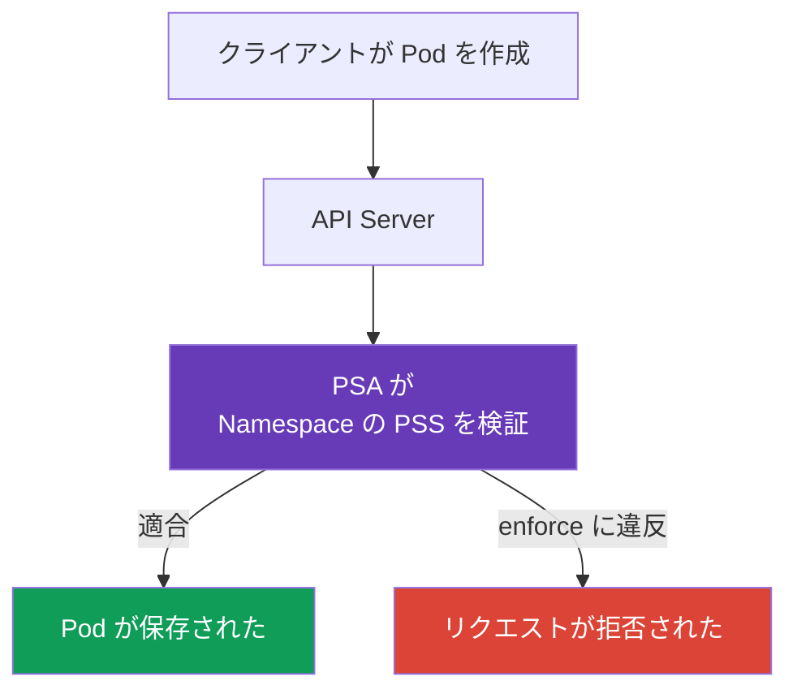

[Русская версия](ru.md) · [Eng version](README.md) · [Versión en español](es.md) · [Version française](fr.md) · [Deutsche Version](de.md) · [ქართული ვერსია](ge.md) · [繁體中文版](tw.md)

# 第11章. Pod Security Standards と Pod Security Admission

> **次へ。** [第10章](../10/jp.md)では、authentication と authorization を分けて説明しました。これらは、誰が API にアクセスするか、そしてどの操作が許可されるかを決定します。しかし、`Pod` を作成する権限があっても、そのマニフェストが安全であるとは限りません。ここでは、組み込みの Pod Security Admission が Pod Security Standards (PSS) に従って `Pod` の設定をどのように検証するかを説明します。これは、KCSA ドメイン **Kubernetes Security Fundamentals** の一部で、配点は 22% です。例は Kubernetes `v1.36` を対象としています。

## 11.1 Pod Security Standards の目的

> **PSS と PSA は別のものであり、混同しやすい点に注意してください。** **Pod Security Standards (PSS)** は標準です。`privileged`、`baseline`、`restricted` の 3 つのプロファイルにより、どの `Pod` 設定が許容されるかを定義します。PSS 自体は何も検証も適用もしません。これは単にレベルの定義です。**Pod Security Admission (PSA)** はメカニズムです。組み込み admission controller として、`enforce`、`audit`、`warn` モードを通じて、選択された PSS プロファイルを特定の `Namespace` に適用します (11.3 節を参照)。言い換えると、PSS は「何が許可されるか」に答え、PSA は「どのように検証し、違反時に何が起こるか」に答えます。

**PSA の有効化方法と、デフォルトで動作するバージョン。** PSA は通常の admission controller として `kube-apiserver` に組み込まれており、別コンポーネントや webhook のインストールは不要です。Kubernetes v1.23 で beta として導入され、デフォルトで有効になりました。v1.25 以降、PSA は安定版 (GA) 機能となり、コースの対象バージョン `v1.36` を含むすべての最新クラスタでデフォルトで利用できます。apiserver レベルで PSA が有効でも、自動的に制限されるわけではありません。特定の `Namespace` に `pod-security.kubernetes.io/<mode>: <level>` labels がなければ、PSA はその namespace にプロファイルを適用しません - 実際の挙動は `privileged` と同等です (labels の正確な構文は 11.3 節を参照)。

**PSS/PSA より前にあったもの。** PSS と PSA はこの種の最初のメカニズムではありません。これらは、旧式でより複雑なクラスタ admission controller である **PodSecurityPolicy (PSP)** を置き換えました。PSP は、個別の API オブジェクト `PodSecurityPolicy` とそれへの RBAC bindings を通じて同じ課題を解決していました。PSP は Kubernetes v1.21 で deprecated となり、v1.25 で完全に削除されました。`v1.36` ではいかなる形でも利用できません。PSP の仕組みの詳細と廃止された理由は 11.4 節で説明します。

**Pod Security Standards**、すなわち PSS は、`Pod` 向けに 3 つの既成のセキュリティプロファイルを定義します。これらは、コンテナをワーカーノードへ接続したり、権限を昇格したり、分離を弱めたりする設定を制限します。そのような設定の例には、`privileged: true`、host namespaces、危険な Linux capabilities、安全でないボリュームタイプがあります。

PSS は「この workload に許容される権限レベルはどれか」という問いに答えます。コードレビュー、RBAC、ネットワーク分離を置き換えるものではありません。たとえば、RBAC は主体が `Pod` を作成する権限を持つかを決定し、PSS は `Pod` 自体が選択したプロファイルに適合するかを検証します。

Kubernetes では、組み込み admission controller の **Pod Security Admission** (PSA) が PSS を適用します。これはオブジェクトが保存される前にリクエストを検証します。有効な `enforce` モードに違反するマニフェストは API Server に受け入れられません。



## 11.2 `privileged`、`baseline`、`restricted` プロファイル

PSS プロファイルは、最も緩いものから最も厳しいものへと並びます。各プロファイルは、前のプロファイルの制限を含みます。

| プロファイル | 用途 | 主な考え方 |
|---|---|---|
| `privileged` | ノードへのアクセスを実際に必要とする、信頼されたシステムコンポーネント | PSA は PSS の制限を課しません。 |
| `baseline` | 通常の namespace 向けの共通最小レベル、および古い workloads からの移行 | privileged containers や host namespaces など、既知の権限昇格経路をブロックします。 |
| `restricted` | 通常のアプリケーション workloads | least privilege を要求します。non-root、制限された capabilities、安全な seccomp、権限昇格の禁止です。 |

`privileged` は「アプリケーションにとって安全」を意味しません。これは意図的に PSA の制限を設けないことです。CNI、CSI、またはノードエージェントには正当化できる場合がありますが、通常のサービスにはほとんど正当化できません。

`baseline` は最も危険なリクエストを排除します。特に、`privileged` containers、`hostNetwork`、`hostPID`、`hostIPC`、安全でない capabilities、`hostPath` を禁止します。最小限の保護として役立ちますが、プロセスを root 以外で実行することは要求しません。

`restricted` は、ほとんどのアプリケーション `Pod` に適しています。典型的な要件には、`runAsNonRoot: true`、`allowPrivilegeEscalation: false`、`seccompProfile: RuntimeDefault` または `Localhost`、`drop: ["ALL"]` による capabilities の削除、および制限されたボリュームタイプのリストが含まれます。正確な検査は PSS バージョンに紐付くため、namespace labels にバージョンを固定します。

## 11.3 PSA モードと namespace labels

PSA は `Namespace` の labels により、プロファイルとモードを選択します。同じ標準を 3 つの方法で有効にできます。

| モード | 違反時の結果 | 有用な場面 |
|---|---|---|
| `enforce` | API Server が不適合な `Pod` の作成または変更を拒否する | 準備済み namespace の保護。 |
| `audit` | リクエストは通るが、違反は audit events に記録される | デリバリーを停止せずに違反を評価する。 |
| `warn` | リクエストは通り、クライアントは警告を受け取る | 開発者または CI への迅速なフィードバック。 |

各モードには独自のプロファイルとバージョンを設定できます。たとえば、`baseline` を厳格に適用しつつ、`restricted` への不適合を警告できます。バージョン label は Kubernetes の更新時に期待する挙動を固定し、値 `latest` は現在の標準バージョンを使用します。

各モードは個別の label で有効になり、他のモードとは独立して動作します - 1 つのモードだけ設定することも可能です。たとえば、`enforce` のみを設定する場合です。

```yaml
apiVersion: v1
kind: Namespace
metadata:
  name: payments
  labels:
    pod-security.kubernetes.io/enforce: restricted
    pod-security.kubernetes.io/enforce-version: v1.36
```

この namespace は、作成または変更時に互換性のない `Pod` を拒否します。それだけです。`audit` と `warn` モードは設定されていないため、audit records や警告は追加しません。

実際には、多くの場合 3 つすべてのモードを同時に有効にします。ただし、同じ移行のためではありません。典型的なシナリオでは、違反を事前に確認するため `audit` と `warn` はすでに `restricted` に設定され、チームが見つかった不適合を解消するまで、`enforce` は一時的に緩い `baseline` のままにします。

```yaml
apiVersion: v1
kind: Namespace
metadata:
  name: payments
  labels:
    pod-security.kubernetes.io/enforce: baseline
    pod-security.kubernetes.io/enforce-version: v1.36
    pod-security.kubernetes.io/audit: restricted
    pod-security.kubernetes.io/audit-version: v1.36
    pod-security.kubernetes.io/warn: restricted
    pod-security.kubernetes.io/warn-version: v1.36
```

この namespace はすでに `baseline` 違反をブロックしますが、`restricted` との不適合はリクエストを拒否せず、audit log とクライアントへの警告を通じて示すだけです。これが段階的移行です。まず対象プロファイルで `audit`/`warn` を有効にし、互換性のないマニフェストを修正した後、`enforce` を同じ `restricted` まで引き上げます。

### Namespace labels と cluster-wide defaults - PSA を設定する 2 つの異なる方法

`Namespace` の labels は PSA を有効にする唯一の方法ではありませんが、もう一方の方法を実際に利用できるかは、control plane を誰が管理しているかに依存します。PSA admission controller 自体は `AdmissionConfiguration` (`PodSecurityConfiguration`) を介して設定できます。これは `kube-apiserver` に `--admission-control-config-file` フラグで渡す設定ファイルであり、**cluster-wide defaults** を設定します。すなわち、自身の labels を持たない namespace にデフォルトで適用される `enforce`/`audit`/`warn` のプロファイルとモードです。クラスタは labels とは独立して、特定の namespace、`RuntimeClass`、または `User` に対する例外 (`exemptions`) も定義できます。

**これには managed clusters にはない `kube-apiserver` へのアクセスが必要です。** `--admission-control-config-file` フラグは `kube-apiserver` プロセスを変更しますが、managed control plane (Amazon EKS、GKE、AKS) では、そのプロセスにクラスタ管理者はアクセスできません。設定はクラウドプロバイダーが管理します。そのため、managed clusters では通常、cluster-wide defaults 用の `PodSecurityConfiguration` は設定できません。残るのは namespace labels、または `kube-apiserver` を変更せずに cluster-wide default をエミュレートする、Kubernetes コミュニティの `pod-security-webhook` などのサードパーティ dynamic admission webhook です。`AdmissionConfiguration` による cluster-wide defaults が現実的なのは、たとえば `kubeadm` でデプロイしたクラスタのように、ユーザー自身が control plane を管理する場合だけです。

ここからモデルに関する重要な補足が導かれます。namespace に PSA labels が**ない**場合、それは PSS ポリシーがまったく適用されないことを自動的には意味しません。正しいモデルは次のとおりです。

1. namespace に独自の PSA labels がある場合 - それらが適用されます。
2. labels はないが、クラスタが `PodSecurityConfiguration` を通じた cluster-wide defaults で明示的に設定されている場合 - それらが適用されます。
3. namespace labels も明示的な cluster-wide defaults もない場合 - admission controller 自体の組み込みデフォルト値が適用されます。これは、バージョン `latest` で、3 つすべてのモード (`enforce`、`audit`、`warn`) に対する `privileged` プロファイルに対応します。このデフォルトで permissive なプロファイルは、実際にはほとんどの Pod をブロックも記録もしませんが、形式上は「検証が一切ない」のではなく、適用される PSS ポリシーです。

namespace labels は通常、明示的に設定されている場合に cluster-wide defaults より優先されます。つまり、特定 namespace に適用されるデフォルトのプロファイルまたはモードを override します。したがって、「labels のない namespace の Pod に何が起こるか」という問いには、そのクラスタに明示的な cluster-wide defaults が設定されているかを示さなければ、唯一の普遍的な答えはありません。KCSA レベルの説明では、この前提を明示的に述べ、「実質的に permissive なデフォルト `privileged`」と「PSS 検証がまったく存在しないこと」を混同してはいけません。

以下は、`restricted` プロファイル向けに作られた最小の `Pod` 例です。

```yaml
apiVersion: v1
kind: Pod
metadata:
  name: web
  namespace: payments
spec:
  securityContext:
    runAsNonRoot: true
    seccompProfile:
      type: RuntimeDefault
  containers:
  - name: web
    image: nginxinc/nginx-unprivileged:1.30.4-alpine-slim
    securityContext:
      allowPrivilegeEscalation: false
      capabilities:
        drop: ["ALL"]
```

PSA は設定を検証しますが、特定のイメージがこのような制限下で実行できることを保証しません。それは、厳格な `enforce` を有効にする前に workload を検証すべきチームの責任です。

## 11.4 PSP、PSA の境界、policy engines

**PodSecurityPolicy** (PSP) は、以前の `Pod` 制限メカニズムでした。Kubernetes `v1.25` 以降削除されているため、Kubernetes `v1.36` では使用しません。PSA は標準 PSS プロファイルのための組み込みの後継です。

PSA は意図的に限定されています。3 つの固定プロファイルでのみ機能し、組織固有のルールを表現できません。たとえば PSA は、`registry.example.internal` からのイメージのみを必須にすること、必須 label `owner`、CPU limit、または 1 つの `Deployment` 向けの特別な例外を要求できません。

このような条件が必要な場合は、policy engine または組み込み admission policies を使用します。たとえば、Kyverno、OPA/Gatekeeper、または CEL を使用する ValidatingAdmissionPolicy です。これらのメカニズムは PSA を補完するもので、置き換えるものではありません。PSA は安全な基本プロファイルを適用するのに便利で、個別のポリシーは組織固有の要件を検証します。

## 11.5 admission control の地図: built-in、webhook、policy

Admission は authentication と authorization の**後**、変更が etcd に保存される前に実行されます。これはオブジェクトを評価するものであり、identity や API permission を発行するものではありません。KCSA 向けの簡略化した地図は次のとおりです。

```text
Admission control
├── built-in admission plugins
│   ├── LimitRanger
│   ├── ResourceQuota
│   ├── ServiceAccount
│   ├── AlwaysPullImages
│   └── NodeRestriction
├── MutatingAdmissionPolicy + CEL
├── MutatingAdmissionWebhook
├── ValidatingAdmissionPolicy + CEL
└── ValidatingAdmissionWebhook
```

`LimitRanger` は `LimitRange` の制限と defaults を適用します。`ResourceQuota` は namespace quota の超過を許可しません。`ServiceAccount` は service account に関連する自動化を実行します。`AlwaysPullImages` は実行前に image pull を要求します。`NodeRestriction` は kubelet による変更を制限します。これらは admission plugins の例であり、すべてを暗記する一覧ではありません。

Kubernetes `v1.36` では、CEL による 2 つの組み込み declarative policy API が利用できます。該当する API objects を変更する `MutatingAdmissionPolicy` と、不適合なリクエストを検証して拒否する `ValidatingAdmissionPolicy` です。`MutatingAdmissionPolicy` は `v1.36` で stable となり、デフォルトで enabled です。Admission webhooks は外部 HTTP services のままであり、組み込み CEL policy では表現できないロジックや統合が policy に必要な場合に使われます。これらのメカニズムは authentication、authorization、PSA を置き換えません。

OPA/Gatekeeper と Kyverno は、admission path に参加できる policy engines です。これらは組み込み Kubernetes authorizer **ではなく**、クライアントを authentication しません。`Gatekeeper`/Kyverno は、identity がすでに確立され、リクエストが authorization された後に、policy に従って API object を検証または変更します。

| シナリオ | 最適なメカニズム | 近い distractor ではない理由 |
|---|---|---|
| Kubelet が他者の `Node` を変更しようとする | `NodeRestriction` | Node authorizer は authorization の段階です。ここでは mutation の許容可否を検証します。 |
| Namespace が許可された合計 CPU を使い切った | `ResourceQuota` admission plugin | HPA は request を拒否せず、tenant quota も制限しません。 |
| corporate registry 外の image を禁止する | validating policy / Gatekeeper / Kyverno / CEL policy | RBAC は caller を検証しますが、image field は分析しません。 |

## 11.6 実務での適用方法

プラットフォームチームは通常、目的別に namespace を分けます。アプリケーション namespace には `restricted` を選択し、古い workloads には `baseline` から始め、システムコンポーネントは別に配置し、必要な場所でのみ根拠をもって `privileged` を使用します。

導入は観測可能な形で進めます。まず警告と audit events を確認し、`securityContext` とイメージの互換性を修正してから、`enforce` を有効にします。クラスタ更新でチームの判断なしに検証ルールが変わらないよう、PSS バージョンを labels に固定します。

例外をポリシー回避にしてはいけません。特定の workload にノードアクセスが必要なら、それを別 namespace に分離し、理由を文書化し、RBAC、ネットワークルール、専用ノード、audit など、利用可能なすべての手段で権限を絞ります。

## 11.7 Exam vocabulary / ミニ用語集

| 用語 | 意味 |
|---|---|
| PSS | Pod Security Standards、3 つの標準 `Pod` セキュリティプロファイル。 |
| PSA | Pod Security Admission、PSS を適用する組み込み admission controller。 |
| `privileged` | PSA 制限のないプロファイル。意図的に信頼されたケースにのみ適する。 |
| `baseline` | 一般的な権限昇格経路をブロックするプロファイル。 |
| `restricted` | アプリケーション workloads 向けの厳格な least privilege プロファイル。 |
| `enforce` | ルール違反の `Pod` を拒否する PSA モード。 |
| `audit` | リクエストを拒否せず違反を audit に記録する PSA モード。 |
| `warn` | リクエストを拒否せずクライアントに警告を示す PSA モード。 |
| PSP | 削除された PodSecurityPolicy メカニズム。Kubernetes `v1.36` では使用されない。 |

## 11.8 Exam Essentials / 章の要点

- PSS は `privileged`、`baseline`、`restricted` という 3 つの既成プロファイルを定義します。
- PSA は `Namespace` labels により、保存前に `Pod` を検証します。RBAC を補完するものであり、置き換えるものではありません。
- `baseline` は明らかに危険な設定をブロックし、`restricted` はさらに least privilege を要求します。
- `enforce` は違反を拒否し、`audit` は audit に記録し、`warn` はクライアントに通知します。
- プロファイルのバージョンは、`pod-security.kubernetes.io/*-version: v1.36` 形式の labels で固定します。
- PSP は削除され、PSA は任意の組織ルールをカバーしません。そのためには policy engine または admission policy を使用します。

## 11.9 混同しやすい点と試験での出題

KCSA の問題では、各レイヤーの役割を区別することが重要です。RBAC は API の主体と操作を担い、PSA は `Pod` セキュリティプロファイルを担い、`NetworkPolicy` は許可されるネットワークフローを担います。よくある落とし穴は、`warn` を起動をブロックする保護だと考えることです。これは違反を通知するだけであり、拒否するのは `enforce` だけです。

`baseline` と `restricted` の違いも問われます。前者は root 以外での実行を保証しませんが、後者はより厳格な `securityContext` を要求します。アプリケーション namespace のデフォルトとして `privileged` が提示された場合、それはほぼ間違った選択です。

## 11.10 自己確認問題

### 1. 選択したプロファイルに違反する `Pod` を作成できなくする PSA モードはどれですか？

   - a. `warn`

   - b. `privileged`

   - c. `audit`

   - d. `enforce`

<details>
<summary>回答と解説</summary>

**正解: d.** `enforce` はリクエストを拒否します。`warn` は警告を追加するだけで、`audit` はイベントを記録し、`privileged` はモードではなくプロファイルです。

</details>

### 2. least privilege が必要な通常のアプリケーション `Pod` には、通常どの PSS プロファイルを選びますか？

   - a. `privileged`

   - b. `restricted`

   - c. `baseline`

   - d. `audit`

<details>
<summary>回答と解説</summary>

**正解: b.** `restricted` には non-root、安全な seccomp、権限昇格の禁止、制限された capabilities の要件が含まれます。`baseline` はより緩い中間レベルです。

</details>

### 3. PSA が置き換えないものはどれですか？

   - a. 主体が `create pods` を実行する RBAC 権限を持つかの検証

   - b. PSS による `Pod` 設定の検証

   - c. `enforce` モードでの不適合な `Pod` の拒否

   - d. `pod-security.kubernetes.io/enforce` labels の適用

<details>
<summary>回答と解説</summary>

**正解: a.** RBAC と PSA は異なる課題を解決します。RBAC は主体の API 操作権限を検証し、PSA はオブジェクトの安全性を検証します。その他の選択肢は PSA に関係します。

</details>

### 4. `pod-security.kubernetes.io/enforce-version: v1.36` を指定する理由は何ですか？

   - a. PSA が `Pod` を評価する PSS バージョンを固定するため。

   - b. `Pod` トラフィックの暗号化を有効にするため。

   - c. コンテナに Linux capability `NET_ADMIN` を付与するため。

   - d. Kubernetes をバージョン `v1.36` に置き換えるため。

<details>
<summary>回答と解説</summary>

**正解: a.** Version label は PSS 要件セットを固定し、クラスタ更新時のルール変更を管理可能にします。クラスタバージョン、ネットワーク、capabilities は変更しません。

</details>

### 5. 「承認された registry のイメージだけを許可する」という要件に適したメカニズムはどれですか？

   - a. Pod Security Standards 違反を通知するが、registry allowlist を設定しない PSA `warn`。
   - b. Pod security fields を制限するが、組織の registry リストを検証しない PSA `restricted`。
   - c. image registry を検証し、許可されない値を拒否するルールを持つ admission policy または policy engine。
   - d. 歴史的に Pod security fields を制限していたが、現代の registry allowlist ではない、削除済みの `PodSecurityPolicy`。

<details>
<summary>回答と解説</summary>

**正解: c.** Registry allowlist は独立した admission 要件です。PSA は固定された Pod Security Standards を適用し、任意の組織的な registry 検証は行いません。また PodSecurityPolicy は Kubernetes から削除されています。

</details>

> **次へ。** 標準を実践的に適用するには、CKS の第19章「Pod Security Admission と Pod Security Standards」を学んでください。PSS の上に組織ルールを設けるには、CKS の第20章「admission controllers と policy engines」を参照してください。コンテナ fields の役立つ基礎は、CKA の第20章「SecurityContext と capabilities」にあります。続いて、`Secret` を扱う[第12章](../12/jp.md)へ進んでください。

[目次](../README_JP.md) · [第10章](../10/jp.md) · [第12章](../12/jp.md)
