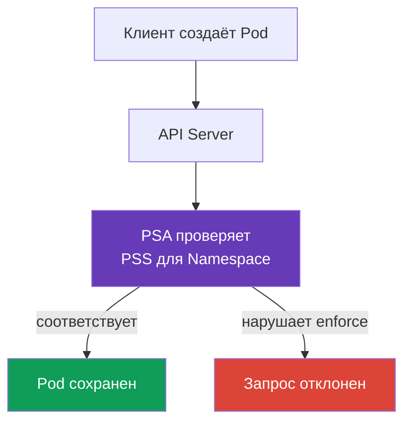

[Eng version](README.md) · [Versión en español](es.md) · [Version française](fr.md) · [Deutsche Version](de.md) · [ქართული ვერსია](ge.md) · [繁體中文版](tw.md) · [日本語版](jp.md)

# Глава 11. Pod Security Standards и Pod Security Admission

> **Что дальше.** В [главе 10](../10/ru.md) были разделены аутентификация и авторизация: они определяют, кто обращается к API и какие действия ему разрешены. Но право создать `Pod` ещё не делает его манифест безопасным. Здесь разберём, как встроенный Pod Security Admission проверяет параметры `Pod` по Pod Security Standards (PSS). Это часть домена KCSA **Kubernetes Security Fundamentals** с весом 22%. Примеры ориентированы на Kubernetes `v1.36`.

## 11.1 Назначение Pod Security Standards

> **PSS и PSA - это разные объекты, их легко перепутать.** **Pod Security Standards (PSS)** - это стандарт: три профиля (`privileged`, `baseline`, `restricted`), которые описывают, *какие* настройки `Pod` считаются допустимыми. PSS сам по себе ничего не проверяет и не применяет - это просто определение уровней. **Pod Security Admission (PSA)** - это механизм: встроенный admission-контроллер, который *применяет* выбранный профиль PSS к конкретному `Namespace` через режимы `enforce`, `audit` и `warn` (см. §11.3). Иначе: PSS отвечает на вопрос «что разрешено», PSA - на вопрос «как это проверяется и что происходит при нарушении».

**Как включается PSA и с какой версии он работает по умолчанию.** PSA встроен в `kube-apiserver` как обычный admission-контроллер и не требует установки отдельного компонента или webhook. Он появился как beta и был включён по умолчанию, начиная с Kubernetes v1.23; начиная с v1.25 PSA - стабильная (GA) функциональность, доступна по умолчанию во всех современных кластерах, включая целевую версию курса `v1.36`. Включённость PSA на уровне apiserver не означает автоматическое ограничение: без labels `pod-security.kubernetes.io/<mode>: <level>` на конкретном `Namespace` PSA не применяет ни одного профиля к этому namespace - фактическое поведение эквивалентно `privileged` (см. точный синтаксис labels в §11.3).

**Что было до PSS/PSA.** PSS и PSA - не первый механизм такого рода: они заменили **PodSecurityPolicy (PSP)** - более старый и более сложный кластерный admission-контроллер, который решал ту же задачу через отдельный API-объект `PodSecurityPolicy` и RBAC-биндинги к нему. PSP объявлен deprecated в Kubernetes v1.21 и полностью удалён в v1.25; на `v1.36` он недоступен ни в каком виде. Детали устройства PSP и почему от него отказались - в §11.4.

**Pod Security Standards**, или PSS, задают три готовых профиля безопасности для `Pod`. Они ограничивают настройки, которые могут связать контейнер с рабочим узлом, повысить его привилегии или ослабить изоляцию. Примеры таких настроек: `privileged: true`, host namespaces, опасные Linux capabilities и небезопасные типы томов.

PSS отвечают на вопрос: «Какой уровень привилегий допустим для этой рабочей нагрузки?» Они не заменяют проверку кода, RBAC или сетевую изоляцию. Например, RBAC решает, вправе ли субъект создать `Pod`, а PSS проверяет, соответствует ли сам `Pod` выбранному профилю.

В Kubernetes PSS применяет встроенный admission-контроллер **Pod Security Admission** (PSA). Он проверяет запрос до сохранения объекта: манифест, нарушающий включённый режим `enforce`, не будет принят API Server.



## 11.2 Профили `privileged`, `baseline` и `restricted`

Профили PSS расположены от наименее к наиболее строгому. Каждый следующий профиль включает ограничения предыдущего.

| Профиль | Для чего нужен | Основная идея |
|---|---|---|
| `privileged` | Доверенные системные компоненты, которым действительно нужен доступ к узлу | PSA не накладывает ограничений PSS. |
| `baseline` | Общий минимальный уровень для обычных namespace и перехода от старых рабочих нагрузок | Блокирует известные пути эскалации, например привилегированные контейнеры и host namespaces. |
| `restricted` | Обычные прикладные рабочие нагрузки | Требует least privilege: non-root, ограниченные capabilities, безопасный seccomp и отсутствие эскалации привилегий. |

`privileged` не означает «безопасный для приложения». Это сознательное отсутствие ограничений PSA, которое может быть оправдано для CNI, CSI или узлового агента, но редко оправдано для обычного сервиса.

`baseline` отсекает наиболее опасные запросы. В частности, он запрещает `privileged`-контейнеры, `hostNetwork`, `hostPID`, `hostIPC`, небезопасные capabilities и `hostPath`. Он полезен как минимальная защита, но не требует, чтобы процесс работал не от root.

`restricted` подходит для большинства прикладных `Pod`. Среди его типичных требований: `runAsNonRoot: true`, `allowPrivilegeEscalation: false`, `seccompProfile: RuntimeDefault` или `Localhost`, удаление capabilities через `drop: ["ALL"]` и ограниченный список типов томов. Точные проверки привязаны к версии PSS, поэтому версию фиксируют в labels namespace.

## 11.3 Режимы PSA и labels namespace

PSA выбирает профиль и режим через labels у `Namespace`. Один и тот же стандарт можно включить тремя способами:

| Режим | Результат при нарушении | Когда полезен |
|---|---|---|
| `enforce` | API Server отклоняет создание или изменение неподходящего `Pod` | Защита уже готового namespace. |
| `audit` | Запрос проходит, но нарушение попадает в audit events | Оценка нарушений без остановки поставки. |
| `warn` | Запрос проходит, а клиент получает предупреждение | Быстрая обратная связь разработчику или CI. |

Каждому режиму можно задать собственный профиль и версию: например, строго применять `baseline`, но предупреждать о несоответствии `restricted`. Label с версией фиксирует ожидаемое поведение при обновлении Kubernetes, а значение `latest` использует текущую версию стандартов.

Каждый режим включается отдельным label и работает независимо от других - можно задать только один режим. Например, только `enforce`:

```yaml
apiVersion: v1
kind: Namespace
metadata:
  name: payments
  labels:
    pod-security.kubernetes.io/enforce: restricted
    pod-security.kubernetes.io/enforce-version: v1.36
```

Такой namespace отклоняет несовместимые `Pod` при создании или изменении, и на этом всё - никаких audit-записей или предупреждений он не добавляет, потому что режимы `audit` и `warn` для него не заданы.

На практике часто включают все три режима сразу, но не для одной и той же миграции: типичный сценарий - `audit` и `warn` уже стоят на `restricted`, чтобы заранее увидеть нарушения, а `enforce` временно остаётся на менее строгом `baseline`, пока команда не устранит найденные несовместимости:

```yaml
apiVersion: v1
kind: Namespace
metadata:
  name: payments
  labels:
    pod-security.kubernetes.io/enforce: baseline
    pod-security.kubernetes.io/enforce-version: v1.36
    pod-security.kubernetes.io/audit: restricted
    pod-security.kubernetes.io/audit-version: v1.36
    pod-security.kubernetes.io/warn: restricted
    pod-security.kubernetes.io/warn-version: v1.36
```

Такой namespace уже блокирует нарушения `baseline`, но лишь показывает (через audit log и предупреждение клиенту) несовместимость с `restricted`, не отклоняя запрос. Это и есть постепенная миграция: сначала `audit`/`warn` на целевом профиле, затем, после того как несовместимые манифесты исправлены, `enforce` поднимают до того же `restricted`.

### Namespace labels и cluster-wide defaults - два разных способа настройки PSA

Labels на `Namespace` - не единственный способ включить PSA, но на практике доступность второго способа зависит от того, кто управляет control plane. Сам admission-контроллер PSA можно настроить через `AdmissionConfiguration` (`PodSecurityConfiguration`) - это файл конфигурации, который передают `kube-apiserver` флагом `--admission-control-config-file`, задав **cluster-wide defaults**: профиль и режим `enforce`/`audit`/`warn`, которые применяются по умолчанию к namespace, если у него нет собственных labels. Кластер может также определить исключения (`exemptions`) для отдельных namespace, `RuntimeClass` или `User`, независимо от их labels.

**Это требует доступа к `kube-apiserver`, которого нет в managed-кластерах.** Флаг `--admission-control-config-file` меняет процесс `kube-apiserver`, а в managed control plane (Amazon EKS, GKE, AKS) этот процесс администратору кластера недоступен - его конфигурацию контролирует облачный провайдер. Поэтому в managed-кластерах `PodSecurityConfiguration` для cluster-wide defaults обычно не настраивают: остаются только namespace labels, либо сторонний dynamic admission webhook (например, `pod-security-webhook` от сообщества Kubernetes), который эмулирует cluster-wide default без изменения `kube-apiserver`. Cluster-wide defaults через `AdmissionConfiguration` реалистичны только там, где control plane администрирует сам пользователь - например, кластер, развёрнутый через `kubeadm`.

Из этого следует важное уточнение модели: если в namespace **нет** labels PSA, это **не означает автоматически**, что для него нет никакой политики PSS вообще. Правильная модель такая:

1. если у namespace есть свои labels PSA - действуют они;
2. если labels нет, но кластер явно сконфигурирован с cluster-wide defaults через `PodSecurityConfiguration` - действуют они;
3. если нет ни labels namespace, ни явно заданных cluster-wide defaults - действует встроенное значение по умолчанию самого admission-контроллера, которое соответствует профилю `privileged` для всех трёх режимов (`enforce`, `audit` и `warn`), версии `latest`. Такой permissive-по-умолчанию профиль практически не блокирует и не отмечает Pod, но формально это тоже применяемая политика PSS, а не «отсутствие всякой проверки».

Labels namespace обычно имеют приоритет над cluster-wide defaults там, где они заданы явно: они переопределяют (override) применимый по умолчанию профиль или режим для конкретного namespace. Поэтому вопрос «что произойдёт с Pod в namespace без labels» не имеет единственного универсального ответа без указания, сконфигурированы ли в этом кластере явные cluster-wide defaults: KCSA-уровня рассуждение должно явно называть это допущение и не путать «эффективно permissive default `privileged`» с «отсутствием любой проверки PSS».

Ниже минимальный пример `Pod`, рассчитанный на профиль `restricted`:

```yaml
apiVersion: v1
kind: Pod
metadata:
  name: web
  namespace: payments
spec:
  securityContext:
    runAsNonRoot: true
    seccompProfile:
      type: RuntimeDefault
  containers:
  - name: web
    image: nginxinc/nginx-unprivileged:1.30.4-alpine-slim
    securityContext:
      allowPrivilegeEscalation: false
      capabilities:
        drop: ["ALL"]
```

PSA проверяет конфигурацию, но не подтверждает, что конкретный образ способен работать с такими ограничениями. Это обязанность команды, которая должна проверить рабочую нагрузку до включения строгого `enforce`.

## 11.4 PSP, границы PSA и policy engines

**PodSecurityPolicy** (PSP) был прежним механизмом ограничения `Pod`. Он удалён из Kubernetes начиная с `v1.25`, поэтому для Kubernetes `v1.36` его не используют. PSA является встроенной заменой для стандартных профилей PSS.

PSA намеренно ограничен. Он работает только с тремя фиксированными профилями и не выражает правила конкретной организации. Например, PSA не может потребовать образ только из `registry.example.internal`, обязательную label `owner`, лимит CPU или особый набор исключений для одного `Deployment`.

Когда нужны такие условия, используют policy engine или встроенные admission-политики: например, Kyverno, OPA/Gatekeeper либо ValidatingAdmissionPolicy с CEL. Эти механизмы дополняют PSA, а не отменяют его: PSA удобно применяет базовый безопасный профиль, а отдельная политика проверяет специфические требования организации.

## 11.5 Карта admission control: built-in, webhook и policy

Admission выполняется **после** authentication и authorization, до сохранения изменения в etcd. Он оценивает объект и не выдаёт identity или API-permission. Упрощённая карта для KCSA:

```text
Admission control
├── built-in admission plugins
│   ├── LimitRanger
│   ├── ResourceQuota
│   ├── ServiceAccount
│   ├── AlwaysPullImages
│   └── NodeRestriction
├── MutatingAdmissionPolicy + CEL
├── MutatingAdmissionWebhook
├── ValidatingAdmissionPolicy + CEL
└── ValidatingAdmissionWebhook
```

`LimitRanger` применяет ограничения и defaults `LimitRange`; `ResourceQuota` не допускает превышение namespace quota; `ServiceAccount` выполняет связанную с service account автоматизацию; `AlwaysPullImages` требует pull image перед запуском; `NodeRestriction` сужает изменения от kubelet. Это примеры admission plugins, а не список, который нужно заучивать целиком.

В Kubernetes `v1.36` доступны два встроенных declarative policy API на CEL: `MutatingAdmissionPolicy` для изменения подходящих API-объектов и `ValidatingAdmissionPolicy` для проверки и отклонения неподходящих запросов. `MutatingAdmissionPolicy` stable с `v1.36` и enabled by default. Admission webhooks остаются внешними HTTP-сервисами и нужны, когда policy требует логики или интеграций, которые нельзя выразить встроенной CEL-политикой. Эти механизмы не заменяют authentication, authorization или PSA.

OPA/Gatekeeper и Kyverno - policy engines, которые могут участвовать в admission path. Они **не** являются встроенным Kubernetes authorizer и **не** аутентифицируют клиента. `Gatekeeper`/Kyverno проверяют или изменяют API-объект в соответствии с policy после того, как identity уже установлена и запрос авторизован.

| Сценарий | Лучший механизм | Почему не близкий distractor |
|---|---|---|
| Kubelet пытается изменить чужой `Node` | `NodeRestriction` | Node authorizer - стадия authorization; здесь проверяется допустимость mutation. |
| Namespace исчерпал разрешённый суммарный CPU | `ResourceQuota` admission plugin | HPA не запрещает request и не ограничивает tenant quota. |
| Запретить image вне corporate registry | validating policy / Gatekeeper / Kyverno / CEL policy | RBAC проверяет caller, но не анализирует поле image. |

## 11.6 Как это применяют на практике

Команда платформы обычно разделяет namespace по назначению. Для прикладных namespace выбирают `restricted`, для устаревших рабочих нагрузок начинают с `baseline`, а системные компоненты размещают отдельно и обоснованно используют `privileged` только там, где это необходимо.

Внедрение строят наблюдаемо: сначала смотрят предупреждения и audit events, исправляют `securityContext` и совместимость образов, затем включают `enforce`. Версию PSS фиксируют в labels, чтобы обновление кластера не изменило правила проверки без решения команды.

Исключение не должно превращаться в обход политики. Если конкретной рабочей нагрузке нужен доступ к узлу, её изолируют в отдельном namespace, документируют причину и сужают полномочия всеми доступными средствами: RBAC, сетевыми правилами, отдельными узлами и аудитом.

## 11.7 Exam vocabulary / Мини-глоссарий

| Термин | Значение |
|---|---|
| PSS | Pod Security Standards, три стандартных профиля безопасности `Pod`. |
| PSA | Pod Security Admission, встроенный admission-контроллер, применяющий PSS. |
| `privileged` | Профиль без ограничений PSA; подходит только для осознанно доверенных случаев. |
| `baseline` | Профиль, блокирующий распространённые пути эскалации привилегий. |
| `restricted` | Строгий профиль least privilege для прикладных рабочих нагрузок. |
| `enforce` | Режим PSA, который отклоняет нарушающий правила `Pod`. |
| `audit` | Режим PSA, записывающий нарушения в аудит без отказа запроса. |
| `warn` | Режим PSA, показывающий предупреждение клиенту без отказа запроса. |
| PSP | Удалённый механизм PodSecurityPolicy, не используемый в Kubernetes `v1.36`. |

## 11.8 Exam Essentials / Итоги главы

- PSS определяют три готовых профиля: `privileged`, `baseline` и `restricted`.
- PSA проверяет `Pod` до сохранения через labels `Namespace`; он дополняет RBAC, а не заменяет его.
- `baseline` блокирует очевидно опасные параметры, а `restricted` дополнительно требует least privilege.
- `enforce` отклоняет нарушение, `audit` записывает его в аудит, `warn` сообщает о нём клиенту.
- Версии профилей фиксируют labels вида `pod-security.kubernetes.io/*-version: v1.36`.
- PSP удалён, а PSA не покрывает произвольные правила организации. Для них применяют policy engine или admission policy.

## 11.9 Не путать и как это встречается на экзамене

В вопросах KCSA важно отличать роль каждого уровня. RBAC отвечает за субъект и действие API, PSA за профиль безопасности `Pod`, а `NetworkPolicy` за разрешённые сетевые потоки. Частая ловушка: считать `warn` защитой, которая блокирует запуск. Он лишь сообщает о нарушении; отказ даёт только `enforce`.

Также проверяют различие между `baseline` и `restricted`. Первый профиль не обещает запуск без root, второй требует более строгий `securityContext`. Если вопрос предлагает `privileged` как default для прикладного namespace, это почти наверняка неверный выбор.

## 11.10 Вопросы для самопроверки

### 1. Какой режим PSA не даёт создать `Pod`, нарушающий выбранный профиль?

   - a. `warn`

   - b. `privileged`

   - c. `audit`

   - d. `enforce`

<details>
<summary>Ответ и разбор</summary>

**Верный ответ: d.** `enforce` отклоняет запрос. `warn` только добавляет предупреждение, `audit` фиксирует событие, а `privileged` является профилем, а не режимом.

</details>

### 2. Какой профиль PSS обычно выбирают для обычного прикладного `Pod`, которому нужен least privilege?

   - a. `privileged`

   - b. `restricted`

   - c. `baseline`

   - d. `audit`

<details>
<summary>Ответ и разбор</summary>

**Верный ответ: b.** `restricted` включает требования non-root, безопасного seccomp, запрета эскалации привилегий и ограниченных capabilities. `baseline` является менее строгим промежуточным уровнем.

</details>

### 3. Что из перечисленного PSA не заменяет?

   - a. Проверку RBAC, имеет ли субъект право `create pods`

   - b. Проверку параметров `Pod` по PSS

   - c. Отказ неподходящего `Pod` в режиме `enforce`

   - d. Применение labels `pod-security.kubernetes.io/enforce`

<details>
<summary>Ответ и разбор</summary>

**Верный ответ: a.** RBAC и PSA решают разные задачи: RBAC проверяет право субъекта на API-действие, а PSA проверяет безопасность объекта. Остальные варианты относятся к PSA.

</details>

### 4. Зачем указывать `pod-security.kubernetes.io/enforce-version: v1.36`?

   - a. Чтобы закрепить версию PSS, по которой PSA оценивает `Pod`.

   - b. Чтобы включить шифрование трафика `Pod`.

   - c. Чтобы выдать контейнеру Linux capability `NET_ADMIN`.

   - d. Чтобы заменить Kubernetes на версию `v1.36`.

<details>
<summary>Ответ и разбор</summary>

**Верный ответ: a.** Version label фиксирует набор требований PSS и делает изменение правил при обновлении кластера управляемым. Она не меняет версию кластера, сеть или capabilities.

</details>

### 5. Какой механизм уместен для требования «разрешать только образы из утверждённых registry»?

   - a. PSA `warn`, который сообщает о нарушениях Pod Security Standards, но не задаёт registry allowlist.
   - b. PSA `restricted`, который ограничивает Pod security fields, но не проверяет организационный список registry.
   - c. Admission policy или policy engine с правилом, проверяющим image registry и отклоняющим неразрешённые значения.
   - d. Удалённый `PodSecurityPolicy`, который исторически ограничивал Pod security fields, а не современный registry allowlist.

<details>
<summary>Ответ и разбор</summary>

**Верный ответ: c.** Registry allowlist является отдельным admission-требованием. PSA применяет фиксированные Pod Security Standards и не выполняет произвольную организационную проверку registry, а PodSecurityPolicy удалён из Kubernetes.

</details>

> **Куда дальше.** Для практического применения стандартов изучите главу 19 CKS: Pod Security Admission и Pod Security Standards, а для правил организации поверх PSS - главу 20 CKS: admission-контроллеры и policy-движки. Полезная база по полям контейнера есть в главе 20 CKA: SecurityContext и capabilities. Затем перейдите к [главе 12](../12/ru.md) о `Secret`.

[Оглавление](../README_RU.md) · [Глава 10](../10/ru.md) · [Глава 12](../12/ru.md)