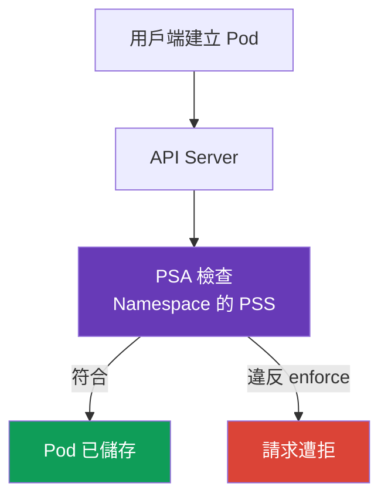

[Русская версия](ru.md) · [Eng version](README.md) · [Versión en español](es.md) · [Version française](fr.md) · [Deutsche Version](de.md) · [ქართული ვერსია](ge.md) · [日本語版](jp.md)

# 第 11 章. Pod Security Standards 與 Pod Security Admission

> **接下來。** 在[第 10 章](../10/tw.md)中，我們區分了 authentication 與 authorization：它們決定誰存取 API，以及允許其執行哪些操作。但擁有建立 `Pod` 的權限，並不表示其 manifest 是安全的。本章將說明內建的 Pod Security Admission 如何依據 Pod Security Standards (PSS) 檢查 `Pod` 參數。這是 KCSA **Kubernetes Security Fundamentals** 領域的一部分，權重為 22%。範例以 Kubernetes `v1.36` 為準。

## 11.1 Pod Security Standards 的用途

> **PSS 與 PSA 是不同的物件，且很容易混淆。** **Pod Security Standards (PSS)** 是一項標準：三個設定檔 (`privileged`、`baseline`、`restricted`) 描述哪些 `Pod` 設定被視為可接受。PSS 本身不會檢查或套用任何內容，它只是層級的定義。**Pod Security Admission (PSA)** 是一種機制：內建的 admission controller 透過 `enforce`、`audit` 與 `warn` 模式，將選定的 PSS 設定檔套用至特定 `Namespace` (參閱 §11.3)。換言之，PSS 回答「允許什麼」，PSA 回答「如何檢查，以及違規時會發生什麼」。

**PSA 如何啟用，以及從哪個版本起預設運作。** PSA 作為一般 admission controller 內建於 `kube-apiserver`，不需要安裝獨立元件或 webhook。它在 Kubernetes v1.23 以 beta 形式推出並預設啟用；從 v1.25 起，PSA 是穩定 (GA) 功能，在所有現代叢集中皆可預設使用，包括課程目標版本 `v1.36`。在 apiserver 層級啟用 PSA 不代表會自動限制：若特定 `Namespace` 沒有 `pod-security.kubernetes.io/<mode>: <level>` labels，PSA 就不會對該 namespace 套用任何設定檔，其實際行為等同於 `privileged` (labels 的精確語法請參閱 §11.3)。

**PSS/PSA 之前的機制。** PSS 與 PSA 並非第一種此類機制：它們取代了 **PodSecurityPolicy (PSP)**，這是一種較舊且更複雜的叢集層級 admission controller，透過獨立的 `PodSecurityPolicy` API 物件與其 RBAC bindings 解決相同問題。PSP 在 Kubernetes v1.21 被標記為 deprecated，並於 v1.25 完全移除；在 `v1.36` 上完全無法使用。PSP 的運作細節及其被淘汰的原因請參閱 §11.4。

**Pod Security Standards**，即 PSS，為 `Pod` 定義三個現成的安全設定檔。它們限制可能將 container 與工作節點連結、提升其權限，或削弱隔離的設定。這類設定包括：`privileged: true`、host namespaces、危險的 Linux capabilities 與不安全的 volume 類型。

PSS 回答的問題是：「此工作負載可接受何種權限等級？」它們不會取代程式碼檢查、RBAC 或網路隔離。例如，RBAC 決定主體是否有權建立 `Pod`，而 PSS 檢查 `Pod` 本身是否符合所選設定檔。

在 Kubernetes 中，PSS 由內建的 admission controller **Pod Security Admission** (PSA) 套用。它在儲存物件之前檢查請求：違反已啟用 `enforce` 模式的 manifest 不會被 API Server 接受。



## 11.2 `privileged`、`baseline` 與 `restricted` 設定檔

PSS 設定檔由最寬鬆至最嚴格排列。後續每個設定檔都包含前一個的限制。

| 設定檔 | 用途 | 核心概念 |
|---|---|---|
| `privileged` | 確實需要節點存取權的受信任系統元件 | PSA 不施加 PSS 限制。 |
| `baseline` | 一般 namespace 的通用最低層級，以及從舊版工作負載遷移時使用 | 阻擋已知的權限提升途徑，例如 privileged containers 與 host namespaces。 |
| `restricted` | 一般應用程式工作負載 | 要求 least privilege：non-root、受限制的 capabilities、安全的 seccomp，以及不得提升權限。 |

`privileged` 不表示「對應用程式安全」。這是刻意不施加 PSA 限制，對 CNI、CSI 或節點 agent 可能合理，但對一般服務很少有正當理由。

`baseline` 排除最危險的請求。尤其是，它禁止 `privileged` containers、`hostNetwork`、`hostPID`、`hostIPC`、不安全的 capabilities 與 `hostPath`。它可作為最低保護，但不要求程序以非 root 身分執行。

`restricted` 適合大多數應用程式 `Pod`。其典型要求包括：`runAsNonRoot: true`、`allowPrivilegeEscalation: false`、`seccompProfile: RuntimeDefault` 或 `Localhost`、以 `drop: ["ALL"]` 移除 capabilities，以及限制可用的 volume 類型清單。精確檢查與 PSS 版本相關，因此版本會固定在 namespace labels 中。

## 11.3 PSA 模式與 namespace labels

PSA 透過 `Namespace` 的 labels 選擇設定檔與模式。同一個標準可透過三種方式啟用：

| 模式 | 違規結果 | 適用時機 |
|---|---|---|
| `enforce` | API Server 拒絕建立或變更不符合的 `Pod` | 保護已就緒的 namespace。 |
| `audit` | 請求會通過，但違規會進入 audit events | 在不中斷交付的情況下評估違規。 |
| `warn` | 請求會通過，且用戶端會收到警告 | 為開發人員或 CI 提供快速回饋。 |

每個模式可設定自己的設定檔與版本：例如，嚴格套用 `baseline`，但對不符合 `restricted` 的情況發出警告。版本 label 會在 Kubernetes 升級時固定預期行為，而 `latest` 值會使用標準的目前版本。

每個模式由獨立 label 啟用，且彼此獨立運作，可以只設定一種模式。例如，只設定 `enforce`：

```yaml
apiVersion: v1
kind: Namespace
metadata:
  name: payments
  labels:
    pod-security.kubernetes.io/enforce: restricted
    pod-security.kubernetes.io/enforce-version: v1.36
```

這類 namespace 會在建立或變更不相容的 `Pod` 時拒絕它，僅此而已。由於未設定 `audit` 與 `warn` 模式，它不會新增 audit 記錄或警告。

實務上通常會同時啟用三種模式，但並非採用相同遷移方式：典型情境是先將 `audit` 與 `warn` 設為 `restricted` 以提前發現違規，而在團隊修正已發現的不相容項目之前，`enforce` 暫時保持在較寬鬆的 `baseline`：

```yaml
apiVersion: v1
kind: Namespace
metadata:
  name: payments
  labels:
    pod-security.kubernetes.io/enforce: baseline
    pod-security.kubernetes.io/enforce-version: v1.36
    pod-security.kubernetes.io/audit: restricted
    pod-security.kubernetes.io/audit-version: v1.36
    pod-security.kubernetes.io/warn: restricted
    pod-security.kubernetes.io/warn-version: v1.36
```

這類 namespace 已會阻擋違反 `baseline` 的項目，但只會顯示與 `restricted` 不相容的情況，不會拒絕請求，顯示方式為 audit log 與用戶端警告。這正是漸進式遷移：先將 `audit`/`warn` 設為目標設定檔，接著在不相容的 manifests 修正後，將 `enforce` 提升至相同的 `restricted`。

### Namespace labels 與 cluster-wide defaults：兩種不同的 PSA 設定方式

`Namespace` 上的 labels 並非啟用 PSA 的唯一方式，但實務上第二種方式是否可用，取決於 control plane 的管理者。PSA admission controller 本身可使用 `AdmissionConfiguration` (`PodSecurityConfiguration`) 設定，這是透過 `--admission-control-config-file` flag 傳遞給 `kube-apiserver` 的設定檔，可設定 **cluster-wide defaults**：當 namespace 沒有自己的 labels 時，預設會對其套用的 `enforce`/`audit`/`warn` 設定檔與模式。叢集也可以針對個別 namespace、`RuntimeClass` 或 `User` 定義 `exemptions`，且不受其 labels 影響。

**這需要存取 `kube-apiserver`，而 managed clusters 無法提供此存取。** `--admission-control-config-file` flag 會變更 `kube-apiserver` 程序，而在 managed control plane (Amazon EKS、GKE、AKS) 中，叢集管理員無法存取此程序，其設定由雲端供應商控制。因此，在 managed clusters 中通常不會設定用於 cluster-wide defaults 的 `PodSecurityConfiguration`：只剩下 namespace labels，或第三方 dynamic admission webhook (例如 Kubernetes 社群的 `pod-security-webhook`)，它不需變更 `kube-apiserver` 即可模擬 cluster-wide default。透過 `AdmissionConfiguration` 設定 cluster-wide defaults，僅適合 control plane 由使用者自行管理的環境，例如透過 `kubeadm` 部署的叢集。

由此可得模型上的重要釐清：若 namespace **沒有** PSA labels，並**不表示**它完全沒有任何 PSS policy。正確模型如下：

1. 若 namespace 有自己的 PSA labels，則套用它們；
2. 若沒有 labels，但叢集已透過 `PodSecurityConfiguration` 明確設定 cluster-wide defaults，則套用那些 defaults；
3. 若既沒有 namespace labels，也沒有明確設定的 cluster-wide defaults，則套用 admission controller 本身的內建預設值，其對三種模式 (`enforce`、`audit` 與 `warn`) 都對應到 `privileged` 設定檔，版本為 `latest`。這種預設寬鬆的設定檔實際上幾乎不會阻擋或標記 Pod，但正式來說它仍是已套用的 PSS policy，而非「完全沒有檢查」。

在明確設定的情況下，namespace labels 通常優先於 cluster-wide defaults：它們會 override 特定 namespace 的預設適用設定檔或模式。因此，若不說明該叢集是否設定明確的 cluster-wide defaults，「沒有 labels 的 namespace 中的 Pod 會發生什麼」這個問題沒有唯一且通用的答案。KCSA 層級的推理應明確指出此假設，並且不要將「實際上寬鬆的預設 `privileged`」與「完全沒有 PSS 檢查」混為一談。

以下是為 `restricted` 設定檔設計的最小 `Pod` 範例：

```yaml
apiVersion: v1
kind: Pod
metadata:
  name: web
  namespace: payments
spec:
  securityContext:
    runAsNonRoot: true
    seccompProfile:
      type: RuntimeDefault
  containers:
  - name: web
    image: nginxinc/nginx-unprivileged:1.30.4-alpine-slim
    securityContext:
      allowPrivilegeEscalation: false
      capabilities:
        drop: ["ALL"]
```

PSA 會檢查設定，但不會確認特定 image 能否在這些限制下執行。這是團隊的責任，必須在啟用嚴格的 `enforce` 前測試工作負載。

## 11.4 PSP、PSA 的界限與 policy engines

**PodSecurityPolicy** (PSP) 是先前限制 `Pod` 的機制。它自 `v1.25` 起已從 Kubernetes 移除，因此 Kubernetes `v1.36` 不使用它。PSA 是內建的標準 PSS 設定檔替代方案。

PSA 刻意受到限制。它只使用三個固定設定檔，無法表達特定組織的規則。例如，PSA 無法要求 image 必須來自 `registry.example.internal`、必須有 `owner` label、CPU limit，或單一 `Deployment` 的特殊例外集合。

需要這類條件時，應使用 policy engine 或內建 admission policies，例如 Kyverno、OPA/Gatekeeper 或使用 CEL 的 ValidatingAdmissionPolicy。這些機制是補充 PSA，而不是取代它：PSA 方便地套用基礎安全設定檔，而獨立 policy 檢查組織的特定要求。

## 11.5 Admission control 地圖：built-in、webhook 與 policy

Admission 發生於 authentication 與 authorization **之後**，在將變更儲存至 etcd 之前。它評估物件，不會授予 identity 或 API permission。適合 KCSA 的簡化地圖如下：

```text
Admission control
├── built-in admission plugins
│   ├── LimitRanger
│   ├── ResourceQuota
│   ├── ServiceAccount
│   ├── AlwaysPullImages
│   └── NodeRestriction
├── MutatingAdmissionPolicy + CEL
├── MutatingAdmissionWebhook
├── ValidatingAdmissionPolicy + CEL
└── ValidatingAdmissionWebhook
```

`LimitRanger` 套用 `LimitRange` 的限制與 defaults；`ResourceQuota` 不允許超過 namespace quota；`ServiceAccount` 執行與 service account 相關的自動化；`AlwaysPullImages` 要求在啟動前 pull image；`NodeRestriction` 限縮 kubelet 的變更。這些是 admission plugins 的範例，並非必須完整背誦的清單。

在 Kubernetes `v1.36` 中，提供兩個以 CEL 為基礎的內建 declarative policy API：`MutatingAdmissionPolicy` 用來變更符合的 API 物件，`ValidatingAdmissionPolicy` 用來檢查並拒絕不符合的請求。`MutatingAdmissionPolicy` 從 `v1.36` 起 stable 且 enabled by default。當 policy 需要無法以內建 CEL policy 表達的邏輯或整合時，admission webhooks 仍是外部 HTTP services。這些機制不會取代 authentication、authorization 或 PSA。

OPA/Gatekeeper 與 Kyverno 是可參與 admission path 的 policy engines。它們**不是**內建 Kubernetes authorizer，也不會 authentication 用戶端。`Gatekeeper`/Kyverno 在 identity 已建立且請求已 authorization 後，會依據 policy 檢查或變更 API 物件。

| 情境 | 最佳機制 | 為何不是相近的 distractor |
|---|---|---|
| Kubelet 嘗試變更其他的 `Node` | `NodeRestriction` | Node authorizer 屬於 authorization 階段；此處檢查 mutation 是否允許。 |
| Namespace 已用盡允許的總 CPU | `ResourceQuota` admission plugin | HPA 不會禁止 request，也不會限制 tenant quota。 |
| 禁止 corporate registry 以外的 image | validating policy / Gatekeeper / Kyverno / CEL policy | RBAC 檢查 caller，但不會分析 image 欄位。 |

## 11.6 實務套用方式

平台團隊通常會依用途區分 namespace。應用程式 namespace 選擇 `restricted`，舊版工作負載從 `baseline` 開始，而系統元件則獨立放置，並且僅在必要時有理據地使用 `privileged`。

部署應保持可觀察性：先檢視警告與 audit events，修正 `securityContext` 與 image 相容性，然後啟用 `enforce`。將 PSS 版本固定在 labels 中，以避免叢集升級在團隊未作決定的情況下變更檢查規則。

例外不應變成繞過 policy 的方式。若特定工作負載需要節點存取權，應將其隔離至獨立 namespace、記錄原因，並透過所有可用方法縮小權限：RBAC、網路規則、專用節點與 audit。

## 11.7 Exam vocabulary / 迷你詞彙表

| 術語 | 含義 |
|---|---|
| PSS | Pod Security Standards，三個標準 `Pod` 安全設定檔。 |
| PSA | Pod Security Admission，套用 PSS 的內建 admission controller。 |
| `privileged` | 沒有 PSA 限制的設定檔，只適用於有意識地信任的情境。 |
| `baseline` | 阻擋常見權限提升途徑的設定檔。 |
| `restricted` | 供應用程式工作負載使用的嚴格 least privilege 設定檔。 |
| `enforce` | PSA 模式，會拒絕違反規則的 `Pod`。 |
| `audit` | PSA 模式，將違規寫入 audit 而不拒絕請求。 |
| `warn` | PSA 模式，向用戶端顯示警告而不拒絕請求。 |
| PSP | 已移除的 PodSecurityPolicy 機制，不用於 Kubernetes `v1.36`。 |

## 11.8 Exam Essentials / 本章重點

- PSS 定義三個現成設定檔：`privileged`、`baseline` 與 `restricted`。
- PSA 透過 `Namespace` labels 在儲存前檢查 `Pod`；它補充 RBAC，而非取代 RBAC。
- `baseline` 會阻擋明顯危險的參數，而 `restricted` 額外要求 least privilege。
- `enforce` 拒絕違規，`audit` 將其寫入 audit，`warn` 向用戶端回報。
- 設定檔版本使用 `pod-security.kubernetes.io/*-version: v1.36` 形式的 labels 固定。
- PSP 已移除，PSA 不涵蓋任意的組織規則。這些規則應使用 policy engine 或 admission policy。

## 11.9 不要混淆及其在考試中的出現方式

在 KCSA 題目中，重要的是區分每個層級的角色。RBAC 負責 API 的主體與操作，PSA 負責 `Pod` 的安全設定檔，而 `NetworkPolicy` 負責允許的網路流量。常見陷阱是將 `warn` 視為阻擋啟動的保護機制。它只會回報違規；只有 `enforce` 會拒絕。

也會考查 `baseline` 與 `restricted` 的差異。前者不保證以非 root 身分執行，後者需要更嚴格的 `securityContext`。若題目將 `privileged` 作為應用程式 namespace 的 default，幾乎可以確定是錯誤選項。

## 11.10 自我檢查題

### 1. 哪一種 PSA 模式不允許建立違反所選設定檔的 `Pod`？

   - a. `warn`

   - b. `privileged`

   - c. `audit`

   - d. `enforce`

<details>
<summary>答案與說明</summary>

**正確答案：d。** `enforce` 會拒絕請求。`warn` 只會新增警告，`audit` 記錄事件，而 `privileged` 是設定檔而非模式。

</details>

### 2. 一般應用程式 `Pod` 需要 least privilege 時，通常選擇哪一種 PSS 設定檔？

   - a. `privileged`

   - b. `restricted`

   - c. `baseline`

   - d. `audit`

<details>
<summary>答案與說明</summary>

**正確答案：b。** `restricted` 包含 non-root、安全 seccomp、禁止權限提升及受限制 capabilities 的要求。`baseline` 是較寬鬆的中間層級。

</details>

### 3. PSA 不會取代下列何者？

   - a. RBAC 對主體是否有 `create pods` 權限的檢查

   - b. 依 PSS 對 `Pod` 參數的檢查

   - c. 在 `enforce` 模式下拒絕不符合的 `Pod`

   - d. 套用 labels `pod-security.kubernetes.io/enforce`

<details>
<summary>答案與說明</summary>

**正確答案：a。** RBAC 與 PSA 解決不同問題：RBAC 檢查主體執行 API 操作的權限，而 PSA 檢查物件的安全性。其餘選項都與 PSA 有關。

</details>

### 4. 為何要指定 `pod-security.kubernetes.io/enforce-version: v1.36`？

   - a. 固定 PSA 評估 `Pod` 時所依據的 PSS 版本。

   - b. 啟用 `Pod` 流量加密。

   - c. 為 container 授予 Linux capability `NET_ADMIN`。

   - d. 將 Kubernetes 替換為 `v1.36` 版本。

<details>
<summary>答案與說明</summary>

**正確答案：a。** Version label 固定 PSS 要求集，使叢集升級時對規則的變更可控。它不會變更叢集版本、網路或 capabilities。

</details>

### 5. 對於「只允許來自已核准 registry 的 images」這項要求，何種機制適合？

   - a. PSA `warn`，它會回報 Pod Security Standards 的違規，但不會定義 registry allowlist。
   - b. PSA `restricted`，它限制 Pod security fields，但不會檢查組織的 registry 清單。
   - c. Admission policy 或具有規則的 policy engine，用來檢查 image registry 並拒絕不允許的值。
   - d. 已移除的 `PodSecurityPolicy`，它過去限制 Pod security fields，而非現代的 registry allowlist。

<details>
<summary>答案與說明</summary>

**正確答案：c。** Registry allowlist 是獨立的 admission 要求。PSA 套用固定的 Pod Security Standards，不會執行任意的組織 registry 檢查，而 PodSecurityPolicy 已從 Kubernetes 移除。

</details>

> **下一步。** 如需實務套用標準，請學習 CKS 第 19 章：Pod Security Admission 與 Pod Security Standards；如需 PSS 之上的組織規則，請學習 CKS 第 20 章：admission controllers 與 policy engines。關於 container 欄位的實用基礎知識，請參閱 CKA 第 20 章：SecurityContext 與 capabilities。接著前往關於 `Secret` 的[第 12 章](../12/tw.md)。

[目錄](../README_TW.md) · [第 10 章](../10/tw.md) · [第 12 章](../12/tw.md)
