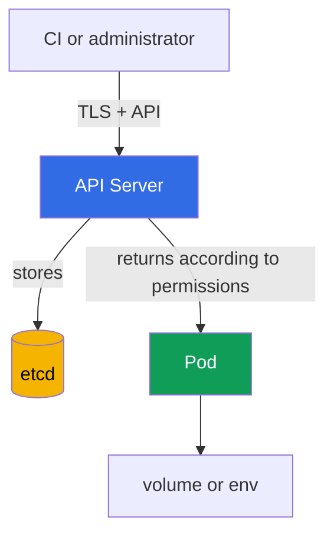

[Русская версия](ru.md) · [Versión en español](es.md) · [Version française](fr.md) · [Deutsche Version](de.md) · [ქართული ვერსია](ge.md) · [繁體中文版](tw.md) · [日本語版](jp.md)

# Chapter 12. Secrets

> **What is next.** Chapters 10-11 limited the identities, permissions, and privileges of a `Pod`. Now it is important to protect the data those identities use: passwords, tokens, keys, and certificates. A `Secret` is convenient for passing such data to a workload, but it does not make it inaccessible by itself. This is a topic in the KCSA **Kubernetes Security Fundamentals** domain, weighted at 22%. Examples in this course target Kubernetes `v1.36`.

## 12.1 What a `Secret` is and why base64 is not encryption

A `Secret` is a Kubernetes API object for sensitive small data: passwords, API tokens, TLS keys, and registry credentials. Unlike a `ConfigMap`, its purpose explicitly indicates that its contents require protection. However, an object's purpose does not replace access control and encryption.

The `data` field stores values in base64. This is **encoding**, not encryption: anyone who reads the string can decode it without a key. Base64 is used to safely represent arbitrary bytes in YAML or JSON, not to hide a secret.

```yaml
apiVersion: v1
kind: Secret
metadata:
  name: app-credentials
  namespace: shop
type: Opaque
stringData:
  username: app
  password: replace-me
```

`stringData` lets you write plain text in a manifest, and the API Server converts it into `data`. This does not make the manifest safe: a real password must not be sent to Git, attached to a ticket, or left in shell history. The example shows the object's form, not a way to store real credentials.

| Concept | Meaning | What it does not guarantee |
|---|---|---|
| `Secret` | API object for sensitive data | that only the required application will see it |
| base64 | reversible byte encoding | data confidentiality |
| `stringData` | convenient string input when creating a `Secret` | safe storage of the YAML file |
| encryption at rest | encryption of stored data in the data store | protection from a subject with `get` permission on a `Secret` |

A typical exam trap: a `Secret` is more appropriate than a `ConfigMap` for a password, but base64 is not the reason it is secure. At minimum, you need restricted access, secure delivery, and protection of data in storage.

## 12.2 Where a `Secret` can be exposed

A typical data path looks like this: a client writes a `Secret` through the API Server, the API Server stores it in etcd, and a `Pod` receives the value as a mounted file or environment variable. Each stage has its own trust boundary.



Each part of this path has its own exposure method if the trust boundary is breached. Let us examine them in order: API/etcd, then the `Pod` itself.

Important: these are not alternative but complementary risks - protecting one stage (for example, TLS between the client and API Server) does not cover the others.

**Access through the API.** A subject with `get`, `list`, or `watch` permission for `secrets` can read the data directly through the API Server, regardless of where or how the secret is physically stored. This is an RBAC matter: TLS protects the connection channel to the API Server, but does not limit what a subject with valid credentials is permitted to read.

**Access to etcd.** This is a separate vector that bypasses the API: if encryption at rest is not enabled, anyone with access to etcd data - its disk, snapshot, or backup - can read stored secrets directly, completely bypassing RBAC and the API Server. This vector is protected not through access permissions to `secrets`, but through encryption at rest and restricted access to etcd itself (see §12.3).

**Mounting in a `Pod`.** A secret as a volume file is usually preferable to an environment variable when the application can read a file and updates to mounted content are needed. However, both methods pass the value to the process. Any process in the same container with sufficient permissions can read it; compromise of a worker node endangers secrets mounted in `Pod` instances scheduled on it.

**Bypass through `create pods` without permission to read a `Secret`.** This is a separate and important exam case: a subject does not need `get`/`list`/`watch` permission on `secrets` to read a specific `Secret` by name. If the subject has `create` permission on `pods` (usually together with `create` on `pods/exec`), they create a new `Pod` in the same namespace, mount an existing `Secret` into it as a volume or env - RBAC does not check permissions on the `Secret` object itself for this, only permission to create a `Pod` - then exec into their new `Pod` and read the mounted value. Therefore, `create` on `pods` in a namespace with sensitive `Secret` instances is equivalent to being able to read any of them, even with no permission on `secrets` at all.

**Environment variables.** They are convenient, but may accidentally appear in diagnostic output, a process dump, application logs, or a debugging interface. Do not print the entire environment or pass secrets as command-line arguments. This reduces the chance of exposure, but does not replace RBAC and node protection.

Do not mount one shared `Secret` into every application in a namespace. A separate `Secret` and separate `ServiceAccount` for each workload limit the consequences of its compromise.

## 12.3 Encryption at rest: `EncryptionConfiguration`, providers, and KMS

Encryption at rest protects resources written by the API Server to etcd. The API Server applies settings from `EncryptionConfiguration` when writing, and decrypts previously stored values when reading. For a `Secret`, this protects data if an attacker obtains an etcd data file, snapshot, or backup, but does not obtain permission to read the object through the API.

The configuration specifies resources and an ordered list of providers. The first matching provider is used for new writes; the others are needed, in particular, to read data encrypted with a previous key or provider. `identity` means storage without encryption and must not be the first choice for `secrets`.

```yaml
apiVersion: apiserver.config.k8s.io/v1
kind: EncryptionConfiguration
resources:
  - resources:
      - secrets
    providers:
      - kms:
          apiVersion: v2
          name: key-service
          endpoint: unix:///var/run/kmsplugin/socket.sock
          timeout: 3s
      - identity: {}
```

This is a structurally correct minimal KMS v2 example: `name` identifies the provider, `endpoint` specifies the plugin's Unix socket, and `timeout` is optional. KMS v2 does not use `cachesize`. KMS v1 has been deprecated since Kubernetes v1.28 and disabled by default since v1.29; KMS v2 is the currently recommended API.

`identity` in this order is acceptable only as a transitional reader for objects encrypted before KMS was enabled. After all data is re-encrypted, remove it; otherwise, new writes may be stored unencrypted if the provider order is incorrect. Connecting the file to the API Server, KMS availability, storage of its keys, rotation, and re-encryption of existing objects require a separate operational plan. They cannot safely be replaced by copying a short YAML file.

| Provider | Concept | Important boundary |
|---|---|---|
| `identity` | stores the value as is | does not provide encryption at rest |
| local cryptographic provider | encrypts data with a key from the API Server configuration | the key must also be stored securely and rotated |
| `kms` | delegates cryptographic operations to an external KMS provider; KMS v2 is the currently recommended API | requires KMS protection, availability, and auditing |

KMS is commonly used for separation of duties: Kubernetes stores encrypted data, while a dedicated system or cloud KMS manages keys. This adds protection and auditing but creates a dependency: an unavailable or incorrectly configured KMS can affect the availability of secret operations. Therefore, KMS is not a magic checkbox, but part of the threat model and recovery plan.

**Managed control plane: `EncryptionConfiguration` is not directly available.** Everything described above - `EncryptionConfiguration`, the `--encryption-provider-config` flag, and the `kube-apiserver` process itself - is managed by the cloud provider in managed clusters (Amazon EKS, GKE, AKS): a cluster administrator cannot edit this file or directly supply a custom KMS plugin as they can in a self-managed cluster (for example, through `kubeadm`). Managed providers address this task with their own mechanism, not through direct access to `EncryptionConfiguration`. For example, in Amazon EKS, starting with Kubernetes v1.28, envelope encryption for all Kubernetes API data (`Secret`, `ConfigMap`, and other resources) is enabled **by default**, without any user action, using an AWS-owned KMS key through KMS v2. Additionally, an EKS administrator can attach a **customer-managed** KMS key - this is done through a separate EKS API (`aws eks` CLI, `eksctl`, or Terraform), not by editing the cluster's `EncryptionConfiguration`. The conclusion for managed clusters is this: encryption at rest for `secrets` is likely already enabled by the provider, but its provider and key are determined by the platform, not the file shown earlier in this chapter.

## 12.4 RBAC, hygiene, and external secret managers

The first practical control is least privilege in RBAC. Permission on `secrets` is granted to a specific `ServiceAccount` or user, only in the required namespace and only with the required verbs. `list` and `watch` are more dangerous than a targeted `get`: they can expose many objects at once. Permission to create or modify a `Role` and `RoleBinding` is also sensitive because it enables indirect expansion of access.

```bash
kubectl auth can-i get secrets \
  --as=system:serviceaccount:shop:orders-api -n shop
```

Let us examine every parameter in this command:

- `get secrets` - the action being checked: the RBAC verb (`get`) and resource type (`secrets`). This exact pair is checked against the rules of a `Role`/`ClusterRole`.
- `--as=system:serviceaccount:shop:orders-api` - the identity on whose behalf the check is performed (impersonation). The string `system:serviceaccount:<namespace>:<name>` is the full identity name of a specific `ServiceAccount` in Kubernetes: the fixed `system:serviceaccount:` prefix, then the namespace where the `ServiceAccount` was created (here, `shop`), then the `metadata.name` of the `ServiceAccount` object itself (here, `orders-api`). This is not a freely formatted string - it is exactly how the Kubernetes authentication layer sees any `ServiceAccount` when making a request, and it is the name to which `subjects` in a `RoleBinding`/`ClusterRoleBinding` refer.
- `-n shop` - the namespace **in which the action is checked**: `get secrets` (that is, `secrets` in the `shop` namespace). It may or may not match the namespace of the `ServiceAccount` in `--as`: a `ServiceAccount` from one namespace can have permissions on resources in another namespace through a `RoleBinding` if RBAC is configured that way.

The command answers whether the specified identity is allowed to perform the action. It is useful for verification, but does not replace a review of rules and auditing of actual requests.

Secret hygiene includes several ongoing rules:

- do not record values in Git, images, Helm values, logs, or issue trackers;
- do not use a token or password longer than necessary; rotate compromised values;
- limit which `Pod` instances receive a specific `Secret`, and do not give an application unnecessary API access;
- protect backups, snapshots, and CI artifacts as carefully as production data;
- do not print `Secret` contents with commands or scripts into a shared terminal or CI log.

An external manager, such as HashiCorp Vault or a cloud secrets manager, stores secrets outside ordinary Kubernetes objects and often offers rotation, auditing, and centralized policies. There are two fundamentally different ways to deliver its values to a `Pod`, and they affect the threat model differently:

- **Synchronization into a Kubernetes `Secret`.** `External Secrets Operator` (ESO) reads a value from external storage and creates an ordinary Kubernetes `Secret` from it so the application can use the familiar interface (volume or env). This is convenient, but does not eliminate risk entirely: after synchronization, the value is again present in the Kubernetes API as an ordinary `Secret` object - all the same exposure risks from §12.2 apply to it (RBAC on `secrets`, etcd, mounting), not only the policies of Vault or the cloud secrets manager itself.
- **Init container or sidecar without a `Secret` object in Kubernetes.** Another common pattern is an agent (for example, Vault Agent or a cloud-provider equivalent) running as an init container or sidecar in the `Pod` itself. It contacts external storage when the `Pod` starts (and a sidecar also does so on later changes), retrieves the value, and puts it into a file or the application's environment variable in the same `Pod`, completely bypassing the Kubernetes API. Here, no `Secret` object exists in Kubernetes at all: RBAC rules on `secrets`, encryption at rest in etcd, and `kubectl get secrets` do not apply to this data - all access control shifts to the agent's authentication to external storage and protection of the filesystem/environment inside the `Pod`.

The choice depends on requirements for rotation, auditing, availability, and the platform already in use.

## 12.5 How this is applied in practice

A platform team usually first determines which applications truly need each secret and how they receive it. It then restricts reading through RBAC, enables encryption at rest for sensitive resources, and verifies that backups are protected no less than etcd.

For applications, choose the least risky delivery method: a file in a volume instead of an environment variable if the application supports it; separate secrets rather than one shared secret; short-lived credentials instead of permanent ones if an external provider issues them. In CI, use protected variable storage and output masking, but do not treat masking as a replacement for access control.

At the process level, inventory and rotation matter: who owns a secret, where it is used, how to replace it during an incident, and which old copies exist in backups. This reduces response time when a token accidentally reaches a log or repository.

## 12.6 Exam vocabulary / Mini-glossary

| Term | Meaning |
|---|---|
| `Secret` | Kubernetes API object for sensitive small data. |
| base64 | Reversible byte encoding, not cryptographic protection. |
| encryption at rest | Encryption of stored data, for example etcd records. |
| `EncryptionConfiguration` | API Server configuration that specifies encryption of API resources in etcd. |
| KMS v2 | The currently recommended API for API Server integration with KMS; KMS v1 has been deprecated since v1.28 and disabled by default since v1.29. |
| `identity` | Provider without encryption; a temporary reader during migration, removed after data is re-encrypted. |
| envelope encryption | An approach where data is encrypted with a data key, which is protected by a KMS key. |
| `External Secrets Operator` | A controller that synchronizes values from an external secrets manager into a Kubernetes `Secret`. |

## 12.7 Exam Essentials / Chapter summary

- A `Secret` is intended for sensitive data, but base64 in the `data` field is only encoding.
- A secret can be exposed through overly broad API permissions, etcd and its copies, a mount in a `Pod`, environment variables, logs, or CI.
- Encryption at rest through `EncryptionConfiguration` protects storage in etcd, but does not replace TLS, RBAC, and node security.
- KMS v2 is the currently recommended API: KMS v1 has been deprecated since v1.28 and disabled by default since v1.29; the integration requires access control, monitoring, and an availability plan.
- Least-privilege RBAC, rotation, keeping secrets out of Git, and limited delivery to workloads reduce the exposure radius.
- Vault and `External Secrets Operator` extend storage and rotation capabilities, but do not eliminate protection of a value after it appears in a `Pod` or the Kubernetes API.

## 12.8 Do not confuse these concepts and how they appear on the exam

In an MCQ (multiple choice question), you usually need to name the boundary of a specific mechanism. If a question includes base64, the correct answer almost never refers to encryption. If it concerns an etcd snapshot, choose encryption at rest and backup protection. If a subject already has `get secrets`, encryption in etcd will not stop the API Server from returning the object: RBAC is needed.

Common traps:

- confusing encryption in transit with TLS and encryption of stored data;
- assuming that the `Secret` type automatically restricts reading;
- treating KMS as a replacement for RBAC or secure mounting;
- leaving `identity` as a permanent fallback provider after all existing objects have already been re-encrypted: the correct practice is to remove `identity` from the provider list, otherwise new writes risk being stored without encryption if the provider order is incorrect (see §12.3);
- attempting to configure the KMS cache through the `cachesize` field: this is a KMS v1 parameter, and no such field exists in KMS v2 - using `cachesize` in a KMS v2 configuration is a clear indication of an API version mismatch that the exam may test;
- choosing `list` or `watch` as the "minimum" permission for one secret: both commands return the complete object of every `Secret` in the namespace, including the `data` field, not just names - that is, `list`/`watch` actually exposes the values of all secrets in the namespace, whereas access to one specific `Secret` requires only `get` with the explicit resource name in the rule (`resourceNames`);
- assuming that an external secrets manager always works the same way: the delivery method changes the threat model (see §12.4). When synchronized into a Kubernetes `Secret` (for example through `External Secrets Operator`), the value is again present in an ordinary `Secret` object and all exposure risks from §12.2 apply - RBAC, etcd, and mounting. When delivered through an init container or sidecar agent that itself contacts external storage and writes the value to a file or env inside a `Pod`, no `Secret` object arises in Kubernetes at all - RBAC on `secrets` and encryption at rest in etcd are inapplicable because the data simply is not there; control shifts entirely to the agent's authentication to external storage.

A useful reasoning order: determine where the risk is, then choose a mechanism for that boundary - RBAC for the API, encryption at rest for etcd, secure delivery for a `Pod`, and a rotation process for the consequences of exposure.

## 12.9 Self-check questions

### 1. What does base64 mean in the `data` field of a `Secret` object?

   - a. The data is represented using reversible encoding.

   - b. The data is automatically encrypted with KMS.

   - c. The data is encrypted with an API Server key.

   - d. The data is available only to a `ServiceAccount` from the same namespace.

<details>
<summary>Answer and explanation</summary>

**Correct answer: a.** Base64 encodes bytes for representation in the API. It can be decoded without a cryptographic key, so RBAC and encryption at rest are needed.

</details>

### 2. Which control primarily protects a `Secret` in an etcd snapshot when a backup file is stolen?

   - a. `NetworkPolicy`.

   - b. `automountServiceAccountToken: false`.

   - c. An environment variable instead of a volume.

   - d. Encryption at rest through `EncryptionConfiguration`.

<details>
<summary>Answer and explanation</summary>

**Correct answer: d.** Encryption at rest protects stored etcd records and their copies. The other options concern networking, `ServiceAccount` tokens, or the delivery method to a `Pod`.

</details>

### 3. A user has `get` permission for `secrets` in a namespace. What will enabling KMS change for this request to the API Server?

   - a. KMS will add a separate authorization check and reject `get` if the user does not have direct access to the encryption key.
   - b. The API Server will return ciphertext to the authorized user instead of the original value because KMS prohibits server-side decryption.
   - c. KMS will convert the `Secret` into an object that can no longer be read through the regular Kubernetes API even with RBAC allowing it.
   - d. The authorization decision will not change: the API Server will decrypt stored data and return the object to the subject whom RBAC permits to read it.

<details>
<summary>Answer and explanation</summary>

**Correct answer: d.** Encryption at rest and KMS protect stored data, not replace Kubernetes authorization. If the API request is allowed, the API Server performs the necessary decryption and returns the object. Therefore, least-privilege RBAC remains mandatory.

</details>

### 4. Why is `list` for the `secrets` resource usually more dangerous than a targeted `get`?

   - a. `list` cannot be used with a `ServiceAccount`.

   - b. `list` disables TLS for the API Server.

   - c. `list` is needed only for etcd encryption.

   - d. `list` can expose the values of many secrets at once.

<details>
<summary>Answer and explanation</summary>

**Correct answer: d.** Bulk reading increases the volume of exposed data. Least privilege aims to grant only the needed resource and verb.

</details>

### 5. Which statement about `External Secrets Operator` is correct?

   - a. It can synchronize a value from external storage into a Kubernetes `Secret`.

   - b. It makes base64 cryptographic encryption.

   - c. It replaces RBAC for a `Secret`.

   - d. It guarantees that the value never reaches Kubernetes.

<details>
<summary>Answer and explanation</summary>

**Correct answer: a.** The operator connects an external secrets manager with Kubernetes resources. After synchronization, the usual API, etcd, and mounting risks must still be considered.

</details>

> **Where next.** For practical configuration of encryption at rest, KMS, key rotation, and verification of stored records, study CKS chapter 21 on etcd encryption and secure `Secret` storage. For the administrative foundations of `Secret` and ways to pass values to a `Pod`, CKA chapter 19 is useful.

[Table of contents](../README.md) · [Chapter 11](../11/README.md) · [Chapter 13](../13/README.md)
