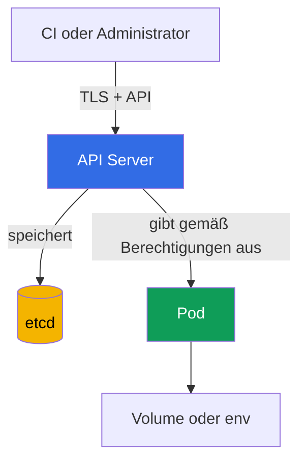

[Русская версия](ru.md) · [Eng version](README.md) · [Versión en español](es.md) · [Version française](fr.md) · [ქართული ვერსია](ge.md) · [繁體中文版](tw.md) · [日本語版](jp.md)

# Kapitel 12. Secrets

> **Wie geht es weiter.** In den Kapiteln 10-11 wurden die Identitäten, Berechtigungen und Privilegien von `Pod` eingeschränkt. Jetzt ist es wichtig, die Daten zu schützen, die diese Identitäten nutzen: Passwörter, Tokens, Schlüssel und Zertifikate. `Secret` ist praktisch, um solche Daten an einen Workload zu übergeben, macht sie aber nicht automatisch unzugänglich. Dies ist ein Thema der KCSA-Domäne **Kubernetes Security Fundamentals** mit einer Gewichtung von 22%. Die Beispiele im Kurs beziehen sich auf Kubernetes `v1.36`.

## 12.1 Was ist ein `Secret` und warum ist base64 keine Verschlüsselung

`Secret` ist ein Kubernetes-API-Objekt für sensible kleine Daten: Passwörter, API-Tokens, TLS-Schlüssel und Zugangsdaten für Registries. Anders als bei `ConfigMap` weist sein Zweck ausdrücklich darauf hin, dass der Inhalt geschützt werden muss. Der Zweck des Objekts ersetzt jedoch weder Zugangskontrolle noch Verschlüsselung.

Das Feld `data` speichert Werte in base64. Das ist eine **Kodierung**, keine Verschlüsselung: Jeder, der die Zeichenfolge liest, kann sie ohne Schlüssel dekodieren. Base64 dient dazu, beliebige Bytes sicher in YAML oder JSON darzustellen, nicht dazu, ein Secret zu verbergen.

```yaml
apiVersion: v1
kind: Secret
metadata:
  name: app-credentials
  namespace: shop
type: Opaque
stringData:
  username: app
  password: replace-me
```

`stringData` ermöglicht die Eingabe von Klartext im Manifest, und der API Server wandelt ihn in `data` um. Das macht das Manifest nicht sicher: Ein echtes Passwort darf weder an Git gesendet, einem Ticket beigefügt noch in der shell history belassen werden. Das Beispiel zeigt die Form des Objekts, nicht eine Methode zum Speichern echter Zugangsdaten.

| Begriff | Bedeutung | Was es nicht garantiert |
|---|---|---|
| `Secret` | API-Objekt für sensible Daten | dass sie nur die benötigte Anwendung sieht |
| base64 | reversible Bytekodierung | Vertraulichkeit der Daten |
| `stringData` | bequeme Eingabe von Zeichenfolgen beim Erstellen eines `Secret` | sichere Speicherung der YAML-Datei |
| encryption at rest | Verschlüsselung gespeicherter Daten im Datenspeicher | Schutz vor einem Subjekt mit `get`-Recht auf `Secret` |

Eine typische Prüfungsfalle: `Secret` ist für ein Passwort besser geeignet als `ConfigMap`, aber base64 ist nicht der Grund für seine Sicherheit. Erforderlich sind mindestens Zugangsbeschränkung, sichere Bereitstellung und Schutz der Daten im Speicher.

## 12.2 Wo ein `Secret` offengelegt werden kann

Der übliche Datenpfad sieht so aus: Ein Client schreibt ein `Secret` über den API Server, der API Server speichert es in etcd, und ein `Pod` erhält den Wert als eingehängte Datei oder Umgebungsvariable. An jedem Abschnitt gibt es eine eigene Vertrauensgrenze.



Jeder Abschnitt dieses Pfads hat eine eigene Möglichkeit zur Offenlegung, wenn die Vertrauensgrenze verletzt wird. Betrachten wir sie der Reihe nach: API/etcd, dann den `Pod` selbst.

Wichtig: Das sind keine alternativen, sondern sich ergänzende Risiken - der Schutz eines Abschnitts (beispielsweise TLS zwischen Client und API Server) deckt die übrigen nicht ab.

**Zugriff über die API.** Ein Subjekt mit der Berechtigung `get`, `list` oder `watch` für `secrets` kann die Daten direkt über den API Server lesen, unabhängig davon, wo und wie das Secret physisch gespeichert ist. Dies ist eine Frage von RBAC: TLS schützt den Verbindungskanal zum API Server, beschränkt aber nicht, was ein Subjekt mit gültigen credentials lesen darf.

**Zugriff auf etcd.** Dies ist ein separater Vektor, der die API umgeht: Ohne encryption at rest kann jeder mit Zugriff auf die etcd-Daten - auf deren Datenträger, Snapshot oder Sicherung - gespeicherte Secrets direkt lesen und damit RBAC sowie den API Server vollständig umgehen. Dieser Vektor wird nicht über Zugriffsrechte auf `secrets` geschützt, sondern über encryption at rest und die Beschränkung des Zugriffs auf etcd selbst (siehe §12.3).

**Einbindung in einen `Pod`.** Ein Secret als Volume-Datei ist normalerweise einer Umgebungsvariable vorzuziehen, wenn die Anwendung eine Datei lesen kann und Aktualisierungen des eingehängten Inhalts benötigt werden. Beide Verfahren übergeben den Wert jedoch an den Prozess. Jeder Prozess im selben Container mit ausreichenden Rechten kann ihn lesen; die Kompromittierung eines Worker-Nodes gefährdet die Secrets, die in den dort platzierten `Pod` eingehängt sind.

**Umgehung über `create pods` ohne Recht zum Lesen von `Secret`.** Dies ist ein separater und prüfungsrelevanter Fall: Ein Subjekt benötigt kein `get`/`list`/`watch`-Recht auf `secrets`, um ein bestimmtes `Secret` anhand seines Namens zu lesen. Besitzt das Subjekt ein `create`-Recht auf `pods` (normalerweise zusammen mit `create` auf `pods/exec`), erstellt es einen neuen `Pod` im selben namespace, hängt ein bereits vorhandenes `Secret` dort als Volume oder env ein - RBAC prüft dafür nicht die Rechte auf dem `Secret`-Objekt selbst, sondern nur das Recht, einen `Pod` zu erstellen - und führt anschließend `exec` in seinem neuen `Pod` aus und liest den eingehängten Wert. Daher entspricht `create` auf `pods` in einem namespace mit vertraulichen `Secret` der Möglichkeit, jedes davon zu lesen, auch wenn überhaupt keine Rechte auf `secrets` vorhanden sind.

**Umgebungsvariablen.** Sie sind praktisch, können aber versehentlich in Diagnoseausgaben, einem Prozessdump, Anwendungslogs oder einer Debug-Oberfläche erscheinen. Geben Sie nicht die gesamte Umgebung aus und übergeben Sie Secrets nicht als Kommandozeilenargumente. Das verringert die Wahrscheinlichkeit einer Offenlegung, ersetzt aber weder RBAC noch den Schutz des Nodes.

Hängen Sie nicht ein gemeinsames `Secret` in alle Anwendungen eines namespace ein. Ein separates `Secret` und eine separate `ServiceAccount` für jeden Workload begrenzen die Folgen seiner Kompromittierung.

## 12.3 Encryption at rest: `EncryptionConfiguration`, Provider und KMS

Encryption at rest schützt Ressourcen, die der API Server in etcd schreibt. Der API Server wendet die Einstellungen aus `EncryptionConfiguration` beim Schreiben an und entschlüsselt beim Lesen zuvor gespeicherte Werte. Bei `Secret` schützt dies Daten, wenn ein Angreifer die etcd-Datendatei, einen Snapshot oder eine Sicherung erhält, aber keine Berechtigung zum Lesen des Objekts über die API.

Die Konfiguration definiert Ressourcen und eine geordnete Liste von Providern. Der erste passende Provider wird für neue Einträge verwendet; die übrigen werden insbesondere benötigt, um Daten zu lesen, die mit einem früheren Schlüssel oder Provider verschlüsselt wurden. `identity` bedeutet Speicherung ohne Verschlüsselung und sollte für `secrets` nicht die erste Wahl sein.

```yaml
apiVersion: apiserver.config.k8s.io/v1
kind: EncryptionConfiguration
resources:
  - resources:
      - secrets
    providers:
      - kms:
          apiVersion: v2
          name: key-service
          endpoint: unix:///var/run/kmsplugin/socket.sock
          timeout: 3s
      - identity: {}
```

Dies ist ein strukturell korrektes Minimalbeispiel für KMS v2: `name` identifiziert den Provider, `endpoint` legt den Unix-Socket des Plugins fest, und `timeout` ist optional. Für KMS v2 wird `cachesize` nicht verwendet. KMS v1 ist seit Kubernetes v1.28 deprecated und seit v1.29 standardmäßig deaktiviert; KMS v2 ist die aktuell empfohlene API.

`identity` ist in dieser Reihenfolge nur als temporärer Reader für Objekte zulässig, die vor der Aktivierung von KMS verschlüsselt wurden. Nach der erneuten Verschlüsselung aller Daten wird er entfernt, andernfalls können neue Einträge bei einer falschen Reihenfolge der Provider unverschlüsselt gespeichert werden. Die Anbindung der Datei an den API Server, die Verfügbarkeit von KMS, die Speicherung seiner Schlüssel, Rotation und erneute Verschlüsselung bestehender Objekte erfordern einen separaten Betriebsplan. Sie können nicht sicher durch das Kopieren von kurzem YAML ersetzt werden.

| Provider | Konzept | Wichtige Grenze |
|---|---|---|
| `identity` | speichert den Wert unverändert | bietet keine encryption at rest |
| lokaler kryptografischer Provider | verschlüsselt Daten mit einem Schlüssel aus der Konfiguration des API Server | auch der Schlüssel muss sicher gespeichert und rotiert werden |
| `kms` | übergibt kryptografische Operationen an einen externen KMS-Provider; KMS v2 ist die aktuell empfohlene API | erfordert Schutz, Verfügbarkeit und Auditierung von KMS |

KMS wird normalerweise zur Aufgabentrennung verwendet: Kubernetes speichert verschlüsselte Daten, während eine dedizierte Lösung oder ein Cloud-KMS das Schlüsselmanagement übernimmt. Das fügt Schutz und Auditierung hinzu, schafft aber eine Abhängigkeit: Ein nicht verfügbarer oder falsch konfigurierter KMS kann die Verfügbarkeit von Secret-Operationen beeinträchtigen. KMS ist daher kein magisches Häkchen, sondern Teil des Threat Model und eines Wiederherstellungsplans.

**Managed Control Plane: `EncryptionConfiguration` ist nicht direkt verfügbar.** Alles zuvor Beschriebene - `EncryptionConfiguration`, das Flag `--encryption-provider-config` und der Prozess `kube-apiserver` selbst - wird bei managed Clustern (Amazon EKS, GKE, AKS) auf Seiten des Cloud-Providers verwaltet: Der Cluster-Administrator kann diese Datei nicht bearbeiten oder wie in einem selbstverwalteten Cluster (beispielsweise über `kubeadm`) direkt ein eigenes KMS-Plugin einsetzen. Managed Provider lösen diese Aufgabe mit ihrem eigenen Mechanismus, nicht mit direktem Zugriff auf `EncryptionConfiguration`. Beispielsweise ist in Amazon EKS ab Kubernetes v1.28 envelope encryption für alle Kubernetes-API-Daten (`Secret`, `ConfigMap` und andere Ressourcen) standardmäßig aktiviert, ohne dass Benutzer etwas tun müssen, und verwendet einen AWS-owned KMS-Schlüssel über KMS v2. Zusätzlich kann ein EKS-Administrator einen eigenen, customer-managed KMS-Schlüssel anbinden - dies geschieht über eine separate EKS-API (`aws eks` CLI, `eksctl` oder Terraform), nicht durch die Bearbeitung der `EncryptionConfiguration` des Clusters. Das Ergebnis für managed Cluster: Encryption at rest für `secrets` ist wahrscheinlich bereits durch den Provider aktiviert, aber dessen Provider und Schlüssel werden von der Plattform bestimmt, nicht durch die oben in diesem Kapitel gezeigte Datei.

## 12.4 RBAC, Hygiene und externe Secret-Manager

Die erste praktische Kontrolle ist least privilege in RBAC. Berechtigungen für `secrets` werden einer bestimmten `ServiceAccount` oder einem Benutzer erteilt, nur im benötigten namespace und nur mit den erforderlichen Verben. `list` und `watch` sind gefährlicher als gezieltes `get`: Sie können viele Objekte auf einmal offenlegen. Rechte zum Erstellen oder Ändern von `Role` und `RoleBinding` sind ebenfalls sensibel, da sie den Zugriff indirekt erweitern können.

```bash
kubectl auth can-i get secrets \
  --as=system:serviceaccount:shop:orders-api -n shop
```

Betrachten wir jeden Parameter dieses Befehls:

- `get secrets` - die geprüfte Aktion: das RBAC-Verb (`get`) und der Ressourcentyp (`secrets`). Genau dieses Paar wird mit den Regeln von `Role`/`ClusterRole` abgeglichen.
- `--as=system:serviceaccount:shop:orders-api` - in wessen Namen die Prüfung erfolgt (impersonation). Die Zeichenfolge `system:serviceaccount:<namespace>:<Name>` ist der vollständige Identitätsname einer bestimmten `ServiceAccount` in Kubernetes: der feste Präfix `system:serviceaccount:`, dann der namespace, in dem die `ServiceAccount` erstellt wurde (hier `shop`), anschließend `metadata.name` des Objekts `ServiceAccount` (hier `orders-api`). Dies ist keine Zeichenfolge mit beliebigem Format - genau so erkennt die Authentication-Schicht von Kubernetes jede `ServiceAccount` bei einer API-Anfrage, und genau auf diesen Namen verweisen `subjects` in `RoleBinding`/`ClusterRoleBinding`.
- `-n shop` - der namespace, **in dem die Aktion** `get secrets` geprüft wird (es geht also um `secrets` im namespace `shop`). Er kann mit dem namespace der `ServiceAccount` aus `--as` übereinstimmen oder nicht: Eine `ServiceAccount` aus einem namespace kann über `RoleBinding` durchaus Rechte auf Ressourcen in einem anderen namespace haben, wenn RBAC entsprechend konfiguriert ist.

Der Befehl beantwortet die Frage, ob der angegebenen Identität die Aktion erlaubt ist. Er ist bei der Prüfung hilfreich, ersetzt aber weder ein Review der Regeln noch die Auditierung tatsächlicher Zugriffe.

Secret-Hygiene umfasst mehrere dauerhafte Regeln:

- Werte nicht in Git, Images, Helm values, Logs und Issue-Trackern speichern;
- einen Token oder ein Passwort nicht länger als nötig verwenden, kompromittierte Werte rotieren;
- beschränken, welche `Pod` ein bestimmtes `Secret` erhalten, und der Anwendung keinen überflüssigen API-Zugriff geben;
- Backups, Snapshots und CI-Artefakte ebenso schützen wie Produktionsdaten;
- den Inhalt eines `Secret` nicht durch Befehle oder Skripte in einem gemeinsam genutzten Terminal und im CI-Protokoll ausgeben.

Ein externer Manager wie HashiCorp Vault oder ein Cloud Secrets Manager speichert Secrets außerhalb gewöhnlicher Kubernetes-Objekte und bietet häufig Rotation, Auditierung und zentralisierte Richtlinien. Es gibt zwei grundlegend verschiedene Wege, seine Werte an einen `Pod` bereitzustellen, und sie beeinflussen das Threat Model unterschiedlich:

- **Synchronisation in ein Kubernetes-`Secret`.** `External Secrets Operator` (ESO) liest den Wert aus einem externen Speicher und erstellt daraus ein gewöhnliches Kubernetes-`Secret`, damit die Anwendung die gewohnte Schnittstelle (Volume oder env) verwendet. Das ist praktisch, beseitigt das Risiko aber nicht vollständig: Nach der Synchronisation ist der Wert erneut als gewöhnliches `Secret`-Objekt in der Kubernetes-API vorhanden - für ihn gelten alle Offenlegungsrisiken aus §12.2 (`secrets`-RBAC, etcd, Einbindung), nicht nur die Richtlinien von Vault oder dem Cloud Secrets Manager.
- **Init-container oder Sidecar ohne `Secret`-Objekt in Kubernetes.** Ein anderes verbreitetes Muster ist ein Agent (beispielsweise Vault Agent oder ein Gegenstück des Cloud-Providers), der als init-container oder Sidecar im `Pod` selbst läuft. Er greift beim Start des `Pod` selbst auf den externen Speicher zu (und ein Sidecar auch bei nachfolgenden Änderungen), bezieht den Wert und legt ihn in einer Datei oder Umgebungsvariable der Anwendung im selben `Pod` ab, wodurch die Kubernetes-API vollständig umgangen wird. Hier existiert überhaupt kein `Secret`-Objekt in Kubernetes: RBAC-Regeln für `secrets`, encryption at rest in etcd und `kubectl get secrets` beziehen sich nicht auf diese Daten - die gesamte Zugangskontrolle wird auf die Authentifizierung des Agenten am externen Speicher und den Schutz des Dateisystems/der Umgebung innerhalb des `Pod` verlagert.

Die Wahl hängt von Anforderungen an Rotation, Auditierung, Verfügbarkeit und der bereits eingesetzten Plattform ab.

## 12.5 Wie dies in der Praxis angewendet wird

Ein Plattformteam bestimmt normalerweise zunächst, welche Anwendungen jedes Secret tatsächlich benötigen und wie sie es erhalten. Anschließend beschränkt es das Lesen über RBAC, aktiviert encryption at rest für sensible Ressourcen und prüft, dass Backups nicht schlechter geschützt sind als etcd.

Für Anwendungen wird der am wenigsten riskante Bereitstellungsweg gewählt: eine Datei in einem Volume statt einer Umgebungsvariable, wenn die Anwendung dies unterstützt; separate Secrets statt eines gemeinsamen; kurzlebige credentials statt dauerhafter, wenn sie von einem externen Provider ausgegeben werden. In CI werden ein geschützter Variablenspeicher und Maskierung der Ausgabe verwendet, aber die Maskierung gilt nicht als Ersatz für Zugangskontrolle.

Auf Prozessebene sind Inventarisierung und Rotation wichtig: Wer ist Eigentümer eines Secrets, wo wird es verwendet, wie wird es bei einem Vorfall ersetzt und welche alten Kopien befinden sich in Backups? Dies verkürzt die Reaktionszeit, wenn ein Token versehentlich in ein Log oder Repository gelangt.

## 12.6 Exam vocabulary / Mini-Glossar

| Begriff | Bedeutung |
|---|---|
| `Secret` | Kubernetes-API-Objekt für sensible kleine Daten. |
| base64 | Reversible Bytekodierung, kein kryptografischer Schutz. |
| encryption at rest | Verschlüsselung gespeicherter Daten, beispielsweise Einträge in etcd. |
| `EncryptionConfiguration` | Konfiguration des API Server, die die Verschlüsselung von API-Ressourcen in etcd festlegt. |
| KMS v2 | Aktuell empfohlene API für die Integration des API Server mit KMS; KMS v1 ist seit v1.28 deprecated und seit v1.29 standardmäßig deaktiviert. |
| `identity` | Provider ohne Verschlüsselung; temporärer Reader bei einer Migration, der nach der erneuten Verschlüsselung der Daten entfernt wird. |
| envelope encryption | Ansatz, bei dem Daten mit einem Datenschlüssel verschlüsselt werden, der seinerseits durch einen KMS-Schlüssel geschützt wird. |
| `External Secrets Operator` | Controller, der Werte aus einem externen Secrets Manager in ein Kubernetes-`Secret` synchronisiert. |

## 12.7 Exam Essentials / Zusammenfassung des Kapitels

- `Secret` ist für sensible Daten vorgesehen, aber base64 im Feld `data` ist nur eine Kodierung.
- Ein Secret kann durch zu weit gefasste API-Rechte, etcd und seine Kopien, die Einbindung in einen `Pod`, Umgebungsvariablen, Logs oder CI offengelegt werden.
- Encryption at rest über `EncryptionConfiguration` schützt die Speicherung in etcd, ersetzt aber weder TLS, RBAC noch Node-Sicherheit.
- KMS v2 ist die aktuell empfohlene API: KMS v1 ist seit v1.28 deprecated und seit v1.29 standardmäßig deaktiviert; die Integration erfordert Zugangskontrolle, Monitoring und einen Verfügbarkeitsplan.
- Least-privilege RBAC, Rotation, keine Secrets in Git und eine eingeschränkte Bereitstellung an Workloads verringern den Umfang einer Offenlegung.
- Vault und `External Secrets Operator` erweitern die Möglichkeiten für Speicherung und Rotation, ersetzen aber nicht den Schutz des Werts, nachdem er in einem `Pod` oder der Kubernetes-API erscheint.

## 12.8 Nicht verwechseln und wie es in der Prüfung vorkommt

In MCQ (multiple choice question, Frage mit Antwortauswahl) muss normalerweise die Grenze eines konkreten Mechanismus genannt werden. Wenn die Frage base64 enthält, spricht die richtige Antwort fast nie von Verschlüsselung. Wenn es um einen etcd-Snapshot geht, wählt man encryption at rest und den Schutz von Backups. Besitzt ein Subjekt bereits `get secrets`, verhindert Verschlüsselung in etcd nicht, dass der API Server das Objekt ausgibt: RBAC ist erforderlich.

Häufige Fallen:

- Verschlüsselung während der Übertragung mit TLS und Verschlüsselung gespeicherter Daten verwechseln;
- annehmen, dass der Typ `Secret` das Lesen automatisch beschränkt;
- KMS als Ersatz für RBAC oder eine sichere Einbindung betrachten;
- `identity` als dauerhaften Fallback-Provider beibehalten, nachdem alle vorhandenen Objekte bereits erneut verschlüsselt wurden: Die richtige Praxis ist, `identity` aus der Providerliste zu entfernen, andernfalls droht bei einer falschen Reihenfolge der Provider, dass neue Einträge unverschlüsselt gespeichert werden (siehe §12.3);
- versuchen, den KMS-Cache über das Feld `cachesize` zu konfigurieren: Dies ist ein KMS-v1-Parameter, in KMS v2 existiert ein solches Feld nicht - die Verwendung von `cachesize` in einer KMS-v2-Konfiguration ist ein eindeutiges Zeichen für eine API-Versionsabweichung, nach der die Prüfung fragen könnte;
- `list` oder `watch` als minimale Rechte für ein einzelnes Secret wählen: Beide Befehle geben das vollständige Objekt jedes `Secret` im namespace zurück, einschließlich des Felds `data`, nicht nur die Namen - `list`/`watch` legt also tatsächlich die Werte aller Secrets im namespace offen, während für den Zugriff auf nur ein bestimmtes `Secret` `get` mit einem expliziten Ressourcennamen in der Regel (`resourceNames`) genügt;
- annehmen, dass ein externer Secrets Manager immer gleich funktioniert: Der Weg der Wertbereitstellung verändert das Threat Model (siehe §12.4). Bei der Synchronisation in ein Kubernetes-`Secret` (beispielsweise über `External Secrets Operator`) ist der Wert wieder in einem gewöhnlichen `Secret`-Objekt vorhanden, und für ihn gelten alle Offenlegungsrisiken aus §12.2 - RBAC, etcd, Einbindung. Bei einer Bereitstellung über einen init-container oder Sidecar-Agenten, der selbst auf den externen Speicher zugreift und den Wert in einer Datei oder env innerhalb des `Pod` ablegt, entsteht in Kubernetes überhaupt kein `Secret`-Objekt - RBAC auf `secrets` und encryption at rest in etcd sind hier nicht anwendbar, weil sich dort schlicht keine Daten befinden; die Kontrolle wird vollständig auf die Authentifizierung des Agenten am externen Speicher verlagert.

Eine hilfreiche Denkabfolge: Den Ort des Risikos bestimmen, dann den Mechanismus für diese Grenze wählen - RBAC für die API, encryption at rest für etcd, sichere Bereitstellung für den `Pod` und einen Rotationsprozess für die Folgen einer Offenlegung.

## 12.9 Fragen zur Selbstkontrolle

### 1. Was bedeutet base64 im Feld `data` eines `Secret`-Objekts?

   - a. Die Daten liegen in einer reversiblen Kodierung vor.

   - b. Die Daten werden automatisch mit KMS verschlüsselt.

   - c. Die Daten werden mit einem Schlüssel des API Server verschlüsselt.

   - d. Die Daten sind nur für die `ServiceAccount` aus demselben namespace verfügbar.

<details>
<summary>Antwort und Erklärung</summary>

**Richtige Antwort: a.** Base64 kodiert Bytes zur Darstellung in der API. Es kann ohne kryptografischen Schlüssel dekodiert werden, daher sind RBAC und encryption at rest erforderlich.

</details>

### 2. Welche Kontrolle schützt ein `Secret` in einem etcd-Snapshot vor allem, wenn eine Backup-Datei gestohlen wird?

   - a. `NetworkPolicy`.

   - b. `automountServiceAccountToken: false`.

   - c. Eine Umgebungsvariable statt eines Volume.

   - d. Encryption at rest über `EncryptionConfiguration`.

<details>
<summary>Antwort und Erklärung</summary>

**Richtige Antwort: d.** Encryption at rest schützt gespeicherte etcd-Einträge und ihre Kopien. Die anderen Optionen betreffen das Netzwerk, Tokens von `ServiceAccount` oder den Bereitstellungsweg in einen `Pod`.

</details>

### 3. Ein Benutzer besitzt die Berechtigung `get` für `secrets` in einem namespace. Was ändert die Aktivierung von KMS bei dieser Anfrage an den API Server?

   - a. KMS fügt einen separaten Authorization Check hinzu und lehnt `get` ab, wenn der Benutzer keinen direkten Zugriff auf den encryption key hat.
   - b. Der API Server gibt dem berechtigten Benutzer ciphertext statt des ursprünglichen Werts zurück, weil KMS serverseitige Entschlüsselung verbietet.
   - c. KMS wandelt `Secret` in ein Objekt um, das auch bei erlaubendem RBAC nicht mehr über die gewöhnliche Kubernetes-API gelesen werden kann.
   - d. Die Authorization-Entscheidung ändert sich nicht: Der API Server entschlüsselt die gespeicherten Daten und gibt das Objekt an das Subjekt zurück, dem RBAC das Lesen erlaubt.

<details>
<summary>Antwort und Erklärung</summary>

**Richtige Antwort: d.** Encryption at rest und KMS schützen gespeicherte Daten, ersetzen aber nicht Kubernetes Authorization. Wenn die API-Anfrage erlaubt ist, führt der API Server die erforderliche Entschlüsselung aus und gibt das Objekt zurück. Daher bleibt least-privilege RBAC zwingend erforderlich.

</details>

### 4. Warum ist `list` für die Ressource `secrets` normalerweise gefährlicher als gezieltes `get`?

   - a. `list` kann nicht mit `ServiceAccount` verwendet werden.

   - b. `list` deaktiviert TLS für den API Server.

   - c. `list` wird nur für die Verschlüsselung von etcd benötigt.

   - d. `list` kann die Werte vieler Secrets auf einmal offenlegen.

<details>
<summary>Antwort und Erklärung</summary>

**Richtige Antwort: d.** Das massenhafte Lesen vergrößert den Umfang der offengelegten Daten. Least privilege strebt danach, nur die erforderliche Ressource und das erforderliche Verb zu erteilen.

</details>

### 5. Welche Aussage über `External Secrets Operator` ist richtig?

   - a. Er kann einen Wert aus einem externen Speicher in ein Kubernetes-`Secret` synchronisieren.

   - b. Er macht aus base64 eine kryptografische Verschlüsselung.

   - c. Er ersetzt RBAC für `Secret`.

   - d. Er garantiert, dass der Wert niemals in Kubernetes gelangt.

<details>
<summary>Antwort und Erklärung</summary>

**Richtige Antwort: a.** Der Operator verbindet einen externen Secrets Manager mit Kubernetes-Ressourcen. Nach der Synchronisation müssen die gewöhnlichen Risiken von API, etcd und Einbindung weiterhin berücksichtigt werden.

</details>

> **Wie geht es weiter.** Für die praktische Konfiguration von encryption at rest, KMS, Schlüsselrotation und die Prüfung gespeicherter Einträge lesen Sie Kapitel 21 des CKS zu etcd-Verschlüsselung und sicherer Speicherung von `Secret`. Für die administrative Grundlage von `Secret` und Wege zur Bereitstellung von Werten in einem `Pod` ist Kapitel 19 des CKA hilfreich.

[Inhaltsverzeichnis](../README_DE.md) · [Kapitel 11](../11/de.md) · [Kapitel 13](../13/de.md)