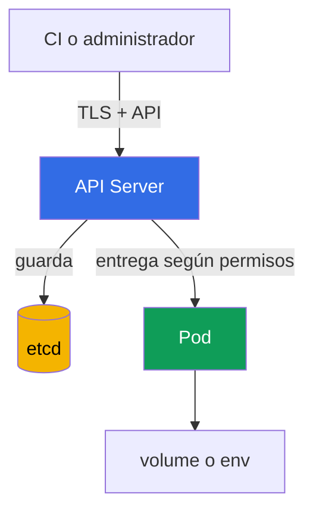

[Русская версия](ru.md) · [Eng version](README.md) · [Version française](fr.md) · [Deutsche Version](de.md) · [ქართული ვერსია](ge.md) · [繁體中文版](tw.md) · [日本語版](jp.md)

# Capítulo 12. Secrets

> **A continuación.** En los capítulos 10-11 se limitaron las identidades, los permisos y los privilegios de un `Pod`. Ahora es importante proteger los datos que usan esas identidades: contraseñas, tokens, claves y certificados. Un `Secret` permite entregar esos datos a una carga de trabajo, pero por sí solo no los hace inaccesibles. Este es un tema del dominio KCSA **Kubernetes Security Fundamentals**, con un peso del 22%. Los ejemplos del curso están orientados a Kubernetes `v1.36`.

## 12.1 Qué es un `Secret` y por qué base64 no es cifrado

`Secret` es un objeto de API de Kubernetes para datos sensibles pequeños: contraseñas, tokens de API, claves TLS y datos de acceso al registry. A diferencia de `ConfigMap`, su propósito indica explícitamente que el contenido requiere protección. Pero el propósito del objeto no sustituye el control de acceso ni el cifrado.

El campo `data` almacena valores en base64. Esto es **codificación**, no cifrado: cualquiera que lea la cadena puede decodificarla sin una clave. Base64 sirve para representar de forma segura bytes arbitrarios en YAML o JSON, no para ocultar un secreto.

```yaml
apiVersion: v1
kind: Secret
metadata:
  name: app-credentials
  namespace: shop
type: Opaque
stringData:
  username: app
  password: replace-me
```

`stringData` permite escribir texto legible en un manifiesto, y el API Server lo transforma en `data`. Esto no hace seguro el manifiesto: una contraseña real no debe enviarse a Git, adjuntarse a un ticket ni dejarse en el historial de shell. El ejemplo muestra la forma del objeto, no un modo de almacenar credenciales reales.

| Concepto | Qué significa | Qué no garantiza |
|---|---|---|
| `Secret` | Objeto de API para datos sensibles | que solo la aplicación necesaria los verá |
| base64 | codificación reversible de bytes | confidencialidad de los datos |
| `stringData` | introducción cómoda de cadenas al crear un `Secret` | almacenamiento seguro del archivo YAML |
| encryption at rest | cifrado de los datos almacenados | protección frente a un sujeto con permiso `get` sobre un `Secret` |

Una trampa típica de examen: `Secret` es más apropiado que `ConfigMap` para una contraseña, pero base64 no es el motivo de su seguridad. Como mínimo se necesitan acceso restringido, entrega segura y protección de los datos almacenados.

## 12.2 Dónde puede exponerse un `Secret`

La ruta habitual de los datos es la siguiente: un cliente escribe un `Secret` mediante el API Server, el API Server lo guarda en etcd y el `Pod` recibe el valor como archivo montado o variable de entorno. En cada tramo existe un límite de confianza propio.



Cada tramo de esta ruta tiene su propia forma de exposición si se vulnera el límite de confianza. Veámoslos en orden: API/etcd, después el propio `Pod`.

Importante: no son riesgos alternativos sino complementarios. Proteger un tramo, por ejemplo TLS entre el cliente y el API Server, no cubre los demás.

**Acceso mediante la API.** Un sujeto con permiso `get`, `list` o `watch` sobre `secrets` puede leer los datos directamente mediante el API Server, independientemente de dónde y cómo se almacene físicamente el secreto. Es una cuestión de RBAC: TLS protege el canal de conexión con el API Server, pero no limita lo que puede leer un sujeto con credentials válidas.

**Acceso a etcd.** Este es un vector independiente que omite la API: si no hay encryption at rest, cualquiera con acceso a los datos de etcd, a su disco, snapshot o copia de seguridad, lee los secretos almacenados directamente y omite por completo RBAC y el API Server. Este vector no se protege mediante permisos de acceso a `secrets`, sino con encryption at rest y restringiendo el acceso a etcd (véase §12.3).

**Montaje en un `Pod`.** Un secreto como archivo de volume suele ser preferible a una variable de entorno cuando la aplicación puede leer un archivo y se necesitan actualizaciones del contenido montado. Pero ambos métodos entregan el valor al proceso. Cualquier proceso en el mismo contenedor con permisos suficientes puede leerlo; el compromiso de un nodo de trabajo pone en riesgo los secretos montados en los `Pod` alojados en él.

**Omisión mediante `create pods` sin permiso para leer `Secret`.** Este es un caso separado e importante para el examen: un sujeto no necesita permiso `get`/`list`/`watch` sobre `secrets` para leer un `Secret` concreto por nombre. Si el sujeto tiene permiso `create` sobre `pods` (normalmente junto con `create` sobre `pods/exec`), crea un nuevo `Pod` en el mismo namespace, monta en él un `Secret` existente como volume o env, para lo cual RBAC no verifica permisos sobre el propio objeto `Secret`, solo el permiso de crear un `Pod`, y luego ejecuta `exec` en su nuevo `Pod` y lee el valor montado. Por tanto, `create` sobre `pods` en un namespace con `Secret` confidenciales equivale a poder leer cualquiera de ellos, incluso sin permisos sobre `secrets`.

**Variables de entorno.** Son convenientes, pero pueden aparecer accidentalmente en salida de diagnóstico, un volcado de proceso, registros de la aplicación o una interfaz de depuración. No imprima todo el entorno ni pase secretos como argumentos de línea de comandos. Esto reduce la probabilidad de exposición, pero no sustituye RBAC ni la protección del nodo.

No monte un único `Secret` «compartido» en todas las aplicaciones del namespace. Un `Secret` independiente y una `ServiceAccount` independiente para cada carga de trabajo reducen las consecuencias de su compromiso.

## 12.3 Encryption at rest: `EncryptionConfiguration`, proveedores y KMS

Encryption at rest protege los recursos que el API Server escribe en etcd. El API Server aplica la configuración de `EncryptionConfiguration` al escribir y descifra los valores guardados previamente al leer. Para un `Secret`, esto protege los datos si un atacante obtiene el archivo de datos de etcd, un snapshot o una copia de seguridad, pero no obtiene permiso para leer el objeto mediante la API.

La configuración define recursos y una lista ordenada de proveedores. El primer proveedor coincidente se usa para nuevas escrituras; los demás son necesarios, entre otras cosas, para leer datos cifrados con una clave o un proveedor anterior. `identity` significa almacenar sin cifrado y no debe ser la primera elección para `secrets`.

```yaml
apiVersion: apiserver.config.k8s.io/v1
kind: EncryptionConfiguration
resources:
  - resources:
      - secrets
    providers:
      - kms:
          apiVersion: v2
          name: key-service
          endpoint: unix:///var/run/kmsplugin/socket.sock
          timeout: 3s
      - identity: {}
```

Este es un ejemplo mínimo estructuralmente correcto de KMS v2: `name` identifica el proveedor, `endpoint` especifica el socket Unix del plugin y `timeout` es opcional. Para KMS v2 no se usa `cachesize`. KMS v1 está deprecated desde Kubernetes v1.28 y deshabilitado de forma predeterminada desde v1.29; KMS v2 es la API recomendada actual.

`identity` en este orden solo es aceptable como lector transitorio para objetos cifrados antes de habilitar KMS. Tras volver a cifrar todos los datos, se elimina; de lo contrario, nuevas escrituras podrían guardarse sin cifrado si el orden de proveedores es incorrecto. Conectar el archivo al API Server, la disponibilidad de KMS, el almacenamiento de sus claves, la rotación y el nuevo cifrado de los objetos existentes requieren un plan operativo independiente. No se pueden sustituir de forma segura copiando un YAML breve.

| Proveedor | Idea | Límite importante |
|---|---|---|
| `identity` | almacena el valor tal como está | no proporciona encryption at rest |
| proveedor criptográfico local | cifra datos con una clave de la configuración del API Server | la clave también debe almacenarse y rotarse de forma segura |
| `kms` | delega operaciones criptográficas a un proveedor KMS externo; KMS v2 es la API recomendada actual | requiere protección, disponibilidad y auditoría del KMS |

KMS se utiliza normalmente para separar responsabilidades: Kubernetes guarda datos cifrados, mientras que una sistema dedicado o un KMS en la nube gestiona las claves. Esto añade protección y auditoría, pero crea una dependencia: un KMS no disponible o mal configurado puede afectar la disponibilidad de las operaciones con secretos. Por ello, KMS no es una «casilla mágica», sino parte del modelo de amenazas y del plan de recuperación.

**Managed control plane: `EncryptionConfiguration` no está disponible directamente.** Todo lo descrito anteriormente, `EncryptionConfiguration`, la opción `--encryption-provider-config` y el propio proceso `kube-apiserver`, es administrado por el proveedor de nube en clústeres managed (Amazon EKS, GKE, AKS): el administrador del clúster no puede editar este archivo ni insertar directamente su propio plugin KMS, como se hace en un clúster autoadministrado, por ejemplo mediante `kubeadm`. Los proveedores managed resuelven esta tarea con su propio mecanismo, no mediante acceso directo a `EncryptionConfiguration`. Por ejemplo, en Amazon EKS a partir de Kubernetes v1.28, envelope encryption para todos los datos de la API de Kubernetes (`Secret`, `ConfigMap` y otros recursos) está habilitado **de forma predeterminada**, sin ninguna acción del usuario, utilizando una clave KMS propiedad de AWS mediante KMS v2. Además, el administrador de EKS puede conectar su propia clave KMS **administrada por el cliente**. Esto se hace mediante una API de EKS independiente (`aws eks` CLI, `eksctl` o Terraform), no editando la `EncryptionConfiguration` del clúster. La conclusión para clústeres managed es: encryption at rest para `secrets` probablemente ya está habilitado por el proveedor, pero la plataforma determina su proveedor y su clave, no el archivo mostrado anteriormente en este capítulo.

## 12.4 RBAC, higiene y gestores de secretos externos

El primer control práctico es el least privilege en RBAC. El permiso sobre `secrets` se concede a una `ServiceAccount` o usuario específico, solo en el namespace necesario y solo con los verbos requeridos. `list` y `watch` son más peligrosos que un `get` puntual: pueden revelar muchos objetos de una vez. Los permisos para crear o modificar `Role` y `RoleBinding` también son sensibles, porque permiten ampliar el acceso indirectamente.

```bash
kubectl auth can-i get secrets \
  --as=system:serviceaccount:shop:orders-api -n shop
```

Examinemos cada parámetro de este comando:

- `get secrets` - la acción comprobada: el verbo RBAC (`get`) y el tipo de recurso (`secrets`). Esta pareja se compara con las reglas de `Role`/`ClusterRole`.
- `--as=system:serviceaccount:shop:orders-api` - en nombre de quién se realiza la comprobación (impersonation). La cadena `system:serviceaccount:<namespace>:<nombre>` es el nombre completo de la identidad de una `ServiceAccount` específica en Kubernetes: el prefijo fijo `system:serviceaccount:`, después el namespace donde se creó la `ServiceAccount` (aquí `shop`), y después el propio `metadata.name` del objeto `ServiceAccount` (aquí `orders-api`). No es una cadena de formato arbitrario: así es exactamente como la capa de authentication de Kubernetes ve cualquier `ServiceAccount` al solicitar la API, y es este nombre al que hacen referencia los `subjects` en `RoleBinding`/`ClusterRoleBinding`.
- `-n shop` - el namespace **en el que se comprueba la acción** `get secrets` (es decir, se trata de `secrets` en el namespace `shop`). Puede coincidir o no con el namespace de la `ServiceAccount` de `--as`: una `ServiceAccount` de un namespace puede tener mediante `RoleBinding` permisos sobre recursos de otro namespace, si RBAC está configurado así.

El comando responde a la pregunta de si la acción está permitida para la identidad indicada. Es útil durante una comprobación, pero no sustituye la revisión de reglas ni la auditoría de los accesos reales.

La higiene de secretos incluye varias reglas permanentes:

- no registrar valores en Git, imágenes, Helm values, registros ni gestores de incidencias;
- no usar un token o contraseña más tiempo del necesario, rotar valores comprometidos;
- limitar qué `Pod` reciben un `Secret` concreto y no otorgar a la aplicación acceso innecesario a la API;
- proteger backup, snapshot y artefactos de CI igual que los datos de producción;
- no mostrar el contenido de un `Secret` mediante comandos o scripts en una terminal compartida ni en el registro de CI.

Un gestor externo, por ejemplo HashiCorp Vault o un secrets manager en la nube, almacena secretos fuera de los objetos normales de Kubernetes y con frecuencia ofrece rotación, auditoría y políticas centralizadas. Hay dos formas fundamentalmente distintas de entregar sus valores a un `Pod`, y afectan de forma distinta al modelo de amenazas:

- **Sincronización en un `Secret` de Kubernetes.** `External Secrets Operator` (ESO) lee un valor del almacenamiento externo y crea a partir de él un `Secret` normal de Kubernetes, para que la aplicación utilice la interfaz habitual (volume o env). Es práctico, pero no elimina completamente el riesgo: después de la sincronización el valor vuelve a estar presente en la API de Kubernetes como un objeto `Secret` normal. Le aplican todos los mismos riesgos de exposición de §12.2 (RBAC sobre `secrets`, etcd, montaje), no solo las políticas del propio Vault o del secrets manager en la nube.
- **Init-container o sidecar sin objeto `Secret` en Kubernetes.** Otro patrón habitual es un agente, por ejemplo Vault Agent o un equivalente del proveedor de nube, ejecutado como init-container o sidecar en el propio `Pod`. El agente se conecta al almacenamiento externo al iniciar el `Pod` (y un sidecar, también tras cambios posteriores), obtiene el valor y lo coloca en un archivo o una variable de entorno de la aplicación dentro de ese mismo `Pod`, omitiendo por completo la API de Kubernetes. Aquí no existe ningún objeto `Secret` en Kubernetes: las reglas RBAC sobre `secrets`, encryption at rest en etcd y `kubectl get secrets` no se aplican a estos datos. Todo el control de acceso se traslada a la authentication del propio agente ante el almacenamiento externo y a la protección del sistema de archivos/entorno dentro del `Pod`.

La elección depende de los requisitos de rotación, auditoría, disponibilidad y de la plataforma que ya se use.

## 12.5 Cómo se aplica en la práctica

El equipo de plataforma normalmente empieza por determinar qué aplicaciones realmente necesitan cada secreto y cómo lo reciben. Después restringe la lectura mediante RBAC, habilita encryption at rest para recursos sensibles y comprueba que los backups estén protegidos al menos tan bien como etcd.

Para las aplicaciones se elige el método de entrega menos arriesgado: un archivo en un volume en lugar de una variable de entorno, si la aplicación lo admite; secretos separados en vez de uno compartido; credentials de corta duración en vez de permanentes, si un proveedor externo los emite. En CI se usa almacenamiento protegido de variables y enmascaramiento de la salida, pero el enmascaramiento no se considera un sustituto del control de acceso.

A nivel de proceso son importantes el inventario y la rotación: quién es propietario de un secreto, dónde se utiliza, cómo sustituirlo en caso de incidente y qué copias antiguas existen en backup. Esto reduce el tiempo de reacción cuando un token llega accidentalmente a un registro o repositorio.

## 12.6 Exam vocabulary / Mini glosario

| Término | Significado |
|---|---|
| `Secret` | Objeto de API de Kubernetes para datos sensibles pequeños. |
| base64 | Codificación reversible de bytes, no protección criptográfica. |
| encryption at rest | Cifrado de datos almacenados, por ejemplo registros en etcd. |
| `EncryptionConfiguration` | Configuración del API Server que define el cifrado de recursos de API en etcd. |
| KMS v2 | La API recomendada actual para la integración del API Server con KMS; KMS v1 está deprecated desde v1.28 y deshabilitado de forma predeterminada desde v1.29. |
| `identity` | Proveedor sin cifrado; lector temporal durante una migración, que se elimina tras volver a cifrar los datos. |
| envelope encryption | Enfoque en el que los datos se cifran con una clave de datos, y esta se protege con una clave KMS. |
| `External Secrets Operator` | Controlador que sincroniza valores de un secrets manager externo en un `Secret` de Kubernetes. |

## 12.7 Exam Essentials / Resumen del capítulo

- `Secret` está destinado a datos sensibles, pero base64 en el campo `data` es solo codificación.
- Un secreto puede exponerse mediante permisos de API demasiado amplios, etcd y sus copias, un mount en un `Pod`, variables de entorno, registros o CI.
- Encryption at rest mediante `EncryptionConfiguration` protege la escritura en etcd, pero no sustituye TLS, RBAC ni la seguridad del nodo.
- KMS v2 es la API recomendada actual: KMS v1 está deprecated desde v1.28 y deshabilitado de forma predeterminada desde v1.29; la integración requiere control de acceso, monitorización y un plan de disponibilidad.
- RBAC de least privilege, rotación, ausencia de secretos en Git y entrega limitada a las cargas de trabajo reducen el radio de exposición.
- Vault y `External Secrets Operator` amplían las capacidades de almacenamiento y rotación, pero no eliminan la necesidad de proteger el valor después de que aparezca en un `Pod` o en la API de Kubernetes.

## 12.8 No confundir y cómo aparece en el examen

En una MCQ (multiple choice question, pregunta de opción múltiple) normalmente hay que identificar el límite del mecanismo concreto. Si la pregunta incluye base64, la respuesta correcta casi nunca habla de cifrado. Si se trata de un snapshot de etcd, se elige encryption at rest y protección de backup. Si un sujeto ya tiene `get secrets`, el cifrado en etcd no impedirá que el API Server entregue el objeto: se necesita RBAC.

Trampas frecuentes:

- confundir el cifrado TLS en tránsito con el cifrado de datos almacenados;
- creer que el tipo `Secret` restringe automáticamente la lectura;
- considerar KMS un sustituto de RBAC o de un montaje seguro;
- dejar `identity` como proveedor fallback permanente después de que todos los objetos existentes ya se hayan vuelto a cifrar: la práctica correcta es eliminar `identity` de la lista de proveedores; de otro modo, con un orden incorrecto de proveedores las nuevas escrituras corren el riesgo de guardarse sin cifrar (véase §12.3);
- intentar configurar la caché de KMS mediante el campo `cachesize`: es un parámetro de KMS v1; KMS v2 no tiene ese campo. Usar `cachesize` en una configuración de KMS v2 es una señal inequívoca de que la versión de API no coincide, sobre lo que puede preguntar el examen;
- elegir `list` o `watch` como permisos «mínimos» para un solo secreto: ambos comandos devuelven el objeto completo de cada `Secret` del namespace, incluido el campo `data`, no solo los nombres. Es decir, `list`/`watch` realmente revela los valores de todos los secretos del namespace, mientras que para acceder a un único `Secret` concreto basta `get` con un nombre de recurso explícito en la regla (`resourceNames`);
- creer que un secrets manager externo siempre funciona igual: el método de entrega del valor cambia el modelo de amenazas (véase §12.4). Al sincronizar en un `Secret` de Kubernetes, por ejemplo mediante `External Secrets Operator`, el valor vuelve a estar presente en un objeto `Secret` normal y se aplican todos los riesgos de exposición de §12.2: RBAC, etcd y montaje. Al entregarlo mediante un agente init-container o sidecar que se conecta por sí mismo al almacenamiento externo y coloca el valor en un archivo o env dentro de un `Pod`, no surge ningún objeto `Secret` en Kubernetes. RBAC sobre `secrets` y encryption at rest en etcd no son aplicables porque los datos simplemente no están allí; el control se traslada por completo a la authentication del agente ante el almacenamiento externo.

Un orden útil de razonamiento: determinar el lugar del riesgo y elegir después el mecanismo para ese límite: RBAC para la API, encryption at rest para etcd, entrega segura para el `Pod` y un proceso de rotación para las consecuencias de una exposición.

## 12.9 Preguntas de autoevaluación

### 1. ¿Qué significa base64 en el campo `data` de un objeto `Secret`?

   - a. Los datos se representan mediante una codificación reversible.

   - b. Los datos se cifran automáticamente con KMS.

   - c. Los datos están cifrados con una clave del API Server.

   - d. Los datos solo están disponibles para una `ServiceAccount` del mismo namespace.

<details>
<summary>Respuesta y explicación</summary>

**Respuesta correcta: a.** Base64 codifica bytes para representarlos en la API. Se puede decodificar sin una clave criptográfica, por lo que se necesitan RBAC y encryption at rest.

</details>

### 2. ¿Qué control protege principalmente un `Secret` en un snapshot de etcd ante el robo de un archivo de backup?

   - a. `NetworkPolicy`.

   - b. `automountServiceAccountToken: false`.

   - c. Una variable de entorno en lugar de un volume.

   - d. Encryption at rest mediante `EncryptionConfiguration`.

<details>
<summary>Respuesta y explicación</summary>

**Respuesta correcta: d.** Encryption at rest protege los registros almacenados en etcd y sus copias. Las demás opciones se refieren a la red, tokens de `ServiceAccount` o al método de entrega al `Pod`.

</details>

### 3. Un usuario tiene permiso `get` para `secrets` en un namespace. ¿Qué cambiará al habilitar KMS para esta solicitud al API Server?

   - a. KMS añadirá una comprobación de authorization independiente y rechazará `get` si el usuario no tiene acceso directo a la clave de cifrado.
   - b. El API Server devolverá ciphertext al usuario autorizado en lugar del valor original, porque KMS prohíbe el descifrado del lado del servidor.
   - c. KMS transformará `Secret` en un objeto que ya no se puede leer mediante la API normal de Kubernetes, incluso con RBAC que lo permita.
   - d. La decisión de authorization no cambiará: el API Server descifrará los datos almacenados y devolverá el objeto al sujeto al que RBAC permite leerlo.

<details>
<summary>Respuesta y explicación</summary>

**Respuesta correcta: d.** Encryption at rest y KMS protegen los datos almacenados, pero no sustituyen la authorization de Kubernetes. Si la solicitud de API está permitida, el API Server realiza el descifrado necesario y devuelve el objeto. Por ello, RBAC de least privilege sigue siendo obligatorio.

</details>

### 4. ¿Por qué `list` para el recurso `secrets` suele ser más peligroso que un `get` puntual?

   - a. `list` no se puede usar con una `ServiceAccount`.

   - b. `list` deshabilita TLS para el API Server.

   - c. `list` solo es necesario para el cifrado de etcd.

   - d. `list` puede revelar los valores de muchos secretos de una vez.

<details>
<summary>Respuesta y explicación</summary>

**Respuesta correcta: d.** La lectura masiva aumenta el volumen de datos expuestos. Least privilege busca conceder solo el recurso y el verbo necesarios.

</details>

### 5. ¿Qué afirmación sobre `External Secrets Operator` es correcta?

   - a. Puede sincronizar un valor de un almacenamiento externo en un `Secret` de Kubernetes.

   - b. Hace que base64 sea cifrado criptográfico.

   - c. Sustituye RBAC para un `Secret`.

   - d. Garantiza que el valor nunca llegue a Kubernetes.

<details>
<summary>Respuesta y explicación</summary>

**Respuesta correcta: a.** El operador conecta un secrets manager externo con recursos de Kubernetes. Tras la sincronización, aún deben considerarse los riesgos habituales de API, etcd y montaje.

</details>

> **A continuación.** Para la configuración práctica de encryption at rest, KMS, rotación de claves y verificación de registros almacenados, estudie el capítulo 21 de CKS sobre cifrado de etcd y almacenamiento seguro de `Secret`. Para la base administrativa de `Secret` y los métodos de entregar valores a un `Pod`, resulta útil el capítulo 19 de CKA.

[Índice](../README_ES.md) · [Capítulo 11](../11/es.md) · [Capítulo 13](../13/es.md)
