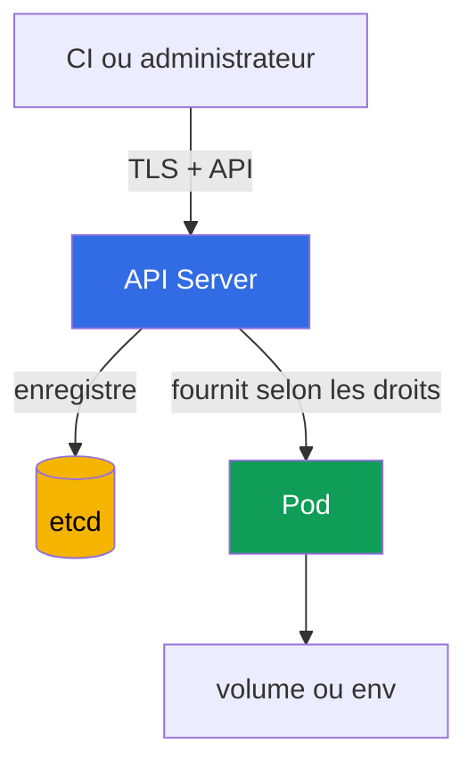

[Русская версия](ru.md) · [Eng version](README.md) · [Versión en español](es.md) · [Deutsche Version](de.md) · [ქართული ვერსია](ge.md) · [繁體中文版](tw.md) · [日本語版](jp.md)

# Chapitre 12. Secrets

> **À suivre.** Les chapitres 10-11 ont limité les identités, les autorisations et les privilèges des `Pod`. Il faut maintenant protéger les données utilisées par ces identités : mots de passe, jetons, clés et certificats. Un `Secret` facilite la transmission de ces données à une charge de travail, mais ne les rend pas inaccessibles à lui seul. Ce sujet relève du domaine KCSA **Kubernetes Security Fundamentals**, dont le poids est de 22 %. Les exemples du cours sont orientés vers Kubernetes `v1.36`.

## 12.1 Qu'est-ce qu'un `Secret` et pourquoi base64 n'est pas du chiffrement

Un `Secret` est un objet d'API Kubernetes destiné à de petites données sensibles : mots de passe, jetons d'API, clés TLS et données d'accès à un registry. Contrairement à `ConfigMap`, sa fonction indique explicitement que son contenu exige une protection. Cependant, la fonction de l'objet ne remplace ni le contrôle d'accès ni le chiffrement.

Le champ `data` stocke les valeurs en base64. C'est un **encodage**, pas un chiffrement : quiconque lit la chaîne peut la décoder sans clé. Base64 sert à représenter sans risque des octets arbitraires dans YAML ou JSON, et non à masquer un secret.

```yaml
apiVersion: v1
kind: Secret
metadata:
  name: app-credentials
  namespace: shop
type: Opaque
stringData:
  username: app
  password: replace-me
```

`stringData` permet d'écrire du texte lisible dans le manifeste, et l'API Server le convertit en `data`. Cela ne sécurise pas le manifeste : un véritable mot de passe ne doit pas être envoyé dans Git, joint à un ticket ou laissé dans l'historique du shell. L'exemple montre la forme de l'objet, non une manière de stocker de véritables identifiants.

| Notion | Signification | Ce que cela ne garantit pas |
|---|---|---|
| `Secret` | Objet d'API destiné aux données sensibles | que seule l'application requise les verra |
| base64 | Encodage réversible d'octets | la confidentialité des données |
| `stringData` | Saisie pratique de chaînes lors de la création d'un `Secret` | le stockage sécurisé du fichier YAML |
| encryption at rest | Chiffrement des données stockées dans le stockage | une protection contre un sujet ayant le droit `get` sur un `Secret` |

Piège d'examen fréquent : un `Secret` est plus adapté qu'un `ConfigMap` pour un mot de passe, mais base64 n'est pas la raison de sa sécurité. Il faut au minimum restreindre l'accès, assurer une livraison sécurisée et protéger les données dans le stockage.

## 12.2 Où un `Secret` peut être divulgué

Le chemin ordinaire des données est le suivant : un client écrit un `Secret` via l'API Server, l'API Server le conserve dans etcd, et un `Pod` obtient la valeur sous forme de fichier monté ou de variable d'environnement. Chaque étape a sa propre frontière de confiance.



Chaque partie de ce chemin a son propre mode de divulgation si la frontière de confiance est compromise. Examinons-les dans l'ordre : API/etcd, puis le `Pod` lui-même.

Important : ces risques ne sont pas alternatifs, mais complémentaires - la protection d'une étape (par exemple TLS entre le client et l'API Server) ne couvre pas les autres.

**Accès via l'API.** Un sujet autorisé à faire `get`, `list` ou `watch` sur `secrets` peut lire les données directement via l'API Server, indépendamment de l'emplacement et de la façon dont le secret est physiquement stocké. C'est une question de RBAC : TLS protège le canal de connexion à l'API Server, mais ne limite pas ce qu'un sujet disposant de credentials valides est autorisé à lire.

**Accès à etcd.** C'est un vecteur distinct qui contourne l'API : en l'absence d'encryption at rest, toute personne ayant accès aux données etcd - à son disque, à un snapshot ou à une sauvegarde - lit directement les secrets stockés, en contournant entièrement RBAC et l'API Server. La protection contre ce vecteur ne passe pas par les droits d'accès à `secrets`, mais par encryption at rest et par la restriction de l'accès à etcd lui-même (voir §12.3).

**Montage dans un `Pod`.** Un secret sous forme de fichier volume est généralement préférable à une variable d'environnement lorsque l'application sait lire un fichier et que des mises à jour du contenu monté sont nécessaires. Mais les deux méthodes transmettent la valeur au processus. Tout processus du même conteneur disposant de privilèges suffisants peut la lire ; la compromission du nœud de travail met en danger les secrets montés dans les `Pod` qui y sont exécutés.

**Contournement avec `create pods` sans droit de lecture d'un `Secret`.** C'est un cas distinct et important pour l'examen : un sujet n'a pas besoin du droit `get`/`list`/`watch` sur `secrets` pour lire un `Secret` précis par son nom. Si le sujet a le droit `create` sur `pods` (généralement avec `create` sur `pods/exec`), il crée un nouveau `Pod` dans le même namespace, y monte un `Secret` déjà existant comme volume ou env - pour cela, RBAC ne vérifie pas les droits sur l'objet `Secret` lui-même, seulement le droit de créer le `Pod` - puis exécute `exec` dans son nouveau `Pod` et lit la valeur montée. Ainsi, `create` sur `pods` dans un namespace comportant des `Secret` confidentiels équivaut à la capacité de lire chacun d'eux, même en l'absence totale de droits sur `secrets`.

**Variables d'environnement.** Elles sont pratiques, mais peuvent accidentellement apparaître dans une sortie de diagnostic, un dump de processus, les journaux de l'application ou une interface de débogage. N'affichez pas l'environnement en entier et ne transmettez pas de secrets comme arguments de ligne de commande. Cela réduit la probabilité de fuite, mais ne remplace ni RBAC ni la protection du nœud.

Ne montez pas un unique `Secret` « commun » dans toutes les applications d'un namespace. Un `Secret` distinct et une `ServiceAccount` distincte pour chaque charge de travail réduisent les conséquences de sa compromission.

## 12.3 Encryption at rest : `EncryptionConfiguration`, fournisseurs et KMS

Encryption at rest protège les ressources que l'API Server écrit dans etcd. L'API Server applique les paramètres d'`EncryptionConfiguration` lors de l'écriture et déchiffre les valeurs précédemment enregistrées lors de la lecture. Pour un `Secret`, cela protège les données lorsqu'un attaquant obtient le fichier de données etcd, un snapshot ou une sauvegarde, mais n'obtient pas l'autorisation de lire l'objet via l'API.

La configuration définit des ressources et une liste ordonnée de fournisseurs. Le premier fournisseur correspondant est utilisé pour les nouveaux enregistrements ; les autres servent notamment à lire les données chiffrées avec une ancienne clé ou un ancien fournisseur. `identity` signifie le stockage sans chiffrement et ne doit pas être le premier choix pour `secrets`.

```yaml
apiVersion: apiserver.config.k8s.io/v1
kind: EncryptionConfiguration
resources:
  - resources:
      - secrets
    providers:
      - kms:
          apiVersion: v2
          name: key-service
          endpoint: unix:///var/run/kmsplugin/socket.sock
          timeout: 3s
      - identity: {}
```

Il s'agit d'un exemple minimal structurellement correct de KMS v2 : `name` identifie le fournisseur, `endpoint` définit le socket Unix du plugin, et `timeout` est facultatif. Pour KMS v2, on n'utilise pas `cachesize`. KMS v1 est deprecated depuis Kubernetes v1.28 et désactivé par défaut depuis v1.29 ; KMS v2 est l'API actuellement recommandée.

`identity` dans cet ordre n'est acceptable que comme reader transitoire pour les objets chiffrés avant l'activation de KMS. Après le rechiffrement de toutes les données, il est supprimé, sinon de nouveaux enregistrements peuvent être stockés sans chiffrement si l'ordre des fournisseurs est incorrect. Le raccordement du fichier à l'API Server, la disponibilité de KMS, le stockage de ses clés, la rotation et le rechiffrement des objets existants exigent un plan opérationnel distinct. Ils ne peuvent pas être remplacés en sécurité par la copie d'un court YAML.

| Fournisseur | Idée | Limite importante |
|---|---|---|
| `identity` | Stocke la valeur telle quelle | ne fournit pas d'encryption at rest |
| fournisseur cryptographique local | Chiffre les données avec une clé de la configuration de l'API Server | la clé doit elle aussi être stockée de manière fiable et faire l'objet d'une rotation |
| `kms` | Délègue les opérations cryptographiques à un fournisseur KMS externe ; KMS v2 est l'API actuellement recommandée | exige la protection, la disponibilité et l'audit du KMS |

KMS est généralement utilisé pour séparer les responsabilités : Kubernetes stocke les données chiffrées, tandis qu'un système dédié ou un KMS cloud gère les clés. Cela ajoute protection et audit, mais crée une dépendance : un KMS indisponible ou incorrectement configuré peut affecter la disponibilité des opérations sur les secrets. KMS n'est donc pas une « case magique à cocher », mais une partie du modèle de menace et du plan de restauration.

**Plan de contrôle managed : `EncryptionConfiguration` n'est pas directement disponible.** Tout ce qui est décrit ci-dessus - `EncryptionConfiguration`, l'option `--encryption-provider-config` et le processus `kube-apiserver` lui-même - est géré par le fournisseur cloud dans les clusters managed (Amazon EKS, GKE, AKS) : l'administrateur du cluster ne peut pas modifier ce fichier ni fournir directement son propre plugin KMS, comme dans un cluster auto-administré (par exemple via `kubeadm`). Les fournisseurs managed résolvent ce problème avec leur propre mécanisme, et non par accès direct à `EncryptionConfiguration`. Par exemple, dans Amazon EKS à partir de Kubernetes v1.28, l'envelope encryption pour toutes les données de l'API Kubernetes (`Secret`, `ConfigMap` et autres ressources) est activée **par défaut**, sans action de l'utilisateur, avec une clé KMS détenue par AWS via KMS v2. En outre, l'administrateur EKS peut connecter sa **propre clé KMS gérée par le client** - cela se fait au moyen d'une API EKS distincte (`aws eks` CLI, `eksctl` ou Terraform), et non en modifiant l'`EncryptionConfiguration` du cluster. Conclusion pour les clusters managed : encryption at rest pour `secrets` est probablement déjà activé par le fournisseur, mais son fournisseur et sa clé sont déterminés par la plateforme, et non par le fichier présenté plus haut dans ce chapitre.

## 12.4 RBAC, hygiène et gestionnaires de secrets externes

Le premier contrôle pratique est le least privilege dans RBAC. L'autorisation sur `secrets` est donnée à une `ServiceAccount` ou un utilisateur précis, uniquement dans le namespace nécessaire et seulement avec les verbes requis. `list` et `watch` sont plus dangereux qu'un `get` ciblé : ils peuvent divulguer de nombreux objets à la fois. Les droits de création ou de modification de `Role` et de `RoleBinding` sont également sensibles, car ils permettent d'étendre indirectement les accès.

```bash
kubectl auth can-i get secrets \
  --as=system:serviceaccount:shop:orders-api -n shop
```

Examinons chaque paramètre de cette commande :

- `get secrets` - l'action vérifiée : le verbe RBAC (`get`) et le type de ressource (`secrets`). C'est précisément cette paire qui est comparée aux règles de `Role`/`ClusterRole`.
- `--as=system:serviceaccount:shop:orders-api` - au nom de qui la vérification est réalisée (impersonation). La chaîne `system:serviceaccount:<namespace>:<nom>` est le nom complet de l'identité d'une `ServiceAccount` précise dans Kubernetes : le préfixe fixe `system:serviceaccount:`, puis le namespace où la `ServiceAccount` est créée (ici `shop`), puis le `metadata.name` de l'objet `ServiceAccount` lui-même (ici `orders-api`). Ce n'est pas une chaîne de format arbitraire - c'est exactement ainsi que la couche d'authentication Kubernetes voit toute `ServiceAccount` lors d'une requête à l'API, et c'est ce nom auquel les `subjects` dans `RoleBinding`/`ClusterRoleBinding` font référence.
- `-n shop` - le namespace **dans lequel l'action** `get secrets` est vérifiée (c'est-à-dire que cela concerne les `secrets` du namespace `shop`). Il peut correspondre ou non au namespace de la `ServiceAccount` dans `--as` : une `ServiceAccount` d'un namespace peut tout à fait avoir, via un `RoleBinding`, des droits sur des ressources d'un autre namespace si RBAC est configuré ainsi.

La commande répond à la question de savoir si l'identité indiquée est autorisée à effectuer l'action. Elle est utile pour une vérification, mais ne remplace pas la revue des règles ni l'audit des accès effectifs.

L'hygiène des secrets comprend plusieurs règles permanentes :

- ne pas inscrire les valeurs dans Git, les images, les valeurs Helm, les journaux et les outils de suivi des tickets ;
- ne pas utiliser un jeton ou un mot de passe plus longtemps que nécessaire, et faire subir une rotation aux valeurs compromises ;
- limiter les `Pod` qui reçoivent un `Secret` précis et ne pas accorder à l'application un accès API superflu ;
- protéger les sauvegardes, snapshots et artefacts CI comme les données de production ;
- ne pas afficher le contenu d'un `Secret` avec des commandes ou scripts dans un terminal partagé ni dans le journal CI.

Un gestionnaire externe, par exemple HashiCorp Vault ou un secrets manager cloud, stocke les secrets hors des objets Kubernetes ordinaires et propose souvent rotation, audit et politiques centralisées. Il existe deux moyens fondamentalement différents de transmettre ses valeurs à un `Pod`, et ils affectent différemment le modèle de menace :

- **Synchronisation vers un Kubernetes `Secret`.** `External Secrets Operator` (ESO) lit une valeur depuis le stockage externe et crée un `Secret` Kubernetes ordinaire afin que l'application utilise l'interface habituelle (volume ou env). C'est pratique, mais n'élimine pas complètement le risque : après la synchronisation, la valeur est de nouveau présente dans l'API Kubernetes comme un objet `Secret` ordinaire - tous les mêmes risques de divulgation de §12.2 s'appliquent à elle (RBAC sur `secrets`, etcd, montage), et pas seulement les politiques de Vault ou du secrets manager cloud.
- **Init-container ou sidecar sans objet `Secret` dans Kubernetes.** Un autre modèle courant est un agent (par exemple Vault Agent ou l'équivalent d'un fournisseur cloud), exécuté comme init-container ou sidecar dans le `Pod` lui-même. Il accède lui-même au stockage externe au démarrage du `Pod` (et le sidecar également lors des changements ultérieurs), récupère la valeur et la place dans un fichier ou une variable d'environnement de l'application dans ce même `Pod`, en contournant entièrement l'API Kubernetes. Ici, aucun objet `Secret` n'existe du tout dans Kubernetes : les règles RBAC sur `secrets`, encryption at rest dans etcd et `kubectl get secrets` ne concernent pas ces données - tout le contrôle d'accès est transféré à l'authentication de l'agent auprès du stockage externe et à la protection du système de fichiers/de l'environnement dans le `Pod`.

Le choix dépend des exigences de rotation, d'audit, de disponibilité et de la plateforme déjà utilisée.

## 12.5 Comment appliquer cela en pratique

L'équipe plateforme détermine généralement d'abord quelles applications ont réellement besoin de chaque secret et comment elles l'obtiennent. Elle restreint ensuite la lecture via RBAC, active encryption at rest pour les ressources sensibles et vérifie que les sauvegardes sont protégées au moins aussi bien que etcd.

Pour les applications, elle choisit le mode de livraison le moins risqué : un fichier dans un volume plutôt qu'une variable d'environnement, si l'application le prend en charge ; des secrets distincts plutôt qu'un secret commun ; des credentials de courte durée plutôt que permanents, si un fournisseur externe les émet. Dans CI, elle utilise un stockage protégé des variables et le masquage de la sortie, sans considérer le masquage comme un substitut au contrôle d'accès.

Au niveau du processus, l'inventaire et la rotation sont importants : qui est propriétaire du secret, où il est utilisé, comment le remplacer lors d'un incident et quelles anciennes copies existent dans les sauvegardes. Cela réduit le temps de réaction lorsqu'un jeton a accidentellement abouti dans un journal ou un dépôt.

## 12.6 Exam vocabulary / Mini-glossaire

| Terme | Signification |
|---|---|
| `Secret` | Objet d'API Kubernetes destiné à de petites données sensibles. |
| base64 | Encodage réversible d'octets, et non protection cryptographique. |
| encryption at rest | Chiffrement des données stockées, par exemple des enregistrements dans etcd. |
| `EncryptionConfiguration` | Configuration de l'API Server qui définit le chiffrement des ressources d'API dans etcd. |
| KMS v2 | API actuellement recommandée pour l'intégration de l'API Server avec KMS ; KMS v1 est deprecated depuis v1.28 et désactivé par défaut depuis v1.29. |
| `identity` | Fournisseur sans chiffrement ; reader temporaire lors d'une migration, supprimé après le rechiffrement des données. |
| envelope encryption | Approche dans laquelle les données sont chiffrées avec une clé de données, elle-même protégée par une clé KMS. |
| `External Secrets Operator` | Contrôleur qui synchronise des valeurs d'un secrets manager externe dans un `Secret` Kubernetes. |

## 12.7 Exam Essentials / Récapitulatif du chapitre

- Un `Secret` est destiné aux données sensibles, mais base64 dans le champ `data` n'est qu'un encodage.
- Un secret peut être divulgué par des droits API trop étendus, etcd et ses copies, un montage dans un `Pod`, des variables d'environnement, des journaux ou CI.
- Encryption at rest via `EncryptionConfiguration` protège l'enregistrement dans etcd, mais ne remplace ni TLS, ni RBAC, ni la sécurité du nœud.
- KMS v2 est l'API actuellement recommandée : KMS v1 est deprecated depuis v1.28 et désactivé par défaut depuis v1.29 ; l'intégration exige un contrôle d'accès, une surveillance et un plan de disponibilité.
- Le least-privilege RBAC, la rotation, l'absence de secrets dans Git et une livraison restreinte aux charges de travail réduisent le périmètre de fuite.
- Vault et `External Secrets Operator` étendent les possibilités de stockage et de rotation, mais ne remplacent pas la protection de la valeur après son apparition dans un `Pod` ou l'API Kubernetes.

## 12.8 Ne pas confondre et apparition à l'examen

Dans une MCQ (multiple choice question, question à choix multiple), il faut généralement désigner la limite d'un mécanisme précis. Si la question contient base64, la bonne réponse ne parle presque jamais de chiffrement. S'il s'agit d'un snapshot etcd, on choisit encryption at rest et la protection des sauvegardes. Si un sujet possède déjà `get secrets`, le chiffrement dans etcd n'empêchera pas l'API Server de fournir l'objet : RBAC est nécessaire.

Pièges fréquents :

- confondre le chiffrement en transit TLS et le chiffrement des données stockées ;
- croire que le type `Secret` limite automatiquement la lecture ;
- considérer KMS comme un remplacement de RBAC ou d'un montage sécurisé ;
- laisser `identity` comme fournisseur fallback permanent après le rechiffrement de tous les objets existants : la pratique correcte est de retirer `identity` de la liste des fournisseurs, sinon, avec un ordre incorrect des fournisseurs, de nouveaux enregistrements risquent d'être stockés sans chiffrement (voir §12.3) ;
- tenter de configurer le cache KMS avec le champ `cachesize` : c'est un paramètre de KMS v1, et ce champ n'existe pas dans KMS v2 - l'emploi de `cachesize` dans une configuration KMS v2 est un signe explicite d'incompatibilité de version d'API, qui peut être demandé à l'examen ;
- choisir `list` ou `watch` comme droits « minimaux » pour un seul secret : les deux commandes renvoient l'objet complet de chaque `Secret` du namespace, y compris le champ `data`, et pas seulement les noms - `list`/`watch` divulgue donc en réalité les valeurs de tous les secrets du namespace, alors que pour accéder à un seul `Secret` précis, un `get` avec un nom de ressource explicite dans la règle (`resourceNames`) suffit ;
- croire qu'un secrets manager externe fonctionne toujours de la même manière : le mode de livraison de la valeur modifie le modèle de menace (voir §12.4). Lors de la synchronisation vers un Kubernetes `Secret` (par exemple via `External Secrets Operator`), la valeur est de nouveau présente dans un objet `Secret` ordinaire et tous les risques de divulgation de §12.2 s'appliquent : RBAC, etcd, montage. Lors de la livraison par un agent init-container ou sidecar qui accède lui-même au stockage externe et place la valeur dans un fichier ou env à l'intérieur du `Pod`, aucun objet `Secret` n'est créé dans Kubernetes - RBAC sur `secrets` et encryption at rest dans etcd ne s'appliquent pas ici, car les données n'y existent tout simplement pas ; le contrôle est entièrement transféré à l'authentication de l'agent auprès du stockage externe.

Ordre de raisonnement utile : déterminer l'emplacement du risque, puis choisir le mécanisme pour cette frontière - RBAC pour l'API, encryption at rest pour etcd, une livraison sécurisée pour le `Pod` et un processus de rotation pour les conséquences d'une fuite.

## 12.9 Questions d'auto-évaluation

### 1. Que signifie base64 dans le champ `data` d'un objet `Secret` ?

   - a. Les données sont représentées dans un encodage réversible.

   - b. Les données sont automatiquement chiffrées par KMS.

   - c. Les données sont chiffrées avec une clé de l'API Server.

   - d. Les données sont accessibles uniquement à la `ServiceAccount` du même namespace.

<details>
<summary>Réponse et explication</summary>

**Bonne réponse : a.** Base64 encode des octets pour leur représentation dans l'API. Il peut être décodé sans clé cryptographique, donc RBAC et encryption at rest sont nécessaires.

</details>

### 2. Quel contrôle protège avant tout un `Secret` dans un snapshot etcd en cas de vol d'un fichier de sauvegarde ?

   - a. `NetworkPolicy`.

   - b. `automountServiceAccountToken: false`.

   - c. Une variable d'environnement plutôt qu'un volume.

   - d. Encryption at rest via `EncryptionConfiguration`.

<details>
<summary>Réponse et explication</summary>

**Bonne réponse : d.** Encryption at rest protège les enregistrements etcd stockés et leurs copies. Les autres options concernent le réseau, les jetons de `ServiceAccount` ou le mode de livraison dans un `Pod`.

</details>

### 3. Un utilisateur est autorisé à faire `get` sur `secrets` dans un namespace. Que changera l'activation de KMS pour cette requête vers l'API Server ?

   - a. KMS ajoutera une vérification d'authorization distincte et rejettera `get` si l'utilisateur ne dispose pas d'un accès direct à la clé de chiffrement.
   - b. L'API Server renverra au ciphertext à l'utilisateur autorisé à la place de la valeur d'origine, car KMS interdit le déchiffrement côté serveur.
   - c. KMS transformera le `Secret` en un objet qui ne peut plus être lu par l'API Kubernetes normale, même si RBAC l'autorise.
   - d. La décision d'authorization ne changera pas : l'API Server déchiffrera les données stockées et renverra l'objet au sujet que RBAC autorise à le lire.

<details>
<summary>Réponse et explication</summary>

**Bonne réponse : d.** Encryption at rest et KMS protègent les données stockées, mais ne remplacent pas l'authorization Kubernetes. Si la requête API est autorisée, l'API Server réalise le déchiffrement nécessaire et renvoie l'objet. Le least-privilege RBAC reste donc obligatoire.

</details>

### 4. Pourquoi `list` pour la ressource `secrets` est-il généralement plus dangereux qu'un `get` ciblé ?

   - a. `list` ne peut pas être utilisé avec une `ServiceAccount`.

   - b. `list` désactive TLS pour l'API Server.

   - c. `list` est nécessaire uniquement au chiffrement etcd.

   - d. `list` peut divulguer les valeurs de nombreux secrets à la fois.

<details>
<summary>Réponse et explication</summary>

**Bonne réponse : d.** La lecture en masse augmente le volume des données divulguées. Le least privilege vise à n'accorder que la ressource et le verbe nécessaires.

</details>

### 5. Quelle affirmation sur `External Secrets Operator` est correcte ?

   - a. Il peut synchroniser une valeur depuis un stockage externe vers un `Secret` Kubernetes.

   - b. Il transforme base64 en chiffrement cryptographique.

   - c. Il remplace RBAC pour un `Secret`.

   - d. Il garantit que la valeur ne parvient jamais dans Kubernetes.

<details>
<summary>Réponse et explication</summary>

**Bonne réponse : a.** L'opérateur relie un secrets manager externe aux ressources Kubernetes. Après la synchronisation, les risques ordinaires liés à l'API, etcd et au montage doivent toujours être pris en compte.

</details>

> **Où aller ensuite.** Pour la configuration pratique d'encryption at rest, de KMS, de la rotation des clés et de la vérification des enregistrements stockés, étudiez le chapitre 21 CKS sur le chiffrement etcd et le stockage sécurisé des `Secret`. Pour les bases administratives des `Secret` et les méthodes de transmission des valeurs à un `Pod`, le chapitre 19 CKA est utile.

[Table des matières](../README_FR.md) · [Chapitre 11](../11/fr.md) · [Chapitre 13](../13/fr.md)
