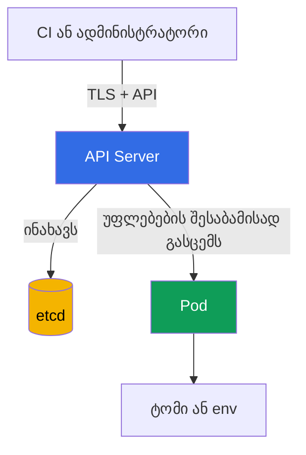

[Русская версия](ru.md) · [Eng version](README.md) · [Versión en español](es.md) · [Version française](fr.md) · [Deutsche Version](de.md) · [繁體中文版](tw.md) · [日本語版](jp.md)

# თავი 12. Secrets

> **რა არის შემდეგ.** 10-11 თავებში შეიზღუდა `Pod`-ების იდენტობები, უფლებამოსილებები და პრივილეგიები. ახლა მნიშვნელოვანია იმ მონაცემების დაცვა, რომლებსაც ეს იდენტობები იყენებენ: პაროლების, ტოკენების, გასაღებებისა და სერტიფიკატების. `Secret` მოსახერხებელია ასეთი მონაცემების სამუშაო დატვირთვისთვის გადასაცემად, მაგრამ თავისთავად მათ მიუწვდომელს არ ხდის. ეს KCSA-ს **Kubernetes Security Fundamentals** დომენის თემაა, რომლის წონაა 22%. კურსის მაგალითები ორიენტირებულია Kubernetes `v1.36`-ზე.

## 12.1 რა არის `Secret` და რატომ არ არის base64 დაშიფვრა

`Secret` არის Kubernetes API ობიექტი მცირე ზომის მგრძნობიარე მონაცემებისთვის: პაროლებისთვის, API ტოკენებისთვის, TLS გასაღებებისთვის და registry-ს წვდომის მონაცემებისთვის. `ConfigMap`-ისგან განსხვავებით, მისი დანიშნულება პირდაპირ მიუთითებს, რომ შიგთავსი დაცვას საჭიროებს. თუმცა ობიექტის დანიშნულება წვდომის კონტროლსა და დაშიფვრას ვერ ჩაანაცვლებს.

`data` ველი მნიშვნელობებს base64 ფორმატში ინახავს. ეს არის **კოდირება** და არა დაშიფვრა: ყველას, ვინც სტრიქონს წაიკითხავს, შეუძლია მისი გასაღების გარეშე დეკოდირება. Base64 საჭიროა YAML-ში ან JSON-ში ნებისმიერი ბაიტის უსაფრთხოდ წარმოსადგენად და არა საიდუმლოს დასამალად.

```yaml
apiVersion: v1
kind: Secret
metadata:
  name: app-credentials
  namespace: shop
type: Opaque
stringData:
  username: app
  password: replace-me
```

`stringData` საშუალებას გაძლევთ მანიფესტში გასაგები ტექსტი ჩაწეროთ, ხოლო API Server მას `data`-დ გარდაქმნის. ეს მანიფესტს უსაფრთხოს არ ხდის: ნამდვილი პაროლი არ უნდა გაიგზავნოს Git-ში, დაერთოს ტიკეტს ან დარჩეს shell history-ში. მაგალითი აჩვენებს ობიექტის ფორმას და არა რეალური სააღრიცხვო მონაცემების შენახვის მეთოდს.

| ცნება | რას ნიშნავს | რის გარანტიას არ იძლევა |
|---|---|---|
| `Secret` | API ობიექტი მგრძნობიარე მონაცემებისთვის | რომ მათ მხოლოდ საჭირო აპლიკაცია ნახავს |
| base64 | ბაიტების შექცევადი კოდირება | მონაცემთა კონფიდენციალურობას |
| `stringData` | `Secret`-ის შექმნისას სტრიქონების მოსახერხებელი შეყვანა | YAML ფაილის უსაფრთხო შენახვას |
| encryption at rest | საცავში შენახული მონაცემების დაშიფვრა | დაცვას სუბიექტისგან, რომელსაც `Secret`-ზე `get` უფლება აქვს |

გამოცდის ტიპური ხაფანგი: პაროლისთვის `Secret` უფრო გამოსადეგია, ვიდრე `ConfigMap`, მაგრამ base64 მისი უსაფრთხოების მიზეზი არ არის. მინიმუმ საჭიროა წვდომის შეზღუდვა, უსაფრთხო მიწოდება და საცავში მონაცემების დაცვა.

## 12.2 სად შეიძლება გამჟღავნდეს `Secret`

მონაცემების ჩვეულებრივი გზა ასე გამოიყურება: კლიენტი `Secret`-ს API Server-ის მეშვეობით წერს, API Server მას etcd-ში ინახავს, ხოლო `Pod` მნიშვნელობას დამონტაჟებული ფაილის ან გარემოს ცვლადის სახით იღებს. თითოეულ მონაკვეთს ნდობის საკუთარი საზღვარი აქვს.



ამ გზის თითოეულ მონაკვეთს გამჟღავნების საკუთარი მეთოდი აქვს, თუ ნდობის საზღვარი დაირღვა. განვიხილოთ ისინი თანმიმდევრობით: ჯერ API/etcd, შემდეგ თავად `Pod`.

მნიშვნელოვანია: ეს რისკები ალტერნატიული კი არა, ერთმანეთის შემავსებელია - ერთი მონაკვეთის დაცვა, მაგალითად TLS კლიენტსა და API Server-ს შორის, დანარჩენებს არ ფარავს.

**წვდომა API-ის მეშვეობით.** სუბიექტს, რომელსაც `secrets`-ზე `get`, `list` ან `watch` ნებართვა აქვს, შეუძლია მონაცემები უშუალოდ API Server-ის მეშვეობით წაიკითხოს იმის მიუხედავად, სად და როგორ ინახება საიდუმლო ფიზიკურად. ეს RBAC-ის საკითხია: TLS იცავს თავად API Server-თან კავშირის არხს, მაგრამ არ ზღუდავს, რისი წაკითხვის უფლება აქვს ვალიდური credentials-ის მქონე სუბიექტს.

**წვდომა etcd-ზე.** ეს ცალკე ვექტორია, რომელიც API-ს გვერდს უვლის: თუ encryption at rest არ არის, ყველას, ვისაც etcd-ის მონაცემებზე, მის დისკზე, snapshot-ზე ან სარეზერვო ასლზე აქვს წვდომა, შეუძლია შენახული საიდუმლოები პირდაპირ წაიკითხოს, RBAC-ისა და მთლიანად API Server-ის გვერდის ავლით. ამ ვექტორისგან დაცვა ხორციელდება არა `secrets`-ზე წვდომის უფლებებით, არამედ encryption at rest-ითა და თავად etcd-ზე წვდომის შეზღუდვით (იხ. §12.3).

**`Pod`-ში დამონტაჟება.** საიდუმლო volume ფაილის სახით, როგორც წესი, გარემოს ცვლადზე სასურველია, როდესაც აპლიკაციას ფაილის წაკითხვა შეუძლია და დამონტაჟებული შიგთავსის განახლებებია საჭირო. თუმცა ორივე მეთოდი მნიშვნელობას პროცესს გადასცემს. იმავე კონტეინერში საკმარისი უფლებების მქონე ნებისმიერ პროცესს მისი წაკითხვა შეუძლია; სამუშაო კვანძის ხელში ჩაგდება საფრთხეს უქმნის მასზე განთავსებულ `Pod`-ებში დამონტაჟებულ საიდუმლოებს.

**გვერდის ავლა `create pods`-ის მეშვეობით `Secret`-ის წაკითხვის უფლების გარეშე.** ეს ცალკე და გამოცდისთვის მნიშვნელოვანი შემთხვევაა: სუბიექტს არ სჭირდება `secrets`-ზე `get`/`list`/`watch` უფლება, რათა კონკრეტული `Secret` სახელის მიხედვით წაიკითხოს. თუ სუბიექტს `pods`-ზე `create` უფლება აქვს, ჩვეულებრივ `pods/exec`-ზე `create` უფლებასთან ერთად, ის იმავე namespace-ში ახალ `Pod`-ს ქმნის და მასში უკვე არსებულ `Secret`-ს volume-ის ან env-ის სახით ამონტაჟებს. ამისთვის RBAC თავად `Secret` ობიექტზე უფლებებს არ ამოწმებს და მხოლოდ `Pod`-ის შექმნის უფლებას ამოწმებს. შემდეგ სუბიექტი თავის ახალ `Pod`-ში `exec`-ს ასრულებს და დამონტაჟებულ მნიშვნელობას კითხულობს. ამიტომ კონფიდენციალური `Secret`-ების მქონე namespace-ში `pods`-ზე `create` ნებისმიერი მათგანის წაკითხვის შესაძლებლობის ტოლფასია, მაშინაც კი, თუ `secrets`-ზე უფლებები საერთოდ არ არსებობს.

**გარემოს ცვლადები.** ისინი მოსახერხებელია, მაგრამ შეიძლება შემთხვევით აღმოჩნდეს დიაგნოსტიკურ გამოტანაში, პროცესის dump-ში, აპლიკაციის ლოგებში ან გამართვის ინტერფეისში. ნუ დაბეჭდავთ მთლიან გარემოს და ნუ გადასცემთ საიდუმლოებს ბრძანების სტრიქონის არგუმენტებად. ეს გაჟონვის ალბათობას ამცირებს, მაგრამ RBAC-სა და კვანძის დაცვას არ აუქმებს.

ნუ დაამონტაჟებთ ერთ „საერთო“ `Secret`-ს namespace-ის ყველა აპლიკაციაში. თითოეული სამუშაო დატვირთვისთვის ცალკე `Secret` და ცალკე `ServiceAccount` მისი კომპრომეტაციის შედეგებს ავიწროებს.

## 12.3 Encryption at rest: `EncryptionConfiguration`, პროვაიდერები და KMS

Encryption at rest იცავს რესურსებს, რომლებსაც API Server etcd-ში წერს. API Server ჩაწერისას `EncryptionConfiguration`-ის პარამეტრებს იყენებს, ხოლო წაკითხვისას ადრე შენახულ მნიშვნელობებს შიფრს ხსნის. `Secret`-ისთვის ეს მონაცემებს იცავს, თუ თავდამსხმელმა etcd-ის მონაცემთა ფაილი, snapshot ან სარეზერვო ასლი მოიპოვა, მაგრამ API-ის მეშვეობით ობიექტის წაკითხვის ნებართვა არ მიუღია.

კონფიგურაცია რესურსებსა და პროვაიდერების მოწესრიგებულ სიას განსაზღვრავს. პირველი შესაფერისი პროვაიდერი ახალი ჩანაწერებისთვის გამოიყენება; დანარჩენები საჭიროა, მათ შორის, წინა გასაღებით ან წინა პროვაიდერით დაშიფრული მონაცემების წასაკითხად. `identity` დაშიფვრის გარეშე შენახვას ნიშნავს და `secrets`-ისთვის პირველი არჩევანი არ უნდა იყოს.

```yaml
apiVersion: apiserver.config.k8s.io/v1
kind: EncryptionConfiguration
resources:
  - resources:
      - secrets
    providers:
      - kms:
          apiVersion: v2
          name: key-service
          endpoint: unix:///var/run/kmsplugin/socket.sock
          timeout: 3s
      - identity: {}
```

ეს სტრუქტურულად გამართული KMS v2-ის მინიმალური მაგალითია: `name` პროვაიდერს განსაზღვრავს, `endpoint` პლაგინის Unix socket-ს უთითებს, ხოლო `timeout` არასავალდებულოა. KMS v2-ისთვის `cachesize` არ გამოიყენება. KMS v1 deprecated არის Kubernetes v1.28-დან და ნაგულისხმევად გამორთულია v1.29-დან; KMS v2 ამჟამად რეკომენდებული API-ია.

ამ თანმიმდევრობაში `identity` დასაშვებია მხოლოდ გარდამავალი reader-ის სახით იმ ობიექტებისთვის, რომლებიც KMS-ის ჩართვამდე დაიშიფრა. ყველა მონაცემის ხელახლა დაშიფვრის შემდეგ მას შლიან, წინააღმდეგ შემთხვევაში პროვაიდერების არასწორი თანმიმდევრობისას ახალი ჩანაწერები შეიძლება დაშიფვრის გარეშე შეინახოს. API Server-თან ფაილის მიერთება, KMS-ის ხელმისაწვდომობა, მისი გასაღებების შენახვა, როტაცია და არსებული ობიექტების ხელახლა დაშიფვრა ცალკე საოპერაციო გეგმას მოითხოვს. მათი უსაფრთხოდ ჩანაცვლება მოკლე YAML-ის კოპირებით შეუძლებელია.

| პროვაიდერი | იდეა | მნიშვნელოვანი საზღვარი |
|---|---|---|
| `identity` | მნიშვნელობას უცვლელად ინახავს | encryption at rest-ს არ უზრუნველყოფს |
| ლოკალური კრიპტოგრაფიული პროვაიდერი | მონაცემებს API Server-ის კონფიგურაციაში არსებული გასაღებით შიფრავს | გასაღებიც საიმედოდ უნდა შეინახოს და როტირდეს |
| `kms` | კრიპტოგრაფიულ ოპერაციებს გარე KMS პროვაიდერს გადასცემს; KMS v2 ამჟამად რეკომენდებული API-ია | მოითხოვს KMS-ის დაცვას, ხელმისაწვდომობასა და აუდიტს |

KMS ჩვეულებრივ მოვალეობების გასამიჯნად გამოიყენება: Kubernetes დაშიფრულ მონაცემებს ინახავს, ხოლო გასაღებებს გამოყოფილი სისტემა ან cloud KMS მართავს. ეს დაცვასა და აუდიტს აძლიერებს, მაგრამ დამოკიდებულებას ქმნის: მიუწვდომელმა ან არასწორად კონფიგურირებულმა KMS-მა შეიძლება საიდუმლოებთან დაკავშირებული ოპერაციების ხელმისაწვდომობაზე იმოქმედოს. ამიტომ KMS „ჯადოსნური მოსანიშნი უჯრა“ კი არა, საფრთხეების მოდელისა და აღდგენის გეგმის ნაწილია.

**Managed control plane: `EncryptionConfiguration` პირდაპირ მიუწვდომელია.** ზემოთ აღწერილ ყველაფერს, მათ შორის `EncryptionConfiguration`-ს, `--encryption-provider-config` ალამსა და თავად `kube-apiserver` პროცესს, managed კლასტერებში (Amazon EKS, GKE, AKS) cloud პროვაიდერი მართავს: კლასტერის ადმინისტრატორს ამ ფაილის რედაქტირება ან საკუთარი KMS პლაგინის პირდაპირ მიერთება არ შეუძლია ისე, როგორც თვითადმინისტრირებად კლასტერში აკეთებენ, მაგალითად `kubeadm`-ის მეშვეობით. Managed პროვაიდერები ამ ამოცანას საკუთარი მექანიზმით წყვეტენ და არა `EncryptionConfiguration`-ზე პირდაპირი წვდომით. მაგალითად, Amazon EKS-ში Kubernetes v1.28-დან Kubernetes API-ის ყველა მონაცემისთვის (`Secret`, `ConfigMap` და სხვა რესურსები) envelope encryption **ნაგულისხმევად** ჩართულია მომხმარებლის ყოველგვარი მოქმედების გარეშე და KMS v2-ის მეშვეობით AWS-owned KMS გასაღებს იყენებს. დამატებით, EKS-ის ადმინისტრატორს შეუძლია **საკუთარი, customer-managed** KMS გასაღების მიერთება. ეს ცალკე EKS API-ის მეშვეობით კეთდება (`aws eks` CLI, `eksctl` ან Terraform) და არა კლასტერის `EncryptionConfiguration`-ის რედაქტირებით. დასკვნა managed კლასტერებისთვის: `secrets`-ის encryption at rest, დიდი ალბათობით, უკვე ჩართულია პროვაიდერის მიერ, მაგრამ მის პროვაიდერსა და გასაღებს პლატფორმა განსაზღვრავს და არა ამ თავში ნაჩვენები ფაილი.

## 12.4 RBAC, ჰიგიენა და საიდუმლოების გარე მენეჯერები

პირველი პრაქტიკული კონტროლი RBAC-ში least privilege-ია. `secrets`-ზე ნებართვას კონკრეტულ `ServiceAccount`-ს ან მომხმარებელს აძლევენ, მხოლოდ საჭირო namespace-ში და მხოლოდ აუცილებელი ზმნებით. `list` და `watch` წერტილოვან `get`-ზე უფრო სახიფათოა: მათ ერთდროულად ბევრი ობიექტის გახსნა შეუძლიათ. `Role`-ისა და `RoleBinding`-ის შექმნის ან შეცვლის უფლებებიც მგრძნობიარეა, რადგან წვდომის ირიბად გაფართოების საშუალებას იძლევა.

```bash
kubectl auth can-i get secrets \
  --as=system:serviceaccount:shop:orders-api -n shop
```

განვიხილოთ ამ ბრძანების თითოეული პარამეტრი:

- `get secrets` - შესამოწმებელი მოქმედება: RBAC ზმნა (`get`) და რესურსის ტიპი (`secrets`). სწორედ ეს წყვილი მოწმდება `Role`/`ClusterRole` წესებთან.
- `--as=system:serviceaccount:shop:orders-api` - ვისი სახელით სრულდება შემოწმება (impersonation). სტრიქონი `system:serviceaccount:<namespace>:<სახელი>` არის Kubernetes-ში კონკრეტული `ServiceAccount`-ის იდენტობის სრული სახელი: ფიქსირებული პრეფიქსი `system:serviceaccount:`, შემდეგ namespace, რომელშიც `ServiceAccount` შეიქმნა (აქ `shop`), შემდეგ კი თავად `ServiceAccount` ობიექტის `metadata.name` (აქ `orders-api`). ეს თვითნებური ფორმატის სტრიქონი არ არის. Kubernetes-ის authentication ფენა API მოთხოვნისას ნებისმიერ `ServiceAccount`-ს სწორედ ასე ხედავს და `RoleBinding`/`ClusterRoleBinding`-ის `subjects` სწორედ ამ სახელს მიმართავს.
- `-n shop` - namespace, **რომელშიც მოწმდება მოქმედება** `get secrets`, ანუ საუბარია namespace `shop`-ის `secrets`-ზე. ის შეიძლება ემთხვეოდეს ან არ ემთხვეოდეს `--as`-ში მითითებულ `ServiceAccount`-ის namespace-ს: ერთი namespace-ის `ServiceAccount`-ს `RoleBinding`-ის მეშვეობით თავისუფლად შეიძლება ჰქონდეს უფლებები სხვა namespace-ის რესურსებზე, თუ RBAC ასეა კონფიგურირებული.

ბრძანება პასუხობს კითხვას, ნებადართულია თუ არა მითითებული იდენტობისთვის მოქმედება. ის შემოწმებისას სასარგებლოა, მაგრამ წესების მიმოხილვასა და ფაქტობრივი მიმართვების აუდიტს არ ცვლის.

საიდუმლოების ჰიგიენა რამდენიმე მუდმივ წესს მოიცავს:

- მნიშვნელობები არ ჩაწეროთ Git-ში, image-ებში, Helm values-ში, ლოგებსა და issue tracker-ებში;
- ტოკენი ან პაროლი საჭიროზე დიდხანს არ გამოიყენოთ და კომპრომეტირებული მნიშვნელობები როტირდეს;
- შეზღუდეთ, რომელი `Pod`-ები მიიღებენ კონკრეტულ `Secret`-ს და აპლიკაციას ზედმეტი API წვდომა არ მისცეთ;
- backup, snapshot და CI არტეფაქტები production მონაცემების მსგავსად დაიცავით;
- საერთო ტერმინალსა და CI ჟურნალში ბრძანებებით ან სკრიპტებით `Secret`-ის შიგთავსი არ გამოიტანოთ.

გარე მენეჯერი, მაგალითად HashiCorp Vault ან cloud secrets manager, საიდუმლოებს Kubernetes-ის ჩვეულებრივი ობიექტების გარეთ ინახავს და ხშირად როტაციას, აუდიტსა და ცენტრალიზებულ პოლიტიკებს გვთავაზობს. მისი მნიშვნელობების `Pod`-ში მიწოდების ორი პრინციპულად განსხვავებული გზა არსებობს და ისინი საფრთხეების მოდელზე განსხვავებულად მოქმედებს:

- **სინქრონიზაცია Kubernetes `Secret`-ში.** `External Secrets Operator` (ESO) გარე საცავიდან მნიშვნელობას კითხულობს და მისგან ჩვეულებრივ Kubernetes `Secret`-ს ქმნის, რათა აპლიკაციამ ნაცნობი ინტერფეისი გამოიყენოს (volume ან env). ეს მოსახერხებელია, მაგრამ რისკს სრულად არ აუქმებს: სინქრონიზაციის შემდეგ მნიშვნელობა Kubernetes API-ში კვლავ ჩვეულებრივი `Secret` ობიექტის სახით არსებობს. მასზე ვრცელდება §12.2-ში აღწერილი გამჟღავნების ყველა იგივე რისკი (`secrets`-ზე RBAC, etcd, დამონტაჟება) და არა მხოლოდ თავად Vault-ის ან cloud secrets manager-ის პოლიტიკები.
- **Init-container ან sidecar Kubernetes-ში `Secret` ობიექტის გარეშე.** კიდევ ერთი გავრცელებული პატერნია აგენტი, მაგალითად Vault Agent ან cloud პროვაიდერის ანალოგი, რომელიც თავად `Pod`-ში init-container-ის ან sidecar-ის სახით მუშაობს. `Pod`-ის გაშვებისას ის თავად უკავშირდება გარე საცავს, ხოლო sidecar ასევე შემდგომი ცვლილებებისას, იღებს მნიშვნელობას და Kubernetes API-ის სრულად გვერდის ავლით იმავე `Pod`-ში აპლიკაციის ფაილში ან გარემოს ცვლადში ათავსებს. აქ Kubernetes-ში `Secret` ობიექტი საერთოდ არ არსებობს: `secrets`-ზე RBAC წესები, etcd-ში encryption at rest და `kubectl get secrets` ამ მონაცემებს არ ეხება. წვდომის მთელი კონტროლი გადადის თავად აგენტის გარე საცავში ავთენტიკაციასა და `Pod`-ის შიგნით ფაილური სისტემის ან გარემოს დაცვაზე.

არჩევანი დამოკიდებულია როტაციის, აუდიტის, ხელმისაწვდომობის მოთხოვნებსა და უკვე გამოყენებულ პლატფორმაზე.

## 12.5 როგორ გამოიყენება ეს პრაქტიკაში

პლატფორმის გუნდი, როგორც წესი, ჯერ განსაზღვრავს, რომელ აპლიკაციებს სჭირდება სინამდვილეში თითოეული საიდუმლო და როგორ იღებენ ისინი მას. შემდეგ RBAC-ის მეშვეობით წაკითხვას ზღუდავს, მგრძნობიარე რესურსებისთვის encryption at rest-ს რთავს და ამოწმებს, რომ backups etcd-ზე არანაკლებ დაცულია.

აპლიკაციებისთვის მიწოდების ყველაზე ნაკლებად სარისკო მეთოდს ირჩევენ: გარემოს ცვლადის ნაცვლად volume-ში ფაილს, თუ აპლიკაცია ამას მხარს უჭერს; ერთი საერთო საიდუმლოს ნაცვლად ცალკეულ საიდუმლოებს; მუდმივის ნაცვლად მოკლევადიან credentials-ს, თუ მათ გარე პროვაიდერი გასცემს. CI-ში ცვლადების დაცულ საცავსა და გამოტანის შენიღბვას იყენებენ, მაგრამ შენიღბვას წვდომის კონტროლის შემცვლელად არ მიიჩნევენ.

პროცესის დონეზე მნიშვნელოვანია ინვენტარიზაცია და როტაცია: ვინ ფლობს საიდუმლოს, სად გამოიყენება ის, როგორ უნდა შეიცვალოს ინციდენტისას და რა ძველი ასლები არსებობს backup-ში. ეს რეაგირების დროს ამცირებს, როდესაც ტოკენი შემთხვევით ლოგში ან რეპოზიტორიაში მოხვდება.

## 12.6 Exam vocabulary / მინი-ლექსიკონი

| ტერმინი | მნიშვნელობა |
|---|---|
| `Secret` | Kubernetes API ობიექტი მცირე ზომის მგრძნობიარე მონაცემებისთვის. |
| base64 | ბაიტების შექცევადი კოდირება და არა კრიპტოგრაფიული დაცვა. |
| encryption at rest | შენახული მონაცემების დაშიფვრა, მაგალითად etcd-ის ჩანაწერების. |
| `EncryptionConfiguration` | API Server-ის კონფიგურაცია, რომელიც etcd-ში API რესურსების დაშიფვრას განსაზღვრავს. |
| KMS v2 | ამჟამად რეკომენდებული API, რომელიც API Server-ს KMS-თან აერთიანებს; KMS v1 deprecated არის v1.28-დან და ნაგულისხმევად გამორთულია v1.29-დან. |
| `identity` | პროვაიდერი დაშიფვრის გარეშე; მიგრაციისას დროებითი reader, რომელიც მონაცემების ხელახლა დაშიფვრის შემდეგ იშლება. |
| envelope encryption | მიდგომა, რომლის დროსაც მონაცემები მონაცემთა გასაღებით იშიფრება, ხოლო მას KMS გასაღები იცავს. |
| `External Secrets Operator` | კონტროლერი, რომელიც გარე secrets manager-ის მნიშვნელობებს Kubernetes `Secret`-ში ასინქრონებს. |

## 12.7 Exam Essentials / თავის შეჯამება

- `Secret` მგრძნობიარე მონაცემებისთვისაა განკუთვნილი, მაგრამ `data` ველში base64 მხოლოდ კოდირებაა.
- საიდუმლო შეიძლება გამჟღავნდეს API-ის ზედმეტად ფართო უფლებებით, etcd-ითა და მისი ასლებით, `Pod`-ში mount-ით, გარემოს ცვლადებით, ლოგებით ან CI-ით.
- `EncryptionConfiguration`-ის მეშვეობით encryption at rest etcd-ში ჩანაწერს იცავს, მაგრამ TLS-ს, RBAC-სა და კვანძის უსაფრთხოებას არ ცვლის.
- KMS v2 ამჟამად რეკომენდებული API-ია: KMS v1 deprecated არის v1.28-დან და ნაგულისხმევად გამორთულია v1.29-დან; ინტეგრაცია წვდომის კონტროლს, მონიტორინგსა და ხელმისაწვდომობის გეგმას მოითხოვს.
- Least-privilege RBAC, როტაცია, Git-ში საიდუმლოების არქონა და სამუშაო დატვირთვებისთვის შეზღუდული მიწოდება გაჟონვის არეალს ამცირებს.
- Vault და `External Secrets Operator` შენახვისა და როტაციის შესაძლებლობებს აფართოებს, მაგრამ მნიშვნელობის `Pod`-ში ან Kubernetes API-ში გამოჩენის შემდეგ მის დაცვას არ აუქმებს.

## 12.8 რა არ უნდა აგერიოთ და როგორ გვხვდება ეს გამოცდაზე

MCQ-ში (multiple choice question, კითხვა პასუხის არჩევით) ჩვეულებრივ კონკრეტული მექანიზმის საზღვრის დასახელებაა საჭირო. თუ კითხვაში base64 არის, სწორი პასუხი თითქმის არასდროს საუბრობს დაშიფვრაზე. თუ საუბარია etcd-ის snapshot-ზე, ირჩევენ encryption at rest-სა და backup-ის დაცვას. თუ სუბიექტს უკვე აქვს `get secrets`, etcd-ში დაშიფვრა ხელს ვერ შეუშლის API Server-ს ობიექტის გაცემაში: საჭიროა RBAC.

გავრცელებული ხაფანგები:

- გადაცემისას TLS დაშიფვრისა და შენახული მონაცემების დაშიფვრის ერთმანეთში არევა;
- ვარაუდი, რომ `Secret` ტიპი წაკითხვას ავტომატურად ზღუდავს;
- KMS-ის RBAC-ის ან უსაფრთხო დამონტაჟების შემცვლელად მიჩნევა;
- `identity`-ის მუდმივ fallback პროვაიდერად დატოვება მას შემდეგ, რაც ყველა არსებული ობიექტი უკვე ხელახლა დაიშიფრა: სწორი პრაქტიკაა პროვაიდერების სიიდან `identity`-ის ამოღება, წინააღმდეგ შემთხვევაში პროვაიდერების არასწორი თანმიმდევრობისას ახალი ჩანაწერების დაშიფვრის გარეშე შენახვის რისკი არსებობს (იხ. §12.3);
- KMS cache-ის `cachesize` ველით კონფიგურაციის მცდელობა: ეს KMS v1-ის პარამეტრია, KMS v2-ში ასეთი ველი არ არსებობს. KMS v2 კონფიგურაციაში `cachesize`-ის გამოყენება API ვერსიის შეუსაბამობის აშკარა ნიშანია, რის შესახებაც გამოცდაზე შეიძლება გკითხონ;
- ერთი საიდუმლოსთვის `list` ან `watch`-ის „მინიმალურ“ უფლებებად არჩევა: ორივე ბრძანება namespace-ში თითოეული `Secret`-ის სრულ ობიექტს, მათ შორის `data` ველს აბრუნებს და არა მხოლოდ სახელებს. ეს ნიშნავს, რომ `list`/`watch` სინამდვილეში namespace-ის ყველა საიდუმლოს მნიშვნელობას ამჟღავნებს, მაშინ როცა ერთ კონკრეტულ `Secret`-ზე წვდომისთვის საკმარისია `get` წესში რესურსის აშკარად მითითებული სახელით (`resourceNames`);
- ვარაუდი, რომ გარე secrets manager ყოველთვის ერთნაირად მუშაობს: მნიშვნელობის მიწოდების მეთოდი საფრთხეების მოდელს ცვლის (იხ. §12.4). Kubernetes `Secret`-ში სინქრონიზაციისას, მაგალითად `External Secrets Operator`-ის მეშვეობით, მნიშვნელობა კვლავ ჩვეულებრივ `Secret` ობიექტში არსებობს და მასზე §12.2-ში აღწერილი გამჟღავნების ყველა რისკი ვრცელდება: RBAC, etcd, დამონტაჟება. init-container-ის ან sidecar აგენტის მეშვეობით მიწოდებისას, როდესაც ის თავად უკავშირდება გარე საცავს და მნიშვნელობას `Pod`-ის შიგნით ფაილში ან env-ში ათავსებს, Kubernetes-ში `Secret` ობიექტი საერთოდ არ იქმნება. `secrets`-ზე RBAC და etcd-ში encryption at rest აქ არ გამოიყენება, რადგან მონაცემები იქ უბრალოდ არ არის; კონტროლი სრულად გადადის გარე საცავში აგენტის ავთენტიკაციაზე.

მსჯელობის სასარგებლო თანმიმდევრობაა: ჯერ რისკის ადგილის განსაზღვრა, შემდეგ ამ საზღვრისთვის მექანიზმის არჩევა - RBAC API-ისთვის, encryption at rest etcd-ისთვის, უსაფრთხო მიწოდება `Pod`-ისთვის და როტაციის პროცესი გაჟონვის შედეგებისთვის.

## 12.9 კითხვები თვითშემოწმებისთვის

### 1. რას ნიშნავს base64 `Secret` ობიექტის `data` ველში?

   - a. მონაცემები წარმოდგენილია შექცევადი კოდირებით.

   - b. მონაცემები ავტომატურად იშიფრება KMS-ით.

   - c. მონაცემები დაშიფრულია API Server-ის გასაღებით.

   - d. მონაცემები ხელმისაწვდომია მხოლოდ იმავე namespace-ის `ServiceAccount`-ისთვის.

<details>
<summary>პასუხი და განმარტება</summary>

**სწორი პასუხია: a.** Base64 API-ში წარმოსადგენად ბაიტებს აკოდირებს. მისი დეკოდირება კრიპტოგრაფიული გასაღების გარეშე შეიძლება, ამიტომ საჭიროა RBAC და encryption at rest.

</details>

### 2. რომელი კონტროლი იცავს უპირველესად `Secret`-ს etcd-ის snapshot-ში backup ფაილის მოპარვისას?

   - a. `NetworkPolicy`.

   - b. `automountServiceAccountToken: false`.

   - c. გარემოს ცვლადი volume-ის ნაცვლად.

   - d. Encryption at rest `EncryptionConfiguration`-ის მეშვეობით.

<details>
<summary>პასუხი და განმარტება</summary>

**სწორი პასუხია: d.** Encryption at rest etcd-ის შენახულ ჩანაწერებსა და მათ ასლებს იცავს. დანარჩენი ვარიანტები ქსელს, `ServiceAccount` ტოკენებს ან `Pod`-ში მიწოდების მეთოდს ეხება.

</details>

### 3. მომხმარებელს namespace-ში `secrets`-ზე `get` ნებართვა აქვს. რას შეცვლის ამ API Server მოთხოვნისთვის KMS-ის ჩართვა?

   - a. KMS ცალკე authorization check-ს დაამატებს და `get`-ს უარყოფს, თუ მომხმარებელს encryption key-ზე პირდაპირი წვდომა არ აქვს.
   - b. API Server უფლებამოსილ მომხმარებელს საწყისი მნიშვნელობის ნაცვლად ciphertext-ს დაუბრუნებს, რადგან KMS server-side decryption-ს კრძალავს.
   - c. KMS `Secret`-ს გარდაქმნის ობიექტად, რომლის წაკითხვა ჩვეულებრივი Kubernetes API-ის მეშვეობით ნებადართული RBAC-ის შემთხვევაშიც აღარ შეიძლება.
   - d. authorization გადაწყვეტილება არ შეიცვლება: API Server შენახულ მონაცემებს შიფრს მოხსნის და ობიექტს იმ სუბიექტს დაუბრუნებს, რომელსაც RBAC წაკითხვის უფლებას აძლევს.

<details>
<summary>პასუხი და განმარტება</summary>

**სწორი პასუხია: d.** Encryption at rest და KMS შენახულ მონაცემებს იცავს და Kubernetes authorization-ს არ ცვლის. თუ API მოთხოვნა ნებადართულია, API Server საჭირო გაშიფვრას ასრულებს და ობიექტს აბრუნებს. ამიტომ least-privilege RBAC კვლავ სავალდებულოა.

</details>

### 4. რატომ არის `secrets` რესურსისთვის `list`, როგორც წესი, წერტილოვან `get`-ზე უფრო სახიფათო?

   - a. `list`-ის გამოყენება `ServiceAccount`-თან შეუძლებელია.

   - b. `list` API Server-ისთვის TLS-ს თიშავს.

   - c. `list` მხოლოდ etcd-ის დაშიფვრისთვისაა საჭირო.

   - d. `list`-მა შეიძლება ერთდროულად ბევრი საიდუმლოს მნიშვნელობა გაამჟღავნოს.

<details>
<summary>პასუხი და განმარტება</summary>

**სწორი პასუხია: d.** მასობრივი წაკითხვა გამჟღავნებული მონაცემების მოცულობას ზრდის. Least privilege მხოლოდ საჭირო რესურსისა და ზმნის მინიჭებას ესწრაფვის.

</details>

### 5. რომელი დებულებაა სწორი `External Secrets Operator`-ის შესახებ?

   - a. მას შეუძლია გარე საცავიდან მნიშვნელობა Kubernetes `Secret`-ში ასინქრონოს.

   - b. ის base64-ს კრიპტოგრაფიულ დაშიფვრად გარდაქმნის.

   - c. ის `Secret`-ისთვის RBAC-ს ცვლის.

   - d. ის გარანტიას იძლევა, რომ მნიშვნელობა Kubernetes-ში არასოდეს მოხვდება.

<details>
<summary>პასუხი და განმარტება</summary>

**სწორი პასუხია: a.** ოპერატორი გარე secrets manager-ს Kubernetes რესურსებთან აკავშირებს. სინქრონიზაციის შემდეგ API-ის, etcd-ისა და დამონტაჟების ჩვეულებრივი რისკების გათვალისწინება კვლავ აუცილებელია.

</details>

> **სად წავიდეთ შემდეგ.** Encryption at rest-ის, KMS-ის, გასაღებების როტაციისა და შენახული ჩანაწერების შემოწმების პრაქტიკული კონფიგურაციისთვის შეისწავლეთ CKS-ის 21-ე თავი etcd-ის დაშიფვრისა და `Secret`-ის უსაფრთხო შენახვის შესახებ. `Secret`-ის ადმინისტრაციული საფუძვლებისა და `Pod`-ში მნიშვნელობების გადაცემის მეთოდებისთვის სასარგებლოა CKA-ს მე-19 თავი.

[სარჩევი](../README_GE.md) · [თავი 11](../11/ge.md) · [თავი 13](../13/ge.md)
