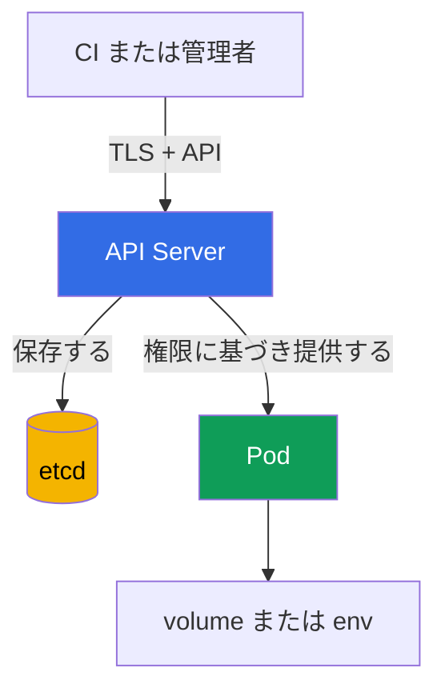

[Русская версия](ru.md) · [Eng version](README.md) · [Versión en español](es.md) · [Version française](fr.md) · [Deutsche Version](de.md) · [ქართული ვერსია](ge.md) · [繁體中文版](tw.md)

# 第12章. Secrets

> **この先。** 第10-11章では、`Pod` のアイデンティティ、権限、特権を制限しました。次に、これらのアイデンティティが使用するデータ、すなわちパスワード、トークン、キー、証明書を保護することが重要です。`Secret` はこのようなデータをワークロードに渡すのに便利ですが、それ自体でデータをアクセス不能にするわけではありません。これは、比重 22% の KCSA ドメイン **Kubernetes Security Fundamentals** のテーマです。本コースの例は Kubernetes `v1.36` を対象としています。

## 12.1 `Secret` とは何か、そして base64 が暗号化ではない理由

`Secret` は、パスワード、API トークン、TLS キー、registry の認証情報などの機密性が高い小規模データのための Kubernetes API オブジェクトです。`ConfigMap` とは異なり、その用途は内容を保護する必要があることを明示します。しかし、オブジェクトの用途はアクセス制御や暗号化の代わりにはなりません。

フィールド `data` は値を base64 で保存します。これは**エンコード**であり、暗号化ではありません。文字列を読める人は誰でも、キーなしでデコードできます。Base64 は任意のバイト列を YAML や JSON で安全に表現するためのものであり、Secret を隠すためのものではありません。

```yaml
apiVersion: v1
kind: Secret
metadata:
  name: app-credentials
  namespace: shop
type: Opaque
stringData:
  username: app
  password: replace-me
```

`stringData` を使用すると、マニフェストにプレーンテキストを書け、API Server がそれを `data` に変換します。これはマニフェストを安全にするものではありません。実際のパスワードを Git に送信したり、チケットに添付したり、shell history に残したりしてはいけません。この例はオブジェクトの形式を示すものであり、実際の認証情報を保存する方法ではありません。

| 概念 | 意味 | 保証しないもの |
|---|---|---|
| `Secret` | 機密データ用の API オブジェクト | 必要なアプリケーションだけがデータを見ること |
| base64 | 可逆的なバイト列エンコード | データの機密性 |
| `stringData` | `Secret` 作成時に文字列を入力しやすくするもの | YAML ファイルの安全な保存 |
| encryption at rest | ストレージに保存されたデータの暗号化 | `Secret` に対する `get` 権限を持つ主体からの保護 |

典型的な試験の落とし穴として、`Secret` はパスワードには `ConfigMap` より適していますが、base64 が安全性の理由ではありません。少なくともアクセスの制限、安全な配布、保存データの保護が必要です。

## 12.2 `Secret` が公開されうる場所

一般的なデータ経路は次のとおりです。クライアントは API Server を通じて `Secret` を書き込み、API Server はそれを etcd に保存し、`Pod` はマウントされたファイルまたは環境変数として値を受け取ります。各段階には独自の信頼境界があります。



この経路の各部分には、信頼境界が侵害された場合の独自の公開経路があります。順に、API/etcd、次に `Pod` 自体を見ていきます。

重要: これらは代替ではなく相互補完的なリスクです。ある区間を保護しても、たとえばクライアントと API Server 間の TLS だけでは、残りの区間は保護されません。

**API 経由のアクセス。** `secrets` に対する `get`、`list`、または `watch` 権限を持つ主体は、Secret が物理的にどこにどのように保存されているかに関係なく、API Server 経由でデータを直接読めます。これは RBAC の問題です。TLS は API Server への接続チャネル自体を保護しますが、有効な credentials を持つ主体に何を読むことが許可されるかは制限しません。

**etcd へのアクセス。** これは API を迂回する別のベクトルです。encryption at rest がなければ、etcd データ、そのディスク、snapshot、または backup にアクセスできる人は誰でも、RBAC と API Server 全体を迂回して保存された Secret を直接読めます。このベクトルの保護は `secrets` へのアクセス権ではなく、encryption at rest と etcd 自体へのアクセス制限によって行います（§12.3 を参照）。

**`Pod` へのマウント。** アプリケーションがファイルを読め、マウントした内容の更新が必要な場合、Secret を volume ファイルとして使用するほうが通常は環境変数より望ましいです。しかし、どちらの方法も値をプロセスに渡します。同じコンテナ内で十分な権限を持つプロセスは誰でもそれを読めます。ワーカーノードが侵害されると、そこに配置された `Pod` にマウントされた Secret が危険にさらされます。

**`Secret` を読む権限なしでの `create pods` による迂回。** これは試験でも重要な別のケースです。特定の `Secret` を名前で読むために、主体が `secrets` に対する `get`/`list`/`watch` 権限を持つ必要はありません。主体に `pods` への `create` 権限がある場合（通常は `pods/exec` への `create` と組み合わされます）、同じ namespace に新しい `Pod` を作成し、既存の `Secret` を volume または env としてそこにマウントできます。この操作では、RBAC は `Secret` オブジェクトそのものの権限ではなく、`Pod` を作成する権限だけを確認します。その後、自分の新しい `Pod` に `exec` してマウントされた値を読めます。そのため、機密 `Secret` のある namespace での `pods` に対する `create` は、`secrets` の権限がまったくなくても、任意の Secret を読む能力と同等です。

**環境変数。** これは便利ですが、診断出力、プロセスダンプ、アプリケーションログ、またはデバッグインターフェイスに誤って現れることがあります。環境全体を出力せず、Secret をコマンドライン引数として渡さないでください。これにより漏洩の可能性は下がりますが、RBAC とノード保護の必要性はなくなりません。

namespace 内のすべてのアプリケーションに、単一の「共有」`Secret` をマウントしないでください。ワークロードごとに個別の `Secret` と個別の `ServiceAccount` を使用すると、侵害時の影響範囲を狭められます。

## 12.3 Encryption at rest: `EncryptionConfiguration`、プロバイダー、KMS

encryption at rest は、API Server が etcd に書き込むリソースを保護します。API Server は書き込み時に `EncryptionConfiguration` の設定を適用し、読み取り時に以前に保存された値を復号します。`Secret` では、攻撃者が etcd データファイル、snapshot、または backup を入手しても、API 経由でオブジェクトを読む権限を取得していない場合にデータを保護します。

設定ではリソースと、順序付けられたプロバイダーのリストを指定します。最初に一致するプロバイダーが新しい書き込みに使用され、残りは特に以前のキーまたは以前のプロバイダーで暗号化されたデータを読むために必要です。`identity` は暗号化なしで保存することを意味し、`secrets` の最初の選択肢にすべきではありません。

```yaml
apiVersion: apiserver.config.k8s.io/v1
kind: EncryptionConfiguration
resources:
  - resources:
      - secrets
    providers:
      - kms:
          apiVersion: v2
          name: key-service
          endpoint: unix:///var/run/kmsplugin/socket.sock
          timeout: 3s
      - identity: {}
```

これは構造的に正しい最小限の KMS v2 の例です。`name` はプロバイダーを識別し、`endpoint` はプラグインの Unix ソケットを指定し、`timeout` は任意です。KMS v2 では `cachesize` は使用しません。KMS v1 は Kubernetes v1.28 で deprecated となり、v1.29 からデフォルトで無効です。KMS v2 が現在推奨される API です。

この順序での `identity` は、KMS を有効化する前に暗号化されたオブジェクトの移行用 reader としてのみ許容されます。すべてのデータを再暗号化した後は削除します。そうしないと、プロバイダーの順序が誤っている場合に新しい書き込みが暗号化なしで保存される可能性があります。ファイルの API Server への接続、KMS の可用性、キーの保管、ローテーション、既存オブジェクトの再暗号化には、独立した運用計画が必要です。これらを短い YAML のコピーで安全に置き換えることはできません。

| プロバイダー | 考え方 | 重要な境界 |
|---|---|---|
| `identity` | 値をそのまま保存する | encryption at rest を提供しない |
| ローカル暗号プロバイダー | API Server 設定内のキーでデータを暗号化する | キー自体も安全に保存し、ローテーションする必要がある |
| `kms` | 暗号操作を外部 KMS プロバイダーに委譲する。KMS v2 が現在推奨される API | KMS の保護、可用性、監査が必要 |

KMS は通常、職務分離のために使用されます。Kubernetes は暗号化されたデータを保存し、専用システムまたはクラウド KMS がキー管理を実行します。これは保護と監査を追加しますが、依存関係も作ります。利用不能または誤設定の KMS は、Secret 操作の可用性に影響を及ぼす可能性があります。したがって KMS は「魔法のチェックボックス」ではなく、脅威モデルと復旧計画の一部です。

**Managed control plane: `EncryptionConfiguration` には直接アクセスできません。** 上で説明した `EncryptionConfiguration`、`--encryption-provider-config` フラグ、そして `kube-apiserver` プロセス自体は、managed クラスター（Amazon EKS、GKE、AKS）ではクラウドプロバイダー側で管理されます。クラスター管理者は、自己管理クラスター（たとえば `kubeadm` を使用するもの）のように、このファイルを編集したり独自の KMS プラグインを直接指定したりできません。managed プロバイダーは、`EncryptionConfiguration` への直接アクセスではなく、独自の仕組みでこの課題を処理します。たとえば Amazon EKS では Kubernetes v1.28 以降、すべての Kubernetes API データ（`Secret`、`ConfigMap`、その他のリソース）に対する envelope encryption が、KMS v2 を通じた AWS-owned KMS キーを使用して、ユーザーの操作なしに**デフォルトで**有効です。さらに EKS 管理者は、独自の customer-managed KMS キーを接続できます。これはクラスターの `EncryptionConfiguration` を編集するのではなく、個別の EKS API（`aws eks` CLI、`eksctl`、または Terraform）を通じて行います。managed クラスターにおける結論は、`secrets` の encryption at rest はおそらくプロバイダーによってすでに有効化されていますが、そのプロバイダーとキーを決定するのは、この章で示したファイルではなくプラットフォームです。

## 12.4 RBAC、衛生管理、外部 Secret マネージャー

最初の実践的な制御は、RBAC における least privilege です。`secrets` の権限は、必要な namespace 内で必要な動詞だけを、特定の `ServiceAccount` またはユーザーに与えます。`list` と `watch` は点指定の `get` より危険です。一度に多くのオブジェクトを公開しうるためです。`Role` または `RoleBinding` の作成・変更権限も、間接的にアクセスを拡張できるため機密性が高いものです。

```bash
kubectl auth can-i get secrets \
  --as=system:serviceaccount:shop:orders-api -n shop
```

このコマンドの各パラメーターを見ていきます。

- `get secrets` - 確認するアクションです。RBAC 動詞（`get`）とリソース種別（`secrets`）です。`Role`/`ClusterRole` のルールと照合されるのはこの組み合わせです。
- `--as=system:serviceaccount:shop:orders-api` - チェックを実行する主体（impersonation）です。文字列 `system:serviceaccount:<namespace>:<名前>` は、Kubernetes 内の特定 `ServiceAccount` の完全なアイデンティティ名です。固定プレフィックス `system:serviceaccount:`、次に `ServiceAccount` が作成された namespace（ここでは `shop`）、次に `ServiceAccount` オブジェクトの `metadata.name`（ここでは `orders-api`）が続きます。これは任意形式の文字列ではありません。Kubernetes の authentication 層が API リクエスト時にすべての `ServiceAccount` を認識する形式であり、`RoleBinding`/`ClusterRoleBinding` の `subjects` が参照する名前です。
- `-n shop` - `get secrets` アクションを**確認する namespace**です（つまり namespace `shop` の `secrets` が対象です）。`--as` の `ServiceAccount` の namespace と一致する場合も一致しない場合もあります。RBAC がそのように設定されていれば、一つの namespace の `ServiceAccount` が、`RoleBinding` を通じて別の namespace のリソースに対する権限を持つことができます。

このコマンドは、指定されたアイデンティティにアクションが許可されているかどうかに答えます。確認には有用ですが、ルールのレビューや実際のアクセスの監査の代わりにはなりません。

Secret の衛生管理には、いくつかの継続的なルールがあります。

- 値を Git、イメージ、Helm values、ログ、issue tracker に書き込まない。
- 必要以上にトークンやパスワードを使用せず、侵害された値はローテーションする。
- 特定の `Secret` を受け取れる `Pod` を制限し、アプリケーションに不要な API アクセスを与えない。
- backup、snapshot、CI artifact を production データと同じように保護する。
- `Secret` の内容を出力するコマンドやスクリプトを、共有 terminal や CI ログに出さない。

HashiCorp Vault やクラウド secrets manager などの外部マネージャーは、通常の Kubernetes オブジェクトの外部に Secret を保存し、多くの場合ローテーション、監査、一元的なポリシーを提供します。その値を `Pod` に配布する方法には、原理的に異なる二つの方法があり、脅威モデルへの影響も異なります。

- **Kubernetes `Secret` への同期。** `External Secrets Operator`（ESO）は外部ストアから値を読み、アプリケーションが既存のインターフェイス（volume または env）を使用できるよう、通常の Kubernetes `Secret` を作成します。これは便利ですが、リスクを完全に除去するものではありません。同期後、値は通常の `Secret` オブジェクトとして Kubernetes API に再び存在します。§12.2 のすべての公開リスク（`secrets` の RBAC、etcd、マウント）が、Vault や cloud secrets manager 自体のポリシーだけでなく適用されます。
- **Kubernetes の `Secret` オブジェクトを使用しない init-container または sidecar。** もう一つの一般的なパターンは、`Pod` 内で init-container または sidecar として実行されるエージェント（たとえば Vault Agent またはクラウドプロバイダーの同等品）です。これは `Pod` の開始時に外部ストアへ自らアクセスし（sidecar は後続の変更時にもアクセスします）、値を Kubernetes API 全体を迂回して、同じ `Pod` 内のアプリケーションのファイルまたは環境変数に配置します。この場合 Kubernetes には `Secret` オブジェクトがまったく存在しません。`secrets` に対する RBAC ルール、etcd の encryption at rest、`kubectl get secrets` はこれらのデータとは無関係です。すべてのアクセス制御は、外部ストアへのエージェント自身の authentication と、`Pod` 内のファイルシステム/環境の保護に移ります。

選択は、ローテーション、監査、可用性の要件と、すでに使用しているプラットフォームによって決まります。

## 12.5 実践での適用方法

プラットフォームチームは通常、まず各 Secret を本当に必要とするアプリケーションと、それを受け取る方法を特定します。次に RBAC を通じた読み取りを制限し、機密リソースに encryption at rest を有効化し、backups が etcd と同程度以上に保護されていることを確認します。

アプリケーションには、最もリスクの低い配布方法を選びます。アプリケーションが対応している場合は環境変数ではなく volume 内のファイルを使用し、単一の共有 Secret ではなく個別の Secret を使い、外部プロバイダーが発行するなら永続的な認証情報ではなく短命な認証情報を使用します。CI では保護された変数ストアと出力のマスキングを使用しますが、マスキングをアクセス制御の代替とはみなしません。

プロセスのレベルでは、インベントリとローテーションが重要です。誰が Secret を所有しているか、どこで使用されているか、インシデント時にどう置き換えるか、そして backup にどの古いコピーがあるかを把握します。これにより、トークンが誤ってログやリポジトリに入った場合の対応時間を短縮できます。

## 12.6 Exam vocabulary / ミニ用語集

| 用語 | 意味 |
|---|---|
| `Secret` | 機密性が高い小規模データのための Kubernetes API オブジェクト。 |
| base64 | 可逆的なバイト列エンコードであり、暗号学的保護ではない。 |
| encryption at rest | 保存されたデータ、たとえば etcd のレコードの暗号化。 |
| `EncryptionConfiguration` | etcd 内の API リソースの暗号化を定義する API Server 設定。 |
| KMS v2 | API Server と KMS の現在推奨される統合 API。KMS v1 は v1.28 で deprecated となり、v1.29 からデフォルトで無効。 |
| `identity` | 暗号化なしのプロバイダー。移行時の一時的な reader であり、データの再暗号化後に削除する。 |
| envelope encryption | データをデータキーで暗号化し、そのキーを KMS キーで保護する方式。 |
| `External Secrets Operator` | 外部 secrets manager の値を Kubernetes `Secret` に同期するコントローラー。 |

## 12.7 Exam Essentials / 章の要点

- `Secret` は機密データ用ですが、`data` フィールドの base64 はエンコードにすぎません。
- Secret は、過度に広い API 権限、etcd とそのコピー、`Pod` への mount、環境変数、ログ、CI を通じて公開される可能性があります。
- `EncryptionConfiguration` による encryption at rest は etcd への書き込みを保護しますが、TLS、RBAC、ノードセキュリティの代わりにはなりません。
- KMS v2 は現在推奨される API です。KMS v1 は v1.28 で deprecated となり、v1.29 からデフォルトで無効です。統合にはアクセス制御、監視、可用性計画が必要です。
- Least-privilege RBAC、ローテーション、Git に Secret を置かないこと、ワークロードへの限定的な配布により、漏洩の影響範囲を減らせます。
- Vault と `External Secrets Operator` は保存とローテーションの機能を拡張しますが、値が `Pod` または Kubernetes API に現れた後の保護を不要にするものではありません。

## 12.8 混同しないことと試験での出題形式

MCQ（multiple choice question、選択問題）では、通常は特定のメカニズムの境界を識別する必要があります。問題に base64 があれば、正解が暗号化について述べることはほとんどありません。etcd snapshot が対象なら、encryption at rest と backup の保護を選びます。主体がすでに `get secrets` を持つ場合、etcd の暗号化は API Server がオブジェクトを返すことを妨げません。RBAC が必要です。

よくある落とし穴:

- 転送中の TLS 暗号化と保存データの暗号化を混同する。
- `Secret` 型が自動的に読み取りを制限すると考える。
- KMS が RBAC や安全なマウントの代わりになると考える。
- すべての既存オブジェクトが再暗号化された後も、`identity` を永続的な fallback プロバイダーとして残す。正しい実践は、プロバイダーリストから `identity` を削除することです。そうしないと、プロバイダーの順序が誤っている場合に新しい書き込みが暗号化なしで保存される危険があります（§12.3 を参照）。
- `cachesize` フィールドを介して KMS キャッシュを設定しようとする。これは KMS v1 のパラメーターであり、KMS v2 にはそのフィールドは存在しません。KMS v2 設定での `cachesize` の使用は、試験で問われる可能性がある API バージョン不一致の明確な兆候です。
- 一つの Secret に対する「最小限の」権限として `list` または `watch` を選ぶ。どちらのコマンドも namespace 内の各 `Secret` の完全なオブジェクトを `data` フィールドを含めて返し、名前だけを返すわけではありません。つまり `list`/`watch` は実際には namespace のすべての Secret の値を公開します。一方、一つの特定の `Secret` へのアクセスには、ルールで明示的なリソース名を指定した `get`（`resourceNames`）で十分です。
- 外部 secrets manager が常に同じように機能すると考える。値の配布方法は脅威モデルを変えます（§12.4 を参照）。Kubernetes `Secret` への同期（たとえば `External Secrets Operator`）では、値は通常の `Secret` オブジェクトに再び存在し、§12.2 のすべての公開リスク、すなわち RBAC、etcd、マウントが適用されます。外部ストアに自らアクセスし、値を `Pod` 内のファイルまたは env に配置する init-container または sidecar エージェントによる配布では、Kubernetes の `Secret` オブジェクトはまったく作成されません。データがそこに存在しないため、`secrets` の RBAC と etcd の encryption at rest は適用されません。制御は完全に、外部ストアへのエージェントの authentication に移ります。

有用な考え方の順序は、リスクの場所を特定し、その境界に適したメカニズムを選ぶことです。API には RBAC、etcd には encryption at rest、`Pod` には安全な配布、漏洩の結果にはローテーションプロセスを使用します。

## 12.9 自己確認問題

### 1. `Secret` オブジェクトの `data` フィールドにおける base64 は何を意味しますか？

   - a. データは可逆的なエンコードで表現されている。

   - b. データは KMS によって自動的に暗号化される。

   - c. データは API Server のキーで暗号化されている。

   - d. データには同じ namespace の `ServiceAccount` だけがアクセスできる。

<details>
<summary>回答と解説</summary>

**正解: a.** Base64 は API で表現するためにバイト列をエンコードします。暗号学的キーなしでデコードできるため、RBAC と encryption at rest が必要です。

</details>

### 2. backup ファイルが盗まれた場合、etcd snapshot 内の `Secret` を主に保護する制御はどれですか？

   - a. `NetworkPolicy`。

   - b. `automountServiceAccountToken: false`。

   - c. volume ではなく環境変数。

   - d. `EncryptionConfiguration` による encryption at rest。

<details>
<summary>回答と解説</summary>

**正解: d.** Encryption at rest は保存された etcd レコードとそのコピーを保護します。ほかの選択肢はネットワーク、`ServiceAccount` トークン、または `Pod` への配布方法に関するものです。

</details>

### 3. ユーザーが namespace 内の `secrets` に対する `get` 権限を持っています。この API Server リクエストに対し、KMS を有効にすると何が変わりますか？

   - a. KMS は別の authorization check を追加し、ユーザーが encryption key へ直接アクセスできなければ `get` を拒否する。
   - b. KMS は server-side decryption を禁止するため、API Server は許可されたユーザーに元の値ではなく ciphertext を返す。
   - c. KMS は `Secret` を、RBAC が許可していても通常の Kubernetes API 経由では読めないオブジェクトに変換する。
   - d. authorization の判断は変わらない。API Server は保存データを復号し、RBAC が読み取りを許可する主体にオブジェクトを返す。

<details>
<summary>回答と解説</summary>

**正解: d.** Encryption at rest と KMS は、保存データを保護するものであり、Kubernetes authorization の代わりにはなりません。API リクエストが許可されれば、API Server は必要な復号を実行してオブジェクトを返します。そのため least-privilege RBAC は引き続き必須です。

</details>

### 4. リソース `secrets` に対する `list` が、通常は点指定の `get` より危険である理由は何ですか？

   - a. `list` は `ServiceAccount` では使用できない。

   - b. `list` は API Server の TLS を無効化する。

   - c. `list` は etcd の暗号化にのみ必要である。

   - d. `list` は多くの Secret の値を一度に公開する可能性がある。

<details>
<summary>回答と解説</summary>

**正解: d.** 一括読み取りは公開されるデータ量を増やします。Least privilege は必要なリソースと動詞だけを付与することを目指します。

</details>

### 5. `External Secrets Operator` について正しい記述はどれですか？

   - a. 外部ストアの値を Kubernetes `Secret` に同期できる。

   - b. base64 を暗号学的暗号化にする。

   - c. `Secret` の RBAC を置き換える。

   - d. 値が決して Kubernetes に入らないことを保証する。

<details>
<summary>回答と解説</summary>

**正解: a.** この Operator は外部 secrets manager と Kubernetes リソースを接続します。同期後も、通常の API、etcd、マウントのリスクを考慮する必要があります。

</details>

> **この先。** encryption at rest、KMS、キーのローテーション、保存済みレコードの検証の実践的な設定については、etcd の暗号化と安全な `Secret` 保存に関する CKS の第21章を学んでください。`Secret` の管理上の基礎と、値を `Pod` に渡す方法については、CKA の第19章が役立ちます。

[目次](../README_JP.md) · [第11章](../11/jp.md) · [第13章](../13/jp.md)
