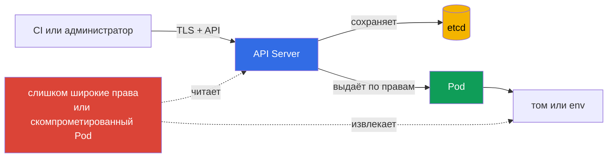

> **Язык:** русский. Переводы будут добавлены после публикации соответствующих файлов.

# Глава 12. Secrets

> **Что дальше.** В главах 10-11 были ограничены идентичности, полномочия и привилегии `Pod`. Теперь важно защитить данные, которыми эти идентичности пользуются: пароли, токены, ключи и сертификаты. `Secret` удобен для передачи таких данных рабочей нагрузке, но сам по себе не делает их недоступными. Это тема домена KCSA **Kubernetes Security Fundamentals** с весом 22%. Примеры в курсе ориентированы на Kubernetes `v1.36`.

## 12.1 Что такое `Secret` и почему base64 не является шифрованием

`Secret` - API-объект Kubernetes для чувствительных небольших данных: паролей, API-токенов, TLS-ключей и данных доступа к registry. В отличие от `ConfigMap`, его назначение прямо указывает, что содержимое требует защиты. Но назначение объекта не заменяет контроль доступа и шифрование.

Поле `data` хранит значения в base64. Это **кодирование**, а не шифрование: любой, кто прочитает строку, может декодировать её без ключа. Base64 нужен, чтобы безопасно представить произвольные байты в YAML или JSON, а не чтобы скрыть секрет.

```yaml
apiVersion: v1
kind: Secret
metadata:
  name: app-credentials
  namespace: shop
type: Opaque
stringData:
  username: app
  password: replace-me
```

`stringData` позволяет записать понятный текст в манифесте, а API Server преобразует его в `data`. Это не делает манифест безопасным: настоящий пароль нельзя отправлять в Git, прикладывать к тикету или оставлять в shell history. Пример показывает форму объекта, а не способ хранить реальные учётные данные.

| Понятие | Что означает | Чего не гарантирует |
|---|---|---|
| `Secret` | API-объект для чувствительных данных | что их увидит только нужное приложение |
| base64 | обратимое кодирование байтов | конфиденциальность данных |
| `stringData` | удобный ввод строк при создании `Secret` | безопасное хранение YAML-файла |
| encryption at rest | шифрование сохранённых данных в хранилище | защиту от субъекта с правом `get` на `Secret` |

Типичная экзаменационная ловушка: `Secret` полезнее `ConfigMap` для пароля, но base64 не является причиной его безопасности. Нужны как минимум ограничение доступа, безопасная доставка и защита данных в хранилище.

## 12.2 Где `Secret` может быть раскрыт

Обычный путь данных выглядит так: клиент записывает `Secret` через API Server, API Server сохраняет его в etcd, а `Pod` получает значение как смонтированный файл или переменную окружения. На каждом участке есть своя граница доверия.



**API и etcd.** Субъект с разрешением `get`, `list` или `watch` для `secrets` может прочитать данные через API. Если нет encryption at rest, доступ к данным etcd, его диску, snapshot или резервной копии также раскрывает сохранённые секреты. TLS защищает соединение с API Server, но не заменяет защиту данных в etcd.

**Монтирование в `Pod`.** Секрет как volume-файл обычно предпочтительнее переменной окружения, когда приложение умеет читать файл и нужны обновления смонтированного содержимого. Но оба способа передают значение процессу. Любой процесс в том же контейнере с достаточными правами может его прочитать; захват рабочего узла ставит под угрозу секреты, смонтированные в размещённые на нём `Pod`.

**Переменные окружения.** Они удобны, но могут случайно оказаться в диагностическом выводе, дампе процесса, логах приложения или интерфейсе отладки. Не печатайте окружение целиком и не передавайте секреты как аргументы командной строки. Это уменьшает вероятность утечки, но не отменяет RBAC и защиты узла.

Не монтируйте один «общий» `Secret` во все приложения namespace. Отдельный `Secret` и отдельная `ServiceAccount` для каждой рабочей нагрузки сужают последствия её компрометации.

## 12.3 Encryption at rest: `EncryptionConfiguration`, провайдеры и KMS

Encryption at rest защищает ресурсы, записанные API Server в etcd. API Server применяет настройки из `EncryptionConfiguration` при записи, а при чтении расшифровывает ранее сохранённые значения. Для `Secret` это защищает данные, если атакующий получил файл данных etcd, snapshot или резервную копию, но не получил разрешение читать объект через API.

Конфигурация задаёт ресурсы и упорядоченный список провайдеров. Первый подходящий провайдер используется для новых записей; остальные нужны, в частности, чтобы читать данные, зашифрованные прежним ключом или прежним провайдером. `identity` означает хранение без шифрования и не должен быть первым выбором для `secrets`.

```yaml
apiVersion: apiserver.config.k8s.io/v1
kind: EncryptionConfiguration
resources:
  - resources:
      - secrets
    providers:
      - kms:
          apiVersion: v2
          name: key-service
          endpoint: unix:///var/run/kmsplugin/socket.sock
          timeout: 3s
      - identity: {}
```

Это структурно корректный минимальный пример KMS v2: `name` идентифицирует провайдер, `endpoint` задаёт Unix-сокет плагина, а `timeout` необязателен. Для KMS v2 не используют `cachesize`. KMS v1 deprecated с Kubernetes v1.28 и по умолчанию отключён с v1.29; KMS v2 - текущий рекомендуемый API.

`identity` в таком порядке допустим только как переходный reader для объектов, зашифрованных до включения KMS. После перешифрования всех данных его удаляют, иначе новые записи могут быть сохранены без шифрования при неверном порядке провайдеров. Подключение файла к API Server, доступность KMS, хранение его ключей, ротация и перешифрование существующих объектов требуют отдельного операционного плана. Их нельзя безопасно заменять копированием короткого YAML.

| Провайдер | Идея | Важная граница |
|---|---|---|
| `identity` | хранит значение как есть | не даёт encryption at rest |
| локальный криптографический провайдер | шифрует данные ключом из конфигурации API Server | ключ тоже нужно надёжно хранить и ротировать |
| `kms` | передаёт криптографические операции внешнему KMS-провайдеру; KMS v2 - текущий рекомендуемый API | требует защиты, доступности и аудита KMS |

KMS обычно используют для разделения обязанностей: Kubernetes хранит зашифрованные данные, а управление ключами выполняет выделенная система или облачный KMS. Это добавляет защиту и аудит, но создаёт зависимость: недоступный или неправильно настроенный KMS способен повлиять на доступность операций с секретами. Поэтому KMS - не «магическая галочка», а часть модели угроз и плана восстановления.

## 12.4 RBAC, гигиена и внешние менеджеры секретов

Первый практический контроль - least privilege в RBAC. Разрешение на `secrets` выдают конкретной `ServiceAccount` или пользователю, только в нужном namespace и только с необходимыми глаголами. `list` и `watch` опаснее точечного `get`: они могут открыть сразу много объектов. Права на создание или изменение `Role` и `RoleBinding` также чувствительны, поскольку позволяют косвенно расширить доступ.

```bash
kubectl auth can-i get secrets \
  --as=system:serviceaccount:shop:orders-api -n shop
```

Команда отвечает на вопрос, разрешено ли указанной идентичности действие. Она полезна при проверке, но не заменяет ревью правил и аудита фактических обращений.

Гигиена секретов включает несколько постоянных правил:

- не записывать значения в Git, образы, Helm values, логи и issue-трекеры;
- не использовать токен или пароль дольше необходимого, ротировать скомпрометированные значения;
- ограничивать, какие `Pod` получают конкретный `Secret`, и не давать приложению лишний API-доступ;
- защищать backup, snapshot и CI-артефакты так же, как production-данные;
- не выводить содержимое `Secret` командами или скриптами в общий терминал и журнал CI.

Внешний менеджер, например HashiCorp Vault или облачный secrets manager, хранит секреты вне обычных объектов Kubernetes и часто предлагает ротацию, аудит и централизованные политики. `External Secrets Operator` может синхронизировать значения из внешнего хранилища в Kubernetes `Secret`, чтобы приложение использовало привычный интерфейс. Это не устраняет риск полностью: после синхронизации значение снова присутствует в API и может быть смонтировано в `Pod`. Выбор зависит от требований к ротации, аудиту, доступности и уже используемой платформы.

## 12.5 Как это применяют на практике

Команда платформы обычно сначала определяет, какие приложения действительно нуждаются в каждом секрете и как они получают его. Затем ограничивает чтение через RBAC, включает encryption at rest для чувствительных ресурсов и проверяет, что backups защищены не хуже etcd.

Для приложений выбирают наименее рискованный способ доставки: файл в volume вместо переменной окружения, если приложение это поддерживает; отдельные секреты вместо одного общего; короткоживущие креды вместо постоянных, если их выдаёт внешний провайдер. В CI используют защищённое хранилище переменных и маскирование вывода, но не считают маскирование заменой контроля доступа.

На уровне процесса важны инвентаризация и ротация: кто владеет секретом, где он используется, как заменить его при инциденте и какие старые копии есть в backup. Это уменьшает время реакции, когда токен случайно попал в лог или репозиторий.

## 12.6 Exam vocabulary / Мини-глоссарий

| Термин | Значение |
|---|---|
| `Secret` | API-объект Kubernetes для чувствительных небольших данных. |
| base64 | Обратимое кодирование байтов, не криптографическая защита. |
| encryption at rest | Шифрование сохранённых данных, например записей в etcd. |
| `EncryptionConfiguration` | Конфигурация API Server, задающая шифрование API-ресурсов в etcd. |
| KMS v2 | Текущий рекомендуемый API интеграции API Server с KMS; KMS v1 deprecated с v1.28 и отключён по умолчанию с v1.29. |
| `identity` | Провайдер без шифрования; временный reader при миграции, удаляемый после перешифрования данных. |
| envelope encryption | Подход, при котором данные шифруются ключом данных, а тот защищается ключом KMS. |
| `External Secrets Operator` | Контроллер, синхронизирующий значения из внешнего secrets manager в Kubernetes `Secret`. |

## 12.7 Exam Essentials / Итоги главы

- `Secret` предназначен для чувствительных данных, но base64 в поле `data` является только кодированием.
- Секрет может быть раскрыт через слишком широкие права API, etcd и его копии, mount в `Pod`, переменные окружения, логи или CI.
- Encryption at rest через `EncryptionConfiguration` защищает запись в etcd, но не заменяет TLS, RBAC и безопасность узла.
- KMS v2 - текущий рекомендуемый API: KMS v1 deprecated с v1.28 и отключён по умолчанию с v1.29; интеграция требует контроля доступа, мониторинга и плана доступности.
- Least-privilege RBAC, ротация, отсутствие секретов в Git и ограниченная доставка рабочим нагрузкам уменьшают радиус утечки.
- Vault и `External Secrets Operator` расширяют возможности хранения и ротации, но не отменяют защиту значения после его появления в `Pod` или Kubernetes API.

## 12.8 Не путать и как это встречается на экзамене

В MCQ обычно нужно назвать границу конкретного механизма. Если в вопросе есть base64, правильный ответ почти никогда не говорит о шифровании. Если речь идёт о snapshot etcd, выбирают encryption at rest и защиту backup. Если субъект уже имеет `get secrets`, шифрование в etcd не помешает API Server выдать объект: нужен RBAC.

Распространённые ловушки:

- путать шифрование в транзите TLS с шифрованием сохранённых данных;
- считать, что тип `Secret` автоматически ограничивает чтение;
- считать KMS заменой RBAC или безопасного монтирования;
- оставлять `identity` постоянным fallback после завершения перешифрования или переносить в KMS v2 поле `cachesize`;
- выбирать `list` или `watch` как «минимальные» права для одного секрета;
- считать, что внешний secrets manager делает значение недоступным после синхронизации в Kubernetes.

Полезный порядок рассуждения: определить место риска, затем выбрать механизм для этой границы - RBAC для API, encryption at rest для etcd, безопасную доставку для `Pod` и процесс ротации для последствий утечки.

## 12.9 Вопросы для самопроверки

### 1. Что означает base64 в поле `data` объекта `Secret`?

   - a. Данные представлены в обратимом кодировании.

   - b. Данные автоматически шифруются KMS.

   - c. Данные зашифрованы ключом API Server.

   - d. Данные доступны только `ServiceAccount` из того же namespace.

<details>
<summary>Ответ и разбор</summary>

**Верный ответ: a.** Base64 кодирует байты для представления в API. Его можно декодировать без криптографического ключа, поэтому нужны RBAC и encryption at rest.

</details>

### 2. Какой контроль прежде всего защищает `Secret` в snapshot etcd при краже файла backup?

   - a. `NetworkPolicy`.

   - b. `automountServiceAccountToken: false`.

   - c. Переменная окружения вместо volume.

   - d. Encryption at rest через `EncryptionConfiguration`.

<details>
<summary>Ответ и разбор</summary>

**Верный ответ: d.** Encryption at rest защищает сохранённые записи etcd и их копии. Остальные варианты относятся к сети, токенам `ServiceAccount` или способу доставки в `Pod`.

</details>

### 3. Пользователь имеет разрешение `get` для `secrets` в namespace. Что изменит включение KMS для этого запроса к API Server?

   - a. KMS добавит отдельный authorization check и отклонит `get`, если пользователь не имеет прямого доступа к encryption key.
   - b. API Server вернёт разрешённому пользователю ciphertext вместо исходного значения, потому что KMS запрещает server-side decryption.
   - c. KMS преобразует `Secret` в объект, который больше нельзя прочитать через обычный Kubernetes API даже при разрешающем RBAC.
   - d. Решение authorization не изменится: API Server расшифрует сохранённые данные и вернёт объект субъекту, которому RBAC разрешает чтение.

<details>
<summary>Ответ и разбор</summary>

**Верный ответ: d.** Encryption at rest и KMS защищают сохранённые данные, а не заменяют Kubernetes authorization. Если API-запрос разрешён, API Server выполняет необходимую расшифровку и возвращает объект. Поэтому least-privilege RBAC остаётся обязательным.

</details>

### 4. Почему `list` для ресурса `secrets` обычно опаснее, чем точечный `get`?

   - a. `list` нельзя использовать с `ServiceAccount`.

   - b. `list` отключает TLS для API Server.

   - c. `list` нужен только для шифрования etcd.

   - d. `list` может раскрыть значения многих секретов сразу.

<details>
<summary>Ответ и разбор</summary>

**Верный ответ: d.** Массовое чтение увеличивает объём раскрытых данных. Least privilege стремится выдавать только нужный ресурс и глагол.

</details>

### 5. Какое утверждение об `External Secrets Operator` верно?

   - a. Он может синхронизировать значение из внешнего хранилища в Kubernetes `Secret`.

   - b. Он делает base64 криптографическим шифрованием.

   - c. Он заменяет RBAC для `Secret`.

   - d. Он гарантирует, что значение никогда не попадёт в Kubernetes.

<details>
<summary>Ответ и разбор</summary>

**Верный ответ: a.** Оператор связывает внешний secrets manager с ресурсами Kubernetes. После синхронизации обычные риски API, etcd и монтирования всё ещё нужно учитывать.

</details>

> **Куда дальше.** Для практической настройки encryption at rest, KMS, ротации ключей и проверки сохранённых записей изучите главу 21 CKS о шифровании etcd и безопасном хранении `Secret`. Для административной основы `Secret` и способов передачи значений в `Pod` полезна глава 19 CKA.

[Оглавление](../README_RU.md) · [Глава 11](../11/ru.md) · [Глава 13](../13/ru.md)
