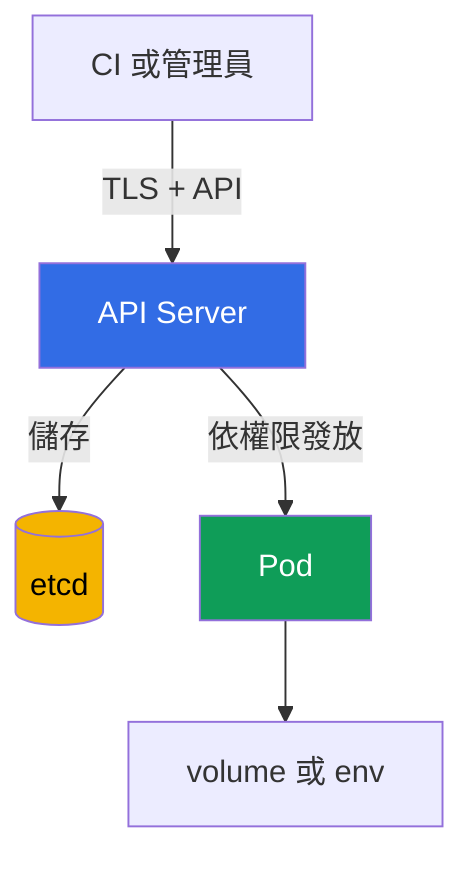

[Русская версия](ru.md) · [Eng version](README.md) · [Versión en español](es.md) · [Version française](fr.md) · [Deutsche Version](de.md) · [ქართული ვერსია](ge.md) · [日本語版](jp.md)

# 第 12 章. Secrets

> **接下來。** 第 10-11 章限制了 `Pod` 的身分、權限與特權。現在重要的是保護這些身分所使用的資料：密碼、權杖、金鑰與憑證。`Secret` 可方便地將這類資料提供給工作負載，但它本身不會使資料無法被存取。本章屬於 KCSA **Kubernetes Security Fundamentals** 領域，權重為 22%。課程中的範例以 Kubernetes `v1.36` 為準。

## 12.1 `Secret` 是什麼，以及為何 base64 不是加密

`Secret` 是 Kubernetes 用於敏感小型資料的 API 物件：密碼、API 權杖、TLS 金鑰與 registry 存取資料。與 `ConfigMap` 不同，其用途明確表示內容需要受到保護。但物件的用途不能取代存取控制與加密。

`data` 欄位以 base64 儲存值。這是**編碼**，不是加密：任何讀到該字串的人都可在沒有金鑰的情況下解碼。Base64 的作用是安全地在 YAML 或 JSON 表示任意位元組，而不是隱藏 Secret。

```yaml
apiVersion: v1
kind: Secret
metadata:
  name: app-credentials
  namespace: shop
type: Opaque
stringData:
  username: app
  password: replace-me
```

`stringData` 可讓您在 manifest 中寫入可讀文字，API Server 會將其轉換為 `data`。這不會讓 manifest 變得安全：絕不可將真實密碼送入 Git、附在工單中或留在 shell history。此範例說明物件的形式，而不是儲存真實憑證的方法。

| 概念 | 含義 | 不保證的事項 |
|---|---|---|
| `Secret` | 用於敏感資料的 API 物件 | 只有需要的應用程式會看到資料 |
| base64 | 可逆的位元組編碼 | 資料的機密性 |
| `stringData` | 建立 `Secret` 時方便輸入字串 | YAML 檔案的安全儲存 |
| encryption at rest | 儲存系統中已保存資料的加密 | 防範具有 `get` `Secret` 權限的主體 |

常見考試陷阱：相較於 `ConfigMap`，`Secret` 更適合密碼，但 base64 並不是其安全性的原因。至少還需要限制存取、安全交付以及保護儲存系統中的資料。

## 12.2 `Secret` 可能在哪裡洩漏

典型資料路徑如下：用戶端透過 API Server 寫入 `Secret`，API Server 將其保存至 etcd，而 `Pod` 以掛載檔案或環境變數取得該值。路徑中的每一段都有各自的信任邊界。



若信任邊界遭破壞，這條路徑的每一段都有其洩漏方式。依序說明：先是 API/etcd，然後是 `Pod` 本身。

重要的是，這些不是互斥而是相互補充的風險 - 保護其中一段（例如用戶端與 API Server 之間的 TLS）並不會涵蓋其他部分。

**透過 API 存取。** 對 `secrets` 具有 `get`、`list` 或 `watch` 權限的主體，無論 Secret 實際儲存於何處及如何儲存，都能透過 API Server 直接讀取資料。這是 RBAC 問題：TLS 保護通往 API Server 的連線通道本身，但不限制持有有效 credentials 的主體獲准讀取哪些資料。

**存取 etcd。** 這是獨立且繞過 API 的途徑：若未啟用 encryption at rest，任何能存取 etcd 資料、其磁碟、snapshot 或備份的人，都可直接讀取已保存的 Secret，完全繞過 RBAC 與 API Server。此途徑的防護不是透過 `secrets` 的存取權限，而是透過 encryption at rest 與限制對 etcd 本身的存取（見 §12.3）。

**掛載至 `Pod`。** 當應用程式能讀取檔案且需要掛載內容更新時，通常應優先將 Secret 作為 volume 檔案，而非環境變數。但兩種方式都會將值交給程序。同一容器中具有足夠權限的任何程序都能讀取它；工作節點遭攻破時，部署於該節點之 `Pod` 所掛載的 Secret 也會面臨風險。

**透過 `create pods` 繞過而不具讀取 `Secret` 的權限。** 這是獨立且對考試很重要的情況：主體不需要具有 `secrets` 的 `get`/`list`/`watch` 權限，便能讀取具名的特定 `Secret`。若主體對 `pods` 有 `create` 權限（通常也有 `pods/exec` 的 `create` 權限），它會在相同 namespace 建立新的 `Pod`，將現有 `Secret` 作為 volume 或 env 掛載至其中 - 對此 RBAC 不會檢查 `Secret` 物件本身的權限，只檢查建立 `Pod` 的權限 - 接著對自己的新 `Pod` 執行 `exec` 並讀取掛載值。因此，在包含機密 `Secret` 的 namespace 中，對 `pods` 的 `create` 等同於能讀取其中任一 Secret，即使完全沒有 `secrets` 的權限。

**環境變數。** 它們很方便，但可能意外出現在診斷輸出、程序 dump、應用程式日誌或除錯介面中。請勿完整列印環境，也不要將 Secret 作為命令列引數傳遞。這能降低洩漏機率，但不能取代 RBAC 與節點防護。

不要將單一「共用」`Secret` 掛載至 namespace 的所有應用程式。為每個工作負載使用獨立的 `Secret` 與獨立的 `ServiceAccount`，可縮小其遭攻破時的影響範圍。

## 12.3 Encryption at rest：`EncryptionConfiguration`、provider 與 KMS

Encryption at rest 可保護 API Server 寫入 etcd 的資源。API Server 在寫入時套用 `EncryptionConfiguration` 的設定，並在讀取時解密先前保存的值。對 `Secret` 而言，若攻擊者取得 etcd 資料檔、snapshot 或備份但沒有透過 API 讀取物件的權限，這可保護資料。

此設定指定資源與有順序的 provider 清單。第一個相符的 provider 用於新寫入的資料；其餘 provider 的用途之一是讀取以舊金鑰或舊 provider 加密的資料。`identity` 表示未加密儲存，且不應是 `secrets` 的首選。

```yaml
apiVersion: apiserver.config.k8s.io/v1
kind: EncryptionConfiguration
resources:
  - resources:
      - secrets
    providers:
      - kms:
          apiVersion: v2
          name: key-service
          endpoint: unix:///var/run/kmsplugin/socket.sock
          timeout: 3s
      - identity: {}
```

這是結構正確的最小 KMS v2 範例：`name` 識別 provider，`endpoint` 指定外掛程式的 Unix socket，而 `timeout` 為選用項。KMS v2 不使用 `cachesize`。KMS v1 自 Kubernetes v1.28 起 deprecated，且自 v1.29 起預設停用；KMS v2 是目前建議使用的 API。

在此順序中，`identity` 僅能作為啟用 KMS 前已加密物件的過渡讀取器。重新加密所有資料後，應將其移除，否則在 provider 順序錯誤時，新寫入內容可能未加密儲存。將檔案連接至 API Server、KMS 的可用性、其金鑰儲存、輪替以及現有物件的重新加密，需要獨立的營運計畫。不可安全地以複製一小段 YAML 取代這些工作。

| Provider | 概念 | 重要邊界 |
|---|---|---|
| `identity` | 按原樣儲存值 | 不提供 encryption at rest |
| 本機密碼學 provider | 使用 API Server 設定中的金鑰加密資料 | 金鑰本身也必須安全儲存與輪替 |
| `kms` | 將密碼學操作交由外部 KMS provider 執行；KMS v2 是目前建議使用的 API | 需要保護、確保可用性及稽核 KMS |

KMS 通常用於職責分離：Kubernetes 儲存加密資料，而專用系統或雲端 KMS 負責金鑰管理。這增加了保護與稽核能力，但也帶來依賴性：無法使用或設定錯誤的 KMS 可能影響 Secret 操作的可用性。因此，KMS 並非「神奇勾選框」，而是威脅模型與復原計畫的一部分。

**Managed control plane：無法直接使用 `EncryptionConfiguration`。** 上述所有內容 - `EncryptionConfiguration`、`--encryption-provider-config` 旗標以及 `kube-apiserver` 程序本身 - 都由 managed 叢集（Amazon EKS、GKE、AKS）的雲端 provider 管理。叢集管理員無法像自行管理的叢集（例如透過 `kubeadm`）那樣，直接編輯此檔案或插入自有 KMS 外掛程式。Managed provider 透過自己的機制而非直接存取 `EncryptionConfiguration` 解決此問題。例如在 Amazon EKS 中，從 Kubernetes v1.28 起，所有 Kubernetes API 資料（`Secret`、`ConfigMap` 與其他資源）的 envelope encryption 預設已啟用，不需要使用者採取任何動作，並透過 KMS v2 使用 AWS-owned KMS 金鑰。此外，EKS 管理員也能連接**自己的 customer-managed** KMS 金鑰 - 此操作是透過獨立的 EKS API（`aws eks` CLI、`eksctl` 或 Terraform），而非編輯叢集的 `EncryptionConfiguration`。Managed 叢集的結論是：`secrets` 的 encryption at rest 很可能已由 provider 啟用，但其 provider 與金鑰由平台決定，而不是本章上方展示的檔案。

## 12.4 RBAC、衛生措施與外部 Secret manager

第一項實務控制是 RBAC 中的 least privilege。僅將 `secrets` 的權限授予特定 `ServiceAccount` 或使用者，僅限必要的 namespace，並且只授予必要動詞。`list` 與 `watch` 比針對性的 `get` 更危險：它們可能一次洩露許多物件。建立或修改 `Role` 與 `RoleBinding` 的權限同樣敏感，因為這些權限可間接擴大存取範圍。

```bash
kubectl auth can-i get secrets \
  --as=system:serviceaccount:shop:orders-api -n shop
```

以下說明此命令的每個參數：

- `get secrets` - 要檢查的動作：RBAC 動詞（`get`）與資源類型（`secrets`）。正是此組合會與 `Role`/`ClusterRole` 規則比對。
- `--as=system:serviceaccount:shop:orders-api` - 檢查執行時所模擬的身分。字串 `system:serviceaccount:<namespace>:<名稱>` 是 Kubernetes 中特定 `ServiceAccount` 身分的完整名稱：固定前綴 `system:serviceaccount:`，接著是建立 `ServiceAccount` 的 namespace（此處為 `shop`），再接著是 `ServiceAccount` 物件的 `metadata.name`（此處為 `orders-api`）。這不是任意格式的字串 - Kubernetes authentication 層正是以此方式識別任何向 API 發出請求的 `ServiceAccount`，而 `RoleBinding`/`ClusterRoleBinding` 中的 `subjects` 也正是參照此名稱。
- `-n shop` - **檢查動作所在的** namespace `get secrets`（亦即指的是 `shop` namespace 中的 `secrets`）。它可以與 `--as` 中 `ServiceAccount` 的 namespace 相同或不同：只要 RBAC 如此設定，某個 namespace 的 `ServiceAccount` 完全可以透過 `RoleBinding` 擁有另一個 namespace 中資源的權限。

該命令回答指定身分是否可執行此動作。它有助於驗證，但不能取代規則審查與對實際存取行為的稽核。

Secret 衛生措施包括幾項持續性規則：

- 不要將值寫入 Git、映像、Helm values、日誌與 issue tracker；
- 不要讓權杖或密碼使用超過必要時間，並輪替遭攻破的值；
- 限制哪些 `Pod` 可取得特定 `Secret`，且不要給應用程式多餘的 API 存取權；
- 對 backup、snapshot 與 CI artifact 提供不低於 production 資料的保護；
- 不要透過命令或指令碼將 `Secret` 內容輸出到共用終端機與 CI 日誌。

外部 manager，例如 HashiCorp Vault 或雲端 secrets manager，會將 Secret 儲存在一般 Kubernetes 物件之外，且常提供輪替、稽核與集中式政策。將其值交付至 `Pod` 有兩種本質不同的方法，並以不同方式影響威脅模型：

- **同步至 Kubernetes `Secret`。** `External Secrets Operator` (ESO) 從外部儲存系統讀取值，並建立一般 Kubernetes `Secret`，讓應用程式使用熟悉的介面（volume 或 env）。這很方便，卻不能完全消除風險：同步後，該值再次以一般 `Secret` 物件存在於 Kubernetes API 中 - 會受到 §12.2 所述的所有相同洩漏風險（`secrets` 的 RBAC、etcd、掛載），而不僅是 Vault 或 cloud secrets manager 本身的政策。
- **不在 Kubernetes 中建立 `Secret` 物件的 init-container 或 sidecar。** 另一種常見模式是讓 agent（例如 Vault Agent 或雲端 provider 的類似方案）作為 `Pod` 內的 init-container 或 sidecar 執行。它會在 `Pod` 啟動時自行連線至外部儲存系統（sidecar 亦會在後續變更時連線）、取得值，並將它放入同一 `Pod` 中應用程式的檔案或環境變數，完全繞過 Kubernetes API。此處 Kubernetes 中根本不存在 `Secret` 物件：對 `secrets` 的 RBAC 規則、etcd 的 encryption at rest 與 `kubectl get secrets` 都與這些資料無關 - 整個存取控制會移轉至 agent 對外部儲存系統的 authentication，以及 `Pod` 內檔案系統/環境的保護。

選擇取決於輪替、稽核、可用性與既有平台的需求。

## 12.5 實際套用方式

平台團隊通常先確認哪些應用程式確實需要每個 Secret，以及它們如何取得該 Secret。接著透過 RBAC 限制讀取、為敏感資源啟用 encryption at rest，並確認 backup 的保護不弱於 etcd。

針對應用程式，應選擇風險最低的交付方式：若應用程式支援，使用 volume 中的檔案而非環境變數；使用獨立 Secret 而非共用的一個；若外部 provider 能發放，則使用短期 credentials 而非長期 credentials。在 CI 中使用受保護的變數儲存與輸出遮罩，但不要將遮罩視為存取控制的替代方案。

在流程層面，清查與輪替很重要：誰擁有 Secret、它在哪裡使用、事故發生時如何替換，以及 backup 中存在哪些舊副本。當權杖意外出現在日誌或 repository 時，這可縮短回應時間。

## 12.6 Exam vocabulary / 迷你詞彙表

| 術語 | 含義 |
|---|---|
| `Secret` | 用於敏感小型資料的 Kubernetes API 物件。 |
| base64 | 可逆的位元組編碼，不是密碼學保護。 |
| encryption at rest | 已保存資料的加密，例如 etcd 中的記錄。 |
| `EncryptionConfiguration` | API Server 設定，用於指定 etcd 中 API 資源的加密。 |
| KMS v2 | API Server 與 KMS 整合目前建議使用的 API；KMS v1 自 v1.28 起 deprecated，且自 v1.29 起預設停用。 |
| `identity` | 未加密 provider；遷移時的暫時讀取器，資料重新加密後應移除。 |
| envelope encryption | 以資料金鑰加密資料，並以 KMS 金鑰保護該資料金鑰的方法。 |
| `External Secrets Operator` | 將外部 secrets manager 的值同步至 Kubernetes `Secret` 的 controller。 |

## 12.7 Exam Essentials / 本章重點

- `Secret` 用於敏感資料，但 `data` 欄位中的 base64 僅是編碼。
- Secret 可能經由過度寬鬆的 API 權限、etcd 及其副本、掛載至 `Pod`、環境變數、日誌或 CI 而洩漏。
- 透過 `EncryptionConfiguration` 實作的 encryption at rest 可保護 etcd 中的記錄，但不能取代 TLS、RBAC 與節點安全。
- KMS v2 是目前建議使用的 API：KMS v1 自 v1.28 起 deprecated，且自 v1.29 起預設停用；整合需要存取控制、監控與可用性計畫。
- Least-privilege RBAC、輪替、不將 Secret 放入 Git，以及限制交付給工作負載，可降低洩漏範圍。
- Vault 與 `External Secrets Operator` 擴展了儲存與輪替能力，但不會免除值出現在 `Pod` 或 Kubernetes API 後的保護需求。

## 12.8 不要混淆，以及它如何出現在考試中

在 MCQ（multiple choice question，選擇題）中，通常需要指出特定機制的邊界。若問題提到 base64，正確答案幾乎不會說它是加密。若談的是 etcd snapshot，應選擇 encryption at rest 與 backup 保護。若主體已具有 `get secrets`，etcd 加密不會阻止 API Server 回傳物件：需要的是 RBAC。

常見陷阱：

- 混淆傳輸中的 TLS 加密與已保存資料的加密；
- 認為 `Secret` 類型會自動限制讀取；
- 認為 KMS 可取代 RBAC 或安全掛載；
- 在所有既有物件重新加密後，仍將 `identity` 留作永久 fallback provider：正確做法是從 provider 清單中移除 `identity`，否則在 provider 順序錯誤時，新寫入內容可能未加密儲存（見 §12.3）；
- 嘗試透過 `cachesize` 欄位設定 KMS 快取：這是 KMS v1 的參數，KMS v2 並不存在此欄位 - 在 KMS v2 設定中使用 `cachesize` 是 API 版本不符的明確跡象，考試可能會問到；
- 將 `list` 或 `watch` 視為單一 Secret 的「最小」權限：兩個命令都會回傳 namespace 中每個 `Secret` 的完整物件，包括 `data` 欄位，而不只是名稱 - 亦即對 `list`/`watch` 的權限實際上會洩漏 namespace 中所有 Secret 的值；相較之下，對單一特定 `Secret` 的存取只需要在規則中搭配明確資源名稱（`resourceNames`）的 `get`；
- 認為外部 secrets manager 的運作方式總是相同：值的交付方式會改變威脅模型（見 §12.4）。同步至 Kubernetes `Secret` 時（例如透過 `External Secrets Operator`），該值會再次存在於一般 `Secret` 物件中，並受到 §12.2 的所有洩漏風險影響 - RBAC、etcd、掛載。透過自行存取外部儲存系統並將值放入 `Pod` 內檔案或 env 的 init-container 或 sidecar agent 交付時，Kubernetes 根本不會產生 `Secret` 物件 - 對 `secrets` 的 RBAC 與 etcd 的 encryption at rest 不適用，因為資料根本不在那裡；控制完全移轉至 agent 對外部儲存系統的 authentication。

實用的推理順序：先確定風險所在位置，接著為該邊界選擇機制 - API 使用 RBAC，etcd 使用 encryption at rest，`Pod` 使用安全交付，以及透過輪替流程處理洩漏後果。

## 12.9 自我檢查問題

### 1. `Secret` 物件 `data` 欄位中的 base64 是什麼意思？

   - a. 資料以可逆編碼表示。

   - b. 資料會由 KMS 自動加密。

   - c. 資料以 API Server 金鑰加密。

   - d. 資料僅供相同 namespace 的 `ServiceAccount` 存取。

<details>
<summary>答案與解析</summary>

**正確答案：a.** Base64 會對位元組編碼以便在 API 中表示。無須密碼學金鑰即可解碼，因此仍需要 RBAC 與 encryption at rest。

</details>

### 2. 當 backup 檔案遭竊時，哪項控制最優先保護 etcd snapshot 中的 `Secret`？

   - a. `NetworkPolicy`。

   - b. `automountServiceAccountToken: false`。

   - c. 使用環境變數而非 volume。

   - d. 透過 `EncryptionConfiguration` 實作的 encryption at rest。

<details>
<summary>答案與解析</summary>

**正確答案：d.** Encryption at rest 可保護已保存的 etcd 記錄及其副本。其他選項分別涉及網路、`ServiceAccount` 權杖或交付給 `Pod` 的方式。

</details>

### 3. 使用者在 namespace 中具有 `secrets` 的 `get` 權限。為此 API Server 請求啟用 KMS 會改變什麼？

   - a. KMS 會新增獨立的 authorization check，若使用者無法直接存取 encryption key，便拒絕 `get`。
   - b. API Server 會向獲准使用者回傳 ciphertext 而非原始值，因為 KMS 禁止 server-side decryption。
   - c. KMS 會將 `Secret` 轉換成一種物件，即使 RBAC 允許，也不能再透過一般 Kubernetes API 讀取。
   - d. authorization 決定不會改變：API Server 會解密已保存的資料，並將物件回傳給 RBAC 准許讀取的主體。

<details>
<summary>答案與解析</summary>

**正確答案：d.** Encryption at rest 與 KMS 保護已保存的資料，而不會取代 Kubernetes authorization。若 API 請求獲准，API Server 會執行必要解密並回傳物件。因此 least-privilege RBAC 仍是必要的。

</details>

### 4. 為什麼對 `secrets` 資源的 `list` 通常比針對性的 `get` 更危險？

   - a. `list` 無法與 `ServiceAccount` 一起使用。

   - b. `list` 會停用 API Server 的 TLS。

   - c. `list` 僅用於 etcd 加密。

   - d. `list` 可能一次洩漏許多 Secret 的值。

<details>
<summary>答案與解析</summary>

**正確答案：d.** 大量讀取會增加洩漏資料的範圍。Least privilege 的目標是只授予必要資源與動詞。

</details>

### 5. 關於 `External Secrets Operator`，哪項敘述正確？

   - a. 它可將外部儲存系統的值同步至 Kubernetes `Secret`。

   - b. 它能使 base64 成為密碼學加密。

   - c. 它可取代 `Secret` 的 RBAC。

   - d. 它保證值永遠不會進入 Kubernetes。

<details>
<summary>答案與解析</summary>

**正確答案：a.** 該 operator 將外部 secrets manager 與 Kubernetes 資源連接。同步後，仍必須考量一般的 API、etcd 與掛載風險。

</details>

> **下一步。** 如需實作設定 encryption at rest、KMS、金鑰輪替與驗證已保存記錄，請學習 CKS 第 21 章關於 etcd 加密與安全儲存 `Secret` 的內容。若需了解 `Secret` 的管理基礎及將值交付至 `Pod` 的方式，請參閱 CKA 第 19 章。

[目錄](../README_TW.md) · [第 11 章](../11/tw.md) · [第 13 章](../13/tw.md)
