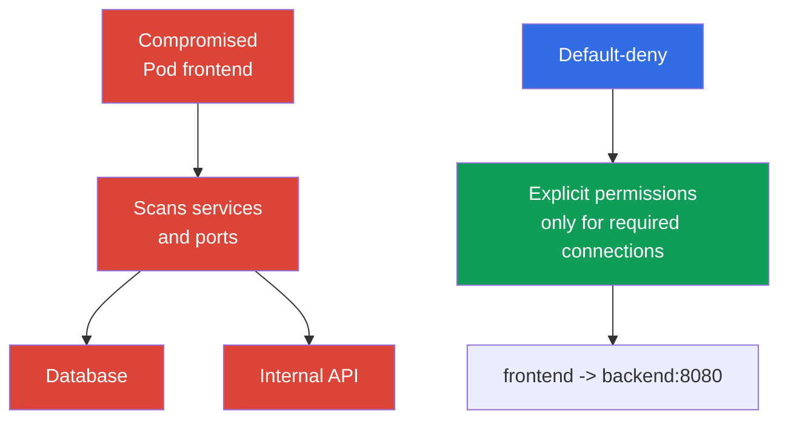

[Русская версия](ru.md) · [Versión en español](es.md) · [Version française](fr.md) · [Deutsche Version](de.md) · [ქართული ვერსია](ge.md) · [繁體中文版](tw.md) · [日本語版](jp.md)

# Chapter 13. Network Policy, isolation, and segmentation

> **What’s next.** In the chapters on authentication, Pod Security Standards, and `Secret`, we limited identities, privileges, and access to data. Now we will limit network paths between workloads. `NetworkPolicy` helps prevent the compromise of one `Pod` from automatically becoming lateral movement across the entire cluster. This is a Kubernetes Security Fundamentals KCSA domain topic with a weight of 22%. The examples target Kubernetes `v1.36`.

## 13.1 `NetworkPolicy`: why default allow is dangerous and why default-deny matters

`NetworkPolicy` is a Kubernetes API resource that describes allowed incoming (`Ingress`) and outgoing (`Egress`) network connections for selected `Pod`. It does not protect an application from a code defect and does not replace RBAC, but it reduces the number of available network paths after a workload compromise.

Kubernetes does not create a default-deny `NetworkPolicy` automatically. If a `Pod` is not isolated by an applicable policy for a specific direction, traffic in that direction is normally allowed. To move to default-deny, create an explicit `NetworkPolicy` that selects the required Pods and contains no allowing ingress/egress rules for the selected `policyTypes`, then add only the required flows with separate policies.



**Default-deny** means that a default block is first created for a traffic direction, followed by narrow allow policies. Precise wording matters: a `Pod` is isolated separately for `Ingress` and `Egress` when at least one `NetworkPolicy` with the corresponding direction in `policyTypes` selects it.

`NetworkPolicy` policies are additive **for a single selected `Pod` and a single direction**: if multiple policies apply to its ingress or egress, the allowed set of connections is the union of the allow rules from all applicable policies. There is no policy order and no separate deny rule with a “deny overrides allow” priority.

For a `source Pod → destination Pod` connection, both sides are checked independently. If the source `Pod` is isolated for `Egress`, its egress rules must allow the destination. If the destination `Pod` is isolated for `Ingress`, its ingress rules must allow the source. When both sides are isolated, a connection is possible only if it is allowed by **both the source egress and the destination ingress**.

This approach implements least privilege in the network. It requires an inventory of dependencies: an application may need DNS, a database, another service’s API, an external payment gateway, or a cloud-provider endpoint. An incomplete allow policy can break an application, so changes should be planned and observed, not added blindly.

## 13.2 `Ingress`, `Egress`, selectors, and minimal default-deny

`Ingress` describes traffic **to** selected `Pod`, while `Egress` describes traffic **from** them. Rules use selectors rather than individual `Pod` IP addresses because addresses change when Pods are recreated:

| Mechanism | What it selects | Typical use |
|---|---|---|
| `podSelector` | `Pod` with specified labels in the same `Namespace` | allow `frontend` to reach `backend` |
| `namespaceSelector` | `Namespace` with specified labels | allow traffic from the `monitoring` namespace |
| `ipBlock` | CIDR range of IP addresses | exceptional external endpoint or corporate network |
| `ports` | protocol and port | allow only TCP 5432 for the database |

If `podSelector` and `namespaceSelector` are in the same `from` or `to` element, they operate as an intersection: `Pod` with the required label **in** a matching `Namespace` qualify. If they are in different list elements, they are alternative sources or destinations. This distinction is often tested in YAML questions.

Below is a minimal example that selects all `Pod` in the `shop` namespace and isolates them in both directions. Empty `ingress` and `egress` lists do not allow connections in those directions.

```yaml
apiVersion: networking.k8s.io/v1
kind: NetworkPolicy
metadata:
  name: default-deny-ingress-egress
  namespace: shop
spec:
  podSelector: {}
  policyTypes:
    - Ingress
    - Egress
  ingress: []
  egress: []
```

This is default-deny for Pod traffic that the particular CNI implementation handles through NetworkPolicy, not a host firewall. The behavior of `hostNetwork` Pods depends on the network plugin; node/host traffic has special cases. Therefore, ordinary Kubernetes `NetworkPolicy` cannot be considered a universal access control for kubelet or other host endpoints.

After this baseline rule, separate policies are added. For example, `frontend` can be allowed only to TCP port `8080` on `backend`, and `backend` only to the database port. For name resolution, egress to the cluster DNS server is normally allowed separately. Do not replace segmentation with a rule that allows all traffic in `kube-system`: this expands the trusted surface more than necessary.

`NetworkPolicy` controls connections at network layers L3/L4 within the supported implementation: sources, destinations, IPs, and ports. It does not interpret the HTTP user, an SQL query, or the meaning of application data.

## 13.3 Namespace boundaries, networking, and multi-tenancy

`Namespace` is useful for organizing resources, quotas, RBAC, and policies, but it is not a network wall by itself. A `Pod` in the `team-a` namespace can reach a `Pod` in `team-b` if the network permits it and no applicable `NetworkPolicy` exists. Likewise, a namespace does not prevent user access through the API if RBAC grants the relevant permissions.

Therefore, isolation in a multi-tenant environment is built in layers:

| Boundary | Control | Problem reduced |
|---|---|---|
| Identity and API | separate `ServiceAccount`, RBAC, admission | reading or changing other tenants’ resources |
| Namespace | separate namespaces, `ResourceQuota`, `LimitRange` | resource mixing and uncontrolled consumption |
| Network | default-deny and targeted `NetworkPolicy` | access to another tenant’s services and lateral movement |
| Execution | PSS, `securityContext`, sandbox when needed | container escape and dangerous privileges |

For soft multi-tenancy, several teams share a cluster, and protection relies on correct RBAC, namespaces, and network policies. This is convenient, but an error in shared infrastructure or a broad role can affect a neighboring tenant. When isolation requirements are high, use stronger separation: dedicated nodes, separate clusters, or sandbox runtimes. The choice depends on the value of the data, trust between teams, and the acceptable consequences of an error.

Segmentation should reflect the real architecture, not merely team names. A useful question for every connection is: which `Pod` initiates the connection, to which service, on which port, and is the connection truly needed in production? The answer forms an allowlist and reveals unexpected dependencies.

## 13.4 The role of CNI and an overview of Cilium

The `NetworkPolicy` object is part of the Kubernetes API, but Kubernetes itself does not intercept packets. A CNI plugin or its network component enforces the rules. Therefore, the presence of a YAML object does not prove that traffic is restricted: the selected CNI must support and enable `NetworkPolicy` enforcement. This should be checked in the documentation and in a project test, especially when changing CNI.

Ordinary Kubernetes `NetworkPolicy` expresses L3/L4 relationships: which identities or addresses may communicate and on which ports. **Cilium** is a CNI that uses eBPF and supports standard `NetworkPolicy` as well as its own policies. Its additional capabilities are useful when an address and port are insufficient for protection:

| Layer | Example Cilium control | Why it is needed |
|---|---|---|
| L3 | source or destination by identity | isolate workload groups |
| L4 | TCP or UDP port | allow only the required service port |
| L7 | HTTP method, path, header | restrict access to specific API operations |
| DNS-aware | rules for DNS names, for example `api.example.com` | narrow egress to an external service whose IP changes |

L7 and DNS-aware policies are not capabilities of the base `NetworkPolicy` API; they depend on Cilium and its configuration. L7 control is not unique to Cilium: it implements it at the CNI layer through eBPF without a sidecar proxy, while service meshes (Istio, Linkerd) achieve a similar result at the application layer through a sidecar proxy, also adding mTLS and telemetry (see chapter 18 on PKI, mTLS, and service mesh). CNI L7 policies and a service mesh do not replace application validation: allowing `GET /healthz` at L7 is more useful than access to the entire HTTP service, but it will not fix a server vulnerability. Cilium also provides observability of network decisions, helping determine why a connection was allowed or rejected.

### What `NetworkPolicy` does and does not do

**Does:** controls allowed ingress/egress connections for selected `Pod` through CNI enforcement. **Does not automatically:** encrypt traffic, authenticate a workload or user, perform application-layer authorization, scan an image, or limit CPU/RAM.

Encrypting traffic between `Pod` is a separate concern from `NetworkPolicy` and CNI L7 filtering: it is handled through TLS/mTLS at the application layer or through a service mesh (for example Istio, Linkerd), which adds a sidecar proxy, workload identity, and mTLS without changing application code (more in chapter 18). `NetworkPolicy` and Cilium L7 policies can allow or deny a connection, but they do not make its contents confidential.

| Scenario | Best control | Evidence |
|---|---|---|
| `frontend` must not open a TCP connection to the database | `NetworkPolicy` | policy inspection and testing of allowed/denied connections |
| `ServiceAccount` must not read a `Secret` through the API | RBAC | `kubectl auth can-i` and API audit event |
| A Pod must run without `privileged` | PSS/PSA or admission policy | admission rejection/warn/audit |
| Cryptographic protection of allowed traffic is required | TLS/mTLS | certificate/handshake and configuration |

This selection starts with the boundary: API permission, object parameter, network path, runtime process, or data in transit. `NetworkPolicy` is the precise answer only for the network path.

## 13.5 How this is applied in practice

Start not with a set of random rules, but with a flow map: client to `frontend`, `frontend` to `backend`, `backend` to the database, workloads to DNS, and only the necessary external APIs. Create default-deny for the required directions in each namespace, then introduce minimal allow policies. This is easier to do incrementally: first observe dependencies, then restrict less critical services, and then apply the pattern in the remaining namespaces.

Labels become part of the security contract. Stable labels such as `app: frontend`, `app: backend`, and the namespace label `team: payments` allow a policy to follow a `Pod` rather than its temporary IP. Labels should not be granted to an untrusted subject without control: the ability to change a label can also change a workload’s network membership.

In production, verify both expected and prohibited paths: application availability, DNS, metrics, updates, and lack of access to a neighboring tenant. CNI logs or Cilium observability help find a rejected legitimate connection. These checks do not replace the policy itself: their purpose is to confirm that the intended allowlist matches the architecture.

## 13.6 Exam vocabulary / Mini-glossary

| Term | Meaning |
|---|---|
| `NetworkPolicy` | A Kubernetes API object that defines allowed incoming and outgoing connections for selected `Pod`. |
| default-deny | An approach in which traffic in a selected direction is denied until an explicit policy allows it. |
| `Ingress` | The direction of network traffic to a `Pod`. |
| `Egress` | The direction of network traffic from a `Pod`. |
| CNI | The interface and plugins through which Kubernetes connects container networking; the CNI implementation enforces network policies. |
| multi-tenancy | Use of a single platform by multiple teams or organizations with separated access and resources. |
| L3/L4/L7 | Control layers: IP network, transport ports, and application protocol. |

## 13.7 Exam Essentials / Chapter summary

- Without an applicable `NetworkPolicy`, `Pod` traffic is normally allowed; default-deny creates the starting point for an allowlist.
- `Ingress` and `Egress` are isolated independently, and matching policies combine as permissions.
- `podSelector` and `namespaceSelector` define network identity through labels; a `Namespace` without policy is not a network boundary.
- Multi-tenancy requires multiple layers: RBAC, namespaces, quotas, network policies, and execution restrictions.
- Enforcement depends on the CNI. Cilium supports base policies and can add L7 and DNS-aware control.

## 13.8 Common confusions and how this appears on the exam

KCSA questions generally test the model, not the syntax of a large manifest. You need to distinguish default allow from default-deny, understand the direction of `Ingress` and `Egress`, the role of `podSelector` and `namespaceSelector`, and the fact that a namespace is not automatic network isolation. A separate pitfall is that `NetworkPolicy` has effect only when the selected CNI supports enforcement.

It is also important not to conflate the base `NetworkPolicy` with Cilium extensions. A base policy restricts sources, destinations, and ports, whereas L7 HTTP rules and DNS-name rules are additional Cilium capabilities. When selecting the most correct answer, look for the minimum control that closes the described traffic path.

## 13.9 Self-check questions

### 1. What most accurately describes the state of a `Pod` that is not selected by any `NetworkPolicy`?

   - a. Only traffic from a `Pod` in the same namespace is allowed if the CNI supports `NetworkPolicy`.

   - b. The `Pod` remains non-isolated for a direction until a matching `NetworkPolicy` isolates it and the CNI enforces the rules.

   - c. Only DNS and traffic to the Kubernetes API are allowed; all other connections are blocked automatically.

   - d. Kubernetes automatically applies default-deny ingress and egress to every `Pod` without a selected policy.

<details>
<summary>Answer and explanation</summary>

**Correct answer: b.** Kubernetes itself does not create default-deny for every `Pod`. A restriction appears when a matching policy isolates the direction and the CNI enforces it.

</details>

### 2. What effect does a `NetworkPolicy` with `podSelector: {}`, `policyTypes: [Ingress, Egress]`, `ingress: []`, and `egress: []` have in one namespace?

   - a. It selects all Pods in the namespace and isolates them for the specified directions until matching additive policies explicitly allow the required traffic.
   - b. It blocks Kubernetes API authorization for all users who work with objects in that namespace.
   - c. It allows all ingress and egress between Pods in the namespace while blocking only external traffic.
   - d. It deletes selected Pods on the first network connection that does not match an allowing rule.

<details>
<summary>Answer and explanation</summary>

**Correct answer: a.** An empty `podSelector` selects all Pods in the namespace, and empty ingress/egress rules add no permissions for the corresponding directions. Other matching NetworkPolicy can additively allow specific traffic. Actual enforcement requires NetworkPolicy support from the CNI in use.

</details>

### 3. Which statement about namespaces is correct for network segmentation?

   - a. Traffic between namespaces is impossible if their namespace names differ.

   - b. A `Namespace` organizes resources, but an applicable `NetworkPolicy` creates the network boundary.

   - c. A `Namespace` replaces RBAC and `NetworkPolicy`.

   - d. A `Namespace` by itself blocks cross-namespace traffic.

<details>
<summary>Answer and explanation</summary>

**Correct answer: b.** A namespace is useful for resource and access management but does not filter packets automatically. Policies enforced by the CNI are required for network separation.

</details>

### 4. What condition is required for a Kubernetes `NetworkPolicy` object to actually restrict traffic?

   - a. All `Pod` must use `hostNetwork`.

   - b. A service mesh must be installed in the cluster.

   - c. The selected CNI must support and enforce `NetworkPolicy`.

   - d. Every `Pod` must have a static IP address.

<details>
<summary>Answer and explanation</summary>

**Correct answer: c.** Kubernetes stores the policy object in the API, but the CNI performs network enforcement. A service mesh can provide another layer of control, but it is not required for base `NetworkPolicy`.

</details>

### 5. Which capability is more accurately classified as a Cilium extension rather than base Kubernetes `NetworkPolicy`?

   - a. Restrict HTTP traffic to a specific method/path or define an egress policy using DNS/FQDN semantics.
   - b. Select a `Pod` by label and allow it TCP traffic to a specific destination port.
   - c. Use `namespaceSelector` and `podSelector` to select an allowed ingress source for a workload.
   - d. Use `ipBlock` with a CIDR to allow traffic to a specific IP address range.

<details>
<summary>Answer and explanation</summary>

**Correct answer: a.** Base Kubernetes `NetworkPolicy` works with L3/L4 selectors, directions, IP blocks, and ports. Cilium adds higher-level capabilities, including L7 HTTP policy and FQDN/DNS-based egress controls.

</details>

> **Where next.** For practical design of default-deny and allow policies, study CKS chapter 04 on `NetworkPolicy`. Protection of metadata services and service endpoints is covered in CKS chapter 05, and Cilium L3/L4/L7 and DNS-aware policies in CKS chapter 06. For the administrative foundation of `Pod` networking and CNI, CKA chapter 34 is useful.

[Table of contents](../README.md) · [Chapter 12](../12/README.md) · [Chapter 14](../14/README.md)
