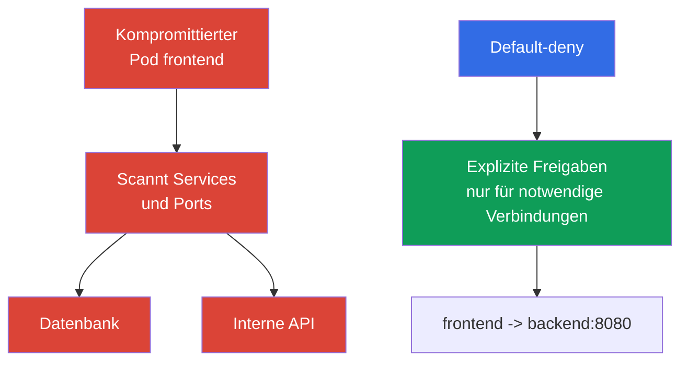

[Русская версия](ru.md) · [Eng version](README.md) · [Versión en español](es.md) · [Version française](fr.md) · [ქართული ვერსია](ge.md) · [繁體中文版](tw.md) · [日本語版](jp.md)

# Kapitel 13. Network Policy, Isolierung und Segmentierung

> **Wie geht es weiter.** In den Kapiteln über Authentifizierung, Pod Security Standards und `Secret` haben wir Identitäten, Berechtigungen und den Datenzugriff eingeschränkt. Nun beschränken wir Netzwerkpfade zwischen Workloads. `NetworkPolicy` hilft zu verhindern, dass die Kompromittierung eines `Pod` automatisch zu lateral movement im gesamten Cluster wird. Dieses Thema gehört zur KCSA-Domain Kubernetes Security Fundamentals mit einer Gewichtung von 22%. Die Beispiele beziehen sich auf Kubernetes `v1.36`.

## 13.1 `NetworkPolicy`: Warum default allow gefährlich ist und warum default-deny nötig ist

`NetworkPolicy` ist eine Kubernetes-API-Ressource, die zulässige eingehende (`Ingress`) und ausgehende (`Egress`) Netzwerkverbindungen für ausgewählte `Pod` beschreibt. Sie schützt eine Anwendung nicht vor einem Fehler im Code und ersetzt RBAC nicht, reduziert aber nach der Kompromittierung eines Workloads die Zahl verfügbarer Netzwerkpfade.

Kubernetes erstellt nicht automatisch eine default-deny-`NetworkPolicy`. Wenn ein `Pod` nicht durch eine anwendbare Policy für die jeweilige Richtung isoliert ist, ist der Datenverkehr in dieser Richtung üblicherweise erlaubt. Für den Übergang zu default-deny erstellt man eine explizite `NetworkPolicy`, die die benötigten Pods auswählt und keine erlaubenden ingress/egress rules für die ausgewählten `policyTypes` enthält. Anschließend fügen separate Policies nur die erforderlichen Datenflüsse hinzu.



**Default-deny** bedeutet, dass für die Datenverkehrsrichtung zunächst ein Standardverbot erstellt und danach schmale allow-Policies hinzugefügt werden. Die genaue Formulierung ist wichtig: Ein `Pod` wird für `Ingress` und `Egress` separat isoliert, wenn er von mindestens einer `NetworkPolicy` mit der entsprechenden Richtung in `policyTypes` ausgewählt wird.

`NetworkPolicy`-Policies sind **für einen ausgewählten `Pod` und eine Richtung** additiv: Wenn mehrere Policies auf seinen ingress oder egress angewendet werden, ist die erlaubte Menge von Verbindungen die Vereinigung der allow rules aller anwendbaren Policies. Es gibt keine Reihenfolge der Policies und keine separate deny-Regel mit der Priorität, "Verbieten vor Erlauben" anzuwenden.

Bei einer Verbindung `source Pod → destination Pod` werden beide Seiten unabhängig geprüft. Wenn der source `Pod` für `Egress` isoliert ist, müssen seine egress rules das Ziel erlauben. Wenn der destination `Pod` für `Ingress` isoliert ist, müssen seine ingress rules die Quelle erlauben. Wenn beide Seiten isoliert sind, ist die Verbindung nur möglich, wenn sie **sowohl durch den egress der Quelle als auch durch den ingress des Ziels** erlaubt wird.

Dieser Ansatz setzt least privilege im Netzwerk um. Er erfordert eine Inventarisierung der Abhängigkeiten: Eine Anwendung benötigt möglicherweise DNS, eine Datenbank, die API eines anderen Service, ein externes Zahlungs-Gateway oder einen Endpoint eines Cloud-Providers. Eine unvollständige allow-Policy kann die Anwendung beeinträchtigen, daher werden Änderungen geplant und überwacht, nicht blind hinzugefügt.

## 13.2 `Ingress`, `Egress`, Selektoren und minimales default-deny

`Ingress` beschreibt Datenverkehr **zu** ausgewählten `Pod`, während `Egress` Datenverkehr **von** ihnen beschreibt. In Regeln verwendet man Selektoren statt IP-Adressen einzelner `Pod`, da sich die Adressen bei einer Neuerstellung ändern:

| Mechanismus | Was er auswählt | Typischer Einsatz |
|---|---|---|
| `podSelector` | `Pod` mit angegebenen labels im selben `Namespace` | `frontend` den Zugriff auf `backend` erlauben |
| `namespaceSelector` | `Namespace` mit angegebenen labels | Datenverkehr aus dem namespace `monitoring` erlauben |
| `ipBlock` | CIDR-Bereich von IP-Adressen | außergewöhnlicher externer Endpoint oder Unternehmensnetzwerk |
| `ports` | Protokoll und Port | nur TCP 5432 für die Datenbank erlauben |

Wenn sich `podSelector` und `namespaceSelector` im selben Element von `from` oder `to` befinden, wirken sie als Schnittmenge: Passend sind `Pod` mit dem erforderlichen label **in** einem passenden `Namespace`. Wenn sie unterschiedliche Listenelemente sind, handelt es sich um alternative Quellen oder Ziele. Dieser Unterschied wird häufig in Fragen mit YAML geprüft.

Nachfolgend ein minimales Beispiel, das alle `Pod` im namespace `shop` auswählt und sie in beiden Richtungen isoliert. Die leeren Listen `ingress` und `egress` erlauben in diesen Richtungen keine Verbindungen.

```yaml
apiVersion: networking.k8s.io/v1
kind: NetworkPolicy
metadata:
  name: default-deny-ingress-egress
  namespace: shop
spec:
  podSelector: {}
  policyTypes:
    - Ingress
    - Egress
  ingress: []
  egress: []
```

Dies ist default-deny für Pod traffic, das die konkrete CNI-Implementierung über NetworkPolicy verarbeitet, und keine host firewall. Das Verhalten von `hostNetwork` Pods hängt vom network plugin ab; node/host traffic hat Sonderfälle. Daher darf eine gewöhnliche Kubernetes-`NetworkPolicy` nicht als universelle Zugriffskontrolle auf kubelet oder andere host endpoints betrachtet werden.

Nach dieser grundlegenden Regel werden separate Policies hinzugefügt. Beispielsweise kann `frontend` nur für den TCP-Port `8080` von `backend` freigegeben werden und `backend` nur für den Port der Datenbank. Für die Namensauflösung erlaubt man normalerweise separat egress zum DNS-Server des Clusters. Segmentierung sollte nicht durch eine Regel ersetzt werden, die sämtlichen Datenverkehr in `kube-system` erlaubt: Das erweitert die vertrauenswürdige Angriffsfläche stärker als erforderlich.

`NetworkPolicy` steuert Verbindungen auf den Netzwerkschichten L3/L4 innerhalb der unterstützten Implementierung: Quellen, Ziele, IPs und Ports. Sie interpretiert weder den HTTP-Benutzer, die SQL-Abfrage noch die Bedeutung der Anwendungsdaten.

## 13.3 Namespace-, Netzwerkgrenzen und multi-tenancy

`Namespace` ist für die Organisation von Ressourcen, Quotas, RBAC und Policies nützlich, aber allein keine Netzwerkgrenze. Ein `Pod` aus dem namespace `team-a` kann einen `Pod` aus `team-b` erreichen, wenn das Netzwerk es zulässt und keine anwendbare `NetworkPolicy` existiert. Ebenso verbietet ein namespace einem Benutzer keinen Zugriff über die API, wenn RBAC ihm die entsprechenden Rechte gewährt.

Daher wird die Isolierung einer multi-tenant Umgebung in Schichten aufgebaut:

| Grenze | Kontrolle | Welches Problem sie verringert |
|---|---|---|
| Identität und API | separate `ServiceAccount`, RBAC, admission | Lesen oder Ändern fremder Ressourcen |
| Namespace | separate namespace, `ResourceQuota`, `LimitRange` | Vermischung von Ressourcen und unkontrollierter Verbrauch |
| Netzwerk | default-deny und gezielte `NetworkPolicy` | Zugriff auf Services anderer tenant und lateral movement |
| Ausführung | PSS, `securityContext`, sandbox bei Bedarf | Ausbruch aus dem Container und gefährliche Berechtigungen |

Bei soft multi-tenancy teilen mehrere Teams einen Cluster, und der Schutz beruht auf korrektem RBAC, namespaces und Netzwerk-Policies. Das ist praktisch, aber ein Fehler in der gemeinsamen Infrastruktur oder eine weitreichende Rolle kann benachbarte tenant betreffen. Bei hohen Anforderungen an die Isolierung verwendet man eine stärkere Trennung: dedizierte Nodes, getrennte Cluster oder sandbox-Runtimes. Die Wahl hängt vom Wert der Daten, dem Vertrauen zwischen Teams und den akzeptablen Folgen eines Fehlers ab.

Die Segmentierung sollte die tatsächliche Architektur widerspiegeln, nicht nur die Teamnamen. Eine nützliche Frage für jede Verbindung lautet: Welcher `Pod` initiiert die Verbindung, zu welchem Service, über welchen Port, und ist die Verbindung wirklich in production erforderlich? Die Antwort bildet eine allowlist und deckt unerwartete Abhängigkeiten auf.

## 13.4 Rolle von CNI und Überblick über Cilium

Das Objekt `NetworkPolicy` gehört zur Kubernetes-API, aber Kubernetes selbst fängt keine Pakete ab. Ein CNI-Plugin oder seine Netzwerkkomponente erzwingt die Regeln. Daher beweist das Vorhandensein eines YAML-Objekts noch nicht, dass Datenverkehr beschränkt ist: Das gewählte CNI muss das enforcement von `NetworkPolicy` unterstützen und aktivieren. Dies muss in der Dokumentation und in einem Projekttest überprüft werden, insbesondere bei einem CNI-Wechsel.

Eine gewöhnliche Kubernetes-`NetworkPolicy` drückt L3/L4-Beziehungen aus: Zwischen welchen Identitäten oder Adressen ist Datenverkehr auf welchen Ports erlaubt? **Cilium** ist ein CNI, das eBPF verwendet und standardmäßige `NetworkPolicy` sowie eigene Policies unterstützt. Seine zusätzlichen Fähigkeiten sind nützlich, wenn Adresse und Port für den Schutz nicht ausreichen:

| Ebene | Beispiel für Cilium-Kontrolle | Wozu sie dient |
|---|---|---|
| L3 | Quelle oder Ziel nach identity | Gruppen von Workloads isolieren |
| L4 | TCP- oder UDP-Port | nur den Port des benötigten Service erlauben |
| L7 | HTTP-Methode, Pfad, Header | Zugriff auf bestimmte API-Operationen begrenzen |
| DNS-aware | Regeln für DNS-Namen, etwa `api.example.com` | egress zu einem externen Service eingrenzen, dessen IP sich ändert |

L7- und DNS-aware-Policies sind keine Fähigkeiten der grundlegenden `NetworkPolicy`-API; sie hängen von Cilium und dessen Konfiguration ab. L7-Kontrolle ist nicht nur in Cilium verfügbar: Cilium implementiert sie auf CNI-Ebene mit eBPF ohne sidecar-proxy, während service meshes (Istio, Linkerd) ein ähnliches Ergebnis auf Anwendungsebene über sidecar-proxy erreichen und dabei mTLS sowie telemetry hinzufügen (siehe Kapitel 18 über PKI, mTLS und service mesh). CNI-L7-Policies und service mesh ersetzen die Anwendungsprüfung nicht: `GET /healthz` auf L7 zu erlauben ist nützlicher als Zugriff auf den gesamten HTTP-Service, behebt aber keine Schwachstelle des Servers. Cilium bietet außerdem Beobachtbarkeit für Netzwerkentscheidungen, die dabei hilft zu verstehen, warum eine Verbindung erlaubt oder abgelehnt wurde.

### Was `NetworkPolicy` tut und was nicht

**Tut:** Steuert erlaubte ingress/egress connections für ausgewählte `Pod` durch CNI enforcement. **Tut nicht automatisch:** Sie verschlüsselt keinen Datenverkehr, authentifiziert keinen workload oder Benutzer, führt keine application-layer authorization aus, scannt kein image und begrenzt weder CPU noch RAM.

Die Verschlüsselung von Datenverkehr zwischen `Pod` ist eine von `NetworkPolicy` und CNI-L7-Filterung getrennte Aufgabe: Sie wird über TLS/mTLS auf Anwendungsebene oder über ein service mesh (beispielsweise Istio, Linkerd) gelöst, das sidecar-proxy, workload identity und mTLS ohne Änderungen am Anwendungscode hinzufügt (mehr dazu in Kapitel 18). `NetworkPolicy` und Cilium-L7-Policies können eine Verbindung erlauben oder verbieten, machen ihren Inhalt aber nicht vertraulich.

| Szenario | Beste Kontrolle | Nachweis |
|---|---|---|
| `frontend` darf keine TCP-Verbindung zur Datenbank öffnen | `NetworkPolicy` | inspection policy und Prüfung der erlaubten/verbotenen connection |
| `ServiceAccount` darf `Secret` nicht über die API lesen | RBAC | `kubectl auth can-i` und API audit event |
| Ein Pod muss ohne `privileged` starten | PSS/PSA oder admission policy | admission rejection/warn/audit |
| Zulässiger Datenverkehr benötigt kryptografischen Schutz | TLS/mTLS | certificate/handshake und configuration |

Diese Auswahl beginnt mit der Grenze: API permission, Objektparameter, network path, runtime process oder data in transit. `NetworkPolicy` ist nur für network path die präzise Antwort.

## 13.5 Praktische Anwendung

Man beginnt nicht mit einer Reihe zufälliger Regeln, sondern mit einer Übersicht der Flüsse: Client zu `frontend`, `frontend` zu `backend`, `backend` zur Datenbank, Workloads zu DNS und nur notwendige externe APIs. Für jeden namespace erstellt man default-deny für die benötigten Richtungen und führt dann minimale allow-Policies ein. Am besten geschieht dies schrittweise: zuerst Abhängigkeiten beobachten, dann weniger kritische Services beschränken und anschließend das Muster in den übrigen namespaces anwenden.

Labels werden Teil des Sicherheitsvertrags. Stabile labels wie `app: frontend`, `app: backend` und das namespace label `team: payments` ermöglichen es einer Policy, einem `Pod` statt seiner temporären IP zu folgen. Labels dürfen einem nicht vertrauenswürdigen Subjekt nicht ohne Kontrolle erteilt werden: Die Möglichkeit, ein label zu ändern, kann auch die Netzwerkzugehörigkeit eines Workloads ändern.

In production prüft man sowohl erwartete als auch verbotene Pfade: Erreichbarkeit der Anwendung, DNS, Metriken, Updates und das Fehlen von Zugriff auf benachbarte tenant. CNI-Logs oder die Beobachtbarkeit von Cilium helfen, eine abgelehnte legitime Verbindung zu finden. Solche Prüfungen ersetzen nicht die Policy selbst: Ihr Zweck ist zu bestätigen, dass die beabsichtigte allowlist der Architektur entspricht.

## 13.6 Exam vocabulary / Mini-Glossar

| Begriff | Bedeutung |
|---|---|
| `NetworkPolicy` | Kubernetes-API-Objekt, das erlaubte eingehende und ausgehende Verbindungen für ausgewählte `Pod` festlegt. |
| default-deny | Ansatz, bei dem Datenverkehr in einer ausgewählten Richtung verboten ist, bis eine explizite Policy ihn erlaubt. |
| `Ingress` | Richtung des Netzwerkverkehrs zu einem `Pod`. |
| `Egress` | Richtung des Netzwerkverkehrs von einem `Pod`. |
| CNI | Schnittstelle und Plugins, über die Kubernetes die Netzwerkverbindung von Containern herstellt; die CNI-Implementierung erzwingt Netzwerk-Policies. |
| multi-tenancy | Nutzung einer Plattform durch mehrere Teams oder Organisationen mit getrennten Zugriffen und Ressourcen. |
| L3/L4/L7 | Kontrollebenen: IP-Netzwerk, Transportports und Anwendungsprotokoll. |

## 13.7 Exam Essentials / Zusammenfassung des Kapitels

- Ohne anwendbare `NetworkPolicy` ist der Datenverkehr eines `Pod` normalerweise erlaubt; default-deny schafft den Ausgangspunkt für eine allowlist.
- `Ingress` und `Egress` werden unabhängig isoliert, und passende Policies addieren sich als Erlaubnisse.
- `podSelector` und `namespaceSelector` definieren die Netzwerkidentität über labels; ein `Namespace` ohne Policy ist keine Netzwerkgrenze.
- Multi-tenancy erfordert mehrere Schichten: RBAC, namespaces, Quotas, Netzwerk-Policies und Ausführungsbeschränkungen.
- Enforcement hängt vom CNI ab. Cilium unterstützt grundlegende Policies und kann L7- sowie DNS-aware-Kontrolle hinzufügen.

## 13.8 Nicht verwechseln und Auftreten in der Prüfung

KCSA-Fragen prüfen üblicherweise das Modell und nicht die Syntax eines großen Manifests. Man muss zwischen default allow und default-deny unterscheiden, die Richtung von `Ingress` und `Egress`, die Rolle von `podSelector` und `namespaceSelector` sowie die Tatsache verstehen, dass ein namespace keine automatische Netzwerkisolierung darstellt. Eine weitere Falle: `NetworkPolicy` wirkt nur, wenn das gewählte CNI enforcement unterstützt.

Wichtig ist auch, grundlegende `NetworkPolicy` nicht mit Cilium-Erweiterungen zu vermischen. Die grundlegende Policy beschränkt Quellen, Ziele und Ports, während L7-HTTP-Regeln und Regeln nach DNS-Namen zu den zusätzlichen Fähigkeiten von Cilium gehören. Bei der Auswahl der korrektesten Antwort sollte man nach der minimalen Kontrolle suchen, die den beschriebenen Datenverkehrspfad schließt.

## 13.9 Fragen zur Selbstkontrolle

### 1. Was beschreibt den Zustand eines `Pod`, der von keiner `NetworkPolicy` ausgewählt wird, am genauesten?

   - a. Nur Datenverkehr von einem `Pod` desselben namespace ist erlaubt, wenn CNI `NetworkPolicy` unterstützt.

   - b. Der `Pod` bleibt für die Richtung non-isolated, bis eine passende `NetworkPolicy` ihn isoliert und das CNI die Regeln anwendet.

   - c. Nur DNS und Datenverkehr zur Kubernetes-API sind erlaubt, alle anderen Verbindungen werden automatisch blockiert.

   - d. Kubernetes wendet automatisch default-deny ingress und egress auf jeden `Pod` ohne ausgewählte Policy an.

<details>
<summary>Antwort und Erklärung</summary>

**Richtige Antwort: b.** Kubernetes selbst erstellt nicht für jeden `Pod` default-deny. Die Beschränkung entsteht, wenn eine passende Policy die Richtung isoliert und das CNI sie anwendet.

</details>

### 2. Welche Wirkung hat eine `NetworkPolicy` mit `podSelector: {}`, `policyTypes: [Ingress, Egress]`, `ingress: []` und `egress: []` in einem namespace?

   - a. Sie wählt alle Pods des namespace aus und isoliert sie für die angegebenen Richtungen, bis passende additive policies den erforderlichen Datenverkehr explizit erlauben.
   - b. Sie blockiert die Kubernetes-API-authorization für alle Benutzer, die mit Objekten dieses namespace arbeiten.
   - c. Sie erlaubt den gesamten ingress und egress zwischen den Pods des namespace und verbietet gleichzeitig nur externen Datenverkehr.
   - d. Sie löscht ausgewählte Pods bei der ersten Netzwerkverbindung, die keiner erlaubenden Regel entspricht.

<details>
<summary>Antwort und Erklärung</summary>

**Richtige Antwort: a.** Der leere `podSelector` wählt alle Pods des namespace aus, und leere ingress/egress rules fügen für die entsprechenden Richtungen keine Erlaubnisse hinzu. Andere passende NetworkPolicy können bestimmten Datenverkehr additiv erlauben. Tatsächliches enforcement erfordert, dass das verwendete CNI NetworkPolicy unterstützt.

</details>

### 3. Welche Aussage über namespace ist für die Netzwerksegmentierung korrekt?

   - a. Datenverkehr zwischen namespaces ist unmöglich, wenn sich die Namen der namespaces unterscheiden.

   - b. `Namespace` organisiert Ressourcen, aber eine anwendbare `NetworkPolicy` schafft die Netzwerkgrenze.

   - c. `Namespace` ersetzt RBAC und `NetworkPolicy`.

   - d. `Namespace` blockiert für sich genommen Datenverkehr zwischen namespaces.

<details>
<summary>Antwort und Erklärung</summary>

**Richtige Antwort: b.** Namespace ist für Ressourcen- und Zugriffsverwaltung nützlich, filtert aber nicht automatisch Pakete. Für Netzwerksegmentierung werden vom CNI erzwungene Policies benötigt.

</details>

### 4. Welche Bedingung ist erforderlich, damit ein Kubernetes-`NetworkPolicy`-Objekt Datenverkehr tatsächlich beschränkt?

   - a. Alle `Pod` müssen `hostNetwork` verwenden.

   - b. Im Cluster muss ein service mesh installiert sein.

   - c. Das ausgewählte CNI muss `NetworkPolicy` unterstützen und durchsetzen.

   - d. Jeder `Pod` muss eine statische IP-Adresse haben.

<details>
<summary>Antwort und Erklärung</summary>

**Richtige Antwort: c.** Kubernetes speichert das Policy-Objekt in der API, aber das CNI setzt die Netzwerkregeln durch. Ein service mesh kann eine andere Kontrollebene bereitstellen, ist aber für eine grundlegende `NetworkPolicy` nicht erforderlich.

</details>

### 5. Welche Fähigkeit gehört eher zu Cilium-Erweiterungen als zur grundlegenden Kubernetes-`NetworkPolicy`?

   - a. HTTP-Datenverkehr auf eine bestimmte Methode/einen bestimmten Pfad beschränken oder eine egress policy anhand der DNS/FQDN-Semantik festlegen.
   - b. Einen `Pod` anhand eines label auswählen und ihm TCP-Datenverkehr zu einem bestimmten destination port erlauben.
   - c. `namespaceSelector` und `podSelector` verwenden, um eine zulässige ingress-Quelle für einen workload auszuwählen.
   - d. `ipBlock` mit CIDR verwenden, um Datenverkehr zu einem bestimmten IP-Adressbereich zu erlauben.

<details>
<summary>Antwort und Erklärung</summary>

**Richtige Antwort: a.** Die grundlegende Kubernetes-`NetworkPolicy` arbeitet mit L3/L4-Selektoren, Richtungen, IP-Blöcken und Ports. Cilium fügt Fähigkeiten höherer Ebene hinzu, einschließlich L7-HTTP-Policy und FQDN/DNS-basierter egress controls.

</details>

> **Wie geht es weiter.** Für das praktische Design von default-deny- und allow-Policies lesen Sie Kapitel 04 CKS über `NetworkPolicy`. Der Schutz von metadata-Services und betrieblichen endpoints wird in Kapitel 05 CKS behandelt und L3/L4/L7- sowie DNS-aware-Policies von Cilium in Kapitel 06 CKS. Für die administrative Grundlage des `Pod`-Netzwerks und CNI ist Kapitel 34 CKA nützlich.

[Inhaltsverzeichnis](../README_DE.md) · [Kapitel 12](../12/de.md) · [Kapitel 14](../14/de.md)
