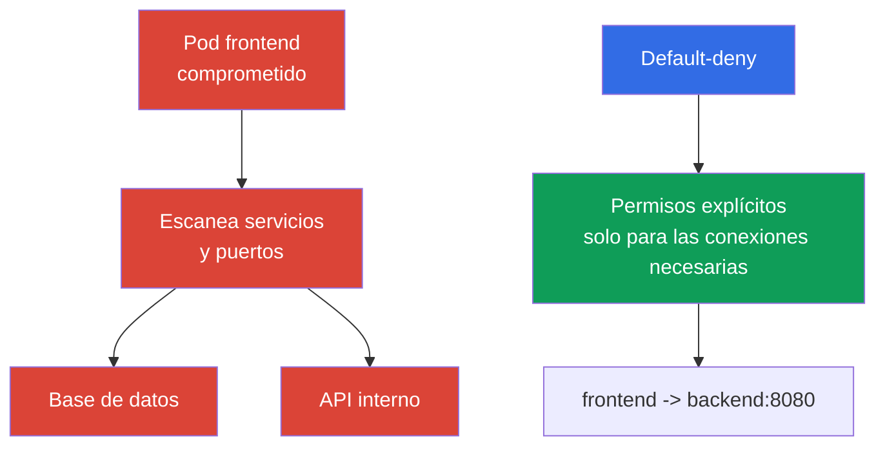

[Русская версия](ru.md) · [Eng version](README.md) · [Version française](fr.md) · [Deutsche Version](de.md) · [ქართული ვერსია](ge.md) · [繁體中文版](tw.md) · [日本語版](jp.md)

# Capítulo 13. Network Policy, aislamiento y segmentación

> **Qué sigue.** En los capítulos sobre autenticación, Pod Security Standards y `Secret` limitamos identidades, privilegios y acceso a los datos. Ahora limitaremos las rutas de red entre cargas de trabajo. `NetworkPolicy` ayuda a evitar que la vulneración de un `Pod` se convierta automáticamente en lateral movement por todo el clúster. Este es un tema del dominio KCSA Kubernetes Security Fundamentals con un peso del 22%. Los ejemplos están orientados a Kubernetes `v1.36`.

## 13.1 `NetworkPolicy`: por qué default allow es peligroso y para qué sirve default-deny

`NetworkPolicy` es un recurso de API de Kubernetes que describe las conexiones de red entrantes (`Ingress`) y salientes (`Egress`) permitidas para los `Pod` seleccionados. No protege la aplicación frente a un error en el código ni sustituye RBAC, pero reduce el número de rutas de red disponibles tras la vulneración de una carga de trabajo.

Kubernetes no crea automáticamente una `NetworkPolicy` default-deny. Si un `Pod` no está aislado mediante una política aplicable para una dirección concreta, el tráfico en esa dirección suele estar permitido. Para pasar a default-deny, se crea una `NetworkPolicy` explícita que selecciona los Pods necesarios y no contiene ingress/egress rules permisivas para los `policyTypes` seleccionados; después, políticas independientes agregan únicamente los flujos necesarios.



**Default-deny** significa que primero se crea una denegación predeterminada para la dirección de tráfico y luego se agregan políticas allow específicas. Es importante formularlo con precisión: un `Pod` se aísla por separado para `Ingress` y `Egress` cuando lo selecciona al menos una `NetworkPolicy` con la dirección correspondiente en `policyTypes`.

Las políticas `NetworkPolicy` son aditivas **para un `Pod` seleccionado y una dirección**: si se aplican varias políticas a su ingress o egress, el conjunto de conexiones permitido es la unión de las allow rules de todas las políticas aplicables. No existe orden de políticas ni una deny rule independiente con prioridad para "denegar por encima de permitir".

Para una conexión `source Pod → destination Pod`, ambos lados se verifican de forma independiente. Si el `Pod` de origen está aislado para `Egress`, sus egress rules deben permitir el destino. Si el `Pod` de destino está aislado para `Ingress`, sus ingress rules deben permitir el origen. Cuando ambos lados están aislados, la conexión solo es posible si la permiten **tanto el egress del origen como el ingress del destino**.

Este enfoque implementa least privilege en la red. Requiere inventariar las dependencias: una aplicación puede necesitar DNS, una base de datos, la API de otro servicio, una pasarela de pagos externa o un endpoint de proveedor cloud. Una política allow incompleta puede interrumpir el funcionamiento de la aplicación, por lo que el cambio se planifica y se observa, no se agrega a ciegas.

## 13.2 `Ingress`, `Egress`, selectores y default-deny mínimo

`Ingress` describe el tráfico **hacia** los `Pod` seleccionados, y `Egress` el tráfico **desde** ellos. En las reglas se usan selectores, no direcciones IP de `Pod` individuales, porque las direcciones cambian al recrearse:

| Mecanismo | Qué selecciona | Uso típico |
|---|---|---|
| `podSelector` | `Pod` con los labels indicados en el mismo `Namespace` | permitir que `frontend` acceda a `backend` |
| `namespaceSelector` | `Namespace` con los labels indicados | permitir tráfico desde el namespace `monitoring` |
| `ipBlock` | rango CIDR de direcciones IP | endpoint externo excepcional o red corporativa |
| `ports` | protocolo y puerto | permitir solo TCP 5432 para la base de datos |

Si `podSelector` y `namespaceSelector` están en el mismo elemento de `from` o `to`, funcionan como una intersección: coinciden los `Pod` con el label requerido **en** un `Namespace` coincidente. Si son elementos distintos de la lista, son orígenes o destinos alternativos. Esta diferencia suele comprobarse en preguntas con YAML.

A continuación se muestra un ejemplo mínimo que selecciona todos los `Pod` del namespace `shop` y los aísla en ambas direcciones. Las listas vacías `ingress` y `egress` no permiten conexiones en esas direcciones.

```yaml
apiVersion: networking.k8s.io/v1
kind: NetworkPolicy
metadata:
  name: default-deny-ingress-egress
  namespace: shop
spec:
  podSelector: {}
  policyTypes:
    - Ingress
    - Egress
  ingress: []
  egress: []
```

Esto es default-deny para el Pod traffic que una implementación CNI concreta procesa mediante NetworkPolicy, no mediante un host firewall. El comportamiento de los Pods `hostNetwork` depende del network plugin; el tráfico de node/host tiene casos especiales. Por tanto, la `NetworkPolicy` normal de Kubernetes no debe considerarse un control de acceso universal para kubelet u otros host endpoints.

Después de esta regla base se agregan políticas independientes. Por ejemplo, a `frontend` se le puede permitir únicamente el puerto TCP `8080` de `backend`, y a `backend` solamente el puerto de la base de datos. Para operar por nombres, normalmente se permite por separado el egress al servidor DNS del clúster. No se debe sustituir la segmentación con una regla que permita todo el tráfico a `kube-system`: esto amplía la superficie de confianza más de lo necesario.

`NetworkPolicy` controla conexiones en los niveles de red L3/L4 dentro de la implementación compatible: orígenes, destinos, IP y puertos. No interpreta el usuario HTTP, una consulta SQL ni el significado de los datos de la aplicación.

## 13.3 Límites de namespace, red y multi-tenancy

`Namespace` es útil para organizar recursos, cuotas, RBAC y políticas, pero por sí solo no es un muro de red. Un `Pod` del namespace `team-a` puede acceder a un `Pod` de `team-b` si la red lo permite y no hay una `NetworkPolicy` aplicable. De igual modo, un namespace no impide el acceso de un usuario mediante la API si RBAC le concede los permisos correspondientes.

Por ello, el aislamiento de un entorno multi-tenant se construye por capas:

| Límite | Control | Qué problema reduce |
|---|---|---|
| Identidad y API | `ServiceAccount` independientes, RBAC, admission | lectura o modificación de recursos ajenos |
| Namespace | namespace separados, `ResourceQuota`, `LimitRange` | mezcla de recursos y consumo no controlado |
| Red | default-deny y `NetworkPolicy` específicas | acceso a servicios de otro tenant y lateral movement |
| Ejecución | PSS, `securityContext`, sandbox cuando sea necesario | escape del contenedor y privilegios peligrosos |

En soft multi-tenancy, varios equipos comparten un clúster y la protección se basa en RBAC, namespace y políticas de red correctos. Es conveniente, pero un error en la infraestructura compartida o un rol amplio puede afectar a un tenant vecino. Cuando los requisitos de aislamiento son altos, se emplea una separación más fuerte: nodos dedicados, clústeres separados o runtimes sandbox. La elección depende del valor de los datos, la confianza entre equipos y las consecuencias admisibles de un error.

La segmentación debe reflejar la arquitectura real, no solo los nombres de los equipos. Una pregunta útil para cada conexión es: qué `Pod` inicia la conexión, a qué servicio, en qué puerto y si realmente se requiere en production. La respuesta forma una allowlist y revela dependencias inesperadas.

## 13.4 El papel de CNI y una visión general de Cilium

El objeto `NetworkPolicy` forma parte de la API de Kubernetes, pero Kubernetes no intercepta paquetes por sí mismo. La aplicación de las reglas la proporciona el plugin CNI o su componente de red. Por eso, la presencia de un objeto YAML todavía no demuestra que el tráfico esté restringido: el CNI seleccionado debe admitir y activar el enforcement de `NetworkPolicy`. Esto debe verificarse en la documentación y en una prueba del proyecto, especialmente al cambiar de CNI.

Una `NetworkPolicy` normal de Kubernetes expresa relaciones L3/L4: entre qué identidades o direcciones se permite el tráfico y en qué puertos. **Cilium** es un CNI que utiliza eBPF y admite `NetworkPolicy` estándar, además de sus propias políticas. Sus capacidades adicionales son útiles cuando la dirección y el puerto no bastan para la protección:

| Nivel | Ejemplo de control Cilium | Para qué sirve |
|---|---|---|
| L3 | origen o destino por identity | aislar grupos de cargas de trabajo |
| L4 | puerto TCP o UDP | permitir solo el puerto del servicio necesario |
| L7 | método HTTP, ruta, encabezado | limitar el acceso a operaciones API concretas |
| DNS-aware | reglas para nombres DNS, por ejemplo `api.example.com` | restringir el egress a un servicio externo cuya IP cambia |

Las políticas L7 y DNS-aware no son capacidades de la API básica `NetworkPolicy`; dependen de Cilium y su configuración. El control L7 no es exclusivo de Cilium: lo implementa en el nivel CNI mediante eBPF sin sidecar-proxy, mientras que los service meshes (Istio, Linkerd) logran un resultado parecido en el nivel de aplicación mediante sidecar-proxy, añadiendo además mTLS y telemetry (véase el capítulo 18 sobre PKI, mTLS y service mesh). Las políticas L7 de CNI y service mesh no sustituyen la comprobación de la aplicación: permitir `GET /healthz` en L7 es más útil que acceder a todo el servicio HTTP, pero no corregirá una vulnerabilidad del servidor. Cilium también proporciona observabilidad de las decisiones de red, lo cual ayuda a entender por qué una conexión se permite o se rechaza.

### Qué hace y qué no hace `NetworkPolicy`

**Hace:** regula las ingress/egress connections permitidas para los `Pod` seleccionados mediante CNI enforcement. **No hace automáticamente:** no cifra el tráfico, no autentica la workload o al usuario, no realiza application-layer authorization, no analiza una image ni limita CPU/RAM.

El cifrado del tráfico entre `Pod` es una tarea independiente de `NetworkPolicy` y del filtrado L7 de CNI: se resuelve mediante TLS/mTLS en el nivel de aplicación o mediante un service mesh (por ejemplo, Istio, Linkerd), que añade sidecar-proxy, workload identity y mTLS sin cambiar el código de la aplicación (más detalles en el capítulo 18). `NetworkPolicy` y las políticas L7 de Cilium pueden permitir o denegar una conexión, pero no hacen confidencial su contenido.

| Escenario | Mejor control | Evidencia |
|---|---|---|
| `frontend` no debe abrir una conexión TCP a database | `NetworkPolicy` | inspection policy y comprobación de connection permitida/denegada |
| `ServiceAccount` no debe leer `Secret` mediante la API | RBAC | `kubectl auth can-i` y API audit event |
| Un Pod debe iniciarse sin `privileged` | PSS/PSA o admission policy | admission rejection/warn/audit |
| Se necesita protección criptográfica para el tráfico permitido | TLS/mTLS | certificate/handshake y configuration |

Esta elección comienza con el límite: API permission, parámetro de objeto, network path, runtime process o data in transit. `NetworkPolicy` es una respuesta precisa solo para network path.

## 13.5 Cómo se aplica en la práctica

No se empieza con un conjunto de reglas aleatorias, sino con un mapa de flujos: cliente a `frontend`, `frontend` a `backend`, `backend` a la base de datos, cargas de trabajo a DNS y solo las API externas necesarias. Para cada namespace se crea default-deny para las direcciones necesarias y luego se introducen políticas allow mínimas. Es más conveniente hacerlo por etapas: primero observar las dependencias, después restringir los servicios menos críticos y, por último, aplicar el patrón en los demás namespace.

Los labels se convierten en parte del contrato de seguridad. Labels estables como `app: frontend`, `app: backend` y el label de namespace `team: payments` permiten que la política siga al `Pod`, no a su IP temporal. Los labels no deben concederse a un sujeto no confiable sin control: la capacidad de cambiar un label también puede cambiar la pertenencia de red de una carga de trabajo.

En production se verifican tanto las rutas esperadas como las prohibidas: disponibilidad de la aplicación, DNS, métricas, actualizaciones y ausencia de acceso al tenant vecino. Los registros de CNI o la observabilidad de Cilium ayudan a encontrar una conexión legítima denegada. Estas comprobaciones no sustituyen la política en sí: su objetivo es confirmar que la allowlist prevista se corresponde con la arquitectura.

## 13.6 Exam vocabulary / Mini-glosario

| Término | Significado |
|---|---|
| `NetworkPolicy` | Objeto de API de Kubernetes que define las conexiones entrantes y salientes permitidas para los `Pod` seleccionados. |
| default-deny | enfoque en el que se prohíbe el tráfico en la dirección seleccionada hasta que una política explícita lo permite. |
| `Ingress` | dirección del tráfico de red hacia un `Pod`. |
| `Egress` | dirección del tráfico de red desde un `Pod`. |
| CNI | interfaz y plugins mediante los cuales Kubernetes conecta la red de los contenedores; la implementación CNI aplica las políticas de red. |
| multi-tenancy | uso de una misma plataforma por varios equipos u organizaciones con separación de acceso y recursos. |
| L3/L4/L7 | niveles de control: red IP, puertos de transporte y protocolo de aplicación. |

## 13.7 Exam Essentials / Resumen del capítulo

- Sin una `NetworkPolicy` aplicable, el tráfico de `Pod` suele estar permitido; default-deny crea el punto de partida para una allowlist.
- `Ingress` y `Egress` se aíslan de forma independiente, y las políticas coincidentes se combinan como permisos.
- `podSelector` y `namespaceSelector` definen la identidad de red mediante labels; un `Namespace` sin política no es un límite de red.
- Multi-tenancy requiere varias capas: RBAC, namespace, cuotas, políticas de red y restricciones de ejecución.
- El enforcement depende del CNI. Cilium admite las políticas básicas y puede añadir control L7 y DNS-aware.

## 13.8 No confundir y cómo aparece en el examen

Las preguntas de KCSA suelen evaluar el modelo, no la sintaxis de un manifiesto grande. Hay que distinguir default allow y default-deny, comprender la dirección de `Ingress` y `Egress`, el papel de `podSelector` y `namespaceSelector`, así como el hecho de que un namespace no proporciona aislamiento de red automático. Una trampa aparte es que `NetworkPolicy` solo tiene efecto si el CNI seleccionado admite el enforcement.

También es importante no confundir la `NetworkPolicy` básica con las extensiones de Cilium. La política básica limita orígenes, destinos y puertos, mientras que las reglas HTTP L7 y las reglas por nombre DNS pertenecen a capacidades adicionales de Cilium. Al elegir la respuesta más correcta, busque el control mínimo que cierre la ruta de tráfico descrita.

## 13.9 Preguntas de autoevaluación

### 1. ¿Qué describe con mayor precisión el estado de un `Pod` que no está seleccionado por ninguna `NetworkPolicy`?

   - a. Solo se permite el tráfico desde un `Pod` del mismo namespace si el CNI admite `NetworkPolicy`.

   - b. El `Pod` permanece non-isolated para la dirección hasta que una `NetworkPolicy` coincidente lo aísle y el CNI aplique las reglas.

   - c. Solo se permiten DNS y el tráfico hacia la API de Kubernetes; las demás conexiones se bloquean automáticamente.

   - d. Kubernetes aplica automáticamente default-deny ingress y egress a cada `Pod` sin una política seleccionada.

<details>
<summary>Respuesta y explicación</summary>

**Respuesta correcta: b.** Kubernetes no crea por sí mismo default-deny para cada `Pod`. La restricción aparece cuando una política coincidente aísla la dirección y el CNI la aplica.

</details>

### 2. ¿Qué efecto tiene una `NetworkPolicy` con `podSelector: {}`, `policyTypes: [Ingress, Egress]`, `ingress: []` y `egress: []` en un namespace?

   - a. Selecciona todos los Pods del namespace y los aísla para las direcciones indicadas, hasta que las additive policies coincidentes permitan explícitamente el tráfico necesario.
   - b. Bloquea Kubernetes API authorization para todos los usuarios que trabajan con objetos de este namespace.
   - c. Permite todo el ingress y egress entre los Pods del namespace, a la vez que prohíbe únicamente el tráfico externo.
   - d. Elimina los Pods seleccionados en la primera conexión de red que no coincida con una regla permisiva.

<details>
<summary>Respuesta y explicación</summary>

**Respuesta correcta: a.** El `podSelector` vacío selecciona todos los Pods del namespace, y las ingress/egress rules vacías no agregan permisos para las direcciones correspondientes. Otras NetworkPolicy coincidentes pueden permitir aditivamente tráfico concreto. El enforcement real requiere que el CNI usado admita NetworkPolicy.

</details>

### 3. ¿Qué afirmación sobre namespace es correcta para la segmentación de red?

   - a. El tráfico entre namespace es imposible si los nombres de los namespace son diferentes.

   - b. `Namespace` organiza recursos, pero una `NetworkPolicy` aplicable crea el límite de red.

   - c. `Namespace` sustituye RBAC y `NetworkPolicy`.

   - d. `Namespace` por sí solo bloquea el tráfico entre espacios.

<details>
<summary>Respuesta y explicación</summary>

**Respuesta correcta: b.** Un namespace es útil para gestionar recursos y acceso, pero no filtra paquetes automáticamente. Para la separación de red se necesitan políticas aplicadas por el CNI.

</details>

### 4. ¿Qué condición es necesaria para que un objeto Kubernetes `NetworkPolicy` limite realmente el tráfico?

   - a. Todos los `Pod` deben usar `hostNetwork`.

   - b. Debe instalarse un service mesh en el clúster.

   - c. El CNI seleccionado debe admitir y aplicar `NetworkPolicy`.

   - d. Cada `Pod` debe tener una dirección IP estática.

<details>
<summary>Respuesta y explicación</summary>

**Respuesta correcta: c.** Kubernetes almacena el objeto de política en la API, pero la aplicación de red la realiza el CNI. Un service mesh puede proporcionar otro nivel de control, pero no es obligatorio para una `NetworkPolicy` básica.

</details>

### 5. ¿Qué capacidad debe atribuirse con mayor precisión a las extensiones de Cilium, y no a la `NetworkPolicy` básica de Kubernetes?

   - a. Restringir el tráfico HTTP por método/ruta concretos o definir una egress policy con semántica DNS/FQDN.
   - b. Seleccionar un `Pod` por label y permitirle tráfico TCP a un destination port concreto.
   - c. Usar `namespaceSelector` y `podSelector` para seleccionar un origen de ingress permitido para una workload.
   - d. Usar `ipBlock` con CIDR para permitir tráfico a un rango concreto de direcciones IP.

<details>
<summary>Respuesta y explicación</summary>

**Respuesta correcta: a.** La `NetworkPolicy` básica de Kubernetes funciona con selectores L3/L4, direcciones, bloques IP y puertos. Cilium añade capacidades de mayor nivel, incluidas la política HTTP L7 y los controles de egress basados en FQDN/DNS.

</details>

> **Adónde seguir.** Para el diseño práctico de políticas default-deny y allow, estudie el capítulo 04 de CKS sobre `NetworkPolicy`. La protección de los servicios de metadata y los endpoints de servicio se trata en el capítulo 05 de CKS, y las políticas L3/L4/L7 y DNS-aware de Cilium en el capítulo 06 de CKS. Para la base administrativa de la red de `Pod` y CNI, resulta útil el capítulo 34 de CKA.

[Índice](../README_ES.md) · [Capítulo 12](../12/es.md) · [Capítulo 14](../14/es.md)
